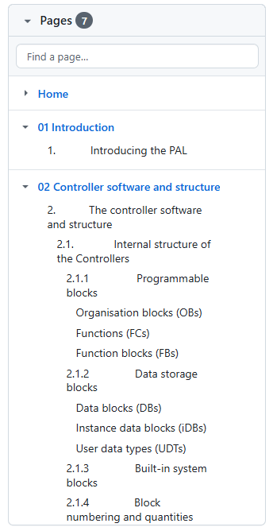

<a name="idtop"></a><!-- 🟢TOP OF PAGE - MARKER  (BLANK LINE BELOW)   -->

<!-- 🟢TOP OF PAGE - LOGO IMAGE -->
<p align="right"></p>      <!-- 🟢TOP OF PAGE - WEB ID     --> 

# 1<!--         🟥H1🟥-->Introducing the GitHub Wiki

GitHub introduced Wikis in 2008 and they are available to every repository on GitHub (both public and private) and are accessed by clicking the Wiki button in the main navigation bar of the repository:

<table name="f-01-01" align="center"><!-- FIGURE START🔽🔽(BLANK LINE ABOVE) -->
<!-- Figure row --> <tr><td>
<!-- LINK -->         <a href="../01-0000/02-images/figm-01-01.png" title="Use ctrl+click to open image in new tab">
<!-- FIGURE -->         
                    </a></td></tr>
<!-- CAPTION -->    <tr><th align="center"><sup>
<!-- CAPTION TEXT -->   Figure 1.1 &mdash; Accessing a Wiki
                    </sup></th></tr>
</table>                             <!-- FIGURE END  🔼🔼(BLANK LINE BELOW) -->

GitHub Wikis are individual to each repository and are designed to host the detailed documentation for that repository. The idea being that the documentation that lives in the repository (usually the `README.md` file) is generally used as a short introduction to the repository, explaining the purpose of the repository and providing a quick guide to how it should be used, what its requirements are and other basic information.
Or, as GitHub put it:

```math
\color{#0969DA}
\begin{vmatrix}
A\ README\ should\ contain\ only\ the\ necessary\ information\ for\ developers\ to\ get\ started\\
using\ and\ contributing\ to\ your\ project.\ Longer\ documentation\ is\ best\ suited\ for\ Wikis.\ \
\end{vmatrix}
```

<br>

It would certainly be possible to fully document a repository by adding further document files into the repository itself *(there is nothing to stop you doing so)*, a repository will accommodate as many Markdown files (`.md` files) as you like. **It is not, however, good practice to do this**.

By keeping the full documentation files within the repository, it means that every change to the documentation becomes a change to the repository itself *(with all the required commits and comments)*. If the documentation is extensive (it may for example be an instruction manual or complete tutorial for the software within the project), and was contained within the main repository, there could be as many commits and branches for the documentation as there are for the software project itself.

**It is better to keep the project documentation separate from the repository software**. By doing so, changes to the software within the main repository and the maintenance of the documentation associated with the repository do not interfere with each other.

This is the purpose of the GitHub Wiki. The Wiki is attached to a particular repository, but changes to the Wiki do not add commits or changes to the repository itself. 

**Think of the Wiki as a document package (a set of pages) that accompany a particular repository**.

**[:arrow_up: Top](#idtop)**<!-- END OF SECTION - LINK TO TOP🔽🔽(BLANK LINE ABOVE) -->
<HR>                        <!-- END OF SECTION - SEPARATING LINE                    -->
<br>                        <!-- END OF SECTION - PADDING    🔼🔼(BLANK LINE BELOW) -->

## 1.1<!--      🟥H2🟥-->What are GitHub Wiki pages?

GitHub Wikis are simply a set of pages where the documentation for a repository can be stored.
GitHub Wiki pages are constructed using the same Markdown language used in  `README.md` files (more or less, there are some minor differences<a name="rn-01" href="#fn-01"><!-- 🟨FOOTNOTE LINK🟨--><sup>💠1</sup></a>).

Every repository in GitHub can have Wiki pages, it’s a built-in function of GitHub. The Wiki option appears in the top bar of the repository, point 1 in the figure below:

<table name="f-01-02" align="center"><!-- FIGURE START🔽🔽(BLANK LINE ABOVE) -->
<!-- Figure row --> <tr><td>
<!-- LINK -->         <a href="../01-0000/02-images/figm-01-02.png" title="Use ctrl+click to open image in new tab">
<!-- FIGURE -->         
                    </a></td></tr>
<!-- CAPTION -->    <tr><th align="center"><sup>
<!-- CAPTION TEXT -->   Figure 1.2 &mdash; Accessing a Wiki and its settings
                    </sup></th></tr>
</table>                             <!-- FIGURE END  🔼🔼(BLANK LINE BELOW) -->

Wiki pages are enabled for a new repository by default, but can be disabled if required.

To disable the Wiki option for a repository, click ${\large\color{#00B050}\langle\text{Settings}\rangle}$, point &#x2461; in the figure above, select ${\large\color{#00B050}\langle\text{General}\rangle}$ in the left-hand menu bar and then in the ${\large \color{#00B050}\langle\text{Features}\rangle}$ area (main section) untick the ${\large \color{#00B050}\langle\text{Wikis}\rangle}$ box:

<table name="f-01-03" align="center"><!-- FIGURE START🔽🔽(BLANK LINE ABOVE) -->
<!-- Figure row --> <tr><td>
<!-- LINK -->         <a href="../01-0000/02-images/figm-01-03.png" title="Use ctrl+click to open image in new tab">
<!-- FIGURE -->         
                    </a></td></tr>
<!-- CAPTION -->    <tr><th align="center"><sup>
<!-- CAPTION TEXT -->   Figure 1.3 &mdash; Disabling a Wiki
                    </sup></th></tr>
</table>                             <!-- FIGURE END  🔼🔼(BLANK LINE BELOW) -->

The second option here determines who can modify the Wiki. By default this is restricted to those users that are able to *push* changes to the main repository. 

**Unticking this box is not recommended and allows anyone to edit and change the Wiki.**

> [!IMPORTANT]<!-- IMPORTANT ALERT -->
> **Disabling a Wiki does not delete it, it simply stops it being accessed. Re-enabling a disabled Wiki will put it back just as it was (it is even possible to push changes to a disabled Wiki from a local repository).**


**[:arrow_up: Top](#idtop)**<!-- END OF SECTION - LINK TO TOP🔽🔽(BLANK LINE ABOVE) -->
<HR>                        <!-- END OF SECTION - SEPARATING LINE                    -->
<br>                        <!-- END OF SECTION - PADDING    🔼🔼(BLANK LINE BELOW) -->

## 1.2<!--      🟥H2🟥-->Understanding the Wiki pages

The way the Wiki pages work and the way they link to a repository takes a bit of getting used to. 

In its simplest form a GitHub Wiki document is just a markdown file (just like `README.md`) that lives in a separate area of a GitHub repository. In practice *(and this can be slightly hard to grasp)* it doesn’t actually get stored in the main repository (although it has the same start to its URL). For example, the `README.md` file in the [PS2001 PAL Software](https://github.com/practicalseries/PS2001-pal-software/) repository has the following URL:

&emsp;&emsp;&emsp;<!---🟡ENTER URL🟡-->https://github.com/practicalseries/PS2001-pal-software/blob/master/README.md

The home (landing) page for the Wiki documents for the same repository is:

&emsp;&emsp;&emsp;<!---🟡ENTER URL🟡-->https://github.com/practicalseries/PS2001-pal-software/wiki

They both start with:

&emsp;&emsp;&emsp;`https://github.com/practicalseries/PS2001-pal-software/`

but the main repository is in the folder `/blob/`, the Wiki files are under a different folder `/wiki/`. This `wiki` folder is completely separate to the main folder.

If you were to clone *(“fork” in GitHub terminology)* the PS2001 PAL software repository to a local machine, **the Wiki files would not be present within the local repository**.

The Wiki pages are in fact a repository in their own right, they are associated with the main repository (PS2001-pal-software in this case) but are not part of it.

**[:arrow_up: Top](#idtop)**<!-- END OF SECTION - LINK TO TOP🔽🔽(BLANK LINE ABOVE) -->
<HR>                        <!-- END OF SECTION - SEPARATING LINE                    -->
<br>                        <!-- END OF SECTION - PADDING    🔼🔼(BLANK LINE BELOW) -->

## 1.3<!--      🟥H2🟥-->Creating a Wiki for a repository

This bit is easy. To create a Wiki for a repository, all that is necessary is to create the first page *(I actually think the structure for the Wiki is created when the main repository is created, it just doesn’t have any pages in it)*.

To create the Wiki, just create the first page (below):

**[:arrow_up: Top](#idtop)**<!-- END OF SECTION - LINK TO TOP🔽🔽(BLANK LINE ABOVE) -->
<HR>                        <!-- END OF SECTION - SEPARATING LINE                    -->
<br>                        <!-- END OF SECTION - PADDING    🔼🔼(BLANK LINE BELOW) -->

### 1.3.1<!--   🟥H3🟥-->Creating the first Wiki page

In the main repository, click the ${\large \color{#00B050}\langle\text{Wiki}\rangle}$ link at the top.

<table name="f-01-04" align="center"><!-- FIGURE START🔽🔽(BLANK LINE ABOVE) -->
<!-- Figure row --> <tr><td>
<!-- LINK -->         <a href="../01-0000/02-images/figm-01-04.png" title="Use ctrl+click to open image in new tab">
<!-- FIGURE -->         
                    </a></td></tr>
<!-- CAPTION -->    <tr><th align="center"><sup>
<!-- CAPTION TEXT -->   Figure 1.4 &mdash; Creating a Wiki
                    </sup></th></tr>
</table>                             <!-- FIGURE END  🔼🔼(BLANK LINE BELOW) -->

This opens the create first page screen:

<table name="f-01-05" align="center"><!-- FIGURE START🔽🔽(BLANK LINE ABOVE) -->
<!-- Figure row --> <tr><td>
<!-- LINK -->         <a href="../01-0000/02-images/figm-01-05.png" title="Use ctrl+click to open image in new tab">
<!-- FIGURE -->         
                    </a></td></tr>
<!-- CAPTION -->    <tr><th align="center"><sup>
<!-- CAPTION TEXT -->   Figure 1.5 &mdash; Create the first page
                    </sup></th></tr>
</table>                             <!-- FIGURE END  🔼🔼(BLANK LINE BELOW) -->

Click ${\large \color{#00B050}\langle\text{Create\ the\ first\ page}\rangle}$ button:

This creates the main page of the Wiki; this page is always called *Home* (it’s actually called `Home.md`):

<table name="f-01-06" align="center"><!-- FIGURE START🔽🔽(BLANK LINE ABOVE) -->
<!-- Figure row --> <tr><td>
<!-- LINK -->         <a href="../01-0000/02-images/figm-01-06.png" title="Use ctrl+click to open image in new tab">
<!-- FIGURE -->         
                    </a></td></tr>
<!-- CAPTION -->    <tr><th align="center"><sup>
<!-- CAPTION TEXT -->   Figure 1.6 &mdash; Add content to the first page
                    </sup></th></tr>
</table>                             <!-- FIGURE END  🔼🔼(BLANK LINE BELOW) -->

The important thing to note here is the ${\large \color{#00B050}\langle\text{Edit\ mode}\rangle}$: this is automatically set to `Markdown` which is usually the best options. 

The other choices are:

<table name="l-01-01" align="center">   <!-- LIST START🔽🔽(BLANK LINE ABOVE) -->
<!-- ORD LIST -->     <tr><td><ol>
<li>&emsp;&emsp;<!-- TEXT --><code>AcsiiDoc</code></li>
<li>&emsp;&emsp;<!-- TEXT --><code>Creole</code></li>
<li>&emsp;&emsp;<!-- TEXT --><code>MediaWiki</code></li>
<li>&emsp;&emsp;<!-- TEXT --><code>Org-mode</code></li>
<li>&emsp;&emsp;<!-- TEXT --><code>Pod</code></li>
<li>&emsp;&emsp;<!-- TEXT --><code>RDoc</code></li>
<li>&emsp;&emsp;<!-- TEXT --><code>Textile</code></li>
<li>&emsp;&emsp;<!-- TEXT --><code>reStructuredText</code></li>
<!-- END OF LIST -->  </ol></td></tr>
<!-- CAPTION -->      <tr>
<!-- LIST WIDTH -->     <th align="left" width="400">&emsp;&emsp;&emsp;&ensp;&nbsp;<sup>
<!-- CAPTION TEXT -->List 1.1 &mdash; Edit modes for a Wiki page
                       </sup></th></tr>
</table>                                <!-- LIST END  🔼🔼(BLANK LINE BELOW) -->

> [!NOTE]<!-- NOTE ALERT -->
> *I’m not sure if any of these are better than Markdown (they all seem to do the same things in different ways. The following site provides a fairly good summary of the differences:* https://hyperpolyglot.org/lightweight-markup). *From the little I have read, it seems* `AsciiDoc` *is the best alternative, its syntax is similar to Markdown, but it offers more features and flexibility.*
>
> *For the purpose of everything in this document, I’m using* `Markdown`. *The reason for this is that everyone who has created a repository will have used Markdown (it’s the same language used for all those* `README.md` *files) and will have some familiarity with it. It also means that sections of the Wiki can be directly cut and pasted into repository* `.md` *files without modification.*

To create the page, click Save page and that’s it, clicking the Wiki link on the top line of the repository will show the new Home page:

<table name="f-01-07" align="center"><!-- FIGURE START🔽🔽(BLANK LINE ABOVE) -->
<!-- Figure row --> <tr><td>
<!-- LINK -->         <a href="../01-0000/02-images/figm-01-07.png" title="Use ctrl+click to open image in new tab">
<!-- FIGURE -->         
                    </a></td></tr>
<!-- CAPTION -->    <tr><th align="center"><sup>
<!-- CAPTION TEXT -->   Figure 1.7 &mdash; The newly created Wiki Home page
                    </sup></th></tr>
</table>                             <!-- FIGURE END  🔼🔼(BLANK LINE BELOW) -->

**[:arrow_up: Top](#idtop)**<!-- END OF SECTION - LINK TO TOP🔽🔽(BLANK LINE ABOVE) -->
<HR>                        <!-- END OF SECTION - SEPARATING LINE                    -->
<br>                        <!-- END OF SECTION - PADDING    🔼🔼(BLANK LINE BELOW) -->

### 1.3.2<!--   🟥H3🟥-->Creating additional pages

Once a Wiki has been created (the ${\large \color{#446FBD}\text{Home}}$ page exists), a new page can be created by clicking the ${\large \color{#00B050}\langle\text{New\ page}\rangle}$ button (top left in <a href="#f-01-07">Figure&nbsp;1.7</a> above). It opens the following editor:

<table name="f-01-08" align="center"><!-- FIGURE START🔽🔽(BLANK LINE ABOVE) -->
<!-- Figure row --> <tr><td>
<!-- LINK -->         <a href="../01-0000/02-images/figm-01-08.png" title="Use ctrl+click to open image in new tab">
<!-- FIGURE -->         
                    </a></td></tr>
<!-- CAPTION -->    <tr><th align="center"><sup>
<!-- CAPTION TEXT -->   Figure 1.8 &mdash; Create a new Wiki Page
                    </sup></th></tr>
</table>                             <!-- FIGURE END  🔼🔼(BLANK LINE BELOW) -->

The first thing to enter is a name for the page (this can be anything), enter it where it says ${\large \color{#00B050}\langle\text{Title}\rangle}$ — Point &#x2460;. In this example the page will be called `01 Introduction`.

The two tabs ${\large \color{#00B050}\langle\text{Write}\rangle}$ and ${\large \color{#00B050}\langle\text{Preview}\rangle}$, points &#x2461; and &#x2462;, allow content to be entered and previewed, the ${\large \color{#00B050}\langle\text{Preview}\rangle}$ shows how the page will appear to anyone reading the Wiki. By default it is set to ${\large \color{#00B050}\langle\text{Write}\rangle}$ and this allows the Markdown text (page content) to be entered in the Markdown box, point &#x2463;.

When the content has been entered and previewed, the page can be saved by pressing the green ${\large \color{#00B050}\langle\text{Save}\rangle}$ button, point &#x2465;. The ${\large \color{#00B050}\langle\text{Edit message}\rangle}$ area, point &#x2464;, can be used to enter a message explaining the new page process (this message will be visible when looking at the page history). It is not compulsory to enter an Edit message, if you don’t GitHub will create one for you (in this case “Created 01 Introduction”).

The final thing looks like this:

<table name="f-01-09" align="center"><!-- FIGURE START🔽🔽(BLANK LINE ABOVE) -->
<!-- Figure row --> <tr><td>
<!-- LINK -->         <a href="../01-0000/02-images/figm-01-09.png" title="Use ctrl+click to open image in new tab">
<!-- FIGURE -->         
                    </a></td></tr>
<!-- CAPTION -->    <tr><th align="center"><sup>
<!-- CAPTION TEXT -->   Figure 1.9 &mdash; A new Wiki Page editor
                    </sup></th></tr>
</table>                             <!-- FIGURE END  🔼🔼(BLANK LINE BELOW) -->

It renders like this:

<table name="f-01-10" align="center"><!-- FIGURE START🔽🔽(BLANK LINE ABOVE) -->
<!-- Figure row --> <tr><td>
<!-- LINK -->         <a href="../01-0000/02-images/figm-01-10.png" title="Use ctrl+click to open image in new tab">
<!-- FIGURE -->         
                    </a></td></tr>
<!-- CAPTION -->    <tr><th align="center"><sup>
<!-- CAPTION TEXT -->   Figure 1.10 &mdash; The new Wiki Page
</table>                             <!-- FIGURE END  🔼🔼(BLANK LINE BELOW) -->

**[:arrow_up: Top](#idtop)**<!-- END OF SECTION - LINK TO TOP🔽🔽(BLANK LINE ABOVE) -->
<HR>                        <!-- END OF SECTION - SEPARATING LINE                    -->
<br>                        <!-- END OF SECTION - PADDING    🔼🔼(BLANK LINE BELOW) -->

### 1.3.3<!--   🟥H3🟥-->Editing a Wiki page

Editing a Wiki page is exactly the same process, just click the ${\large \color{#00B050}\langle\text{Edit}\rangle}$ button. This leads to an edit page that is very similar to the create new page screen:

<table name="f-01-11" align="center"><!-- FIGURE START🔽🔽(BLANK LINE ABOVE) -->
<!-- Figure row --> <tr><td>
<!-- LINK -->         <a href="../01-0000/02-images/figm-01-11.png" title="Use ctrl+click to open image in new tab">
<!-- FIGURE -->         
                    </a></td></tr>
<!-- CAPTION -->    <tr><th align="center"><sup>
<!-- CAPTION TEXT -->   Figure 1.11 &mdash; Edit a Wiki Page
</table>                             <!-- FIGURE END  🔼🔼(BLANK LINE BELOW) -->

The only differences being the options to ${\large \color{#00B050}\langle\text{Delete the page}\rangle}$ and to see the ${\large \color{#00B050}\langle\text{Page history}\rangle}$. The page history is covered in the next section (<a href="#141viewing-a-wiki-page-history">section&nbsp;1.4.1</a>).

Again, if changes are made, the changes are made permanent by clicking the ${\large \color{#00B050}\langle\text{Save}\rangle}$ button.

As before, the ${\large \color{#00B050}\langle\text{Edit message}\rangle}$ area can be used to enter a message explaining the changes (this message will be visible when looking at the page history). It is not compulsory to enter an edit message, if you don’t GitHub will create one for you (in this case `Updated 01 Introduction`).

**[:arrow_up: Top](#idtop)**<!-- END OF SECTION - LINK TO TOP🔽🔽(BLANK LINE ABOVE) -->
<HR>                        <!-- END OF SECTION - SEPARATING LINE                    -->
<br>                        <!-- END OF SECTION - PADDING    🔼🔼(BLANK LINE BELOW) -->

## 1.4<!--      🟥H2🟥-->The Wiki is its own repository

***It’s as well to get this out of the way — it’s confusing.***

Although nothing suggests this, the Wiki pages are in fact a repository in their own right. It does not form part of the main project repository and it does not use the same terminology (it says *“Save”* instead of *“Commit”*), but it is, nonetheless, a fully-fledged repository.

If the Wiki pages were cloned to a local machine (see <a href="02-cloning-a-wiki">section&nbsp;2</a>), it would have a `.git` folder that stores all the commit information and respective versions. This is just like any other GitHub repository.

Every time a Wiki page is modified and *“saved”*, it is just the same as modifying a file in a standard repository and *“committing”* the changes.

This is the reason that we can view the history of a particular page in the repository.

Despite the fact that the Wiki is a repository, GitHub does not exactly treat it as such. GitHub will ignore any branches within a Wiki (unlike a standard repository) and it does not have the same ability to tag commits or even view the full commit history.

GitHub will allow the history of a particular page to be viewed though:

**[:arrow_up: Top](#idtop)**<!-- END OF SECTION - LINK TO TOP🔽🔽(BLANK LINE ABOVE) -->
<HR>                        <!-- END OF SECTION - SEPARATING LINE                    -->
<br>                        <!-- END OF SECTION - PADDING    🔼🔼(BLANK LINE BELOW) -->

### 1.4.1<!--   🟥H3🟥-->Viewing a Wiki page history

To view the history of a particular page, select the page in the Wiki and click ${\large \color{#00B050}\langle\text{Edit}\rangle}$, this will open the editor for the page (see <a href="#f-01-11">Figure&nbsp;1.11</a>) and select ${\large \color{#00B050}\langle\text{Page history}\rangle}$. This is the history for one of the PAL Software Wiki pages:

<table name="f-01-12" align="center"><!-- FIGURE START🔽🔽(BLANK LINE ABOVE) -->
<!-- Figure row --> <tr><td>
<!-- LINK -->         <a href="../01-0000/02-images/figm-01-12.png" title="Use ctrl+click to open image in new tab">
<!-- FIGURE -->         
                    </a></td></tr>
<!-- CAPTION -->    <tr><th align="center"><sup>
<!-- CAPTION TEXT -->   Figure 1.12 &mdash; Wiki page history
</table>        

The number on the right is the 7-digit SHA *(hash)* commit number (just like a normal repository).

Ticking any two of the tick boxes and selecting ${\large \color{#00B050}\langle\text{Compare revisions}\rangle}$ will show the difference between the two versions of the file:

<table name="f-01-13" align="center"><!-- FIGURE START🔽🔽(BLANK LINE ABOVE) -->
<!-- Figure row --> <tr><td>
<!-- LINK -->         <a href="../01-0000/02-images/figm-01-13.png" title="Use ctrl+click to open image in new tab">
<!-- FIGURE -->         
                    </a></td></tr>
<!-- CAPTION -->    <tr><th align="center"><sup>
<!-- CAPTION TEXT -->   Figure 1.13 &mdash; Version differences within a file
</table>                             <!-- FIGURE END  🔼🔼(BLANK LINE BELOW) -->

> [!NOTE]<!-- NOTE ALERT -->
> *Unlike a standard repository, it is not possible (from within GitHub) to see all the commits for all pages in one place. For a standard repository, clicking where it says* ${\large \color{#00B050}\langle\text{Commits}\rangle}$ *above the file list shows the full history of the repository and all files in it.*

Once a Wiki is cloned to a local machine (see <a href="02-cloning-a-wiki">section&nbsp;2</a>) and opened in a text editor *([VS Code](https://code.visualstudio.com/) is the editor of choice)* it can be viewed like any other repository and all commits can be seen.

**[:arrow_up: Top](#idtop)**<!-- END OF SECTION - LINK TO TOP🔽🔽(BLANK LINE ABOVE) -->
<HR>                        <!-- END OF SECTION - SEPARATING LINE                    -->
<br>                        <!-- END OF SECTION - PADDING    🔼🔼(BLANK LINE BELOW) -->

### 1.4.2<!--   🟥H3🟥-->How GitHub handles Wiki branches

*This is easy. It doesn’t.*

**GitHub will only ever display Wiki content that is on the Master branch. All other branches are ignored and cannot be accessed via GitHub.**

**[:arrow_up: Top](#idtop)**<!-- END OF SECTION - LINK TO TOP🔽🔽(BLANK LINE ABOVE) -->
<HR>                        <!-- END OF SECTION - SEPARATING LINE                    -->
<br>                        <!-- END OF SECTION - PADDING    🔼🔼(BLANK LINE BELOW) -->

### 1.4.3<!--   🟥H3🟥-->The Wiki and its link to the main repository

*The confusion continues.*

Let’s say that I logon to GitHub using the username: `practicalseries` and let’s say I now create a repository called `TestRepo`, like this:

<table name="f-01-14" align="center"><!-- FIGURE START🔽🔽(BLANK LINE ABOVE) -->
<!-- Figure row --> <tr><td>
<!-- LINK -->         <a href="../01-0000/02-images/figm-01-14.png" title="Use ctrl+click to open image in new tab">
<!-- FIGURE -->         
                    </a></td></tr>
<!-- CAPTION -->    <tr><th align="center"><sup>
<!-- CAPTION TEXT -->   Figure 1.14 &mdash; A test repository
</table>                             <!-- FIGURE END  🔼🔼(BLANK LINE BELOW) -->

It looks like this:

<table name="f-01-15" align="center"><!-- FIGURE START🔽🔽(BLANK LINE ABOVE) -->
<!-- Figure row --> <tr><td>
<!-- LINK -->         <a href="../01-0000/02-images/figm-01-15.png" title="Use ctrl+click to open image in new tab">
<!-- FIGURE -->         
                    </a></td></tr>
<!-- CAPTION -->    <tr><th align="center"><sup>
<!-- CAPTION TEXT -->   Figure 1.15 &mdash; The new test repository
</table>                             <!-- FIGURE END  🔼🔼(BLANK LINE BELOW) -->

Now let’s add a new Wiki (${\large \color{#446FBD}\text{Home}}$) page, this is exactly the same as <a href="#131creating-the-first-wiki-page">section&nbsp;1.3.1</a>. Click ${\large \color{#00B050}\langle\text{Wiki}\rangle}$ in the main navigation bar and then click ${\large \color{#00B050}\langle\text{Create\ the\ first\ page}\rangle}$ button, just go with the default (we don’t care what is on the page). Now click ${\large \color{#00B050}\langle\text{Save page}\rangle}$ and the Wiki will be accessible.

The next thing is to access a page in the main repository and also a page in the Wiki.

Firstly, lets access the `README.md` file (by clicking on it in the file list, highlighted above), it will open in the browser window (this time I.ve shown the whole browser window):

<table name="f-01-16" align="center"><!-- FIGURE START🔽🔽(BLANK LINE ABOVE) -->
<!-- Figure row --> <tr><td>
<!-- LINK -->         <a href="../01-0000/02-images/figm-01-16.png" title="Use ctrl+click to open image in new tab">
<!-- FIGURE -->         
                    </a></td></tr>
<!-- CAPTION -->    <tr><th align="center"><sup>
<!-- CAPTION TEXT -->   Figure 1.16 &mdash; URL for a standard REPOSITORY page
</table>                             <!-- FIGURE END  🔼🔼(BLANK LINE BELOW) -->

The URL the browser is looking at is:

&emsp;&emsp;&emsp;<!---🟡ENTER URL🟡-->https://github.com/practicalseries/TestRepo/blob/master/README.md

This is a standard format for every repository, it is made up as follows:

&emsp;&emsp;&nbsp;&nbsp; ${\large \color{#7030A0}\text{https:/}\text{/github.com}\color{#446FBD}\text{/}\color{#ED7D31}\text{[UserName]}\color{#446FBD}\text{/}\color{#ED7D31}\text{[RepositoryName]}\color{#446FBD}\text{/}\color{#c00000}\text{blob}\color{#446FBD}\text{/}\color{#00B050}\text{[BranchName]}\color{#446FBD}\text{/}\color{#00B050}\text{[FolderPath]}\color{#446FBD}\text{/}\color{#00B050}\text{[FileName]}}$

The important thing here is *(the surprisingly named)* ${\large \color{#446FBD}\text{/}\color{#c00000}\text{blob}\color{#446FBD}\text{/}}$ folder *(I think GitHub could have come up with a better name than “blob”)*.

If we do the same with the Wiki Home page (by clicking the ${\large \color{#00B050}\langle\text{Wiki}\rangle}$ link in the navigation bar), we get this (again I’ve shown the whole browser window):

<table name="f-01-17" align="center"><!-- FIGURE START🔽🔽(BLANK LINE ABOVE) -->
<!-- Figure row --> <tr><td>
<!-- LINK -->         <a href="../01-0000/02-images/figm-01-17.png" title="Use ctrl+click to open image in new tab">
<!-- FIGURE -->         
                    </a></td></tr>
<!-- CAPTION -->    <tr><th align="center"><sup>
<!-- CAPTION TEXT -->   Figure 1.17 &mdash; URL for a WIKI page
</table>                             <!-- FIGURE END  🔼🔼(BLANK LINE BELOW) -->

This time the URL the browser is looking at is:

The URL the browser is looking at is:

&emsp;&emsp;&emsp;<!---🟡ENTER URL🟡-->https://github.com/practicalseries/TestRepo/wiki

This is a standard format for every repository, it is made up as follows:

&emsp;&emsp;&nbsp;&nbsp; ${\large \color{#7030A0}\text{https:/}\text{/github.com}\color{#446FBD}\text{/}\color{#ED7D31}\text{[UserName]}\color{#446FBD}\text{/}\color{#ED7D31}\text{[RepositoryName]}\color{#446FBD}\text{/}\color{#c00000}\text{wiki}}$

The important thing here is the ${\large \color{#446FBD}\text{/}\color{#c00000}\text{wiki}}$ folder.

Comparing these two URLs:

&emsp;&emsp;&nbsp;&nbsp; ${\large \color{#7030A0}\text{https:/}\text{/github.com}\color{#446FBD}\text{/}\color{#ED7D31}\text{[UserName]}\color{#446FBD}\text{/}\color{#ED7D31}\text{[RepositoryName]}\color{#446FBD}\text{/}\color{#c00000}\text{blob}\color{#446FBD}\text{/}\color{#00B050}\text{[BranchName]}\color{#446FBD}\text{/}\color{#00B050}\text{[FolderPath]}\color{#446FBD}\text{/}\color{#00B050}\text{[FileName]}}$

&emsp;&emsp;&nbsp;&nbsp; ${\large \color{#7030A0}\text{https:/}\text{/github.com}\color{#446FBD}\text{/}\color{#ED7D31}\text{[UserName]}\color{#446FBD}\text{/}\color{#ED7D31}\text{[RepositoryName]}\color{#446FBD}\text{/}\color{#c00000}\text{wiki}}$

The first bit is the same for both, they both start:

&emsp;&emsp;&nbsp;&nbsp; ${\large \color{#7030A0}\text{https:/}\text{/github.com}\color{#446FBD}\text{/}\color{#ED7D31}\text{[UserName]}\color{#446FBD}\text{/}\color{#ED7D31}\text{[RepositoryName]}}$

It means that within the GitHub website the two are both stored under a particular username and are also stored in the same repository. **They are linked together.**

The difference is that the main repository is then stored under the directory ${\large \color{#446FBD}\text{/}\color{#c00000}\text{blob}}$ and the Wiki under the directory ${\large \color{#446FBD}\text{/}\color{#c00000}\text{wiki}}$. 

If I clone the main repository to a local machine, the local repository contains everything inside the ${\large \color{#446FBD}\text{/}\color{#c00000}\text{blob}}$ folder (branches, files, all of it).

If I clone the Wiki to a local machine, the local repository contains everything inside the ${\large \color{#446FBD}\text{/}\color{#c00000}\text{wiki}}$ folder.

Thus the main repository and the Wiki are in the same project defined by:

&emsp;&emsp;&nbsp;&nbsp; ${\large \color{#7030A0}\text{https:/}\text{/github.com}\color{#446FBD}\text{/}\color{#ED7D31}\text{[UserName]}\color{#446FBD}\text{/}\color{#ED7D31}\text{[RepositoryName]}}$

But they diverge into different ${\large \color{#446FBD}\text{/}\color{#c00000}\text{blob}}$ and ${\large \color{#446FBD}\text{/}\color{#c00000}\text{wiki}}$ folders after this and it is the contents of these folders that are separately cloned to a local machine.

Hence the main repository and the Wiki repository are independent of each other, but both are stored in the same parent GitHub project:

&emsp;&emsp;&nbsp;&nbsp; ${\large \color{#7030A0}\text{https:/}\text{/github.com}\color{#446FBD}\text{/}\color{#ED7D31}\text{[UserName]}\color{#446FBD}\text{/}\color{#ED7D31}\text{[RepositoryName]}}$

In the case of this example project it is:

&emsp;&emsp;&nbsp;&nbsp; ${\large \color{#7030A0}\text{https:/}\text{/github.com}\color{#446FBD}\text{/}\color{#ED7D31}\text{practicalseries}\color{#446FBD}\text{/}\color{#ED7D31}\text{TestRepo}}$

I apologise for the convoluted explanation and I hope that it describes things sufficiently well for you to understand it. It is not the most obvious of arrangements.

**[:arrow_up: Top](#idtop)**<!-- END OF SECTION - LINK TO TOP🔽🔽(BLANK LINE ABOVE) -->
<HR>                        <!-- END OF SECTION - SEPARATING LINE                    -->
<br>                        <!-- END OF SECTION - PADDING    🔼🔼(BLANK LINE BELOW) -->

## 1.5<!--      🟥H2🟥-->Basic components of a Wiki page

GitHub Wiki pages have various standard (and in some cases, optional) components. These can be seen by examining a PAL Software Wiki page as it currently appears (below):

<table name="f-01-18" align="center"><!-- FIGURE START🔽🔽(BLANK LINE ABOVE) -->
<!-- Figure row --> <tr><td>
<!-- LINK -->         <a href="../01-0000/02-images/figm-01-18.png" title="Use ctrl+click to open image in new tab">
<!-- FIGURE -->         
                    </a></td></tr>
<!-- CAPTION -->    <tr><th align="center"><sup>
<!-- CAPTION TEXT -->   Figure 1.18 &mdash; The PAL Software Wiki page
</table>                             <!-- FIGURE END  🔼🔼(BLANK LINE BELOW) -->

The GitHub Wiki pages are all hosted by GitHub itself and GitHub applies a certain structure to the page: Title, revision information, Contents (pages) list, sidebar and footer.

Taking them in order:

**[:arrow_up: Top](#idtop)**<!-- END OF SECTION - LINK TO TOP🔽🔽(BLANK LINE ABOVE) -->
<HR>                        <!-- END OF SECTION - SEPARATING LINE                    -->
<br>                        <!-- END OF SECTION - PADDING    🔼🔼(BLANK LINE BELOW) -->

### 1.5.1<!--   🟥H3🟥-->Title bar and revision

At the top left is the title of the particular page (point &#x2460; in the <a href="#f-01-18">Figure&nbsp;1.18</a>, Home in this case). The title is always the name of the `.md` file containing the content of the page (in this case the file is called `Home.md` and the page title is thus ${\large \color{#446FBD}\text{Home}}$).

Beneath the title is the revision information (point &#x2461; in the <a href="#f-01-18">Figure&nbsp;1.18</a>), this again is generated by GitHub. It shows the username of the last person to edit the page, when the page was edited and how many revisions of the particular page exist.

Clicking the number of revisions (${\large \color{#00B050}\langle\text{2 revisions}\rangle}$ in this case), will take you to the ${\large \color{#00B050}\langle\text{History page}\rangle}$ (<a href="#f-01-12">Figure&nbsp;1.12</a>) and list all the changes that have been made to the particular Wiki page **(remember the Wiki is a repository in its own right)**.

**[:arrow_up: Top](#idtop)**<!-- END OF SECTION - LINK TO TOP🔽🔽(BLANK LINE ABOVE) -->
<HR>                        <!-- END OF SECTION - SEPARATING LINE                    -->
<br>                        <!-- END OF SECTION - PADDING    🔼🔼(BLANK LINE BELOW) -->

### 1.5.2<!--   🟥H3🟥-->Contents (pages) area

The third point (point &#x2462; in <a href="#f-01-18">Figure&nbsp;1.18</a>) is the Contents or Pages area, this contains a list of all the pages present in the Wiki. Clicking the little arrow on the left will expand the page and list all the headings within it, for the PAL Software Wiki it looks like this:

<table name="f-01-19" align="center"><!-- FIGURE START🔽🔽(BLANK LINE ABOVE) -->
<!-- Figure row --> <tr><td>
<!-- LINK -->         <a href="../01-0000/02-images/figm-01-19.png" title="Use ctrl+click to open image in new tab">
<!-- FIGURE -->         
                    </a></td></tr>
<!-- CAPTION -->    <tr><th align="center"><sup>
<!-- CAPTION TEXT -->   Figure 1.19 &mdash; The Wiki contents page
</table>                             <!-- FIGURE END  🔼🔼(BLANK LINE BELOW) -->

When expanded, the headings within a page are shown in black *(it irritates me the way these headings break across lines)*.

I’ll say right from the start I’m not a fan of the default Contents area and I don’t use it. It would be nice if there was a way to turn it off.

I can see what GitHub is doing, it is making sure that all the pages in the Wiki are accessible, the problem I have is the way it does it:

The order of the pages in the Pages area is always listed in alphanumeric order.

Let’s say that a Wiki numbers its pages by Chapter and Section and has multiple instances of each, then the following pages:

&emsp;&emsp;&nbsp;&nbsp; ${\large \color{#1F883D}\text{5.5\ The\ fifth\ section\ in\ chapter\ five}}$

And

&emsp;&emsp;&nbsp;&nbsp; ${\large \color{#1F883D}\text{5.10\ The\ tenth\ section\ in\ chapter\ five}}$

Would appear in the Pages area as:

<table name="f-01-20" align="center"><!-- FIGURE START🔽🔽(BLANK LINE ABOVE) -->
<!-- Figure row --> <tr><td>
<!-- LINK -->         <a href="../01-0000/02-images/figm-01-20.png" title="Use ctrl+click to open image in new tab">
<!-- FIGURE -->         
                    </a></td></tr>
<!-- CAPTION -->    <tr><th align="center"><sup>
<!-- CAPTION TEXT -->   Figure 1.20 &mdash; Pages listed in the wrong order
</table>                             <!-- FIGURE END  🔼🔼(BLANK LINE BELOW) -->

I.e. the ${\large \color{#1F883D}\text{5.10\ Section}}$ appears before the ${\large \color{#1F883D}\text{5.10\ Section}}$. GitHub puts them in the wrong order.

It’s even worse if there are no section numbers and the pages are just given a title. Under these circumstances the pages will appear in alphabetical order and this is probably not the order that is required.

<br><br>
#### <!--       🟥H4🟥--><u>Listing the pages in the order you want&emsp;&emsp;&emsp;&emsp;&emsp;</u> 

This is covered in more detail in <a href="page#heading">section&nbsp;3.3</a>, but for the sake of completeness I summarise it here.

The best way to get around the problem is to give pages a numbering structure, let’s say Chapter, Section and Division, each being a two-digit number with leading zeros. 

This can be seen in the following example:

<table name="f-01-21" align="center"><!-- FIGURE START🔽🔽(BLANK LINE ABOVE) -->
<!-- Figure row --> <tr><td>
<!-- LINK -->         <a href="../01-0000/02-images/figm-01-21.png" title="Use ctrl+click to open image in new tab">
<!-- FIGURE -->         
                    </a></td></tr>
<!-- CAPTION -->    <tr><th align="center"><sup>
<!-- CAPTION TEXT -->   Figure 1.21 &mdash; Pages listed in the right order
</table>                             <!-- FIGURE END  🔼🔼(BLANK LINE BELOW) -->

The key is to always use leading zeros. This arrangement always works.

<a href="page#heading">Section&nbsp;3.3</a> explains this in more detail with the inclusion of a folder structure and full numbering arrangements.

**[:arrow_up: Top](#idtop)**<!-- END OF SECTION - LINK TO TOP🔽🔽(BLANK LINE ABOVE) -->
<HR>                        <!-- END OF SECTION - SEPARATING LINE                    -->
<br>                        <!-- END OF SECTION - PADDING    🔼🔼(BLANK LINE BELOW) -->

### 1.5.3<!--   🟥H3🟥-->Sidebars

The sidebar is an optional component and is a common area to the top-right of all Wiki document pages (point &#x2463; in <a href="#f-01-18">Figure&nbsp;1.18</a>). 

The sidebar is user configurable (you can put what you like in it), but is generally used to hold a user configured contents area. The sidebar is always narrow and uses a smaller text size than the main area of the Wiki page, it about a third of the width of the main text area.

Sidebars created with GitHub are common to all pages, the same sidebar, once created will appear on every Wiki page. <a href="04-different-sidebars-and-footers">section&nbsp;4</a> explains how to have different sidebars for each page.

By default, there is no sidebar (see <a href="#161creating-a-sidebar-and-footer-in-github">section 1.6.1</a> for how to create a basic GitHub sidebar).

**[:arrow_up: Top](#idtop)**<!-- END OF SECTION - LINK TO TOP🔽🔽(BLANK LINE ABOVE) -->
<HR>                        <!-- END OF SECTION - SEPARATING LINE                    -->
<br>                        <!-- END OF SECTION - PADDING    🔼🔼(BLANK LINE BELOW) -->

### 1.5.4<!--   🟥H3🟥-->Footers

The footer is another optional component and appears as a common area at the bottom of all Wiki document pages (point &#x2464; in <a href="#f-01-18">Figure&nbsp;1.18</a>). 

The footer is user configurable (you can put what you like in it), but is generally used to hold copyright and colophonic information. The footer is the same width as the main text area.
Footers created with GitHub are common to all pages, the same footer, once created will appear on every Wiki page. <a href="04-different-sidebars-and-footers">section&nbsp;4</a> explains how to have different footers for each page.

By default, there is no footer (see <a href="#161creating-a-sidebar-and-footer-in-github">section&nbsp;1.6.1</a> for how to create a basic GitHub footer).

**[:arrow_up: Top](#idtop)**<!-- END OF SECTION - LINK TO TOP🔽🔽(BLANK LINE ABOVE) -->
<HR>                        <!-- END OF SECTION - SEPARATING LINE                    -->
<br>                        <!-- END OF SECTION - PADDING    🔼🔼(BLANK LINE BELOW) -->

## 1.6<!--      🟥H2🟥-->Sidebars and footers

The sidebar and footer are optional components of the GitHub Wiki and are configurable by the user.

In <a href="#f-01-18">Figure 1.18</a>, the sidebar (point &#x2463;) is located in the top-right area below the GitHub generated Contents/pages section. The footer is at the bottom of the page (point &#x2464;).

When you create a sidebar or footer (see below), that sidebar will appear on every page in the Wiki.

GitHub, *I think*, intends the sidebar to hold a custom navigation list that allows the user to specify the order in which pages appear &c. The footer is intended to hold common information such as a colophon, copyright and licence message.

GitHub intends the sidebar and footer to be simple elements that are common to all pages.

This approach may be fine for GitHub, but the PAL Software Wiki needs something a bit more advanced. The navigation tables shown in <a href="#f-01-18">Figure&nbsp;1.18</a> above (with the arrows and home symbol) take the user to previous or next chapters and pages, consequently, these have to be adaptable from one page to the next and this requires each page to have unique *(ish)* sidebars and footers.

It is possible to have separate sidebars and footers on each page, however GitHub does not explain how to do it. This document contains a full description of how to have different sidebars and footers for each Wiki page, it is explained fully in <a href="04-different-sidebars-and-footers">section&nbsp;4</a>.

First of all let’s examine what GitHub intended with a sidebar and a footer:

**[:arrow_up: Top](#idtop)**<!-- END OF SECTION - LINK TO TOP🔽🔽(BLANK LINE ABOVE) -->
<HR>                        <!-- END OF SECTION - SEPARATING LINE                    -->
<br>                        <!-- END OF SECTION - PADDING    🔼🔼(BLANK LINE BELOW) -->

## 1.6.1<!--   🟥H3🟥-->Creating a sidebar and footer in GitHub

If no sidebar or footer exists, GitHub will prompt for them to be made on the Home page. Clicking either option will open the editor and allow entries to be made.

<table name="f-01-22" align="center"><!-- FIGURE START🔽🔽(BLANK LINE ABOVE) -->
<!-- Figure row --> <tr><td>
<!-- LINK -->         <a href="../01-0000/02-images/figm-01-22.png" title="Use ctrl+click to open image in new tab">
<!-- FIGURE -->         
                    </a></td></tr>
<!-- CAPTION -->    <tr><th align="center"><sup>
<!-- CAPTION TEXT -->   Figure 1.22 &mdash; Creating a sidebar or footer
</table>                             <!-- FIGURE END  🔼🔼(BLANK LINE BELOW) -->

Sidebars and footers that already exist can be edited from any page by clicking the pencil symbols at the top right of each area (highlighted below for the sidebar):

<table name="f-01-22" align="center"><!-- FIGURE START🔽🔽(BLANK LINE ABOVE) -->
<!-- Figure row --> <tr><td>
<!-- LINK -->         <a href="../01-0000/02-images/figm-01-23.png" title="Use ctrl+click to open image in new tab">
<!-- FIGURE -->         
                    </a></td></tr>
<!-- CAPTION -->    <tr><th align="center"><sup>
<!-- CAPTION TEXT -->   Figure 1.23 &mdash; Editing a sidebar or footer
</table>                             <!-- FIGURE END  🔼🔼(BLANK LINE BELOW) -->

Creating a sidebar or footer using this method creates common sidebars and footers that are visible on every page of the Wiki. <a href="04-different-sidebars-and-footers">section&nbsp;4</a> explains how to create individual sidebar and footer areas for each page.


<hr><!-- FOOTNOTE SEPARATOR 🟡🟡🟡🟡🟡 -->
<a name="idfn" href="#idfn">Footnotes:<!-- 🟡FOOTNOTE TITLE🟡 -->&emsp;&emsp;&emsp;&emsp;&emsp;</a>
<br><br><br>

> [!NOTE]<!-- 🟡FOOTNOTE CONTENT -->
> <a name="fn-01" href="#rn-01"><sup>💠1</sup></a>&emsp;<!-- FOOTNOTE CONTENT TEXT -->I’m not sure why there are differences, it seems a bit arbitrary. The main difference is that the `[^1]:` footnote format available in `README.md` files is not supported in Wikis. I document the differences I find in <a href="05-markdown,-github-markdown-and-html#56markdown-difference-between-files">section 5.6</a>.<!--  CONTENT TEXT END --><a href="#rn-01">↩</a>
<br><br>            <!-- END OF PAGE - 🟥🟥🟥🟥🟥 PADDING🔽🔽(NO BLANK LINE ABOVE) -->
<hr>                <!-- END OF PAGE - 🟥🟥🟥🟥🟥 SEPARATING LINE                   -->
<a name="idend"></a><!-- END OF PAGE – 🟥🟥🟥🟥🟥 MARKER 🔼🔼                      -->