<!-- 🟢TOP OF PAGE - MARKER  (BLANK LINE BELOW)   -->

<!-- 🟢TOP OF PAGE - LOGO IMAGE -->

      <!-- 🟢TOP OF PAGE - WEB ID     --> 

<table name="t-TOC-01" align="center"><!-- TABLE START🔽🔽(BLANK LINE ABOVE) -->
<!-- DATA ROW -->   <tr>
                        <td width="506" align="left" valign="top">

<!-- HOME          🟢🟢🟢 UNNUMBERED, COLLAPSIBLE -->

&emsp;&ensp;&nbsp;<a href="../Home.md"><!-- HEAD -->Home</a>

<!-- BLANK LINE BELOW -->

&emsp;&emsp;&emsp;&emsp;&emsp;&ensp;&nbsp;[The GitHub Wiki](../Home.md#github-wiki--design-and-implementation) 
&emsp;&emsp;&emsp;&emsp;&emsp;&ensp;&nbsp;[What does this guide cover?](../Home.md#what-does-this-guide-cover) 
&emsp;&emsp;&emsp;&emsp;&emsp;&ensp;&nbsp;[A note by the Author](../Home.md#a-note-by-the-author) 

<!--               🟩🟩🟩 -->

<!-- LICENCE       🟢🟢🟢 UNNUMBERED, COLLAPSIBLE -->

&emsp;&ensp;&nbsp;<a href="../00-0000/Licence.md"><!-- HEAD -->Licence</a>

<!-- BLANK LINE BELOW -->

&emsp;&emsp;&emsp;&emsp;&emsp;&ensp;&nbsp;[The licences and other details](../00-0000/Licence.md#the-licences-and-other-details) 
&emsp;&emsp;&emsp;&emsp;&emsp;&ensp;&nbsp;[The Licence](../00-0000/Licence.md#the-licence) 
&emsp;&emsp;&emsp;&emsp;&emsp;&ensp;&nbsp;[Why did I choose the MIT Licence?](../00-0000/Licence.md#why-did-i-choose-the-mit-licence) 
&emsp;&emsp;&emsp;&emsp;&emsp;&ensp;&nbsp;[Permissive licences](../00-0000/Licence.md#permissive-licences) 
&emsp;&emsp;&emsp;&emsp;&emsp;&ensp;&nbsp;[Copyleft licence](../00-0000/Licence.md#copyleft-licence) 
&emsp;&emsp;&emsp;&emsp;&emsp;&ensp;&nbsp;[Limiting liabilities](../00-0000/Licence.md#limiting-liabilities) 
&emsp;&emsp;&emsp;&emsp;&emsp;&ensp;&nbsp;[Which licence to use?](../00-0000/Licence.md#which-licence-to-use) 
&emsp;&emsp;&emsp;&emsp;&emsp;&ensp;&nbsp;[A note on spelling: licence or license](../00-0000/Licence.md#a-note-on-spelling-licence-or-license) 

<!--               🟩🟩🟩 -->

<!-- [SECTION 01]   🟢🟢🟢 SECTION GENERAL SINGLE DIGIT CHAPTER-->

<a href="../01-0000/01%20Introducing%20the%20GitHub%20Wiki.md">1<!-- NUM -->&ensp;&nbsp;&nbsp;&thinsp;<!-- HEAD -->Introducing the GitHub Wiki</a>

<!-- BLANK LINE BELOW -->

&emsp;&ensp;&hairsp;[1.1&emsp;&emsp;&nbsp;&nbsp;&thinsp;&hairsp;What are GitHub Wiki pages?](../01-0000/01%20Introducing%20the%20GitHub%20Wiki.md#11what-are-github-wiki-pages) 
&emsp;&ensp;&hairsp;[1.2&emsp;&emsp;&nbsp;&nbsp;&thinsp;&hairsp;Understanding the Wiki pages](../01-0000/01%20Introducing%20the%20GitHub%20Wiki.md#12understanding-the-wiki-pages) 
&emsp;&ensp;&hairsp;[1.3&emsp;&emsp;&nbsp;&nbsp;&thinsp;&hairsp;Creating a Wiki for a repository](../01-0000/01%20Introducing%20the%20GitHub%20Wiki.md#13creating-a-wiki-for-a-repository) 
&emsp;&ensp;&hairsp;[1.3.1&emsp;&nbsp;&nbsp;&nbsp;&nbsp;Creating the first Wiki page](../01-0000/01%20Introducing%20the%20GitHub%20Wiki.md#131creating-the-first-wiki-page) 
&emsp;&ensp;&hairsp;[1.3.2&emsp;&nbsp;&nbsp;&nbsp;&nbsp;Creating additional pages](../01-0000/01%20Introducing%20the%20GitHub%20Wiki.md#132creating-additional-pages) 
&emsp;&ensp;&hairsp;[1.3.3&emsp;&nbsp;&nbsp;&nbsp;&nbsp;Editing a Wiki page](../01-0000/01%20Introducing%20the%20GitHub%20Wiki.md#133editing-a-wiki-page) 
&emsp;&ensp;&hairsp;[1.4&emsp;&emsp;&nbsp;&nbsp;&thinsp;&hairsp;The Wiki is its own repository](../01-0000/01%20Introducing%20the%20GitHub%20Wiki.md#14the-wiki-is-its-own-repository) 
&emsp;&ensp;&hairsp;[1.4.1&emsp;&nbsp;&nbsp;&nbsp;&nbsp;Viewing a Wiki page history](../01-0000/01%20Introducing%20the%20GitHub%20Wiki.md#141viewing-a-wiki-page-history) 
&emsp;&ensp;&hairsp;[1.4.2&emsp;&nbsp;&nbsp;&nbsp;&nbsp;How GitHub handles Wiki branche](../01-0000/01%20Introducing%20the%20GitHub%20Wiki.md#142how-github-handles-wiki-branches) 
&emsp;&ensp;&hairsp;[1.4.3&emsp;&nbsp;&nbsp;&nbsp;&nbsp;The Wiki link to the main repository](../01-0000/01%20Introducing%20the%20GitHub%20Wiki.md#143the-wiki-and-its-link-to-the-main-repository) 
&emsp;&ensp;&hairsp;[1.5&emsp;&emsp;&nbsp;&nbsp;&thinsp;&hairsp;Basic components of a Wiki page](../01-0000/01%20Introducing%20the%20GitHub%20Wiki.md#15basic-components-of-a-wiki-page) 
&emsp;&ensp;&hairsp;[1.5.1&emsp;&nbsp;&nbsp;&nbsp;&nbsp;Title bar and revision](../01-0000/01%20Introducing%20the%20GitHub%20Wiki.md#151title-bar-and-revision) 
&emsp;&ensp;&hairsp;[1.5.2&emsp;&nbsp;&nbsp;&nbsp;&nbsp;Contents (pages) area](../01-0000/01%20Introducing%20the%20GitHub%20Wiki.md#152contents-pages-area) 
&emsp;&emsp;&emsp;&emsp;&emsp;&ensp;&nbsp;[Listing pages in the order you want](../01-0000/01%20Introducing%20the%20GitHub%20Wiki.md#listing-the-pages-in-the-order-you-want) 
&emsp;&ensp;&hairsp;[1.5.3&emsp;&nbsp;&nbsp;&nbsp;&nbsp;Sidebars](../01-0000/01%20Introducing%20the%20GitHub%20Wiki.md#153sidebars) 
&emsp;&ensp;&hairsp;[1.5.4&emsp;&nbsp;&nbsp;&nbsp;&nbsp;Footers](../01-0000/01%20Introducing%20the%20GitHub%20Wiki.md#154footers) 
&emsp;&ensp;&hairsp;[1.6&emsp;&emsp;&nbsp;&nbsp;&thinsp;&hairsp;Sidebars and footers](../01-0000/01%20Introducing%20the%20GitHub%20Wiki.md#16sidebars-and-footers) 
&emsp;&ensp;&hairsp;[1.6.1&emsp;&nbsp;&nbsp;&nbsp;&nbsp;Creating a sidebar and footer](../01-0000/01%20Introducing%20the%20GitHub%20Wiki.md#161creating-a-sidebar-and-footer-in-github) 

<!--               🟩🟩🟩 -->

<!-- [SECTION 02]   🟢🟢🟢 SECTION GENERAL SINGLE DIGIT CHAPTER-->

<a href="../02-0000/02%20Cloning%20a%20Wiki.md">2<!-- NUM -->&ensp;&nbsp;&nbsp;&thinsp;<!-- HEAD -->Cloning a Wiki</a>

<!-- BLANK LINE BELOW -->

&emsp;&ensp;&hairsp;[2.1&emsp;&emsp;&nbsp;&nbsp;&thinsp;&hairsp;Why clone a Wiki?](../02-0000/02%20Cloning%20a%20Wiki.md#21why-clone-a-wiki) 
&emsp;&ensp;&hairsp;[2.2&emsp;&emsp;&nbsp;&nbsp;&thinsp;&hairsp;How to clone a Wiki](../02-0000/02%20Cloning%20a%20Wiki.md#22how-to-clone-a-wiki) 
&emsp;&ensp;&hairsp;[2.3&emsp;&emsp;&nbsp;&nbsp;&thinsp;&hairsp;Pushing local changes to GitHub](../02-0000/02%20Cloning%20a%20Wiki.md#23pushing-local-changes-to-github) 
&emsp;&ensp;&hairsp;[2.3.1&emsp;&nbsp;&nbsp;&nbsp;&nbsp;Configuring username and email](../02-0000/02%20Cloning%20a%20Wiki.md#231configuring-a-git-username-and-email-address) 
&emsp;&ensp;&hairsp;[2.3.2&emsp;&nbsp;&nbsp;&nbsp;&nbsp;Modifying the local repository](../02-0000/02%20Cloning%20a%20Wiki.md#232modifying-the-local-repository) 
&emsp;&ensp;&hairsp;[2.3.3&emsp;&nbsp;&nbsp;&nbsp;&nbsp;Committing and synchronising](../02-0000/02%20Cloning%20a%20Wiki.md#233committing-and-synchronising-the-changes) 

<!--               🟩🟩🟩 -->

<!-- [SECTION 03]   🟢🟢🟢 SECTION GENERAL SINGLE DIGIT CHAPTER-->

<a href="../03-0000/03%20A%20Wiki%20folder%20structure.md">3<!-- NUM -->&ensp;&nbsp;&nbsp;&thinsp;<!-- HEAD -->A Wiki folder structure</a>

<!-- BLANK LINE BELOW -->

&emsp;&ensp;&hairsp;[3.1&emsp;&emsp;&nbsp;&nbsp;&thinsp;&hairsp;The default arrangement](../03-0000/03%20A%20Wiki%20folder%20structure.md#31the-default-arrangement) 
&emsp;&ensp;&hairsp;[3.2&emsp;&emsp;&nbsp;&nbsp;&thinsp;&hairsp;Create a sidebar or footer locally](../03-0000/03%20A%20Wiki%20folder%20structure.md#32create-a-sidebar-or-footer-locally) 
&emsp;&ensp;&hairsp;[3.3&emsp;&emsp;&nbsp;&nbsp;&thinsp;&hairsp;Page naming and Wiki limits](../03-0000/03%20A%20Wiki%20folder%20structure.md#33page-naming-and-wiki-limits) 
&emsp;&ensp;&hairsp;[3.3.1&emsp;&nbsp;&nbsp;&nbsp;&nbsp;Supported file types](../03-0000/03%20A%20Wiki%20folder%20structure.md#331supported-file-types) 
&emsp;&ensp;&hairsp;[3.3.2&emsp;&nbsp;&nbsp;&nbsp;&nbsp;Page names and numbering](../03-0000/03%20A%20Wiki%20folder%20structure.md#332page-names-and-numbering) 
&emsp;&ensp;&hairsp;[3.3.3&emsp;&nbsp;&nbsp;&nbsp;&nbsp;Rules for page numbering](../03-0000/03%20A%20Wiki%20folder%20structure.md#333rules-for-page-numbering) 
&emsp;&ensp;&hairsp;[3.3.4&emsp;&nbsp;&nbsp;&nbsp;&nbsp;Limits for Wiki pages](../03-0000/03%20A%20Wiki%20folder%20structure.md#334limits-for-wiki-pages) 
&emsp;&ensp;&hairsp;[3.4&emsp;&emsp;&nbsp;&nbsp;&thinsp;&hairsp;A Practical Wiki folder structure](../03-0000/03%20A%20Wiki%20folder%20structure.md#34a-practical-wiki-folder-structure) 
&emsp;&ensp;&hairsp;[3.4.1&emsp;&nbsp;&nbsp;&nbsp;&nbsp;Subfolder names for Wiki pages](../03-0000/03%20A%20Wiki%20folder%20structure.md#341subfolder-names-for-wiki-pages) 
&emsp;&ensp;&hairsp;[3.4.2&emsp;&nbsp;&nbsp;&nbsp;&nbsp;Storing images and other data](../03-0000/03%20A%20Wiki%20folder%20structure.md#342storing-images-and-other-data) 

<!--               🟩🟩🟩 -->

<!-- [SECTION 04]   🟢🟢🟢 SECTION GENERAL SINGLE DIGIT CHAPTER-->

<a href="../04-0000/04%20Different%20sidebars%20and%20footers.md">4<!-- NUM -->&ensp;&nbsp;&nbsp;&thinsp;<!-- HEAD -->Different sidebars and footers</a>

<!-- BLANK LINE BELOW -->

&emsp;&ensp;&hairsp;[4.1&emsp;&emsp;&nbsp;&nbsp;&thinsp;&hairsp;How sidebars work](../04-0000/04%20Different%20sidebars%20and%20footers.md#41how-sidebars-work) 
&emsp;&ensp;&hairsp;[4.1.1&emsp;&nbsp;&nbsp;&nbsp;&nbsp;The PracticalSeries sidebar](../04-0000/04%20Different%20sidebars%20and%20footers.md#411the-practicalseries-sidebar) 
&emsp;&ensp;&hairsp;[4.2&emsp;&emsp;&nbsp;&nbsp;&thinsp;&hairsp;How footers work](../04-0000/04%20Different%20sidebars%20and%20footers.md#42how-footers-work) 
&emsp;&ensp;&hairsp;[4.2.1&emsp;&nbsp;&nbsp;&nbsp;&nbsp;The PracticalSeries footer](../04-0000/04%20Different%20sidebars%20and%20footers.md#421the-practicalseries-footer) 

<!--               🟩🟩🟩 -->

<!-- [SECTION 05]   🟢🟢🟢 SECTION GENERAL SINGLE DIGIT CHAPTER-->

<a href="../05-0000/05%20Markdown,%20GitHub%20Markdown%20and%20HTML.md">5<!-- NUM -->&ensp;&nbsp;&nbsp;&thinsp;<!-- HEAD -->Markdown, GitHub Markdown and HTML</a>

<!-- BLANK LINE BELOW -->

&emsp;&ensp;&hairsp;[5.1&emsp;&emsp;&nbsp;&nbsp;&thinsp;&hairsp;Some useful Markdown sites](../05-0000/05%20Markdown,%20GitHub%20Markdown%20and%20HTML.md#51some-useful-markdown-sites) 
&emsp;&ensp;&hairsp;[5.2&emsp;&emsp;&nbsp;&nbsp;&thinsp;&hairsp;An overview of Markdown](../05-0000/05%20Markdown,%20GitHub%20Markdown%20and%20HTML.md#52an-overview-of-markdown) 
&emsp;&ensp;&hairsp;[5.3&emsp;&emsp;&nbsp;&nbsp;&thinsp;&hairsp;How Markdown works](../05-0000/05%20Markdown,%20GitHub%20Markdown%20and%20HTML.md#53how-markdown-works) 
&emsp;&ensp;&hairsp;[5.4&emsp;&emsp;&nbsp;&nbsp;&thinsp;&hairsp;Markdown flavours](../05-0000/05%20Markdown,%20GitHub%20Markdown%20and%20HTML.md#54markdown-flavours) 
&emsp;&ensp;&hairsp;[5.4.1&emsp;&nbsp;&nbsp;&nbsp;&nbsp;GitHub Flavoured Markdown (GFM)](../05-0000/05%20Markdown,%20GitHub%20Markdown%20and%20HTML.md#541github-flavoured-markdown-gfm) 
&emsp;&ensp;&hairsp;[5.5&emsp;&emsp;&nbsp;&nbsp;&thinsp;&hairsp;HTML and Markdown](../05-0000/05%20Markdown,%20GitHub%20Markdown%20and%20HTML.md#55html-and-markdown) 
&emsp;&ensp;&hairsp;[5.5.1&emsp;&nbsp;&nbsp;&nbsp;&nbsp;HTML with GFM](../05-0000/05%20Markdown,%20GitHub%20Markdown%20and%20HTML.md#551html-with-github-flavoured-markdown) 
&emsp;&emsp;&emsp;&emsp;&emsp;&ensp;&nbsp;[GFM blacklisted HTML tags](../05-0000/05%20Markdown,%20GitHub%20Markdown%20and%20HTML.md#gfm-blacklisted-html-tags) 
&emsp;&emsp;&emsp;&emsp;&emsp;&ensp;&nbsp;[GFM whitelisted HTML tags](../05-0000/05%20Markdown,%20GitHub%20Markdown%20and%20HTML.md#gfm-whitelisted-html-tags) 
&emsp;&emsp;&emsp;&emsp;&emsp;&ensp;&nbsp;[GFM HTML tags - the grey area](../05-0000/05%20Markdown,%20GitHub%20Markdown%20and%20HTML.md#gfm-html-tags--the-grey-area) 
&emsp;&emsp;&emsp;&emsp;&emsp;&ensp;&nbsp;[GFM whitelisted HTML attributes](../05-0000/05%20Markdown,%20GitHub%20Markdown%20and%20HTML.md#gfm-whitelisted-html-attributes) 
&emsp;&ensp;&hairsp;[5.5.2&emsp;&nbsp;&nbsp;&nbsp;&nbsp;PracticalSeries and Markdown](../05-0000/05%20Markdown,%20GitHub%20Markdown%20and%20HTML.md#552practicalseries-and-markdown) 
&emsp;&ensp;&hairsp;[5.6&emsp;&emsp;&nbsp;&nbsp;&thinsp;&hairsp;Markdown difference between files](../05-0000/05%20Markdown,%20GitHub%20Markdown%20and%20HTML.md#56markdown-difference-between-files) 

<!--               🟩🟩🟩 -->

<!-- [SECTION 06]   🟢🟢🟢 SECTION GENERAL SINGLE DIGIT CHAPTER-->

<a href="../06-0000/06%20Basic%20Markdown%20and%20text%20formatting.md">6<!-- NUM -->&ensp;&nbsp;&nbsp;&thinsp;<!-- HEAD -->Basic Markdown and text formatting</a>

<!-- BLANK LINE BELOW -->

&emsp;&ensp;&hairsp;[6.1&emsp;&emsp;&nbsp;&nbsp;&thinsp;&hairsp;Body text and fonts](../06-0000/06%20Basic%20Markdown%20and%20text%20formatting.md#61body-text-and-fonts) 
&emsp;&ensp;&hairsp;[6.1.1&emsp;&nbsp;&nbsp;&nbsp;&nbsp;Body text responsive design](../06-0000/06%20Basic%20Markdown%20and%20text%20formatting.md#611body-text-responsive-design) 
&emsp;&ensp;&hairsp;[6.1.2&emsp;&nbsp;&nbsp;&nbsp;&nbsp;Body text in sidebars and footers](../06-0000/06%20Basic%20Markdown%20and%20text%20formatting.md#612body-text-in-sidebars-and-footers) 
&emsp;&ensp;&hairsp;[6.1.3&emsp;&nbsp;&nbsp;&nbsp;&nbsp;Rules for body text](../06-0000/06%20Basic%20Markdown%20and%20text%20formatting.md#613body-text-markdown-rules) 
&emsp;&ensp;&hairsp;[6.1.4&emsp;&nbsp;&nbsp;&nbsp;&nbsp;Body text examples](../06-0000/06%20Basic%20Markdown%20and%20text%20formatting.md#614body-text-examples) 
&emsp;&ensp;&hairsp;[6.1.5&emsp;&nbsp;&nbsp;&nbsp;&nbsp;Alignment of Body text](../06-0000/06%20Basic%20Markdown%20and%20text%20formatting.md#615alignment-of-body-text) 
&emsp;&emsp;&emsp;&emsp;&emsp;&ensp;&nbsp;[Left aligned text (default)](../06-0000/06%20Basic%20Markdown%20and%20text%20formatting.md#left-aligned-text-default) 
&emsp;&emsp;&emsp;&emsp;&emsp;&ensp;&nbsp;[Right aligned text](../06-0000/06%20Basic%20Markdown%20and%20text%20formatting.md#right-aligned-text) 
&emsp;&emsp;&emsp;&emsp;&emsp;&ensp;&nbsp;[Centred text](../06-0000/06%20Basic%20Markdown%20and%20text%20formatting.md#centred-text) 
&emsp;&emsp;&emsp;&emsp;&emsp;&ensp;&nbsp;[Justified text](../06-0000/06%20Basic%20Markdown%20and%20text%20formatting.md#justified-text) 
&emsp;&ensp;&hairsp;[6.1.6&emsp;&nbsp;&nbsp;&nbsp;&nbsp;Body text propertie](../06-0000/06%20Basic%20Markdown%20and%20text%20formatting.md#616body-text-properties) 
&emsp;&ensp;&hairsp;[6.2&emsp;&emsp;&nbsp;&nbsp;&thinsp;&hairsp;Paragraphs and line breaks](../06-0000/06%20Basic%20Markdown%20and%20text%20formatting.md#62paragraphs-and-line-breaks) 
&emsp;&ensp;&hairsp;[6.2.1&emsp;&nbsp;&nbsp;&nbsp;&nbsp;Forced line break](../06-0000/06%20Basic%20Markdown%20and%20text%20formatting.md#621forced-line-break) 
&emsp;&ensp;&hairsp;[6.2.2&emsp;&nbsp;&nbsp;&nbsp;&nbsp;Blank line and a line break](../06-0000/06%20Basic%20Markdown%20and%20text%20formatting.md#622blank-line-and-a-line-break) 
&emsp;&ensp;&hairsp;[6.2.3&emsp;&nbsp;&nbsp;&nbsp;&nbsp;Trailing space line break](../06-0000/06%20Basic%20Markdown%20and%20text%20formatting.md#623trailing-space-line-break) 
&emsp;&ensp;&hairsp;[6.2.4&emsp;&nbsp;&nbsp;&nbsp;&nbsp;Paragraph and line break rules](../06-0000/06%20Basic%20Markdown%20and%20text%20formatting.md#624paragraph-and-line-break-markdown-rules) 
&emsp;&ensp;&hairsp;[6.2.5&emsp;&nbsp;&nbsp;&nbsp;&nbsp;Paragraph and line break examples](../06-0000/06%20Basic%20Markdown%20and%20text%20formatting.md#625paragraph-and-line-break-examples) 
&emsp;&ensp;&hairsp;[6.3&emsp;&emsp;&nbsp;&nbsp;&thinsp;&hairsp;Horizontal line](../06-0000/06%20Basic%20Markdown%20and%20text%20formatting.md#63horizontal-line) 
&emsp;&ensp;&hairsp;[6.3.1&emsp;&nbsp;&nbsp;&nbsp;&nbsp;Rules for horizontal lines](../06-0000/06%20Basic%20Markdown%20and%20text%20formatting.md#631markdown-rules-for-horizontal-lines) 
&emsp;&ensp;&hairsp;[6.4&emsp;&emsp;&nbsp;&nbsp;&thinsp;&hairsp;Emphasis with bold](../06-0400/06.04%20Basic%20Markdown%20and%20text%20formatting.md#64emphasis-with-bold) 
&emsp;&ensp;&hairsp;[6.4.1&emsp;&nbsp;&nbsp;&nbsp;&nbsp;Rules for bold](../06-0400/06.04%20Basic%20Markdown%20and%20text%20formatting.md#641markdown-rules-for-bold) 
&emsp;&ensp;&hairsp;[6.4.2&emsp;&nbsp;&nbsp;&nbsp;&nbsp;Bold text examples](../06-0400/06.04%20Basic%20Markdown%20and%20text%20formatting.md#642bold-text-examples) 
&emsp;&ensp;&hairsp;[6.5&emsp;&emsp;&nbsp;&nbsp;&thinsp;&hairsp;Emphasis with italics](../06-0400/06.04%20Basic%20Markdown%20and%20text%20formatting.md#65emphasis-with-italics) 
&emsp;&ensp;&hairsp;[6.5.1&emsp;&nbsp;&nbsp;&nbsp;&nbsp;Rules for italics](../06-0400/06.04%20Basic%20Markdown%20and%20text%20formatting.md#651markdown-rules-for-italics) 
&emsp;&ensp;&hairsp;[6.5.2&emsp;&nbsp;&nbsp;&nbsp;&nbsp;Italic text examples](../06-0400/06.04%20Basic%20Markdown%20and%20text%20formatting.md#652italic-text-examples) 
&emsp;&ensp;&hairsp;[6.6&emsp;&emsp;&nbsp;&nbsp;&thinsp;&hairsp;Emphasis with bold and italics](../06-0400/06.04%20Basic%20Markdown%20and%20text%20formatting.md#66emphasis-with-both-bold-and-italics) 
&emsp;&ensp;&hairsp;[6.6.1&emsp;&nbsp;&nbsp;&nbsp;&nbsp;Rules for bold and italics](../06-0400/06.04%20Basic%20Markdown%20and%20text%20formatting.md#661markdown-rules-for-both-bold-and-italics) 
&emsp;&ensp;&hairsp;[6.6.2&emsp;&nbsp;&nbsp;&nbsp;&nbsp;Bold and italic text examples](../06-0400/06.04%20Basic%20Markdown%20and%20text%20formatting.md#662both-bold-and-italic-text-examples) 
&emsp;&ensp;&hairsp;[6.7&emsp;&emsp;&nbsp;&nbsp;&thinsp;&hairsp;Emphasis with underlining](../06-0700/06.07%20Basic%20Markdown%20and%20text%20formatting.md#67emphasis-with-underlining) 
&emsp;&ensp;&hairsp;[6.7.1&emsp;&nbsp;&nbsp;&nbsp;&nbsp;Rules for underlining](../06-0700/06.07%20Basic%20Markdown%20and%20text%20formatting.md#671markdown-rules-for-underlining) 
&emsp;&ensp;&hairsp;[6.7.2&emsp;&nbsp;&nbsp;&nbsp;&nbsp;Underlining text examples](../06-0700/06.07%20Basic%20Markdown%20and%20text%20formatting.md#672underlining-text-examples) 
&emsp;&ensp;&hairsp;[6.8&emsp;&emsp;&nbsp;&nbsp;&thinsp;&hairsp;Emphasis with strikethrough](../06-0700/06.07%20Basic%20Markdown%20and%20text%20formatting.md#68emphasis-with-strikethrough) 
&emsp;&ensp;&hairsp;[6.8.1&emsp;&nbsp;&nbsp;&nbsp;&nbsp;Rules for strikethrough](../06-0700/06.07%20Basic%20Markdown%20and%20text%20formatting.md#681markdown-rules-for-strikethrough) 
&emsp;&ensp;&hairsp;[6.8.2&emsp;&nbsp;&nbsp;&nbsp;&nbsp;Strikethrough text examples](../06-0700/06.07%20Basic%20Markdown%20and%20text%20formatting.md#682strikethrough-text-examples) 
&emsp;&ensp;&hairsp;[6.9&emsp;&emsp;&nbsp;&nbsp;&thinsp;&hairsp;Superscript and subscript](../06-0700/06.07%20Basic%20Markdown%20and%20text%20formatting.md#69superscript-and-subscript) 
&emsp;&ensp;&hairsp;[6.9.1&emsp;&nbsp;&nbsp;&nbsp;&nbsp;Rules for superscript and subscript](../06-0700/06.07%20Basic%20Markdown%20and%20text%20formatting.md#691markdown-rules-for-superscript-and-subscript) 
&emsp;&ensp;&hairsp;[6.9.2&emsp;&nbsp;&nbsp;&nbsp;&nbsp;Superscript and subscript examples](../06-0700/06.07%20Basic%20Markdown%20and%20text%20formatting.md#692superscript-and-subscript-text-examples) 
&emsp;&ensp;&hairsp;[6.10&emsp;&emsp;&thinsp;&hairsp;Headings](../06-1000/06.10%20Basic%20Markdown%20and%20text%20formatting.md#610headings) 
&emsp;&emsp;&emsp;&emsp;&emsp;&ensp;&nbsp;[Alternatives for heading 1 and 2](../06-1000/06.10%20Basic%20Markdown%20and%20text%20formatting.md#alternatives-for-heading-1-and-2) 
&emsp;&ensp;&hairsp;[6.10.1&emsp;&nbsp;&nbsp;Headings Markdown rules](../06-1000/06.10%20Basic%20Markdown%20and%20text%20formatting.md#6101headings-markdown-rules) 
&emsp;&ensp;&hairsp;[6.10.2&emsp;&nbsp;&nbsp;Heading properties](../06-1000/06.10%20Basic%20Markdown%20and%20text%20formatting.md#6102heading-properties) 

<!--               🟩🟩🟩 -->

<!-- [SECTION 07]   🟢🟢🟢 SECTION GENERAL SINGLE DIGIT CHAPTER-->

<a href="../07-0000/07%20Special%20characters%20and%20escaping%20characters.md">7<!-- NUM -->&ensp;&nbsp;&nbsp;&thinsp;<!-- HEAD -->Special characters and escaping characters</a>

<!-- BLANK LINE BELOW -->

&emsp;&ensp;&hairsp;[7.1&emsp;&emsp;&nbsp;&nbsp;&thinsp;&hairsp;Escape characters and codes](../07-0000/07%20Special%20characters%20and%20escaping%20characters.md#71escape-characters-and-character-codes) 
&emsp;&ensp;&hairsp;[7.1.1&emsp;&nbsp;&nbsp;&nbsp;&nbsp;Markdown escape sequences](../07-0000/07%20Special%20characters%20and%20escaping%20characters.md#711markdown-escape-sequences) 
&emsp;&ensp;&hairsp;[7.1.2&emsp;&nbsp;&nbsp;&nbsp;&nbsp;HTML escape sequences](../07-0000/07%20Special%20characters%20and%20escaping%20characters.md#712html-escape-sequences) 
&emsp;&ensp;&hairsp;[7.1.3&emsp;&nbsp;&nbsp;&nbsp;&nbsp;Decimal and hexadecimal codes](../07-0000/07%20Special%20characters%20and%20escaping%20characters.md#713html-decimal-and-hexadecimal-escape-codes) 
&emsp;&emsp;&emsp;&emsp;&emsp;&ensp;&nbsp;[Hexadecimal escape codes](../07-0000/07%20Special%20characters%20and%20escaping%20characters.md#hexadecimal-escape-codes) 
&emsp;&ensp;&hairsp;[7.2&emsp;&emsp;&nbsp;&nbsp;&thinsp;&hairsp;Special space characters](../07-0000/07%20Special%20characters%20and%20escaping%20characters.md#72special-space-characters) 
&emsp;&ensp;&hairsp;[7.2.1&emsp;&nbsp;&nbsp;&nbsp;&nbsp;Escape sequence restrictions](../07-0000/07%20Special%20characters%20and%20escaping%20characters.md#721escape-sequence-restrictions-in-github-html) 
&emsp;&ensp;&hairsp;[7.3&emsp;&emsp;&nbsp;&nbsp;&thinsp;&hairsp;Emojis and emoticons](../07-0000/07%20Special%20characters%20and%20escaping%20characters.md#73emojis-and-emoticons) 
&emsp;&emsp;&emsp;&emsp;&emsp;&ensp;&nbsp;[A note by the Author about emojis](../07-0000/07%20Special%20characters%20and%20escaping%20characters.md#a-note-by-the-author-about-emojis) 
&emsp;&ensp;&hairsp;[7.4&emsp;&emsp;&nbsp;&nbsp;&thinsp;&hairsp;Comments](../07-0000/07%20Special%20characters%20and%20escaping%20characters.md#74comments) 

<!--               🟩🟩🟩 -->

<!-- [SECTION 08]   🟢🟢🟢 SECTION GENERAL SINGLE DIGIT CHAPTER-->

<a href="../08-0000/08%20Block%20quotes,%20lists%20and%20alerts.md">8<!-- NUM -->&ensp;&nbsp;&nbsp;&thinsp;<!-- HEAD -->Block quotes, lists and alerts</a>

<!-- BLANK LINE BELOW -->

&emsp;&ensp;&hairsp;[8.1&emsp;&emsp;&nbsp;&nbsp;&thinsp;&hairsp;Block quotes](../08-0000/08%20Block%20quotes,%20lists%20and%20alerts.md#81block-quotes) 
&emsp;&ensp;&hairsp;[8.1.1&emsp;&nbsp;&nbsp;&nbsp;&nbsp;Nested block quotes](../08-0000/08%20Block%20quotes,%20lists%20and%20alerts.md#811nested-block-quotes) 
&emsp;&ensp;&hairsp;[8.1.2&emsp;&nbsp;&nbsp;&nbsp;&nbsp;Adding other elements](../08-0000/08%20Block%20quotes,%20lists%20and%20alerts.md#812other-elements-inside-block-quotes) 
&emsp;&ensp;&hairsp;[8.1.3&emsp;&nbsp;&nbsp;&nbsp;&nbsp;Rules for block quotes](../08-0000/08%20Block%20quotes,%20lists%20and%20alerts.md#813markdown-rules-for-block-quotes) 
&emsp;&ensp;&hairsp;[8.2&emsp;&emsp;&nbsp;&nbsp;&thinsp;&hairsp;Unordered (unnumbered) lists](../08-0000/08%20Block%20quotes,%20lists%20and%20alerts.md#82unordered-unnumbered-lists) 
&emsp;&ensp;&hairsp;[8.2.1&emsp;&nbsp;&nbsp;&nbsp;&nbsp;Nested unordered lists](../08-0000/08%20Block%20quotes,%20lists%20and%20alerts.md#821nested-unordered-lists) 
&emsp;&ensp;&hairsp;[8.2.2&emsp;&nbsp;&nbsp;&nbsp;&nbsp;Type of bullet point](../08-0000/08%20Block%20quotes,%20lists%20and%20alerts.md#822type-of-bullet-point) 
&emsp;&ensp;&hairsp;[8.2.3&emsp;&nbsp;&nbsp;&nbsp;&nbsp;Indents and spacing](../08-0000/08%20Block%20quotes,%20lists%20and%20alerts.md#823indents-and-spacing) 
&emsp;&ensp;&hairsp;[8.2.4&emsp;&nbsp;&nbsp;&nbsp;&nbsp;Numbers in an unordered list](../08-0000/08%20Block%20quotes,%20lists%20and%20alerts.md#824numbers-in-an-unordered-list) 
&emsp;&ensp;&hairsp;[8.2.5&emsp;&nbsp;&nbsp;&nbsp;&nbsp;Adding paragraphs](../08-0000/08%20Block%20quotes,%20lists%20and%20alerts.md#825adding-paragraphs-to-an-unordered-list) 
&emsp;&ensp;&hairsp;[8.2.6&emsp;&nbsp;&nbsp;&nbsp;&nbsp;Adding other elements](../08-0000/08%20Block%20quotes,%20lists%20and%20alerts.md#826other-elements-inside-an-unordered-list) 
&emsp;&ensp;&hairsp;[8.2.7&emsp;&nbsp;&nbsp;&nbsp;&nbsp;Rules for unordered lists](../08-0000/08%20Block%20quotes,%20lists%20and%20alerts.md#827markdown-rules-for-unordered-lists) 
&emsp;&ensp;&hairsp;[8.3&emsp;&emsp;&nbsp;&nbsp;&thinsp;&hairsp;Ordered (numbered) lists](../08-0000/08%20Block%20quotes,%20lists%20and%20alerts.md#83ordered-numbered-lists) 
&emsp;&ensp;&hairsp;[8.3.1&emsp;&nbsp;&nbsp;&nbsp;&nbsp;Starting at a different number](../08-0000/08%20Block%20quotes,%20lists%20and%20alerts.md#831starting-at-a-different-number) 
&emsp;&ensp;&hairsp;[8.3.2&emsp;&nbsp;&nbsp;&nbsp;&nbsp;Nested ordered lists](../08-0000/08%20Block%20quotes,%20lists%20and%20alerts.md#832nested-ordered-lists) 
&emsp;&ensp;&hairsp;[8.3.3&emsp;&nbsp;&nbsp;&nbsp;&nbsp;Type of numbering](../08-0000/08%20Block%20quotes,%20lists%20and%20alerts.md#833type-of-numbering) 
&emsp;&ensp;&hairsp;[8.3.4&emsp;&nbsp;&nbsp;&nbsp;&nbsp;Indents and spacing](../08-0000/08%20Block%20quotes,%20lists%20and%20alerts.md#834indents-and-spacing) 
&emsp;&ensp;&hairsp;[8.3.5&emsp;&nbsp;&nbsp;&nbsp;&nbsp;Adding paragraphs](../08-0000/08%20Block%20quotes,%20lists%20and%20alerts.md#835adding-paragraphs-to-an-ordered-list) 
&emsp;&ensp;&hairsp;[8.3.6&emsp;&nbsp;&nbsp;&nbsp;&nbsp;Adding other elements](../08-0000/08%20Block%20quotes,%20lists%20and%20alerts.md#836other-elements-inside-an-ordered-list) 
&emsp;&ensp;&hairsp;[8.3.7&emsp;&nbsp;&nbsp;&nbsp;&nbsp;Rules for ordered lists](../08-0000/08%20Block%20quotes,%20lists%20and%20alerts.md#837markdown-rules-for-ordered-lists) 
&emsp;&ensp;&hairsp;[8.4&emsp;&emsp;&nbsp;&nbsp;&thinsp;&hairsp;Mixing ordered and unordered lists](../08-0000/08%20Block%20quotes,%20lists%20and%20alerts.md#84mixing-ordered-and-unordered-lists) 
&emsp;&ensp;&hairsp;[8.5&emsp;&emsp;&nbsp;&nbsp;&thinsp;&hairsp;Task lists (check boxes)](../08-0000/08%20Block%20quotes,%20lists%20and%20alerts.md#85task-lists-check-boxes) 
&emsp;&ensp;&hairsp;[8.5.1&emsp;&nbsp;&nbsp;&nbsp;&nbsp;Nested task lists](../08-0000/08%20Block%20quotes,%20lists%20and%20alerts.md#851nested-task-lists) 
&emsp;&ensp;&hairsp;[8.6&emsp;&emsp;&nbsp;&nbsp;&thinsp;&hairsp;Alerts](../08-0000/08%20Block%20quotes,%20lists%20and%20alerts.md#86alerts) 
&emsp;&ensp;&hairsp;[8.6.1&emsp;&nbsp;&nbsp;&nbsp;&nbsp;Rules for alerts](../08-0000/08%20Block%20quotes,%20lists%20and%20alerts.md#861markdown-rules-for-alerts) 

<!--               🟩🟩🟩 -->
                        </td>
                        <td width="506" align="left" valign="top">

<!-- [SECTION 09]   🟢🟢🟢 SECTION GENERAL SINGLE DIGIT CHAPTER-->

<a href="../09-0000/09%20Links.md">9<!-- NUM -->&ensp;&nbsp;&nbsp;&thinsp;<!-- HEAD -->Links</a>

<!-- BLANK LINE BELOW -->

&emsp;&ensp;&hairsp;[9.1&emsp;&emsp;&nbsp;&nbsp;&thinsp;&hairsp;Link to an external web page](../09-0000/09%20Links.md#91linking-to-an-external-web-page) 
&emsp;&ensp;&hairsp;[9.1.1&emsp;&nbsp;&nbsp;&nbsp;&nbsp;A direct link to a URL](../09-0000/09%20Links.md#911a-direct-link-to-a-url) 
&emsp;&ensp;&hairsp;[9.1.2&emsp;&nbsp;&nbsp;&nbsp;&nbsp;A link using substitute text](../09-0000/09%20Links.md#912a-link-using-substitute-text) 
&emsp;&ensp;&hairsp;[9.1.3&emsp;&nbsp;&nbsp;&nbsp;&nbsp;A link using tooltips](../09-0000/09%20Links.md#913a-link-using-substitute-text-with-tooltip) 
&emsp;&ensp;&hairsp;[9.2&emsp;&emsp;&nbsp;&nbsp;&thinsp;&hairsp;Link to another page in the Wiki](../09-0000/09%20Links.md#92linking-to-another-page-in-the-same-wiki) 
&emsp;&ensp;&hairsp;[9.2.1&emsp;&nbsp;&nbsp;&nbsp;&nbsp;Rules for linking to a Wiki page](../09-0000/09%20Links.md#921rules-for-linking-to-a-wiki-page) 
&emsp;&ensp;&hairsp;[9.3&emsp;&emsp;&nbsp;&nbsp;&thinsp;&hairsp;Link to headings on current page](../09-0000/09%20Links.md#93linking-to-headings-on-the-current-page) 
&emsp;&ensp;&hairsp;[9.3.1&emsp;&nbsp;&nbsp;&nbsp;&nbsp;Converting a heading to a link](../09-0000/09%20Links.md#931rules-for-converting-a-heading-to-a-link) 
&emsp;&ensp;&hairsp;[9.3.2&emsp;&nbsp;&nbsp;&nbsp;&nbsp;An example of a heading link](../09-0000/09%20Links.md#932an-example-of-a-heading-link) 
&emsp;&ensp;&hairsp;[9.3.3&emsp;&nbsp;&nbsp;&nbsp;&nbsp;Heading link with tooltips](../09-0000/09%20Links.md#933heading-link-with-tooltips) 
&emsp;&ensp;&hairsp;[9.4&emsp;&emsp;&nbsp;&nbsp;&thinsp;&hairsp;Link to headings on a different page](../09-0000/09%20Links.md#94linking-to-headings-on-a-different-page) 
&emsp;&ensp;&hairsp;[9.4.1&emsp;&nbsp;&nbsp;&nbsp;&nbsp;An example of a heading link](../09-0000/09%20Links.md#941an-example-of-a-heading-link) 
&emsp;&ensp;&hairsp;[9.5&emsp;&emsp;&nbsp;&nbsp;&thinsp;&hairsp;Link to a named element](../09-0500/09.05%20Links.md#95linking-to-a-named-element) 
&emsp;&emsp;&emsp;&emsp;&emsp;&ensp;&nbsp;[A note by the Author](../09-0500/09.05%20Links.md#a-note-by-the-author) 
&emsp;&ensp;&hairsp;[9.5.1&emsp;&nbsp;&nbsp;&nbsp;&nbsp;Link to a point on another page](../09-0500/09.05%20Links.md#951link-to-a-named-point-on-another-page) 
&emsp;&ensp;&hairsp;[9.6&emsp;&emsp;&nbsp;&nbsp;&thinsp;&hairsp;Downloading a file](../09-0500/09.05%20Links.md#96downloading-a-file) 
&emsp;&ensp;&hairsp;[9.6.1&emsp;&nbsp;&nbsp;&nbsp;&nbsp;The download attribute](../09-0500/09.05%20Links.md#961the-download-attribute) 
&emsp;&ensp;&hairsp;[9.6.2&emsp;&nbsp;&nbsp;&nbsp;&nbsp;Spaces in filenames](../09-0500/09.05%20Links.md#962spaces-in-filenames) 
&emsp;&ensp;&hairsp;[9.6.3&emsp;&nbsp;&nbsp;&nbsp;&nbsp;Downloading a .md file](../09-0500/09.05%20Links.md#963downloading-a-md-file) 
&emsp;&ensp;&hairsp;[9.7&emsp;&emsp;&nbsp;&nbsp;&thinsp;&hairsp;Reference style links](../09-0500/09.05%20Links.md#97reference-style-links) 
&emsp;&ensp;&hairsp;[9.8&emsp;&emsp;&nbsp;&nbsp;&thinsp;&hairsp;Relative links](../09-0500/09.05%20Links.md#98relative-links) 
&emsp;&ensp;&hairsp;[9.8.1&emsp;&nbsp;&nbsp;&nbsp;&nbsp;Relative links from any Wiki page](../09-0500/09.05%20Links.md#981relative-links-from-any-wiki-page) 

<!--               🟩🟩🟩 -->

<!-- [SECTION 10]   🟢🟢🟢 SECTION GENERAL DOUBLE DIGIT CHAPTER-->

<a href="../10-0000/10%20Tables.md">10<!-- NUM -->&ensp;&thinsp;<!-- HEAD -->Tables</a>

<!-- BLANK LINE BELOW -->

&emsp;&ensp;&hairsp;[10.1&emsp;&emsp;&thinsp;&hairsp;Markdown tables](../10-0000/10%20Tables.md#101markdown-tables) 
&emsp;&ensp;&hairsp;[10.1.1&emsp;&ensp;&hairsp;Horizontal alignment](../10-0000/10%20Tables.md#1011horizontal-alignment) 
&emsp;&ensp;&hairsp;[10.1.2&emsp;&ensp;&hairsp;Table construction](../10-0000/10%20Tables.md#1012table-construction) 
&emsp;&ensp;&hairsp;[10.1.3&emsp;&ensp;&hairsp;Vertical line breaks and alignment](../10-0000/10%20Tables.md#1013vertical-line-breaks-and-alignment) 
&emsp;&ensp;&hairsp;[10.1.4&emsp;&ensp;&hairsp;Making columns wider](../10-0000/10%20Tables.md#1014making-columns-wider) 
&emsp;&ensp;&hairsp;[10.1.5&emsp;&ensp;&hairsp;Other elements in a table](../10-0000/10%20Tables.md#1015other-elements-in-a-table) 
&emsp;&ensp;&hairsp;[10.1.6&emsp;&ensp;&hairsp;Markdown table restrictions](../10-0000/10%20Tables.md#1016markdown-table-restrictions) 
&emsp;&ensp;&hairsp;[10.2&emsp;&emsp;&thinsp;&hairsp;HTML tables](../10-0000/10%20Tables.md#102html-tables) 
&emsp;&ensp;&hairsp;[10.2.1&emsp;&ensp;&hairsp;A basic HTML table](../10-0000/10%20Tables.md#1021a-basic-html-table) 
&emsp;&ensp;&hairsp;[10.2.2&emsp;&ensp;&hairsp;Aligning a table on a page](../10-0000/10%20Tables.md#1022aligning-a-table-on-a-page) 
&emsp;&ensp;&hairsp;[10.2.3&emsp;&ensp;&hairsp;Text wrap and side-by-side tables](../10-0000/10%20Tables.md#1023text-wrap-and-side-by-side-tables) 
&emsp;&emsp;&emsp;&emsp;&emsp;&ensp;&nbsp;[What this means in practice](../10-0000/10%20Tables.md#what-this-means-in-practice) 
&emsp;&emsp;&emsp;&emsp;&emsp;&ensp;&nbsp;[The problem with the align attribute](../10-0000/10%20Tables.md#the-problem-with-the-align-attribute) 
&emsp;&emsp;&emsp;&emsp;&emsp;&ensp;&nbsp;[How to stop text wrapping](../10-0000/10%20Tables.md#how-to-stop-text-wrapping) 
&emsp;&ensp;&hairsp;[10.2.4&emsp;&ensp;&hairsp;Setting the width of a table column](../10-0000/10%20Tables.md#1024setting-the-width-of-a-table-column) 
&emsp;&ensp;&hairsp;[10.2.5&emsp;&ensp;&hairsp;Setting the height of a table row](../10-0000/10%20Tables.md#1025setting-the-height-of-a-table-row) 
&emsp;&ensp;&hairsp;[10.2.6&emsp;&ensp;&hairsp;Horizontal alignment](../10-0000/10%20Tables.md#1026horizontal-alignment) 
&emsp;&ensp;&hairsp;[10.2.7&emsp;&ensp;&hairsp;Vertical alignment](../10-0000/10%20Tables.md#1027vertical-alignment) 
&emsp;&ensp;&hairsp;[10.2.8&emsp;&ensp;&hairsp;Spanning columns and rows](../10-0000/10%20Tables.md#1028spanning-columns-and-rows) 
&emsp;&ensp;&hairsp;[10.2.9&emsp;&ensp;&hairsp;Table border](../10-0000/10%20Tables.md#1029table-border) 
&emsp;&ensp;&hairsp;[10.2.10&ensp;&nbsp;&nbsp;Giving a table a navigable name](../10-0000/10%20Tables.md#10210giving-a-table-a-navigable-name) 
&emsp;&ensp;&hairsp;[10.2.11&ensp;&nbsp;&nbsp;Additional HTML tags](../10-0000/10%20Tables.md#10211additional-html-tags) 

<!--               🟩🟩🟩 -->

<!-- [SECTION 11]   🟢🟢🟢 SECTION GENERAL DOUBLE DIGIT CHAPTER-->

<a href="../11-0000/11%20Images.md">11<!-- NUM -->&ensp;&thinsp;<!-- HEAD -->Images</a>

<!-- BLANK LINE BELOW -->

&emsp;&ensp;&hairsp;[11.1&emsp;&emsp;&thinsp;&hairsp;Markdown images](../11-0000/11%20Images.md#111markdown-images) 
&emsp;&ensp;&hairsp;[11.1.1&emsp;&ensp;&hairsp;Image size in Markdown](../11-0000/11%20Images.md#1111image-size-in-markdown) 
&emsp;&ensp;&hairsp;[11.1.2&emsp;&ensp;&hairsp;Making the image a link](../11-0000/11%20Images.md#1112making-the-image-a-link) 
&emsp;&ensp;&hairsp;[11.1.3&emsp;&ensp;&hairsp;Drag and drop image link](../11-0000/11%20Images.md#1113drag-and-drop-image-link) 
&emsp;&emsp;&emsp;&emsp;&emsp;&ensp;&nbsp;[A note by the Author](../11-0000/11%20Images.md#a-note-by-the-author) 
&emsp;&ensp;&hairsp;[11.2&emsp;&emsp;&thinsp;&hairsp;HTML images](../11-0000/11%20Images.md#112html-images) 
&emsp;&ensp;&hairsp;[11.2.1&emsp;&ensp;&hairsp;A basic HTML image](../11-0000/11%20Images.md#1121a-basic-html-image) 
&emsp;&ensp;&hairsp;[11.2.2&emsp;&ensp;&hairsp;Image size in HTML](../11-0000/11%20Images.md#1122image-size-in-html) 
&emsp;&ensp;&hairsp;[11.2.3&emsp;&ensp;&hairsp;Horizontal alignment](../11-0000/11%20Images.md#1123horizontal-alignment) 
&emsp;&ensp;&hairsp;[11.2.4&emsp;&ensp;&hairsp;Making the image a link](../11-0000/11%20Images.md#1124making-the-image-a-link) 
&emsp;&ensp;&hairsp;[11.2.5&emsp;&ensp;&hairsp;Using a table to contain an image](../11-0000/11%20Images.md#1125using-a-table-to-contain-an-image) 
&emsp;&ensp;&hairsp;[11.3&emsp;&emsp;&thinsp;&hairsp;Forcing an image refresh](../11-0000/11%20Images.md#113forcing-an-image-refresh) 
&emsp;&ensp;&hairsp;[11.4&emsp;&emsp;&thinsp;&hairsp;Using a spacer image](../11-0000/11%20Images.md#114using-a-spacer-image) 
&emsp;&ensp;&hairsp;[11.5&emsp;&emsp;&thinsp;&hairsp;Mermaid diagrams](../11-0500/11.05%20Images.md#115mermaid-diagrams) 
&emsp;&ensp;&hairsp;[11.5.1&emsp;&ensp;&hairsp;Inserting a Mermaid diagram](../11-0500/11.05%20Images.md#1151inserting-a-mermaid-diagram) 
&emsp;&ensp;&hairsp;[11.5.2&emsp;&ensp;&hairsp;The rendered Mermaid diagram](../11-0500/11.05%20Images.md#1152the-rendered-mermaid-diagram) 
&emsp;&ensp;&hairsp;[11.5.3&emsp;&ensp;&hairsp;Supported version of Mermaid](../11-0500/11.05%20Images.md#1153supported-version-of-mermaid) 
&emsp;&ensp;&hairsp;[11.6&emsp;&emsp;&thinsp;&hairsp;Interactive maps](../11-0500/11.05%20Images.md#116interactive-maps) 
&emsp;&ensp;&hairsp;[11.7&emsp;&emsp;&thinsp;&hairsp;3D models](../11-0500/11.05%20Images.md#1173d-models) 

<!--               🟩🟩🟩 -->

<!-- [SECTION 12]   🟢🟢🟢 SECTION GENERAL DOUBLE DIGIT CHAPTER-->

<a href="../12-0000/12%20Contents,%20collapsible%20content%20and%20footnotes.md">12<!-- NUM -->&ensp;&thinsp;<!-- HEAD -->Contents (collapsible) and footnotes</a>

<!-- BLANK LINE BELOW -->

&emsp;&ensp;&hairsp;[12.1&emsp;&emsp;&thinsp;&hairsp;A basic table of contents](../12-0000/12%20Contents,%20collapsible%20content%20and%20footnotes.md#121a-basic-table-of-contents) 
&emsp;&ensp;&hairsp;[12.2&emsp;&emsp;&thinsp;&hairsp;Understanding the space characters](../12-0000/12%20Contents,%20collapsible%20content%20and%20footnotes.md#122understanding-the-space-characters) 
&emsp;&ensp;&hairsp;[12.3&emsp;&emsp;&thinsp;&hairsp;Collapsible content](../12-0000/12%20Contents,%20collapsible%20content%20and%20footnotes.md#123collapsible-content) 
&emsp;&ensp;&hairsp;[12.3.1&emsp;&ensp;&hairsp;Defaulting to open](../12-0000/12%20Contents,%20collapsible%20content%20and%20footnotes.md#1231defaulting-to-open) 
&emsp;&ensp;&hairsp;[12.3.2&emsp;&ensp;&hairsp;Markdown restrictions](../12-0000/12%20Contents,%20collapsible%20content%20and%20footnotes.md#1232markdown-restrictions) 
&emsp;&ensp;&hairsp;[12.4&emsp;&emsp;&thinsp;&hairsp;Collapsible TOC](../12-0000/12%20Contents,%20collapsible%20content%20and%20footnotes.md#124collapsible-toc) 
&emsp;&ensp;&hairsp;[12.5&emsp;&emsp;&thinsp;&hairsp;TOCs in tables](../12-0000/12%20Contents,%20collapsible%20content%20and%20footnotes.md#125tocs-in-tables) 
&emsp;&ensp;&hairsp;[12.6&emsp;&emsp;&thinsp;&hairsp;Footnotes](../12-0000/12%20Contents,%20collapsible%20content%20and%20footnotes.md#126footnotes) 

<!--               🟩🟩🟩 -->

<!-- [SECTION 13]   🟢🟢🟢 SECTION GENERAL DOUBLE DIGIT CHAPTER-->

<a href="../13-0000/13%20Code%20fragments.md">13<!-- NUM -->&ensp;&thinsp;<!-- HEAD -->Code fragments</a>

<!-- BLANK LINE BELOW -->

&emsp;&ensp;&hairsp;[13.1&emsp;&emsp;&thinsp;&hairsp;Inline code](../13-0000/13%20Code%20fragments.md#131inline-code) 
&emsp;&ensp;&hairsp;[13.2&emsp;&emsp;&thinsp;&hairsp;Code blocks](../13-0000/13%20Code%20fragments.md#132code-blocks) 
&emsp;&ensp;&hairsp;[13.2.1&emsp;&ensp;&hairsp;Preferred mechanism](../13-0000/13%20Code%20fragments.md#1321preferred-mechanism-for-code-blocks) 
&emsp;&ensp;&hairsp;[13.3&emsp;&emsp;&thinsp;&hairsp;Syntax highlighting](../13-0000/13%20Code%20fragments.md#133syntax-highlighting) 
&emsp;&ensp;&hairsp;[13.3.1&emsp;&ensp;&hairsp;Supported languages](../13-0000/13%20Code%20fragments.md#1331supported-languages) 
&emsp;&ensp;&hairsp;[13.4&emsp;&emsp;&thinsp;&hairsp;HTML code fragments](../13-0000/13%20Code%20fragments.md#134html-code-fragments) 
&emsp;&ensp;&hairsp;[13.4.1&emsp;&ensp;&hairsp;Converting HTML to code](../13-0000/13%20Code%20fragments.md#1341converting-html-to-code-fragments) 

<!--               🟩🟩🟩 -->

<!-- [SECTION 14]   🟢🟢🟢 SECTION GENERAL DOUBLE DIGIT CHAPTER-->

<a href="../14-0000/14%20Mathematical%20formulae.md../14-0000/14%20Mathematical%20formulae.md">14<!-- NUM -->&ensp;&thinsp;<!-- HEAD -->Mathematical formulae</a>

<!-- BLANK LINE BELOW -->

&emsp;&ensp;&hairsp;[14.1&emsp;&emsp;&thinsp;&hairsp;An overview of LaTex](../14-0000/14%20Mathematical%20formulae.md../14-0000/14%20Mathematical%20formulae.md#141an-overview-of-latex) 
&emsp;&ensp;&hairsp;[14.2&emsp;&emsp;&thinsp;&hairsp;Inserting an inline formula](../14-0000/14%20Mathematical%20formulae.md../14-0000/14%20Mathematical%20formulae.md#142inserting-an-inline-formula) 
&emsp;&ensp;&hairsp;[14.2.1&emsp;&ensp;&nbsp;Alternative delimiter](../14-0000/14%20Mathematical%20formulae.md../14-0000/14%20Mathematical%20formulae.md#1421alternative-delimiter) 
&emsp;&ensp;&hairsp;[14.3&emsp;&emsp;&thinsp;&hairsp;A formula block](../14-0000/14%20Mathematical%20formulae.md../14-0000/14%20Mathematical%20formulae.md#143a-formula-block) 
&emsp;&ensp;&hairsp;[14.4&emsp;&emsp;&thinsp;&hairsp;Some example formulae](../14-0000/14%20Mathematical%20formulae.md../14-0000/14%20Mathematical%20formulae.md#144some-example-formulae) 
&emsp;&ensp;&hairsp;[14.5&emsp;&emsp;&thinsp;&hairsp;LaTeX syntax](../14-0000/14%20Mathematical%20formulae.md../14-0000/14%20Mathematical%20formulae.md#145latex-syntax) 
&emsp;&ensp;&hairsp;[14.5.1&emsp;&ensp;&hairsp;Greek lowercase](../14-0000/14%20Mathematical%20formulae.md../14-0000/14%20Mathematical%20formulae.md#1451greek-lowercase) 
&emsp;&ensp;&hairsp;[14.5.2&emsp;&ensp;&hairsp;Greek uppercase and Hebrew](../14-0000/14%20Mathematical%20formulae.md../14-0000/14%20Mathematical%20formulae.md#1452greek-uppercase-variations-and-hebrew) 
&emsp;&ensp;&hairsp;[14.5.3&emsp;&ensp;&hairsp;Mathematical constructions](../14-0000/14%20Mathematical%20formulae.md../14-0000/14%20Mathematical%20formulae.md#1453mathematical-constructions) 
&emsp;&ensp;&hairsp;[14.5.4&emsp;&ensp;&hairsp;Variable sized delimiters](../14-0000/14%20Mathematical%20formulae.md../14-0000/14%20Mathematical%20formulae.md#1454variable-sized-delimiters) 
&emsp;&ensp;&hairsp;[14.5.5&emsp;&ensp;&hairsp;Variable sized symbols](../14-0000/14%20Mathematical%20formulae.md../14-0000/14%20Mathematical%20formulae.md#1455variable-sized-symbols) 
&emsp;&ensp;&hairsp;[14.5.6&emsp;&ensp;&hairsp;Variable sized symbols with limits](../14-0000/14%20Mathematical%20formulae.md../14-0000/14%20Mathematical%20formulae.md#1456variable-sized-symbols-with-limits) 
&emsp;&ensp;&hairsp;[14.5.7&emsp;&ensp;&hairsp;Standard functions](../14-0000/14%20Mathematical%20formulae.md../14-0000/14%20Mathematical%20formulae.md#1457standard-functions) 
&emsp;&ensp;&hairsp;[14.5.8&emsp;&ensp;&hairsp;Operators and relational symbols](../14-0000/14%20Mathematical%20formulae.md../14-0000/14%20Mathematical%20formulae.md#1458operators-and-relational-symbols) 
&emsp;&ensp;&hairsp;[14.5.9&emsp;&ensp;&hairsp;Arrows](../14-0000/14%20Mathematical%20formulae.md../14-0000/14%20Mathematical%20formulae.md#1459arrows) 
&emsp;&ensp;&hairsp;[14.5.10&ensp;&nbsp;&nbsp;Other symbols](../14-0000/14%20Mathematical%20formulae.md../14-0000/14%20Mathematical%20formulae.md#14510other-symbols) 
&emsp;&ensp;&hairsp;[14.5.11&ensp;&nbsp;&nbsp;Accents](../14-0000/14%20Mathematical%20formulae.md../14-0000/14%20Mathematical%20formulae.md#14511accents) 
&emsp;&ensp;&hairsp;[14.5.12&ensp;&nbsp;&nbsp;Matrices](../14-0000/14%20Mathematical%20formulae.md../14-0000/14%20Mathematical%20formulae.md#14512matrices) 
&emsp;&ensp;&hairsp;[14.5.13&ensp;&nbsp;&nbsp;Cases](../14-0000/14%20Mathematical%20formulae.md../14-0000/14%20Mathematical%20formulae.md#14513cases) 
&emsp;&emsp;&emsp;&emsp;&emsp;&ensp;&nbsp;[Aligning multiple equations](../14-0000/14%20Mathematical%20formulae.md../14-0000/14%20Mathematical%20formulae.md#aligning-multiple-equations) 
&emsp;&ensp;&hairsp;[14.5.14&ensp;&nbsp;&nbsp;Text formatting](../14-0000/14%20Mathematical%20formulae.md../14-0000/14%20Mathematical%20formulae.md#14514text-formatting) 
&emsp;&emsp;&emsp;&emsp;&emsp;&ensp;&nbsp;[Font size](../14-0000/14%20Mathematical%20formulae.md../14-0000/14%20Mathematical%20formulae.md#font-size) 
&emsp;&emsp;&emsp;&emsp;&emsp;&ensp;&nbsp;[Font colour](../14-0000/14%20Mathematical%20formulae.md../14-0000/14%20Mathematical%20formulae.md#font-colour) 
&emsp;&emsp;&emsp;&emsp;&emsp;&ensp;&nbsp;[The text command](../14-0000/14%20Mathematical%20formulae.md../14-0000/14%20Mathematical%20formulae.md#the-text-command) 
&emsp;&emsp;&emsp;&emsp;&emsp;&ensp;&nbsp;[Font restrictions](../14-0000/14%20Mathematical%20formulae.md../14-0000/14%20Mathematical%20formulae.md#font-restrictions) 
&emsp;&ensp;&hairsp;[14.6&emsp;&emsp;&thinsp;&hairsp;Abusing LaTeX](../14-0000/14%20Mathematical%20formulae.md../14-0000/14%20Mathematical%20formulae.md#146abusing-latex) 
&emsp;&ensp;&hairsp;[14.6.1&emsp;&ensp;&hairsp;Changing font colour with LaTeX](../14-0000/14%20Mathematical%20formulae.md../14-0000/14%20Mathematical%20formulae.md#1461using-latex-to-change-the-font-colour) 

<!--               🟩🟩🟩 x1x1x1-->

<!-- [SECTION 15]   🟢🟢🟢 SECTION GENERAL DOUBLE DIGIT CHAPTER-->

<a href="15-navigation-bars,-badges-and-buttons">15<!-- NUM -->&ensp;&thinsp;<!-- HEAD -->Navigation bars, badges and buttons</a>

<!-- BLANK LINE BELOW -->

&emsp;&ensp;&hairsp;[15.1&emsp;&emsp;&thinsp;&hairsp;Navigation bars](15-navigation-bars,-badges-and-buttons#151navigation-bars) 
&emsp;&ensp;&hairsp;[15.1.1&emsp;&ensp;&hairsp;Navigation bar practicalities](15-navigation-bars,-badges-and-buttons#1511navigation-bar-practicalities) 
&emsp;&ensp;&hairsp;[15.2&emsp;&emsp;&thinsp;&hairsp;Badges](15-navigation-bars,-badges-and-buttons#152badges) 
&emsp;&ensp;&hairsp;[15.2.1&emsp;&ensp;&hairsp;Creating a badge](15-navigation-bars,-badges-and-buttons#1521creating-a-badge) 
&emsp;&ensp;&hairsp;[15.2.2&emsp;&ensp;&hairsp;Static badge options](15-navigation-bars,-badges-and-buttons#1522static-badge-options) 
&emsp;&ensp;&hairsp;[15.2.3&emsp;&ensp;&hairsp;Dynamic badges](15-navigation-bars,-badges-and-buttons#1523dynamic-badges) 
&emsp;&ensp;&hairsp;[15.3&emsp;&emsp;&thinsp;&hairsp;Buttons](15-navigation-bars,-badges-and-buttons#153buttons) 

<!--               🟩🟩🟩 -->

<!-- [SECTION 16]   🟢🟢🟢 SECTION GENERAL DOUBLE DIGIT CHAPTER-->

<a href="../16-0000/16%20PracticalSeries%20Wiki%20conventions.md">16<!-- NUM -->&ensp;&thinsp;<!-- HEAD -->PracticalSeries Wiki conventions</a>

<!-- BLANK LINE BELOW -->

&emsp;&ensp;&hairsp;[16.1&emsp;&emsp;&thinsp;&hairsp;The PracticalSeries Wiki page](../16-0000/16%20PracticalSeries%20Wiki%20conventions.md#161the-practicalseries-wiki-page) 
&emsp;&ensp;&hairsp;[16.2&emsp;&emsp;&thinsp;&hairsp;The PracticalSeries folder structure](../16-0000/16%20PracticalSeries%20Wiki%20conventions.md#162the-practicalseries-folder-structure) 
&emsp;&ensp;&hairsp;[16.2.1&emsp;&ensp;&hairsp;The root folder and home page](../16-0000/16%20PracticalSeries%20Wiki%20conventions.md#1621the-root-folder-and-home-page) 
&emsp;&ensp;&hairsp;[16.2.2&emsp;&ensp;&hairsp;Leading pages](../16-0000/16%20PracticalSeries%20Wiki%20conventions.md#1622leading-pages) 
&emsp;&ensp;&hairsp;[16.2.3&emsp;&ensp;&hairsp;.gitkeep files](../16-0000/16%20PracticalSeries%20Wiki%20conventions.md#1623gitkeep-files) 
&emsp;&ensp;&hairsp;[16.2.4&emsp;&ensp;&hairsp;Folder and Markdown file names](../16-0000/16%20PracticalSeries%20Wiki%20conventions.md#1624folder-and-markdown-file-names) 
&emsp;&emsp;&emsp;&emsp;&emsp;&ensp;&nbsp;[Wiki pages that start at a section](../16-0000/16%20PracticalSeries%20Wiki%20conventions.md#wiki-pages-that-start-at-a-section) 
&emsp;&ensp;&hairsp;[16.3&emsp;&emsp;&thinsp;&hairsp;The page title area](../16-0000/16%20PracticalSeries%20Wiki%20conventions.md#163the-page-title-area) 
&emsp;&ensp;&hairsp;[16.4&emsp;&emsp;&thinsp;&hairsp;The page heading area](../16-0000/16%20PracticalSeries%20Wiki%20conventions.md#164the-page-heading-area) 
&emsp;&ensp;&hairsp;[16.4.1&emsp;&ensp;&hairsp;Top of page marker](../16-0000/16%20PracticalSeries%20Wiki%20conventions.md#1641top-of-page-marker) 
&emsp;&ensp;&hairsp;[16.4.2&emsp;&ensp;&hairsp;Logo image](../16-0000/16%20PracticalSeries%20Wiki%20conventions.md#1642logo-image) 
&emsp;&ensp;&hairsp;[16.4.3&emsp;&ensp;&hairsp;Web ID badge](../16-0000/16%20PracticalSeries%20Wiki%20conventions.md#1643web-id-badge) 
&emsp;&ensp;&hairsp;[16.5&emsp;&emsp;&thinsp;&hairsp;Main body area](../16-0500/16.05%20PracticalSeries%20Wiki%20conventions.md#165main-body-area) 
&emsp;&ensp;&hairsp;[16.5.1&emsp;&ensp;&hairsp;Common page elements](../16-0500/16.05%20PracticalSeries%20Wiki%20conventions.md#1651common-page-elements) 
&emsp;&emsp;&emsp;&emsp;&emsp;&ensp;&nbsp;[End of page marker](../16-0500/16.05%20PracticalSeries%20Wiki%20conventions.md#end-of-page-marker) 
&emsp;&emsp;&emsp;&emsp;&emsp;&ensp;&nbsp;[End of section elements](../16-0500/16.05%20PracticalSeries%20Wiki%20conventions.md#end-of-section-elements) 
&emsp;&ensp;&hairsp;[16.5.2&emsp;&ensp;&hairsp;Headings](../16-0500/16.05%20PracticalSeries%20Wiki%20conventions.md#1652headings) 
&emsp;&emsp;&emsp;&emsp;&emsp;&ensp;&nbsp;[Compensating for number widths](../16-0500/16.05%20PracticalSeries%20Wiki%20conventions.md#compensating-for-number-widths) 
&emsp;&emsp;&emsp;&emsp;&emsp;&ensp;&nbsp;[Appendices headings](../16-0500/16.05%20PracticalSeries%20Wiki%20conventions.md#appendices-headings) 
&emsp;&ensp;&hairsp;[16.5.3&emsp;&ensp;&hairsp;Tables](../16-0500/16.05%20PracticalSeries%20Wiki%20conventions.md#1653tables) 
&emsp;&emsp;&emsp;&emsp;&emsp;&ensp;&nbsp;[Links to a table](../16-0500/16.05%20PracticalSeries%20Wiki%20conventions.md#links-to-a-table) 
&emsp;&emsp;&emsp;&emsp;&emsp;&ensp;&nbsp;[A note on Markdown tables](../16-0500/16.05%20PracticalSeries%20Wiki%20conventions.md#a-note-on-markdown-tables) 
&emsp;&ensp;&hairsp;[16.5.4&emsp;&ensp;&hairsp;Images](../16-0500/16.05%20PracticalSeries%20Wiki%20conventions.md#1654images) 
&emsp;&emsp;&emsp;&emsp;&emsp;&ensp;&nbsp;[Images that open in a new tab](../16-0500/16.05%20PracticalSeries%20Wiki%20conventions.md#images-that-open-in-a-new-tab) 
&emsp;&emsp;&emsp;&emsp;&emsp;&ensp;&nbsp;[Double images](../16-0500/16.05%20PracticalSeries%20Wiki%20conventions.md#double-images) 
&emsp;&emsp;&emsp;&emsp;&emsp;&ensp;&nbsp;[Links to a figure](../16-0500/16.05%20PracticalSeries%20Wiki%20conventions.md#links-to-a-figure) 
&emsp;&ensp;&hairsp;[16.5.5&emsp;&ensp;&hairsp;Lists](../16-0500/16.05%20PracticalSeries%20Wiki%20conventions.md#1655lists) 
&emsp;&emsp;&emsp;&emsp;&emsp;&ensp;&nbsp;[Common points for all lists](../16-0500/16.05%20PracticalSeries%20Wiki%20conventions.md#common-points-for-all-lists) 
&emsp;&emsp;&emsp;&emsp;&emsp;&ensp;&nbsp;[Basic unordered list](../16-0500/16.05%20PracticalSeries%20Wiki%20conventions.md#ps-basic-unordered-list) 
&emsp;&emsp;&emsp;&emsp;&emsp;&ensp;&nbsp;[Basic ordered list](../16-0500/16.05%20PracticalSeries%20Wiki%20conventions.md#ps-basic-ordered-list) 
&emsp;&emsp;&emsp;&emsp;&emsp;&ensp;&nbsp;[Mixed ordered and unordered lists](../16-0500/16.05%20PracticalSeries%20Wiki%20conventions.md#ps-mixed-ordered-and-unordered-lists) 
&emsp;&emsp;&emsp;&emsp;&emsp;&ensp;&nbsp;[Enhanced mixed lists](../16-0500/16.05%20PracticalSeries%20Wiki%20conventions.md#ps-enhanced-mixed-ordered-and-unordered-lists) 
&emsp;&emsp;&emsp;&emsp;&emsp;&ensp;&nbsp;[Index list](../16-0500/16.05%20PracticalSeries%20Wiki%20conventions.md#ps-index-list) 
&emsp;&emsp;&emsp;&emsp;&emsp;&ensp;&nbsp;[Reverse index list](../16-0500/16.05%20PracticalSeries%20Wiki%20conventions.md#ps-reverse-index-list) 
&emsp;&emsp;&emsp;&emsp;&emsp;&ensp;&nbsp;[Index list with text wrap](../16-0500/16.05%20PracticalSeries%20Wiki%20conventions.md#ps-index-list-with-text-wrap) 
&emsp;&emsp;&emsp;&emsp;&emsp;&ensp;&nbsp;[Reverse index list with text wrap](../16-0500/16.05%20PracticalSeries%20Wiki%20conventions.md#ps-reverse-index-list-with-text-wrap) 
&emsp;&emsp;&emsp;&emsp;&emsp;&ensp;&nbsp;[Indexed, mixed list](../16-0500/16.05%20PracticalSeries%20Wiki%20conventions.md#ps-indexed-mixed-list) 
&emsp;&emsp;&emsp;&emsp;&emsp;&ensp;&nbsp;[Reverse indexed, mixed list](../16-0500/16.05%20PracticalSeries%20Wiki%20conventions.md#ps-reverse-indexed-mixed-list) 
&emsp;&emsp;&emsp;&emsp;&emsp;&ensp;&nbsp;[Task list](../16-0500/16.05%20PracticalSeries%20Wiki%20conventions.md#ps-task-list) 
&emsp;&emsp;&emsp;&emsp;&emsp;&ensp;&nbsp;[Enhanced task list with observations](../16-0500/16.05%20PracticalSeries%20Wiki%20conventions.md#ps-enhanced-task-list-with-observations) 
&emsp;&ensp;&hairsp;[16.5.6&emsp;&ensp;&hairsp;Code fragments](../16-0500/16.05%20PracticalSeries%20Wiki%20conventions.md#1656code-fragments) 
&emsp;&ensp;&hairsp;[16.5.7&emsp;&ensp;&hairsp;Formulae](../16-0500/16.05%20PracticalSeries%20Wiki%20conventions.md#1657formulae) 
&emsp;&emsp;&emsp;&emsp;&emsp;&ensp;&nbsp;[Standard formulae](../16-0500/16.05%20PracticalSeries%20Wiki%20conventions.md#ps-standard-formulae) 
&emsp;&emsp;&emsp;&emsp;&emsp;&ensp;&nbsp;[Alternate  formulae](../16-0500/16.05%20PracticalSeries%20Wiki%20conventions.md#ps-alternate--formulae) 
&emsp;&ensp;&hairsp;[16.6&emsp;&emsp;&thinsp;&hairsp;Sidebar](16.06-practicalseries-wiki-conventions#166sidebar) 
&emsp;&ensp;&hairsp;[16.6.1&emsp;&ensp;&hairsp;sidebar files and locations](16.06-practicalseries-wiki-conventions#1661names-and-locations-of-the-sidebar-files) 
&emsp;&ensp;&hairsp;[16.6.2&emsp;&ensp;&hairsp;Sidebar title and location badge](16.06-practicalseries-wiki-conventions#1662sidebar-title-and-location-badge) 
&emsp;&ensp;&hairsp;[16.6.3&emsp;&ensp;&hairsp;Navigation bar](16.06-practicalseries-wiki-conventions#1663navigation-bar) 
&emsp;&ensp;&hairsp;[16.6.4&emsp;&ensp;&hairsp;Table of contents](16.06-practicalseries-wiki-conventions#1664table-of-contents) 
&emsp;&emsp;&emsp;&emsp;&emsp;&ensp;&nbsp;[Unnumbered, non-collapsible TOC](16.06-practicalseries-wiki-conventions#unnumbered-non-collapsible-toc) 
&emsp;&emsp;&emsp;&emsp;&emsp;&ensp;&nbsp;[Unnumbered, collapsible TOC](16.06-practicalseries-wiki-conventions#unnumbered-collapsible-toc) 
&emsp;&emsp;&emsp;&emsp;&emsp;&ensp;&nbsp;[Single digit, collapsible TOC](16.06-practicalseries-wiki-conventions#single-digit-chapter-collapsible-toc) 
&emsp;&emsp;&emsp;&emsp;&emsp;&ensp;&nbsp;[Double digit, collapsible TOC](16.06-practicalseries-wiki-conventions#double-digit-chapter-collapsible-toc) 
&emsp;&emsp;&emsp;&emsp;&emsp;&ensp;&nbsp;[TOCs for appendices](16.06-practicalseries-wiki-conventions#tocs-for-appendices) 
&emsp;&ensp;&hairsp;[16.6.5&emsp;&ensp;&hairsp;End of page link](16.06-practicalseries-wiki-conventions#1665end-of-page-link) 
&emsp;&ensp;&hairsp;[16.7&emsp;&emsp;&thinsp;&hairsp;Footer](16.06-practicalseries-wiki-conventions#167footer) 
&emsp;&ensp;&hairsp;[16.7.1&emsp;&ensp;&hairsp;Footer files and locations](16.06-practicalseries-wiki-conventions#1671names-and-locations-of-the-footer-files) 
&emsp;&ensp;&hairsp;[16.7.2&emsp;&ensp;&hairsp;Location badge](16.06-practicalseries-wiki-conventions#1672location-badge) 
&emsp;&ensp;&hairsp;[16.7.3&emsp;&ensp;&hairsp;Navigation bar](16.06-practicalseries-wiki-conventions#1673navigation-bar) 
&emsp;&ensp;&hairsp;[16.7.4&emsp;&ensp;&hairsp;Colophon](16.06-practicalseries-wiki-conventions#1674colophon) 
&emsp;&ensp;&hairsp;[16.7.5&emsp;&ensp;&hairsp;Links and contacts](16.06-practicalseries-wiki-conventions#1675links-and-contacts) 

<!--               🟩🟩🟩 -->

<!-- [SECTION 17]   🟢🟢🟢 SECTION GENERAL DOUBLE DIGIT CHAPTER-->

<a href="../17-0000/17%20Managing%20a%20Wiki.md">17<!-- NUM -->&ensp;&thinsp;<!-- HEAD -->Managing a Wiki</a>

<!-- BLANK LINE BELOW -->

&emsp;&ensp;&hairsp;[17.1&emsp;&emsp;&thinsp;&hairsp;Revision control](../17-0000/17%20Managing%20a%20Wiki.md#171revision-control) 
&emsp;&ensp;&hairsp;[17.1.1&emsp;&ensp;&hairsp;Managing commits](../17-0000/17%20Managing%20a%20Wiki.md#1711managing-commits) 
&emsp;&ensp;&hairsp;[17.2&emsp;&emsp;&thinsp;&hairsp;Finding the first Wiki commit](../17-0000/17%20Managing%20a%20Wiki.md#172finding-the-first-wiki-commit) 
&emsp;&ensp;&hairsp;[17.3&emsp;&emsp;&thinsp;&hairsp;Rebasing the Wiki](../17-0000/17%20Managing%20a%20Wiki.md#173rebasing-the-wiki) 
&emsp;&ensp;&hairsp;[17.3.1&emsp;&ensp;&hairsp;Summarising the rebase process](../17-0000/17%20Managing%20a%20Wiki.md#1731summarising-the-rebase-process) 
&emsp;&ensp;&hairsp;[17.3.2&emsp;&ensp;&hairsp;Executing the rebase process](../17-0000/17%20Managing%20a%20Wiki.md#1732executing-the-rebase-process) 
&emsp;&ensp;&hairsp;[17.4&emsp;&emsp;&thinsp;&hairsp;Wikis and search engine visibility](../17-0000/17%20Managing%20a%20Wiki.md#174wikis-and-search-engine-visibility) 

<!--               🟩🟩🟩 -->

<!-- APPENDICES -->

<!-- APPENDICES TOP 🔴🔴🔴 LEVEL COLLAPSE -->

<a href="../A-0000/App%20A%20HTML%20escape%20characters.md"><!-- APP TOP LEVEL -->Appendices</a>

 <!-- BLANK LINE BELOW -->

<!-- [APP A   ]     🟡🟡🟡 SECTION GENERAL SINGLE DIGIT CHAPTER-->

<a href="./../A-0000/App%20A%20HTML%20escape%20characters.md">A<!-- NUM -->&ensp;&nbsp;&nbsp;&#8202;<!-- HEAD -->Unicode and HTML escape </a>

<!-- BLANK LINE BELOW -->

&emsp;&ensp;&hairsp;[A.1&emsp;&emsp;&nbsp;&nbsp;&thinsp;HTML Escape codes, full list](../A-0000/App%20A%20HTML%20escape%20characters.md#a1html-escape-codes-full-list) 
&emsp;&ensp;&hairsp;[A.2&emsp;&emsp;&nbsp;&nbsp;&thinsp;Non-functional escape sequences](../A-0200/App%20A.02%20HTML%20escape%20characters.md#heading) 

<!--               🟨🟨🟨 -->

<!-- [APP B]        🟡🟡🟡 SECTION GENERAL SINGLE DIGIT CHAPTER-->

<a href="../B-0000/App%20B%20Emoji%20list.md">B<!-- NUM -->&ensp;&nbsp;&nbsp;&thinsp;<!-- HEAD -->Full list of all emoji characters</a>

<!-- BLANK LINE BELOW -->

&emsp;&ensp;&hairsp;[B.1&emsp;&emsp;&nbsp;&nbsp;&thinsp;&hairsp;Emojis, a brief explanation](../B-0000/App%20B%20Emoji%20list.md#b1emojis-a-brief-explanation) 
&emsp;&ensp;&hairsp;[B.1.1&emsp;&nbsp;&nbsp;&nbsp;&nbsp;Emoji short names](../B-0000/App%20B%20Emoji%20list.md#b11emoji-short-names) 
&emsp;&ensp;&hairsp;[B.1.2&emsp;&nbsp;&nbsp;&nbsp;&nbsp;Emoji escape codes](../B-0000/App%20B%20Emoji%20list.md#b12emoji-escape-codes) 
&emsp;&ensp;&hairsp;[B.1.3&emsp;&nbsp;&nbsp;&nbsp;&nbsp;Emoji variations](../B-0000/App%20B%20Emoji%20list.md#b13emoji-variations) 
&emsp;&ensp;&hairsp;[B.1.4&emsp;&nbsp;&nbsp;&nbsp;&nbsp;Emoji numbers](../B-0000/App%20B%20Emoji%20list.md#b14emoji-numbers) 
&emsp;&ensp;&hairsp;[B.2&emsp;&emsp;&nbsp;&nbsp;&thinsp;&hairsp;Emojis characters by category](../B-0000/App%20B%20Emoji%20list.md#b2full-list-of-emojis-by-category) 
&emsp;&emsp;&emsp;&emsp;&emsp;&ensp;&nbsp;[Smileys and emotion](../B-0000/App%20B%20Emoji%20list.md#smileys-and-emotion) 
&emsp;&emsp;&emsp;&emsp;&emsp;&ensp;&nbsp;[People and body](../B-0000/App%20B%20Emoji%20list.md#people-and-body) 
&emsp;&emsp;&emsp;&emsp;&emsp;&ensp;&nbsp;[Component](../B-0000/App%20B%20Emoji%20list.md#component) 
&emsp;&emsp;&emsp;&emsp;&emsp;&ensp;&nbsp;[Animals and nature](../B-0000/App%20B%20Emoji%20list.md#animals-and-nature) 
&emsp;&emsp;&emsp;&emsp;&emsp;&ensp;&nbsp;[Food and drink](../B-0000/App%20B%20Emoji%20list.md#food-and-drink) 
&emsp;&emsp;&emsp;&emsp;&emsp;&ensp;&nbsp;[Travel and places](../B-0000/App%20B%20Emoji%20list.md#travel-and-places) 
&emsp;&emsp;&emsp;&emsp;&emsp;&ensp;&nbsp;[Activities](../B-0000/App%20B%20Emoji%20list.md#activities) 
&emsp;&emsp;&emsp;&emsp;&emsp;&ensp;&nbsp;[Objects](../B-0000/App%20B%20Emoji%20list.md#objects) 
&emsp;&emsp;&emsp;&emsp;&emsp;&ensp;&nbsp;[Symbols](../B-0000/App%20B%20Emoji%20list.md#symbols) 
&emsp;&emsp;&emsp;&emsp;&emsp;&ensp;&nbsp;[Flags](../B-0000/App%20B%20Emoji%20list.md#flags) 
&emsp;&ensp;&hairsp;[B.3&emsp;&emsp;&nbsp;&nbsp;&thinsp;&hairsp;Emoji characters by Unicode](../B-0300/App%20B.03%20Emoji%20list.md#b3full-list-of-all-emoji-characters-by-unicode-value) 

<!--               🟨🟨🟨 -->

<!-- [APP C]        🟡🟡🟡 SECTION GENERAL SINGLE DIGIT CHAPTER-->

<a href="../C-0000/App%20C%20Segoe%20Character%20Set.md">C<!-- NUM -->&ensp;&nbsp;&nbsp;&#8202;<!-- HEAD -->Segoe UI full character set</a>

<!-- BLANK LINE BELOW -->

&emsp;&emsp;&emsp;&emsp;&emsp;&ensp;&nbsp;[A note by the Author](../C-0000/App%20C%20Segoe%20Character%20Set.md#a-note-by-the-author) 
&emsp;&ensp;&hairsp;[C.1&emsp;&emsp;&nbsp;&nbsp;&thinsp;Inserting Unicode characters](../C-0000/App%20C%20Segoe%20Character%20Set.md#c1inserting-unicode-characters-in-a-markdown-file) 
&emsp;&ensp;&hairsp;[C.2&emsp;&emsp;&nbsp;&nbsp;&thinsp;Characters U+00000 to U+00FFF](../C-0200/App%20C.02%20Segoe%20Character%20Set.md) 
&emsp;&ensp;&hairsp;[C.3&emsp;&emsp;&nbsp;&nbsp;&thinsp;Characters U+01000 to U+01FFF](../C-0300/App%20C.03%20Segoe%20Character%20Set.md) 
&emsp;&ensp;&hairsp;[C.4&emsp;&emsp;&nbsp;&nbsp;&thinsp;Characters U+02000 to U+02FFF](../C-0400/App%20C.04%20Segoe%20Character%20Set.md) 
&emsp;&ensp;&hairsp;[C.5&emsp;&emsp;&nbsp;&nbsp;&thinsp;Characters U+03000 to U+09FFF](../C-0500/App%20C.05%20Segoe%20Character%20Set.md) 
&emsp;&ensp;&hairsp;[C.6&emsp;&emsp;&nbsp;&nbsp;&thinsp;Characters U+0A000 to U+0AFFF](../C-0600/App%20C.06%20Segoe%20Character%20Set.md) 
&emsp;&ensp;&hairsp;[C.7&emsp;&emsp;&nbsp;&nbsp;&thinsp;Characters U+0B000 to U+0FFFF](../C-0700/App%20C.07%20Segoe%20Character%20Set.md) 
&emsp;&ensp;&hairsp;[C.8&emsp;&emsp;&nbsp;&nbsp;&thinsp;Characters U+10000 to U+10FFF](../C-0800/App%20C.08%20Segoe%20Character%20Set.md) 
&emsp;&ensp;&hairsp;[C.9&emsp;&emsp;&nbsp;&nbsp;&thinsp;Characters U+11000 to U+11FFF](../C-0900/App%20C.09%20Segoe%20Character%20Set.md) 
&emsp;&ensp;&hairsp;[C.10&emsp;&emsp;&thinsp;Characters U+12000 to U+12FFF](../C-1000/App%20C.10%20Segoe%20Character%20Set.md) 
&emsp;&ensp;&hairsp;[C.11&emsp;&emsp;&thinsp;Characters U+13000 to U+15FFF](../C-1100/App%20C.11%20Segoe%20Character%20Set.md) 
&emsp;&ensp;&hairsp;[C.12&emsp;&emsp;&thinsp;Characters U+16000 to U+1CFFF](../C-1200/App%20C.12%20Segoe%20Character%20Set.md) 
&emsp;&ensp;&hairsp;[C.13&emsp;&emsp;&thinsp;Characters U+1D000 to U+1EFFF](../C-1300/App%20C.13%20Segoe%20Character%20Set.md) 
&emsp;&ensp;&hairsp;[C.14&emsp;&emsp;&thinsp;Characters U+1F000 to U+3FFFF](../C-1400/App%20C.14%20Segoe%20Character%20Set.md) 

<!--               🟨🟨🟨 -->

<!-- [APP D]        🟡🟡🟡 SECTION GENERAL SINGLE DIGIT CHAPTER-->

<a href="../D-0000/App%20D%203D%20model.md">D<!-- NUM -->&ensp;&nbsp;&nbsp;<!-- HEAD -->3D Model of a Sierpinski cube</a>

<!-- BLANK LINE BELOW -->

&emsp;&emsp;&emsp;&emsp;&emsp;&ensp;&nbsp;[3D Sierpinski cube](../D-0000/App%20D%203D%20model.md#3d-sierpinski-cube) 

<!--               🟨🟨🟨 -->

<!-- [APP E]       🟡🟡🟡 SECTION GENERAL SINGLE DIGIT CHAPTER-->

<a href="../E-0000/App%20E%20Template.md">E<!-- NUM -->&ensp;&nbsp;&nbsp;&nbsp;<!-- HEAD -->Template</a>

<!-- BLANK LINE BELOW -->

&emsp;&emsp;&emsp;&emsp;&emsp;&ensp;&nbsp;[COMMENT FIELDS](../E-0000/App%20E%20Template.md#--------comment-fields) 
&emsp;&emsp;&emsp;&emsp;&emsp;&ensp;&nbsp;[HEADINGS](../E-0000/App%20E%20Template.md#--------------headings) 
&emsp;&emsp;&emsp;&emsp;&emsp;&ensp;&nbsp;[TABLES](../E-0000/App%20E%20Template.md#----------------tables) 
&emsp;&emsp;&emsp;&emsp;&emsp;&ensp;&nbsp;[FIGURES](../E-0000/App%20E%20Template.md#---------------figures) 
&emsp;&emsp;&emsp;&emsp;&emsp;&ensp;&nbsp;[LISTS](../E-0000/App%20E%20Template.md#-----------------lists) 
&emsp;&emsp;&emsp;&emsp;&emsp;&ensp;&nbsp;[TASK LISTS](../E-0000/App%20E%20Template.md#------------task-lists) 
&emsp;&emsp;&emsp;&emsp;&emsp;&ensp;&nbsp;[CODE FRAGMENT](../E-0000/App%20E%20Template.md#---------code-fragment) 
&emsp;&emsp;&emsp;&emsp;&emsp;&ensp;&nbsp;[FORMULAE](../E-0000/App%20E%20Template.md#--------------formulae) 
&emsp;&emsp;&emsp;&emsp;&emsp;&ensp;&nbsp;[LINKS](../E-0000/App%20E%20Template.md#-----------------links) 
&emsp;&emsp;&emsp;&emsp;&emsp;&ensp;&nbsp;[BUTTONS](../E-0000/App%20E%20Template.md#---------------buttons) 
&emsp;&emsp;&emsp;&emsp;&emsp;&ensp;&nbsp;[ALERTS](../E-0000/App%20E%20Template.md#----------------alerts) 
&emsp;&emsp;&emsp;&emsp;&emsp;&ensp;&nbsp;[COLOURED TEXT](../E-0000/App%20E%20Template.md#---------coloured-text) 
&emsp;&emsp;&emsp;&emsp;&emsp;&ensp;&nbsp;[INDEX NUMBERS](../E-0000/App%20E%20Template.md#---------index-numbers) 
&emsp;&emsp;&emsp;&emsp;&emsp;&ensp;&nbsp;[END OF SECTION](../E-0000/App%20E%20Template.md#--------end-of-section) 
&emsp;&emsp;&emsp;&emsp;&emsp;&ensp;&nbsp;[FOOTNOTE](../E-0000/App%20E%20Template.md#--------------footnote) 
&emsp;&emsp;&emsp;&emsp;&emsp;&ensp;&nbsp;[END OF PAGE](../E-0000/App%20E%20Template.md#-----------end-of-page) 

<!--               🟨🟨🟨 -->

<!-- APPENDICES TOP🟥🟥🟥 LEVEL COLLAPSE -->
                        </td>
                    </tr>
<!-- CAPTION -->    <tr><th align="center">
<!-- CAPTION TEXT --><a href="#idtop"><strong>⬆ Top of page</strong></a><a href="#idend"><strong>⬇️ End of page</strong></a>
                     </th>
                     <td>
<table align="center"><tr><!-- NAVIGATION BAR -->
        <td align="center"><!-- PREVIOUS PAGE -->
                </td>
        <td align="center"><!-- PREVIOUS CHAPTER -->
                </td>
        <td align="center"><!-- HOME -->
                </td>
        <td align="center"><!-- NEXT CHAPTER -->
                </td>
        <td align="center"><!-- NEXT PAGE -->
                </td>
</tr></table><!-- END OF NAVIGATION BAR -->                     
</td></tr>
</table>                             <!-- TABLE END  🔼🔼(BLANK LINE BELOW) -->

  

# 2<!--         🟥H1🟥-->Cloning a Wiki

Cloning a Wiki simply means copying the Wiki to a local machine where it can be edited in a text editor ([Visual Studio Code](https://code.visualstudio.com/) for example, *this is the editor of choice and interfaces with GitHub allowing all the version control tools for a repository to be accessed locally on a PC)* that usually offers more facilities than the basic GitHub web-based editor. Changes made on the local machine can be *“pushed”* back to GitHub where they will appear within the Wiki.

**[:arrow_up: Top](#idtop)**<!-- END OF SECTION - LINK TO TOP🔽🔽(BLANK LINE ABOVE) -->

                        <!-- END OF SECTION - SEPARATING LINE                    -->
                         <!-- END OF SECTION - PADDING    🔼🔼(BLANK LINE BELOW) -->

## 2.1<!--      🟥H2🟥-->Why clone a Wiki?

Unless your Wiki is very short and simple, you will almost certainly want to clone it to your local machine.

The GitHub Wiki editor is rudimentary and has only basic editing facilities. It cannot search and replace in multiple files; it does not have syntax highlighting<a name="rn-01" href="#fn-01"><!-- 🟨FOOTNOTE LINK🟨-->💠1</a> and it does not allow folder structures to be created. A fully fledged text editor such as [VS&nbsp;Code](https://code.visualstudio.com/) has all these things. Text editors generally have flexible preview facilities, proper search and replace (within and across multiple files), file and folder management, they also (usually) have some form of extensions that can be incorporated to give additional facilities (version control interfaces, image file previews &c.).

*Life is much easier using a proper text editor rather than the GitHub editor.*

That said, it is not the main reason for cloning a Wiki: 

**The main reason for cloning a Wiki to a local machine is it allows a folder structure to be applied to the Wiki**. 

This is essential for what we will do later on **(it allows different sidebars and footers for each Wiki page)**.

**[:arrow_up: Top](#idtop)**<!-- END OF SECTION - LINK TO TOP🔽🔽(BLANK LINE ABOVE) -->

                        <!-- END OF SECTION - SEPARATING LINE                    -->
                         <!-- END OF SECTION - PADDING    🔼🔼(BLANK LINE BELOW) -->

## 2.2<!--      🟥H2🟥-->How to clone a Wiki

The Wiki repository can be *“cloned”* (copied) locally to a PC using the ${\large \color{#00B050}\langle\text{clone\ this\ wiki\ locally}\rangle}$ link on any Wiki page:

<table name="f-02-01" align="center"><!-- FIGURE START🔽🔽(BLANK LINE ABOVE) -->
<!-- Figure row --> <tr><td>
<!-- LINK -->         <a href="../02-0000/02-images/figm-02-01.png" title="Use ctrl+click to open image in new tab">
<!-- FIGURE -->         
                    </a></td></tr>
<!-- CAPTION -->    <tr><th align="center">
<!-- CAPTION TEXT -->   Figure 2.1 &mdash; Clone a local copy of a Wiki
                    </th></tr>
</table>                             <!-- FIGURE END  🔼🔼(BLANK LINE BELOW) -->

Clicking the link copies the wiki link to the clipboard, in the case of this Wiki it is:

&emsp;&emsp;&emsp;<!---🟡ENTER URL🟡-->https://github.com/practicalseries/GitHub-Wiki-Design-and-Implementation.wiki.git

> [!IMPORTANT]<!-- IMPORTANT ALERT -->
> *The following explanation and those in the sections that follow assume that Visual Studio Code is being used as a text editor and that the user has access rights to the GitHub Wiki being cloned.*
>
> *Anyone can clone a Wiki, you do not need access rights to the Wiki, if you can see the link, you can clone it. If you do not have access rights to the Wiki, you will not, however, be able to “push” any changes you make back to the Wiki in the GitHub repository.*

<table name="l-02-01" align="center">  <!-- LIST START🔽🔽(BLANK LINE ABOVE) -->
<tr><td valign="top">&#x2776</td><td>Open a new VS Code window and do the following:</td></tr>
<tr><td valign="top">&#x2777</td><td>Select ${\large \color{#00B050}\langle\text{Source\ Control}\rangle}$ (in the left bar), ${\large \color{#00B050}\text{Ctrl+Shift+G}}$ </td></tr>
<tr><td valign="top">&#x2778</td><td>Select ${\large \color{#00B050}\langle\text{Clone\ Repository}\rangle}$</td></tr>
<tr><td valign="top">&#x2779</td><td>Paste the link above into the editor as shown below:  
    <a href="../02-0000/02-images/figm-02-01a.png" title="Use ctrl+click to open image in new tab">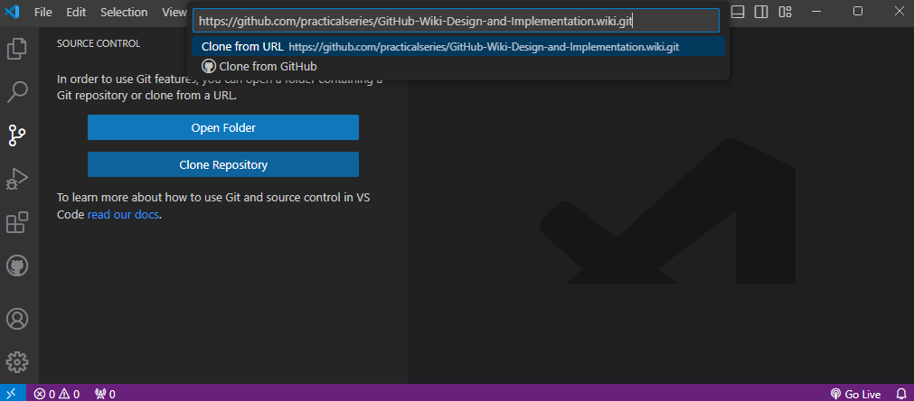</a></td></tr>
<tr><td valign="top">&#x277A</td><td>Hit enter and when prompted select a repository location on the local machine (this was mine):  
     
<em>Only select the parent directory, VS Code will create the subdirectory that contains the Wiki. It will have the same name as the repository with which the Wiki is associated with <code>.WIKI</code> at the end (spaces in the name will be replaced by dashes).</em>
</td></tr>
<tr><td valign="top">&#x277B</td><td>At the next prompt, open the repository, it looks like this:  
    <a href="../02-0000/02-images/figm-02-01c.png" title="Use ctrl+click to open image in new tab">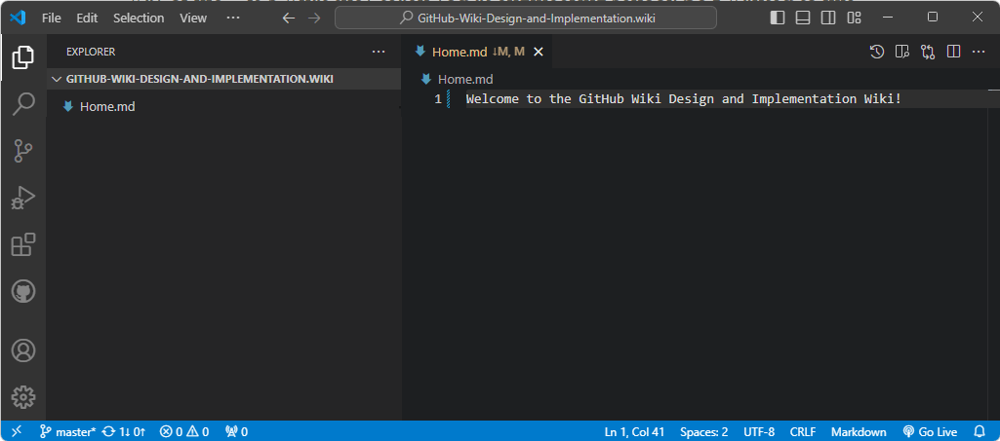</a></td></tr>
<tr><td valign="top">&#x277C</td><td>This is the cloned repository on a local machine, in Windows File Explorer it looks like this:  
    <a href="../02-0000/02-images/figm-02-01d.png" title="Use ctrl+click to open image in new tab">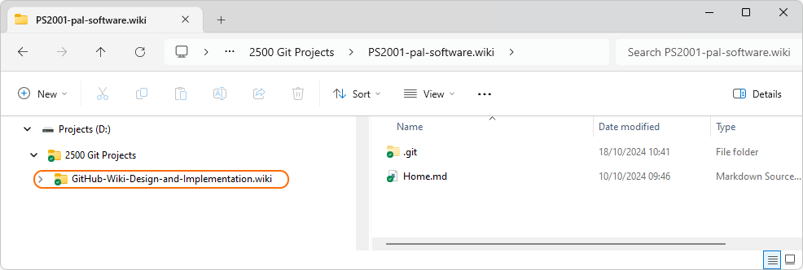</a></td></tr>
<!-- CAPTION -->          <tr><th width="52"></th><!-- SPACER -->
<!-- LIST WIDTH -->         <th align="left" width="800">
<!-- CAPTION TEXT --><!-- TEXT -->List 2.1 &mdash; Cloning a Wiki
                           </th></tr>
</table>                               <!-- LIST END  🔼🔼(BLANK LINE BELOW) -->

In the image above it is possible to see the `.git` folder, this is the standard folder for a Git repository, it was created by GitHub when we created the first Wiki page

**The Wiki is indeed its own repository.**

> [!TIP]<!-- TIP ALERT -->
> *The `.git` folder is a hidden folder and will only be visible if Windows explorer is set to show hidden files (**Options, View, Show hidden files, folders and drives**).*

**[:arrow_up: Top](#idtop)**<!-- END OF SECTION - LINK TO TOP🔽🔽(BLANK LINE ABOVE) -->

                        <!-- END OF SECTION - SEPARATING LINE                    -->
                         <!-- END OF SECTION - PADDING    🔼🔼(BLANK LINE BELOW) -->

## 2.3<!--      🟥H2🟥-->Pushing local changes to GitHub

Cloning a Wiki onto a local machine, provides a copy of the Wiki on that machine. This can now be locally edited and modified as required.

At some point, those modified *(or new/deleted)* files must be sent back to GitHub so that it can be displayed when the Wiki button is pressed. *So how is this done?*

The first thing is you must have a GitHub account that has access to the parent repository. In this instance, I’m assuming you have a GitHub account *(you wouldn’t be able to create a repository without one)* and I’m also assuming that the Wiki in question is one you have created in your own repository *(or in a repository to which you have full read/write permissions)*.

**I will take you through this from the point of view of using VS Code as your text editor and that you are not signed into any accounts via VS Code (if it is a clean install of VS Code, you won’t be signed into anything). I’m also assuming that Git has been installed on your machine.**

> [!IMPORTANT]<!-- IMPORTANT ALERT -->
> *Git is the local version of GitHub, it’s a bastard to use but must be installed to allow VS Code to interface with a GitHub repository. Git can be installed from this link: https://git-scm.com/, just click **Download** in the monitor icon. I have a guide that takes you through the installation of Git on your PC, you can find it here:*
>
> https://www.practicalseries.com/1002-vcs/03-00-install.html *Don’t worry about SSH keys, you won’t need them for this.*

**Before we start, there is something irritating that must be done before we can change things and send stuff back to GitHub.**

**We must first record our GitHub username and email address in Git. See below:**

**[:arrow_up: Top](#idtop)**<!-- END OF SECTION - LINK TO TOP🔽🔽(BLANK LINE ABOVE) -->

                        <!-- END OF SECTION - SEPARATING LINE                    -->
                         <!-- END OF SECTION - PADDING    🔼🔼(BLANK LINE BELOW) -->

### 2.3.1<!--   🟥H3🟥-->Configuring a Git username and email address

This is a bit convoluted and it is a requirement of the Git version control system (installed on your PC) and has nothing at all to do with GitHub.

Git won’t allow changes to be committed to a repository *(and at this point it is the Git application on your local PC that is in control of the local repository, VS Code is just a wrapper that interfaces with Git)* without it having a username and email address for the user making the changes.

> [!IMPORTANT]<!-- IMPORTANT ALERT -->
> **You only have to do this once.**

Now, Git is horrible. It is a command line interface with absolutely no redeeming features. No one likes to use it, but in this instance, we have to give it some information and this can be done through the VS Code terminal.

In VS Code, select ${\large \color{#00B050}\langle\text{Terminal}\rangle}$ in the menu bar, select ${\large \color{#00B050}\langle\text{New\ terminal}\rangle}$ and the terminal window will open at the bottom-right:

<table name="f-02-02" align="center"><!-- FIGURE START🔽🔽(BLANK LINE ABOVE) -->
<!-- Figure row --> <tr><td>
<!-- LINK -->         <a href="../02-0000/02-images/figm-02-02.png" title="Use ctrl+click to open image in new tab">
<!-- FIGURE -->         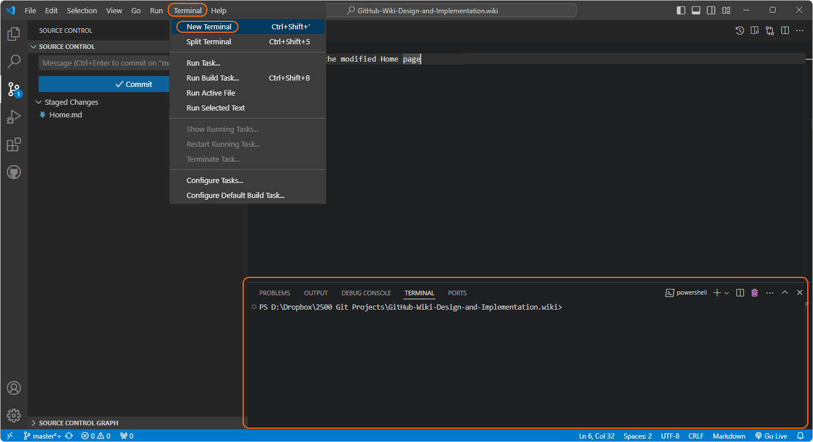
                    </a></td></tr>
<!-- CAPTION -->    <tr><th align="center">
<!-- CAPTION TEXT -->   Figure 2.2 &mdash; VS Code terminal
                    </th></tr>
</table>                             <!-- FIGURE END  🔼🔼(BLANK LINE BELOW) -->

Next, we have to issue two commands to Git using the peculiar terminology common to it. 

First, we must give it a user name *(this should be the same as the username for your GitHub account), the command is (the quotation marks are necessary)*:

&emsp;&emsp;&emsp;<!---🟡ENTER CODE🟡-->`git config --global user.name "[UserName]"`

In my case my username is `mgledhill` so I enter:

&emsp;&emsp;&emsp;<!---🟡ENTER CODE🟡-->`git config --global user.name "mgledhill"`

Next, it needs an email address (any will do, nothing will ever check it), the command is

&emsp;&emsp;&emsp;<!---🟡ENTER CODE🟡-->`git config --global user.email "[EmailAddress]"`

In my case my email is `git@practicalseries.com` so I enter:

&emsp;&emsp;&emsp;<!---🟡ENTER CODE🟡-->`git config --global user.email "git@practicalseries.com"`

In both cases, you will get no response from Git *(no news is good news with Git)*.

In my case it all looks like this:

<table name="f-02-03" align="center"><!-- FIGURE START🔽🔽(BLANK LINE ABOVE) -->
<!-- Figure row --> <tr><td>
<!-- LINK -->         <a href="../02-0000/02-images/figm-02-03.png" title="Use ctrl+click to open image in new tab">
<!-- FIGURE -->         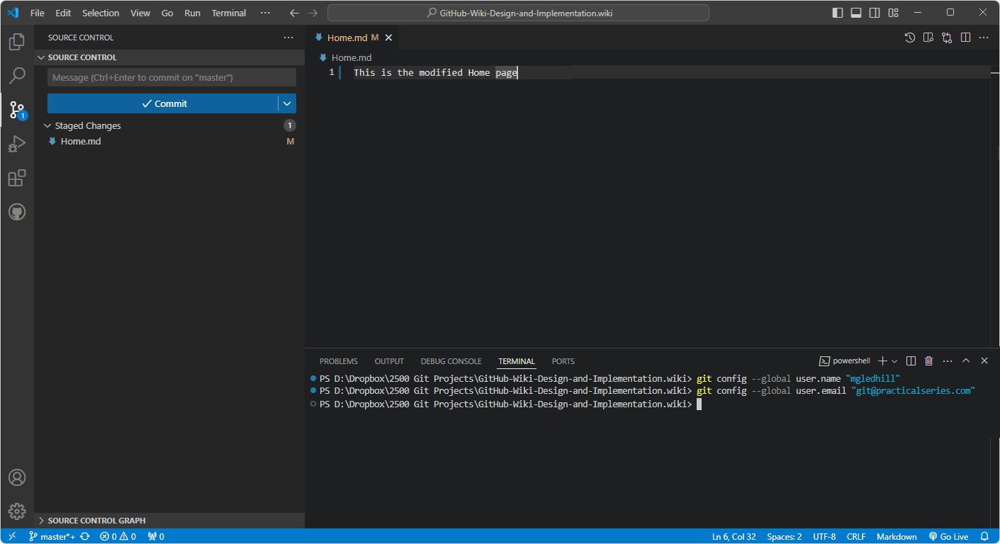
                    </a></td></tr>
<!-- CAPTION -->    <tr><th align="center">
<!-- CAPTION TEXT -->   Figure 2.3 &mdash; Git username and email
                    </th></tr>
</table>                             <!-- FIGURE END  🔼🔼(BLANK LINE BELOW) -->

That’s it, the credentials have been entered *(I wish VS Code would find a way around this, it’s a pain in the arse)*. If you don’t do this, you will get an error message when you try to synchronise the Wiki with GitHub.

**[:arrow_up: Top](#idtop)**<!-- END OF SECTION - LINK TO TOP🔽🔽(BLANK LINE ABOVE) -->

                        <!-- END OF SECTION - SEPARATING LINE                    -->
                         <!-- END OF SECTION - PADDING    🔼🔼(BLANK LINE BELOW) -->

### 2.3.2<!--   🟥H3🟥-->Modifying the local repository

Having cloned the repository (see the previous section), there is a copy of it on the local machine. At this point I’m assuming it is just the Home page created in <a href="../01-0000/01%20Introducing%20the%20GitHub%20Wiki.md#131creating-the-first-wiki-page">Section&nbsp;1.3.1</a>, it looks like this in VS Code:

<table name="f-02-04" align="center"><!-- FIGURE START🔽🔽(BLANK LINE ABOVE) -->
<!-- Figure row --> <tr><td>
<!-- LINK -->         <a href="../02-0000/02-images/figm-02-04.png" title="Use ctrl+click to open image in new tab">
<!-- FIGURE -->         
                    </a></td></tr>
<!-- CAPTION -->    <tr><th align="center">
<!-- CAPTION TEXT -->   Figure 2.4 &mdash; The cloned Home page in VS Code
                    </th></tr>
</table>                             <!-- FIGURE END  🔼🔼(BLANK LINE BELOW) -->

It just has one line in it.

Change the text in the line as follows, point &#x2460;:

<table name="f-02-05" align="center"><!-- FIGURE START🔽🔽(BLANK LINE ABOVE) -->
<!-- Figure row --> <tr><td>
<!-- LINK -->         <a href="../02-0000/02-images/figm-02-05.png" title="Use ctrl+click to open image in new tab">
<!-- FIGURE -->         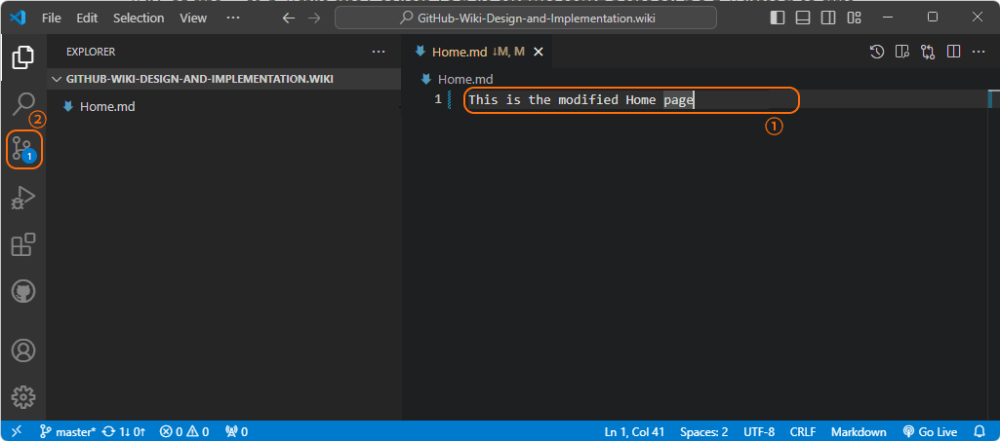
                    </a></td></tr>
<!-- CAPTION -->    <tr><th align="center">
<!-- CAPTION TEXT -->   Figure 2.5 &mdash; Modified Home page
                    </th></tr>
</table>                             <!-- FIGURE END  🔼🔼(BLANK LINE BELOW) -->

VS Code detects this change and indicates it as the number 1 over the *Source Control* icon, point &#x2461; .

Click ${\large \color{#00B050}\langle\text{Source\ Control}\rangle}$ and it shows the status of the modified files in the repository:

<table name="f-02-06" align="center"><!-- FIGURE START🔽🔽(BLANK LINE ABOVE) -->
<!-- Figure row --> <tr><td>
<!-- LINK -->         <a href="../02-0000/02-images/figm-02-06.png" title="Use ctrl+click to open image in new tab">
<!-- FIGURE -->         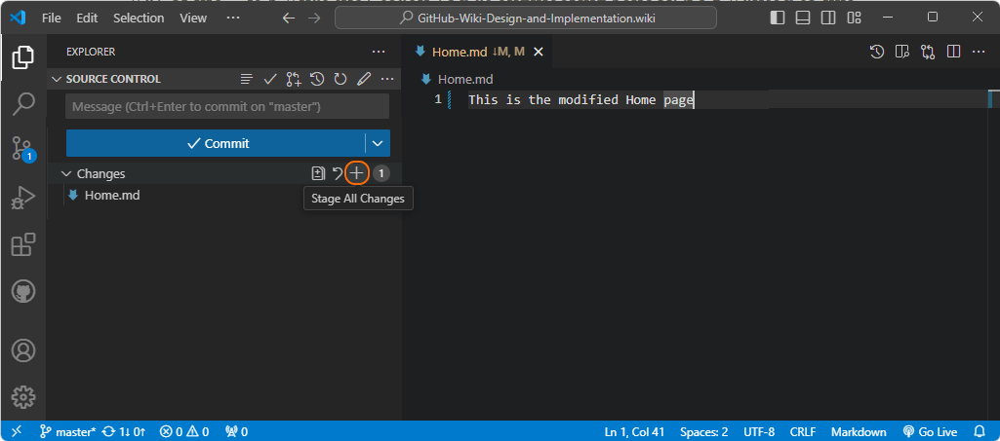
                    </a></td></tr>
<!-- CAPTION -->    <tr><th align="center">
<!-- CAPTION TEXT -->   Figure 2.6 &mdash; Changed files
                    </th></tr>
</table>                             <!-- FIGURE END  🔼🔼(BLANK LINE BELOW) -->

The Home page is showing as a *changed file*. Before the changes can be added to the re-pository, it must be *“staged” (Git terminology for marking a file as ready to be added to the repository)*. To stage the file, click the ${\large \color{#00B050}\langle\text{plus sign}\rangle}$ in the changes area (highlighted above). It now looks like this:

<table name="f-02-07" align="center"><!-- FIGURE START🔽🔽(BLANK LINE ABOVE) -->
<!-- Figure row --> <tr><td>
<!-- LINK -->         <a href="../02-0000/02-images/figm-02-07.png" title="Use ctrl+click to open image in new tab">
<!-- FIGURE -->         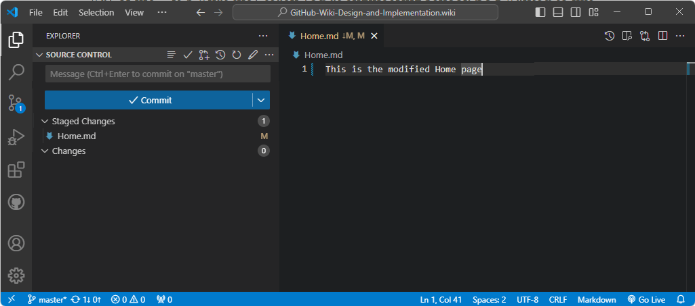
                    </a></td></tr>
<!-- CAPTION -->    <tr><th align="center">
<!-- CAPTION TEXT -->   Figure 2.7 &mdash; Staged files
                    </th></tr>
</table>                             <!-- FIGURE END  🔼🔼(BLANK LINE BELOW) -->

The file is now staged and ready to be *“committed”* (this means stored in the repository, this is the same as ${\large \color{#00B050}\langle\text{Saving}\rangle}$ the Wiki page in GitHub).

**[:arrow_up: Top](#idtop)**<!-- END OF SECTION - LINK TO TOP🔽🔽(BLANK LINE ABOVE) -->

                        <!-- END OF SECTION - SEPARATING LINE                    -->
                         <!-- END OF SECTION - PADDING    🔼🔼(BLANK LINE BELOW) -->

### 2.3.3<!--   🟥H3🟥-->Committing and synchronising the changes

The modified files can now be committed to the local repository.

To do this, enter a message in the box above the blue ${\large \color{#00B050}\langle\text{Commit}\rangle}$ button (it can be anything you like) and then press ${\large \color{#00B050}\langle\text{Commit}\rangle}$:

<table name="f-02-08" align="center"><!-- FIGURE START🔽🔽(BLANK LINE ABOVE) -->
<!-- Figure row --> <tr><td>
<!-- LINK -->         <a href="../02-0000/02-images/figm-02-08.png" title="Use ctrl+click to open image in new tab">
<!-- FIGURE -->         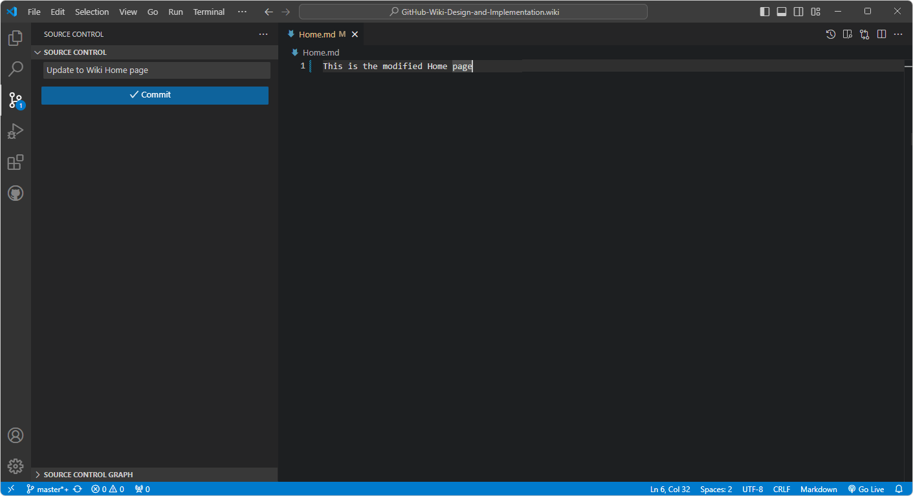
                    </a></td></tr>
<!-- CAPTION -->    <tr><th align="center">
<!-- CAPTION TEXT -->   Figure 2.8 &mdash; Commit the change
                    </th></tr>
</table>                             <!-- FIGURE END  🔼🔼(BLANK LINE BELOW) -->

VS Code will now ask you to synchronise the files with GitHub *(this is called a “push” or “pushing” in GitHub terminology)*:

<table name="f-02-09" align="center"><!-- FIGURE START🔽🔽(BLANK LINE ABOVE) -->
<!-- Figure row --> <tr><td>
<!-- LINK -->         <a href="../02-0000/02-images/figm-02-09.png" title="Use ctrl+click to open image in new tab">
<!-- FIGURE -->         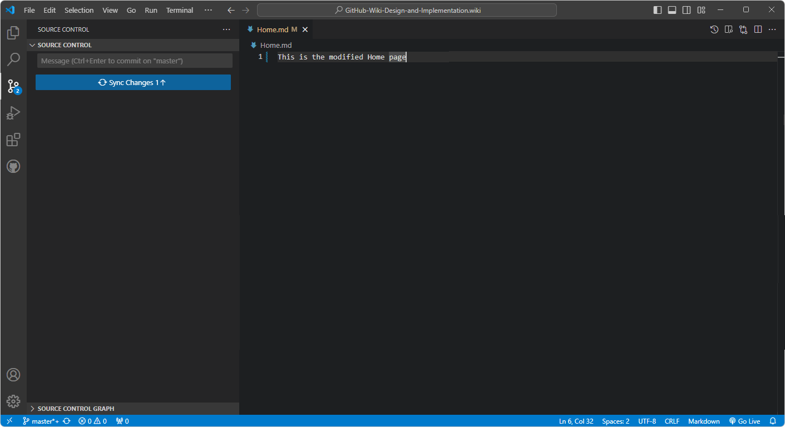
                    </a></td></tr>
<!-- CAPTION -->    <tr><th align="center">
<!-- CAPTION TEXT -->   Figure 2.9 &mdash; Synchronise the change
                    </th></tr>
</table>                             <!-- FIGURE END  🔼🔼(BLANK LINE BELOW) -->

> [!NOTE]<!-- NOTE ALERT -->
> *It is at this point that VS Code would have returned an error message if the username and email address for the repository had not been configured (see <a href="#231configuring-a-git-username-and-email-address">section&nbsp;2.3.1</a>). The error message being:*

<table name="f-02-10" align="center"><!-- FIGURE START🔽🔽(BLANK LINE ABOVE) -->
<!-- Figure row --> <tr><td>
<!-- LINK -->         <a href="../02-0000/02-images/figm-02-10.png" title="Use ctrl+click to open image in new tab">
<!-- FIGURE -->         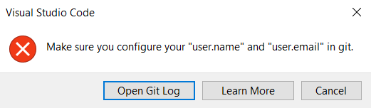
                    </a></td></tr>
<!-- CAPTION -->    <tr><th align="center">
<!-- CAPTION TEXT -->   Figure 2.10 &mdash; Username and email configuration error
                    </th></tr>
</table>                             <!-- FIGURE END  🔼🔼(BLANK LINE BELOW) -->

When you try to do this for the first time, you will be prompted to login to GitHub to verify your status **(again you will only have to do this once)**.

Click the ${\large \color{#00B050}\langle\text{Sync\ changes}\rangle}$ button.

This will open a window asking you to sign in to GitHub:

<table name="f-02-11" align="center"><!-- FIGURE START🔽🔽(BLANK LINE ABOVE) -->
<!-- Figure row --> <tr><td>
<!-- LINK -->         <a href="../02-0000/02-images/figm-02-11.png" title="Use ctrl+click to open image in new tab">
<!-- FIGURE -->         
                    </a></td></tr>
<!-- CAPTION -->    <tr><th align="center">
<!-- CAPTION TEXT -->   Figure 2.11 &mdash; GitHub prompt to sign in
                    </th></tr>
</table>                             <!-- FIGURE END  🔼🔼(BLANK LINE BELOW) -->

Click ${\large \color{#00B050}\langle\text{Sign\ in\ wit\ your\ browser}\rangle}$ (unless you have a code). This opens the GitHub sign in screen, enter your credentials:

<table name="f-02-12" align="center"><!-- FIGURE START🔽🔽(BLANK LINE ABOVE) -->
<!-- Figure row --> <tr><td>
<!-- LINK -->         <a href="../02-0000/02-images/figm-02-12.png" title="Use ctrl+click to open image in new tab">
<!-- FIGURE -->         
                    </a></td></tr>
<!-- CAPTION -->    <tr><th align="center">
<!-- CAPTION TEXT -->   Figure 2.12 &mdash; GitHub prompt to sign in
                    </th></tr>
</table>                             <!-- FIGURE END  🔼🔼(BLANK LINE BELOW) -->

You can use a passkey if you have one set up, otherwise it will text a code to your mobile phone. Enter your details and click ${\large \color{#00B050}\langle\text{Sign\ in}\rangle}$: and enter the authorisation code that has been sent to you:

<table name="f-02-13" align="center"><!-- FIGURE START🔽🔽(BLANK LINE ABOVE) -->
<!-- Figure row --> <tr><td>
<!-- LINK -->         <a href="../02-0000/02-images/figm-02-13.png" title="Use ctrl+click to open image in new tab">
<!-- FIGURE -->         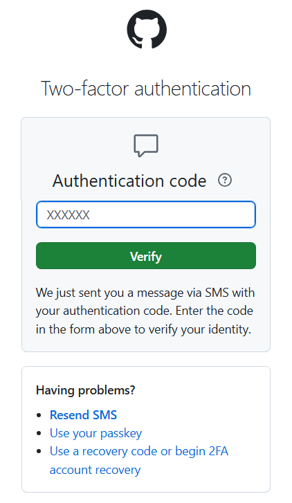
                    </a></td></tr>
<!-- CAPTION -->    <tr><th align="center">
<!-- CAPTION TEXT -->   Figure 2.13 &mdash; GitHub authorisation code
                    </th></tr>
</table>                             <!-- FIGURE END  🔼🔼(BLANK LINE BELOW) -->

That’s it, you can now close the browser and VS Code will sync the changes.

If you now open the Wiki in a browser, you will see the changes. It looks like this:

<table name="f-02-14" align="center"><!-- FIGURE START🔽🔽(BLANK LINE ABOVE) -->
<!-- Figure row --> <tr><td>
<!-- LINK -->         <a href="../02-0000/02-images/figm-02-14.png" title="Use ctrl+click to open image in new tab">
<!-- FIGURE -->         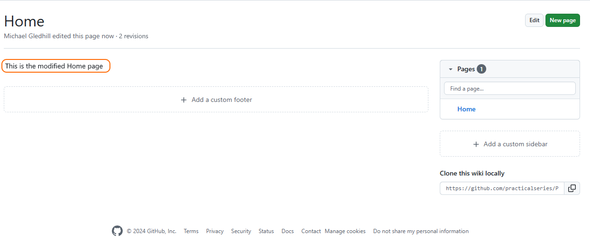
                    </a></td></tr>
<!-- CAPTION -->    <tr><th align="center">
<!-- CAPTION TEXT -->   Figure 2.14 &mdash; Modified page on GitHub
                    </th></tr>
</table>                             <!-- FIGURE END  🔼🔼(BLANK LINE BELOW) -->

And that’s it. Local changes pushed to GitHub.

<!-- FOOTNOTE SEPARATOR 🟡🟡🟡🟡🟡 -->
<a name="idfn" href="#idfn">Footnotes:<!-- 🟡FOOTNOTE TITLE🟡 -->&emsp;&emsp;&emsp;&emsp;&emsp;</a>
   

> [!NOTE]<!-- 🟡FOOTNOTE CONTENT -->
> <a name="fn-01" href="#rn-01">💠1</a>&emsp;<!-- FOOTNOTE CONTENT TEXT -->Syntax highlighting visually colours elements of the text making it easier to navigate and identify errors.<!--  CONTENT TEXT END --><a href="#rn-01">↩</a>
              <!-- END OF PAGE - 🟥🟥🟥🟥🟥 PADDING🔽🔽(NO BLANK LINE ABOVE) -->

                <!-- END OF PAGE - 🟥🟥🟥🟥🟥 SEPARATING LINE                   -->
<!-- END OF PAGE – 🟥🟥🟥🟥🟥 MARKER 🔼🔼                      -->