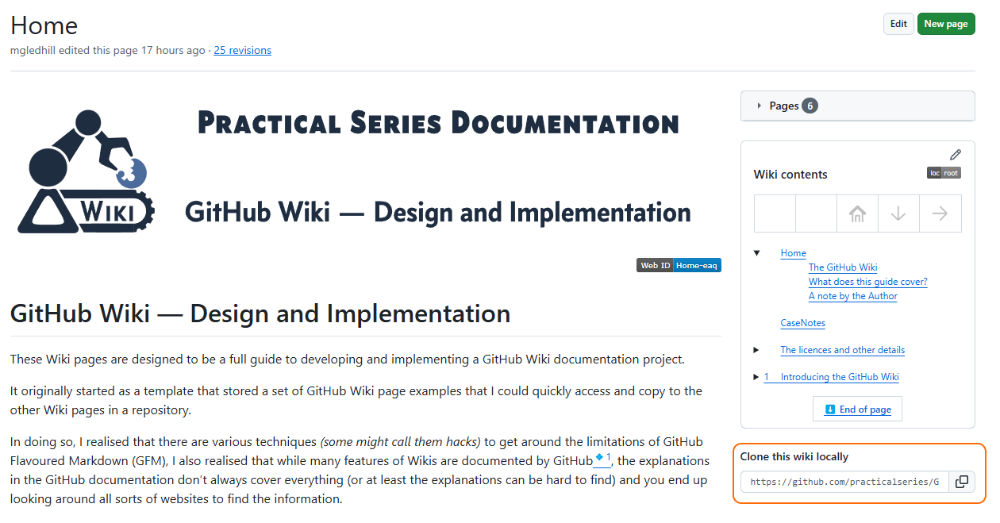
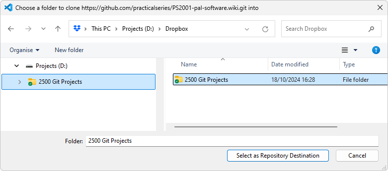
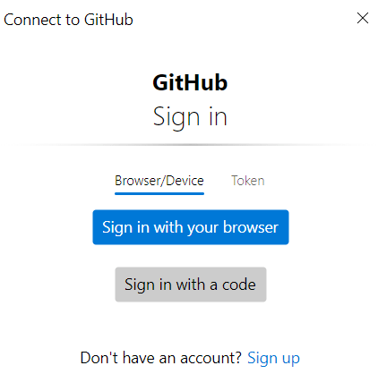
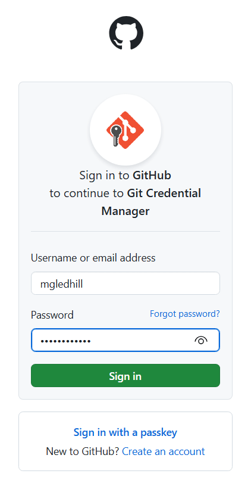

<!-- 🟢TOP OF PAGE - MARKER  (BLANK LINE BELOW)   -->

<!-- 🟢TOP OF PAGE - LOGO IMAGE -->

      <!-- 🟢TOP OF PAGE - WEB ID     --> 

# 2<!--         🟥H1🟥-->Cloning a Wiki

Cloning a Wiki simply means copying the Wiki to a local machine where it can be edited in a text editor ([Visual Studio Code](https://code.visualstudio.com/) for example, *this is the editor of choice and interfaces with GitHub allowing all the version control tools for a repository to be accessed locally on a PC)* that usually offers more facilities than the basic GitHub web-based editor. Changes made on the local machine can be *“pushed”* back to GitHub where they will appear within the Wiki.

**[:arrow_up: Top](#idtop)**<!-- END OF SECTION - LINK TO TOP🔽🔽(BLANK LINE ABOVE) -->

                        <!-- END OF SECTION - SEPARATING LINE                    -->
                         <!-- END OF SECTION - PADDING    🔼🔼(BLANK LINE BELOW) -->

## 2.1<!--      🟥H2🟥-->Why clone a Wiki?

Unless your Wiki is very short and simple, you will almost certainly want to clone it to your local machine.

The GitHub Wiki editor is rudimentary and has only basic editing facilities. It cannot search and replace in multiple files; it does not have syntax highlighting<a name="rn-01" href="#fn-01"><!-- 🟨FOOTNOTE LINK🟨-->💠1</a> and it does not allow folder structures to be created. A fully fledged text editor such as [VS&nbsp;Code](https://code.visualstudio.com/) has all these things. Text editors generally have flexible preview facilities, proper search and replace (within and across multiple files), file and folder management, they also (usually) have some form of extensions that can be incorporated to give additional facilities (version control interfaces, image file previews &c.).

*Life is much easier using a proper text editor rather than the GitHub editor.*

That said, it is not the main reason for cloning a Wiki: 

**The main reason for cloning a Wiki to a local machine is it allows a folder structure to be applied to the Wiki**. 

This is essential for what we will do later on **(it allows different sidebars and footers for each Wiki page)**.

**[:arrow_up: Top](#idtop)**<!-- END OF SECTION - LINK TO TOP🔽🔽(BLANK LINE ABOVE) -->

                        <!-- END OF SECTION - SEPARATING LINE                    -->
                         <!-- END OF SECTION - PADDING    🔼🔼(BLANK LINE BELOW) -->

## 2.2<!--      🟥H2🟥-->How to clone a Wiki

The Wiki repository can be *“cloned”* (copied) locally to a PC using the ${\large \color{#00B050}\langle\text{clone\ this\ wiki\ locally}\rangle}$ link on any Wiki page:

<table name="f-02-01" align="center"><!-- FIGURE START🔽🔽(BLANK LINE ABOVE) -->
<!-- Figure row --> <tr><td>
<!-- LINK -->         <a href="../02-0000/02-images/figm-02-01.png" title="Use ctrl+click to open image in new tab">
<!-- FIGURE -->         
                    </a></td></tr>
<!-- CAPTION -->    <tr><th align="center">
<!-- CAPTION TEXT -->   Figure 2.1 &mdash; Clone a local copy of a Wiki
                    </th></tr>
</table>                             <!-- FIGURE END  🔼🔼(BLANK LINE BELOW) -->

Clicking the link copies the wiki link to the clipboard, in the case of this Wiki it is:

&emsp;&emsp;&emsp;<!---🟡ENTER URL🟡-->https://github.com/practicalseries/GitHub-Wiki-Design-and-Implementation.wiki.git

> [!IMPORTANT]<!-- IMPORTANT ALERT -->
> *The following explanation and those in the sections that follow assume that Visual Studio Code is being used as a text editor and that the user has access rights to the GitHub Wiki being cloned.*
>
> *Anyone can clone a Wiki, you do not need access rights to the Wiki, if you can see the link, you can clone it. If you do not have access rights to the Wiki, you will not, however, be able to “push” any changes you make back to the Wiki in the GitHub repository.*

<table name="l-02-01" align="center">  <!-- LIST START🔽🔽(BLANK LINE ABOVE) -->
<tr><td valign="top">&#x2776</td><td>Open a new VS Code window and do the following:</td></tr>
<tr><td valign="top">&#x2777</td><td>Select ${\large \color{#00B050}\langle\text{Source\ Control}\rangle}$ (in the left bar), ${\large \color{#00B050}\text{Ctrl+Shift+G}}$ </td></tr>
<tr><td valign="top">&#x2778</td><td>Select ${\large \color{#00B050}\langle\text{Clone\ Repository}\rangle}$</td></tr>
<tr><td valign="top">&#x2779</td><td>Paste the link above into the editor as shown below:  
    </td></tr>
<tr><td valign="top">&#x277A</td><td>Hit enter and when prompted select a repository location on the local machine (this was mine):  
     
<em>Only select the parent directory, VS Code will create the subdirectory that contains the Wiki. It will have the same name as the repository with which the Wiki is associated with <code>.WIKI</code> at the end (spaces in the name will be replaced by dashes).</em>
</td></tr>
<tr><td valign="top">&#x277B</td><td>At the next prompt, open the repository, it looks like this:  
    </td></tr>
<tr><td valign="top">&#x277C</td><td>This is the cloned repository on a local machine, in Windows File Explorer it looks like this:  
    </td></tr>
<!-- CAPTION -->          <tr><th width="52"></th><!-- SPACER -->
<!-- LIST WIDTH -->         <th align="left" width="800">
<!-- CAPTION TEXT --><!-- TEXT -->List 2.1 &mdash; Cloning a Wiki
                           </th></tr>
</table>                               <!-- LIST END  🔼🔼(BLANK LINE BELOW) -->

In the image above it is possible to see the `.git` folder, this is the standard folder for a Git repository, it was created by GitHub when we created the first Wiki page

**The Wiki is indeed its own repository.**

> [!TIP]<!-- TIP ALERT -->
> *The `.git` folder is a hidden folder and will only be visible if Windows explorer is set to show hidden files (**Options, View, Show hidden files, folders and drives**).*

**[:arrow_up: Top](#idtop)**<!-- END OF SECTION - LINK TO TOP🔽🔽(BLANK LINE ABOVE) -->

                        <!-- END OF SECTION - SEPARATING LINE                    -->
                         <!-- END OF SECTION - PADDING    🔼🔼(BLANK LINE BELOW) -->

## 2.3<!--      🟥H2🟥-->Pushing local changes to GitHub

Cloning a Wiki onto a local machine, provides a copy of the Wiki on that machine. This can now be locally edited and modified as required.

At some point, those modified *(or new/deleted)* files must be sent back to GitHub so that it can be displayed when the Wiki button is pressed. *So how is this done?*

The first thing is you must have a GitHub account that has access to the parent repository. In this instance, I’m assuming you have a GitHub account *(you wouldn’t be able to create a repository without one)* and I’m also assuming that the Wiki in question is one you have created in your own repository *(or in a repository to which you have full read/write permissions)*.

**I will take you through this from the point of view of using VS Code as your text editor and that you are not signed into any accounts via VS Code (if it is a clean install of VS Code, you won’t be signed into anything). I’m also assuming that Git has been installed on your machine.**

> [!IMPORTANT]<!-- IMPORTANT ALERT -->
> *Git is the local version of GitHub, it’s a bastard to use but must be installed to allow VS Code to interface with a GitHub repository. Git can be installed from this link: https://git-scm.com/, just click **Download** in the monitor icon. I have a guide that takes you through the installation of Git on your PC, you can find it here:*
>
> https://www.practicalseries.com/1002-vcs/03-00-install.html *Don’t worry about SSH keys, you won’t need them for this.*

**Before we start, there is something irritating that must be done before we can change things and send stuff back to GitHub.**

**We must first record our GitHub username and email address in Git. See below:**

**[:arrow_up: Top](#idtop)**<!-- END OF SECTION - LINK TO TOP🔽🔽(BLANK LINE ABOVE) -->

                        <!-- END OF SECTION - SEPARATING LINE                    -->
                         <!-- END OF SECTION - PADDING    🔼🔼(BLANK LINE BELOW) -->

### 2.3.1<!--   🟥H3🟥-->Configuring a Git username and email address

This is a bit convoluted and it is a requirement of the Git version control system (installed on your PC) and has nothing at all to do with GitHub.

Git won’t allow changes to be committed to a repository *(and at this point it is the Git application on your local PC that is in control of the local repository, VS Code is just a wrapper that interfaces with Git)* without it having a username and email address for the user making the changes.

> [!IMPORTANT]<!-- IMPORTANT ALERT -->
> **You only have to do this once.**

Now, Git is horrible. It is a command line interface with absolutely no redeeming features. No one likes to use it, but in this instance, we have to give it some information and this can be done through the VS Code terminal.

In VS Code, select ${\large \color{#00B050}\langle\text{Terminal}\rangle}$ in the menu bar, select ${\large \color{#00B050}\langle\text{New\ terminal}\rangle}$ and the terminal window will open at the bottom-right:

<table name="f-02-02" align="center"><!-- FIGURE START🔽🔽(BLANK LINE ABOVE) -->
<!-- Figure row --> <tr><td>
<!-- LINK -->         <a href="../02-0000/02-images/figm-02-02.png" title="Use ctrl+click to open image in new tab">
<!-- FIGURE -->         
                    </a></td></tr>
<!-- CAPTION -->    <tr><th align="center">
<!-- CAPTION TEXT -->   Figure 2.2 &mdash; VS Code terminal
                    </th></tr>
</table>                             <!-- FIGURE END  🔼🔼(BLANK LINE BELOW) -->

Next, we have to issue two commands to Git using the peculiar terminology common to it. 

First, we must give it a user name *(this should be the same as the username for your GitHub account), the command is (the quotation marks are necessary)*:

&emsp;&emsp;&emsp;<!---🟡ENTER CODE🟡-->`git config --global user.name "[UserName]"`

In my case my username is `mgledhill` so I enter:

&emsp;&emsp;&emsp;<!---🟡ENTER CODE🟡-->`git config --global user.name "mgledhill"`

Next, it needs an email address (any will do, nothing will ever check it), the command is

&emsp;&emsp;&emsp;<!---🟡ENTER CODE🟡-->`git config --global user.email "[EmailAddress]"`

In my case my email is `git@practicalseries.com` so I enter:

&emsp;&emsp;&emsp;<!---🟡ENTER CODE🟡-->`git config --global user.email "git@practicalseries.com"`

In both cases, you will get no response from Git *(no news is good news with Git)*.

In my case it all looks like this:

<table name="f-02-03" align="center"><!-- FIGURE START🔽🔽(BLANK LINE ABOVE) -->
<!-- Figure row --> <tr><td>
<!-- LINK -->         <a href="../02-0000/02-images/figm-02-03.png" title="Use ctrl+click to open image in new tab">
<!-- FIGURE -->         
                    </a></td></tr>
<!-- CAPTION -->    <tr><th align="center">
<!-- CAPTION TEXT -->   Figure 2.3 &mdash; Git username and email
                    </th></tr>
</table>                             <!-- FIGURE END  🔼🔼(BLANK LINE BELOW) -->

That’s it, the credentials have been entered *(I wish VS Code would find a way around this, it’s a pain in the arse)*. If you don’t do this, you will get an error message when you try to synchronise the Wiki with GitHub.

**[:arrow_up: Top](#idtop)**<!-- END OF SECTION - LINK TO TOP🔽🔽(BLANK LINE ABOVE) -->

                        <!-- END OF SECTION - SEPARATING LINE                    -->
                         <!-- END OF SECTION - PADDING    🔼🔼(BLANK LINE BELOW) -->

### 2.3.2<!--   🟥H3🟥-->Modifying the local repository

Having cloned the repository (see the previous section), there is a copy of it on the local machine. At this point I’m assuming it is just the Home page created in <a href="01-introducing-the-github-wiki#131creating-the-first-wiki-page">Section&nbsp;1.3.1</a>, it looks like this in VS Code:

<table name="f-02-04" align="center"><!-- FIGURE START🔽🔽(BLANK LINE ABOVE) -->
<!-- Figure row --> <tr><td>
<!-- LINK -->         <a href="../02-0000/02-images/figm-02-04.png" title="Use ctrl+click to open image in new tab">
<!-- FIGURE -->         
                    </a></td></tr>
<!-- CAPTION -->    <tr><th align="center">
<!-- CAPTION TEXT -->   Figure 2.4 &mdash; The cloned Home page in VS Code
                    </th></tr>
</table>                             <!-- FIGURE END  🔼🔼(BLANK LINE BELOW) -->

It just has one line in it.

Change the text in the line as follows, point &#x2460;:

<table name="f-02-05" align="center"><!-- FIGURE START🔽🔽(BLANK LINE ABOVE) -->
<!-- Figure row --> <tr><td>
<!-- LINK -->         <a href="../02-0000/02-images/figm-02-05.png" title="Use ctrl+click to open image in new tab">
<!-- FIGURE -->         
                    </a></td></tr>
<!-- CAPTION -->    <tr><th align="center">
<!-- CAPTION TEXT -->   Figure 2.5 &mdash; Modified Home page
                    </th></tr>
</table>                             <!-- FIGURE END  🔼🔼(BLANK LINE BELOW) -->

VS Code detects this change and indicates it as the number 1 over the *Source Control* icon, point &#x2461; .

Click ${\large \color{#00B050}\langle\text{Source\ Control}\rangle}$ and it shows the status of the modified files in the repository:

<table name="f-02-06" align="center"><!-- FIGURE START🔽🔽(BLANK LINE ABOVE) -->
<!-- Figure row --> <tr><td>
<!-- LINK -->         <a href="../02-0000/02-images/figm-02-06.png" title="Use ctrl+click to open image in new tab">
<!-- FIGURE -->         
                    </a></td></tr>
<!-- CAPTION -->    <tr><th align="center">
<!-- CAPTION TEXT -->   Figure 2.6 &mdash; Changed files
                    </th></tr>
</table>                             <!-- FIGURE END  🔼🔼(BLANK LINE BELOW) -->

The Home page is showing as a *changed file*. Before the changes can be added to the re-pository, it must be *“staged” (Git terminology for marking a file as ready to be added to the repository)*. To stage the file, click the ${\large \color{#00B050}\langle\text{plus sign}\rangle}$ in the changes area (highlighted above). It now looks like this:

<table name="f-02-07" align="center"><!-- FIGURE START🔽🔽(BLANK LINE ABOVE) -->
<!-- Figure row --> <tr><td>
<!-- LINK -->         <a href="../02-0000/02-images/figm-02-07.png" title="Use ctrl+click to open image in new tab">
<!-- FIGURE -->         
                    </a></td></tr>
<!-- CAPTION -->    <tr><th align="center">
<!-- CAPTION TEXT -->   Figure 2.7 &mdash; Staged files
                    </th></tr>
</table>                             <!-- FIGURE END  🔼🔼(BLANK LINE BELOW) -->

The file is now staged and ready to be *“committed”* (this means stored in the repository, this is the same as ${\large \color{#00B050}\langle\text{Saving}\rangle}$ the Wiki page in GitHub).

**[:arrow_up: Top](#idtop)**<!-- END OF SECTION - LINK TO TOP🔽🔽(BLANK LINE ABOVE) -->

                        <!-- END OF SECTION - SEPARATING LINE                    -->
                         <!-- END OF SECTION - PADDING    🔼🔼(BLANK LINE BELOW) -->

### 2.3.3<!--   🟥H3🟥-->Committing and synchronising the changes

The modified files can now be committed to the local repository.

To do this, enter a message in the box above the blue ${\large \color{#00B050}\langle\text{Commit}\rangle}$ button (it can be anything you like) and then press ${\large \color{#00B050}\langle\text{Commit}\rangle}$:

<table name="f-02-08" align="center"><!-- FIGURE START🔽🔽(BLANK LINE ABOVE) -->
<!-- Figure row --> <tr><td>
<!-- LINK -->         <a href="../02-0000/02-images/figm-02-08.png" title="Use ctrl+click to open image in new tab">
<!-- FIGURE -->         
                    </a></td></tr>
<!-- CAPTION -->    <tr><th align="center">
<!-- CAPTION TEXT -->   Figure 2.8 &mdash; Commit the change
                    </th></tr>
</table>                             <!-- FIGURE END  🔼🔼(BLANK LINE BELOW) -->

VS Code will now ask you to synchronise the files with GitHub *(this is called a “push” or “pushing” in GitHub terminology)*:

<table name="f-02-09" align="center"><!-- FIGURE START🔽🔽(BLANK LINE ABOVE) -->
<!-- Figure row --> <tr><td>
<!-- LINK -->         <a href="../02-0000/02-images/figm-02-09.png" title="Use ctrl+click to open image in new tab">
<!-- FIGURE -->         
                    </a></td></tr>
<!-- CAPTION -->    <tr><th align="center">
<!-- CAPTION TEXT -->   Figure 2.9 &mdash; Synchronise the change
                    </th></tr>
</table>                             <!-- FIGURE END  🔼🔼(BLANK LINE BELOW) -->

> [!NOTE]<!-- NOTE ALERT -->
> *It is at this point that VS Code would have returned an error message if the username and email address for the repository had not been configured (see <a href="#231configuring-a-git-username-and-email-address">section&nbsp;2.3.1</a>). The error message being:*

<table name="f-02-10" align="center"><!-- FIGURE START🔽🔽(BLANK LINE ABOVE) -->
<!-- Figure row --> <tr><td>
<!-- LINK -->         <a href="../02-0000/02-images/figm-02-10.png" title="Use ctrl+click to open image in new tab">
<!-- FIGURE -->         
                    </a></td></tr>
<!-- CAPTION -->    <tr><th align="center">
<!-- CAPTION TEXT -->   Figure 2.10 &mdash; Username and email configuration error
                    </th></tr>
</table>                             <!-- FIGURE END  🔼🔼(BLANK LINE BELOW) -->

When you try to do this for the first time, you will be prompted to login to GitHub to verify your status **(again you will only have to do this once)**.

Click the ${\large \color{#00B050}\langle\text{Sync\ changes}\rangle}$ button.

This will open a window asking you to sign in to GitHub:

<table name="f-02-11" align="center"><!-- FIGURE START🔽🔽(BLANK LINE ABOVE) -->
<!-- Figure row --> <tr><td>
<!-- LINK -->         <a href="../02-0000/02-images/figm-02-11.png" title="Use ctrl+click to open image in new tab">
<!-- FIGURE -->         
                    </a></td></tr>
<!-- CAPTION -->    <tr><th align="center">
<!-- CAPTION TEXT -->   Figure 2.11 &mdash; GitHub prompt to sign in
                    </th></tr>
</table>                             <!-- FIGURE END  🔼🔼(BLANK LINE BELOW) -->

Click ${\large \color{#00B050}\langle\text{Sign\ in\ wit\ your\ browser}\rangle}$ (unless you have a code). This opens the GitHub sign in screen, enter your credentials:

<table name="f-02-12" align="center"><!-- FIGURE START🔽🔽(BLANK LINE ABOVE) -->
<!-- Figure row --> <tr><td>
<!-- LINK -->         <a href="../02-0000/02-images/figm-02-12.png" title="Use ctrl+click to open image in new tab">
<!-- FIGURE -->         
                    </a></td></tr>
<!-- CAPTION -->    <tr><th align="center">
<!-- CAPTION TEXT -->   Figure 2.12 &mdash; GitHub prompt to sign in
                    </th></tr>
</table>                             <!-- FIGURE END  🔼🔼(BLANK LINE BELOW) -->

You can use a passkey if you have one set up, otherwise it will text a code to your mobile phone. Enter your details and click ${\large \color{#00B050}\langle\text{Sign\ in}\rangle}$: and enter the authorisation code that has been sent to you:

<table name="f-02-13" align="center"><!-- FIGURE START🔽🔽(BLANK LINE ABOVE) -->
<!-- Figure row --> <tr><td>
<!-- LINK -->         <a href="../02-0000/02-images/figm-02-13.png" title="Use ctrl+click to open image in new tab">
<!-- FIGURE -->         
                    </a></td></tr>
<!-- CAPTION -->    <tr><th align="center">
<!-- CAPTION TEXT -->   Figure 2.13 &mdash; GitHub authorisation code
                    </th></tr>
</table>                             <!-- FIGURE END  🔼🔼(BLANK LINE BELOW) -->

That’s it, you can now close the browser and VS Code will sync the changes.

If you now open the Wiki in a browser, you will see the changes. It looks like this:

<table name="f-02-14" align="center"><!-- FIGURE START🔽🔽(BLANK LINE ABOVE) -->
<!-- Figure row --> <tr><td>
<!-- LINK -->         <a href="../02-0000/02-images/figm-02-14.png" title="Use ctrl+click to open image in new tab">
<!-- FIGURE -->         
                    </a></td></tr>
<!-- CAPTION -->    <tr><th align="center">
<!-- CAPTION TEXT -->   Figure 2.14 &mdash; Modified page on GitHub
                    </th></tr>
</table>                             <!-- FIGURE END  🔼🔼(BLANK LINE BELOW) -->

And that’s it. Local changes pushed to GitHub.

<!-- FOOTNOTE SEPARATOR 🟡🟡🟡🟡🟡 -->
<a name="idfn" href="#idfn">Footnotes:<!-- 🟡FOOTNOTE TITLE🟡 -->&emsp;&emsp;&emsp;&emsp;&emsp;</a>
   

> [!NOTE]<!-- 🟡FOOTNOTE CONTENT -->
> <a name="fn-01" href="#rn-01">💠1</a>&emsp;<!-- FOOTNOTE CONTENT TEXT -->Syntax highlighting visually colours elements of the text making it easier to navigate and identify errors.<!--  CONTENT TEXT END --><a href="#rn-01">↩</a>
              <!-- END OF PAGE - 🟥🟥🟥🟥🟥 PADDING🔽🔽(NO BLANK LINE ABOVE) -->

                <!-- END OF PAGE - 🟥🟥🟥🟥🟥 SEPARATING LINE                   -->
<!-- END OF PAGE – 🟥🟥🟥🟥🟥 MARKER 🔼🔼                      -->