<!-- 🟢TOP OF PAGE - MARKER  (BLANK LINE BELOW)   -->

<!-- 🟢TOP OF PAGE - LOGO IMAGE -->

      <!-- 🟢TOP OF PAGE - WEB ID     --> 

# 3<!--         🟥H1🟥-->A Wiki folder structure

It is perfectly possible to impose a folder structure on a GitHub Wiki, but it is not possible to do so from within GitHub itself. It must be done in a local repository (I use VS Code as my editor) and the folders then pushed back to GitHub.

It should be noted that GitHub largely ignores any applied folder structure, it will list any markdown files (files ending `.md`) in its contents *(pages)* area and allow them to be accessed without referring to the folder structure (see <a href="09.05-links#98relative-links">section&nbsp;9.8</a>). Other files need to be referred to (as a minimum) with the full path from the root directory of the Wiki (I.e. all folders and subfolders that follow the ${\large \color{#446FBD}\text{/}\color{#c00000}\text{wiki}}$ directory).

The big advantage to using a folder structure is that it allows different sidebars and footers for the pages in each subfolder (see <a href="04-different-sidebars-and-footers">section&nbsp;4</a>).

**[:arrow_up: Top](#idtop)**<!-- END OF SECTION - LINK TO TOP🔽🔽(BLANK LINE ABOVE) -->

                        <!-- END OF SECTION - SEPARATING LINE                    -->
                         <!-- END OF SECTION - PADDING    🔼🔼(BLANK LINE BELOW) -->

## 3.1<!--      🟥H2🟥-->The default arrangement

By default, any page created by GitHub in a Wiki will be in the repository folder:

&emsp;&emsp;&nbsp;&nbsp; ${\large \color{#7030A0}\text{https:/}\text{/github.com}\color{#446FBD}\text{/}\color{#ED7D31}\text{[UserName]}\color{#446FBD}\text{/}\color{#00B050}\text{[RepositoryName]}\color{#446FBD}\text{/}\color{#c00000}\text{wiki}}$

In the case of this Wiki being discussed here, it is in:

&emsp;&emsp;&nbsp;&nbsp; ${\large \color{#7030A0}\text{https:/}\text{/github.com}\color{#446FBD}\text{/}\color{#ED7D31}\text{practicalseries}\color{#446FBD}\text{/}\color{#00B050}\text{GitHub-Wiki-Design-and-Implementation}\color{#446FBD}\text{/}\color{#c00000}\text{wiki}}$

Entering the above link in a web browser will take you to the Home page of the Wiki.

<table name="f-03-01" align="center"><!-- FIGURE START🔽🔽(BLANK LINE ABOVE) -->
<!-- Figure row --> <tr><td>
<!-- LINK -->         <a href="../03-0000/02-images/figm-03-01.png" title="Use ctrl+click to open image in new tab">
<!-- FIGURE -->         
                    </a></td></tr>
<!-- CAPTION -->    <tr><th align="center">
<!-- CAPTION TEXT -->   Figure 3.1 &mdash; The Wiki Home page
                    </th></tr>
</table>                             <!-- FIGURE END  🔼🔼(BLANK LINE BELOW) -->

In actuality, the link should be:

&emsp;&emsp;&nbsp;&nbsp; ${\large \color{#7030A0}\text{https:/}\text{/github.com}\color{#446FBD}\text{/}\color{#ED7D31}\text{practicalseries}\color{#446FBD}\text{/}\color{#00B050}\text{GitHub-Wiki-Design-and-Implementation}\color{#446FBD}\text{/}\color{#c00000}\text{wiki}\color{#446FBD}\text{/}\color{#FF0000}\text{home}}$

> [!TIP]<!-- TIP ALERT -->
> *The reason it is not necessary to use the* `home` *addition is that the GitHub Wiki server knows that if no page is specified, it will default to the home page. This is similar to a website not having to specify `index.html` in their base URL.*

To link to another page, the name of the page must be included:

&emsp;&emsp;&nbsp;&nbsp; ${\large \color{#7030A0}\text{https:/}\text{/github.com}\color{#446FBD}\text{/}\color{#ED7D31}\text{practicalseries}\color{#446FBD}\text{/}\color{#00B050}\text{GitHub-Wiki-Design-and-Implementation}\color{#446FBD}\text{/}\color{#c00000}\text{wiki}\color{#446FBD}\text{/}\color{#FF0000}\text{11-images}}$

The above will link to the ${\large \color{#446FBD}\text{Images}}$ page of this Wiki *(note, if any spaces are in the name they must be replaced with a dash)*.

In all cases, it is not necessary to specify the `.md` extension, GitHub will figure this out .

In fact, if the `.md` extension is added, GitHub will not find the file *(I think it adds `.md` to the filename and is now trying to find a file that ends `.md.md` and it can’t).*

If all the Wiki pages were built using GitHub and if that Wiki repository were copied to a local machine, everything would be in one directory, like this:

<table name="f-03-02" align="center"><!-- FIGURE START🔽🔽(BLANK LINE ABOVE) -->
<!-- Figure row --> <tr><td>
<!-- LINK -->         <a href="../03-0000/02-images/figm-03-02.png" title="Use ctrl+click to open image in new tab">
<!-- FIGURE -->         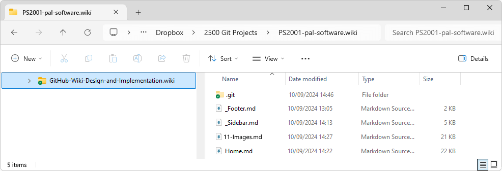
                    </a></td></tr>
<!-- CAPTION -->    <tr><th align="center">
<!-- CAPTION TEXT -->   Figure 3.2 &mdash; The default GitHub folder arrangement for a Wiki
                    </th></tr>
</table>                             <!-- FIGURE END  🔼🔼(BLANK LINE BELOW) -->

**[:arrow_up: Top](#idtop)**<!-- END OF SECTION - LINK TO TOP🔽🔽(BLANK LINE ABOVE) -->

                        <!-- END OF SECTION - SEPARATING LINE                    -->
                         <!-- END OF SECTION - PADDING    🔼🔼(BLANK LINE BELOW) -->

## 3.2<!--      🟥H2🟥-->Create a sidebar or footer locally

*This is a slight aside from the folder structure, but is necessary to explain how the folder structure impacts the sidebar and footer (in particular how it impacts individual sidebars and footers for different Wiki pages).*

If there were no sidebar or footer created using GitHub, the `_sidebar.md` and `_footer.md` files will not be present in the root folder.

It is possible to create sidebars and footers in a local copy of the Wiki and then push them to GitHub. All that is required is that either or both the `_sidebar.md` and `_footer.md` files are created locally in the root directory (where the `Home.md` file is), the files must have some content.

A typical example of the `_Sidebar.md` file for this Wiki is shown below *(in VS Code)*:

<table name="f-03-03" align="center"><!-- FIGURE START🔽🔽(BLANK LINE ABOVE) -->
<!-- Figure row --> <tr><td>
<!-- LINK -->         <a href="../03-0000/02-images/figm-03-03.png" title="Use ctrl+click to open image in new tab">
<!-- FIGURE -->         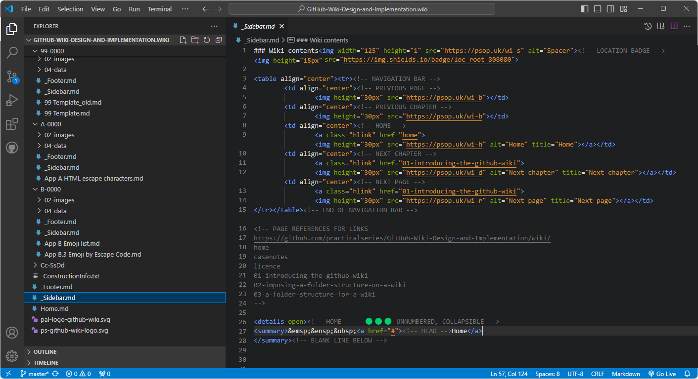
                    </a></td></tr>
<!-- CAPTION -->    <tr><th align="center">
<!-- CAPTION TEXT -->   Figure 3.3 &mdash; Editing a sidebar in VS Code
                    </th></tr>
</table>                             <!-- FIGURE END  🔼🔼(BLANK LINE BELOW) -->

The above code renders like this *(the bit you can see in the listing above is the navigation bar at the top of the image below)*:

<table name="f-03-04" align="center"><!-- FIGURE START🔽🔽(BLANK LINE ABOVE) -->
<!-- Figure row --> <tr><td>
<!-- LINK -->         <a href="../03-0000/02-images/figm-03-04.png" title="Use ctrl+click to open image in new tab">
<!-- FIGURE -->         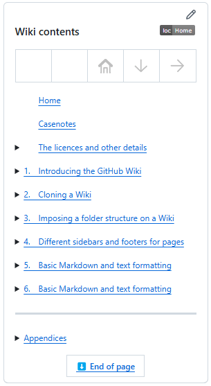
                    </a></td></tr>
<!-- CAPTION -->    <tr><th align="center">
<!-- CAPTION TEXT -->   Figure 3.4 &mdash; Rendered version of the sidebar
                    </th></tr>
</table>                             <!-- FIGURE END  🔼🔼(BLANK LINE BELOW) -->

Creating or changing these files within VS Code and pushing the changes to GitHub will change the common sidebar and footer used by all pages.

A full discussion of sidebars and footers and their contents is given in <a href="16.06-practicalseries-wiki-conventions#166sidebar">section&nbsp;16.6</a> and <a href="16.06-practicalseries-wiki-conventions#167footer">section&nbsp;16.7</a> (these relate to how they are constructed for the PracticalSeries Wiki pages).

**[:arrow_up: Top](#idtop)**<!-- END OF SECTION - LINK TO TOP🔽🔽(BLANK LINE ABOVE) -->

                        <!-- END OF SECTION - SEPARATING LINE                    -->
                         <!-- END OF SECTION - PADDING    🔼🔼(BLANK LINE BELOW) -->

## 3.3<!--      🟥H2🟥-->Page naming and Wiki limits

Before starting the folder structure, it is worth examining the page naming conventions used in the PracticalSeries Wikis. These to some extent determine the folder names that will be used in the Wiki folder structure.

It is also worth knowing the limits that GitHub imposes on Wikis and the files that can be included.

### 3.3.1<!--   🟥H3🟥-->Supported file types

Wiki content pages are generally Markdown files (.md), virtually all Wiki pages are Markdown files, but other filetypes are supported and show up in the GitHub generated contents area. The following file types are supported for page content:

<table name="t-03-01" align="center"><!-- TABLE START🔽🔽(BLANK LINE ABOVE) -->
<!-- HEADER ROW --><tr>
                     <th width="320" align="left">Page Content Language</th>
                     <th width="190">File extension</th>
                   </tr>
<!-- DATA ROW -->  <tr>
                     <td>Markdown (default format for a Wiki)</td>
                     <td align="center"><code>.md</code></td>
                   </tr>
<!-- DATA ROW -->  <tr>
                     <td>AsciiDoc</td>
                     <td align="center"><code>.asciidoc</code></td>
                   </tr>
<!-- DATA ROW -->  <tr>
                     <td>Creole</td>
                     <td align="center"><code>.creole</code></td>
                   </tr>
<!-- DATA ROW -->  <tr>
                     <td>MediaWiki</td>
                     <td align="center"><code>.mediaWiki</code></td>
                   </tr>
<!-- DATA ROW -->  <tr>
                     <td>Org-mode</td>
                     <td align="center"><code>.org</code></td>
                   </tr>
<!-- DATA ROW -->  <tr>
                     <td>Pod</td>
                     <td align="center"><code>.pod</code></td>
                   </tr>
<!-- DATA ROW -->  <tr>
                     <td>RDoc</td>
                     <td align="center"><code>.rdoc</code></td>
                   </tr>
<!-- DATA ROW -->  <tr>
                     <td>ReStructuredText</td>
                     <td align="center"><code>.rest</code></td>
                   </tr>
<!-- DATA ROW -->  <tr>
                     <td>Textile</td>
                     <td align="center"><code>.textile</code></td>
                   </tr>
<!-- CAPTION -->   <tr>
<!-- LIST WIDTH -->  <th align="left" colspan="2"">
<!-- CAPTION TEXT -->Table 3.1 &mdash; Wiki page content file types
                     </th></tr>
</table>                             <!-- TABLE END  🔼🔼(BLANK LINE BELOW) -->

> [!IMPORTANT]<!-- IMPORTANT ALERT -->
> *Plain text* `.txt` *files and rich text files* `.rtf` *are not supported as page content platforms and will not appear in the contents area.*

GitHub supports these common image files:

<table name="t-03-02" align="center"><!-- TABLE START🔽🔽(BLANK LINE ABOVE) -->
<!-- HEADER ROW --><tr>
                     <th width="320" align="left">Image file</th>
                     <th width="190">File extension</th>
                   </tr>
<!-- DATA ROW -->  <tr>
                     <td>AV1 (Alliance for Open Media Video)</td>
                     <td align="center"><code>.avif</code></td>
                   </tr>
<!-- DATA ROW -->  <tr>
                     <td>BMP (Bitmap)</td>
                     <td align="center"><code>.bmp</code></td>
                   </tr>
<!-- DATA ROW -->  <tr>
                     <td>JPEG (Joint Photographic Experts Group)</td>
                     <td align="center"><code>.jpg</code> or <code>.jpeg</code></td>
                   </tr>
<!-- DATA ROW -->  <tr>
                     <td>PNG (portable network graphic)</td>
                     <td align="center"><code>.png</code></td>
                   </tr>
<!-- DATA ROW -->  <tr>
                     <td>GIF (graphic interchange format)</td>
                     <td align="center"><code>.gif</code></td>
                   </tr>
<!-- DATA ROW -->  <tr>
                     <td>PSD (Photoshop document file)</td>
                     <td align="center"><code>.psd</code></td>
                   </tr>
<!-- DATA ROW -->  <tr>
                     <td>SVG (scalable vector graphic)</td>
                     <td align="center"><code>.svg</code></td>
                   </tr>
<!-- DATA ROW -->  <tr>
                     <td>WEBP (web picture format)</td>
                     <td align="center"><code>.webp</code></td>
                   </tr>
<!-- CAPTION -->   <tr>
<!-- LIST WIDTH -->  <th align="left" colspan="2"">
<!-- CAPTION TEXT -->Table 3.2 &mdash; Wiki page renderable image formats
                     </th></tr>
</table>                             <!-- TABLE END  🔼🔼(BLANK LINE BELOW) -->

GitHub supports these common video files:

<table name="t-03-03" align="center"><!-- TABLE START🔽🔽(BLANK LINE ABOVE) -->
<!-- HEADER ROW --><tr>
                     <th width="320" align="left">Video file</th>
                     <th width="190">File extension</th>
                   </tr>
<!-- DATA ROW -->  <tr>
                     <td>MP4 (Moving Picture Experts Group 4)</td>
                     <td align="center"><code>.mp4</code></td>
                   </tr>
<!-- DATA ROW -->  <tr>
                     <td>MOV (QuickTime movie format)</td>
                     <td align="center"><code>.mov</code></td>
                   </tr>
<!-- DATA ROW -->  <tr>
                     <td>WEBM (web movie format)</td>
                     <td align="center"><code>.webm</code></td>
                   </tr>
<!-- CAPTION -->   <tr>
<!-- LIST WIDTH -->  <th align="left" colspan="2"">
<!-- CAPTION TEXT -->Table 3.3 &mdash; Wiki page recognised video formats
                     </th></tr>
</table>                             <!-- TABLE END  🔼🔼(BLANK LINE BELOW) -->

> [!IMPORTANT]<!-- IMPORTANT ALERT -->
> *Video files themselves cannot be played within a Wiki page, however, the formats are recognised as video files and file size limits are adjusted accordingly (see <a href="#334limits-for-wiki-pages">Section&nbsp;3.3.4</a>).*

**[:arrow_up: Top](#idtop)**<!-- END OF SECTION - LINK TO TOP🔽🔽(BLANK LINE ABOVE) -->

                        <!-- END OF SECTION - SEPARATING LINE                    -->
                         <!-- END OF SECTION - PADDING    🔼🔼(BLANK LINE BELOW) -->

### 3.3.2<!--   🟥H3🟥-->Page names and numbering

There are two things of importance when naming pages, the first is that GitHub always displays the page filename name at the top of the Wiki page, point &#x2460; below:

<table name="f-03-05" align="center"><!-- FIGURE START🔽🔽(BLANK LINE ABOVE) -->
<!-- Figure row --> <tr><td>
<!-- LINK -->         <a href="../03-0000/02-images/figm-03-05.png" title="Use ctrl+click to open image in new tab">
<!-- FIGURE -->         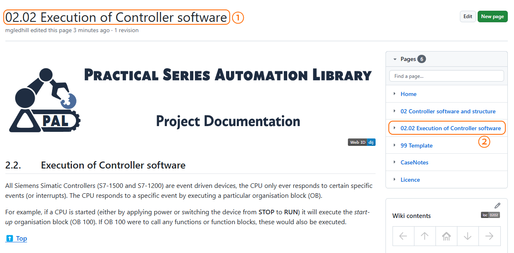
                    </a></td></tr>
<!-- CAPTION -->    <tr><th align="center">
<!-- CAPTION TEXT -->   Figure 3.5 &mdash; Page name displayed at top of a Wiki page
                    </th></tr>
</table>                             <!-- FIGURE END  🔼🔼(BLANK LINE BELOW) -->

The second point is that the page filename is also listed in the GitHub generated Pages section *(effectively a contents list)*, point &#x2461;.

The first point isn’t particularly serious, but the name should match the first heading on the page (in this example: *Execution of Controller software)*.

The second point is more problematic and was touched upon in <a href="01-introducing-the-github-wiki#152contents-pages-area">Section&nbsp;1.5.2</a>.

The order of the pages in the Pages area is listed in alphanumeric order (based on the ASCII table https://www.ascii-code.com/ to those of a certain age, or nowadays the Unicode table https://www.unicode.org/charts/charindex.html<a name="rn-01" href="#fn-01"><!-- 🟨FOOTNOTE LINK🟨-->💠1</a>). 

This means that if pages were numbered directly with chapter, section and division then the following pages:

&emsp;&emsp;&nbsp;&nbsp; ${\large \color{#1F883D}\text{5.5\ The\ fifth\ section\ in\ chapter\ five}}$

And

&emsp;&emsp;&nbsp;&nbsp; ${\large \color{#1F883D}\text{5.10\ The\ tenth\ section\ in\ chapter\ five}}$

Would appear in the Pages area as:

<table name="f-03-06" align="center"><!-- FIGURE START🔽🔽(BLANK LINE ABOVE) -->
<!-- Figure row --> <tr><td>
<!-- LINK -->         <a href="../03-0000/02-images/figm-03-06.png" title="Use ctrl+click to open image in new tab">
<!-- FIGURE -->         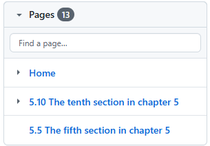
                    </a></td></tr>
<!-- CAPTION -->    <tr><th align="center">
<!-- CAPTION TEXT -->   Figure 3.6 &mdash; Pages listed in the wrong order
</table>                             <!-- FIGURE END  🔼🔼(BLANK LINE BELOW) -->

I.e. the ${\large \color{#1F883D}\text{5.10\ Section}}$ appears before the ${\large \color{#1F883D}\text{5.10\ Section}}$. GitHub puts them in the wrong order.

It’s even worse if there are no section numbers and the pages are just given a title. Under these circumstances the pages will appear in alphabetical order and this is probably not the order that is required.

To get round this problem chapter, section and division numbers must always be two digits and leading zeros must be used where necessary. This can be seen in the following example:

<table name="f-03-07" align="center"><!-- FIGURE START🔽🔽(BLANK LINE ABOVE) -->
<!-- Figure row --> <tr><td>
<!-- LINK -->         <a href="../03-0000/02-images/figm-03-07.png" title="Use ctrl+click to open image in new tab">
<!-- FIGURE -->         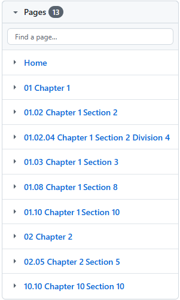
                    </a></td></tr>
<!-- CAPTION -->    <tr><th align="center">
<!-- CAPTION TEXT -->   Figure 3.6 &mdash; Pages listed in the right order
</table>                             <!-- FIGURE END  🔼🔼(BLANK LINE BELOW) -->

All pages within the PracticalSeries Wikis are given chapter, section and division numbers *(with the exception of the Home page and some other special pages)*.

While it is necessary for the filenames to start with the chapter, section and division numbers (with leading zeros), any manually configured contents list (that links to these files) can show the abbreviated number (without leading zeros). The following diagram shows the numbering structure for the first two chapters of the this Wiki:

<table name="f-03-08" align="center"><!-- FIGURE START🔽🔽(BLANK LINE ABOVE) -->
<!-- Figure row --> <tr><td>
<!-- LINK -->         <a href="../03-0000/02-images/figm-03-08.png" title="Use ctrl+click to open image in new tab">
<!-- FIGURE -->         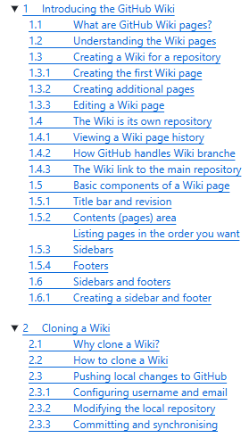
                    </a></td></tr>
<!-- CAPTION -->    <tr><th align="center">
<!-- CAPTION TEXT -->   Figure 3.8 &mdash; Contents list for a Wiki
</table>                             <!-- FIGURE END  🔼🔼(BLANK LINE BELOW) -->

The numbering is always in the format:

&emsp;&emsp;&nbsp;&nbsp; ${\large \color{#1F883D}\text{Chapter.Section.Division}}$

Thus, ${\large \color{#1F883D}\text{1.5.2\ Contents\ area}}$ is **division 2, of section 5 in chapter 1**.

The corresponding page filename would be

&emsp;&emsp;&nbsp;&nbsp; ${\large \color{#1F883D}\text{01.05.02\ Contents\ area.md}}$

The rules for these naming conventions are given in the following section:

**[:arrow_up: Top](#idtop)**<!-- END OF SECTION - LINK TO TOP🔽🔽(BLANK LINE ABOVE) -->

                        <!-- END OF SECTION - SEPARATING LINE                    -->
                         <!-- END OF SECTION - PADDING    🔼🔼(BLANK LINE BELOW) -->

### 3.3.3<!--   🟥H3🟥-->Rules for page numbering

The chapter, section and division numbering of pages within the PracticalSeries Wikis is important, it affects how the folders for each page are numbered in the Wiki folder structure. The following are the rules for page numbering:

<table name="l-03-01" align="center">   <!-- LIST START🔽🔽(BLANK LINE ABOVE) -->
<!-- MAIN LIST - START --><tr><td colspan="2">
&emsp;&#x2776;<!-- 1  -->&emsp;&ensp;&thinsp;<!-- TEXT -->Always use a numbering structure: 
<!-- END OF MAIN LIST --> </td></tr>
<!-- SUB LIST - START --> <tr><td></td><td><ul>
<li>&emsp;&emsp;<!-- TEXT -->Chapter number only for small Wikis <code>Cc</code></li>
<li>&emsp;&emsp;<!-- TEXT -->Chapter and section <code>Cc.Ss</code> or</li>
<li>&emsp;&emsp;<!-- TEXT -->Chapter Section and division <code>Cc.Ss.Dd</code></li>
<!-- END OF SUB LIST -->  </ul></td></tr>
<!-- MAIN LIST - START --><tr><td colspan="2">
&emsp;&#x2777;<!-- 2  -->&emsp;&ensp;&thinsp;<!-- TEXT -->Pages that start at a **chapter** should be named: 
<!-- END OF MAIN LIST --> </td></tr>
<!-- SUB LIST - START --> <tr><td></td><td><ul>
<li>&emsp;&emsp;<!-- TEXT --><code>Cc Chapter title text.md</code></li>
<!-- END OF SUB LIST -->  </ul></td></tr>
<!-- MAIN LIST - START --><tr><td colspan="2">
&emsp;&#x2778;<!-- 3  -->&emsp;&ensp;&thinsp;<!-- TEXT -->Pages that start at a **section** should be named: 
<!-- END OF MAIN LIST --> </td></tr>
<!-- SUB LIST - START --> <tr><td></td><td><ul>
<li>&emsp;&emsp;<!-- TEXT --><code>Cc.Ss Section title text.md</code></li>
<!-- END OF SUB LIST -->  </ul></td></tr>
<!-- MAIN LIST - START --><tr><td colspan="2">
&emsp;&#x2779;<!-- 4  -->&emsp;&ensp;&thinsp;<!-- TEXT -->4	Pages that start at a **division** should be named: 
<!-- END OF MAIN LIST --> </td></tr>
<!-- SUB LIST - START --> <tr><td></td><td><ul>
<li>&emsp;&emsp;<!-- TEXT --><code>Cc.Ss.Dd Division title text.md</code></li>
<!-- END OF SUB LIST -->  </ul></td></tr>
<!-- MAIN LIST - START --><tr><td colspan="2">
&emsp;&#x277A;<!-- 5  -->&emsp;&ensp;&thinsp;<!-- TEXT --><code>Cc</code>, <code>Ss</code> and <code>Dd</code> must always be two numerical digits 
&emsp;&#x277B;<!-- 6  -->&emsp;&ensp;&thinsp;<!-- TEXT -->Leading zeros must be used where necessary 
&emsp;&#x277C;<!-- 7  -->&emsp;&ensp;&thinsp;<!-- TEXT --><code>Ss</code> and <code>Dd</code> must always preceded by a full stop character (<code>.</code>) 
&emsp;&#x277D;<!-- 8  -->&emsp;&ensp;&thinsp;<!-- TEXT -->The title text must be separated from the last numerical digit with a space character 
&emsp;&#x277E;<!-- 9  -->&emsp;&ensp;&thinsp;<!-- TEXT -->The title text (the <code>.md</code> filename) must be correctly capitalised 
<!-- END OF MAIN LIST --> </td></tr>
<!-- CAPTION -->          <tr><th width="52"></th><!-- SPACER -->
<!-- LIST WIDTH -->         <th align="left" width="650">
<!-- CAPTION TEXT -->&emsp;<!-- TEXT -->List 3.1 &mdash; Rules for page numbering
                           </th></tr>
</table>                              <!-- LIST END    🔼🔼(BLANK LINE BELOW) -->

> [!IMPORTANT]<!-- IMPORTANT ALERT -->
> *This structure only caters for chapter, section and division numbers in the range 0-99. This should be more than adequate for most document.*

**[:arrow_up: Top](#idtop)**<!-- END OF SECTION - LINK TO TOP🔽🔽(BLANK LINE ABOVE) -->

                        <!-- END OF SECTION - SEPARATING LINE                    -->
                         <!-- END OF SECTION - PADDING    🔼🔼(BLANK LINE BELOW) -->

### 3.3.4<!--   🟥H3🟥-->Limits for Wiki pages

There are some absolute limits for the size of Wiki pages, generally, these are quite liberal and are unlikely to cause problems. These limits are:

<table name="l-03-02" align="center"><!-- LIST START🔽🔽(BLANK LINE ABOVE) -->
<!-- INDEXED LIST --> <tr><td>
&emsp;&#x2776;<!-- 1  -->&emsp;&ensp;&thinsp;<!-- TEXT -->A Wiki can have a maximum of 5000 files within it (of any type) 
&emsp;&#x2777;<!-- 2  -->&emsp;&ensp;&thinsp;<!-- TEXT -->A Wiki page can have a maximum of 484,044 characters 
&emsp;&#x2778;<!-- 3  -->&emsp;&ensp;&thinsp;<!-- TEXT -->The maximum size for a Wiki page (<code>.md</code> file) is 0.5 MB 
&emsp;&#x2779;<!-- 4  -->&emsp;&ensp;&thinsp;<!-- TEXT -->The maximum size for images and videos is 10 MB 
&emsp;&#x277A;<!-- 5  -->&emsp;&ensp;&thinsp;<!-- TEXT -->The maximum size for any other file is 25 MB (pdfs, docs &c.) 
&emsp;&#x277B;<!-- 6  -->&emsp;&ensp;&thinsp;<!-- TEXT -->Files over 100 MB cannot be uploaded 
<!-- END OF LIST -->  </td></tr>
<!-- CAPTION -->      <tr>
<!-- LIST WIDTH -->            <th align="left" width="600">&emsp;&emsp;&emsp;&ensp;&nbsp;&thinsp;
<!-- CAPTION TEXT -->List 3.2 &mdash; Wiki page file size limits
                    </th></tr>
</table>                             <!-- LIST END  🔼🔼(BLANK LINE BELOW) -->

The largest files within the Wiki associated with this document are some of the character tables in the Appendices *(the largest is <a href="app-b-emoji-list#b2full-list-of-emojis-by-category">Appendix&nbsp;B.2</a> and the `.md` file is 501 kB, just less than the 512 kB or 0.5 MB limit)*. These all work, but occasionally, GitHub generates an error saying the page takes too long to render (reloading the page usually works).

The above limits do not generally cause any problems with Wiki pages *(you are unlikely to hit any of them)*. With the PracticalSeries Wiki pages, other restrictions are imposed to manage page lengths and the splitting of text in to individual Wiki pages.

The rules for how chapters, sections and divisions are split into Wiki pages is fairly arbitrary and generally depends on the resultant length of the Wiki page.

All PracticalSeries Wikis use the chapter, section, division numbering `Cc.Ss.Dd`, In practice, the vast majority of PracticalSeries Wiki pages start at the *chapter* level (each page *“mostly”* starts at a new chapter). For very long chapters, the pages break at the section level. There are no breaks at the division level.

To give some idea of the (very) rough rules of thumb employed on PS Wiki pages, the following conditions are applied:

<table name="l-03-03" align="center"><!-- LIST START🔽🔽(BLANK LINE ABOVE) -->
<!-- INDEXED LIST --> <tr><td>
&emsp;&#x2776;<!-- 1  -->&emsp;&ensp;&thinsp;<!-- TEXT -->Limit the number of lines on a page to a maximum of 500 
&emsp;&#x2777;<!-- 2  -->&emsp;&ensp;&thinsp;<!-- TEXT -->Limit the number of words on a page to a maximum of 4000 
&emsp;&#x2778;<!-- 3  -->&emsp;&ensp;&thinsp;<!-- TEXT -->A new Chapter must always start on a its own Wiki page 
&emsp;&#x2779;<!-- 4  -->&emsp;&ensp;&thinsp;<!-- TEXT -->If splitting a chapter do so at a new section 
&emsp;&#x277A;<!-- 5  -->&emsp;&ensp;&thinsp;<!-- TEXT -->Avoid starting new pages at the division level 
&emsp;&#x277B;<!-- 6  -->&emsp;&ensp;&thinsp;<!-- TEXT -->A new page can start with a new division, but only when absolutely necessary 
&emsp;&#x277C;<!-- 7  -->&emsp;&ensp;&thinsp;<!-- TEXT -->Never start a new Wiki page with an inline (unnumbered) heading 
&emsp;&#x277D;<!-- 8  -->&emsp;&ensp;&thinsp;<!-- TEXT -->Never start a new Wiki page in the middle of body text 
<!-- END OF LIST -->  </td></tr>
<!-- CAPTION -->      <tr>
<!-- LIST WIDTH -->            <th align="left" width="650">&emsp;&emsp;&emsp;&ensp;&nbsp;&thinsp;
<!-- CAPTION TEXT -->List 3.3 &mdash; Guidelines for Wiki pages
                    </th></tr>
</table>                             <!-- LIST END  🔼🔼(BLANK LINE BELOW) -->

**[:arrow_up: Top](#idtop)**<!-- END OF SECTION - LINK TO TOP🔽🔽(BLANK LINE ABOVE) -->

                        <!-- END OF SECTION - SEPARATING LINE                    -->
                         <!-- END OF SECTION - PADDING    🔼🔼(BLANK LINE BELOW) -->

## 3.4<!--      🟥H2🟥-->A Practical Wiki folder structure

The default GitHub arrangement may be enough for small Wikis, but it is not sufficient for more complex Wikis like the PracticalSeries (PS) Wikis. These contain quite comprehensive sets of documentation and need a little more sophistication than is provided for with the basic GitHub structure. To do this, each Wiki page is stored in its own subfolder.

The mechanism described here is the one used throughout the PracticalSeries Wiki pages. It can be applied or adapted to any other GitHub Wiki

These are the principal reasons for using a folder structure within a Wiki:

<table name="l-03-04" align="center"><!-- LIST START🔽🔽(BLANK LINE ABOVE) -->
<!-- INDEXED LIST --> <tr><td>
&emsp;&#x2776;<!-- 1  -->&emsp;&ensp;&thinsp;<!-- TEXT -->It allows each page to have its own, individual sidebar and footer 
&emsp;&#x2777;<!-- 2  -->&emsp;&ensp;&thinsp;<!-- TEXT -->It allows the pages to be better organised 
&emsp;&#x2778;<!-- 3  -->&emsp;&ensp;&thinsp;<!-- TEXT -->Each page subfolder has its own folders for images and data 
<!-- END OF LIST -->  </td></tr>
<!-- CAPTION -->      <tr>
<!-- LIST WIDTH -->            <th align="left" width="650">&emsp;&emsp;&emsp;&ensp;&nbsp;&thinsp;
<!-- CAPTION TEXT -->List 3.4 &mdash; Reasons for using a folder structure 
                    </th></tr>
</table>                             <!-- LIST END  🔼🔼(BLANK LINE BELOW) -->

In the case of this Wiki [GitHub Wiki — Design and Implementation](https://github.com/practicalseries/GitHub-Wiki-Design-and-Implementation/wiki/), only the Home page, a common logo image and the home page sidebar and footer is in the root directory of the Wiki repository:

All the other pages are in their own subfolder. 

This page, for example, has the filename `03 A folder structure for a Wiki.md` and is in the folder
`03-0000`.

It can be seen here in VS Code:

<table name="f-03-09" align="center"><!-- FIGURE START🔽🔽(BLANK LINE ABOVE) -->
<!-- Figure row --> <tr><td>
<!-- LINK -->         <a href="../03-0000/02-images/figm-03-09.png" title="Use ctrl+click to open image in new tab">
<!-- FIGURE -->         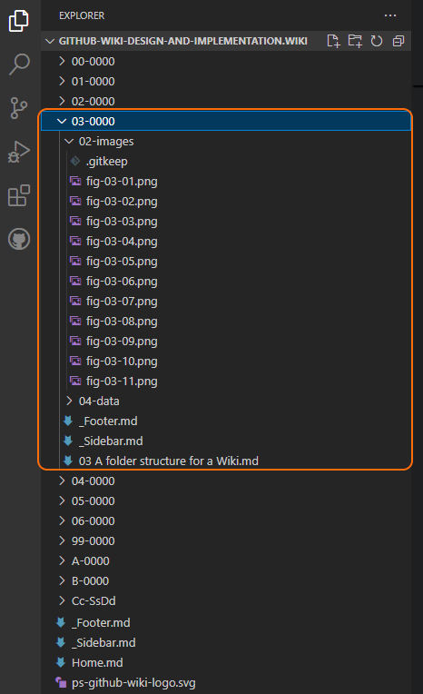
                    </a></td></tr>
<!-- CAPTION -->    <tr><th align="center">
<!-- CAPTION TEXT -->   Figure 3.9 &mdash; A Wiki page subdirectory
                    </th></tr>
</table>                             <!-- FIGURE END  🔼🔼(BLANK LINE BELOW) -->

**[:arrow_up: Top](#idtop)**<!-- END OF SECTION - LINK TO TOP🔽🔽(BLANK LINE ABOVE) -->

                        <!-- END OF SECTION - SEPARATING LINE                    -->
                         <!-- END OF SECTION - PADDING    🔼🔼(BLANK LINE BELOW) -->

### 3.4.1<!--   🟥H3🟥-->Subfolder names for Wiki pages

Each PS Wiki page is stored in its own subfolder. The subfolder is simply a number in the format:

	Cc-SsDd

Where Cc is the chapter number, Ss is the section number and Dd is the division number (all with leading zeros where required).

Thus, a Wiki page subfolder is made up of the chapter, section and division number of the first heading on the page. If it is a new chapter, then Ss and Dd will be zero, i.e.:

&emsp;&emsp;&nbsp;&nbsp; ${\large \color{#446FBD}\text{Cc-0000}}$

Thus, if a Wiki page starts at chapter 3, it will be in subfolder:

&emsp;&emsp;&nbsp;&nbsp; ${\large \color{#446FBD}\text{03-0000}}$

If a page were to start at chapter 4, section 2 it would be in subfolder:

&emsp;&emsp;&nbsp;&nbsp; ${\large \color{#446FBD}\text{04-0200}}$

If a page were to start at a Division, say chapter 11, section 12, division 15; it would be stored in subfolder:

&emsp;&emsp;&nbsp;&nbsp; ${\large \color{#446FBD}\text{11-1215}}$

> [!TIP]<!-- TIP ALERT -->
> *Starting pages at a division is not recommended and is generally avoided on the PracticalSeries Wiki pages — it’s there if you need it, but try not to do it.*

The folder structure also accommodates Appendices. Appendices are numbered with a letter (A-Z) in place of a chapter number, the sections and divisions within an appendix are numbed in exactly the same was as normal chapters.

The folder name for Appendix B, would be:

&emsp;&emsp;&nbsp;&nbsp; ${\large \color{#446FBD}\text{B-0000}}$

There is no need to put a leading zero before the appendix letter (these will automatically fall into the correct alphabetical order). This arrangement accommodates up to 26 appendices (A to Z), if more than this are required, it is better to us a numerical structure for appendices.

The folder structure for this Wiki looks like this (at the time of writing):

<table name="f-03-10" align="center"><!-- FIGURE START🔽🔽(BLANK LINE ABOVE) -->
<!-- Figure row --> <tr><td>
<!-- LINK -->         <a href="../03-0000/02-images/figm-03-10.png" title="Use ctrl+click to open image in new tab">
<!-- FIGURE -->         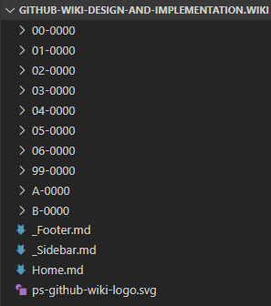
                    </a></td></tr>
<!-- CAPTION -->    <tr><th align="center">
<!-- CAPTION TEXT -->   Figure 3.10 &mdash; A typical example of the Wiki folder structure
                    </th></tr>
</table>                             <!-- FIGURE END  🔼🔼(BLANK LINE BELOW) -->

Files for each Wiki page are stored in the specific folders. This can be seen in the following image (page files are shown in orange, the individual subfolders in white and the root folder is highlighted in blue. The individual sidebar files are in purple and the individual footer files in dark blue):

<table name="f-03-11" align="center"><!-- FIGURE START🔽🔽(BLANK LINE ABOVE) -->
<!-- Figure row --> <tr><td>
<!-- LINK -->         <a href="../03-0000/02-images/figm-03-11.png" title="Use ctrl+click to open image in new tab">
<!-- FIGURE -->         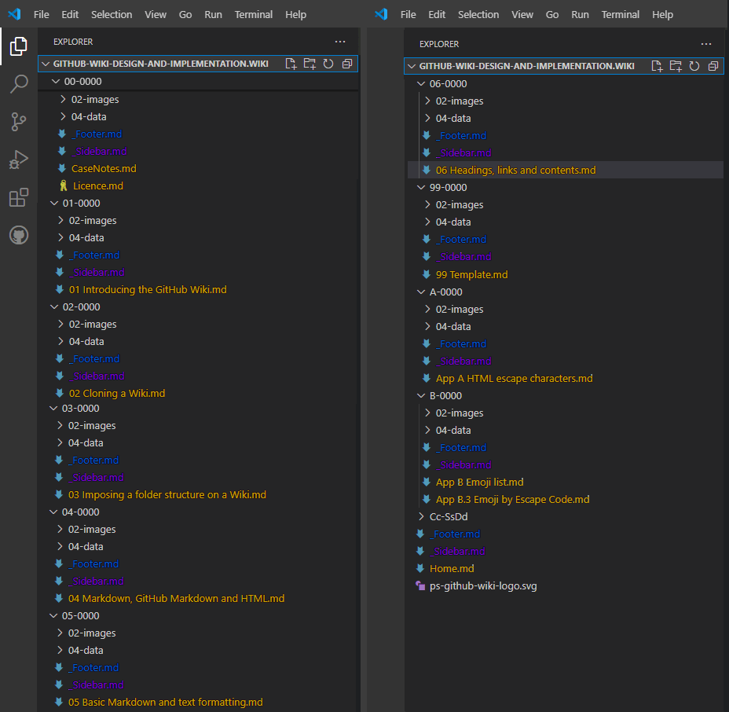
                    </a></td></tr>
<!-- CAPTION -->    <tr><th align="center">
<!-- CAPTION TEXT -->   Figure 3.11 &mdash; This Wiki folder structure
                    </th></tr>
</table>                             <!-- FIGURE END  🔼🔼(BLANK LINE BELOW) -->

**[:arrow_up: Top](#idtop)**<!-- END OF SECTION - LINK TO TOP🔽🔽(BLANK LINE ABOVE) -->

                        <!-- END OF SECTION - SEPARATING LINE                    -->
                         <!-- END OF SECTION - PADDING    🔼🔼(BLANK LINE BELOW) -->

### 3.4.2<!--   🟥H3🟥-->Storing images and other data

Images and data for a particular page are stored in two separate folders within the subfolder for a particular page, this can be seen here:

<table name="f-03-12" align="center"><!-- FIGURE START🔽🔽(BLANK LINE ABOVE) -->
<!-- Figure row --> <tr><td>
<!-- LINK -->         <a href="../03-0000/02-images/figm-03-12.png" title="Use ctrl+click to open image in new tab">
<!-- FIGURE -->         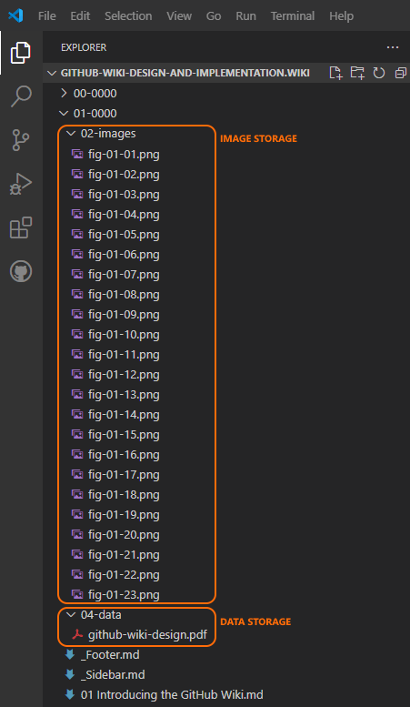
                    </a></td></tr>
<!-- CAPTION -->    <tr><th align="center">
<!-- CAPTION TEXT -->   Figure 3.12 &mdash; Storing images and data
                    </th></tr>
</table>                             <!-- FIGURE END  🔼🔼(BLANK LINE BELOW) -->

Figures are stored in a subfolder called:

&emsp;&emsp;&nbsp;&nbsp; ${\large \color{#446FBD}\text{02-images}}$

And any data files are stored in 

&emsp;&emsp;&nbsp;&nbsp; ${\large \color{#446FBD}\text{04-data}}$

It can be seen in <a href="#f-03-12">Figure&nbsp;3.12</a> that there are three .png images stored for the page:

&emsp;&emsp;&nbsp;&nbsp; ${\large \color{#446FBD}\text{01\ Introducing\ the\ GitHub\ Wiki.md}}$

The ${\large \color{#446FBD}\text{04-data}}$ folder is to store any other type of file that may be linked to a particular page *(a pdf file in this case)*.

<!-- FOOTNOTE SEPARATOR 🟡🟡🟡🟡🟡 -->
<a name="idfn" href="#idfn">Footnotes:<!-- 🟡FOOTNOTE TITLE🟡 -->&emsp;&emsp;&emsp;&emsp;&emsp;</a>
   

> [!NOTE]<!-- 🟡FOOTNOTE CONTENT -->
> <a name="fn-01" href="#rn-01">💠1</a>&emsp;<!-- FOOTNOTE CONTENT TEXT -->If there is a worse website than the Unicode website I’d like to see it. It has a Circa 1989 feel, it’s impenetrable and virtually useless. If Tim Berners-Lee had seen it, he would have given up on the World Wide Web there and then.<!--  CONTENT TEXT END --><a href="#rn-01">↩</a>

              <!-- END OF PAGE - 🟥🟥🟥🟥🟥 PADDING🔽🔽(NO BLANK LINE ABOVE) -->

                <!-- END OF PAGE - 🟥🟥🟥🟥🟥 SEPARATING LINE                   -->
<!-- END OF PAGE – 🟥🟥🟥🟥🟥 MARKER 🔼🔼                      -->