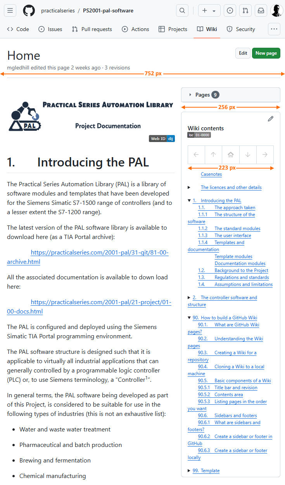

<!-- 🟢TOP OF PAGE - MARKER  (BLANK LINE BELOW)   -->

<!-- 🟢TOP OF PAGE - LOGO IMAGE -->

      <!-- 🟢TOP OF PAGE - WEB ID     --> 

# 4<!--         🟥H1🟥-->Different sidebars and footers

It was mentioned earlier (<a href="03-a-wiki-folder-structure#33page-naming-and-wiki-limits">section&nbsp;3.3</a> <!-- Off-page Section -->) that the PS Wiki pages require the ability for each Wiki page to have its own sidebar and footer (rather than using the default sidebar and footer created using GitHub). It turns out that this is remarkably easy, the only problem being that it has to be done on a local machine and then pushed to GitHub. It can’t be done via the GitHub website directly.

To make a sidebar and footer unique to a page, or to a group of pages, simply put the page in a subfolder and then create the files `_Sidebar.md` and `_Footer.md` within that same subfolder and the these will be used in place of the default sidebar and footer files in the root directory.

It can be seen here for the PracticalSeries PAL Software Wiki:

<table name="f-04-01" align="center"><!-- FIGURE START🔽🔽(BLANK LINE ABOVE) -->
<!-- Figure row --> <tr><td>
<!-- LINK -->         <a href="../04-0000/02-images/figm-04-01.png" title="Use ctrl+click to open image in new tab">
<!-- FIGURE -->         
                    </a></td></tr>
<!-- CAPTION -->    <tr><th align="center">
<!-- CAPTION TEXT -->   Figure 4.1 &mdash; Individual sidebars and footers for different pages
                    </th></tr>
</table>                             <!-- FIGURE END  🔼🔼(BLANK LINE BELOW) -->

GitHub Wikis always use the `_Sidebar.md` and `_Footer.md` files in the subfolder containing the page being displayed in preference to those in the root folder. 

In the image above, both the `CaseNotes.md` and `Licence.md` pages have the same sidebar and footer, this is because they are both in the same subfolder `00-0000`.

It really is that simple.

If there is no `_Sidebar.md` or `_Footer.md` files in the current subdirectory, GitHub will use the default `_Sidebar.md` or `_Footer.md` file in the root directory (containing the `Home.md` file) instead.

**[:arrow_up: Top](#idtop)**<!-- END OF SECTION - LINK TO TOP🔽🔽(BLANK LINE ABOVE) -->

                        <!-- END OF SECTION - SEPARATING LINE                    -->
                         <!-- END OF SECTION - PADDING    🔼🔼(BLANK LINE BELOW) -->

## 4.1<!--      🟥H2🟥-->How sidebars work

Sidebars are just an area that appears at the top-right side of the page, the PAL Software side bar for the home page looks like this:

<table name="f-04-02" align="center"><!-- FIGURE START🔽🔽(BLANK LINE ABOVE) -->
<!-- Figure row --> <tr><td>
<!-- LINK -->         <a href="../04-0000/02-images/figm-04-02.png" title="Use ctrl+click to open image in new tab">
<!-- FIGURE -->         
                    </a></td></tr>
<!-- CAPTION -->    <tr><th align="center">
<!-- CAPTION TEXT -->   Figure 4.2 &mdash; Sidebar arrangement
                    </th></tr>
</table>                             <!-- FIGURE END  🔼🔼(BLANK LINE BELOW) -->

By default, the sidebar is 296&nbsp;pixels wide (it won’t get any wider than this irrespective of the browser window size) and has a usable area that is 262&nbsp;pixels wide.

If the browser window width contracts to less than 996&nbsp;pixels wide, the sidebar is reduced in width to 256&nbsp;pixels with a usable area that is 233&nbsp;pixels wide (see below):

<table name="f-04-03" align="center"><!-- FIGURE START🔽🔽(BLANK LINE ABOVE) -->
<!-- Figure row --> <tr><td>
<!-- LINK -->         <a href="../04-0000/02-images/figm-04-03.png" title="Use ctrl+click to open image in new tab">
<!-- FIGURE -->         
                    </a></td></tr>
<!-- CAPTION -->    <tr><th align="center">
<!-- CAPTION TEXT -->   Figure 4.3 &mdash; Reduced with sidebar for smaller browser windows
                    </th></tr>
</table>                             <!-- FIGURE END  🔼🔼(BLANK LINE BELOW) -->

The main content window also begins to narrow at this browser width.

If the browser window width drops below 752&nbsp;pixels, the sidebar is moved from the side to the bottom of the page *(ironically, it appears after the footer)*.

Sidebars are generally used to provide a user configurable table of contents, and this is exactly what the PracticalSeries Wikis do:

**[:arrow_up: Top](#idtop)**<!-- END OF SECTION - LINK TO TOP🔽🔽(BLANK LINE ABOVE) -->

                        <!-- END OF SECTION - SEPARATING LINE                    -->
                         <!-- END OF SECTION - PADDING    🔼🔼(BLANK LINE BELOW) -->

### 4.1.1<!--   🟥H3🟥-->The PracticalSeries sidebar

The PracticalSeries Wiki sidebar shows the contents of the Wiki with the section applicable to the current page expanded and all other sections collapsed to just the chapter number. 

The sidebar also provides a fairly simple navigation bar, both are highlighted below:

<table name="f-04-04" align="center"><!-- FIGURE START🔽🔽(BLANK LINE ABOVE) -->
<!-- Figure row --> <tr><td>
<!-- LINK -->         <a href="../04-0000/02-images/figm-04-04.png" title="Use ctrl+click to open image in new tab">
<!-- FIGURE -->         
                    </a></td></tr>
<!-- CAPTION -->    <tr><th align="center">
<!-- CAPTION TEXT -->   Figure 4.4 &mdash; Components of the PracticalSeries sidebar
                    </th></tr>
</table>                             <!-- FIGURE END  🔼🔼(BLANK LINE BELOW) -->

Everything in the sidebar is user configurable *(by default, the sidebar is entirely empty)*. In the case of the PracticalSeries Wiki sidebar, the title (of every sidebar) is always ${\large \color{#1F883D}\text{Wiki\ contents}}$. The identifier shows the associated folder number in abbreviated form (see <a href="15-navigation-bars,-badges-and-buttons#152badges">section&nbsp;15.2</a> and <a href="16.06-practicalseries-wiki-conventions#1662sidebar-title-and-location-badge">section&nbsp;16.6.2</a> for details of how to produce these images).

The navigation bar is a simple tool for navigating between previous and next pages, the home screen and previous and next chapters, the icons are as follows:

<table name="f-04-05" align="center"><!-- FIGURE START🔽🔽(BLANK LINE ABOVE) -->
<!-- Figure row --> <tr><td>
<!-- LINK -->         <a href="../04-0000/02-images/figm-04-05.png" title="Use ctrl+click to open image in new tab">
<!-- FIGURE -->         
                    </a></td></tr>
<!-- CAPTION -->    <tr><th align="center">
<!-- CAPTION TEXT -->   Figure 4.5 &mdash; Navigation bar
                    </th></tr>
</table>                             <!-- FIGURE END  🔼🔼(BLANK LINE BELOW) -->

<a href="15-navigation-bars,-badges-and-buttons#151navigation-bars">Section&nbsp;15.1</a> contains full detail of how this navigation bar is built.

Below the navigation bar is a table of contents, this shows the sections applicable to the current chapter expanded and all other chapters collapsed to just the chapter number. Any section can be expanded or collapsed by clicking the little black arrow next to the chapter number. <a href="12-Contents,-collapsible-content-and-footnotes">Section&nbsp;12</a> explains how the table of contents is constructed and how the collapsing arrangement works.

**[:arrow_up: Top](#idtop)**<!-- END OF SECTION - LINK TO TOP🔽🔽(BLANK LINE ABOVE) -->

                        <!-- END OF SECTION - SEPARATING LINE                    -->
                         <!-- END OF SECTION - PADDING    🔼🔼(BLANK LINE BELOW) -->

## 4.2<!--      🟥H2🟥-->How footers work

Footers are just an area that appears at the bottom of the page (same width as the main page content), the PAL Software footer like this:

<table name="f-04-06" align="center"><!-- FIGURE START🔽🔽(BLANK LINE ABOVE) -->
<!-- Figure row --> <tr><td>
<!-- LINK -->         <a href="../04-0000/02-images/figm-04-06.png" title="Use ctrl+click to open image in new tab">
<!-- FIGURE -->         
                    </a></td></tr>
<!-- CAPTION -->    <tr><th align="center">
<!-- CAPTION TEXT -->   Figure 4.5 &mdash; Footer arrangement
                    </th></tr>
</table>                             <!-- FIGURE END  🔼🔼(BLANK LINE BELOW) -->

By default, the footer is 897&nbsp;pixels wide (it won’t get any wider than this irrespective of the browser window size) and has a usable width of 850&nbsp;pixels.

If the browser window width contracts to less than 996&nbsp;pixels wide, the footer is reduced in width in line with the main contents area.

Footers are generally used to provide copyright, licence and colophonic information.

**[:arrow_up: Top](#idtop)**<!-- END OF SECTION - LINK TO TOP🔽🔽(BLANK LINE ABOVE) -->

                        <!-- END OF SECTION - SEPARATING LINE                    -->
                         <!-- END OF SECTION - PADDING    🔼🔼(BLANK LINE BELOW) -->

### 4.2.1<!--   🟥H3🟥-->The PracticalSeries footer

The PracticalSeries Wiki footer (see figure above) shows the same navigation bar that is used in the sidebar (see <a href="#41how-sidebars-work">section&nbsp;4.1</a>. Full detail of how this navigation bar is constructed is given in <a href="15-navigation-bars,-badges-and-buttons#151navigation-bars">section&nbsp;15.1</a>).

The footer also contains copyright and contact details (these are common to all footers).

Finally, like the sidebar, there is an identifier that shows the associated folder number in abbreviated form (see <a href="15-navigation-bars,-badges-and-buttons#152badges">section&nbsp;15.2</a> and <a href="16.06-practicalseries-wiki-conventions#1661names-and-locations-of-the-sidebar-files">section&nbsp;16.6.1</a> for details of how to produce these imag-es).
              <!-- END OF PAGE - 🟥🟥🟥🟥🟥 PADDING🔽🔽(NO BLANK LINE ABOVE) -->

                <!-- END OF PAGE - 🟥🟥🟥🟥🟥 SEPARATING LINE                   -->
<!-- END OF PAGE – 🟥🟥🟥🟥🟥 MARKER 🔼🔼                      -->