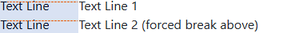
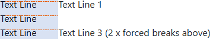
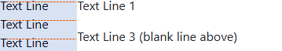
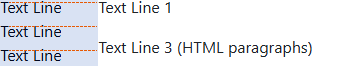

<a name="idtop"></a><!-- 🟢TOP OF PAGE - MARKER  (BLANK LINE BELOW)   -->

<!-- 🟢TOP OF PAGE - LOGO IMAGE -->
<p align="right"></p>      <!-- 🟢TOP OF PAGE - WEB ID     --> 

# 6<!--         🟥H1🟥-->Basic Markdown and text formatting

This section lists all the Basic Markdown syntax for formatting text. This stuff is supported by *(virtually)* every Markdown processor.

It lists the Markdown syntax, the equivalent HTML *(where possible)* and shows the resultant output as rendered on GitHub. 

In some cases there are alternative syntax options. I list these alternatives where they exist, but the main syntax (not the alternative options) is generally the preferred option.

**[:arrow_up: Top](#idtop)**<!-- END OF SECTION - LINK TO TOP🔽🔽(BLANK LINE ABOVE) -->
<HR>                        <!-- END OF SECTION - SEPARATING LINE                    -->
<br>                        <!-- END OF SECTION - PADDING    🔼🔼(BLANK LINE BELOW) -->

## 6.1<!--      🟥H2🟥-->Body text and fonts

Body text in Markdown is whatever text is on a line that is not formatted by some other instruction. The following paragraph is body text and is rendered in the main GitHub Wiki window as shown below:

<p name="f-06-01" align="center"><strong><sub>🔽🔽🔽🔽🔽🔽&emsp;Standard body text on a GitHub Wiki page below&emsp;🔽🔽🔽🔽🔽🔽</sub></strong></p>

Lorem ipsum dolor sit amet, consectetur adipiscing elit. In consectetur tortor a tortor ornare, non pretium diam faucibus. Morbi ut mollis dolor, nec pretium tellus. Suspendisse ornare neque placerat orci aliquam, eu sodales dui blandit. Maecenas nec risus vel magna blandit euismod. Suspendisse id finibus purus. Nam ultricies non sapien ac rutrum.                    </td></tr>


<p align="center"><strong><sup>🔼🔼🔼🔼🔼🔼 Figure 6.1 &mdash; Body text on a GitHub Wiki page above 🔼🔼🔼🔼🔼🔼</sup></strong></p>

The GitHub site is responsive in terms of screen width and sidebar (the sidebar drops to the bottom of the page at lower resolutions), the text narrows and line-wraps as the screen narrows. It does not however, change point size.

> [!NOTE]<!-- NOTE ALERT -->
> *GitHub body text is always 16px high and is in the Segoe UI font, (pronounced seg-o-ee) on a Windows machine. The line spacing is fixed at 24 px (giving a line spacing of 150% which is a bit big; most body text has line spacing in the range 120-145%).*

The font colour is a dark grey colour (not black), it is the colour `rgb(31, 35, 40)` or hex colour `#1F2328`. It looks like this:

<table name="f-06-02" align="center"><!-- FIGURE START🔽🔽(BLANK LINE ABOVE) -->
<!-- Figure row --> <tr><td >
<!-- LINK -->         <a href="../06-0000/02-images/figm-06-02.png" title="Use ctrl+click to open image in new tab">
<!-- FIGURE -->         
                    </a></td></tr>
<!-- CAPTION -->    <tr><th align="center"><sup>
<!-- CAPTION TEXT -->   Figure 6.2 &mdash; Body text font colour
                    </sup></th></tr>
</table>                             <!-- FIGURE END  🔼🔼(BLANK LINE BELOW) -->

**[:arrow_up: Top](#idtop)**<!-- END OF SECTION - LINK TO TOP🔽🔽(BLANK LINE ABOVE) -->
<HR>                        <!-- END OF SECTION - SEPARATING LINE                    -->
<br>                        <!-- END OF SECTION - PADDING    🔼🔼(BLANK LINE BELOW) -->

### 6.1.1<!--   🟥H3🟥-->Body text responsive design

GitHub displays the body text in a responsive manner. At browser screen widths of 1280&nbsp;px or more, the main area of the screen is shown at a full width that never exceeds 896&nbsp;px (this is as wide as it gets). At this width, the body text displays an average of 21.2 words per line (this is based on the following extract):

<hr><!-- HORIZONTAL LINE - BLANK LINE ABOVE AND BELOW -->

**Body text extract for metrics**

In principle, liquid rocket engines are simple, far simpler than the internal combustion engine. Liquid fuel is pumped into a combustion chamber in the presence of liquid oxygen and a flame. It burns. That’s all there is to it. There are no crankshafts to turn, no pistons to drive. The burning fuel produces energy in the form of gases that exit through the rocket’s nozzle. The force the gases produce against the top of the engine is called thrust. The thrust is transmitted through the rocket’s structure and, if it is greater than the weight of the rocket, the rocket lifts off. Put in its most basic terms, for any rocket to work there are two things that must be done extremely well: The propellants must be brought together, and then they must burn smoothly. In the F-l, just pumping the propellants to the combustion chamber raised unprecedented demands. The F-l used liquid oxygen (LOX) and R.P.-1, a form of kerosene. The pumps, one for the fuel and one for the LOX, had to deliver the kerosene from the tankage to the combustion chamber at the rate of 15,741 gallons per minute, and the LOX at the rate of 24,811 gallons per minute. Driven by a 55,000-horsepower turbine, the pumps had to operate at drastically different temperatures: 60 degrees Fahrenheit for the fuel, –300 degrees for the LOX, while the turbine itself ran at 1,200 degrees. To complicate matters, the whole assembly had to be light and compact enough to fit on board the rocket and nonetheless sturdy enough to resist the pressures, vibrations, and other stresses of launch and flight. Developing the pumps was still not as hard as solving the second basic problem of rocket engines: making the propellants burn smoothly once they had reached the combustion chamber. The pumps brought the kerosene and the LOX to a circular metal slab three feet in diameter and about four inches thick, weighing 1,000 pounds, called the injector plate. The injector plate was pocked with 6,300 holes less than a quarter of an inch in diameter through which the kerosene and LOX entered the combustion chamber. Most of the propellant streams were arranged in groups of five. Two of the five, both kerosene, impinged on each other at a carefully defined distance below the top of the plate, forming a fan-shaped spray. The other three in each five-hole group were of LOX. These also impinged on one another, forming another fan. The two fans intersected. There, given the presence of a flame, they would combust. In the F-l, the combustion chamber was a barrel about thirty-six inches wide and thirty inches long, closed at one end by the injection plate and opening into a nozzle at the other end. A few seconds before ignition, four small pre-burners in the combustion chamber — pilot lights, in effect — were lit, providing a flame at the point of impingement. As the pumps screamed up to speed, valves snapped open and more than a ton of kerosene and two tons of liquid oxygen burst into the combustion chamber. Per second. The gases produced by their ignition roared out through the throat, the open bottom of the barrel, into the cone of the nozzle below. In the course of the few seconds from ignition to full power (mainstage), the interior of the combustion chamber went from ambient temperature to 5,000 degrees Fahrenheit. At the face of the injector plate, pressure went from zero to 1,150 pounds per square inch. Given that combination of propellants, pressures, and nozzle design, the force generated totalled 1.5 million pounds. In the first stage of a Saturn V, five F-l s were to ignite simultaneously and sustain mainstage combustion for 150 seconds.<br>

> *This is an extract  from “Race to the Moon”: Cox, Catherine Bly & Charles Murray (1989). Published by Simon and Schuster. There is a Kindle version by the same authors, but it is just called [Apollo](https://www.amazon.co.uk/Apollo-Catherine-Bly-Cox-ebook/dp/B003KN3Z4M/).*

<hr><!-- HORIZONTAL LINE - BLANK LINE ABOVE AND BELOW -->

**Below is a series of lowercase alphabets, also used for page metrics:**

<u>a</u>bcdefghijklmnopqrstuvwxyz<u>a</u>bcdefghijklmnopqrstuvwxyz<u>a</u>bcdefghijklmnopqrstuvwxyz<u>a</u>bcdefghijklmnopqrstuvwxyz<u>a</u>bcdefghijklmnopqrstuvwxyz<u>a</u>bcdefghijklmnopqrstuvwxyz<u>a</u>bcdefghijklmnopqrstuvwxyz<u>a</u>bcdefghijklmnopqrstuvwxyz<u>a</u>bcdefghijklmnopqrstuvwxyz<u>a</u>bcdefghijklmnopqrstuvwxyz

<hr><!-- HORIZONTAL LINE - BLANK LINE ABOVE AND BELOW -->

Taking the first 29 lines of the above extract (these are complete lines and end with the phrase *“to ignite simultaneously and sustain”)*, the metrics are:

<table name="t-06-01" align="center"><!-- TABLE START🔽🔽(BLANK LINE ABOVE) -->
<!-- DATA ROW -->  <tr>
                     <td width="350">Average number of words per line:</td>
                     <td width="350">21.2</td>
                   </tr>
<!-- DATA ROW -->  <tr>
                     <td>Average number of characters per line:</td>
                     <td>123 (including spaces)</td>
                   </tr>
<!-- DATA ROW -->  <tr>
                     <td>Lowercase alphabets:</td>
                     <td>5.4 (without spaces)</td>
                   </tr>
<!-- CAPTION -->   <tr>
<!-- LIST WIDTH -->  <th align="left" colspan="2""><sup>
<!-- CAPTION TEXT -->Table 6.1 &mdash; GitHub body text metrics
                     </sup></th></tr>
</table>                             <!-- TABLE END  🔼🔼(BLANK LINE BELOW) -->

By most publishing standards, these figures are way too high, the lines are too long for comfortable reading.

Some good rules of thumb are: to have between 9.5 to 15 words per line, this equates to 45-90 characters per line (including spaces) or between 2-3 lowercase alphabets (without spaces).

While it may be too high, we are however, stuck with it. GitHub determines these things.

**[:arrow_up: Top](#idtop)**<!-- END OF SECTION - LINK TO TOP🔽🔽(BLANK LINE ABOVE) -->
<HR>                        <!-- END OF SECTION - SEPARATING LINE                    -->
<br>                        <!-- END OF SECTION - PADDING    🔼🔼(BLANK LINE BELOW) -->

### 6.1.2<!--   🟥H3🟥-->Body text in sidebars and footers

Both sidebars and footers can have body text within them. Body text in sidebars and footers is smaller than that in the main window. 

> [!NOTE]<!-- NOTE ALERT -->
> *GitHub sidebar and footer body text is always 12&nbsp;px high (as opposed to 16&nbsp;px in the main body text) and has a line spacing of 18&nbsp;px (main body text line spacing 24&nbsp;px) or 150% (this is the same ratio as main body text).*

**[:arrow_up: Top](#idtop)**<!-- END OF SECTION - LINK TO TOP🔽🔽(BLANK LINE ABOVE) -->
<HR>                        <!-- END OF SECTION - SEPARATING LINE                    -->
<br>                        <!-- END OF SECTION - PADDING    🔼🔼(BLANK LINE BELOW) -->

### 6.1.3<!--   🟥H3🟥-->Body text Markdown rules

<table name="l-06-01" align="center">   <!-- LIST START🔽🔽(BLANK LINE ABOVE) -->
<!-- LIST ROW 01  --><tr><td valign="top">&#x2776;<!-- 1  --></td>
    <td><!-- TEXT -->GitHub will ignore multiple consecutive spaces (it will treat them as a single space)</td></tr>
<!-- LIST ROW 02  --><tr><td valign="top">&#x2777;<!-- 2  --></td>
    <td><!-- TEXT -->Always leave a blank line between paragraphs (<a href="#62paragraphs-and-line-breaks">section&nbsp;6.2</a>)</td></tr>
<!-- LIST ROW 03  --><tr><td valign="top">&#x2778;<!-- 3  --></td>
    <td><!-- TEXT -->Multiple blank lines will be ignored (treated as a single blank line, see <a href="#62paragraphs-and-line-breaks">section&nbsp;6.2</a>)</td></tr>
<!-- LIST ROW 04  --><tr><td valign="top">&#x2779;<!-- 4  --></td>
    <td><!-- TEXT -->Never use the tab character</td></tr>
<!-- CAPTION -->          <tr><th width="52"></th><!-- SPACER -->
<!-- LIST WIDTH -->         <th align="left" width="798"><sup>
<!-- CAPTION TEXT --><!-- TEXT -->List 6.1 &mdash; Body text Markdown rules
                           </sup></th></tr>
</table>                              <!-- LIST END    🔼🔼(BLANK LINE BELOW) -->

GitHub always ignores multiple spaces (unless they’re at the end of a line in which case it can be treated as a line break, see <a href="#622blank-line-and-a-line-break">section&nbsp;6.2.2</a>).

GitHub always ignores multiple blank lines (it acts as if there is only one blank line, <a href="#62paragraphs-and-line-breaks">section&nbsp;6.2</a>).

Tab characters are at best ignore and at worst convert text into a code fragment, see <a href="../13-0000/13%20Code%20fragments.md">section&nbsp;13</a>.

**[:arrow_up: Top](#idtop)**<!-- END OF SECTION - LINK TO TOP🔽🔽(BLANK LINE ABOVE) -->
<HR>                        <!-- END OF SECTION - SEPARATING LINE                    -->
<br>                        <!-- END OF SECTION - PADDING    🔼🔼(BLANK LINE BELOW) -->

### 6.1.4<!--   🟥H3🟥-->Body text examples

<table name="t-06-02" align="center"><!-- 🔴🟢🔵TABLE START🔽🔽(BLANK LINE ABOVE) -->
<!-- TOP & WIDTH --><tr><th width="850" align="right"><sup>Markdown, HTML equivalence and GitHub output
                    </sup></th></tr>
<!-- Header row --> <tr>
                        <th align="left">${\large \color{#0050C0}\text{M\ A\ R\ K\ D\ O\ W\ N}}$ 🔽</th>
                    </tr>
<!-- MD row -->    <tr><td align="left"><br><!-- 🔴MARKDOWN BELOW🔴 -->

```md
In principle, liquid rocket engines are simple, far simpler than the internal combustion engine.
```
<p> </p></td></tr><!-- 🔴MARKDOWN END OF ROW🔴 -->
<!-- Header row --> <tr>
                        <th align="left">${\large \color{#00C050}\text{H\ T\ M\ L}}$ 🔽</th>
                    </tr>
<!-- HTML row -->   <tr><td align="left"><br><!-- 🟢HTML BELOW🟢 -->

```html
<p> In principle, liquid rocket engines are simple, far simpler than the internal combustion engine.</p>
```
<p> </p></td></tr><!-- 🟢HTML END OF ROW🟢 -->
<!-- Header row --> <tr>
                        <th align="left">${\large \color{#B00000}\text{G\ I\ T\ H\ U\ B}\space\ \space\text{O\ U\ T\ P\ U\ T}}$ 🔽</th>
                    </tr>
<!-- GIT row -->    <tr><td align="left"><!-- 🔵GITHUB OUTPUT BELOW (BLANK LINE BELOW)🔵 -->

<p> In principle, liquid rocket engines are simple, far simpler than the internal combustion engine.</p>

</td></tr><!-- 🔵GITHUB OUTPUT END (BLANK LINE ABOVE)🔵 -->
<!-- CAPTION -->    <tr><th align="left"><sup>
<!-- CAPTION TEXT -->Table 6.2 &mdash; Body text examples
                    </sup></th></tr>
</table>                             <!-- 🟥🟩🟦TABLE END  🔼🔼(BLANK LINE BELOW) -->

**[:arrow_up: Top](#idtop)**<!-- END OF SECTION - LINK TO TOP🔽🔽(BLANK LINE ABOVE) -->
<HR>                        <!-- END OF SECTION - SEPARATING LINE                    -->
<br>                        <!-- END OF SECTION - PADDING    🔼🔼(BLANK LINE BELOW) -->

### 6.1.5<!--   🟥H3🟥-->Alignment of Body text

Markdown does not allow for the alignment of body text, it does however support HTML alignments with the use of the `align` attribute:

<br><br>
#### <!--       🟥H4🟥--><u>Left aligned text (default)&emsp;&emsp;&emsp;&emsp;&emsp;</u> 

This is the default arrangement, text is at the left-hand side of the body text area.

<table name="t-06-02a" align="center"><!-- 🔴🟢🔵TABLE START🔽🔽(BLANK LINE ABOVE) -->
<!-- TOP & WIDTH --><tr><th width="850" align="right"><sup>HTML and GitHub output
                    </sup></th></tr>
<!-- Header row --> <tr><th align="left">${\large \color{#00C050}\text{H\ T\ M\ L}}$ 🔽</th></tr>
<!-- HTML row -->   <tr><td align="left"><br><!-- 🟢HTML BELOW🟢 -->

```html
<p align="left">Align text to the left</p>
```
<p> </p></td></tr><!-- 🟢HTML END OF ROW🟢 -->
<!-- Header row --> <tr><th align="left">${\large \color{#B00000}\text{G\ I\ T\ H\ U\ B}\space\ \space\text{O\ U\ T\ P\ U\ T}}$ 🔽</th></tr>
<!-- GIT row -->    <tr><td align="left" valign="top"><!-- 🔵GITHUB OUTPUT BELOW (BLANK LINE BELOW)🔵 -->

<p align="left">Lorem ipsum dolor sit amet, consectetur adipiscing elit. In consectetur tortor a tortor ornare, non pretium diam. Morbi ut mollis dolor, nec pretium tellus. Suspendisse ornare neque placerat orci aliquam, eu sodales blandit. Maecenas nec risus vel magna blandit euismod. Suspendisse id finibus purus.</p>

</td></tr><!-- 🔵GITHUB OUTPUT END (BLANK LINE ABOVE)🔵 -->
</table>                             <!-- 🟥🟩🟦TABLE END  🔼🔼(BLANK LINE BELOW) -->

<br><br>
#### <!--       🟥H4🟥--><u>Right aligned text&emsp;&emsp;&emsp;&emsp;&emsp;</u> 

Forces text to the right-hand side of the body text area.

<table name="t-06-02b" align="center"><!-- 🔴🟢🔵TABLE START🔽🔽(BLANK LINE ABOVE) -->
<!-- TOP & WIDTH --><tr><th width="850" align="right"><sup>HTML and GitHub output
                    </sup></th></tr>
<!-- Header row --> <tr><th align="left">${\large \color{#00C050}\text{H\ T\ M\ L}}$ 🔽</th></tr>
<!-- HTML row -->   <tr><td align="left"><br><!-- 🟢HTML BELOW🟢 -->

```html
<p align="right">Align text to the right</p>
```
<p> </p></td></tr><!-- 🟢HTML END OF ROW🟢 -->
<!-- Header row --> <tr><th align="left">${\large \color{#B00000}\text{G\ I\ T\ H\ U\ B}\space\ \space\text{O\ U\ T\ P\ U\ T}}$ 🔽</th></tr>
<!-- GIT row -->    <tr><td align="left" valign="top"><!-- 🔵GITHUB OUTPUT BELOW (BLANK LINE BELOW)🔵 -->

<p align="right">Lorem ipsum dolor sit amet, consectetur adipiscing elit. In consectetur tortor a tortor ornare, non pretium diam. Morbi ut mollis dolor, nec pretium tellus. Suspendisse ornare neque placerat orci aliquam, eu sodales blandit. Maecenas nec risus vel magna blandit euismod. Suspendisse id finibus purus.</p>

</td></tr><!-- 🔵GITHUB OUTPUT END (BLANK LINE ABOVE)🔵 -->
</table>                             <!-- 🟥🟩🟦TABLE END  🔼🔼(BLANK LINE BELOW) -->


<br><br>
#### <!--       🟥H4🟥--><u>Centred text&emsp;&emsp;&emsp;&emsp;&emsp;</u> 

Centres the text in the body text area.

<table name="t-06-02c" align="center"><!-- 🔴🟢🔵TABLE START🔽🔽(BLANK LINE ABOVE) -->
<!-- TOP & WIDTH --><tr><th width="850" align="right"><sup>HTML and GitHub output
                    </sup></th></tr>
<!-- Header row --> <tr><th align="left">${\large \color{#00C050}\text{H\ T\ M\ L}}$ 🔽</th></tr>
<!-- HTML row -->   <tr><td align="left"><br><!-- 🟢HTML BELOW🟢 -->

```html
<p align="center">Centre the text</p>
```
<p> </p></td></tr><!-- 🟢HTML END OF ROW🟢 -->
<!-- Header row --> <tr><th align="left">${\large \color{#B00000}\text{G\ I\ T\ H\ U\ B}\space\ \space\text{O\ U\ T\ P\ U\ T}}$ 🔽</th></tr>
<!-- GIT row -->    <tr><td align="left" valign="top"><!-- 🔵GITHUB OUTPUT BELOW (BLANK LINE BELOW)🔵 -->

<p align="center">Lorem ipsum dolor sit amet, consectetur adipiscing elit. In consectetur tortor a tortor ornare, non pretium diam. Morbi ut mollis dolor, nec pretium tellus. Suspendisse ornare neque placerat orci aliquam, eu sodales blandit. Maecenas nec risus vel magna blandit euismod. Suspendisse id finibus purus.</p>

</td></tr><!-- 🔵GITHUB OUTPUT END (BLANK LINE ABOVE)🔵 -->
</table>                             <!-- 🟥🟩🟦TABLE END  🔼🔼(BLANK LINE BELOW) -->

> [!NOTE]<!-- NOTE ALERT -->
> *The American spelling of **“center”***

<br><br>
#### <!--       🟥H4🟥--><u>Justified text&emsp;&emsp;&emsp;&emsp;&emsp;</u> 

Justifies the text in the body text area *(the text is aligned with both margins of the page, giving it straight edges on both sides)*.

<table name="t-06-02d" align="center"><!-- 🔴🟢🔵TABLE START🔽🔽(BLANK LINE ABOVE) -->
<!-- TOP & WIDTH --><tr><th width="850" align="right"><sup>HTML and GitHub output
                    </sup></th></tr>
<!-- Header row --> <tr><th align="left">${\large \color{#00C050}\text{H\ T\ M\ L}}$ 🔽</th></tr>
<!-- HTML row -->   <tr><td align="left"><br><!-- 🟢HTML BELOW🟢 -->

```html
<p align="justify">Justified text</p>
```
<p> </p></td></tr><!-- 🟢HTML END OF ROW🟢 -->
<!-- Header row --> <tr><th align="left">${\large \color{#B00000}\text{G\ I\ T\ H\ U\ B}\space\ \space\text{O\ U\ T\ P\ U\ T}}$ 🔽</th></tr>
<!-- GIT row -->    <tr><td align="left" valign="top"><!-- 🔵GITHUB OUTPUT BELOW (BLANK LINE BELOW)🔵 -->

<p align="justify">Lorem ipsum dolor sit amet, consectetur adipiscing elit. In consectetur tortor a tortor ornare, non pretium diam. Morbi ut mollis dolor, nec pretium tellus. Suspendisse ornare neque placerat orci aliquam, eu sodales blandit. Maecenas nec risus vel magna blandit euismod. Suspendisse id finibus purus.</p>

</td></tr><!-- 🔵GITHUB OUTPUT END (BLANK LINE ABOVE)🔵 -->
</table>                             <!-- 🟥🟩🟦TABLE END  🔼🔼(BLANK LINE BELOW) -->

**[:arrow_up: Top](#idtop)**<!-- END OF SECTION - LINK TO TOP🔽🔽(BLANK LINE ABOVE) -->
<HR>                        <!-- END OF SECTION - SEPARATING LINE                    -->
<br>                        <!-- END OF SECTION - PADDING    🔼🔼(BLANK LINE BELOW) -->

### 6.1.6<!--   🟥H3🟥-->Body text properties

The following are the GitHub properties to applied body text:

<table name="t-06-03" align="center"><!-- TABLE START🔽🔽(BLANK LINE ABOVE) -->
    <tr><th width="350" align="left">MAIN WINDOW PROPERTIES</th>
        <th width="350" align="left">SIDEBAR AND FOOTER VARIATIONS</th>
    </tr>
    <tr>
        <td align="left">Font: Segoe UI<br>Colour: <code>rgb(31, 35, 40) #1F2328</code><br>Font size: 16px<br>Line spacing: 24px (150%)<br>Underlined: No</td>
        <td align="left">Font: Segoe UI<br>Colour: <code>rgb(31, 35, 40) #1F2328</code><br><strong>Font size: 12px<br>Line spacing: 18px</strong> (150%)<br>Underlined: No</td>
    </tr>
<!-- CAPTION -->   <tr>
<!-- LIST WIDTH -->  <th align="left"><sup>
<!-- CAPTION TEXT -->Table 6.3 &mdash; Body text properties
                     </sup></th>
                    <th align="left"><sup>
<!-- CAPTION TEXT -->Differences are in bold
                     </sup></th>                     </tr>
</table>                             <!-- TABLE END  🔼🔼(BLANK LINE BELOW) -->

> [!NOTE]<!-- NOTE ALERT -->
> *These figures are for a Windows PC using a 2560 × 1560 monitor at native resolution, the browser is Edge set to a zoom of 100%. Where there are differences between the columns, these are highlighted in bold.*

**[:arrow_up: Top](#idtop)**<!-- END OF SECTION - LINK TO TOP🔽🔽(BLANK LINE ABOVE) -->
<HR>                        <!-- END OF SECTION - SEPARATING LINE                    -->
<br>                        <!-- END OF SECTION - PADDING    🔼🔼(BLANK LINE BELOW) -->

## 6.2<!--      🟥H2🟥-->Paragraphs and line breaks

Paragraphs and line breaks can be a bit hit and miss in Markdown. 

Paragraphs must be separated by a blank line. 

Multiple blank lines are treated as a single blank line; this can be seen below:

<table name="t-06-04" align="center"><!-- 🔴🟢🔵TABLE START🔽🔽(BLANK LINE ABOVE) -->
<!-- TOP & WIDTH --><tr><th width="850" align="right"><sup>Markdown and GitHub output
                    </sup></th></tr>
<!-- Header row --> <tr>
                        <th align="left">${\large \color{#0050C0}\text{M\ A\ R\ K\ D\ O\ W\ N}}$ 🔽</th>
                    </tr>
<!-- MD row -->    <tr><td align="left"><br><!-- 🔴MARKDOWN BELOW🔴 -->

```md
Paragraph 1

Paragraph 2
```
<p> </p></td></tr><!-- 🔴MARKDOWN END OF ROW🔴 -->
<!-- Header row --> <tr>
                        <th align="left">${\large \color{#0050C0}\text{M\ A\ R\ K\ D\ O\ W\ N}}$ 🔽</th>
                    </tr>
<!-- MD row -->    <tr><td align="left"><br><!-- 🔴MARKDOWN BELOW🔴 -->

```md
Paragraph 1


Paragraph 2
```
<p> </p></td></tr><!-- 🔴MARKDOWN END OF ROW🔴 -->
<!-- Header row --> <tr>
                        <th align="left">${\large \color{#B00000}\text{G\ I\ T\ H\ U\ B}\space\ \space\text{O\ U\ T\ P\ U\ T}}$ 🔽</th>
                    </tr>
<!-- GIT row -->    <tr><td align="left"><!-- 🔵GITHUB OUTPUT BELOW (BLANK LINE BELOW)🔵 -->

Paragraph 1

Paragraph 2

</td></tr><!-- 🔵GITHUB OUTPUT END (BLANK LINE ABOVE)🔵 -->
<!-- CAPTION -->    <tr><th align="left"><sup>
<!-- CAPTION TEXT -->Table 6.4 &mdash; Separating paragraphs (multiple blank lines are ignored)
                    </sup></th></tr>
</table>                             <!-- 🟥🟩🟦TABLE END  🔼🔼(BLANK LINE BELOW) -->

Leaving out the blank line between paragraphs, causes the paragraphs to merge together:


<table name="t-06-05" align="center"><!-- 🔴🟢🔵TABLE START🔽🔽(BLANK LINE ABOVE) -->
<!-- TOP & WIDTH --><tr><th width="850" align="right"><sup>Markdown and GitHub output
                    </sup></th></tr>
<!-- Header row --> <tr>
                        <th align="left">${\large \color{#0050C0}\text{M\ A\ R\ K\ D\ O\ W\ N}}$ 🔽</th>
                    </tr>
<!-- MD row -->    <tr><td align="left"><br><!-- 🔴MARKDOWN BELOW🔴 -->

```md
Paragraph 1
Paragraph 2
```
<p> </p></td></tr><!-- 🔴MARKDOWN END OF ROW🔴 -->
<!-- Header row --> <tr>
                        <th align="left">${\large \color{#B00000}\text{G\ I\ T\ H\ U\ B}\space\ \space\text{O\ U\ T\ P\ U\ T}}$ 🔽</th>
                    </tr>
<!-- GIT row -->    <tr><td align="left"><!-- 🔵GITHUB OUTPUT BELOW (BLANK LINE BELOW)🔵 -->

Paragraph 1
Paragraph 2

</td></tr><!-- 🔵GITHUB OUTPUT END (BLANK LINE ABOVE)🔵 -->
<!-- CAPTION -->    <tr><th align="left"><sup>
<!-- CAPTION TEXT -->Table 6.5 &mdash; Unseparated paragraphs
                    </sup></th></tr>
</table>                             <!-- 🟥🟩🟦TABLE END  🔼🔼(BLANK LINE BELOW) -->


In this example, GitHub effectively ignores the physical line break after Paragraph 1 (the actual line break cause by hitting the enter key).

**[:arrow_up: Top](#idtop)**<!-- END OF SECTION - LINK TO TOP🔽🔽(BLANK LINE ABOVE) -->
<HR>                        <!-- END OF SECTION - SEPARATING LINE                    -->
<br>                        <!-- END OF SECTION - PADDING    🔼🔼(BLANK LINE BELOW) -->

### 6.2.1<!--   🟥H3🟥-->Forced line break

This is the correct mechanism for forcing a line break in Markdown.

To force a line break, use `<br>` at the end of the line where the break is to occur, the `<br>` can also be used within lines:

<table name="t-06-06" align="center"><!-- 🔴🟢🔵TABLE START🔽🔽(BLANK LINE ABOVE) -->
<!-- TOP & WIDTH --><tr><th width="850" align="right"><sup>Markdown and GitHub output
                    </sup></th></tr>
<!-- Header row --> <tr>
                        <th align="left">${\large \color{#0050C0}\text{M\ A\ R\ K\ D\ O\ W\ N}}$ 🔽</th>
                    </tr>
<!-- MD row -->    <tr><td align="left"><br><!-- 🔴MARKDOWN BELOW🔴 -->

```md
Paragraph 1<br>
Paragraph 2

Paragraph 3<br>Paragraph 4
```
<p> </p></td></tr><!-- 🔴MARKDOWN END OF ROW🔴 -->
<!-- Header row --> <tr>
                        <th align="left">${\large \color{#B00000}\text{G\ I\ T\ H\ U\ B}\space\ \space\text{O\ U\ T\ P\ U\ T}}$ 🔽</th>
                    </tr>
<!-- GIT row -->    <tr><td align="left"><!-- 🔵GITHUB OUTPUT BELOW (BLANK LINE BELOW)🔵 -->

Paragraph 1<br>
Paragraph 2

Paragraph 3<br>Paragraph 4

</td></tr><!-- 🔵GITHUB OUTPUT END (BLANK LINE ABOVE)🔵 -->
<!-- CAPTION -->    <tr><th align="left"><sup>
<!-- CAPTION TEXT -->Table 6.6 &mdash; Standard_Markdown_HTML_Output_table
                    </sup></th></tr>
</table>                             <!-- 🟥🟩🟦TABLE END  🔼🔼(BLANK LINE BELOW) -->

Using `<br>` forces the text following onto the next immediate line (there is no blank line in-between). In the above example, the blank line between paragraphs 2 and 3 is because there is a blank line in the Markdown. 

The `<br>` can be used consecutively to give the spacing required *(they are not ignored like blank lines)*.

**[:arrow_up: Top](#idtop)**<!-- END OF SECTION - LINK TO TOP🔽🔽(BLANK LINE ABOVE) -->
<HR>                        <!-- END OF SECTION - SEPARATING LINE                    -->
<br>                        <!-- END OF SECTION - PADDING    🔼🔼(BLANK LINE BELOW) -->

### 6.2.2<!--   🟥H3🟥-->Blank line and a line break

This is a bit odd, and I haven’t seen it mentioned anywhere else.

There is a difference between leaving a blank line to separate paragraphs and using `<br>` forced line breaks.

Using one `<br>` forces the text following onto the next 

<table name="t-06-07" align="center"><!-- 🔴🟢🔵TABLE START🔽🔽(BLANK LINE ABOVE) -->
<!-- TOP & WIDTH --><tr><th width="850" align="right"><sup>Markdown and GitHub output
                    </sup></th></tr>
<!-- Header row --> <tr>
                        <th align="left">${\large \color{#0050C0}\text{M\ A\ R\ K\ D\ O\ W\ N}}$ 🔽</th>
                    </tr>
<!-- MD row -->    <tr><td align="left"><br><!-- 🔴MARKDOWN BELOW🔴 -->

```md
Text line 1
<br>
Text line 2 (forced break above)
```
<p> </p></td></tr><!-- 🔴MARKDOWN END OF ROW🔴 -->
<!-- Header row --> <tr>
                        <th align="left">${\large \color{#B00000}\text{G\ I\ T\ H\ U\ B}\space\ \space\text{O\ U\ T\ P\ U\ T}}$ 🔽</th>
                    </tr>
<!-- GIT row -->    <tr><td align="left"><!-- 🔵GITHUB OUTPUT BELOW (BLANK LINE BELOW)🔵 -->

<a href="../06-0000/02-images/figm-06-02a.png" title="Use ctrl+click to open image in new tab">
<!-- FIGURE -->         </a>

</td></tr><!-- 🔵GITHUB OUTPUT END (BLANK LINE ABOVE)🔵 -->
<!-- CAPTION -->    <tr><th align="left"><sup>
<!-- CAPTION TEXT -->Table 6.7 &mdash; A single <code>&lt;br&gt;</code>
                     </sup></th></tr>
</table>                             <!-- 🟥🟩🟦TABLE END  🔼🔼(BLANK LINE BELOW) -->

In the GitHub output above, I’ve shown the actual output on the right-hand side, the left side *(highlighted in blue)* with the dotted orange line and `Text Line` shows the standard line spacing used by GitHub *(this is the line spacing if a line wraps around at the edge of the screen, just like this paragraph)*.

It can be seen that using a single `<br>` simply forces the text onto the next line (as you would expect).

In the next example, there are two `<br>` line breaks:

<table name="t-06-08" align="center"><!-- 🔴🟢🔵TABLE START🔽🔽(BLANK LINE ABOVE) -->
<!-- TOP & WIDTH --><tr><th width="850" align="right"><sup>Markdown and GitHub output
                    </sup></th></tr>
<!-- Header row --> <tr>
                        <th align="left">${\large \color{#0050C0}\text{M\ A\ R\ K\ D\ O\ W\ N}}$ 🔽</th>
                    </tr>
<!-- MD row -->    <tr><td align="left"><br><!-- 🔴MARKDOWN BELOW🔴 -->

```md
Text line 1
<br><br>
Text line 3 (2 x forced breaks above)
```
<p> </p></td></tr><!-- 🔴MARKDOWN END OF ROW🔴 -->
<!-- Header row --> <tr>
                        <th align="left">${\large \color{#B00000}\text{G\ I\ T\ H\ U\ B}\space\ \space\text{O\ U\ T\ P\ U\ T}}$ 🔽</th>
                    </tr>
<!-- GIT row -->    <tr><td align="left"><!-- 🔵GITHUB OUTPUT BELOW (BLANK LINE BELOW)🔵 -->

<a href="../06-0000/02-images/figm-06-02b.png" title="Use ctrl+click to open image in new tab">
<!-- FIGURE -->         </a>

</td></tr><!-- 🔵GITHUB OUTPUT END (BLANK LINE ABOVE)🔵 -->
<!-- CAPTION -->    <tr><th align="left"><sup>
<!-- CAPTION TEXT -->Table 6.8 &mdash; A double <code>&lt;br&gt;</code>
                     </sup></th></tr>
</table>                             <!-- 🟥🟩🟦TABLE END  🔼🔼(BLANK LINE BELOW) -->

As expected, there is now a blank line in the middle. The top-line (on the right) is in line with the first line of text (on the left) and the bottom-line lines up with the third line of text and there is a blank line in the middle. *All well and good.*

Now look at this, this is Markdown with a blank line separating the paragraphs:

<table name="t-06-09" align="center"><!-- 🔴🟢🔵TABLE START🔽🔽(BLANK LINE ABOVE) -->
<!-- TOP & WIDTH --><tr><th width="850" align="right"><sup>Markdown and GitHub output
                    </sup></th></tr>
<!-- Header row --> <tr>
                        <th align="left">${\large \color{#0050C0}\text{M\ A\ R\ K\ D\ O\ W\ N}}$ 🔽</th>
                    </tr>
<!-- MD row -->    <tr><td align="left"><br><!-- 🔴MARKDOWN BELOW🔴 -->

```md
Text line 1

Text line 3 (blank line above)
```
<p> </p></td></tr><!-- 🔴MARKDOWN END OF ROW🔴 -->
<!-- Header row --> <tr>
                        <th align="left">${\large \color{#B00000}\text{G\ I\ T\ H\ U\ B}\space\ \space\text{O\ U\ T\ P\ U\ T}}$ 🔽</th>
                    </tr>
<!-- GIT row -->    <tr><td align="left"><!-- 🔵GITHUB OUTPUT BELOW (BLANK LINE BELOW)🔵 -->

<a href="../06-0000/02-images/figm-06-02c.png" title="Use ctrl+click to open image in new tab">
<!-- FIGURE -->         </a>

</td></tr><!-- 🔵GITHUB OUTPUT END (BLANK LINE ABOVE)🔵 -->
<!-- CAPTION -->    <tr><th align="left"><sup>
<!-- CAPTION TEXT -->Table 6.9 &mdash; A blank line between paragraphs
                     </sup></th></tr>
</table>                             <!-- 🟥🟩🟦TABLE END  🔼🔼(BLANK LINE BELOW) -->

**The blank line does not put in the spacing of a full blank line** *(it is actually ⅔ of a blank line)*.

*So what does this mean?*

Well, it means that normal paragraph spacing created by leaving a blank line between paragraphs, cannot be replicated by forced line breaks, one line break is not big enough, two is too big.

The HTML `<p>` tag does produce the correct paragraph spacing (same as a blank line):

<table name="t-06-10" align="center"><!-- 🔴🟢🔵TABLE START🔽🔽(BLANK LINE ABOVE) -->
<!-- TOP & WIDTH --><tr><th width="850" align="right"><sup>HTML and GitHub output
                    </sup></th></tr>
<!-- Header row --> <tr>
                        <th align="left">${\large \color{#B00000}\text{H\ T\ M\ L}}$ 🔽</th>
                    </tr>
<!-- HTML row -->   <tr><td align="left"><br><!-- 🟢HTML BELOW🟢 -->

```html
<p>Text Line 1</p>
<p>Text Line 3 (HTML paragraphs)</p>
```
<p> </p></td></tr><!-- 🟢HTML END OF ROW🟢 -->
<!-- Header row --> <tr>
                        <th align="left">${\large \color{#B00000}\text{G\ I\ T\ H\ U\ B}\space\ \space\text{O\ U\ T\ P\ U\ T}}$ 🔽</th>
                    </tr>
<!-- GIT row -->    <tr><td align="left"><!-- 🔵GITHUB OUTPUT BELOW (BLANK LINE BELOW)🔵 -->

<a href="../06-0000/02-images/figm-06-02d.png" title="Use ctrl+click to open image in new tab">
<!-- FIGURE -->         </a>

</td></tr><!-- 🔵GITHUB OUTPUT END (BLANK LINE ABOVE)🔵 -->
<!-- CAPTION -->    <tr><th align="left"><sup>
<!-- CAPTION TEXT -->Table 6.10 &mdash; HTML paragraphs
                     </sup></th></tr>
</table>                             <!-- 🟥🟩🟦TABLE END  🔼🔼(BLANK LINE BELOW) -->

**[:arrow_up: Top](#idtop)**<!-- END OF SECTION - LINK TO TOP🔽🔽(BLANK LINE ABOVE) -->
<HR>                        <!-- END OF SECTION - SEPARATING LINE                    -->
<br>                        <!-- END OF SECTION - PADDING    🔼🔼(BLANK LINE BELOW) -->

### 6.2.3<!--   🟥H3🟥-->Trailing space line break

It is a feature of Markdown that two trailing spaces at the end of a line will force a line break.

${\LARGE \color{#c00000}\text{DO\ NOT\ USE\ TRAILING\ SPACE\ LINE\ BREAKS}}$ <!-- ⚪inline colour⚪ -->

It is hard to see two spaces at the end of a line (they don’t show up in most editors), The following shows how it works:

<table name="t-06-11" align="center"><!-- 🔴🟢🔵TABLE START🔽🔽(BLANK LINE ABOVE) -->
<!-- TOP & WIDTH --><tr><th width="850" align="right"><sup>Markdown, HTML equivalence and GitHub output
                    </sup></th></tr>
<!-- Header row --> <tr>
                        <th align="left">${\large \color{#0050C0}\text{M\ A\ R\ K\ D\ O\ W\ N}}$ 🔽</th>
                    </tr>
<!-- MD row -->    <tr><td align="left"><br><!-- 🔴MARKDOWN BELOW🔴 -->

```md
Paragraph 1  
Paragraph 2
```
<p> </p></td></tr><!-- 🔴MARKDOWN END OF ROW🔴 -->
<!-- Header row --> <tr>
                        <th align="left">${\large \color{#B00000}\text{G\ I\ T\ H\ U\ B}\space\ \space\text{O\ U\ T\ P\ U\ T}}$ 🔽</th>
                    </tr>
<!-- GIT row -->    <tr><td align="left"><!-- 🔵GITHUB OUTPUT BELOW (BLANK LINE BELOW)🔵 -->

Paragraph 1  
Paragraph 2

</td></tr><!-- 🔵GITHUB OUTPUT END (BLANK LINE ABOVE)🔵 -->
<!-- CAPTION -->    <tr><th align="left"><sup>
<!-- CAPTION TEXT -->Table 6.11 &mdash; Trailing space line break
                     </sup></th></tr>
</table>                             <!-- 🟥🟩🟦TABLE END  🔼🔼(BLANK LINE BELOW) -->

**[:arrow_up: Top](#idtop)**<!-- END OF SECTION - LINK TO TOP🔽🔽(BLANK LINE ABOVE) -->
<HR>                        <!-- END OF SECTION - SEPARATING LINE                    -->
<br>                        <!-- END OF SECTION - PADDING    🔼🔼(BLANK LINE BELOW) -->

### 6.2.4<!--   🟥H3🟥-->Paragraph and line break Markdown rules

<table name="l-06-02" align="center">   <!-- LIST START🔽🔽(BLANK LINE ABOVE) -->
<!-- LIST ROW 01  --><tr><td valign="top">&#x2776;<!-- 1  --></td>
    <td><!-- TEXT -->Always leave a single blank line between paragraphs (multiple blank lines have no effect) or use HTML <code>&lt;p&gt;</code> tags</td></tr>
<!-- LIST ROW 02  --><tr><td valign="top">&#x2777;<!-- 2  --></td>
    <td><!-- TEXT -->Do not indent paragraphs at all (tabs will be misinterpreted, multiple spaces will be treated as single space)</td></tr>
<!-- LIST ROW 03  --><tr><td valign="top">&#x2778;<!-- 3  --></td>
    <td><!-- TEXT -->Always use <code>&lt;br&gt;</code> to force a line break</td></tr>
<!-- LIST ROW 04  --><tr><td valign="top">&#x2779;<!-- 4  --></td>
    <td><!-- TEXT -->Do not use trailing space line breaks</td></tr>
<!-- CAPTION -->          <tr><th width="52"></th><!-- SPACER -->
<!-- LIST WIDTH -->         <th align="left" width="798"><sup>
<!-- CAPTION TEXT --><!-- TEXT -->List 6.2 &mdash; Paragraph and line break Markdown rules
                           </sup></th></tr>
</table>                              <!-- LIST END    🔼🔼(BLANK LINE BELOW) -->

**[:arrow_up: Top](#idtop)**<!-- END OF SECTION - LINK TO TOP🔽🔽(BLANK LINE ABOVE) -->
<HR>                        <!-- END OF SECTION - SEPARATING LINE                    -->
<br>                        <!-- END OF SECTION - PADDING    🔼🔼(BLANK LINE BELOW) -->

### 6.2.5<!--   🟥H3🟥-->Paragraph and line break examples

<table name="t-06-12" align="center"><!-- 🔴🟢🔵TABLE START🔽🔽(BLANK LINE ABOVE) -->
<!-- TOP & WIDTH --><tr><th align="right" colspan="3"><sup>Markdown, HTML equivalence and GitHub output
                    </sup></th></tr>
<!-- Header row --> <tr>
                        <th align="left" colspan="3">${\large \color{#0050C0}\text{M\ A\ R\ K\ D\ O\ W\ N}}$ 🔽</th>
                    </tr>
<!-- MD row -->    <tr>
<!-- MD cell 1 -->    <td width="217" align="left"><br><!-- 🔴MARKDOWN BELOW🔴 -->

```md
Lorem ipsum

Consectetur.
```
<p> </p></td><!-- 🔴MARKDOWN END OF CELL 1🔴 -->
<!-- MD cell 2 -->    <td width="284" align="left"><br><!-- 🔴MARKDOWN BELOW🔴 -->

```md
Lorem ipsum<br>
Consectetur.
```
<p> </p></td><!-- 🔴MARKDOWN END OF CELL 2🔴 -->
<!-- MD cell 3 -->    <td width="283" align="left"><br><!-- 🔴MARKDOWN BELOW🔴 -->

```md
Lorem ipsum<br><br>
Consectetur.
```
<p> </p></td><!-- 🔴MARKDOWN END OF CELL 3🔴 -->
                    </tr><!-- 🔴MARKDOWN END OF ROW🔴 -->
<!-- Header row --> <tr>
                        <th align="left" colspan="3">${\large \color{#00C050}\text{H\ T\ M\ L}}$ 🔽</th>
                    </tr>
<!-- HTML row -->   <tr>
<!-- HTML cell 1 -->  <td align="left"><br><!-- 🟢HTML BELOW🟢 -->

```html
<p>Lorem ipsum</p>
<p>Consectetur</p>
```
<p> </p></td><!-- 🟢HTML END OF CELL 1🟢 -->
<!-- HTML cell 2 -->  <td align="left"><br><!-- 🟢HTML BELOW🟢 -->

```html
<p>Lorem ipsum<br>Consectetur</p>
```
<p> </p></td><!-- 🟢HTML END OF CELL 2🟢 -->
 <!-- HTML cell 3 -->  <td align="left"><br><!-- 🟢HTML BELOW🟢 -->

```html
<p>Lorem ipsum<br><br>Consectetur</p>
```
<p> </p></td><!-- 🟢HTML END OF CELL 3🟢 -->
                   </tr><!-- 🟢HTML END OF ROW🟢 -->
<!-- Header row --> <tr>
                        <th align="left" colspan="3">${\large \color{#B00000}\text{G\ I\ T\ H\ U\ B}\space\ \space\text{O\ U\ T\ P\ U\ T}}$ 🔽</th>
                    </tr>
<!-- GIT row -->    <tr>
<!-- OP cell 1 -->    <td align="left" valign="top"><!-- 🔵GITHUB OUTPUT BELOW (BLANK LINE BELOW)🔵 -->

Lorem ipsum

Consectetur

</td><!-- 🔵OP END CELL 1 (BLANK LINE ABOVE)🔵 -->
<!-- OP cell 2 -->    <td align="left" valign="top"><!-- 🔵GITHUB OUTPUT BELOW (BLANK LINE BELOW)🔵 -->

Lorem ipsum<br>
Consectetur

</td><!-- 🔵OP END CELL 2 (BLANK LINE ABOVE)🔵 -->
<!-- OP cell 3 -->    <td align="left" valign="top"><!-- 🔵GITHUB OUTPUT BELOW (BLANK LINE BELOW)🔵 -->

Lorem ipsum<br><br>
Consectetur

</td><!-- 🔵OP END CELL 3 (BLANK LINE ABOVE)🔵 -->
                    </tr><!-- 🔵GITHUB OUTPUT END🔵 -->
<!-- CAPTION -->    <tr><th align="left" colspan="3"><sup>
<!-- CAPTION TEXT -->Table 6.12 &mdash; Paragraph and line break examples
                    </sup></th></tr>
</table>                             <!-- 🟥🟩🟦TABLE END  🔼🔼(BLANK LINE BELOW) -->

## 6.3<!--      🟥H2🟥-->Horizontal line

Horizontal lines *(sometimes called “rules”)* are thick grey lines that span a Markdown page indicating some form of break. The also act as line breaks (see <a href="#621forced-line-break">section&nbsp;6.2.1</a>).

Horizontal lines are created using three or more asterisks `***`, dashes `---` or underscores `___`. That said, the best way to create a horizontal lines is to use the `<hr>` tag, this has become the standard.

If using three dashes, make sure it is surrounded by blank lines, if there is any text on the line immediately above, it will be turned into a heading (see <a href="../06-1000/06.10%20Basic%20Markdown%20and%20text%20formatting.md#610headings">section&nbsp;6.10</a>)

The following are all horizontal lines:

<table name="t-06-13" align="center"><!-- 🔴🟢🔵TABLE START🔽🔽(BLANK LINE ABOVE) -->
<!-- TOP & WIDTH --><tr><th width="850" align="right"><sup>Markdown, HTML equivalence and GitHub output
                    </sup></th></tr>
<!-- Header row --> <tr>
                        <th align="left">${\large \color{#0050C0}\text{M\ A\ R\ K\ D\ O\ W\ N}}$ 🔽</th>
                    </tr>
<!-- MD row -->    <tr><td align="left"><br><!-- 🔴MARKDOWN BELOW🔴 -->

```md
***
---
___

<hr>
```
<p> </p></td></tr><!-- 🔴MARKDOWN END OF ROW🔴 -->
<!-- Header row --> <tr>
                        <th align="left">${\large \color{#00C050}\text{H\ T\ M\ L}}$ 🔽</th>
                    </tr>
<!-- HTML row -->   <tr><td align="left"><br><!-- 🟢HTML BELOW🟢 -->

```html
<hr>
```
<p> </p></td></tr><!-- 🟢HTML END OF ROW🟢 -->
<!-- Header row --> <tr>
                        <th align="left">${\large \color{#B00000}\text{G\ I\ T\ H\ U\ B}\space\ \space\text{O\ U\ T\ P\ U\ T}}$ 🔽</th>
                    </tr>
<!-- GIT row -->    <tr><td align="left" valign="top"><br><!-- 🔵GITHUB OUTPUT BELOW (BLANK LINE BELOW)🔵 -->

<hr>

<br>
</td></tr><!-- 🔵GITHUB OUTPUT END (BLANK LINE ABOVE)🔵 -->
<!-- CAPTION -->    <tr><th align="left"><sup>
<!-- CAPTION TEXT -->Table 6.13 &mdash; Horizontal lines
                    </sup></th></tr>
</table>                             <!-- 🟥🟩🟦TABLE END  🔼🔼(BLANK LINE BELOW) -->

**[:arrow_up: Top](#idtop)**<!-- END OF SECTION - LINK TO TOP🔽🔽(BLANK LINE ABOVE) -->
<HR>                        <!-- END OF SECTION - SEPARATING LINE                    -->
<br>                        <!-- END OF SECTION - PADDING    🔼🔼(BLANK LINE BELOW) -->

### 6.3.1<!--   🟥H3🟥-->Markdown rules for horizontal lines

<table name="l-06-03" align="center">   <!-- LIST START🔽🔽(BLANK LINE ABOVE) -->
<!-- LIST ROW 01  --><tr><td valign="top">&#x2776;<!-- 1  --></td>
    <td><!-- TEXT -->Use the <code>&lt;hr&gt;</code> tag for horizontal rules</td></tr>
<!-- LIST ROW 02  --><tr><td valign="top">&#x2777;<!-- 2  --></td>
    <td><!-- TEXT -->Always put a blank line after the <code>&lt;hr&gt;</code></td></tr>
<!-- CAPTION -->          <tr><th width="52"></th><!-- SPACER -->
<!-- LIST WIDTH -->         <th align="left" width="798"><sup>
<!-- CAPTION TEXT --><!-- TEXT -->List 6.3 &mdash; Markdown rules for horizontal lines
                           </sup></th></tr>
</table>                              <!-- LIST END    🔼🔼(BLANK LINE BELOW) -->

> [!NOTE]<!-- NOTE ALERT -->
> *Always put a blank line after the `<hr>`, this evens up the spacing around the horizontal line. The difference is shown below:*


<table name="t-06-14" align="center"><!-- 🔴🟢🔵TABLE START🔽🔽(BLANK LINE ABOVE) -->
<!-- TOP & WIDTH --><tr><th align="right" colspan="2"><sup>Markdown, HTML equivalence and GitHub output
                    </sup></th></tr>
<!-- Header row --> <tr>
                        <th align="left" colspan="2">${\large \color{#0050C0}\text{M\ A\ R\ K\ D\ O\ W\ N}}$ 🔽</th>
                    </tr>
<!-- MD row -->    <tr>
<!-- MD cell 1 -->    <td width="425" align="left"><br><!-- 🔴MARKDOWN BELOW🔴 -->

```md
Text Linea
<hr>
Text Line
```
<p> </p></td><!-- 🔴MARKDOWN END OF CELL 1🔴 -->
<!-- MD cell 2 -->    <td width="425" align="left"><br><!-- 🔴MARKDOWN BELOW🔴 -->

```md
Text Line
<hr>

Text Line
```
<p> </p></td><!-- 🔴MARKDOWN END OF CELL 2🔴 -->
                    </tr><!-- 🔴MARKDOWN END OF ROW🔴 -->
<!-- Header row --> <tr>
                        <th align="left" colspan="2">${\large \color{#B00000}\text{G\ I\ T\ H\ U\ B}\space\ \space\text{O\ U\ T\ P\ U\ T}}$ 🔽</th>
                    </tr>
<!-- GIT row -->    <tr>
<!-- OP cell 1 -->    <td align="left" valign="top"><!-- 🔵GITHUB OUTPUT BELOW (BLANK LINE BELOW)🔵 -->

Text Linea
<hr>
Text Line

</td><!-- 🔵OP END CELL 1 (BLANK LINE ABOVE)🔵 -->
<!-- OP cell 2 -->    <td align="left" valign="top"><!-- 🔵GITHUB OUTPUT BELOW (BLANK LINE BELOW)🔵 -->

Text Line
<hr>

Text Line

</td><!-- 🔵OP END CELL 2 (BLANK LINE ABOVE)🔵 -->
                    </tr><!-- 🔵GITHUB OUTPUT END🔵 -->
<!-- CAPTION -->    <tr><th align="left" colspan="2"><sup>
<!-- CAPTION TEXT -->Table 6.14 &mdash; Horizontal lines with and without a blank line after
                    </sup></th></tr>
</table>                             <!-- 🟥🟩🟦TABLE END  🔼🔼(BLANK LINE BELOW) -->
<br><br>            <!-- END OF PAGE - 🟥🟥🟥🟥🟥 PADDING🔽🔽(NO BLANK LINE ABOVE) -->
<hr>                <!-- END OF PAGE - 🟥🟥🟥🟥🟥 SEPARATING LINE                   -->
<a name="idend"></a><!-- END OF PAGE – 🟥🟥🟥🟥🟥 MARKER 🔼🔼                      -->