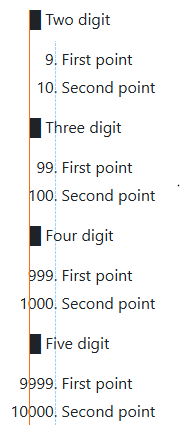

<a name="idtop"></a><!-- 🟢TOP OF PAGE - MARKER  (BLANK LINE BELOW)   -->

<!-- 🟢TOP OF PAGE - LOGO IMAGE -->
<p align="right"></p>      <!-- 🟢TOP OF PAGE - WEB ID     --> 

<table name="t-TOC-01" align="center"><!-- TABLE START🔽🔽(BLANK LINE ABOVE) -->
<!-- DATA ROW -->   <tr>
                        <td width="506" align="left" valign="top">
<details ><!-- HOME          🟢🟢🟢 UNNUMBERED, COLLAPSIBLE -->
<summary>&emsp;&ensp;&nbsp;<a href="../Home.md"><!-- HEAD -->Home</a>
</summary><!-- BLANK LINE BELOW -->

&emsp;&emsp;&emsp;&emsp;&emsp;&ensp;&nbsp;[The GitHub Wiki](../Home.md#github-wiki--design-and-implementation)<br>
&emsp;&emsp;&emsp;&emsp;&emsp;&ensp;&nbsp;[What does this guide cover?](../Home.md#what-does-this-guide-cover)<br>
&emsp;&emsp;&emsp;&emsp;&emsp;&ensp;&nbsp;[A note by the Author](../Home.md#a-note-by-the-author)<br>
</details><!--               🟩🟩🟩 -->

<details ><!-- LICENCE       🟢🟢🟢 UNNUMBERED, COLLAPSIBLE -->
<summary>&emsp;&ensp;&nbsp;<a href="../00-0000/Licence.md"><!-- HEAD -->Licence</a>
</summary><!-- BLANK LINE BELOW -->

&emsp;&emsp;&emsp;&emsp;&emsp;&ensp;&nbsp;[The licences and other details](../00-0000/Licence.md#the-licences-and-other-details)<br>
&emsp;&emsp;&emsp;&emsp;&emsp;&ensp;&nbsp;[The Licence](../00-0000/Licence.md#the-licence)<br>
&emsp;&emsp;&emsp;&emsp;&emsp;&ensp;&nbsp;[Why did I choose the MIT Licence?](../00-0000/Licence.md#why-did-i-choose-the-mit-licence)<br>
&emsp;&emsp;&emsp;&emsp;&emsp;&ensp;&nbsp;[Permissive licences](../00-0000/Licence.md#permissive-licences)<br>
&emsp;&emsp;&emsp;&emsp;&emsp;&ensp;&nbsp;[Copyleft licence](../00-0000/Licence.md#copyleft-licence)<br>
&emsp;&emsp;&emsp;&emsp;&emsp;&ensp;&nbsp;[Limiting liabilities](../00-0000/Licence.md#limiting-liabilities)<br>
&emsp;&emsp;&emsp;&emsp;&emsp;&ensp;&nbsp;[Which licence to use?](../00-0000/Licence.md#which-licence-to-use)<br>
&emsp;&emsp;&emsp;&emsp;&emsp;&ensp;&nbsp;[A note on spelling: licence or license](../00-0000/Licence.md#a-note-on-spelling-licence-or-license)<br>
</details><!--               🟩🟩🟩 -->

<details><!-- [SECTION 01]   🟢🟢🟢 SECTION GENERAL SINGLE DIGIT CHAPTER-->
<summary><a href="../01-0000/01%20Introducing%20the%20GitHub%20Wiki.md">1<!-- NUM -->&ensp;&nbsp;&nbsp;&thinsp;<!-- HEAD -->Introducing the GitHub Wiki</a>
</summary><!-- BLANK LINE BELOW -->

&emsp;&ensp;&hairsp;[1.1&emsp;&emsp;&nbsp;&nbsp;&thinsp;&hairsp;What are GitHub Wiki pages?](../01-0000/01%20Introducing%20the%20GitHub%20Wiki.md#11what-are-github-wiki-pages)<br>
&emsp;&ensp;&hairsp;[1.2&emsp;&emsp;&nbsp;&nbsp;&thinsp;&hairsp;Understanding the Wiki pages](../01-0000/01%20Introducing%20the%20GitHub%20Wiki.md#12understanding-the-wiki-pages)<br>
&emsp;&ensp;&hairsp;[1.3&emsp;&emsp;&nbsp;&nbsp;&thinsp;&hairsp;Creating a Wiki for a repository](../01-0000/01%20Introducing%20the%20GitHub%20Wiki.md#13creating-a-wiki-for-a-repository)<br>
&emsp;&ensp;&hairsp;[1.3.1&emsp;&nbsp;&nbsp;&nbsp;&nbsp;Creating the first Wiki page](../01-0000/01%20Introducing%20the%20GitHub%20Wiki.md#131creating-the-first-wiki-page)<br>
&emsp;&ensp;&hairsp;[1.3.2&emsp;&nbsp;&nbsp;&nbsp;&nbsp;Creating additional pages](../01-0000/01%20Introducing%20the%20GitHub%20Wiki.md#132creating-additional-pages)<br>
&emsp;&ensp;&hairsp;[1.3.3&emsp;&nbsp;&nbsp;&nbsp;&nbsp;Editing a Wiki page](../01-0000/01%20Introducing%20the%20GitHub%20Wiki.md#133editing-a-wiki-page)<br>
&emsp;&ensp;&hairsp;[1.4&emsp;&emsp;&nbsp;&nbsp;&thinsp;&hairsp;The Wiki is its own repository](../01-0000/01%20Introducing%20the%20GitHub%20Wiki.md#14the-wiki-is-its-own-repository)<br>
&emsp;&ensp;&hairsp;[1.4.1&emsp;&nbsp;&nbsp;&nbsp;&nbsp;Viewing a Wiki page history](../01-0000/01%20Introducing%20the%20GitHub%20Wiki.md#141viewing-a-wiki-page-history)<br>
&emsp;&ensp;&hairsp;[1.4.2&emsp;&nbsp;&nbsp;&nbsp;&nbsp;How GitHub handles Wiki branche](../01-0000/01%20Introducing%20the%20GitHub%20Wiki.md#142how-github-handles-wiki-branches)<br>
&emsp;&ensp;&hairsp;[1.4.3&emsp;&nbsp;&nbsp;&nbsp;&nbsp;The Wiki link to the main repository](../01-0000/01%20Introducing%20the%20GitHub%20Wiki.md#143the-wiki-and-its-link-to-the-main-repository)<br>
&emsp;&ensp;&hairsp;[1.5&emsp;&emsp;&nbsp;&nbsp;&thinsp;&hairsp;Basic components of a Wiki page](../01-0000/01%20Introducing%20the%20GitHub%20Wiki.md#15basic-components-of-a-wiki-page)<br>
&emsp;&ensp;&hairsp;[1.5.1&emsp;&nbsp;&nbsp;&nbsp;&nbsp;Title bar and revision](../01-0000/01%20Introducing%20the%20GitHub%20Wiki.md#151title-bar-and-revision)<br>
&emsp;&ensp;&hairsp;[1.5.2&emsp;&nbsp;&nbsp;&nbsp;&nbsp;Contents (pages) area](../01-0000/01%20Introducing%20the%20GitHub%20Wiki.md#152contents-pages-area)<br>
&emsp;&emsp;&emsp;&emsp;&emsp;&ensp;&nbsp;[Listing pages in the order you want](../01-0000/01%20Introducing%20the%20GitHub%20Wiki.md#listing-the-pages-in-the-order-you-want)<br>
&emsp;&ensp;&hairsp;[1.5.3&emsp;&nbsp;&nbsp;&nbsp;&nbsp;Sidebars](../01-0000/01%20Introducing%20the%20GitHub%20Wiki.md#153sidebars)<br>
&emsp;&ensp;&hairsp;[1.5.4&emsp;&nbsp;&nbsp;&nbsp;&nbsp;Footers](../01-0000/01%20Introducing%20the%20GitHub%20Wiki.md#154footers)<br>
&emsp;&ensp;&hairsp;[1.6&emsp;&emsp;&nbsp;&nbsp;&thinsp;&hairsp;Sidebars and footers](../01-0000/01%20Introducing%20the%20GitHub%20Wiki.md#16sidebars-and-footers)<br>
&emsp;&ensp;&hairsp;[1.6.1&emsp;&nbsp;&nbsp;&nbsp;&nbsp;Creating a sidebar and footer](../01-0000/01%20Introducing%20the%20GitHub%20Wiki.md#161creating-a-sidebar-and-footer-in-github)<br>
</details><!--               🟩🟩🟩 -->

<details><!-- [SECTION 02]   🟢🟢🟢 SECTION GENERAL SINGLE DIGIT CHAPTER-->
<summary><a href="../02-0000/02%20Cloning%20a%20Wiki.md">2<!-- NUM -->&ensp;&nbsp;&nbsp;&thinsp;<!-- HEAD -->Cloning a Wiki</a>
</summary><!-- BLANK LINE BELOW -->

&emsp;&ensp;&hairsp;[2.1&emsp;&emsp;&nbsp;&nbsp;&thinsp;&hairsp;Why clone a Wiki?](../02-0000/02%20Cloning%20a%20Wiki.md#21why-clone-a-wiki)<br>
&emsp;&ensp;&hairsp;[2.2&emsp;&emsp;&nbsp;&nbsp;&thinsp;&hairsp;How to clone a Wiki](../02-0000/02%20Cloning%20a%20Wiki.md#22how-to-clone-a-wiki)<br>
&emsp;&ensp;&hairsp;[2.3&emsp;&emsp;&nbsp;&nbsp;&thinsp;&hairsp;Pushing local changes to GitHub](../02-0000/02%20Cloning%20a%20Wiki.md#23pushing-local-changes-to-github)<br>
&emsp;&ensp;&hairsp;[2.3.1&emsp;&nbsp;&nbsp;&nbsp;&nbsp;Configuring username and email](../02-0000/02%20Cloning%20a%20Wiki.md#231configuring-a-git-username-and-email-address)<br>
&emsp;&ensp;&hairsp;[2.3.2&emsp;&nbsp;&nbsp;&nbsp;&nbsp;Modifying the local repository](../02-0000/02%20Cloning%20a%20Wiki.md#232modifying-the-local-repository)<br>
&emsp;&ensp;&hairsp;[2.3.3&emsp;&nbsp;&nbsp;&nbsp;&nbsp;Committing and synchronising](../02-0000/02%20Cloning%20a%20Wiki.md#233committing-and-synchronising-the-changes)<br>
</details><!--               🟩🟩🟩 -->

<details><!-- [SECTION 03]   🟢🟢🟢 SECTION GENERAL SINGLE DIGIT CHAPTER-->
<summary><a href="../03-0000/03%20A%20Wiki%20folder%20structure.md">3<!-- NUM -->&ensp;&nbsp;&nbsp;&thinsp;<!-- HEAD -->A Wiki folder structure</a>
</summary><!-- BLANK LINE BELOW -->

&emsp;&ensp;&hairsp;[3.1&emsp;&emsp;&nbsp;&nbsp;&thinsp;&hairsp;The default arrangement](../03-0000/03%20A%20Wiki%20folder%20structure.md#31the-default-arrangement)<br>
&emsp;&ensp;&hairsp;[3.2&emsp;&emsp;&nbsp;&nbsp;&thinsp;&hairsp;Create a sidebar or footer locally](../03-0000/03%20A%20Wiki%20folder%20structure.md#32create-a-sidebar-or-footer-locally)<br>
&emsp;&ensp;&hairsp;[3.3&emsp;&emsp;&nbsp;&nbsp;&thinsp;&hairsp;Page naming and Wiki limits](../03-0000/03%20A%20Wiki%20folder%20structure.md#33page-naming-and-wiki-limits)<br>
&emsp;&ensp;&hairsp;[3.3.1&emsp;&nbsp;&nbsp;&nbsp;&nbsp;Supported file types](../03-0000/03%20A%20Wiki%20folder%20structure.md#331supported-file-types)<br>
&emsp;&ensp;&hairsp;[3.3.2&emsp;&nbsp;&nbsp;&nbsp;&nbsp;Page names and numbering](../03-0000/03%20A%20Wiki%20folder%20structure.md#332page-names-and-numbering)<br>
&emsp;&ensp;&hairsp;[3.3.3&emsp;&nbsp;&nbsp;&nbsp;&nbsp;Rules for page numbering](../03-0000/03%20A%20Wiki%20folder%20structure.md#333rules-for-page-numbering)<br>
&emsp;&ensp;&hairsp;[3.3.4&emsp;&nbsp;&nbsp;&nbsp;&nbsp;Limits for Wiki pages](../03-0000/03%20A%20Wiki%20folder%20structure.md#334limits-for-wiki-pages)<br>
&emsp;&ensp;&hairsp;[3.4&emsp;&emsp;&nbsp;&nbsp;&thinsp;&hairsp;A Practical Wiki folder structure](../03-0000/03%20A%20Wiki%20folder%20structure.md#34a-practical-wiki-folder-structure)<br>
&emsp;&ensp;&hairsp;[3.4.1&emsp;&nbsp;&nbsp;&nbsp;&nbsp;Subfolder names for Wiki pages](../03-0000/03%20A%20Wiki%20folder%20structure.md#341subfolder-names-for-wiki-pages)<br>
&emsp;&ensp;&hairsp;[3.4.2&emsp;&nbsp;&nbsp;&nbsp;&nbsp;Storing images and other data](../03-0000/03%20A%20Wiki%20folder%20structure.md#342storing-images-and-other-data)<br>
</details><!--               🟩🟩🟩 -->

<details><!-- [SECTION 04]   🟢🟢🟢 SECTION GENERAL SINGLE DIGIT CHAPTER-->
<summary><a href="../04-0000/04%20Different%20sidebars%20and%20footers.md">4<!-- NUM -->&ensp;&nbsp;&nbsp;&thinsp;<!-- HEAD -->Different sidebars and footers</a>
</summary><!-- BLANK LINE BELOW -->

&emsp;&ensp;&hairsp;[4.1&emsp;&emsp;&nbsp;&nbsp;&thinsp;&hairsp;How sidebars work](../04-0000/04%20Different%20sidebars%20and%20footers.md#41how-sidebars-work)<br>
&emsp;&ensp;&hairsp;[4.1.1&emsp;&nbsp;&nbsp;&nbsp;&nbsp;The PracticalSeries sidebar](../04-0000/04%20Different%20sidebars%20and%20footers.md#411the-practicalseries-sidebar)<br>
&emsp;&ensp;&hairsp;[4.2&emsp;&emsp;&nbsp;&nbsp;&thinsp;&hairsp;How footers work](../04-0000/04%20Different%20sidebars%20and%20footers.md#42how-footers-work)<br>
&emsp;&ensp;&hairsp;[4.2.1&emsp;&nbsp;&nbsp;&nbsp;&nbsp;The PracticalSeries footer](../04-0000/04%20Different%20sidebars%20and%20footers.md#421the-practicalseries-footer)<br>
</details><!--               🟩🟩🟩 -->

<details><!-- [SECTION 05]   🟢🟢🟢 SECTION GENERAL SINGLE DIGIT CHAPTER-->
<summary><a href="../05-0000/05%20Markdown,%20GitHub%20Markdown%20and%20HTML.md">5<!-- NUM -->&ensp;&nbsp;&nbsp;&thinsp;<!-- HEAD -->Markdown, GitHub Markdown and HTML</a>
</summary><!-- BLANK LINE BELOW -->

&emsp;&ensp;&hairsp;[5.1&emsp;&emsp;&nbsp;&nbsp;&thinsp;&hairsp;Some useful Markdown sites](../05-0000/05%20Markdown,%20GitHub%20Markdown%20and%20HTML.md#51some-useful-markdown-sites)<br>
&emsp;&ensp;&hairsp;[5.2&emsp;&emsp;&nbsp;&nbsp;&thinsp;&hairsp;An overview of Markdown](../05-0000/05%20Markdown,%20GitHub%20Markdown%20and%20HTML.md#52an-overview-of-markdown)<br>
&emsp;&ensp;&hairsp;[5.3&emsp;&emsp;&nbsp;&nbsp;&thinsp;&hairsp;How Markdown works](../05-0000/05%20Markdown,%20GitHub%20Markdown%20and%20HTML.md#53how-markdown-works)<br>
&emsp;&ensp;&hairsp;[5.4&emsp;&emsp;&nbsp;&nbsp;&thinsp;&hairsp;Markdown flavours](../05-0000/05%20Markdown,%20GitHub%20Markdown%20and%20HTML.md#54markdown-flavours)<br>
&emsp;&ensp;&hairsp;[5.4.1&emsp;&nbsp;&nbsp;&nbsp;&nbsp;GitHub Flavoured Markdown (GFM)](../05-0000/05%20Markdown,%20GitHub%20Markdown%20and%20HTML.md#541github-flavoured-markdown-gfm)<br>
&emsp;&ensp;&hairsp;[5.5&emsp;&emsp;&nbsp;&nbsp;&thinsp;&hairsp;HTML and Markdown](../05-0000/05%20Markdown,%20GitHub%20Markdown%20and%20HTML.md#55html-and-markdown)<br>
&emsp;&ensp;&hairsp;[5.5.1&emsp;&nbsp;&nbsp;&nbsp;&nbsp;HTML with GFM](../05-0000/05%20Markdown,%20GitHub%20Markdown%20and%20HTML.md#551html-with-github-flavoured-markdown)<br>
&emsp;&emsp;&emsp;&emsp;&emsp;&ensp;&nbsp;[GFM blacklisted HTML tags](../05-0000/05%20Markdown,%20GitHub%20Markdown%20and%20HTML.md#gfm-blacklisted-html-tags)<br>
&emsp;&emsp;&emsp;&emsp;&emsp;&ensp;&nbsp;[GFM whitelisted HTML tags](../05-0000/05%20Markdown,%20GitHub%20Markdown%20and%20HTML.md#gfm-whitelisted-html-tags)<br>
&emsp;&emsp;&emsp;&emsp;&emsp;&ensp;&nbsp;[GFM HTML tags - the grey area](../05-0000/05%20Markdown,%20GitHub%20Markdown%20and%20HTML.md#gfm-html-tags--the-grey-area)<br>
&emsp;&emsp;&emsp;&emsp;&emsp;&ensp;&nbsp;[GFM whitelisted HTML attributes](../05-0000/05%20Markdown,%20GitHub%20Markdown%20and%20HTML.md#gfm-whitelisted-html-attributes)<br>
&emsp;&ensp;&hairsp;[5.5.2&emsp;&nbsp;&nbsp;&nbsp;&nbsp;PracticalSeries and Markdown](../05-0000/05%20Markdown,%20GitHub%20Markdown%20and%20HTML.md#552practicalseries-and-markdown)<br>
&emsp;&ensp;&hairsp;[5.6&emsp;&emsp;&nbsp;&nbsp;&thinsp;&hairsp;Markdown difference between files](../05-0000/05%20Markdown,%20GitHub%20Markdown%20and%20HTML.md#56markdown-difference-between-files)<br>
</details><!--               🟩🟩🟩 -->

<details><!-- [SECTION 06]   🟢🟢🟢 SECTION GENERAL SINGLE DIGIT CHAPTER-->
<summary><a href="../06-0000/06%20Basic%20Markdown%20and%20text%20formatting.md">6<!-- NUM -->&ensp;&nbsp;&nbsp;&thinsp;<!-- HEAD -->Basic Markdown and text formatting</a>
</summary><!-- BLANK LINE BELOW -->

&emsp;&ensp;&hairsp;[6.1&emsp;&emsp;&nbsp;&nbsp;&thinsp;&hairsp;Body text and fonts](../06-0000/06%20Basic%20Markdown%20and%20text%20formatting.md#61body-text-and-fonts)<br>
&emsp;&ensp;&hairsp;[6.1.1&emsp;&nbsp;&nbsp;&nbsp;&nbsp;Body text responsive design](../06-0000/06%20Basic%20Markdown%20and%20text%20formatting.md#611body-text-responsive-design)<br>
&emsp;&ensp;&hairsp;[6.1.2&emsp;&nbsp;&nbsp;&nbsp;&nbsp;Body text in sidebars and footers](../06-0000/06%20Basic%20Markdown%20and%20text%20formatting.md#612body-text-in-sidebars-and-footers)<br>
&emsp;&ensp;&hairsp;[6.1.3&emsp;&nbsp;&nbsp;&nbsp;&nbsp;Rules for body text](../06-0000/06%20Basic%20Markdown%20and%20text%20formatting.md#613body-text-markdown-rules)<br>
&emsp;&ensp;&hairsp;[6.1.4&emsp;&nbsp;&nbsp;&nbsp;&nbsp;Body text examples](../06-0000/06%20Basic%20Markdown%20and%20text%20formatting.md#614body-text-examples)<br>
&emsp;&ensp;&hairsp;[6.1.5&emsp;&nbsp;&nbsp;&nbsp;&nbsp;Alignment of Body text](../06-0000/06%20Basic%20Markdown%20and%20text%20formatting.md#615alignment-of-body-text)<br>
&emsp;&emsp;&emsp;&emsp;&emsp;&ensp;&nbsp;[Left aligned text (default)](../06-0000/06%20Basic%20Markdown%20and%20text%20formatting.md#left-aligned-text-default)<br>
&emsp;&emsp;&emsp;&emsp;&emsp;&ensp;&nbsp;[Right aligned text](../06-0000/06%20Basic%20Markdown%20and%20text%20formatting.md#right-aligned-text)<br>
&emsp;&emsp;&emsp;&emsp;&emsp;&ensp;&nbsp;[Centred text](../06-0000/06%20Basic%20Markdown%20and%20text%20formatting.md#centred-text)<br>
&emsp;&emsp;&emsp;&emsp;&emsp;&ensp;&nbsp;[Justified text](../06-0000/06%20Basic%20Markdown%20and%20text%20formatting.md#justified-text)<br>
&emsp;&ensp;&hairsp;[6.1.6&emsp;&nbsp;&nbsp;&nbsp;&nbsp;Body text propertie](../06-0000/06%20Basic%20Markdown%20and%20text%20formatting.md#616body-text-properties)<br>
&emsp;&ensp;&hairsp;[6.2&emsp;&emsp;&nbsp;&nbsp;&thinsp;&hairsp;Paragraphs and line breaks](../06-0000/06%20Basic%20Markdown%20and%20text%20formatting.md#62paragraphs-and-line-breaks)<br>
&emsp;&ensp;&hairsp;[6.2.1&emsp;&nbsp;&nbsp;&nbsp;&nbsp;Forced line break](../06-0000/06%20Basic%20Markdown%20and%20text%20formatting.md#621forced-line-break)<br>
&emsp;&ensp;&hairsp;[6.2.2&emsp;&nbsp;&nbsp;&nbsp;&nbsp;Blank line and a line break](../06-0000/06%20Basic%20Markdown%20and%20text%20formatting.md#622blank-line-and-a-line-break)<br>
&emsp;&ensp;&hairsp;[6.2.3&emsp;&nbsp;&nbsp;&nbsp;&nbsp;Trailing space line break](../06-0000/06%20Basic%20Markdown%20and%20text%20formatting.md#623trailing-space-line-break)<br>
&emsp;&ensp;&hairsp;[6.2.4&emsp;&nbsp;&nbsp;&nbsp;&nbsp;Paragraph and line break rules](../06-0000/06%20Basic%20Markdown%20and%20text%20formatting.md#624paragraph-and-line-break-markdown-rules)<br>
&emsp;&ensp;&hairsp;[6.2.5&emsp;&nbsp;&nbsp;&nbsp;&nbsp;Paragraph and line break examples](../06-0000/06%20Basic%20Markdown%20and%20text%20formatting.md#625paragraph-and-line-break-examples)<br>
&emsp;&ensp;&hairsp;[6.3&emsp;&emsp;&nbsp;&nbsp;&thinsp;&hairsp;Horizontal line](../06-0000/06%20Basic%20Markdown%20and%20text%20formatting.md#63horizontal-line)<br>
&emsp;&ensp;&hairsp;[6.3.1&emsp;&nbsp;&nbsp;&nbsp;&nbsp;Rules for horizontal lines](../06-0000/06%20Basic%20Markdown%20and%20text%20formatting.md#631markdown-rules-for-horizontal-lines)<br>
&emsp;&ensp;&hairsp;[6.4&emsp;&emsp;&nbsp;&nbsp;&thinsp;&hairsp;Emphasis with bold](../06-0400/06.04%20Basic%20Markdown%20and%20text%20formatting.md#64emphasis-with-bold)<br>
&emsp;&ensp;&hairsp;[6.4.1&emsp;&nbsp;&nbsp;&nbsp;&nbsp;Rules for bold](../06-0400/06.04%20Basic%20Markdown%20and%20text%20formatting.md#641markdown-rules-for-bold)<br>
&emsp;&ensp;&hairsp;[6.4.2&emsp;&nbsp;&nbsp;&nbsp;&nbsp;Bold text examples](../06-0400/06.04%20Basic%20Markdown%20and%20text%20formatting.md#642bold-text-examples)<br>
&emsp;&ensp;&hairsp;[6.5&emsp;&emsp;&nbsp;&nbsp;&thinsp;&hairsp;Emphasis with italics](../06-0400/06.04%20Basic%20Markdown%20and%20text%20formatting.md#65emphasis-with-italics)<br>
&emsp;&ensp;&hairsp;[6.5.1&emsp;&nbsp;&nbsp;&nbsp;&nbsp;Rules for italics](../06-0400/06.04%20Basic%20Markdown%20and%20text%20formatting.md#651markdown-rules-for-italics)<br>
&emsp;&ensp;&hairsp;[6.5.2&emsp;&nbsp;&nbsp;&nbsp;&nbsp;Italic text examples](../06-0400/06.04%20Basic%20Markdown%20and%20text%20formatting.md#652italic-text-examples)<br>
&emsp;&ensp;&hairsp;[6.6&emsp;&emsp;&nbsp;&nbsp;&thinsp;&hairsp;Emphasis with bold and italics](../06-0400/06.04%20Basic%20Markdown%20and%20text%20formatting.md#66emphasis-with-both-bold-and-italics)<br>
&emsp;&ensp;&hairsp;[6.6.1&emsp;&nbsp;&nbsp;&nbsp;&nbsp;Rules for bold and italics](../06-0400/06.04%20Basic%20Markdown%20and%20text%20formatting.md#661markdown-rules-for-both-bold-and-italics)<br>
&emsp;&ensp;&hairsp;[6.6.2&emsp;&nbsp;&nbsp;&nbsp;&nbsp;Bold and italic text examples](../06-0400/06.04%20Basic%20Markdown%20and%20text%20formatting.md#662both-bold-and-italic-text-examples)<br>
&emsp;&ensp;&hairsp;[6.7&emsp;&emsp;&nbsp;&nbsp;&thinsp;&hairsp;Emphasis with underlining](../06-0700/06.07%20Basic%20Markdown%20and%20text%20formatting.md#67emphasis-with-underlining)<br>
&emsp;&ensp;&hairsp;[6.7.1&emsp;&nbsp;&nbsp;&nbsp;&nbsp;Rules for underlining](../06-0700/06.07%20Basic%20Markdown%20and%20text%20formatting.md#671markdown-rules-for-underlining)<br>
&emsp;&ensp;&hairsp;[6.7.2&emsp;&nbsp;&nbsp;&nbsp;&nbsp;Underlining text examples](../06-0700/06.07%20Basic%20Markdown%20and%20text%20formatting.md#672underlining-text-examples)<br>
&emsp;&ensp;&hairsp;[6.8&emsp;&emsp;&nbsp;&nbsp;&thinsp;&hairsp;Emphasis with strikethrough](../06-0700/06.07%20Basic%20Markdown%20and%20text%20formatting.md#68emphasis-with-strikethrough)<br>
&emsp;&ensp;&hairsp;[6.8.1&emsp;&nbsp;&nbsp;&nbsp;&nbsp;Rules for strikethrough](../06-0700/06.07%20Basic%20Markdown%20and%20text%20formatting.md#681markdown-rules-for-strikethrough)<br>
&emsp;&ensp;&hairsp;[6.8.2&emsp;&nbsp;&nbsp;&nbsp;&nbsp;Strikethrough text examples](../06-0700/06.07%20Basic%20Markdown%20and%20text%20formatting.md#682strikethrough-text-examples)<br>
&emsp;&ensp;&hairsp;[6.9&emsp;&emsp;&nbsp;&nbsp;&thinsp;&hairsp;Superscript and subscript](../06-0700/06.07%20Basic%20Markdown%20and%20text%20formatting.md#69superscript-and-subscript)<br>
&emsp;&ensp;&hairsp;[6.9.1&emsp;&nbsp;&nbsp;&nbsp;&nbsp;Rules for superscript and subscript](../06-0700/06.07%20Basic%20Markdown%20and%20text%20formatting.md#691markdown-rules-for-superscript-and-subscript)<br>
&emsp;&ensp;&hairsp;[6.9.2&emsp;&nbsp;&nbsp;&nbsp;&nbsp;Superscript and subscript examples](../06-0700/06.07%20Basic%20Markdown%20and%20text%20formatting.md#692superscript-and-subscript-text-examples)<br>
&emsp;&ensp;&hairsp;[6.10&emsp;&emsp;&thinsp;&hairsp;Headings](../06-1000/06.10%20Basic%20Markdown%20and%20text%20formatting.md#610headings)<br>
&emsp;&emsp;&emsp;&emsp;&emsp;&ensp;&nbsp;[Alternatives for heading 1 and 2](../06-1000/06.10%20Basic%20Markdown%20and%20text%20formatting.md#alternatives-for-heading-1-and-2)<br>
&emsp;&ensp;&hairsp;[6.10.1&emsp;&nbsp;&nbsp;Headings Markdown rules](../06-1000/06.10%20Basic%20Markdown%20and%20text%20formatting.md#6101headings-markdown-rules)<br>
&emsp;&ensp;&hairsp;[6.10.2&emsp;&nbsp;&nbsp;Heading properties](../06-1000/06.10%20Basic%20Markdown%20and%20text%20formatting.md#6102heading-properties)<br>
</details><!--               🟩🟩🟩 -->

<details><!-- [SECTION 07]   🟢🟢🟢 SECTION GENERAL SINGLE DIGIT CHAPTER-->
<summary><a href="../07-0000/07%20Special%20characters%20and%20escaping%20characters.md">7<!-- NUM -->&ensp;&nbsp;&nbsp;&thinsp;<!-- HEAD -->Special characters and escaping characters</a>
</summary><!-- BLANK LINE BELOW -->

&emsp;&ensp;&hairsp;[7.1&emsp;&emsp;&nbsp;&nbsp;&thinsp;&hairsp;Escape characters and codes](../07-0000/07%20Special%20characters%20and%20escaping%20characters.md#71escape-characters-and-character-codes)<br>
&emsp;&ensp;&hairsp;[7.1.1&emsp;&nbsp;&nbsp;&nbsp;&nbsp;Markdown escape sequences](../07-0000/07%20Special%20characters%20and%20escaping%20characters.md#711markdown-escape-sequences)<br>
&emsp;&ensp;&hairsp;[7.1.2&emsp;&nbsp;&nbsp;&nbsp;&nbsp;HTML escape sequences](../07-0000/07%20Special%20characters%20and%20escaping%20characters.md#712html-escape-sequences)<br>
&emsp;&ensp;&hairsp;[7.1.3&emsp;&nbsp;&nbsp;&nbsp;&nbsp;Decimal and hexadecimal codes](../07-0000/07%20Special%20characters%20and%20escaping%20characters.md#713html-decimal-and-hexadecimal-escape-codes)<br>
&emsp;&emsp;&emsp;&emsp;&emsp;&ensp;&nbsp;[Hexadecimal escape codes](../07-0000/07%20Special%20characters%20and%20escaping%20characters.md#hexadecimal-escape-codes)<br>
&emsp;&ensp;&hairsp;[7.2&emsp;&emsp;&nbsp;&nbsp;&thinsp;&hairsp;Special space characters](../07-0000/07%20Special%20characters%20and%20escaping%20characters.md#72special-space-characters)<br>
&emsp;&ensp;&hairsp;[7.2.1&emsp;&nbsp;&nbsp;&nbsp;&nbsp;Escape sequence restrictions](../07-0000/07%20Special%20characters%20and%20escaping%20characters.md#721escape-sequence-restrictions-in-github-html)<br>
&emsp;&ensp;&hairsp;[7.3&emsp;&emsp;&nbsp;&nbsp;&thinsp;&hairsp;Emojis and emoticons](../07-0000/07%20Special%20characters%20and%20escaping%20characters.md#73emojis-and-emoticons)<br>
&emsp;&emsp;&emsp;&emsp;&emsp;&ensp;&nbsp;[A note by the Author about emojis](../07-0000/07%20Special%20characters%20and%20escaping%20characters.md#a-note-by-the-author-about-emojis)<br>
&emsp;&ensp;&hairsp;[7.4&emsp;&emsp;&nbsp;&nbsp;&thinsp;&hairsp;Comments](../07-0000/07%20Special%20characters%20and%20escaping%20characters.md#74comments)<br>
</details><!--               🟩🟩🟩 -->

<details><!-- [SECTION 08]   🟢🟢🟢 SECTION GENERAL SINGLE DIGIT CHAPTER-->
<summary><a href="../08-0000/08%20Block%20quotes,%20lists%20and%20alerts.md">8<!-- NUM -->&ensp;&nbsp;&nbsp;&thinsp;<!-- HEAD -->Block quotes, lists and alerts</a>
</summary><!-- BLANK LINE BELOW -->

&emsp;&ensp;&hairsp;[8.1&emsp;&emsp;&nbsp;&nbsp;&thinsp;&hairsp;Block quotes](../08-0000/08%20Block%20quotes,%20lists%20and%20alerts.md#81block-quotes)<br>
&emsp;&ensp;&hairsp;[8.1.1&emsp;&nbsp;&nbsp;&nbsp;&nbsp;Nested block quotes](../08-0000/08%20Block%20quotes,%20lists%20and%20alerts.md#811nested-block-quotes)<br>
&emsp;&ensp;&hairsp;[8.1.2&emsp;&nbsp;&nbsp;&nbsp;&nbsp;Adding other elements](../08-0000/08%20Block%20quotes,%20lists%20and%20alerts.md#812other-elements-inside-block-quotes)<br>
&emsp;&ensp;&hairsp;[8.1.3&emsp;&nbsp;&nbsp;&nbsp;&nbsp;Rules for block quotes](../08-0000/08%20Block%20quotes,%20lists%20and%20alerts.md#813markdown-rules-for-block-quotes)<br>
&emsp;&ensp;&hairsp;[8.2&emsp;&emsp;&nbsp;&nbsp;&thinsp;&hairsp;Unordered (unnumbered) lists](../08-0000/08%20Block%20quotes,%20lists%20and%20alerts.md#82unordered-unnumbered-lists)<br>
&emsp;&ensp;&hairsp;[8.2.1&emsp;&nbsp;&nbsp;&nbsp;&nbsp;Nested unordered lists](../08-0000/08%20Block%20quotes,%20lists%20and%20alerts.md#821nested-unordered-lists)<br>
&emsp;&ensp;&hairsp;[8.2.2&emsp;&nbsp;&nbsp;&nbsp;&nbsp;Type of bullet point](../08-0000/08%20Block%20quotes,%20lists%20and%20alerts.md#822type-of-bullet-point)<br>
&emsp;&ensp;&hairsp;[8.2.3&emsp;&nbsp;&nbsp;&nbsp;&nbsp;Indents and spacing](../08-0000/08%20Block%20quotes,%20lists%20and%20alerts.md#823indents-and-spacing)<br>
&emsp;&ensp;&hairsp;[8.2.4&emsp;&nbsp;&nbsp;&nbsp;&nbsp;Numbers in an unordered list](../08-0000/08%20Block%20quotes,%20lists%20and%20alerts.md#824numbers-in-an-unordered-list)<br>
&emsp;&ensp;&hairsp;[8.2.5&emsp;&nbsp;&nbsp;&nbsp;&nbsp;Adding paragraphs](../08-0000/08%20Block%20quotes,%20lists%20and%20alerts.md#825adding-paragraphs-to-an-unordered-list)<br>
&emsp;&ensp;&hairsp;[8.2.6&emsp;&nbsp;&nbsp;&nbsp;&nbsp;Adding other elements](../08-0000/08%20Block%20quotes,%20lists%20and%20alerts.md#826other-elements-inside-an-unordered-list)<br>
&emsp;&ensp;&hairsp;[8.2.7&emsp;&nbsp;&nbsp;&nbsp;&nbsp;Rules for unordered lists](../08-0000/08%20Block%20quotes,%20lists%20and%20alerts.md#827markdown-rules-for-unordered-lists)<br>
&emsp;&ensp;&hairsp;[8.3&emsp;&emsp;&nbsp;&nbsp;&thinsp;&hairsp;Ordered (numbered) lists](../08-0000/08%20Block%20quotes,%20lists%20and%20alerts.md#83ordered-numbered-lists)<br>
&emsp;&ensp;&hairsp;[8.3.1&emsp;&nbsp;&nbsp;&nbsp;&nbsp;Starting at a different number](../08-0000/08%20Block%20quotes,%20lists%20and%20alerts.md#831starting-at-a-different-number)<br>
&emsp;&ensp;&hairsp;[8.3.2&emsp;&nbsp;&nbsp;&nbsp;&nbsp;Nested ordered lists](../08-0000/08%20Block%20quotes,%20lists%20and%20alerts.md#832nested-ordered-lists)<br>
&emsp;&ensp;&hairsp;[8.3.3&emsp;&nbsp;&nbsp;&nbsp;&nbsp;Type of numbering](../08-0000/08%20Block%20quotes,%20lists%20and%20alerts.md#833type-of-numbering)<br>
&emsp;&ensp;&hairsp;[8.3.4&emsp;&nbsp;&nbsp;&nbsp;&nbsp;Indents and spacing](../08-0000/08%20Block%20quotes,%20lists%20and%20alerts.md#834indents-and-spacing)<br>
&emsp;&ensp;&hairsp;[8.3.5&emsp;&nbsp;&nbsp;&nbsp;&nbsp;Adding paragraphs](../08-0000/08%20Block%20quotes,%20lists%20and%20alerts.md#835adding-paragraphs-to-an-ordered-list)<br>
&emsp;&ensp;&hairsp;[8.3.6&emsp;&nbsp;&nbsp;&nbsp;&nbsp;Adding other elements](../08-0000/08%20Block%20quotes,%20lists%20and%20alerts.md#836other-elements-inside-an-ordered-list)<br>
&emsp;&ensp;&hairsp;[8.3.7&emsp;&nbsp;&nbsp;&nbsp;&nbsp;Rules for ordered lists](../08-0000/08%20Block%20quotes,%20lists%20and%20alerts.md#837markdown-rules-for-ordered-lists)<br>
&emsp;&ensp;&hairsp;[8.4&emsp;&emsp;&nbsp;&nbsp;&thinsp;&hairsp;Mixing ordered and unordered lists](../08-0000/08%20Block%20quotes,%20lists%20and%20alerts.md#84mixing-ordered-and-unordered-lists)<br>
&emsp;&ensp;&hairsp;[8.5&emsp;&emsp;&nbsp;&nbsp;&thinsp;&hairsp;Task lists (check boxes)](../08-0000/08%20Block%20quotes,%20lists%20and%20alerts.md#85task-lists-check-boxes)<br>
&emsp;&ensp;&hairsp;[8.5.1&emsp;&nbsp;&nbsp;&nbsp;&nbsp;Nested task lists](../08-0000/08%20Block%20quotes,%20lists%20and%20alerts.md#851nested-task-lists)<br>
&emsp;&ensp;&hairsp;[8.6&emsp;&emsp;&nbsp;&nbsp;&thinsp;&hairsp;Alerts](../08-0000/08%20Block%20quotes,%20lists%20and%20alerts.md#86alerts)<br>
&emsp;&ensp;&hairsp;[8.6.1&emsp;&nbsp;&nbsp;&nbsp;&nbsp;Rules for alerts](../08-0000/08%20Block%20quotes,%20lists%20and%20alerts.md#861markdown-rules-for-alerts)<br>
</details><!--               🟩🟩🟩 -->
                        </td>
                        <td width="506" align="left" valign="top">

<details><!-- [SECTION 09]   🟢🟢🟢 SECTION GENERAL SINGLE DIGIT CHAPTER-->
<summary><a href="../09-0000/09%20Links.md">9<!-- NUM -->&ensp;&nbsp;&nbsp;&thinsp;<!-- HEAD -->Links</a>
</summary><!-- BLANK LINE BELOW -->

&emsp;&ensp;&hairsp;[9.1&emsp;&emsp;&nbsp;&nbsp;&thinsp;&hairsp;Link to an external web page](../09-0000/09%20Links.md#91linking-to-an-external-web-page)<br>
&emsp;&ensp;&hairsp;[9.1.1&emsp;&nbsp;&nbsp;&nbsp;&nbsp;A direct link to a URL](../09-0000/09%20Links.md#911a-direct-link-to-a-url)<br>
&emsp;&ensp;&hairsp;[9.1.2&emsp;&nbsp;&nbsp;&nbsp;&nbsp;A link using substitute text](../09-0000/09%20Links.md#912a-link-using-substitute-text)<br>
&emsp;&ensp;&hairsp;[9.1.3&emsp;&nbsp;&nbsp;&nbsp;&nbsp;A link using tooltips](../09-0000/09%20Links.md#913a-link-using-substitute-text-with-tooltip)<br>
&emsp;&ensp;&hairsp;[9.2&emsp;&emsp;&nbsp;&nbsp;&thinsp;&hairsp;Link to another page in the Wiki](../09-0000/09%20Links.md#92linking-to-another-page-in-the-same-wiki)<br>
&emsp;&ensp;&hairsp;[9.2.1&emsp;&nbsp;&nbsp;&nbsp;&nbsp;Rules for linking to a Wiki page](../09-0000/09%20Links.md#921rules-for-linking-to-a-wiki-page)<br>
&emsp;&ensp;&hairsp;[9.3&emsp;&emsp;&nbsp;&nbsp;&thinsp;&hairsp;Link to headings on current page](../09-0000/09%20Links.md#93linking-to-headings-on-the-current-page)<br>
&emsp;&ensp;&hairsp;[9.3.1&emsp;&nbsp;&nbsp;&nbsp;&nbsp;Converting a heading to a link](../09-0000/09%20Links.md#931rules-for-converting-a-heading-to-a-link)<br>
&emsp;&ensp;&hairsp;[9.3.2&emsp;&nbsp;&nbsp;&nbsp;&nbsp;An example of a heading link](../09-0000/09%20Links.md#932an-example-of-a-heading-link)<br>
&emsp;&ensp;&hairsp;[9.3.3&emsp;&nbsp;&nbsp;&nbsp;&nbsp;Heading link with tooltips](../09-0000/09%20Links.md#933heading-link-with-tooltips)<br>
&emsp;&ensp;&hairsp;[9.4&emsp;&emsp;&nbsp;&nbsp;&thinsp;&hairsp;Link to headings on a different page](../09-0000/09%20Links.md#94linking-to-headings-on-a-different-page)<br>
&emsp;&ensp;&hairsp;[9.4.1&emsp;&nbsp;&nbsp;&nbsp;&nbsp;An example of a heading link](../09-0000/09%20Links.md#941an-example-of-a-heading-link)<br>
&emsp;&ensp;&hairsp;[9.5&emsp;&emsp;&nbsp;&nbsp;&thinsp;&hairsp;Link to a named element](../09-0500/09.05%20Links.md#95linking-to-a-named-element)<br>
&emsp;&emsp;&emsp;&emsp;&emsp;&ensp;&nbsp;[A note by the Author](../09-0500/09.05%20Links.md#a-note-by-the-author)<br>
&emsp;&ensp;&hairsp;[9.5.1&emsp;&nbsp;&nbsp;&nbsp;&nbsp;Link to a point on another page](../09-0500/09.05%20Links.md#951link-to-a-named-point-on-another-page)<br>
&emsp;&ensp;&hairsp;[9.6&emsp;&emsp;&nbsp;&nbsp;&thinsp;&hairsp;Downloading a file](../09-0500/09.05%20Links.md#96downloading-a-file)<br>
&emsp;&ensp;&hairsp;[9.6.1&emsp;&nbsp;&nbsp;&nbsp;&nbsp;The download attribute](../09-0500/09.05%20Links.md#961the-download-attribute)<br>
&emsp;&ensp;&hairsp;[9.6.2&emsp;&nbsp;&nbsp;&nbsp;&nbsp;Spaces in filenames](../09-0500/09.05%20Links.md#962spaces-in-filenames)<br>
&emsp;&ensp;&hairsp;[9.6.3&emsp;&nbsp;&nbsp;&nbsp;&nbsp;Downloading a .md file](../09-0500/09.05%20Links.md#963downloading-a-md-file)<br>
&emsp;&ensp;&hairsp;[9.7&emsp;&emsp;&nbsp;&nbsp;&thinsp;&hairsp;Reference style links](../09-0500/09.05%20Links.md#97reference-style-links)<br>
&emsp;&ensp;&hairsp;[9.8&emsp;&emsp;&nbsp;&nbsp;&thinsp;&hairsp;Relative links](../09-0500/09.05%20Links.md#98relative-links)<br>
&emsp;&ensp;&hairsp;[9.8.1&emsp;&nbsp;&nbsp;&nbsp;&nbsp;Relative links from any Wiki page](../09-0500/09.05%20Links.md#981relative-links-from-any-wiki-page)<br>
</details><!--               🟩🟩🟩 -->

<details><!-- [SECTION 10]   🟢🟢🟢 SECTION GENERAL DOUBLE DIGIT CHAPTER-->
<summary><a href="../10-0000/10%20Tables.md">10<!-- NUM -->&ensp;&thinsp;<!-- HEAD -->Tables</a>
</summary><!-- BLANK LINE BELOW -->

&emsp;&ensp;&hairsp;[10.1&emsp;&emsp;&thinsp;&hairsp;Markdown tables](../10-0000/10%20Tables.md#101markdown-tables)<br>
&emsp;&ensp;&hairsp;[10.1.1&emsp;&ensp;&hairsp;Horizontal alignment](../10-0000/10%20Tables.md#1011horizontal-alignment)<br>
&emsp;&ensp;&hairsp;[10.1.2&emsp;&ensp;&hairsp;Table construction](../10-0000/10%20Tables.md#1012table-construction)<br>
&emsp;&ensp;&hairsp;[10.1.3&emsp;&ensp;&hairsp;Vertical line breaks and alignment](../10-0000/10%20Tables.md#1013vertical-line-breaks-and-alignment)<br>
&emsp;&ensp;&hairsp;[10.1.4&emsp;&ensp;&hairsp;Making columns wider](../10-0000/10%20Tables.md#1014making-columns-wider)<br>
&emsp;&ensp;&hairsp;[10.1.5&emsp;&ensp;&hairsp;Other elements in a table](../10-0000/10%20Tables.md#1015other-elements-in-a-table)<br>
&emsp;&ensp;&hairsp;[10.1.6&emsp;&ensp;&hairsp;Markdown table restrictions](../10-0000/10%20Tables.md#1016markdown-table-restrictions)<br>
&emsp;&ensp;&hairsp;[10.2&emsp;&emsp;&thinsp;&hairsp;HTML tables](../10-0000/10%20Tables.md#102html-tables)<br>
&emsp;&ensp;&hairsp;[10.2.1&emsp;&ensp;&hairsp;A basic HTML table](../10-0000/10%20Tables.md#1021a-basic-html-table)<br>
&emsp;&ensp;&hairsp;[10.2.2&emsp;&ensp;&hairsp;Aligning a table on a page](../10-0000/10%20Tables.md#1022aligning-a-table-on-a-page)<br>
&emsp;&ensp;&hairsp;[10.2.3&emsp;&ensp;&hairsp;Text wrap and side-by-side tables](../10-0000/10%20Tables.md#1023text-wrap-and-side-by-side-tables)<br>
&emsp;&emsp;&emsp;&emsp;&emsp;&ensp;&nbsp;[What this means in practice](../10-0000/10%20Tables.md#what-this-means-in-practice)<br>
&emsp;&emsp;&emsp;&emsp;&emsp;&ensp;&nbsp;[The problem with the align attribute](../10-0000/10%20Tables.md#the-problem-with-the-align-attribute)<br>
&emsp;&emsp;&emsp;&emsp;&emsp;&ensp;&nbsp;[How to stop text wrapping](../10-0000/10%20Tables.md#how-to-stop-text-wrapping)<br>
&emsp;&ensp;&hairsp;[10.2.4&emsp;&ensp;&hairsp;Setting the width of a table column](../10-0000/10%20Tables.md#1024setting-the-width-of-a-table-column)<br>
&emsp;&ensp;&hairsp;[10.2.5&emsp;&ensp;&hairsp;Setting the height of a table row](../10-0000/10%20Tables.md#1025setting-the-height-of-a-table-row)<br>
&emsp;&ensp;&hairsp;[10.2.6&emsp;&ensp;&hairsp;Horizontal alignment](../10-0000/10%20Tables.md#1026horizontal-alignment)<br>
&emsp;&ensp;&hairsp;[10.2.7&emsp;&ensp;&hairsp;Vertical alignment](../10-0000/10%20Tables.md#1027vertical-alignment)<br>
&emsp;&ensp;&hairsp;[10.2.8&emsp;&ensp;&hairsp;Spanning columns and rows](../10-0000/10%20Tables.md#1028spanning-columns-and-rows)<br>
&emsp;&ensp;&hairsp;[10.2.9&emsp;&ensp;&hairsp;Table border](../10-0000/10%20Tables.md#1029table-border)<br>
&emsp;&ensp;&hairsp;[10.2.10&ensp;&nbsp;&nbsp;Giving a table a navigable name](../10-0000/10%20Tables.md#10210giving-a-table-a-navigable-name)<br>
&emsp;&ensp;&hairsp;[10.2.11&ensp;&nbsp;&nbsp;Additional HTML tags](../10-0000/10%20Tables.md#10211additional-html-tags)<br>
</details><!--               🟩🟩🟩 -->

<details><!-- [SECTION 11]   🟢🟢🟢 SECTION GENERAL DOUBLE DIGIT CHAPTER-->
<summary><a href="../11-0000/11%20Images.md">11<!-- NUM -->&ensp;&thinsp;<!-- HEAD -->Images</a>
</summary><!-- BLANK LINE BELOW -->

&emsp;&ensp;&hairsp;[11.1&emsp;&emsp;&thinsp;&hairsp;Markdown images](../11-0000/11%20Images.md#111markdown-images)<br>
&emsp;&ensp;&hairsp;[11.1.1&emsp;&ensp;&hairsp;Image size in Markdown](../11-0000/11%20Images.md#1111image-size-in-markdown)<br>
&emsp;&ensp;&hairsp;[11.1.2&emsp;&ensp;&hairsp;Making the image a link](../11-0000/11%20Images.md#1112making-the-image-a-link)<br>
&emsp;&ensp;&hairsp;[11.1.3&emsp;&ensp;&hairsp;Drag and drop image link](../11-0000/11%20Images.md#1113drag-and-drop-image-link)<br>
&emsp;&emsp;&emsp;&emsp;&emsp;&ensp;&nbsp;[A note by the Author](../11-0000/11%20Images.md#a-note-by-the-author)<br>
&emsp;&ensp;&hairsp;[11.2&emsp;&emsp;&thinsp;&hairsp;HTML images](../11-0000/11%20Images.md#112html-images)<br>
&emsp;&ensp;&hairsp;[11.2.1&emsp;&ensp;&hairsp;A basic HTML image](../11-0000/11%20Images.md#1121a-basic-html-image)<br>
&emsp;&ensp;&hairsp;[11.2.2&emsp;&ensp;&hairsp;Image size in HTML](../11-0000/11%20Images.md#1122image-size-in-html)<br>
&emsp;&ensp;&hairsp;[11.2.3&emsp;&ensp;&hairsp;Horizontal alignment](../11-0000/11%20Images.md#1123horizontal-alignment)<br>
&emsp;&ensp;&hairsp;[11.2.4&emsp;&ensp;&hairsp;Making the image a link](../11-0000/11%20Images.md#1124making-the-image-a-link)<br>
&emsp;&ensp;&hairsp;[11.2.5&emsp;&ensp;&hairsp;Using a table to contain an image](../11-0000/11%20Images.md#1125using-a-table-to-contain-an-image)<br>
&emsp;&ensp;&hairsp;[11.3&emsp;&emsp;&thinsp;&hairsp;Forcing an image refresh](../11-0000/11%20Images.md#113forcing-an-image-refresh)<br>
&emsp;&ensp;&hairsp;[11.4&emsp;&emsp;&thinsp;&hairsp;Using a spacer image](../11-0000/11%20Images.md#114using-a-spacer-image)<br>
&emsp;&ensp;&hairsp;[11.5&emsp;&emsp;&thinsp;&hairsp;Mermaid diagrams](../11-0500/11.05%20Images.md#115mermaid-diagrams)<br>
&emsp;&ensp;&hairsp;[11.5.1&emsp;&ensp;&hairsp;Inserting a Mermaid diagram](../11-0500/11.05%20Images.md#1151inserting-a-mermaid-diagram)<br>
&emsp;&ensp;&hairsp;[11.5.2&emsp;&ensp;&hairsp;The rendered Mermaid diagram](../11-0500/11.05%20Images.md#1152the-rendered-mermaid-diagram)<br>
&emsp;&ensp;&hairsp;[11.5.3&emsp;&ensp;&hairsp;Supported version of Mermaid](../11-0500/11.05%20Images.md#1153supported-version-of-mermaid)<br>
&emsp;&ensp;&hairsp;[11.6&emsp;&emsp;&thinsp;&hairsp;Interactive maps](../11-0500/11.05%20Images.md#116interactive-maps)<br>
&emsp;&ensp;&hairsp;[11.7&emsp;&emsp;&thinsp;&hairsp;3D models](../11-0500/11.05%20Images.md#1173d-models)<br>
</details><!--               🟩🟩🟩 -->

<details><!-- [SECTION 12]   🟢🟢🟢 SECTION GENERAL DOUBLE DIGIT CHAPTER-->
<summary><a href="../12-0000/12%20Contents,%20collapsible%20content%20and%20footnotes.md">12<!-- NUM -->&ensp;&thinsp;<!-- HEAD -->Contents (collapsible) and footnotes</a>
</summary><!-- BLANK LINE BELOW -->

&emsp;&ensp;&hairsp;[12.1&emsp;&emsp;&thinsp;&hairsp;A basic table of contents](../12-0000/12%20Contents,%20collapsible%20content%20and%20footnotes.md#121a-basic-table-of-contents)<br>
&emsp;&ensp;&hairsp;[12.2&emsp;&emsp;&thinsp;&hairsp;Understanding the space characters](../12-0000/12%20Contents,%20collapsible%20content%20and%20footnotes.md#122understanding-the-space-characters)<br>
&emsp;&ensp;&hairsp;[12.3&emsp;&emsp;&thinsp;&hairsp;Collapsible content](../12-0000/12%20Contents,%20collapsible%20content%20and%20footnotes.md#123collapsible-content)<br>
&emsp;&ensp;&hairsp;[12.3.1&emsp;&ensp;&hairsp;Defaulting to open](../12-0000/12%20Contents,%20collapsible%20content%20and%20footnotes.md#1231defaulting-to-open)<br>
&emsp;&ensp;&hairsp;[12.3.2&emsp;&ensp;&hairsp;Markdown restrictions](../12-0000/12%20Contents,%20collapsible%20content%20and%20footnotes.md#1232markdown-restrictions)<br>
&emsp;&ensp;&hairsp;[12.4&emsp;&emsp;&thinsp;&hairsp;Collapsible TOC](../12-0000/12%20Contents,%20collapsible%20content%20and%20footnotes.md#124collapsible-toc)<br>
&emsp;&ensp;&hairsp;[12.5&emsp;&emsp;&thinsp;&hairsp;TOCs in tables](../12-0000/12%20Contents,%20collapsible%20content%20and%20footnotes.md#125tocs-in-tables)<br>
&emsp;&ensp;&hairsp;[12.6&emsp;&emsp;&thinsp;&hairsp;Footnotes](../12-0000/12%20Contents,%20collapsible%20content%20and%20footnotes.md#126footnotes)<br>
</details><!--               🟩🟩🟩 -->

<details><!-- [SECTION 13]   🟢🟢🟢 SECTION GENERAL DOUBLE DIGIT CHAPTER-->
<summary><a href="../13-0000/13%20Code%20fragments.md">13<!-- NUM -->&ensp;&thinsp;<!-- HEAD -->Code fragments</a>
</summary><!-- BLANK LINE BELOW -->

&emsp;&ensp;&hairsp;[13.1&emsp;&emsp;&thinsp;&hairsp;Inline code](../13-0000/13%20Code%20fragments.md#131inline-code)<br>
&emsp;&ensp;&hairsp;[13.2&emsp;&emsp;&thinsp;&hairsp;Code blocks](../13-0000/13%20Code%20fragments.md#132code-blocks)<br>
&emsp;&ensp;&hairsp;[13.2.1&emsp;&ensp;&hairsp;Preferred mechanism](../13-0000/13%20Code%20fragments.md#1321preferred-mechanism-for-code-blocks)<br>
&emsp;&ensp;&hairsp;[13.3&emsp;&emsp;&thinsp;&hairsp;Syntax highlighting](../13-0000/13%20Code%20fragments.md#133syntax-highlighting)<br>
&emsp;&ensp;&hairsp;[13.3.1&emsp;&ensp;&hairsp;Supported languages](../13-0000/13%20Code%20fragments.md#1331supported-languages)<br>
&emsp;&ensp;&hairsp;[13.4&emsp;&emsp;&thinsp;&hairsp;HTML code fragments](../13-0000/13%20Code%20fragments.md#134html-code-fragments)<br>
&emsp;&ensp;&hairsp;[13.4.1&emsp;&ensp;&hairsp;Converting HTML to code](../13-0000/13%20Code%20fragments.md#1341converting-html-to-code-fragments)<br>
</details><!--               🟩🟩🟩 -->

<details><!-- [SECTION 14]   🟢🟢🟢 SECTION GENERAL DOUBLE DIGIT CHAPTER-->
<summary><a href="../14-0000/14%20Mathematical%20formulae.md../14-0000/14%20Mathematical%20formulae.md">14<!-- NUM -->&ensp;&thinsp;<!-- HEAD -->Mathematical formulae</a>
</summary><!-- BLANK LINE BELOW -->

&emsp;&ensp;&hairsp;[14.1&emsp;&emsp;&thinsp;&hairsp;An overview of LaTex](../14-0000/14%20Mathematical%20formulae.md../14-0000/14%20Mathematical%20formulae.md#141an-overview-of-latex)<br>
&emsp;&ensp;&hairsp;[14.2&emsp;&emsp;&thinsp;&hairsp;Inserting an inline formula](../14-0000/14%20Mathematical%20formulae.md../14-0000/14%20Mathematical%20formulae.md#142inserting-an-inline-formula)<br>
&emsp;&ensp;&hairsp;[14.2.1&emsp;&ensp;&nbsp;Alternative delimiter](../14-0000/14%20Mathematical%20formulae.md../14-0000/14%20Mathematical%20formulae.md#1421alternative-delimiter)<br>
&emsp;&ensp;&hairsp;[14.3&emsp;&emsp;&thinsp;&hairsp;A formula block](../14-0000/14%20Mathematical%20formulae.md../14-0000/14%20Mathematical%20formulae.md#143a-formula-block)<br>
&emsp;&ensp;&hairsp;[14.4&emsp;&emsp;&thinsp;&hairsp;Some example formulae](../14-0000/14%20Mathematical%20formulae.md../14-0000/14%20Mathematical%20formulae.md#144some-example-formulae)<br>
&emsp;&ensp;&hairsp;[14.5&emsp;&emsp;&thinsp;&hairsp;LaTeX syntax](../14-0000/14%20Mathematical%20formulae.md../14-0000/14%20Mathematical%20formulae.md#145latex-syntax)<br>
&emsp;&ensp;&hairsp;[14.5.1&emsp;&ensp;&hairsp;Greek lowercase](../14-0000/14%20Mathematical%20formulae.md../14-0000/14%20Mathematical%20formulae.md#1451greek-lowercase)<br>
&emsp;&ensp;&hairsp;[14.5.2&emsp;&ensp;&hairsp;Greek uppercase and Hebrew](../14-0000/14%20Mathematical%20formulae.md../14-0000/14%20Mathematical%20formulae.md#1452greek-uppercase-variations-and-hebrew)<br>
&emsp;&ensp;&hairsp;[14.5.3&emsp;&ensp;&hairsp;Mathematical constructions](../14-0000/14%20Mathematical%20formulae.md../14-0000/14%20Mathematical%20formulae.md#1453mathematical-constructions)<br>
&emsp;&ensp;&hairsp;[14.5.4&emsp;&ensp;&hairsp;Variable sized delimiters](../14-0000/14%20Mathematical%20formulae.md../14-0000/14%20Mathematical%20formulae.md#1454variable-sized-delimiters)<br>
&emsp;&ensp;&hairsp;[14.5.5&emsp;&ensp;&hairsp;Variable sized symbols](../14-0000/14%20Mathematical%20formulae.md../14-0000/14%20Mathematical%20formulae.md#1455variable-sized-symbols)<br>
&emsp;&ensp;&hairsp;[14.5.6&emsp;&ensp;&hairsp;Variable sized symbols with limits](../14-0000/14%20Mathematical%20formulae.md../14-0000/14%20Mathematical%20formulae.md#1456variable-sized-symbols-with-limits)<br>
&emsp;&ensp;&hairsp;[14.5.7&emsp;&ensp;&hairsp;Standard functions](../14-0000/14%20Mathematical%20formulae.md../14-0000/14%20Mathematical%20formulae.md#1457standard-functions)<br>
&emsp;&ensp;&hairsp;[14.5.8&emsp;&ensp;&hairsp;Operators and relational symbols](../14-0000/14%20Mathematical%20formulae.md../14-0000/14%20Mathematical%20formulae.md#1458operators-and-relational-symbols)<br>
&emsp;&ensp;&hairsp;[14.5.9&emsp;&ensp;&hairsp;Arrows](../14-0000/14%20Mathematical%20formulae.md../14-0000/14%20Mathematical%20formulae.md#1459arrows)<br>
&emsp;&ensp;&hairsp;[14.5.10&ensp;&nbsp;&nbsp;Other symbols](../14-0000/14%20Mathematical%20formulae.md../14-0000/14%20Mathematical%20formulae.md#14510other-symbols)<br>
&emsp;&ensp;&hairsp;[14.5.11&ensp;&nbsp;&nbsp;Accents](../14-0000/14%20Mathematical%20formulae.md../14-0000/14%20Mathematical%20formulae.md#14511accents)<br>
&emsp;&ensp;&hairsp;[14.5.12&ensp;&nbsp;&nbsp;Matrices](../14-0000/14%20Mathematical%20formulae.md../14-0000/14%20Mathematical%20formulae.md#14512matrices)<br>
&emsp;&ensp;&hairsp;[14.5.13&ensp;&nbsp;&nbsp;Cases](../14-0000/14%20Mathematical%20formulae.md../14-0000/14%20Mathematical%20formulae.md#14513cases)<br>
&emsp;&emsp;&emsp;&emsp;&emsp;&ensp;&nbsp;[Aligning multiple equations](../14-0000/14%20Mathematical%20formulae.md../14-0000/14%20Mathematical%20formulae.md#aligning-multiple-equations)<br>
&emsp;&ensp;&hairsp;[14.5.14&ensp;&nbsp;&nbsp;Text formatting](../14-0000/14%20Mathematical%20formulae.md../14-0000/14%20Mathematical%20formulae.md#14514text-formatting)<br>
&emsp;&emsp;&emsp;&emsp;&emsp;&ensp;&nbsp;[Font size](../14-0000/14%20Mathematical%20formulae.md../14-0000/14%20Mathematical%20formulae.md#font-size)<br>
&emsp;&emsp;&emsp;&emsp;&emsp;&ensp;&nbsp;[Font colour](../14-0000/14%20Mathematical%20formulae.md../14-0000/14%20Mathematical%20formulae.md#font-colour)<br>
&emsp;&emsp;&emsp;&emsp;&emsp;&ensp;&nbsp;[The text command](../14-0000/14%20Mathematical%20formulae.md../14-0000/14%20Mathematical%20formulae.md#the-text-command)<br>
&emsp;&emsp;&emsp;&emsp;&emsp;&ensp;&nbsp;[Font restrictions](../14-0000/14%20Mathematical%20formulae.md../14-0000/14%20Mathematical%20formulae.md#font-restrictions)<br>
&emsp;&ensp;&hairsp;[14.6&emsp;&emsp;&thinsp;&hairsp;Abusing LaTeX](../14-0000/14%20Mathematical%20formulae.md../14-0000/14%20Mathematical%20formulae.md#146abusing-latex)<br>
&emsp;&ensp;&hairsp;[14.6.1&emsp;&ensp;&hairsp;Changing font colour with LaTeX](../14-0000/14%20Mathematical%20formulae.md../14-0000/14%20Mathematical%20formulae.md#1461using-latex-to-change-the-font-colour)<br>
</details><!--               🟩🟩🟩 x1x1x1-->

<details><!-- [SECTION 15]   🟢🟢🟢 SECTION GENERAL DOUBLE DIGIT CHAPTER-->
<summary><a href="15-navigation-bars,-badges-and-buttons">15<!-- NUM -->&ensp;&thinsp;<!-- HEAD -->Navigation bars, badges and buttons</a>
</summary><!-- BLANK LINE BELOW -->

&emsp;&ensp;&hairsp;[15.1&emsp;&emsp;&thinsp;&hairsp;Navigation bars](15-navigation-bars,-badges-and-buttons#151navigation-bars)<br>
&emsp;&ensp;&hairsp;[15.1.1&emsp;&ensp;&hairsp;Navigation bar practicalities](15-navigation-bars,-badges-and-buttons#1511navigation-bar-practicalities)<br>
&emsp;&ensp;&hairsp;[15.2&emsp;&emsp;&thinsp;&hairsp;Badges](15-navigation-bars,-badges-and-buttons#152badges)<br>
&emsp;&ensp;&hairsp;[15.2.1&emsp;&ensp;&hairsp;Creating a badge](15-navigation-bars,-badges-and-buttons#1521creating-a-badge)<br>
&emsp;&ensp;&hairsp;[15.2.2&emsp;&ensp;&hairsp;Static badge options](15-navigation-bars,-badges-and-buttons#1522static-badge-options)<br>
&emsp;&ensp;&hairsp;[15.2.3&emsp;&ensp;&hairsp;Dynamic badges](15-navigation-bars,-badges-and-buttons#1523dynamic-badges)<br>
&emsp;&ensp;&hairsp;[15.3&emsp;&emsp;&thinsp;&hairsp;Buttons](15-navigation-bars,-badges-and-buttons#153buttons)<br>
</details><!--               🟩🟩🟩 -->


<details><!-- [SECTION 16]   🟢🟢🟢 SECTION GENERAL DOUBLE DIGIT CHAPTER-->
<summary><a href="../16-0000/16%20PracticalSeries%20Wiki%20conventions.md">16<!-- NUM -->&ensp;&thinsp;<!-- HEAD -->PracticalSeries Wiki conventions</a>
</summary><!-- BLANK LINE BELOW -->

&emsp;&ensp;&hairsp;[16.1&emsp;&emsp;&thinsp;&hairsp;The PracticalSeries Wiki page](../16-0000/16%20PracticalSeries%20Wiki%20conventions.md#161the-practicalseries-wiki-page)<br>
&emsp;&ensp;&hairsp;[16.2&emsp;&emsp;&thinsp;&hairsp;The PracticalSeries folder structure](../16-0000/16%20PracticalSeries%20Wiki%20conventions.md#162the-practicalseries-folder-structure)<br>
&emsp;&ensp;&hairsp;[16.2.1&emsp;&ensp;&hairsp;The root folder and home page](../16-0000/16%20PracticalSeries%20Wiki%20conventions.md#1621the-root-folder-and-home-page)<br>
&emsp;&ensp;&hairsp;[16.2.2&emsp;&ensp;&hairsp;Leading pages](../16-0000/16%20PracticalSeries%20Wiki%20conventions.md#1622leading-pages)<br>
&emsp;&ensp;&hairsp;[16.2.3&emsp;&ensp;&hairsp;.gitkeep files](../16-0000/16%20PracticalSeries%20Wiki%20conventions.md#1623gitkeep-files)<br>
&emsp;&ensp;&hairsp;[16.2.4&emsp;&ensp;&hairsp;Folder and Markdown file names](../16-0000/16%20PracticalSeries%20Wiki%20conventions.md#1624folder-and-markdown-file-names)<br>
&emsp;&emsp;&emsp;&emsp;&emsp;&ensp;&nbsp;[Wiki pages that start at a section](../16-0000/16%20PracticalSeries%20Wiki%20conventions.md#wiki-pages-that-start-at-a-section)<br>
&emsp;&ensp;&hairsp;[16.3&emsp;&emsp;&thinsp;&hairsp;The page title area](../16-0000/16%20PracticalSeries%20Wiki%20conventions.md#163the-page-title-area)<br>
&emsp;&ensp;&hairsp;[16.4&emsp;&emsp;&thinsp;&hairsp;The page heading area](../16-0000/16%20PracticalSeries%20Wiki%20conventions.md#164the-page-heading-area)<br>
&emsp;&ensp;&hairsp;[16.4.1&emsp;&ensp;&hairsp;Top of page marker](../16-0000/16%20PracticalSeries%20Wiki%20conventions.md#1641top-of-page-marker)<br>
&emsp;&ensp;&hairsp;[16.4.2&emsp;&ensp;&hairsp;Logo image](../16-0000/16%20PracticalSeries%20Wiki%20conventions.md#1642logo-image)<br>
&emsp;&ensp;&hairsp;[16.4.3&emsp;&ensp;&hairsp;Web ID badge](../16-0000/16%20PracticalSeries%20Wiki%20conventions.md#1643web-id-badge)<br>
&emsp;&ensp;&hairsp;[16.5&emsp;&emsp;&thinsp;&hairsp;Main body area](../16-0500/16.05%20PracticalSeries%20Wiki%20conventions.md#165main-body-area)<br>
&emsp;&ensp;&hairsp;[16.5.1&emsp;&ensp;&hairsp;Common page elements](../16-0500/16.05%20PracticalSeries%20Wiki%20conventions.md#1651common-page-elements)<br>
&emsp;&emsp;&emsp;&emsp;&emsp;&ensp;&nbsp;[End of page marker](../16-0500/16.05%20PracticalSeries%20Wiki%20conventions.md#end-of-page-marker)<br>
&emsp;&emsp;&emsp;&emsp;&emsp;&ensp;&nbsp;[End of section elements](../16-0500/16.05%20PracticalSeries%20Wiki%20conventions.md#end-of-section-elements)<br>
&emsp;&ensp;&hairsp;[16.5.2&emsp;&ensp;&hairsp;Headings](../16-0500/16.05%20PracticalSeries%20Wiki%20conventions.md#1652headings)<br>
&emsp;&emsp;&emsp;&emsp;&emsp;&ensp;&nbsp;[Compensating for number widths](../16-0500/16.05%20PracticalSeries%20Wiki%20conventions.md#compensating-for-number-widths)<br>
&emsp;&emsp;&emsp;&emsp;&emsp;&ensp;&nbsp;[Appendices headings](../16-0500/16.05%20PracticalSeries%20Wiki%20conventions.md#appendices-headings)<br>
&emsp;&ensp;&hairsp;[16.5.3&emsp;&ensp;&hairsp;Tables](../16-0500/16.05%20PracticalSeries%20Wiki%20conventions.md#1653tables)<br>
&emsp;&emsp;&emsp;&emsp;&emsp;&ensp;&nbsp;[Links to a table](../16-0500/16.05%20PracticalSeries%20Wiki%20conventions.md#links-to-a-table)<br>
&emsp;&emsp;&emsp;&emsp;&emsp;&ensp;&nbsp;[A note on Markdown tables](../16-0500/16.05%20PracticalSeries%20Wiki%20conventions.md#a-note-on-markdown-tables)<br>
&emsp;&ensp;&hairsp;[16.5.4&emsp;&ensp;&hairsp;Images](../16-0500/16.05%20PracticalSeries%20Wiki%20conventions.md#1654images)<br>
&emsp;&emsp;&emsp;&emsp;&emsp;&ensp;&nbsp;[Images that open in a new tab](../16-0500/16.05%20PracticalSeries%20Wiki%20conventions.md#images-that-open-in-a-new-tab)<br>
&emsp;&emsp;&emsp;&emsp;&emsp;&ensp;&nbsp;[Double images](../16-0500/16.05%20PracticalSeries%20Wiki%20conventions.md#double-images)<br>
&emsp;&emsp;&emsp;&emsp;&emsp;&ensp;&nbsp;[Links to a figure](../16-0500/16.05%20PracticalSeries%20Wiki%20conventions.md#links-to-a-figure)<br>
&emsp;&ensp;&hairsp;[16.5.5&emsp;&ensp;&hairsp;Lists](../16-0500/16.05%20PracticalSeries%20Wiki%20conventions.md#1655lists)<br>
&emsp;&emsp;&emsp;&emsp;&emsp;&ensp;&nbsp;[Common points for all lists](../16-0500/16.05%20PracticalSeries%20Wiki%20conventions.md#common-points-for-all-lists)<br>
&emsp;&emsp;&emsp;&emsp;&emsp;&ensp;&nbsp;[Basic unordered list](../16-0500/16.05%20PracticalSeries%20Wiki%20conventions.md#ps-basic-unordered-list)<br>
&emsp;&emsp;&emsp;&emsp;&emsp;&ensp;&nbsp;[Basic ordered list](../16-0500/16.05%20PracticalSeries%20Wiki%20conventions.md#ps-basic-ordered-list)<br>
&emsp;&emsp;&emsp;&emsp;&emsp;&ensp;&nbsp;[Mixed ordered and unordered lists](../16-0500/16.05%20PracticalSeries%20Wiki%20conventions.md#ps-mixed-ordered-and-unordered-lists)<br>
&emsp;&emsp;&emsp;&emsp;&emsp;&ensp;&nbsp;[Enhanced mixed lists](../16-0500/16.05%20PracticalSeries%20Wiki%20conventions.md#ps-enhanced-mixed-ordered-and-unordered-lists)<br>
&emsp;&emsp;&emsp;&emsp;&emsp;&ensp;&nbsp;[Index list](../16-0500/16.05%20PracticalSeries%20Wiki%20conventions.md#ps-index-list)<br>
&emsp;&emsp;&emsp;&emsp;&emsp;&ensp;&nbsp;[Reverse index list](../16-0500/16.05%20PracticalSeries%20Wiki%20conventions.md#ps-reverse-index-list)<br>
&emsp;&emsp;&emsp;&emsp;&emsp;&ensp;&nbsp;[Index list with text wrap](../16-0500/16.05%20PracticalSeries%20Wiki%20conventions.md#ps-index-list-with-text-wrap)<br>
&emsp;&emsp;&emsp;&emsp;&emsp;&ensp;&nbsp;[Reverse index list with text wrap](../16-0500/16.05%20PracticalSeries%20Wiki%20conventions.md#ps-reverse-index-list-with-text-wrap)<br>
&emsp;&emsp;&emsp;&emsp;&emsp;&ensp;&nbsp;[Indexed, mixed list](../16-0500/16.05%20PracticalSeries%20Wiki%20conventions.md#ps-indexed-mixed-list)<br>
&emsp;&emsp;&emsp;&emsp;&emsp;&ensp;&nbsp;[Reverse indexed, mixed list](../16-0500/16.05%20PracticalSeries%20Wiki%20conventions.md#ps-reverse-indexed-mixed-list)<br>
&emsp;&emsp;&emsp;&emsp;&emsp;&ensp;&nbsp;[Task list](../16-0500/16.05%20PracticalSeries%20Wiki%20conventions.md#ps-task-list)<br>
&emsp;&emsp;&emsp;&emsp;&emsp;&ensp;&nbsp;[Enhanced task list with observations](../16-0500/16.05%20PracticalSeries%20Wiki%20conventions.md#ps-enhanced-task-list-with-observations)<br>
&emsp;&ensp;&hairsp;[16.5.6&emsp;&ensp;&hairsp;Code fragments](../16-0500/16.05%20PracticalSeries%20Wiki%20conventions.md#1656code-fragments)<br>
&emsp;&ensp;&hairsp;[16.5.7&emsp;&ensp;&hairsp;Formulae](../16-0500/16.05%20PracticalSeries%20Wiki%20conventions.md#1657formulae)<br>
&emsp;&emsp;&emsp;&emsp;&emsp;&ensp;&nbsp;[Standard formulae](../16-0500/16.05%20PracticalSeries%20Wiki%20conventions.md#ps-standard-formulae)<br>
&emsp;&emsp;&emsp;&emsp;&emsp;&ensp;&nbsp;[Alternate  formulae](../16-0500/16.05%20PracticalSeries%20Wiki%20conventions.md#ps-alternate--formulae)<br>
&emsp;&ensp;&hairsp;[16.6&emsp;&emsp;&thinsp;&hairsp;Sidebar](16.06-practicalseries-wiki-conventions#166sidebar)<br>
&emsp;&ensp;&hairsp;[16.6.1&emsp;&ensp;&hairsp;sidebar files and locations](16.06-practicalseries-wiki-conventions#1661names-and-locations-of-the-sidebar-files)<br>
&emsp;&ensp;&hairsp;[16.6.2&emsp;&ensp;&hairsp;Sidebar title and location badge](16.06-practicalseries-wiki-conventions#1662sidebar-title-and-location-badge)<br>
&emsp;&ensp;&hairsp;[16.6.3&emsp;&ensp;&hairsp;Navigation bar](16.06-practicalseries-wiki-conventions#1663navigation-bar)<br>
&emsp;&ensp;&hairsp;[16.6.4&emsp;&ensp;&hairsp;Table of contents](16.06-practicalseries-wiki-conventions#1664table-of-contents)<br>
&emsp;&emsp;&emsp;&emsp;&emsp;&ensp;&nbsp;[Unnumbered, non-collapsible TOC](16.06-practicalseries-wiki-conventions#unnumbered-non-collapsible-toc)<br>
&emsp;&emsp;&emsp;&emsp;&emsp;&ensp;&nbsp;[Unnumbered, collapsible TOC](16.06-practicalseries-wiki-conventions#unnumbered-collapsible-toc)<br>
&emsp;&emsp;&emsp;&emsp;&emsp;&ensp;&nbsp;[Single digit, collapsible TOC](16.06-practicalseries-wiki-conventions#single-digit-chapter-collapsible-toc)<br>
&emsp;&emsp;&emsp;&emsp;&emsp;&ensp;&nbsp;[Double digit, collapsible TOC](16.06-practicalseries-wiki-conventions#double-digit-chapter-collapsible-toc)<br>
&emsp;&emsp;&emsp;&emsp;&emsp;&ensp;&nbsp;[TOCs for appendices](16.06-practicalseries-wiki-conventions#tocs-for-appendices)<br>
&emsp;&ensp;&hairsp;[16.6.5&emsp;&ensp;&hairsp;End of page link](16.06-practicalseries-wiki-conventions#1665end-of-page-link)<br>
&emsp;&ensp;&hairsp;[16.7&emsp;&emsp;&thinsp;&hairsp;Footer](16.06-practicalseries-wiki-conventions#167footer)<br>
&emsp;&ensp;&hairsp;[16.7.1&emsp;&ensp;&hairsp;Footer files and locations](16.06-practicalseries-wiki-conventions#1671names-and-locations-of-the-footer-files)<br>
&emsp;&ensp;&hairsp;[16.7.2&emsp;&ensp;&hairsp;Location badge](16.06-practicalseries-wiki-conventions#1672location-badge)<br>
&emsp;&ensp;&hairsp;[16.7.3&emsp;&ensp;&hairsp;Navigation bar](16.06-practicalseries-wiki-conventions#1673navigation-bar)<br>
&emsp;&ensp;&hairsp;[16.7.4&emsp;&ensp;&hairsp;Colophon](16.06-practicalseries-wiki-conventions#1674colophon)<br>
&emsp;&ensp;&hairsp;[16.7.5&emsp;&ensp;&hairsp;Links and contacts](16.06-practicalseries-wiki-conventions#1675links-and-contacts)<br>
</details><!--               🟩🟩🟩 -->

<details><!-- [SECTION 17]   🟢🟢🟢 SECTION GENERAL DOUBLE DIGIT CHAPTER-->
<summary><a href="../17-0000/17%20Managing%20a%20Wiki.md">17<!-- NUM -->&ensp;&thinsp;<!-- HEAD -->Managing a Wiki</a>
</summary><!-- BLANK LINE BELOW -->

&emsp;&ensp;&hairsp;[17.1&emsp;&emsp;&thinsp;&hairsp;Revision control](../17-0000/17%20Managing%20a%20Wiki.md#171revision-control)<br>
&emsp;&ensp;&hairsp;[17.1.1&emsp;&ensp;&hairsp;Managing commits](../17-0000/17%20Managing%20a%20Wiki.md#1711managing-commits)<br>
&emsp;&ensp;&hairsp;[17.2&emsp;&emsp;&thinsp;&hairsp;Finding the first Wiki commit](../17-0000/17%20Managing%20a%20Wiki.md#172finding-the-first-wiki-commit)<br>
&emsp;&ensp;&hairsp;[17.3&emsp;&emsp;&thinsp;&hairsp;Rebasing the Wiki](../17-0000/17%20Managing%20a%20Wiki.md#173rebasing-the-wiki)<br>
&emsp;&ensp;&hairsp;[17.3.1&emsp;&ensp;&hairsp;Summarising the rebase process](../17-0000/17%20Managing%20a%20Wiki.md#1731summarising-the-rebase-process)<br>
&emsp;&ensp;&hairsp;[17.3.2&emsp;&ensp;&hairsp;Executing the rebase process](../17-0000/17%20Managing%20a%20Wiki.md#1732executing-the-rebase-process)<br>
&emsp;&ensp;&hairsp;[17.4&emsp;&emsp;&thinsp;&hairsp;Wikis and search engine visibility](../17-0000/17%20Managing%20a%20Wiki.md#174wikis-and-search-engine-visibility)<br>
</details><!--               🟩🟩🟩 -->

<!-- APPENDICES -->
<details><!-- APPENDICES TOP 🔴🔴🔴 LEVEL COLLAPSE -->
<summary><a href="../A-0000/App%20A%20HTML%20escape%20characters.md"><!-- APP TOP LEVEL -->Appendices</a>
</summary>
<br><!-- BLANK LINE BELOW -->

<details><!-- [APP A   ]     🟡🟡🟡 SECTION GENERAL SINGLE DIGIT CHAPTER-->
<summary><a href="./../A-0000/App%20A%20HTML%20escape%20characters.md">A<!-- NUM -->&ensp;&nbsp;&nbsp;&#8202;<!-- HEAD -->Unicode and HTML escape </a>
</summary><!-- BLANK LINE BELOW -->

&emsp;&ensp;&hairsp;[A.1&emsp;&emsp;&nbsp;&nbsp;&thinsp;HTML Escape codes, full list](../A-0000/App%20A%20HTML%20escape%20characters.md#a1html-escape-codes-full-list)<br>
&emsp;&ensp;&hairsp;[A.2&emsp;&emsp;&nbsp;&nbsp;&thinsp;Non-functional escape sequences](../A-0200/App%20A.02%20HTML%20escape%20characters.md#heading)<br>
</details><!--               🟨🟨🟨 -->

<details><!-- [APP B]        🟡🟡🟡 SECTION GENERAL SINGLE DIGIT CHAPTER-->
<summary><a href="../B-0000/App%20B%20Emoji%20list.md">B<!-- NUM -->&ensp;&nbsp;&nbsp;&thinsp;<!-- HEAD -->Full list of all emoji characters</a>
</summary><!-- BLANK LINE BELOW -->

&emsp;&ensp;&hairsp;[B.1&emsp;&emsp;&nbsp;&nbsp;&thinsp;&hairsp;Emojis, a brief explanation](../B-0000/App%20B%20Emoji%20list.md#b1emojis-a-brief-explanation)<br>
&emsp;&ensp;&hairsp;[B.1.1&emsp;&nbsp;&nbsp;&nbsp;&nbsp;Emoji short names](../B-0000/App%20B%20Emoji%20list.md#b11emoji-short-names)<br>
&emsp;&ensp;&hairsp;[B.1.2&emsp;&nbsp;&nbsp;&nbsp;&nbsp;Emoji escape codes](../B-0000/App%20B%20Emoji%20list.md#b12emoji-escape-codes)<br>
&emsp;&ensp;&hairsp;[B.1.3&emsp;&nbsp;&nbsp;&nbsp;&nbsp;Emoji variations](../B-0000/App%20B%20Emoji%20list.md#b13emoji-variations)<br>
&emsp;&ensp;&hairsp;[B.1.4&emsp;&nbsp;&nbsp;&nbsp;&nbsp;Emoji numbers](../B-0000/App%20B%20Emoji%20list.md#b14emoji-numbers)<br>
&emsp;&ensp;&hairsp;[B.2&emsp;&emsp;&nbsp;&nbsp;&thinsp;&hairsp;Emojis characters by category](../B-0000/App%20B%20Emoji%20list.md#b2full-list-of-emojis-by-category)<br>
&emsp;&emsp;&emsp;&emsp;&emsp;&ensp;&nbsp;[Smileys and emotion](../B-0000/App%20B%20Emoji%20list.md#smileys-and-emotion)<br>
&emsp;&emsp;&emsp;&emsp;&emsp;&ensp;&nbsp;[People and body](../B-0000/App%20B%20Emoji%20list.md#people-and-body)<br>
&emsp;&emsp;&emsp;&emsp;&emsp;&ensp;&nbsp;[Component](../B-0000/App%20B%20Emoji%20list.md#component)<br>
&emsp;&emsp;&emsp;&emsp;&emsp;&ensp;&nbsp;[Animals and nature](../B-0000/App%20B%20Emoji%20list.md#animals-and-nature)<br>
&emsp;&emsp;&emsp;&emsp;&emsp;&ensp;&nbsp;[Food and drink](../B-0000/App%20B%20Emoji%20list.md#food-and-drink)<br>
&emsp;&emsp;&emsp;&emsp;&emsp;&ensp;&nbsp;[Travel and places](../B-0000/App%20B%20Emoji%20list.md#travel-and-places)<br>
&emsp;&emsp;&emsp;&emsp;&emsp;&ensp;&nbsp;[Activities](../B-0000/App%20B%20Emoji%20list.md#activities)<br>
&emsp;&emsp;&emsp;&emsp;&emsp;&ensp;&nbsp;[Objects](../B-0000/App%20B%20Emoji%20list.md#objects)<br>
&emsp;&emsp;&emsp;&emsp;&emsp;&ensp;&nbsp;[Symbols](../B-0000/App%20B%20Emoji%20list.md#symbols)<br>
&emsp;&emsp;&emsp;&emsp;&emsp;&ensp;&nbsp;[Flags](../B-0000/App%20B%20Emoji%20list.md#flags)<br>
&emsp;&ensp;&hairsp;[B.3&emsp;&emsp;&nbsp;&nbsp;&thinsp;&hairsp;Emoji characters by Unicode](../B-0300/App%20B.03%20Emoji%20list.md#b3full-list-of-all-emoji-characters-by-unicode-value)<br>
</details><!--               🟨🟨🟨 -->

<details><!-- [APP C]        🟡🟡🟡 SECTION GENERAL SINGLE DIGIT CHAPTER-->
<summary><a href="../C-0000/App%20C%20Segoe%20Character%20Set.md">C<!-- NUM -->&ensp;&nbsp;&nbsp;&#8202;<!-- HEAD -->Segoe UI full character set</a>
</summary><!-- BLANK LINE BELOW -->

&emsp;&emsp;&emsp;&emsp;&emsp;&ensp;&nbsp;[A note by the Author](../C-0000/App%20C%20Segoe%20Character%20Set.md#a-note-by-the-author)<br>
&emsp;&ensp;&hairsp;[C.1&emsp;&emsp;&nbsp;&nbsp;&thinsp;Inserting Unicode characters](../C-0000/App%20C%20Segoe%20Character%20Set.md#c1inserting-unicode-characters-in-a-markdown-file)<br>
&emsp;&ensp;&hairsp;[C.2&emsp;&emsp;&nbsp;&nbsp;&thinsp;Characters U+00000 to U+00FFF](../C-0200/App%20C.02%20Segoe%20Character%20Set.md)<br>
&emsp;&ensp;&hairsp;[C.3&emsp;&emsp;&nbsp;&nbsp;&thinsp;Characters U+01000 to U+01FFF](../C-0300/App%20C.03%20Segoe%20Character%20Set.md)<br>
&emsp;&ensp;&hairsp;[C.4&emsp;&emsp;&nbsp;&nbsp;&thinsp;Characters U+02000 to U+02FFF](../C-0400/App%20C.04%20Segoe%20Character%20Set.md)<br>
&emsp;&ensp;&hairsp;[C.5&emsp;&emsp;&nbsp;&nbsp;&thinsp;Characters U+03000 to U+09FFF](../C-0500/App%20C.05%20Segoe%20Character%20Set.md)<br>
&emsp;&ensp;&hairsp;[C.6&emsp;&emsp;&nbsp;&nbsp;&thinsp;Characters U+0A000 to U+0AFFF](../C-0600/App%20C.06%20Segoe%20Character%20Set.md)<br>
&emsp;&ensp;&hairsp;[C.7&emsp;&emsp;&nbsp;&nbsp;&thinsp;Characters U+0B000 to U+0FFFF](../C-0700/App%20C.07%20Segoe%20Character%20Set.md)<br>
&emsp;&ensp;&hairsp;[C.8&emsp;&emsp;&nbsp;&nbsp;&thinsp;Characters U+10000 to U+10FFF](../C-0800/App%20C.08%20Segoe%20Character%20Set.md)<br>
&emsp;&ensp;&hairsp;[C.9&emsp;&emsp;&nbsp;&nbsp;&thinsp;Characters U+11000 to U+11FFF](../C-0900/App%20C.09%20Segoe%20Character%20Set.md)<br>
&emsp;&ensp;&hairsp;[C.10&emsp;&emsp;&thinsp;Characters U+12000 to U+12FFF](../C-1000/App%20C.10%20Segoe%20Character%20Set.md)<br>
&emsp;&ensp;&hairsp;[C.11&emsp;&emsp;&thinsp;Characters U+13000 to U+15FFF](../C-1100/App%20C.11%20Segoe%20Character%20Set.md)<br>
&emsp;&ensp;&hairsp;[C.12&emsp;&emsp;&thinsp;Characters U+16000 to U+1CFFF](../C-1200/App%20C.12%20Segoe%20Character%20Set.md)<br>
&emsp;&ensp;&hairsp;[C.13&emsp;&emsp;&thinsp;Characters U+1D000 to U+1EFFF](../C-1300/App%20C.13%20Segoe%20Character%20Set.md)<br>
&emsp;&ensp;&hairsp;[C.14&emsp;&emsp;&thinsp;Characters U+1F000 to U+3FFFF](../C-1400/App%20C.14%20Segoe%20Character%20Set.md)<br>
</details><!--               🟨🟨🟨 -->


<details><!-- [APP D]        🟡🟡🟡 SECTION GENERAL SINGLE DIGIT CHAPTER-->
<summary><a href="../D-0000/App%20D%203D%20model.md">D<!-- NUM -->&ensp;&nbsp;&nbsp;<!-- HEAD -->3D Model of a Sierpinski cube</a>
</summary><!-- BLANK LINE BELOW -->

&emsp;&emsp;&emsp;&emsp;&emsp;&ensp;&nbsp;[3D Sierpinski cube](../D-0000/App%20D%203D%20model.md#3d-sierpinski-cube)<br>
</details><!--               🟨🟨🟨 -->

<details><!-- [APP E]       🟡🟡🟡 SECTION GENERAL SINGLE DIGIT CHAPTER-->
<summary><a href="../E-0000/App%20E%20Template.md">E<!-- NUM -->&ensp;&nbsp;&nbsp;&nbsp;<!-- HEAD -->Template</a>
</summary><!-- BLANK LINE BELOW -->

&emsp;&emsp;&emsp;&emsp;&emsp;&ensp;&nbsp;[COMMENT FIELDS](../E-0000/App%20E%20Template.md#--------comment-fields)<br>
&emsp;&emsp;&emsp;&emsp;&emsp;&ensp;&nbsp;[HEADINGS](../E-0000/App%20E%20Template.md#--------------headings)<br>
&emsp;&emsp;&emsp;&emsp;&emsp;&ensp;&nbsp;[TABLES](../E-0000/App%20E%20Template.md#----------------tables)<br>
&emsp;&emsp;&emsp;&emsp;&emsp;&ensp;&nbsp;[FIGURES](../E-0000/App%20E%20Template.md#---------------figures)<br>
&emsp;&emsp;&emsp;&emsp;&emsp;&ensp;&nbsp;[LISTS](../E-0000/App%20E%20Template.md#-----------------lists)<br>
&emsp;&emsp;&emsp;&emsp;&emsp;&ensp;&nbsp;[TASK LISTS](../E-0000/App%20E%20Template.md#------------task-lists)<br>
&emsp;&emsp;&emsp;&emsp;&emsp;&ensp;&nbsp;[CODE FRAGMENT](../E-0000/App%20E%20Template.md#---------code-fragment)<br>
&emsp;&emsp;&emsp;&emsp;&emsp;&ensp;&nbsp;[FORMULAE](../E-0000/App%20E%20Template.md#--------------formulae)<br>
&emsp;&emsp;&emsp;&emsp;&emsp;&ensp;&nbsp;[LINKS](../E-0000/App%20E%20Template.md#-----------------links)<br>
&emsp;&emsp;&emsp;&emsp;&emsp;&ensp;&nbsp;[BUTTONS](../E-0000/App%20E%20Template.md#---------------buttons)<br>
&emsp;&emsp;&emsp;&emsp;&emsp;&ensp;&nbsp;[ALERTS](../E-0000/App%20E%20Template.md#----------------alerts)<br>
&emsp;&emsp;&emsp;&emsp;&emsp;&ensp;&nbsp;[COLOURED TEXT](../E-0000/App%20E%20Template.md#---------coloured-text)<br>
&emsp;&emsp;&emsp;&emsp;&emsp;&ensp;&nbsp;[INDEX NUMBERS](../E-0000/App%20E%20Template.md#---------index-numbers)<br>
&emsp;&emsp;&emsp;&emsp;&emsp;&ensp;&nbsp;[END OF SECTION](../E-0000/App%20E%20Template.md#--------end-of-section)<br>
&emsp;&emsp;&emsp;&emsp;&emsp;&ensp;&nbsp;[FOOTNOTE](../E-0000/App%20E%20Template.md#--------------footnote)<br>
&emsp;&emsp;&emsp;&emsp;&emsp;&ensp;&nbsp;[END OF PAGE](../E-0000/App%20E%20Template.md#-----------end-of-page)<br>
</details><!--               🟨🟨🟨 -->

</details><!-- APPENDICES TOP🟥🟥🟥 LEVEL COLLAPSE -->
                        </td>
                    </tr>
<!-- CAPTION -->    <tr><th align="center">
<!-- CAPTION TEXT --><a href="#idtop"><strong>⬆ Top of page</strong></a><a href="#idend"><strong>拘勇 End of page</strong></a>
                     </th>
                     <td>
<table align="center"><tr><!-- NAVIGATION BAR -->
        <td align="center"><!-- PREVIOUS PAGE -->
                <a class="hlink" href="../07-0000/07%20Special%20characters%20and%20escaping%20characters.md">
                </a></td>
        <td align="center"><!-- PREVIOUS CHAPTER -->
                <a class="hlink" href="../07-0000/07%20Special%20characters%20and%20escaping%20characters.md">
                </a></td>
        <td align="center"><!-- HOME -->
                <a class="hlink" href="../Home.md">
                </a></td>
        <td align="center"><!-- NEXT CHAPTER -->
                <a class="hlink" href="../09-0000/09%20Links.md">
                </a></td>
        <td align="center"><!-- NEXT PAGE -->
                <a class="hlink" href="../09-0000/09%20Links.md">
                </a></td>
</tr></table><!-- END OF NAVIGATION BAR -->

</td></tr>
</table>                             <!-- TABLE END  🔼🔼(BLANK LINE BELOW) -->

<br><br>

# 8<!--         🟥H1🟥-->Block quotes, lists and alerts

Markdown can produce its own numbered and unnumbered lists, these can be mixed and nested as required. These lists are quite basic and don뗪 look very good (lists within the PracticalSeries Wikis use tables to give better structure and formatting, see <a href="../10-0000/10%20Tables.md">section&nbsp;10</a> for details).

Block quotes and alerts are used to highlight particular text.

**[:arrow_up: Top](#idtop)**<!-- END OF SECTION - LINK TO TOP🔽🔽(BLANK LINE ABOVE) -->
<HR>                        <!-- END OF SECTION - SEPARATING LINE                    -->
<br>                        <!-- END OF SECTION - PADDING    🔼🔼(BLANK LINE BELOW) -->

## 8.1<!--      🟥H2🟥-->Block quotes


Block quotations are areas of text that are highlighted to make them distinct from the normal body text, they look like this:

> *This is an extract  from “Race to the Moon”: Cox, Catherine Bly & Charles Murray (1989). Published by Simon and Schuster. There is a Kindle version by the same authors, but it is just called [Apollo](https://www.amazon.co.uk/Apollo-Catherine-Bly-Cox-ebook/dp/B003KN3Z4M/).*

Block quotations are so called because they often contain quotes or references to other works. In practice, block quotations can be used for any purpose. 

GitHub displays block quotations with a 4 px wide grey bar on the left-hand side of the text area. The text is indented by 4.5 spaces and is in a grey colour: `#59636E` or `rgb(89,99,110)` that is lighter than the body text colour. Block quotation text is the same point size as body text.

Block quotations are created in Markdown by starting the line with a single greater than sign `>` followed by a space:

<table name="t-08-01" align="center"><!-- 🔴🟢🔵TABLE START🔽🔽(BLANK LINE ABOVE) -->
<!-- TOP & WIDTH --><tr><th width="850" align="right" colspan="3"><sup>Markdown, HTML equivalence and GitHub output
                    </sup></th></tr>
<!-- Header row --> <tr>
                        <th align="left" width="240">${\large \color{#0050C0}\text{M\ A\ R\ K\ D\ O\ W\ N}}$ 🔽</th>
                        <th align="left" width="240">${\large \color{#00C050}\text{H\ T\ M\ L}}$ 🔽</th>
                        <th align="left" width="240">${\large \color{#B00000}\text{G\ I\ T\ H\ U\ B}\space\ \space\text{O\ U\ T\ P\ U\ T}}$ 🔽</th>
<!-- Header end --> </tr>
<!-- Data row -->   <tr>
<!-- MD cell -->   <td align="left"><br><!-- 🔴MARKDOWN BELOW🔴 -->

```md
> First line
> 
> Second line
```
<p> </p></td><!-- 🟢MARKDOWN END OF CELL🟢 -->
<!-- HTML cell --> <td align="left"><br><!-- 🟢HTML BELOW🟢 -->

```html
<blockquote>
  <p>First line</p>
  <p>Second line</p>
</blockquote>
```
<p> </p></td><!-- 🟢HTML END OF CELL🟢 -->
<!-- GIT cell -->   <td align="left"><!-- 🔵GITHUB OUTPUT BELOW (BLANK LINE BELOW)🔵 -->

<blockquote>
  <p>First line</p>
  <p>Second line</p>
</blockquote>

</td><!-- 🔵GITHUB OUTPUT END (BLANK LINE ABOVE)🔵 -->
<!-- Data row end--></tr>
<!-- CAPTION -->    <tr><th align="left" colspan="3"><sup>
<!-- CAPTION TEXT -->Table 8.1 &mdash; Block quotes
                    </sup></th></tr>
</table>                             <!-- 🟥🟩🟦TABLE END  🔼🔼(BLANK LINE BELOW) -->

A blank line with a leading greater than `>` can be used to separate paragraphs in a block quotation.

**[:arrow_up: Top](#idtop)**<!-- END OF SECTION - LINK TO TOP🔽🔽(BLANK LINE ABOVE) -->
<HR>                        <!-- END OF SECTION - SEPARATING LINE                    -->
<br>                        <!-- END OF SECTION - PADDING    🔼🔼(BLANK LINE BELOW) -->

### 8.1.1<!--   🟥H3🟥-->Nested block quotes

Block quotes can be nested by adding extra `>` at the start of the text:

<table name="t-08-02" align="center"><!-- 🔴🟢🔵TABLE START🔽🔽(BLANK LINE ABOVE) -->
<!-- TOP & WIDTH --><tr><th width="850" align="right" colspan="3"><sup>Markdown, HTML equivalence and GitHub output
                    </sup></th></tr>
<!-- Header row --> <tr>
                        <th align="left" width="240">${\large \color{#0050C0}\text{M\ A\ R\ K\ D\ O\ W\ N}}$ 🔽</th>
                        <th align="left" width="240">${\large \color{#00C050}\text{H\ T\ M\ L}}$ 🔽</th>
                        <th align="left" width="240">${\large \color{#B00000}\text{G\ I\ T\ H\ U\ B}\space\ \space\text{O\ U\ T\ P\ U\ T}}$ 🔽</th>
<!-- Header end --> </tr>
<!-- Data row -->   <tr>
<!-- MD cell -->   <td align="left"><br><!-- 🔴MARKDOWN BELOW🔴 -->

```md
> First level
>
>> Second level
>>
>>> Third level
>>>
>>>> Fourth level
>>>
>>> Third level
>>
>> Second level
>
> First level
```
<p> </p></td><!-- 🟢MARKDOWN END OF CELL🟢 -->
<!-- HTML cell --> <td align="left"><br><!-- 🟢HTML BELOW🟢 -->

```html
<blockquote>
  <p>First level</p>
  <blockquote>
    <p>Second level</p>
    <blockquote>
      <p>Third level</p>
      <blockquote>
        <p>Fourth level</p>
      </blockquote>
      <p>Third level</p>
    </blockquote>
    <p>Second level</p>
  </blockquote>
  <p>first level</p>
</blockquote>
```
<p> </p></td><!-- 🟢HTML END OF CELL🟢 -->
<!-- GIT cell -->   <td align="left"><!-- 🔵GITHUB OUTPUT BELOW (BLANK LINE BELOW)🔵 -->

<blockquote>
  <p>First level</p>
  <blockquote>
    <p>Second level</p>
    <blockquote>
      <p>Third level</p>
      <blockquote>
        <p>Fourth level</p>
      </blockquote>
      <p>Third level</p>
    </blockquote>
    <p>Second level</p>
  </blockquote>
  <p>first level</p>
</blockquote>

</td><!-- 🔵GITHUB OUTPUT END (BLANK LINE ABOVE)🔵 -->
<!-- Data row end--></tr>
<!-- CAPTION -->    <tr><th align="left" colspan="3"><sup>
<!-- CAPTION TEXT -->Table 8.2 &mdash; Nested block quotes
                    </sup></th></tr>
</table>                             <!-- 🟥🟩🟦TABLE END  🔼🔼(BLANK LINE BELOW) -->

**[:arrow_up: Top](#idtop)**<!-- END OF SECTION - LINK TO TOP🔽🔽(BLANK LINE ABOVE) -->
<HR>                        <!-- END OF SECTION - SEPARATING LINE                    -->
<br>                        <!-- END OF SECTION - PADDING    🔼🔼(BLANK LINE BELOW) -->

### 8.1.2<!--   🟥H3🟥-->Other elements inside block quotes

Block quotes can contain other Markdown elements such as headings, emphasis (bold, italic, underline &c.), they can also contain lists (GitHub supports lists in block quotes). The lists can be ordered or unordered (see <a href="#83ordered-numbered-lists">section&nbsp;8.3</a> and <a href="#82unordered-unnumbered-lists">section&nbsp;8.2</a>). The following shows some examples:


<table name="t-08-03" align="center"><!-- 🔴🟢🔵TABLE START🔽🔽(BLANK LINE ABOVE) -->
<!-- TOP & WIDTH --><tr><th width="850" align="right" colspan="3"><sup>Markdown, HTML equivalence and GitHub output
                    </sup></th></tr>
<!-- Header row --> <tr>
                        <th align="left" width="200">${\large \color{#0050C0}\text{M\ A\ R\ K\ D\ O\ W\ N}}$ 🔽</th>
                        <th align="left" width="240">${\large \color{#00C050}\text{H\ T\ M\ L}}$ 🔽</th>
                        <th align="left" width="280">${\large \color{#B00000}\text{G\ I\ T\ H\ U\ B}\space\ \space\text{O\ U\ T\ P\ U\ T}}$ 🔽</th>
<!-- Header end --> </tr>
<!-- Data row -->   <tr>
<!-- MD cell -->   <td align="left"><br><!-- 🔴MARKDOWN BELOW🔴 -->

```md
> # Block Quotes
>
> With lists
>
> * List point 1
> * List point 2
>
> *Last **line***
```
<p> </p></td><!-- 🟢MARKDOWN END OF CELL🟢 -->
<!-- HTML cell --> <td align="left"><br><!-- 🟢HTML BELOW🟢 -->

```html
<blockquote>
  <h1> Block Quotes </h1>
  <p> With lists</p>
  <ul>
    <li> List point 1</li>
    <li> List point 2</li>
  </ul>
  <p><em>Last <strong>line</strong></em></p>
</blockquote>

```
<p> </p></td><!-- 🟢HTML END OF CELL🟢 -->
<!-- GIT cell -->   <td align="left"><!-- 🔵GITHUB OUTPUT BELOW (BLANK LINE BELOW)🔵 -->

<blockquote>
  <h1> Block Quotes </h1>
  <p> With lists</p>
  <ul>
    <li> List point 1</li>
    <li> List point 2</li>
  </ul>
  <p><em>Last <strong>line</strong></em></p>
</blockquote>


</td><!-- 🔵GITHUB OUTPUT END (BLANK LINE ABOVE)🔵 -->
<!-- Data row end--></tr>
<!-- CAPTION -->    <tr><th align="left" colspan="3"><sup>
<!-- CAPTION TEXT -->Table 8.3 &mdash; Markdown elements in block code
                    </sup></th></tr>
</table>                             <!-- 🟥🟩🟦TABLE END  🔼🔼(BLANK LINE BELOW) -->

**[:arrow_up: Top](#idtop)**<!-- END OF SECTION - LINK TO TOP🔽🔽(BLANK LINE ABOVE) -->
<HR>                        <!-- END OF SECTION - SEPARATING LINE                    -->
<br>                        <!-- END OF SECTION - PADDING    🔼🔼(BLANK LINE BELOW) -->

### 8.1.3<!--   🟥H3🟥-->Markdown rules for block quotes

<table name="l-cc-nn" align="center">   <!-- LIST START🔽🔽(BLANK LINE ABOVE) -->
<!-- LIST ROW 01  --><tr><td valign="top">&#x2776;<!-- 1  --></td>
    <td><!-- TEXT -->Always leave a blank line before and after block quotes</td></tr>
<!-- LIST ROW 02  --><tr><td valign="top">&#x2777;<!-- 2  --></td>
    <td><!-- TEXT -->Separate paragraphs with a `>` on a blank line</td></tr>
<!-- LIST ROW 03  --><tr><td valign="top">&#x2778;<!-- 3  --></td>
    <td><!-- TEXT -->Block quotes can be nested without limit</td></tr>
<!-- LIST ROW 04  --><tr><td valign="top">&#x2779;<!-- 4  --></td>
    <td><!-- TEXT -->Block quotes are the same point size as body text</td></tr>
<!-- CAPTION -->          <tr><th width="52"></th><!-- SPACER -->
<!-- LIST WIDTH -->         <th align="left" width="798"><sup>
<!-- CAPTION TEXT --><!-- TEXT -->List 8.1 &mdash; Markdown rules for block quotes
                           </sup></th></tr>
</table>                              <!-- LIST END    🔼🔼(BLANK LINE BELOW) -->

**[:arrow_up: Top](#idtop)**<!-- END OF SECTION - LINK TO TOP🔽🔽(BLANK LINE ABOVE) -->
<HR>                        <!-- END OF SECTION - SEPARATING LINE                    -->
<br>                        <!-- END OF SECTION - PADDING    🔼🔼(BLANK LINE BELOW) -->

## 8.2<!--      🟥H2🟥-->Unordered (unnumbered) lists

Unordered or unnumbered lists are the simplest form of list, they appear as indented lines with a point (•) at the start of the line:

* First point
* Second point
* Third point

Unordered lists are created in Markdown by starting the line with a single asterisk `*` followed by a space, a single dash `-` followed by a space or a single plus `+` followed by a space.

The following all work:

<table name="t-08-04" align="center"><!-- 🔴🟢🔵TABLE START🔽🔽(BLANK LINE ABOVE) -->
<!-- TOP & WIDTH --><tr><th width="850" align="right" colspan="3"><sup>Markdown, HTML equivalence and GitHub output
                    </sup></th></tr>
<!-- Header row --> <tr>
                        <th align="left" width="240">${\large \color{#0050C0}\text{M\ A\ R\ K\ D\ O\ W\ N}}$ 🔽</th>
                        <th align="left" width="240">${\large \color{#00C050}\text{H\ T\ M\ L}}$ 🔽</th>
                        <th align="left" width="240">${\large \color{#B00000}\text{G\ I\ T\ H\ U\ B}\space\ \space\text{O\ U\ T\ P\ U\ T}}$ 🔽</th>
<!-- Header end --> </tr>
<!-- Data row -->   <tr>
<!-- MD cell -->   <td align="left"><br><!-- 🔴MARKDOWN BELOW🔴 -->

```md
* First point
* Second point
* Third point
```
Or
```md
- First point
- Second point
- Third point
```
Or
```md
+ First point
+ Second point
+ Third point
```
<p> </p></td><!-- 🟢MARKDOWN END OF CELL🟢 -->
<!-- HTML cell --> <td valign="top" align="left"><br><!-- 🟢HTML BELOW🟢 -->

```html
<ul>
  <li>First point</li>
  <li>Second point</li>
  <li>Third point</li>
</ul>
```
<p> </p></td><!-- 🟢HTML END OF CELL🟢 -->
<!-- GIT cell -->   <td valign="top" align="left"><!-- 🔵GITHUB OUTPUT BELOW (BLANK LINE BELOW)🔵 -->

<ul>
  <li>First point</li>
  <li>Second point</li>
  <li>Third point</li>
</ul>

</td><!-- 🔵GITHUB OUTPUT END (BLANK LINE ABOVE)🔵 -->
<!-- Data row end--></tr>
<!-- CAPTION -->    <tr><th align="left" colspan="3"><sup>
<!-- CAPTION TEXT -->Table 8.4 &mdash; Unordered list
                    </sup></th></tr>
</table>                             <!-- 🟥🟩🟦TABLE END  🔼🔼(BLANK LINE BELOW) -->

> [!TIP]<!-- TIP ALERT -->
> *Don뗪 mix and match the delimiters `*`, `+`, or `-`; if you do, GitHub will interpret it as the start of a new list and will change the line spacing, pick one and stick to it throughout the list.*

Whichever delimiter you use, it must be the first character on the line (spaces in front of it will be ignored), any non-space character that precedes it will cause the line to render as normal text.

**[:arrow_up: Top](#idtop)**<!-- END OF SECTION - LINK TO TOP🔽🔽(BLANK LINE ABOVE) -->
<HR>                        <!-- END OF SECTION - SEPARATING LINE                    -->
<br>                        <!-- END OF SECTION - PADDING    🔼🔼(BLANK LINE BELOW) -->

### 8.2.1<!--   🟥H3🟥-->Nested unordered lists

It is possible to nest unordered lists:

* Level 1 point 1
* Level 1 point 2
    * Level 2 point 1
    * Level 2 point 2
        * Level 3 point 1
* Level 1 point 3
* Level 1 point 4

Unordered lists are nested by indenting each list by at least two spaces *(four is more conventional)* before the delimiter for each additional level. The above is generated as follows:

<table name="t-08-05" align="center"><!-- 🔴🟢🔵TABLE START🔽🔽(BLANK LINE ABOVE) -->
<!-- TOP & WIDTH --><tr><th width="850" align="right" colspan="3"><sup>Markdown, HTML equivalence and GitHub output
                    </sup></th></tr>
<!-- Header row --> <tr>
                        <th align="left" width="240">${\large \color{#0050C0}\text{M\ A\ R\ K\ D\ O\ W\ N}}$ 🔽</th>
                        <th align="left" width="240">${\large \color{#00C050}\text{H\ T\ M\ L}}$ 🔽</th>
                        <th align="left" width="240">${\large \color{#B00000}\text{G\ I\ T\ H\ U\ B}\space\ \space\text{O\ U\ T\ P\ U\ T}}$ 🔽</th>
<!-- Header end --> </tr>
<!-- Data row -->   <tr>
<!-- MD cell -->   <td align="left"><br><!-- 🔴MARKDOWN BELOW🔴 -->

```md
* Level 1 point 1
* Level 1 point 2
    * Level 2 point 1
    * Level 2 point 2
        * Level 3 point 1
* Level 1 point 3
* Level 1 point 4
```
<p> </p></td><!-- 🟢MARKDOWN END OF CELL🟢 -->
<!-- HTML cell --> <td align="left"><br><!-- 🟢HTML BELOW🟢 -->

```html
<ul>
  <li>Level 1 point 1</li>
  <li>Level 1 point 2</li>
  <ul>
    <li>Level 2 point 1</li>
    <li>Level 2 point 2</li>
    <ul>
      <li>Level 3 point 1</li>
    </ul>
  </ul>
  <li>Level 1 point 3</li>
  <li>Level 1 point 4</li>
</ul>
```
<p> </p></td><!-- 🟢HTML END OF CELL🟢 -->
<!-- GIT cell -->   <td align="left"><!-- 🔵GITHUB OUTPUT BELOW (BLANK LINE BELOW)🔵 -->

<ul>
  <li>Level 1 point 1</li>
  <li>Level 1 point 2</li>
  <ul>
    <li>Level 2 point 1</li>
    <li>Level 2 point 2</li>
    <ul>
      <li>Level 3 point 1</li>
    </ul>
  </ul>
  <li>Level 1 point 3</li>
  <li>Level 1 point 4</li>
</ul>

</td><!-- 🔵GITHUB OUTPUT END (BLANK LINE ABOVE)🔵 -->
<!-- Data row end--></tr>
<!-- CAPTION -->    <tr><th align="left" colspan="3"><sup>
<!-- CAPTION TEXT -->Table 8.5 &mdash; Nested unordered list
                    </sup></th></tr>
</table>                             <!-- 🟥🟩🟦TABLE END  🔼🔼(BLANK LINE BELOW) -->

Nesting uses different bullet marks for the first three levels: black circle: ${\color{#000000}\text{낔}}$, open circle: ${\color{#000000}\text{救땋}$ and black square: ${\color{#000000}\text{柩}}$. All subsequent nesting levels just use the black square:

* Level 1
    * Level 2
         * Level 3
           * Level 4
             * Level 5 

Unordered lists can be indented as far as you like.

**[:arrow_up: Top](#idtop)**<!-- END OF SECTION - LINK TO TOP🔽🔽(BLANK LINE ABOVE) -->
<HR>                        <!-- END OF SECTION - SEPARATING LINE                    -->
<br>                        <!-- END OF SECTION - PADDING    🔼🔼(BLANK LINE BELOW) -->

### 8.2.2<!--   🟥H3🟥-->Type of bullet point

The type of bullet point used is fixed in Markdown: a black circle for the first level, open circle for the second and black square for all other layers.

HTML allows the type of bullet point to be selected (within limits) with the use of the type attribute. The `type` attribute can specify a `disk`, a `circle`, a `square`, or `none`.

<table name="t-08-06" align="center"><!-- 🔴🟢🔵TABLE START🔽🔽(BLANK LINE ABOVE) -->
<!-- TOP & WIDTH --><tr><th width="850" align="right" colspan="2"><sup>HTML and GitHub output
                    </sup></th></tr>
<!-- Header row --> <tr>
                        <th align="left" width="240">${\large \color{#00C050}\text{H\ T\ M\ L}}$ 🔽</th>
                        <th align="left" width="240">${\large \color{#B00000}\text{G\ I\ T\ H\ U\ B}\space\ \space\text{O\ U\ T\ P\ U\ T}}$ 🔽</th>
<!-- Header end --> </tr>
<!-- Data row -->   <tr>
<!-- HTML cell --> <td align="left"><br><!-- 🟢HTML BELOW🟢 -->

```html
<ul type = "disk">
  <li>First point</li>
  <li>Second point</li>
  <li>Third point</li>
</ul>
```
<p> </p></td><!-- 🟢HTML END OF CELL🟢 -->
<!-- GIT cell -->   <td align="left"><!-- 🔵GITHUB OUTPUT BELOW (BLANK LINE BELOW)🔵 -->

<ul type = "disk">
  <li>First point</li>
  <li>Second point</li>
  <li>Third point</li>
</ul>


</td><!-- 🔵GITHUB OUTPUT END (BLANK LINE ABOVE)🔵 -->
<!-- Data row end--></tr>
<!-- Data row -->   <tr>
<!-- HTML cell --> <td align="left"><br><!-- 🟢HTML BELOW🟢 -->

```html
<ul type = "circle">
  <li>First point</li>
  <li>Second point</li>
  <li>Third point</li>
</ul>
```
<p> </p></td><!-- 🟢HTML END OF CELL🟢 -->
<!-- GIT cell -->   <td align="left"><!-- 🔵GITHUB OUTPUT BELOW (BLANK LINE BELOW)🔵 -->

<ul type = "circle">
  <li>First point</li>
  <li>Second point</li>
  <li>Third point</li>
</ul>

</td><!-- 🔵GITHUB OUTPUT END (BLANK LINE ABOVE)🔵 -->
<!-- Data row end--></tr>
<!-- Data row -->   <tr>
<!-- HTML cell --> <td align="left"><br><!-- 🟢HTML BELOW🟢 -->

```html
<ul type = "square">
  <li>First point</li>
  <li>Second point</li>
  <li>Third point</li>
</ul>
```
<p> </p></td><!-- 🟢HTML END OF CELL🟢 -->
<!-- GIT cell -->   <td align="left"><!-- 🔵GITHUB OUTPUT BELOW (BLANK LINE BELOW)🔵 -->

<ul type = "square">
  <li>First point</li>
  <li>Second point</li>
  <li>Third point</li>
</ul>

</td><!-- 🔵GITHUB OUTPUT END (BLANK LINE ABOVE)🔵 -->
<!-- Data row end--></tr>
<!-- Data row -->   <tr>
<!-- HTML cell --> <td align="left"><br><!-- 🟢HTML BELOW🟢 -->

```html
<ul type = "none">
  <li>First point</li>
  <li>Second point</li>
  <li>Third point</li>
</ul>
```
<p> </p></td><!-- 🟢HTML END OF CELL🟢 -->
<!-- GIT cell -->   <td align="left"><!-- 🔵GITHUB OUTPUT BELOW (BLANK LINE BELOW)🔵 -->

<ul type = "none">
  <li>First point</li>
  <li>Second point</li>
  <li>Third point</li>
</ul>

</td><!-- 🔵GITHUB OUTPUT END (BLANK LINE ABOVE)🔵 -->
<!-- Data row end--></tr>
<!-- CAPTION -->    <tr><th align="left" colspan="2"><sup>
<!-- CAPTION TEXT -->Table 8.6 &mdash; HTML bullet types
                    </sup></th></tr>
</table>                             <!-- 🟥🟩🟦TABLE END  🔼🔼(BLANK LINE BELOW) -->


**[:arrow_up: Top](#idtop)**<!-- END OF SECTION - LINK TO TOP🔽🔽(BLANK LINE ABOVE) -->
<HR>                        <!-- END OF SECTION - SEPARATING LINE                    -->
<br>                        <!-- END OF SECTION - PADDING    🔼🔼(BLANK LINE BELOW) -->

### 8.2.3<!--   🟥H3🟥-->Indents and spacing

In terms of spacing, the point mark (•) is indented three spaces from the left edge of the text area, the text following the point mark is indented a further two spaces.

If the line of text following the point wraps at the end of a line, the text will maintain the correct indentation as follows:

* Point 1
* Lorem ipsum dolor sit amet, consectetur adipiscing elit. In consectetur tortor a tortor ornare, non pretium diam faucibus. Morbi ut mollis dolor, nec pretium tellus. Suspendisse ornare neque placerat orci aliquam, eu sodales dui blandit. Maecenas nec risus vel magna blandit euismod. Suspendisse id finibus purus. Nam ultricies non sapien ac rutrum.
* Point 3

Here the second point wraps at the end of the line, but maintains the correct indentation.

Each nested level indents the list by a further seven spaces before the bullet point, the text following the bullet point is always indented two spaces.

**[:arrow_up: Top](#idtop)**<!-- END OF SECTION - LINK TO TOP🔽🔽(BLANK LINE ABOVE) -->
<HR>                        <!-- END OF SECTION - SEPARATING LINE                    -->
<br>                        <!-- END OF SECTION - PADDING    🔼🔼(BLANK LINE BELOW) -->

### 8.2.4<!--   🟥H3🟥-->Numbers in an unordered list

*A slightly misleading heading.*


If you start an unordered list with a number let뗩 say:


<table name="t-08-07" align="center"><!-- 🔴🟢🔵TABLE START🔽🔽(BLANK LINE ABOVE) -->
<!-- TOP & WIDTH --><tr><th width="850" align="right" colspan="2"><sup>Markdown and GitHub output
                    </sup></th></tr>
<!-- Header row --> <tr>
                        <th align="left" width="240">${\large \color{#0050C0}\text{M\ A\ R\ K\ D\ O\ W\ N}}$ 🔽</th>
                        <th align="left" width="240">${\large \color{#B00000}\text{G\ I\ T\ H\ U\ B}\space\ \space\text{O\ U\ T\ P\ U\ T}}$ 🔽</th>
<!-- Header end --> </tr>
<!-- Data row -->   <tr>
<!-- HTML cell --> <td align="left"><br><!-- 🟢HTML BELOW🟢 -->

```md
* 2004, Markdown invented
* 2008, GitHub adds Wiki support
```
<p> </p></td><!-- 🔴MARKDOWN END OF CELL🔴 -->
<!-- GIT cell -->   <td align="left"><!-- 🔵GITHUB OUTPUT BELOW (BLANK LINE BELOW)🔵 -->

* 2004, Markdown invented
* 2008, GitHub adds Wiki support

</td><!-- 🔵GITHUB OUTPUT END (BLANK LINE ABOVE)🔵 -->
<!-- Data row end--></tr>
<!-- CAPTION -->    <tr><th align="left" colspan="2"><sup>
<!-- CAPTION TEXT -->Table 8.7 &mdash; Numbers at the start of an unordered list
                    </sup></th></tr>
</table>                             <!-- 🟥🟩🟦TABLE END  🔼🔼(BLANK LINE BELOW) -->

Then everything is fine, the list displays as you would expect: bullet point followed by the text.

If however, the number was followed by a full stop:

<table name="t-08-08" align="center"><!-- 🔴🟢🔵TABLE START🔽🔽(BLANK LINE ABOVE) -->
<!-- TOP & WIDTH --><tr><th width="850" align="right" colspan="2"><sup>Markdown and GitHub output
                    </sup></th></tr>
<!-- Header row --> <tr>
                        <th align="left" width="240">${\large \color{#0050C0}\text{M\ A\ R\ K\ D\ O\ W\ N}}$ 🔽</th>
                        <th align="left" width="240">${\large \color{#B00000}\text{G\ I\ T\ H\ U\ B}\space\ \space\text{O\ U\ T\ P\ U\ T}}$ 🔽</th>
<!-- Header end --> </tr>
<!-- Data row -->   <tr>
<!-- HTML cell --> <td align="left"><br><!-- 🟢HTML BELOW🟢 -->

```md
* 2004. Markdown invented
* 2008. GitHub adds Wiki support
```
<p> </p></td><!-- 🔴MARKDOWN END OF CELL🔴 -->
<!-- GIT cell -->   <td align="left"><!-- 🔵GITHUB OUTPUT BELOW (BLANK LINE BELOW)🔵 -->

* 2004. Markdown invented
* 2008. GitHub adds Wiki support

</td><!-- 🔵GITHUB OUTPUT END (BLANK LINE ABOVE)🔵 -->
<!-- Data row end--></tr>
<!-- CAPTION -->    <tr><th align="left" colspan="2"><sup>
<!-- CAPTION TEXT -->Table 8.8 &mdash; Numbers with a full stop at the start of an unordered list
                    </sup></th></tr>
</table>                             <!-- 🟥🟩🟦TABLE END  🔼🔼(BLANK LINE BELOW) -->

It converts the list to an ordered list (numbers followed by a full stop are interpreted as an ordered list, see <a href="#83ordered-numbered-lists">section&nbsp;8.3</a>) and displays the number in roman numerals (again see <a href="#83ordered-numbered-lists">section&nbsp;8.3</a> for details). This is GitHub trying to make sense of the conflicting information we have supplied it.

It뗩 the full stop after the number that cause the problem, GitHub thinks were trying to create an ordered list starting at 2004, it displays it as roman numerals because it is preceded by an asterisk (see <a href="#83ordered-numbered-lists">section&nbsp;8.3.3</a> for details).

To make the list display properly, we need to escape the full stop (see <a href="../07-0000/07%20Special%20characters%20and%20escaping%20characters.md#t-07-01">Table&nbsp;7.1</a>) by putting a backslash in front of it:

<table name="t-08-09" align="center"><!-- 🔴🟢🔵TABLE START🔽🔽(BLANK LINE ABOVE) -->
<!-- TOP & WIDTH --><tr><th width="850" align="right" colspan="2"><sup>Markdown and GitHub output
                    </sup></th></tr>
<!-- Header row --> <tr>
                        <th align="left" width="240">${\large \color{#0050C0}\text{M\ A\ R\ K\ D\ O\ W\ N}}$ 🔽</th>
                        <th align="left" width="240">${\large \color{#B00000}\text{G\ I\ T\ H\ U\ B}\space\ \space\text{O\ U\ T\ P\ U\ T}}$ 🔽</th>
<!-- Header end --> </tr>
<!-- Data row -->   <tr>
<!-- HTML cell --> <td align="left"><br><!-- 🟢HTML BELOW🟢 -->

```md
* 2004\. Markdown invented
* 2008\. GitHub adds Wiki support
```
<p> </p></td><!-- 🔴MARKDOWN END OF CELL🔴 -->
<!-- GIT cell -->   <td align="left"><!-- 🔵GITHUB OUTPUT BELOW (BLANK LINE BELOW)🔵 -->

* 2004\. Markdown invented
* 2008\. GitHub adds Wiki support

</td><!-- 🔵GITHUB OUTPUT END (BLANK LINE ABOVE)🔵 -->
<!-- Data row end--></tr>
<!-- CAPTION -->    <tr><th align="left" colspan="2"><sup>
<!-- CAPTION TEXT -->Table 8.9 &mdash; Numbers with an escaped full stop at the start of an unordered list
                    </sup></th></tr>
</table>                             <!-- 🟥🟩🟦TABLE END  🔼🔼(BLANK LINE BELOW) -->

**[:arrow_up: Top](#idtop)**<!-- END OF SECTION - LINK TO TOP🔽🔽(BLANK LINE ABOVE) -->
<HR>                        <!-- END OF SECTION - SEPARATING LINE                    -->
<br>                        <!-- END OF SECTION - PADDING    🔼🔼(BLANK LINE BELOW) -->

### 8.2.5<!--   🟥H3🟥-->Adding paragraphs to an unordered list

It is possible to add an additional paragraph to an unordered list by indenting it by at least two spaces:

<table name="t-08-10" align="center"><!-- 🔴🟢🔵TABLE START🔽🔽(BLANK LINE ABOVE) -->
<!-- TOP & WIDTH --><tr><th width="850" align="right" colspan="3"><sup>Markdown, HTML equivalence and GitHub output
                    </sup></th></tr>
<!-- Header row --> <tr>
                        <th align="left" width="240">${\large \color{#0050C0}\text{M\ A\ R\ K\ D\ O\ W\ N}}$ 🔽</th>
                        <th align="left" width="240">${\large \color{#00C050}\text{H\ T\ M\ L}}$ 🔽</th>
                        <th align="left" width="240">${\large \color{#B00000}\text{G\ I\ T\ H\ U\ B}\space\ \space\text{O\ U\ T\ P\ U\ T}}$ 🔽</th>
<!-- Header end --> </tr>
<!-- Data row -->   <tr>
<!-- MD cell -->   <td align="left"><br><!-- 🔴MARKDOWN BELOW🔴 -->

```md
* First point

  Additional paragraph

* Second point
* Third point

```
<p> </p></td><!-- 🟢MARKDOWN END OF CELL🟢 -->
<!-- HTML cell --> <td align="left"><br><!-- 🟢HTML BELOW🟢 -->

```html
<ul>
  <li>First point</li>
  <p>Additional paragraph</p>
  <li>Second point</li>
  <li>Third point</li>
</ul>

```
<p> </p></td><!-- 🟢HTML END OF CELL🟢 -->
<!-- GIT cell -->   <td align="left"><!-- 🔵GITHUB OUTPUT BELOW (BLANK LINE BELOW)🔵 -->

* First point

  Additional paragraph

* Second point
* Third point 

</td><!-- 🔵GITHUB OUTPUT END (BLANK LINE ABOVE)🔵 -->
<!-- Data row end--></tr>
<!-- CAPTION -->    <tr><th align="left" colspan="3"><sup>
<!-- CAPTION TEXT -->Table 8.10 &mdash; Unordered list with an additional paragraph
                    </sup></th></tr>
</table>                             <!-- 🟥🟩🟦TABLE END  🔼🔼(BLANK LINE BELOW) -->

The additional paragraph must have a blank line before and after.

**[:arrow_up: Top](#idtop)**<!-- END OF SECTION - LINK TO TOP🔽🔽(BLANK LINE ABOVE) -->
<HR>                        <!-- END OF SECTION - SEPARATING LINE                    -->
<br>                        <!-- END OF SECTION - PADDING    🔼🔼(BLANK LINE BELOW) -->

### 8.2.6<!--   🟥H3🟥-->Other elements inside an unordered list

Unordered lists can contain other Markdown elements such as headings, emphasis (bold, italic, underline &c.) and block quotes. The following shows some examples:

<table name="t-08-11" align="center"><!-- 🔴🟢🔵TABLE START🔽🔽(BLANK LINE ABOVE) -->
<!-- TOP & WIDTH --><tr><th width="850" align="right" colspan="3"><sup>Markdown, HTML equivalence and GitHub output
                    </sup></th></tr>
<!-- Header row --> <tr>
                        <th align="left" width="240">${\large \color{#0050C0}\text{M\ A\ R\ K\ D\ O\ W\ N}}$ 🔽</th>
                        <th align="left" width="240">${\large \color{#00C050}\text{H\ T\ M\ L}}$ 🔽</th>
                        <th align="left" width="240">${\large \color{#B00000}\text{G\ I\ T\ H\ U\ B}\space\ \space\text{O\ U\ T\ P\ U\ T}}$ 🔽</th>
<!-- Header end --> </tr>
<!-- Data row -->   <tr>
<!-- MD cell -->   <td align="left"><br><!-- 🔴MARKDOWN BELOW🔴 -->

```md
* ### First point

  > Block quote

* *Second point*
* Third point
```
<p> </p></td><!-- 🟢MARKDOWN END OF CELL🟢 -->
<!-- HTML cell --> <td align="left"><br><!-- 🟢HTML BELOW🟢 -->

```html
<ul>
  <li><h3>First point</h3></li>
  <blockquote>
    Block quote
  </blockquote>
  <li><em>Second point</em></li>
  <li>Third point</li>
</ul>
```
<p> </p></td><!-- 🟢HTML END OF CELL🟢 -->
<!-- GIT cell -->   <td align="left"><!-- 🔵GITHUB OUTPUT BELOW (BLANK LINE BELOW)🔵 -->

* ### First point

  > Block quote

* *Second point*
* Third point

</td><!-- 🔵GITHUB OUTPUT END (BLANK LINE ABOVE)🔵 -->
<!-- Data row end--></tr>
<!-- CAPTION -->    <tr><th align="left" colspan="3"><sup>
<!-- CAPTION TEXT -->Table 8.11 &mdash; Unordered list with additional elements
                    </sup></th></tr>
</table>                             <!-- 🟥🟩🟦TABLE END  🔼🔼(BLANK LINE BELOW) -->

**[:arrow_up: Top](#idtop)**<!-- END OF SECTION - LINK TO TOP🔽🔽(BLANK LINE ABOVE) -->
<HR>                        <!-- END OF SECTION - SEPARATING LINE                    -->
<br>                        <!-- END OF SECTION - PADDING    🔼🔼(BLANK LINE BELOW) -->

### 8.2.7<!--   🟥H3🟥-->Markdown rules for unordered lists

<table name="l-08-02" align="center">   <!-- LIST START🔽🔽(BLANK LINE ABOVE) -->
<!-- LIST ROW 01  --><tr><td valign="top">&#x2776;<!-- 1  --></td>
    <td><!-- TEXT -->Always use the same delimiter in an unordered list, don뗪 mix the <code>*</code>, <code>-</code> or <code>+</code> in the same list.</td></tr>
<!-- LIST ROW 02  --><tr><td valign="top">&#x2777;<!-- 2  --></td>
    <td><!-- TEXT -->If starting with a number followed by a full stop, escape the full stop by using <code>\.</code></td></tr>
<!-- LIST ROW 03  --><tr><td valign="top">&#x2778;<!-- 3  --></td>
    <td><!-- TEXT -->Nest lists by indenting the levels by at least two additional spaces before the delimiter</td></tr>
<!-- CAPTION -->          <tr><th width="52"></th><!-- SPACER -->
<!-- LIST WIDTH -->         <th align="left" width="798"><sup>
<!-- CAPTION TEXT --><!-- TEXT -->List 8.2 &mdash; Markdown rules for unordered lists
                           </sup></th></tr>
</table>                              <!-- LIST END    🔼🔼(BLANK LINE BELOW) -->

**[:arrow_up: Top](#idtop)**<!-- END OF SECTION - LINK TO TOP🔽🔽(BLANK LINE ABOVE) -->
<HR>                        <!-- END OF SECTION - SEPARATING LINE                    -->
<br>                        <!-- END OF SECTION - PADDING    🔼🔼(BLANK LINE BELOW) -->

## 8.3<!--      🟥H2🟥-->Ordered (numbered) lists

Ordered or numbered lists are lists that are automatically numbered when rendered by GitHub. They consist of a number followed by a full stop. The number increments for each new line in the list:

1. Point 1
2. Point 2
3. Point 3

Ordered lists are created in Markdown by entering a number followed by a full stop `1.` and a space.

Only the first number (top line of the list) matters, this will be the starting number of the list.

The following all work:

<table name="t-08-12" align="center"><!-- 🔴🟢🔵TABLE START🔽🔽(BLANK LINE ABOVE) -->
<!-- TOP & WIDTH --><tr><th width="850" align="right" colspan="3"><sup>Markdown, HTML equivalence and GitHub output
                    </sup></th></tr>
<!-- Header row --> <tr>
                        <th align="left" width="240">${\large \color{#0050C0}\text{M\ A\ R\ K\ D\ O\ W\ N}}$ 🔽</th>
                        <th align="left" width="240">${\large \color{#00C050}\text{H\ T\ M\ L}}$ 🔽</th>
                        <th align="left" width="240">${\large \color{#B00000}\text{G\ I\ T\ H\ U\ B}\space\ \space\text{O\ U\ T\ P\ U\ T}}$ 🔽</th>
<!-- Header end --> </tr>
<!-- Data row -->   <tr>
<!-- MD cell -->   <td align="left"><br><!-- 🔴MARKDOWN BELOW🔴 -->

```md
1. First point
2. Second point
3. Third point

```
Or
```md
1. First point
1. Second point
1. Third point

```
Or
```md
1. First point
4. Second point
6. Third point
```
Or
```md
1. First point
10. Second point
3. Third point
```
<p> </p></td><!-- 🟢MARKDOWN END OF CELL🟢 -->
<!-- HTML cell --> <td valign="top" align="left"><br><!-- 🟢HTML BELOW🟢 -->

```html
<ol>
  <li>First point</li>
  <li>Second point</li>
  <li>Third point</li>
</ol>
```
<p> </p></td><!-- 🟢HTML END OF CELL🟢 -->
<!-- GIT cell -->   <td valign="top" align="left"><!-- 🔵GITHUB OUTPUT BELOW (BLANK LINE BELOW)🔵 -->

1. First point
10. Second point
3. Third point

</td><!-- 🔵GITHUB OUTPUT END (BLANK LINE ABOVE)🔵 -->
<!-- Data row end--></tr>
<!-- CAPTION -->    <tr><th align="left" colspan="3"><sup>
<!-- CAPTION TEXT -->Table 8.12 &mdash; Ordered list
                    </sup></th></tr>
</table>                             <!-- 🟥🟩🟦TABLE END  🔼🔼(BLANK LINE BELOW) -->

In the above table, all the Markdown options produce the same result (a list numbered `1`, `2` and `3`), this is because the first number in each list is the number `1`. The numbers for each subsequent point in a list are calculated automatically by GitHub when it renders the page, the actual numbers in the Markdown text are ignored.

Whichever number you use, it must be the first character on the line (spaces in front of it will be ignored), any non-space character that precedes it will cause the line to render as normal text.

**[:arrow_up: Top](#idtop)**<!-- END OF SECTION - LINK TO TOP🔽🔽(BLANK LINE ABOVE) -->
<HR>                        <!-- END OF SECTION - SEPARATING LINE                    -->
<br>                        <!-- END OF SECTION - PADDING    🔼🔼(BLANK LINE BELOW) -->

### 8.3.1<!--   🟥H3🟥-->Starting at a different number


<table name="t-08-13" align="center"><!-- 🔴🟢🔵TABLE START🔽🔽(BLANK LINE ABOVE) -->
<!-- TOP & WIDTH --><tr><th width="850" align="right" colspan="3"><sup>Markdown, HTML equivalence and GitHub output
                    </sup></th></tr>
<!-- Header row --> <tr>
                        <th align="left" width="240">${\large \color{#0050C0}\text{M\ A\ R\ K\ D\ O\ W\ N}}$ 🔽</th>
                        <th align="left" width="240">${\large \color{#00C050}\text{H\ T\ M\ L}}$ 🔽</th>
                        <th align="left" width="240">${\large \color{#B00000}\text{G\ I\ T\ H\ U\ B}\space\ \space\text{O\ U\ T\ P\ U\ T}}$ 🔽</th>
<!-- Header end --> </tr>
<!-- Data row -->   <tr>
<!-- MD cell -->   <td align="left"><br><!-- 🔴MARKDOWN BELOW🔴 -->

```md
7. First point
8. Second point
9. Third point

```
Or
```md
7. First point
1. Second point
1. Third point

```
Or
```md
7. First point
4. Second point
6. Third point
```
Or
```md
7. First point
10. Second point
3. Third point
```
<p> </p></td><!-- 🟢MARKDOWN END OF CELL🟢 -->
<!-- HTML cell --> <td valign="top" align="left"><br><!-- 🟢HTML BELOW🟢 -->

```html
<ol start="7">
  <li>First point</li>
  <li>Second point</li>
  <li>Third point</li>
</ol>
```
<p> </p></td><!-- 🟢HTML END OF CELL🟢 -->
<!-- GIT cell -->   <td valign="top" align="left"><!-- 🔵GITHUB OUTPUT BELOW (BLANK LINE BELOW)🔵 -->

7. First point
10. Second point
3. Third point

</td><!-- 🔵GITHUB OUTPUT END (BLANK LINE ABOVE)🔵 -->
<!-- Data row end--></tr>
<!-- CAPTION -->    <tr><th align="left" colspan="3"><sup>
<!-- CAPTION TEXT -->Table 8.13 &mdash; Ordered list starting at a specific number
                    </sup></th></tr>
</table>                             <!-- 🟥🟩🟦TABLE END  🔼🔼(BLANK LINE BELOW) -->

> [!NOTE]<!-- NOTE ALERT -->
> *It is not possible to skip numbers in an ordered list.*

**[:arrow_up: Top](#idtop)**<!-- END OF SECTION - LINK TO TOP🔽🔽(BLANK LINE ABOVE) -->
<HR>                        <!-- END OF SECTION - SEPARATING LINE                    -->
<br>                        <!-- END OF SECTION - PADDING    🔼🔼(BLANK LINE BELOW) -->

### 8.3.2<!--   🟥H3🟥-->Nested ordered lists

It is possible to nest ordered lists:

1. Level 1 point 1
1. Level 1 point 2
    *. Level 2 point 1
    1. Level 2 point 2
        1. Level 3 point 1
1. Level 1 point 3
1 Level 1 point 4

Ordered lists are nested by indenting each list by four spaces before the number for each additional level. The above is generated as follows:

<table name="t-08-14" align="center"><!-- 🔴🟢🔵TABLE START🔽🔽(BLANK LINE ABOVE) -->
<!-- TOP & WIDTH --><tr><th width="850" align="right" colspan="3"><sup>Markdown, HTML equivalence and GitHub output
                    </sup></th></tr>
<!-- Header row --> <tr>
                        <th align="left" width="240">${\large \color{#0050C0}\text{M\ A\ R\ K\ D\ O\ W\ N}}$ 🔽</th>
                        <th align="left" width="240">${\large \color{#00C050}\text{H\ T\ M\ L}}$ 🔽</th>
                        <th align="left" width="240">${\large \color{#B00000}\text{G\ I\ T\ H\ U\ B}\space\ \space\text{O\ U\ T\ P\ U\ T}}$ 🔽</th>
<!-- Header end --> </tr>
<!-- Data row -->   <tr>
<!-- MD cell -->   <td align="left"><br><!-- 🔴MARKDOWN BELOW🔴 -->

```md
1. Level 1 point 1
1. Level 1 point 2
    1.. Level 2 point 1
    1. Level 2 point 2
        1. Level 3 point 1
1. Level 1 point 3
1 Level 1 point 4
```
<p> </p></td><!-- 🟢MARKDOWN END OF CELL🟢 -->
<!-- HTML cell --> <td align="left"><br><!-- 🟢HTML BELOW🟢 -->

```html
<ol>
  <li>Level 1 point 1</li>
  <li>Level 1 point 2</li>
  <ol>
    <li>Level 2 point 1</li>
    <li>Level 2 point 2</li>
    <ol>
      <li>Level 3 point 1</li>
    </ol>
  </ol>
  <li>Level 1 point 3</li>
  <li>Level 1 point 4</li>
</ol>
```
<p> </p></td><!-- 🟢HTML END OF CELL🟢 -->
<!-- GIT cell -->   <td align="left"><!-- 🔵GITHUB OUTPUT BELOW (BLANK LINE BELOW)🔵 -->

<ol>
  <li>Level 1 point 1</li>
  <li>Level 1 point 2</li>
  <ol>
    <li>Level 2 point 1</li>
    <li>Level 2 point 2</li>
    <ol>
      <li>Level 3 point 1</li>
    </ol>
  </ol>
  <li>Level 1 point 3</li>
  <li>Level 1 point 4</li>
</ol>

</td><!-- 🔵GITHUB OUTPUT END (BLANK LINE ABOVE)🔵 -->
<!-- Data row end--></tr>
<!-- CAPTION -->    <tr><th align="left" colspan="3"><sup>
<!-- CAPTION TEXT -->Table 8.14 &mdash; Nested ordered list
                    </sup></th></tr>
</table>                             <!-- 🟥🟩🟦TABLE END  🔼🔼(BLANK LINE BELOW) -->

Nesting uses different numbering mechanisms for the first three levels: Arabic numerals (1, 2, 3…), lower case Roaman numerals (i, ii, iii…) and lowercase letters (a, b, c…). All subsequent nesting levels use the lowercase letters.

1. Level 1
    1. Level 2
        1. Level 3
            1. Level 4
                1. Level 5 

Ordered lists can be indented as far as you like.

**[:arrow_up: Top](#idtop)**<!-- END OF SECTION - LINK TO TOP🔽🔽(BLANK LINE ABOVE) -->
<HR>                        <!-- END OF SECTION - SEPARATING LINE                    -->
<br>                        <!-- END OF SECTION - PADDING    🔼🔼(BLANK LINE BELOW) -->

### 8.3.3<!--   🟥H3🟥-->Type of numbering

The type of numbering used in ordered lists is fixed in Markdown: Arabic numerals (1, 2, 3…), lower case Roaman numerals (i, ii, iii…) and lowercase letters (a, b, c…) for all other layers.

HTML allows the type of numbering to be selected *(within limits)* with the use of the `type` attribute. The type attribute can specify Arabic numerals `type = "1"`, lowercase alphabetically ordered `type = "a"`, uppercase alphabetically ordered `type = "A"`, lowercase Roman numerals `type = "i"` or uppercase Roman numerals `type = "I"`. 

<table name="t-08-15" align="center"><!-- 🔴🟢🔵TABLE START🔽🔽(BLANK LINE ABOVE) -->
<!-- TOP & WIDTH --><tr><th width="850" align="right" colspan="2"><sup>HTML and GitHub output
                    </sup></th></tr>
<!-- Header row --> <tr>
                        <th align="left" width="240">${\large \color{#00C050}\text{H\ T\ M\ L}}$ 🔽</th>
                        <th align="left" width="240">${\large \color{#B00000}\text{G\ I\ T\ H\ U\ B}\space\ \space\text{O\ U\ T\ P\ U\ T}}$ 🔽</th>
<!-- Header end --> </tr>
<!-- Data row -->   <tr>
<!-- HTML cell --> <td align="left"><br><!-- 🟢HTML BELOW🟢 -->

```html
<ol type = "1">
  <li>First point</li>
  <li>Second point</li>
  <li>Third point</li>
</ol>
```
<p> </p></td><!-- 🟢HTML END OF CELL🟢 -->
<!-- GIT cell -->   <td align="left"><!-- 🔵GITHUB OUTPUT BELOW (BLANK LINE BELOW)🔵 -->

<ol type = "1">
  <li>First point</li>
  <li>Second point</li>
  <li>Third point</li>
</ol>


</td><!-- 🔵GITHUB OUTPUT END (BLANK LINE ABOVE)🔵 -->
<!-- Data row end--></tr>
<!-- Data row -->   <tr>
<!-- HTML cell --> <td align="left"><br><!-- 🟢HTML BELOW🟢 -->

```html
<ol type = "a">
  <li>First point</li>
  <li>Second point</li>
  <li>Third point</li>
</ol>
```
<p> </p></td><!-- 🟢HTML END OF CELL🟢 -->
<!-- GIT cell -->   <td align="left"><!-- 🔵GITHUB OUTPUT BELOW (BLANK LINE BELOW)🔵 -->

<ol type = "a">
  <li>First point</li>
  <li>Second point</li>
  <li>Third point</li>
</ol>

</td><!-- 🔵GITHUB OUTPUT END (BLANK LINE ABOVE)🔵 -->
<!-- Data row end--></tr>
<!-- Data row -->   <tr>
<!-- HTML cell --> <td align="left"><br><!-- 🟢HTML BELOW🟢 -->

```html
<ol type = "A">
  <li>First point</li>
  <li>Second point</li>
  <li>Third point</li>
</ol>
```
<p> </p></td><!-- 🟢HTML END OF CELL🟢 -->
<!-- GIT cell -->   <td align="left"><!-- 🔵GITHUB OUTPUT BELOW (BLANK LINE BELOW)🔵 -->

<ol type = "A">
  <li>First point</li>
  <li>Second point</li>
  <li>Third point</li>
</ol>

</td><!-- 🔵GITHUB OUTPUT END (BLANK LINE ABOVE)🔵 -->
<!-- Data row end--></tr>
<!-- Data row -->   <tr>
<!-- HTML cell --> <td align="left"><br><!-- 🟢HTML BELOW🟢 -->

```html
<ol type = "i">
  <li>First point</li>
  <li>Second point</li>
  <li>Third point</li>
</ol>
```
<p> </p></td><!-- 🟢HTML END OF CELL🟢 -->
<!-- GIT cell -->   <td align="left"><!-- 🔵GITHUB OUTPUT BELOW (BLANK LINE BELOW)🔵 -->

<ol type = "i">
  <li>First point</li>
  <li>Second point</li>
  <li>Third point</li>
</ol>

</td><!-- 🔵GITHUB OUTPUT END (BLANK LINE ABOVE)🔵 -->
<!-- Data row end--></tr>
<!-- Data row -->   <tr>
<!-- HTML cell --> <td align="left"><br><!-- 🟢HTML BELOW🟢 -->

```html
<ol type = "I">
  <li>First point</li>
  <li>Second point</li>
  <li>Third point</li>
</ol>
```
<p> </p></td><!-- 🟢HTML END OF CELL🟢 -->
<!-- GIT cell -->   <td align="left"><!-- 🔵GITHUB OUTPUT BELOW (BLANK LINE BELOW)🔵 -->

<ol type = "I">
  <li>First point</li>
  <li>Second point</li>
  <li>Third point</li>
</ol>

</td><!-- 🔵GITHUB OUTPUT END (BLANK LINE ABOVE)🔵 -->
<!-- Data row end--></tr>
<!-- CAPTION -->    <tr><th align="left" colspan="2"><sup>
<!-- CAPTION TEXT -->Table 8.15 &mdash; HTML ordered list numeral types
                    </sup></th></tr>
</table>                             <!-- 🟥🟩🟦TABLE END  🔼🔼(BLANK LINE BELOW) -->

> [!TIP]<!-- TIP ALERT -->
> *There is no `none` option for the type attribute when used with ordered lists (unlike the unordered list, see <a href="#822type-of-bullet-point">section&nbsp;8.2.2</a>).*


**[:arrow_up: Top](#idtop)**<!-- END OF SECTION - LINK TO TOP🔽🔽(BLANK LINE ABOVE) -->
<HR>                        <!-- END OF SECTION - SEPARATING LINE                    -->
<br>                        <!-- END OF SECTION - PADDING    🔼🔼(BLANK LINE BELOW) -->

### 8.3.4<!--   🟥H3🟥-->Indents and spacing

In terms of spacing, the number mark is indented two normal spaces and a thin space (see <a href="../07-0000/07%20Special%20characters%20and%20escaping%20characters.md#72special-space-characters">section&nbsp;7.2</a>) from the left edge of the text area<a name="rn-01" href="#fn-01"><!-- 🟨FOOTNOTE LINK🟨--><sup>💠1</sup></a>, the text following the point mark is indented a further single space.

With nested levels, the text of each nested level is indented a further seven normal spaces.

If the line of text following the point wraps at the end of a line, the text will maintain the correct indentation as follows:

1. Point 1
1. Lorem ipsum dolor sit amet, consectetur adipiscing elit. In consectetur tortor a tortor ornare, non pretium diam faucibus. Morbi ut mollis dolor, nec pretium tellus. Suspendisse ornare neque placerat orci aliquam, eu sodales dui blandit. Maecenas nec risus vel magna blandit euismod. Suspendisse id finibus purus. Nam ultricies non sapien ac rutrum.
1. Point 3

Here the second point wraps at the end of the line, but maintains the correct indentation.

The full stop following the number is always in the same position from the left-hand edge of the screen.

As more digits are added (going from point 9 to point 10 or from point 99 to point 100 &c.) the left indentation becomes less. This can be seen in the following lists:

<table name="f-08-01" align="center"><!-- FIGURE START🔽🔽(BLANK LINE ABOVE) -->
<!-- Figure row --> <tr><td>
<!-- LINK -->         <a href="../08-0000/02-images/figm-08-01.png" title="Use ctrl+click to open image in new tab">
<!-- FIGURE -->         
                    </a></td></tr>
<!-- CAPTION -->    <tr><th align="center"><sup>
<!-- CAPTION TEXT -->   Figure 8.1 &mdash; Ordered list indentations 
                    </sup></th></tr>
</table>                             <!-- FIGURE END  🔼🔼(BLANK LINE BELOW) -->

In the above diagram the blue dashes show the position of the full stop following the number (these always line up), the black squares start at the left edge of the page (where the body text starts), the orange line shows the left edge of the body text area.

It can be seen that one and two-digit numbers are indented from the left-hand side of the text area, three-digit numbers start at exactly the edge of the text area and any number with more than three digit expands beyond the left edge of the text area (into the margin area).

**[:arrow_up: Top](#idtop)**<!-- END OF SECTION - LINK TO TOP🔽🔽(BLANK LINE ABOVE) -->
<HR>                        <!-- END OF SECTION - SEPARATING LINE                    -->
<br>                        <!-- END OF SECTION - PADDING    🔼🔼(BLANK LINE BELOW) -->

### 8.3.5<!--   🟥H3🟥-->Adding paragraphs to an ordered list

It is possible to add an additional paragraph to an ordered list by indenting it four spaces:

<table name="t-08-16" align="center"><!-- 🔴🟢🔵TABLE START🔽🔽(BLANK LINE ABOVE) -->
<!-- TOP & WIDTH --><tr><th width="850" align="right" colspan="3"><sup>Markdown, HTML equivalence and GitHub output
                    </sup></th></tr>
<!-- Header row --> <tr>
                        <th align="left" width="240">${\large \color{#0050C0}\text{M\ A\ R\ K\ D\ O\ W\ N}}$ 🔽</th>
                        <th align="left" width="240">${\large \color{#00C050}\text{H\ T\ M\ L}}$ 🔽</th>
                        <th align="left" width="240">${\large \color{#B00000}\text{G\ I\ T\ H\ U\ B}\space\ \space\text{O\ U\ T\ P\ U\ T}}$ 🔽</th>
<!-- Header end --> </tr>
<!-- Data row -->   <tr>
<!-- MD cell -->   <td align="left"><br><!-- 🔴MARKDOWN BELOW🔴 -->

```md
1. First point

    Additional paragraph

1. Second point
1. Third point

```
<p> </p></td><!-- 🟢MARKDOWN END OF CELL🟢 -->
<!-- HTML cell --> <td align="left"><br><!-- 🟢HTML BELOW🟢 -->

```html
<ol>
  <li>First point</li>
  <p>Additional paragraph</p>
  <li>Second point</li>
  <li>Third point</li>
</ol>

```
<p> </p></td><!-- 🟢HTML END OF CELL🟢 -->
<!-- GIT cell -->   <td align="left"><!-- 🔵GITHUB OUTPUT BELOW (BLANK LINE BELOW)🔵 -->

1. First point

    Additional paragraph

1. Second point
1. Third point

</td><!-- 🔵GITHUB OUTPUT END (BLANK LINE ABOVE)🔵 -->
<!-- Data row end--></tr>
<!-- CAPTION -->    <tr><th align="left" colspan="3"><sup>
<!-- CAPTION TEXT -->Table 8.16 &mdash; Ordered list with an additional paragraph
                    </sup></th></tr>
</table>                             <!-- 🟥🟩🟦TABLE END  🔼🔼(BLANK LINE BELOW) -->

The additional paragraph must have a blank line before and after.

**[:arrow_up: Top](#idtop)**<!-- END OF SECTION - LINK TO TOP🔽🔽(BLANK LINE ABOVE) -->
<HR>                        <!-- END OF SECTION - SEPARATING LINE                    -->
<br>                        <!-- END OF SECTION - PADDING    🔼🔼(BLANK LINE BELOW) -->

### 8.3.6<!--   🟥H3🟥-->Other elements inside an ordered list

Ordered lists can contain other Markdown elements such as headings, emphasis (bold, italic, underline &c.) and block quotes. The following shows some examples:

<table name="t-08-17" align="center"><!-- 🔴🟢🔵TABLE START🔽🔽(BLANK LINE ABOVE) -->
<!-- TOP & WIDTH --><tr><th width="850" align="right" colspan="3"><sup>Markdown, HTML equivalence and GitHub output
                    </sup></th></tr>
<!-- Header row --> <tr>
                        <th align="left" width="240">${\large \color{#0050C0}\text{M\ A\ R\ K\ D\ O\ W\ N}}$ 🔽</th>
                        <th align="left" width="240">${\large \color{#00C050}\text{H\ T\ M\ L}}$ 🔽</th>
                        <th align="left" width="240">${\large \color{#B00000}\text{G\ I\ T\ H\ U\ B}\space\ \space\text{O\ U\ T\ P\ U\ T}}$ 🔽</th>
<!-- Header end --> </tr>
<!-- Data row -->   <tr>
<!-- MD cell -->   <td align="left"><br><!-- 🔴MARKDOWN BELOW🔴 -->

```md
1. ### First point

    > Block quote

1. *Second point*
1. Third point
```
<p> </p></td><!-- 🟢MARKDOWN END OF CELL🟢 -->
<!-- HTML cell --> <td align="left"><br><!-- 🟢HTML BELOW🟢 -->

```html
<ol>
  <li><h3>First point</h3></li>
  <blockquote>
    Block quote
  </blockquote>
  <li><em>Second point</em></li>
  <li>Third point</li>
</ol>
```
<p> </p></td><!-- 🟢HTML END OF CELL🟢 -->
<!-- GIT cell -->   <td align="left"><!-- 🔵GITHUB OUTPUT BELOW (BLANK LINE BELOW)🔵 -->

1. ### First point

    > Block quote

1. *Second point*
1. Third point

</td><!-- 🔵GITHUB OUTPUT END (BLANK LINE ABOVE)🔵 -->
<!-- Data row end--></tr>
<!-- CAPTION -->    <tr><th align="left" colspan="3"><sup>
<!-- CAPTION TEXT -->Table 8.17 &mdash; Ordered list with additional elements
                    </sup></th></tr>
</table>                             <!-- 🟥🟩🟦TABLE END  🔼🔼(BLANK LINE BELOW) -->

**[:arrow_up: Top](#idtop)**<!-- END OF SECTION - LINK TO TOP🔽🔽(BLANK LINE ABOVE) -->
<HR>                        <!-- END OF SECTION - SEPARATING LINE                    -->
<br>                        <!-- END OF SECTION - PADDING    🔼🔼(BLANK LINE BELOW) -->

### 8.3.7<!--   🟥H3🟥-->Markdown rules for ordered lists

<table name="l-08-02" align="center">   <!-- LIST START🔽🔽(BLANK LINE ABOVE) -->
<!-- LIST ROW 01  --><tr><td valign="top">&#x2776;<!-- 1  --></td>
    <td><!-- TEXT -->The first number on the first line of a list is the starting number for the list</td></tr>
<!-- LIST ROW 02  --><tr><td valign="top">&#x2777;<!-- 2  --></td>
    <td><!-- TEXT -->Nest lists by indenting the levels by four spaces before the number</td></tr>
<!-- LIST ROW 03  --><tr><td valign="top">&#x2778;<!-- 3  --></td>
    <td><!-- TEXT -->Lists are always Arabic numerals (1, 2, 3…), nested lists use lowercase Roman numerals (i, ii, iii…) followed by lowercase letters for all other nesting levels (a, b, c…).</td></tr>
<!-- CAPTION -->          <tr><th width="52"></th><!-- SPACER -->
<!-- LIST WIDTH -->         <th align="left" width="798"><sup>
<!-- CAPTION TEXT --><!-- TEXT -->List 8.2 &mdash; Markdown rules for unordered lists
                           </sup></th></tr>
</table>                              <!-- LIST END    🔼🔼(BLANK LINE BELOW) -->

**[:arrow_up: Top](#idtop)**<!-- END OF SECTION - LINK TO TOP🔽🔽(BLANK LINE ABOVE) -->
<HR>                        <!-- END OF SECTION - SEPARATING LINE                    -->
<br>                        <!-- END OF SECTION - PADDING    🔼🔼(BLANK LINE BELOW) -->

## 8.4<!--      🟥H2🟥-->Mixing ordered and unordered lists

It is possible to nest together ordered and unordered lists. This usually involves having an unordered list within an ordered list:


<table name="t-08-18" align="center"><!-- 🔴🟢🔵TABLE START🔽🔽(BLANK LINE ABOVE) -->
<!-- TOP & WIDTH --><tr><th width="850" align="right" colspan="3"><sup>Markdown, HTML equivalence and GitHub output
                    </sup></th></tr>
<!-- Header row --> <tr>
                        <th align="left" width="240">${\large \color{#0050C0}\text{M\ A\ R\ K\ D\ O\ W\ N}}$ 🔽</th>
                        <th align="left" width="240">${\large \color{#00C050}\text{H\ T\ M\ L}}$ 🔽</th>
                        <th align="left" width="240">${\large \color{#B00000}\text{G\ I\ T\ H\ U\ B}\space\ \space\text{O\ U\ T\ P\ U\ T}}$ 🔽</th>
<!-- Header end --> </tr>
<!-- Data row -->   <tr>
<!-- MD cell -->   <td align="left"><br><!-- 🔴MARKDOWN BELOW🔴 -->

```md
1. General Points
    * Max page length
    * Comments
    * Keyboard shortcuts
1. Wiki structures
    * Folder structures
    * Conventions
1. Managing a Wiki
    * Revision control
    * Managing commits
```
<p> </p></td><!-- 🟢MARKDOWN END OF CELL🟢 -->
<!-- HTML cell --> <td align="left"><br><!-- 🟢HTML BELOW🟢 -->

```html
<ol>
  <li>General Points</li>
  <ul>
    <li>Max page length</li>
    <li>Keyboard shortcuts</li>
  </ul>
  <li>Wiki structures</li>
  <ul>
    <li>Folder structures</li>
    <li>Conventions</li>
  </ul>
  <li>Managing a Wiki</li>
  <ul>
    <li>Revision control</li>
    <li>Managing commits</li>
  </ul>
</ol>
```
<p> </p></td><!-- 🟢HTML END OF CELL🟢 -->
<!-- GIT cell -->   <td align="left"><!-- 🔵GITHUB OUTPUT BELOW (BLANK LINE BELOW)🔵 -->

<ol>
  <li>General Points</li>
  <ul>
    <li>Max page length</li>
    <li>Keyboard shortcuts</li>
  </ul>
  <li>Wiki structures</li>
  <ul>
    <li>Folder structures</li>
    <li>Conventions</li>
  </ul>
  <li>Managing a Wiki</li>
  <ul>
    <li>Revision control</li>
    <li>Managing commits</li>
  </ul>
</ol>

</td><!-- 🔵GITHUB OUTPUT END (BLANK LINE ABOVE)🔵 -->
<!-- Data row end--></tr>
<!-- CAPTION -->    <tr><th align="left" colspan="3"><sup>
<!-- CAPTION TEXT -->Table 8.18 &mdash; Ordered list with nested unordered lists
                    </sup></th></tr>
</table>                             <!-- 🟥🟩🟦TABLE END  🔼🔼(BLANK LINE BELOW) -->

They can also be the other way round (unordered list with nested ordered list):

<table name="t-08-19" align="center"><!-- 🔴🟢🔵TABLE START🔽🔽(BLANK LINE ABOVE) -->
<!-- TOP & WIDTH --><tr><th width="850" align="right" colspan="3"><sup>Markdown, HTML equivalence and GitHub output
                    </sup></th></tr>
<!-- Header row --> <tr>
                        <th align="left" width="240">${\large \color{#0050C0}\text{M\ A\ R\ K\ D\ O\ W\ N}}$ 🔽</th>
                        <th align="left" width="240">${\large \color{#00C050}\text{H\ T\ M\ L}}$ 🔽</th>
                        <th align="left" width="240">${\large \color{#B00000}\text{G\ I\ T\ H\ U\ B}\space\ \space\text{O\ U\ T\ P\ U\ T}}$ 🔽</th>
<!-- Header end --> </tr>
<!-- Data row -->   <tr>
<!-- MD cell -->   <td align="left"><br><!-- 🔴MARKDOWN BELOW🔴 -->

```md
* General Points
    1. Max page length
    1. Comments
    1. Keyboard shortcuts
* Wiki structures
    1. Folder structures
    1. Conventions
* Managing a Wiki
    1. Revision control
    1. Managing commits
```
<p> </p></td><!-- 🟢MARKDOWN END OF CELL🟢 -->
<!-- HTML cell --> <td align="left"><br><!-- 🟢HTML BELOW🟢 -->

```html
<ul>
  <li> General Points </li>
  <ol>
    <li>Max page length</li>
    <li>Keyboard shortcuts</li>
  </ol>
  <li>Wiki structures </li>
  <ol>
    <li>Folder structures</li>
    <li>Conventions</li>
  </ol>
  <li>Managing a Wiki</li>
  <ol>
    <li>Revision control</li>
    <li>Managing commits</li>
  </ol>
</ul>
```
<p> </p></td><!-- 🟢HTML END OF CELL🟢 -->
<!-- GIT cell -->   <td align="left"><!-- 🔵GITHUB OUTPUT BELOW (BLANK LINE BELOW)🔵 -->

<ul>
  <li> General Points </li>
  <ol>
    <li>Max page length</li>
    <li>Keyboard shortcuts</li>
  </ol>
  <li>Wiki structures </li>
  <ol>
    <li>Folder structures</li>
    <li>Conventions</li>
  </ol>
  <li>Managing a Wiki</li>
  <ol>
    <li>Revision control</li>
    <li>Managing commits</li>
  </ol>
</ul>

</td><!-- 🔵GITHUB OUTPUT END (BLANK LINE ABOVE)🔵 -->
<!-- Data row end--></tr>
<!-- CAPTION -->    <tr><th align="left" colspan="3"><sup>
<!-- CAPTION TEXT -->Table 8.19 &mdash; Unordered list with nested ordered lists
                    </sup></th></tr>
</table>                             <!-- 🟥🟩🟦TABLE END  🔼🔼(BLANK LINE BELOW) -->

> [!NOTE]<!-- NOTE ALERT -->
> *In both cases, the nested list start with the numerical arrangement or point style for that level of indentation (circles for the unordered list in the first example, Roman numerals for the ordered list in the second example).*

**[:arrow_up: Top](#idtop)**<!-- END OF SECTION - LINK TO TOP🔽🔽(BLANK LINE ABOVE) -->
<HR>                        <!-- END OF SECTION - SEPARATING LINE                    -->
<br>                        <!-- END OF SECTION - PADDING    🔼🔼(BLANK LINE BELOW) -->

## 8.5<!--      🟥H2🟥-->Task lists (check boxes)

Task lists are a special form of list with checkboxes:

- [ ] General Points
- [x] Wiki structures
- [X] Managing a Wik

Task lists are created in Markdown by starting the line with a single dash `-` followed by a space, followed by an open bracket `[` followed by a space followed by a close bracket `]` followed by a space: `- [ ] `.

If the checkbox is to be shown ticked, put an `x` between the brackets (the `x` can be lower or uppercase).

The above image is generated with the following Markdown:
<table name="t-08-20" align="center"><!-- 🔴🟢🔵TABLE START🔽🔽(BLANK LINE ABOVE) -->
<!-- TOP & WIDTH --><tr><th width="850" align="right" colspan="2"><sup>Markdown and GitHub output
                    </sup></th></tr>
<!-- Header row --> <tr>
                        <th align="left" width="240">${\large \color{#0050C0}\text{M\ A\ R\ K\ D\ O\ W\ N}}$ 🔽</th>
                        <th align="left" width="240">${\large \color{#B00000}\text{G\ I\ T\ H\ U\ B}\space\ \space\text{O\ U\ T\ P\ U\ T}}$ 🔽</th>
<!-- Header end --> </tr>
<!-- Data row -->   <tr>
<!-- HTML cell --> <td align="left"><br><!-- 🟢HTML BELOW🟢 -->

```md
- [ ] General Points
- [x] Wiki structures
- [X] Managing a Wik
```
<p> </p></td><!-- 🔴MARKDOWN END OF CELL🔴 -->
<!-- GIT cell -->   <td align="left"><!-- 🔵GITHUB OUTPUT BELOW (BLANK LINE BELOW)🔵 -->

- [ ] General Points
- [x] Wiki structures
- [X] Managing a Wik

</td><!-- 🔵GITHUB OUTPUT END (BLANK LINE ABOVE)🔵 -->
<!-- Data row end--></tr>
<!-- CAPTION -->    <tr><th align="left" colspan="2"><sup>
<!-- CAPTION TEXT -->Table 8.20 &mdash; Task list Markdown
                    </sup></th></tr>
</table>                             <!-- 🟥🟩🟦TABLE END  🔼🔼(BLANK LINE BELOW) -->


> [!NOTE]<!-- NOTE ALERT -->
> *There is no HTML equivalent for task lists..*

**[:arrow_up: Top](#idtop)**<!-- END OF SECTION - LINK TO TOP🔽🔽(BLANK LINE ABOVE) -->
<HR>                        <!-- END OF SECTION - SEPARATING LINE                    -->
<br>                        <!-- END OF SECTION - PADDING    🔼🔼(BLANK LINE BELOW) -->

### 8.5.1<!--   🟥H3🟥-->Nested task lists

It is possible to nest task lists:

- [ ] General Points
    - [ ] Max page length
    - [x] Comments
    - [x] Keyboard shortcuts
- [ ] Wiki structures
    - [ ] Sidebars and Footnotes
    - [x] Folder structures
    - [ ] Conventions
        - [ ] PracticalSeries
        - [x] Standard
- [x] Managing a Wiki
    - [x] Revision control
    - [x] Managing commits

Task lists are nested by indenting each list by four spaces before the delimiter for each additional level. The above is generated as follows:

<table name="t-08-21" align="center"><!-- 🔴🟢🔵TABLE START🔽🔽(BLANK LINE ABOVE) -->
<!-- TOP & WIDTH --><tr><th width="850" align="right" colspan="2"><sup>Markdown and GitHub output
                    </sup></th></tr>
<!-- Header row --> <tr>
                        <th align="left" width="240">${\large \color{#0050C0}\text{M\ A\ R\ K\ D\ O\ W\ N}}$ 🔽</th>
                        <th align="left" width="240">${\large \color{#B00000}\text{G\ I\ T\ H\ U\ B}\space\ \space\text{O\ U\ T\ P\ U\ T}}$ 🔽</th>
<!-- Header end --> </tr>
<!-- Data row -->   <tr>
<!-- HTML cell --> <td align="left"><br><!-- 🟢HTML BELOW🟢 -->

```md
- [ ] General Points
    - [ ] Max page length
    - [x] Comments
    - [x] Keyboard shortcuts
- [ ] Wiki structures
    - [ ] Sidebars and Footnotes
    - [x] Folder structures
    - [ ] Conventions
        - [ ] PracticalSeries
        - [x] Standard
- [x] Managing a Wiki
    - [x] Revision control
    - [x] Managing commits
```
<p> </p></td><!-- 🔴MARKDOWN END OF CELL🔴 -->
<!-- GIT cell -->   <td align="left"><!-- 🔵GITHUB OUTPUT BELOW (BLANK LINE BELOW)🔵 -->

- [ ] General Points
    - [ ] Max page length
    - [x] Comments
    - [x] Keyboard shortcuts
- [ ] Wiki structures
    - [ ] Sidebars and Footnotes
    - [x] Folder structures
    - [ ] Conventions
        - [ ] PracticalSeries
        - [x] Standard
- [x] Managing a Wiki
    - [x] Revision control
    - [x] Managing commits

</td><!-- 🔵GITHUB OUTPUT END (BLANK LINE ABOVE)🔵 -->
<!-- Data row end--></tr>
<!-- CAPTION -->    <tr><th align="left" colspan="2"><sup>
<!-- CAPTION TEXT -->Table 8.21 &mdash; Nested task lists
                    </sup></th></tr>
</table>                             <!-- 🟥🟩🟦TABLE END  🔼🔼(BLANK LINE BELOW) -->

Task lists can be indented as far as you like.

**[:arrow_up: Top](#idtop)**<!-- END OF SECTION - LINK TO TOP🔽🔽(BLANK LINE ABOVE) -->
<HR>                        <!-- END OF SECTION - SEPARATING LINE                    -->
<br>                        <!-- END OF SECTION - PADDING    🔼🔼(BLANK LINE BELOW) -->

## 8.6<!--      🟥H2🟥-->Alerts

Alerts are similar to block quotes (see <a href="#81block-quotes">section&nbsp;8.1</a>) and are used to highlight specific information. GitHub supports five different types of alert:

> [!NOTE]<!-- NOTE ALERT -->
> Sidenotes and footnotes for reference

> [!TIP]<!-- TIP ALERT -->
> Advice or guidance for doing something

> [!IMPORTANT]<!-- IMPORTANT ALERT -->
> Essential information

> [!WARNING]<!-- WARNING ALERT -->
> Information for avoiding problems

> [!CAUTION]<!-- CAUTION ALERT -->
> Potential risks associated with specific actions

Alerts show a different coloured icon for each type and a similarly coloured 4 px wide bar at the left-hand edge of the text.

There is no HTML equivalent for alerts.

The Markdown for the above is:

<table name="t-08-22" align="center"><!-- 🔴🟢🔵TABLE START🔽🔽(BLANK LINE ABOVE) -->
<!-- TOP & WIDTH --><tr><th width="850" align="right"><sup>Markdown and GitHub output
                    </sup></th></tr>
<!-- Header row --> <tr>
                        <th align="left" width="480">${\large \color{#0050C0}\text{M\ A\ R\ K\ D\ O\ W\ N}}$ 🔽</th>
<!-- Header end --> </tr>
<!-- Data row -->   <tr>
<!-- HTML cell --> <td align="left"><br><!-- 🟢HTML BELOW🟢 -->

```md
> [!NOTE]
> Sidenotes and footnotes for reference

> [!TIP]
> Advice or guidance for doing something

> [!IMPORTANT]
> Essential information

> [!WARNING]
> Information for avoiding problems

> [!CAUTION]
> Potential risks associated with specific actions
```
<p> </p></td><!-- 🔴MARKDOWN END OF CELL🔴 -->
<!-- Data row end--></tr>
<!-- CAPTION -->    <tr><th align="left"><sup>
<!-- CAPTION TEXT -->Table 8.22 &mdash; Alert Markdown
                    </sup></th></tr>
</table>                             <!-- 🟥🟩🟦TABLE END  🔼🔼(BLANK LINE BELOW) -->

> [!NOTE]
> *Alerts cannot be used inside any form of HTML tag* `<p>`, `<table>` *&c.*


The Markdown is fairly self-explanatory and is very similar to block quotes. 

Alerts begin with a greater than sign followed by a space, an open bracket and an exclamation mark `> [!`. 

It then has one of five words (in either upper or lowercase, it doesn뗪 matter): `NOTE`, `TIP`, `IMPORTANT`, `WARNIN`G or `CAUTION` (any other word will render the line as a block quote). This is followed by a closing bracket `]`. There must be no further text on this line.

Subsequent lines in the alert begin with a greater than sign followed by a space `> `. If a blank line is needed in the alert, simply start it with a greater than sign `>` and leave the rest of the line blank.

Alerts use the following colours:

<table name="t-8-23" align="center"><!-- TABLE START🔽🔽(BLANK LINE ABOVE) -->
<!-- HEADER ROW --> <tr>
                        <th width="150" align="left">Alert</th>
                        <th width="300" align="left">Colour</th>
                    </tr>
<!-- DATA ROW -->   <tr>
                        <td align="left">${\large \color{#0969DA}\text{Note}}$</td>
                        <td align="left"><code>rgb(009, 105, 218)</code> or <code>#0969DA</code></td>
                    </tr>
<!-- DATA ROW -->   <tr>
                        <td align="left">${\large \color{#1A7F37}\text{Tip}}$</td>
                        <td align="left"><code>rgb(026, 127, 055)</code> or <code>#1A7F37</code></td>
                    </tr>
<!-- DATA ROW -->   <tr>
                        <td align="left">${\large \color{#8250DF}\text{Important}}$</td>
                        <td align="left"><code>rgb(130, 080, 223)</code> or <code>#8250DF</code></td>
                    </tr>
<!-- DATA ROW -->   <tr>
                        <td align="left">${\large \color{#9A6700}\text{Warning}}$</td>
                        <td align="left"><code>rgb(154, 103, 000)</code> or <code>#9A6700</code></td>
                    </tr>
<!-- DATA ROW -->   <tr>
                        <td align="left">${\large \color{#CF222E}\text{Caution}}$</td>
                        <td align="left"><code>rgb(207, 034, 046)</code> or <code>#CF222E</code></td>
                    </tr>
<!-- CAPTION -->    <tr><th colspan="2" align="left"><sup>
<!-- CAPTION TEXT -->Table 8.23 &mdash; Alert colours
                     </sup></th></tr>
</table>                             <!-- TABLE END  🔼🔼(BLANK LINE BELOW) -->

> [!NOTE]<!-- NOTE ALERT -->
> *Alerts cannot be nested.*

**[:arrow_up: Top](#idtop)**<!-- END OF SECTION - LINK TO TOP🔽🔽(BLANK LINE ABOVE) -->
<HR>                        <!-- END OF SECTION - SEPARATING LINE                    -->
<br>                        <!-- END OF SECTION - PADDING    🔼🔼(BLANK LINE BELOW) -->

### 8.6.1<!--   🟥H3🟥-->Markdown rules for alerts

<table name="l-08-06" align="center">   <!-- LIST START🔽🔽(BLANK LINE ABOVE) -->
<!-- LIST ROW 01  --><tr><td valign="top">&#x2776;<!-- 1  --></td>
    <td><!-- TEXT -->Always leave a blank line before and after alerts</td></tr>
<!-- LIST ROW 02  --><tr><td valign="top">&#x2777;<!-- 2  --></td>
    <td><!-- TEXT -->Alerts always have a header line: <code>[!type]</code>, where type is: <code>NOTE</code>, <code>TIP</code>, <code>IMPORTANT</code>, <code>WARNING</code> or <code>CAUTION</code></td></tr>
<!-- LIST ROW 03  --><tr><td valign="top">&#x2778;<!-- 3  --></td>
    <td><!-- TEXT -->Each line of text in an alert starts with <code>></code> followed by a space</td></tr>
<!-- LIST ROW 04  --><tr><td valign="top">&#x2779;<!-- 4  --></td>
    <td><!-- TEXT -->Separate paragraphs with a <code>></code> on a blank line</td></tr>
<!-- LIST ROW 05  --><tr><td valign="top">&#x277A;<!-- 5  --></td>
    <td><!-- TEXT -->Alerts <strong>cannot</strong> be nested</td></tr>
<!-- LIST ROW 06  --><tr><td valign="top">&#x277B;<!-- 6  --></td>
    <td><!-- TEXT -->Alerts are the same point size as body text</td></tr>
<!-- CAPTION -->          <tr><th width="52"></th><!-- SPACER -->
<!-- LIST WIDTH -->         <th align="left" width="798"><sup>
<!-- CAPTION TEXT --><!-- TEXT -->List 8.6 &mdash; Markdown rules for alerts
                           </sup></th></tr>
</table>                              <!-- LIST END    🔼🔼(BLANK LINE BELOW) -->


<hr><!-- FOOTNOTE SEPARATOR 🟡🟡🟡🟡🟡 -->
<a name="idfn" href="#idfn">Footnotes:<!-- 🟡FOOTNOTE TITLE🟡 -->&emsp;&emsp;&emsp;&emsp;&emsp;</a>
<br><br><br>

> [!NOTE]<!-- 🟡FOOTNOTE CONTENT -->
> <a name="fn-01" href="#rn-01"><sup>💠1</sup></a>&emsp;<!-- FOOTNOTE CONTENT TEXT -->For the unordered list, the bullet point was indented three spaces, the thin space instead of the last space in the ordered list allows for the additional full stop character (leaving the actual text for the list indented to the same point as for an unordered list, everything lines up).<!--  CONTENT TEXT END --><a href="#rn-01">↩</a><!-- 🟡🟡🟡🟡🟡 FOOTNOTE END -->
<br><br>            <!-- END OF PAGE - 🟥🟥🟥🟥🟥 PADDING🔽🔽(NO BLANK LINE ABOVE) -->
<hr>                <!-- END OF PAGE - 🟥🟥🟥🟥🟥 SEPARATING LINE                   -->
<a name="idend"></a><!-- END OF PAGE – 🟥🟥🟥🟥🟥 MARKER 🔼🔼                      -->

<p align="right"><!-- LOCATION BADGE -->

<table align="center"><tr><!-- NAVIGATION BAR -->
        <td align="center"><!-- PREVIOUS PAGE -->
                <a class="hlink" href="../07-0000/07%20Special%20characters%20and%20escaping%20characters.md">
                </a></td>
        <td align="center"><!-- PREVIOUS CHAPTER -->
                <a class="hlink" href="../07-0000/07%20Special%20characters%20and%20escaping%20characters.md">
                </a></td>
        <td align="center"><!-- HOME -->
                <a class="hlink" href="../Home.md">
                </a></td>
        <td align="center"><!-- NEXT CHAPTER -->
                <a class="hlink" href="../09-0000/09%20Links.md">
                </a></td>
        <td align="center"><!-- NEXT PAGE -->
                <a class="hlink" href="../09-0000/09%20Links.md">
                </a></td>
</tr></table><!-- END OF NAVIGATION BAR -->

<!--- COLOPHON -->
<p align="center"><strong><!-- NAME -->The PracticalSeries of Publications&nbsp;&mdash;&nbsp;<!-- COPYRGT -->Copyright &copy; 2025 Michael Gledhill</strong></p>

<!--- LINKS AND LOCATION BADGE -->
<p align="center">
<!-- TOP   --><a href="#idtop">⬆️ Top</a>&nbsp;&emsp;&nbsp;|&nbsp;&emsp;
<!-- EMAIL --><a href="mailto:mg@practicalseries.com">mg@practicalseries.com</a>&nbsp;&emsp;&nbsp;|&nbsp;&emsp;
<!-- WEB   --><a href="https://practicalseries.com/">PracticalSeries of Publications</a>&nbsp;&emsp;&nbsp;|&nbsp;&emsp;
<!-- REPO  --><a href="https://github.com/practicalseries/GitHub-Wiki-Design-and-Implementation">Main repository</a></p>
