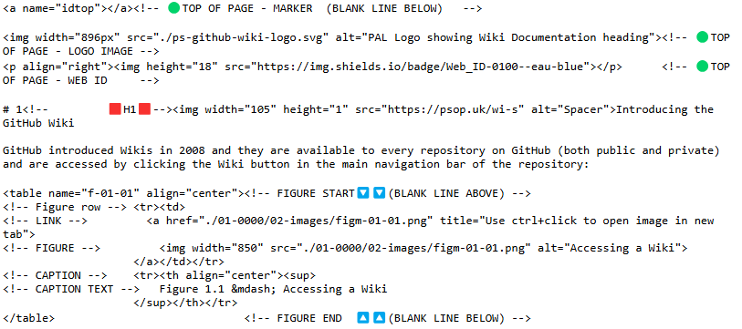

<a name="idtop"></a><!-- 🟢TOP OF PAGE - MARKER  (BLANK LINE BELOW)   -->

<!-- 🟢TOP OF PAGE - LOGO IMAGE -->
<p align="right"></p>      <!-- 🟢TOP OF PAGE - WEB ID     --> 

## 9.5<!--      🟥H2🟥-->Linking to a named element

It is possible to link to any heading on a page (see <a href="09-links#93linking-to-headings-on-the-current-page">section&nbsp;9.3</a> and <a href="09-links#94linking-to-headings-on-a-different-page">section&nbsp;9.4</a>). It is also possible to link to any other point on a page by including an *anchor point*.

Typically *(and particularly with the Practical Series Wikis)*, this can be to link to a figure or table, or to link to the top and bottom of the page.

**It is not possible to set these anchor points entirely within Markdown. HTML is required to establish the anchor point, once this is done, either Markdown or HTML can be used to navigate to it.**

Anchor points are established by specifying a ${\large \color{#00B050}\text{name}}$ attribute for an HTML tag. Most HTML tags can have a ${\large \color{#00B050}\text{name}}$: `<table>` being the most common for Practical Series Wiki pages, but any tag will do (with the exception of the `` tag for some reason).

This is done by simply adding the ${\large \color{#00B050}\text{name}}$ attribute to the opening tag:


<table name="t-09-10a" align="center"><!-- 🔴🟢🔵TABLE START🔽🔽(BLANK LINE ABOVE) -->
<!-- TOP & WIDTH --><tr><th align="right" colspan="2"><sup>HTML
                    </sup></th></tr>
<!-- Header row --> <tr>
                        <th align="left" colspan="2">${\large \color{#00C050}\text{H\ T\ M\ L}}$ 🔽</th>
                    </tr>
<!-- HTML row -->   <tr>
<!-- HTML cell 1 -->  <td align="left" width="425"><br><!-- 🟢HTML BELOW🟢 -->

```html
<table name="idName">...</table>
```
<p> </p></td><!-- 🟢HTML END OF CELL 1🟢 -->
<!-- HTML cell 2 -->  <td align="left" width="425"><br><!-- 🟢HTML BELOW🟢 -->

```html
<figure name="idName">...</figure>
```
<p> </p></td><!-- 🟢HTML END OF CELL 2🟢 -->
                    </tr><!-- 🟢HTML END OF ROW🟢 -->
                    </tr><!-- 🔵GITHUB OUTPUT END🔵 -->
</table>                             <!-- 🟥🟩🟦TABLE END  🔼🔼(BLANK LINE BELOW) -->

It works for paragraph elements too:

<table name="t-09-10b" align="center"><!-- 🔴🟢🔵TABLE START🔽🔽(BLANK LINE ABOVE) -->
<!-- TOP & WIDTH --><tr><th width="850" align="right"><sup>HTML
                    </sup></th></tr>
<!-- Header row --> <tr>
                        <th align="left">${\large \color{#00C050}\text{H\ T\ M\ L}}$ 🔽</th>
                    </tr>
<!-- HTML row -->   <tr><td align="left"><br><!-- 🟢HTML BELOW🟢 -->

```html
<p name="idName">Any paragraph text</p>
```
<p> </p></td></tr><!-- 🟢HTML END OF ROW🟢 -->
</table>                             <!-- 🟥🟩🟦TABLE END  🔼🔼(BLANK LINE BELOW) -->

To create an anchor point at some position on a Wiki page that does not have any existing HTML (say the top or bottom of the page), an empty `<a>` anchor tag is the best to use.

An empty anchor tag is simply a container to hold the ${\large \color{#00B050}\text{name}}$ tag. It looks like this:

<table name="t-09-10c" align="center"><!-- 🔴🟢🔵TABLE START🔽🔽(BLANK LINE ABOVE) -->
<!-- TOP & WIDTH --><tr><th width="850" align="right"><sup>HTML
                    </sup></th></tr>
<!-- Header row --> <tr>
                        <th align="left">${\large \color{#00C050}\text{H\ T\ M\ L}}$ 🔽</th>
                    </tr>
<!-- HTML row -->   <tr><td align="left"><br><!-- 🟢HTML BELOW🟢 -->

```html
<a name="idName"></a>
```
<p> </p></td></tr><!-- 🟢HTML END OF ROW🟢 -->
</table>                             <!-- 🟥🟩🟦TABLE END  🔼🔼(BLANK LINE BELOW) -->

In all these examples, ${\large \color{#1F883D}\text{idName}}$ is a unique alphanumeric string (${\large \color{#1F883D}\text{idName}}$ must be unique within a page, there cannot be two ${\large \color{#00B050}\text{name}}$ attributes with the same name).

The Practical Series Wikis use ${\large \color{#1F883D}\text{idtop}}$ and ${\large \color{#1F883D}\text{idend}}$ to specify the top and bottom of the page respectively.

> [!NOTE]<!-- NOTE ALERT -->
> *There is no significance to the above identifiers starting with* `id`*, the* `idName` *can be any alphanumeric string at all;* `id` *is just used in the Practical Series Wikis to make it identifiable as a* `name` *code.*

The empty anchor tag above does absolutely nothing on the Wiki page (it does not render as text or a link or manifest itself in any discernible way). It simply defines a point that can be navigated to.

To link to the anchor point, use the same Markdown or HTML links covered earlier in this section:

<table name="t-09-10d" align="center"><!-- TABLE START🔽🔽(BLANK LINE ABOVE) -->
<tr><td width="850" height="60" valign="middle">

&emsp;&emsp;&nbsp;&nbsp; ${\LARGE \color{#0050C0}\text{\[}\color{#C00000}\text{Substitute\ Text}\color{#0050C0}\text{\]\(}}$${\LARGE \color{#1F883D}\text{idName}\color{#0050C0}\text{\)}}$
</td></tr>
</table>                     <!-- TABLE END🔼🔼(BLANK LINE BELOW) -->

The substitute text can be anything you like (top of page, for example), the ${\large \color{#1F883D}\text{idName}}$ is the same name used in the anchor point and must be preceded by a single hash `#`.

The following example shows a link to the anchor point at the top of a page:

<table name="t-09-11" align="center"><!-- 🔴🟢🔵TABLE START🔽🔽(BLANK LINE ABOVE) -->
<!-- TOP & WIDTH --><tr><th width="850" align="right"><sup>Markdown, HTML equivalence and GitHub output
                    </sup></th></tr>
<!-- Header row --> <tr>
                        <th align="left">${\large \color{#0050C0}\text{M\ A\ R\ K\ D\ O\ W\ N}}$ 🔽</th>
                    </tr>
<!-- MD row -->    <tr><td align="left"><br><!-- 🔴MARKDOWN BELOW🔴 -->

```md
<a name="idtest"></a>

Lorem ipsum dolor sit amet, consectetur adipiscing elit. In consectetur tortor a tortor ornare,<br>
non pretium diam faucibus. Morbi ut mollis dolor, nec pretium tellus. Suspendisse ornare neque<br> 
placerat orci aliquam, eu sodales dui blandit. Maecenas nec risus vel magna blandit euismod.<br> 
Suspendisse id finibus purus. Nam ultricies non sapien ac rutrum

[Link to top of text](#idtest)
```
<p> </p></td></tr><!-- 🔴MARKDOWN END OF ROW🔴 -->
<!-- Header row --> <tr>
                        <th align="left">${\large \color{#00C050}\text{H\ T\ M\ L}}$ 🔽</th>
                    </tr>
<!-- HTML row -->   <tr><td align="left"><br><!-- 🟢HTML BELOW🟢 -->

```html
<a name="idtest"></a>

<p>Lorem ipsum dolor sit amet, consectetur adipiscing elit. In consectetur tortor a tortor ornare,<br>
non pretium diam faucibus. Morbi ut mollis dolor, nec pretium tellus. Suspendisse ornare neque <br>
placerat orci aliquam, eu sodales dui blandit. Maecenas nec risus vel magna blandit euismod.<br>
Suspendisse id finibus purus. Nam ultricies non sapien ac rutrum</p>

<a href="#idtest">Link to top of text</a>
```
<p> </p></td></tr><!-- 🟢HTML END OF ROW🟢 -->
<!-- Header row --> <tr>
                        <th align="left">${\large \color{#B00000}\text{G\ I\ T\ H\ U\ B}\space\ \space\text{O\ U\ T\ P\ U\ T}}$ 🔽</th>
                    </tr>
<!-- GIT row -->    <tr><td align="left"><!-- 🔵GITHUB OUTPUT BELOW (BLANK LINE BELOW)🔵 -->

<a name="idtest"></a>

Lorem ipsum dolor sit amet, consectetur adipiscing elit. In consectetur tortor a tortor ornare,<br>
non pretium diam faucibus. Morbi ut mollis dolor, nec pretium tellus. Suspendisse ornare neque<br> 
placerat orci aliquam, eu sodales dui blandit. Maecenas nec risus vel magna blandit euismod.<br> 
Suspendisse id finibus purus. Nam ultricies non sapien ac rutrum

[Link to top of text](#idtest)

</td></tr><!-- 🔵GITHUB OUTPUT END (BLANK LINE ABOVE)🔵 -->
<!-- CAPTION -->    <tr><th align="left"><sup>
<!-- CAPTION TEXT -->Table 9.11 &mdash; Link to a named element (anchor point)
                    </sup></th></tr>
</table>                             <!-- 🟥🟩🟦TABLE END  🔼🔼(BLANK LINE BELOW) -->

**[:arrow_up: Top](#idtop)**<!-- END OF SECTION - LINK TO TOP🔽🔽(BLANK LINE ABOVE) -->
<HR>                        <!-- END OF SECTION - SEPARATING LINE                    -->
<br>                        <!-- END OF SECTION - PADDING    🔼🔼(BLANK LINE BELOW) -->

#### <!--       🟥H4🟥--><u>A note by the Author<!-- Extended line -->&emsp;&emsp;&emsp;&emsp;&emsp;</u> 

If you’re wondering about the links to the top and bottom on the PracticalSeries Wiki pages, they look like this (highlighted in orange):

<table name="f-09-04" align="center"><!-- FIGURE START🔽🔽(BLANK LINE ABOVE) -->
<!-- Figure row --> <tr><td>
<!-- LINK -->         <a href="../09-0500/02-images/figm-09-04.png" title="Use ctrl+click to open image in new tab">
<!-- FIGURE -->         
                    </a></td></tr>
<!-- CAPTION -->    <tr><th align="center"><sup>
<!-- CAPTION TEXT -->   Figure 9.4 &mdash; PracticalSeries links to top and end of page
                    </sup></th></tr>
</table>                             <!-- FIGURE END  🔼🔼(BLANK LINE BELOW) -->

These use emojis (up and down arrows) to create the link.

The Markdown for the top and end of page links is:

<table name="t-09-12" align="center"><!-- 🔴🟢🔵TABLE START🔽🔽(BLANK LINE ABOVE) -->
<!-- TOP & WIDTH --><tr><th align="right" colspan="2"><sup>Markdown, HTML equivalence and GitHub output
                    </sup></th></tr>
<!-- Header row --> <tr>
                        <th align="left" colspan="2">${\large \color{#0050C0}\text{M\ A\ R\ K\ D\ O\ W\ N}}$ 🔽</th>
                    </tr>
<!-- MD row -->    <tr>
<!-- MD cell 1 -->    <td width="425" align="left"><br><!-- 🔴MARKDOWN BELOW🔴 -->

```md
**[:arrow_up: Top](#idtop)**
```
<p> </p></td><!-- 🔴MARKDOWN END OF CELL 1🔴 -->
<!-- MD cell 2 -->    <td width="425" align="left"><br><!-- 🔴MARKDOWN BELOW🔴 -->

```md
**[:arrow_down: End of page](#idend)**
```
<p> </p></td><!-- 🔴MARKDOWN END OF CELL 2🔴 -->
                    </tr><!-- 🔴MARKDOWN END OF ROW🔴 -->
<!-- Header row --> <tr>
                        <th align="left" colspan="2">${\large \color{#00C050}\text{H\ T\ M\ L}}$ 🔽</th>
                    </tr>
<!-- HTML row -->   <tr>
<!-- HTML cell 1 -->  <td align="left"><br><!-- 🟢HTML BELOW🟢 -->

```html
<a href="#idtop"><strong>⬆ Top</strong></a>
```
<p> </p></td><!-- 🟢HTML END OF CELL 1🟢 -->
<!-- HTML cell 2 -->  <td align="left"><br><!-- 🟢HTML BELOW🟢 -->

```html
<a href="#idend"><strong>⬇ End of page</strong></a>
```
<p> </p></td><!-- 🟢HTML END OF CELL 2🟢 -->
                    </tr><!-- 🟢HTML END OF ROW🟢 -->
<!-- Header row --> <tr>
                        <th align="left" colspan="2">${\large \color{#B00000}\text{G\ I\ T\ H\ U\ B}\space\ \space\text{O\ U\ T\ P\ U\ T}}$ 🔽</th>
                    </tr>
<!-- GIT row -->    <tr>
<!-- OP cell 1 -->    <td align="left" height="60" valign="middle"><!-- 🔵GITHUB OUTPUT BELOW (BLANK LINE BELOW)🔵 -->

**[:arrow_up: Top](#idtop)**

</td><!-- 🔵OP END CELL 1 (BLANK LINE ABOVE)🔵 -->
<!-- OP cell 2 -->    <td align="left" valign="middle"><!-- 🔵GITHUB OUTPUT BELOW (BLANK LINE BELOW)🔵 -->

<a href="#idend"><strong>⬇ End of page</strong></a>

</td><!-- 🔵OP END CELL 2 (BLANK LINE ABOVE)🔵 -->
                    </tr><!-- 🔵GITHUB OUTPUT END🔵 -->
<!-- CAPTION -->    <tr><th align="left" colspan="2"><sup>
<!-- CAPTION TEXT -->Table 9.12 &mdash; Link to top and end of page
                    </sup></th></tr>
</table>                             <!-- 🟥🟩🟦TABLE END  🔼🔼(BLANK LINE BELOW) -->

In both these cases, the link is surrounded by double asterisks `**` (`<strong>` in HTML), this is to put the link in bold.

The substitute text starts with either `:arrow_up:` or `:arrow_down:`, these are the emoji characters (⬆) and (⬇) respectively. The text that follows (`Top` or `End of page`) is simply the text that is displayed on the page following the arrow. 

> [!NOTE]<!-- NOTE ALERT -->
> *The links here use the GitHub short names for the emoji characters, it would also be possible to cut and paste the emoji characters directly into the substitute text area (as is done with the HTML). <a href="07-special-characters-and-escaping-characters#73emojis-and-emoticons">Section&nbsp;7.3</a>  give full details of how to use emojis and Appendix B has a full list of all emoji characters. Section 16.5 give more details about how these are used in the PracticalSeries Wikis.*

**[:arrow_up: Top](#idtop)**<!-- END OF SECTION - LINK TO TOP🔽🔽(BLANK LINE ABOVE) -->
<HR>                        <!-- END OF SECTION - SEPARATING LINE                    -->
<br>                        <!-- END OF SECTION - PADDING    🔼🔼(BLANK LINE BELOW) -->

### 9.5.1<!--   🟥H3🟥-->Link to a named point on another page

To link to an anchor point on another Wiki page, simply put the name of the page (with all spaces replaced by dashes before the ${\large \color{#4B0082}\text{pageName\}}$${\large \color{#1F883D}\text{idName}}$): 

<table name="t-09-12a" align="center"><!-- TABLE START🔽🔽(BLANK LINE ABOVE) -->
<tr><td width="850" height="60" valign="middle">

&emsp;&emsp;&nbsp;&nbsp; ${\LARGE \color{#0050C0}\text{\[}\color{#C00000}\text{Substitute\ Text}\color{#0050C0}\text{\]\(}\color{#4B0082}\text{pageName\}}$${\LARGE \color{#1F883D}\text{idName}\color{#0050C0}\text{\)}}$
</td></tr>
</table>                     <!-- TABLE END🔼🔼(BLANK LINE BELOW) -->

The ${\large \color{#C00000}\text{Substitute\ Text}}$ can be anything you like, this is displayed as the link text.

The rules for the ${\large \color{#4B0082}\text{pageName}}$ is given in <a href="09-links#921rules-for-linking-to-a-wiki-page">section&nbsp;9.2.1</a>.

**[:arrow_up: Top](#idtop)**<!-- END OF SECTION - LINK TO TOP🔽🔽(BLANK LINE ABOVE) -->
<HR>                        <!-- END OF SECTION - SEPARATING LINE                    -->
<br>                        <!-- END OF SECTION - PADDING    🔼🔼(BLANK LINE BELOW) -->

## 9.6<!--      🟥H2🟥-->Downloading a file

A link to download a file *(rather than navigating to a web page)* is possible *(sort of)* in both Markdown and HTML.


> [!NOTE]<!-- NOTE ALERT -->
> *I say “sort of” because it depends on the browser used, some files may open in a new browser tab instead of being directly downloaded. This depends on the browser being used, most browsers will open pdf files in a new window. Edge (by Microsoft) also opens Word and Excel files in new tabs (it generally gives the op-tion to then download these files).*

Generally, to download a file stored within a Wiki folder, all that is required is the full path to the file and the **inclusion of the file extension.**

For example, this Wiki has a `zipx` file that contains the HTML escape code list. It is stored in the Wiki folder `/A-0000/04-data/html_escape_codes.zipx`.

The full path to this file (as a URL is): https://github.com/practicalseries/GitHub-Wiki-Design-and-Implementation/wiki/A-0000/04-data/html_escape_codes.zipx

*Entering this link in the address bar of a browser will cause it to download the file.*

To download the file using Markdown, just use the standard Markdown link syntax:

<table name="t-09-12b" align="center"><!-- TABLE START🔽🔽(BLANK LINE ABOVE) -->
<tr><td width="850" height="60" valign="middle">

&emsp;&emsp;&nbsp;&nbsp; ${\LARGE \color{#0050C0}\text{\[}\color{#C00000}\text{Substitute\ Text}\color{#0050C0}\text{\]\(}\color{#1F883D}\text{URL}\color{#0050C0}\text{\)}}$
</td></tr>
</table>                     <!-- TABLE END🔼🔼(BLANK LINE BELOW) -->

In this case

<table name="t-09-13" align="center"><!-- 🔴🟢🔵TABLE START🔽🔽(BLANK LINE ABOVE) -->
<!-- TOP & WIDTH --><tr><th width="850" align="right"><sup>Markdown, HTML equivalence and GitHub output
                    </sup></th></tr>
<!-- Header row --> <tr>
                        <th align="left">${\large \color{#0050C0}\text{M\ A\ R\ K\ D\ O\ W\ N}}$ 🔽</th>
                    </tr>
<!-- MD row -->    <tr><td align="left"><br><!-- 🔴MARKDOWN BELOW🔴 -->

```md
[Click here to download the escape characters list](https://github.com/practicalseries/GitHub-Wiki-Design-and-Implementation/wiki/A-0000/04-data/html_escape_codes.zipx).
```
<p> </p></td></tr><!-- 🔴MARKDOWN END OF ROW🔴 -->
<!-- Header row --> <tr>
                        <th align="left">${\large \color{#00C050}\text{H\ T\ M\ L}}$ 🔽</th>
                    </tr>
<!-- HTML row -->   <tr><td align="left"><br><!-- 🟢HTML BELOW🟢 -->

```html
<a href="https://github.com/practicalseries/GitHub-Wiki-Design-and-Implementation/wiki/A-0000/04-data/html_escape_codes.zipx">Click here to download the escape characters list</a>
```
<p> </p></td></tr><!-- 🟢HTML END OF ROW🟢 -->
<!-- Header row --> <tr>
                        <th align="left">${\large \color{#B00000}\text{G\ I\ T\ H\ U\ B}\space\ \space\text{O\ U\ T\ P\ U\ T}}$ 🔽</th>
                    </tr>
<!-- GIT row -->    <tr><td align="left" height="60" valign="middle"><!-- 🔵GITHUB OUTPUT BELOW (BLANK LINE BELOW)🔵 -->

[Click here to download the escape characters list](https://github.com/practicalseries/GitHub-Wiki-Design-and-Implementation/wiki/A-0000/04-data/html_escape_codes.zipx).

</td></tr><!-- 🔵GITHUB OUTPUT END (BLANK LINE ABOVE)🔵 -->
<!-- CAPTION -->    <tr><th align="left"><sup>
<!-- CAPTION TEXT -->Table 9.13 &mdash; Download a file
                    </sup></th></tr>
</table>                          <!-- 🟥🟩🟦TABLE END  🔼🔼(BLANK LINE BELOW) -->

**[:arrow_up: Top](#idtop)**<!-- END OF SECTION - LINK TO TOP🔽🔽(BLANK LINE ABOVE) -->
<HR>                        <!-- END OF SECTION - SEPARATING LINE                    -->
<br>                        <!-- END OF SECTION - PADDING    🔼🔼(BLANK LINE BELOW) -->

### 9.6.1<!--   🟥H3🟥-->The download attribute

You may be wondering why the HTML link above didn’t use the ${\large \color{#00B050}\text{download}}$ attribute to force the file to download.

The normal HTML for downloading a file would be in the form

<table name="t-09-14" align="center"><!-- 🔴🟢🔵TABLE START🔽🔽(BLANK LINE ABOVE) -->
<!-- TOP & WIDTH --><tr><th width="850" align="right"><sup>HTML
                    </sup></th></tr>
<!-- Header row --> <tr>
                        <th align="left">${\large \color{#00C050}\text{H\ T\ M\ L}}$ 🔽</th>
                    </tr>
<!-- HTML row -->   <tr><td align="left"><br><!-- 🟢HTML BELOW🟢 -->

```html
<a href="urlOfFile" download>Click here to download the file</a>
```
<p> </p></td></tr><!-- 🟢HTML END OF ROW🟢 -->
<!-- CAPTION -->    <tr><th align="left"><sup>
<!-- CAPTION TEXT -->Table 9.14 &mdash; HTML download attribute
</table>                          <!-- 🟥🟩🟦TABLE END  🔼🔼(BLANK LINE BELOW) -->

The download attribute forces the browser to download the file and not treat it as a link.

Unfortunately, the ${\large \color{#00B050}\text{download}}$ attribute is one of the attributes that is not permitted by GitHub, it is not whitelisted (see <a href="05-markdown,-github-markdown-and-html#551html-with-github-flavoured-markdown">section&nbsp;5.5.1</a>).

This means that downloading a file depends to some extent on the browser being used. Some browsers are able to display certain files, and if they can, they will open a new tab and display the file. (for example linking to an image `.png`, `.jpg` &c. will almost certainly result in a new tab opening with the image being displayed).

If the browser does not recognise the file type or is unable to display it (compressed, `ZIP`, files almost always fall into this category), it will download it instead.

**[:arrow_up: Top](#idtop)**<!-- END OF SECTION - LINK TO TOP🔽🔽(BLANK LINE ABOVE) -->
<HR>                        <!-- END OF SECTION - SEPARATING LINE                    -->
<br>                        <!-- END OF SECTION - PADDING    🔼🔼(BLANK LINE BELOW) -->

### 9.6.2<!--   🟥H3🟥-->Spaces in filenames

**Spaces in filename are a bastard**. It leads to endless confusion: sometimes it works if you leave the spaces in, sometime they have to be replaced with dashes `-`, sometimes with a plus `+` and sometimes with the URL code `%20`. 

***It’s a bugger.***

Normal URLs, the ones you type into a web browser, do not have spaces in them.

Once you get past the top level domain `.com`, `.co.uk` &c. and into subdirectories, then file names can have spaces in them.

In terms of Wiki pages, we need the filenames for the page to have spaces in them. It is this filename that is used to display the main title for the page on the GitHub site.

This is the page ${\large \color{#446FBD}\text{01\ Introducing\ the\ GitHub\ Wiki}}$:

<table name="f-09-05" align="center"><!-- FIGURE START🔽🔽(BLANK LINE ABOVE) -->
<!-- Figure row --> <tr><td>
<!-- LINK -->         <a href="../09-0500/02-images/figm-09-05.png" title="Use ctrl+click to open image in new tab">
<!-- FIGURE -->         
                    </a></td></tr>
<!-- CAPTION -->    <tr><th align="center"><sup>
<!-- CAPTION TEXT -->   Figure 9.5 &mdash; Wiki page title
                    </sup></th></tr>
</table>                             <!-- FIGURE END  🔼🔼(BLANK LINE BELOW) -->

The title (at the top) is derived from the filename of the page, in this case it is:

&emsp;&emsp;&emsp;<!---🟡ENTER PAGENAME🟡-->${\large \color{#446FBD}\text{01\ Introducing\ the\ GitHub\ Wiki}}$

It has spaces in it.

We also want to be able to link to this page using Markdown and HTML from other pages within the Wiki, we may also want to link to it from external websites.

In all the previous examples in this section, where we have linked to other Wiki pages, the rules have been as follows:

The Wiki ${\large \color{#446FBD}\text{pageName}}$ used in the both the Markdown link and the HTML link is the same as the name of the `.md` file with the following changes:

<table name="l-09-05" align="center">   <!-- LIST START🔽🔽(BLANK LINE ABOVE) -->
<!-- LIST ROW 01  --><tr><td valign="top">&#x2776;<!-- 1  --></td>
    <td><!-- TEXT -->Do not add the <code>.md</code> extension to the ${\LARGE \color{#1F883D}\text{PageName}}$</td></tr>
<!-- LIST ROW 02  --><tr><td valign="top">&#x2777;<!-- 2  --></td>
    <td><!-- TEXT -->Any spaces within the ${\LARGE \color{#1F883D}\text{PageName}}$ are replaced with a dash `-`</td></tr>
<!-- LIST ROW 03  --><tr><td valign="top">&#x2778;<!-- 3  --></td>
    <td><!-- TEXT -->All uppercase letters are made lowercase (optional)</td></tr>
<!-- CAPTION -->          <tr><th width="52"></th><!-- SPACER -->
<!-- LIST WIDTH -->         <th align="left" width="798"><sup>
<!-- CAPTION TEXT --><!-- TEXT -->List 9.5 &mdash; Rules for converting a page name to a link
                           </sup></th></tr>
</table>                              <!-- LIST END    🔼🔼(BLANK LINE BELOW) -->

The main point being: spaces are replaced with a dash `-`.

This works for GitHub Wikis (and other Markdown pages) because GitHub is creating the webpage itself from the Markdown that is supplied to it. In doing so, it is automatically replacing the spaces with dashes in the web address. GitHub also has control of any redirections that may occur when different formats are used for the space character.

In short, replacing spaces with dashes when accessing a Wiki page always works, but only for the page itself (the thing with the `.md` extension).

If an image were to be displayed and had the filename ${\large \color{#446FBD}\text{fig\ 99-01.png}}$ (i.e. a space between fig and the 99), and if the space were replaced with a dash (i.e. ${\large \color{#446FBD}\text{fig}\color{#C00000}\text{-}\color{#446FBD}\text{99-01.png}}$), then GitHub would not display it (it would not be able to find it).

To display or download any file (other than a Wiki page .md file) that has spaces in the name, the spaces must be replaced with ${\large \color{#C00000}\text{20}}$<a name="rn-03" href="#fn-03"><!-- 🟨FOOTNOTE LINK🟨--><sup>💠3</sup></a>.

In fact the image above does exist, it is in the folder `99-0000/02-images` of this Wiki.

This is the full link to it *(it works if you paste it into a browser)*:

&emsp;&emsp;&emsp;<!---🟡ENTER URL🟡-->https://github.com/practicalseries/GitHub-Wiki-Design-and-Implementation/wiki/99-0000/02-images/fig%2099-01.png

> [!NOTE]<!-- NOTE ALERT -->
> *The `%20` is present in the figure name*

It’s a picture of my dog Henry:

<table name="f-09-06" align="center"><!-- FIGURE START🔽🔽(BLANK LINE ABOVE) -->
<!-- Figure row --> <tr><td>
<!-- LINK -->         <a href="../99-0000/02-images/fig%2099-01.png" title="Use ctrl+click to open image in new tab">
<!-- FIGURE -->         
                    </a></td></tr>
<!-- CAPTION -->    <tr><th align="center"><sup>
<!-- CAPTION TEXT -->   Figure 9.6 &mdash; Henry
                    </sup></th></tr>
</table>                             <!-- FIGURE END  🔼🔼(BLANK LINE BELOW) -->

*I’m pretty sure he’s smiling.*

Interestingly, the ${\large \color{#C00000}\text{20}}$ thing also works for the Wiki pages *(where we normally replace spaces with dashes)*. This is a link to the introductory page of this Wiki:

&emsp;&emsp;&emsp;<sup><!---🟡ENTER URL🟡-->https://github.com/practicalseries/GitHub-Wiki-Design-and-Implementation/wiki/../01-0000/01%20Introducing%20the%20GitHub%20Wiki.md</sup>

It also works if I replace the dashes in the page name with ${\large \color{#C00000}\text{20}}$:

&emsp;&emsp;&emsp;<sup><!---🟡ENTER URL🟡-->https://github.com/practicalseries/GitHub-Wiki-Design-and-Implementation/wiki/01%20Introducing%20the%20GitHub%20Wiki</sup>


> [!NOTE]<!-- NOTE ALERT -->
> *The Wiki name itself* `GitHub-Wiki-Design-and-Implementation` *always has dashes, this is the name of the repository in GitHub containing the Wiki and it was created with those dashes.*

**[:arrow_up: Top](#idtop)**<!-- END OF SECTION - LINK TO TOP🔽🔽(BLANK LINE ABOVE) -->
<HR>                        <!-- END OF SECTION - SEPARATING LINE                    -->
<br>                        <!-- END OF SECTION - PADDING    🔼🔼(BLANK LINE BELOW) -->

### 9.6.3<!--   🟥H3🟥-->Downloading a `.md` file

This is a slightly esoteric point and I include it only for completeness *(and to satisfy my own internal OCD-ness).*

In all the above sections, when linking to another page in the Wiki, the `.md` extension has been removed from the Wiki page name in the URL. To access the ${\large \color{#446FBD}\text{01\ Introducing\ the\ GitHub\ Wiki.md}}$ page, the link is simply ${\large \color{#00B050}\text{../01-0000/01%20Introducing%20the%20GitHub%20Wiki.md}}$, no `.md` at the end *(and spaces replace by dashes).*

Now let’s say that instead of navigating to the page, you want to download it (or display the source Markdown, *sometime referred to as the raw file*, in a browser), then this is possible.

To do this, the full path to the file must be included (subdirectories &c.), the spaces in the filename replaced with ${\large \color{#C00000}\text{20}}$ and the `.md` extension must be included. 

This is the link to the page above, it will open in a browser with the raw Markdown being displayed:

&emsp;&emsp;&emsp;<sup><!---🟡ENTER URL🟡-->https://github.com/practicalseries/GitHub-Wiki-Design-and-Implementation/wiki/01-0000/01%20Introducing%20the%20GitHub%20Wiki.md</sup>

It opens the raw Markdown for the file, the first part looks like this:

<table name="f-09-07" align="center"><!-- FIGURE START🔽🔽(BLANK LINE ABOVE) -->
<!-- Figure row --> <tr><td>
<!-- LINK -->         <a href="../09-0500/02-images/figm-09-07.png" title="Use ctrl+click to open image in new tab">
<!-- FIGURE -->         
                    </a></td></tr>
<!-- CAPTION -->    <tr><th align="center"><sup>
<!-- CAPTION TEXT -->   Figure 9.7 &mdash; The raw Markdown displayed in a browser
                    </sup></th></tr>
</table>                             <!-- FIGURE END  🔼🔼(BLANK LINE BELOW) -->

**[:arrow_up: Top](#idtop)**<!-- END OF SECTION - LINK TO TOP🔽🔽(BLANK LINE ABOVE) -->
<HR>                        <!-- END OF SECTION - SEPARATING LINE                    -->
<br>                        <!-- END OF SECTION - PADDING    🔼🔼(BLANK LINE BELOW) -->

## 9.7<!--      🟥H2🟥-->Reference style links

Reference style links are a bit of a peculiarity within Markdown (there is no HTML equivalent). I’m not sure many people use them; they are a bit confusing and the standard Markdown link format:

<table name="t-09-14a" align="center"><!-- TABLE START🔽🔽(BLANK LINE ABOVE) -->
<tr><td width="850" height="60" valign="middle">

&emsp;&emsp;&nbsp;&nbsp; ${\LARGE \color{#0050C0}\text{\[}\color{#C00000}\text{Substitute\ Text}\color{#0050C0}\text{\]\(}\color{#1F883D}\text{URL}\color{#0050C0}\text{\)}}$
</td></tr>
</table>                     <!-- TABLE END🔼🔼(BLANK LINE BELOW) -->

or

<table name="t-09-14b" align="center"><!-- TABLE START🔽🔽(BLANK LINE ABOVE) -->
<tr><td width="850" height="60" valign="middle">

&emsp;&emsp;&nbsp;&nbsp; ${\LARGE \color{#0050C0}\text{\[}\color{#C00000}\text{Substitute\ Text}\color{#0050C0}\text{\]\(}\color{#1F883D}\text{URL}\color{#0050C0}\text{\ "}\color{#ED7D31}\text{Tooltip\ Text}\color{#0050C0}\text{"\)}}$
</td></tr>
</table>                     <!-- TABLE END🔼🔼(BLANK LINE BELOW) -->

Are the most common types of links.

**Reference style links** *(I’m just going to call them reference links)* are intended as a way to make the text in a Markdown file clearer. Reference links have two parts, the first part, the reference, appears in-line with the text in the Markdown (in a paragraph for example), the second part, the URL, is somewhere else in the file (usually at the end) and contains the URL, this second part does not get displayed.

**The first part, the reference, has the form:**

<table name="t-09-14c" align="center"><!-- TABLE START🔽🔽(BLANK LINE ABOVE) -->
<tr><td width="850" height="60" valign="middle">

&emsp;&emsp;&nbsp;&nbsp; ${\LARGE \color{#0050C0}\text{\[}\color{#C00000}\text{Substitute\ Text}\color{#0050C0}\text{\]\(}\color{#1F883D}\text{Label}\color{#0050C0}\text{\)}}$
</td></tr>
</table>                     <!-- TABLE END🔼🔼(BLANK LINE BELOW) -->

Here, ${\large \color{#C00000}\text{Substitute\ Text}}$ can be anything you like, this is the text that is displayed on the page.

The ${\large \color{#1F883D}\text{Label}}$ is a unique alphanumeric identifier that links the reference to the URL in the second part below.

**The second part, the URL, has the form:**

<table name="t-09-14b" align="center"><!-- TABLE START🔽🔽(BLANK LINE ABOVE) -->
<tr><td width="850" height="60" valign="middle">

&emsp;&emsp;&nbsp;&nbsp; ${\LARGE \color{#0050C0}\text{\[}\color{#1F883D}\text{Label}\color{#0050C0}\text{\]:}\color{#4B0082}\text{URL}}$
</td></tr>
</table>                     <!-- TABLE END🔼🔼(BLANK LINE BELOW) -->

The ${\large \color{#1F883D}\text{Label}}$ must match that in the first part, the ${\large \color{#4B0082}\text{URL}}$ is the URL of the link

Putting all this together in an example:

<table name="t-09-16" align="center"><!-- 🔴🟢🔵TABLE START🔽🔽(BLANK LINE ABOVE) -->
<!-- TOP & WIDTH --><tr><th width="850" align="right"><sup>Markdown, HTML equivalence and GitHub output
                    </sup></th></tr>
<!-- Header row --> <tr>
                        <th align="left">${\large \color{#0050C0}\text{M\ A\ R\ K\ D\ O\ W\ N}}$ 🔽</th>
                    </tr>
<!-- MD row -->    <tr><td align="left"><br><!-- 🔴MARKDOWN BELOW🔴 -->

```md
Developing the pumps was still not as hard as solving the second basic problem of rocket engines: 
making the propellants burn smoothly once they had reached the combustion chamber. 
The pumps brought the kerosene and the [LOX][lab01] to a circular metal slab three feet in 
diameter and about four inches thick, weighing 1,000 pounds, called the injector plate.

[lab01]:https://en.wikipedia.org/wiki/Liquid_oxygen

```
<p> </p></td></tr><!-- 🔴MARKDOWN END OF ROW🔴 -->
<!-- Header row --> <tr>
                        <th align="left">${\large \color{#B00000}\text{G\ I\ T\ H\ U\ B}\space\ \space\text{O\ U\ T\ P\ U\ T}}$ 🔽</th>
                    </tr>
<!-- GIT row -->    <tr><td align="left"><!-- 🔵GITHUB OUTPUT BELOW (BLANK LINE BELOW)🔵 -->

Developing the pumps was still not as hard as solving the second basic problem of rocket engines: 
making the propellants burn smoothly once they had reached the combustion chamber. 
The pumps brought the kerosene and the [LOX][lab01] to a circular metal slab three feet in 
diameter and about four inches thick, weighing 1,000 pounds, called the injector plate.

[lab01]:https://en.wikipedia.org/wiki/Liquid_oxygen


</td></tr><!-- 🔵GITHUB OUTPUT END (BLANK LINE ABOVE)🔵 -->
<!-- CAPTION -->    <tr><th align="left"><sup>
<!-- CAPTION TEXT -->Table 9.16 &mdash; Reference link
                    </sup></th></tr>
</table>                             <!-- 🟥🟩🟦TABLE END  🔼🔼(BLANK LINE BELOW) -->

To add a tooltip, the second part becomes *(there is a space between the end of the URL and the first quotaion mark)*:

<table name="t-09-14b" align="center"><!-- TABLE START🔽🔽(BLANK LINE ABOVE) -->
<tr><td width="850" height="60" valign="middle">

&emsp;&emsp;&nbsp;&nbsp; ${\LARGE \color{#0050C0}\text{\[}\color{#1F883D}\text{Label}\color{#0050C0}\text{\]:}\color{#4B0082}\text{URL}\color{#0050C0}\text{\ "}\color{#ED7D31}\text{toolTip}\color{#0050C0}\text{"}}$
</td></tr>
</table>                     <!-- TABLE END🔼🔼(BLANK LINE BELOW) -->

Or in the above example:

<table name="t-09-17" align="center"><!-- 🔴🟢🔵TABLE START🔽🔽(BLANK LINE ABOVE) -->
<!-- TOP & WIDTH --><tr><th width="850" align="right"><sup>Markdown, HTML equivalence and GitHub output
                    </sup></th></tr>
<!-- Header row --> <tr>
                        <th align="left">${\large \color{#0050C0}\text{M\ A\ R\ K\ D\ O\ W\ N}}$ 🔽</th>
                    </tr>
<!-- MD row -->    <tr><td align="left"><br><!-- 🔴MARKDOWN BELOW🔴 -->

```md
Developing the pumps was still not as hard as solving the second basic problem of rocket engines: 
making the propellants burn smoothly once they had reached the combustion chamber. 
The pumps brought the kerosene and the [LOX][lab02] to a circular metal slab three feet in 
diameter and about four inches thick, weighing 1,000 pounds, called the injector plate.

[lab02]:https://en.wikipedia.org/wiki/Liquid_oxygen "Liquid Oxygen"

```
<p> </p></td></tr><!-- 🔴MARKDOWN END OF ROW🔴 -->
<!-- Header row --> <tr>
                        <th align="left">${\large \color{#B00000}\text{G\ I\ T\ H\ U\ B}\space\ \space\text{O\ U\ T\ P\ U\ T}}$ 🔽</th>
                    </tr>
<!-- GIT row -->    <tr><td align="left"><!-- 🔵GITHUB OUTPUT BELOW (BLANK LINE BELOW)🔵 -->

Developing the pumps was still not as hard as solving the second basic problem of rocket engines: 
making the propellants burn smoothly once they had reached the combustion chamber. 
The pumps brought the kerosene and the [LOX][lab02] to a circular metal slab three feet in 
diameter and about four inches thick, weighing 1,000 pounds, called the injector plate.

[lab02]:https://en.wikipedia.org/wiki/Liquid_oxygen "Liquid Oxygen"


</td></tr><!-- 🔵GITHUB OUTPUT END (BLANK LINE ABOVE)🔵 -->
<!-- CAPTION -->    <tr><th align="left"><sup>
<!-- CAPTION TEXT -->Table 9.17 &mdash; Reference link with tooltip
                    </sup></th></tr>
</table>                             <!-- 🟥🟩🟦TABLE END  🔼🔼(BLANK LINE BELOW) -->

Some forms of Markdown put angle brackets around the URL, GitHub is tolerant of this too — this also works:

<table name="t-09-18" align="center"><!-- 🔴🟢🔵TABLE START🔽🔽(BLANK LINE ABOVE) -->
<!-- TOP & WIDTH --><tr><th width="850" align="right"><sup>Markdown, HTML equivalence and GitHub output
                    </sup></th></tr>
<!-- Header row --> <tr>
                        <th align="left">${\large \color{#0050C0}\text{M\ A\ R\ K\ D\ O\ W\ N}}$ 🔽</th>
                    </tr>
<!-- MD row -->    <tr><td align="left"><br><!-- 🔴MARKDOWN BELOW🔴 -->

```md
Developing the pumps was still not as hard as solving the second basic problem of rocket engines: 
making the propellants burn smoothly once they had reached the combustion chamber. 
The pumps brought the kerosene and the [LOX][lab03] to a circular metal slab three feet in 
diameter and about four inches thick, weighing 1,000 pounds, called the injector plate.

[lab03]:<https://en.wikipedia.org/wiki/Liquid_oxygen> "Liquid Oxygen"

```
<p> </p></td></tr><!-- 🔴MARKDOWN END OF ROW🔴 -->
<!-- Header row --> <tr>
                        <th align="left">${\large \color{#B00000}\text{G\ I\ T\ H\ U\ B}\space\ \space\text{O\ U\ T\ P\ U\ T}}$ 🔽</th>
                    </tr>
<!-- GIT row -->    <tr><td align="left"><!-- 🔵GITHUB OUTPUT BELOW (BLANK LINE BELOW)🔵 -->

Developing the pumps was still not as hard as solving the second basic problem of rocket engines: 
making the propellants burn smoothly once they had reached the combustion chamber. 
The pumps brought the kerosene and the [LOX][lab03] to a circular metal slab three feet in 
diameter and about four inches thick, weighing 1,000 pounds, called the injector plate.

[lab03]:<https://en.wikipedia.org/wiki/Liquid_oxygen> "Liquid Oxygen"


</td></tr><!-- 🔵GITHUB OUTPUT END (BLANK LINE ABOVE)🔵 -->
<!-- CAPTION -->    <tr><th align="left"><sup>
<!-- CAPTION TEXT -->Table 9.18 &mdash; Reference link with tooltip and angle brackets
                    </sup></th></tr>
</table>                             <!-- 🟥🟩🟦TABLE END  🔼🔼(BLANK LINE BELOW) -->

**[:arrow_up: Top](#idtop)**<!-- END OF SECTION - LINK TO TOP🔽🔽(BLANK LINE ABOVE) -->
<HR>                        <!-- END OF SECTION - SEPARATING LINE                    -->
<br>                        <!-- END OF SECTION - PADDING    🔼🔼(BLANK LINE BELOW) -->

## 9.8<!--      🟥H2🟥-->Relative links

This was discussed briefly in <a href="09-links#92linking-to-another-page-in-the-same-wiki">section&nbsp;9.2</a>, but is covered in more detail here.

When creating links to different elements in the same Wiki, it is possible to use relative links. This means that it is not necessary to enter the whole URL to link to a given element.

For example, consider the link to the picture of Henry in <a href="#962spaces-in-filenames">section&nbsp;9.6.2</a>, the full URL for this image was:

&emsp;&emsp;&emsp;<!---🟡ENTER URL🟡-->https://github.com/practicalseries/GitHub-Wiki-Design-and-Implementation/wiki/99-0000/02-images/fig%2099-01.png

To access this image from any other page in the same Wiki, it is not necessary to use the full URL, all the pages in the given Wiki are in the subdirectory `/wiki/` or in a subdirectory of a subdirectory.

This means that it is only necessary to include that part of the path from the current page to the image. If the image was to be displayed on the ${\large \color{#446FBD}\text{Home}}$ page for example, the link becomes:

<table name="t-09-19" align="center"><!-- 🔴🟢🔵TABLE START🔽🔽(BLANK LINE ABOVE) -->
<!-- TOP & WIDTH --><tr><th width="850" align="right"><sup>Markdown, HTML equivalence and GitHub output
                    </sup></th></tr>
<!-- Header row --> <tr>
                        <th align="left">${\large \color{#0050C0}\text{M\ A\ R\ K\ D\ O\ W\ N}}$ 🔽</th>
                    </tr>
<!-- MD row -->    <tr><td align="left"><br><!-- 🔴MARKDOWN BELOW🔴 -->

```md
[fig 99.01](./99-0000/02-images/fig%2099-01.png)
```
<p> </p></td></tr><!-- 🔴MARKDOWN END OF ROW🔴 -->
<!-- Header row --> <tr>
                        <th align="left">${\large \color{#00C050}\text{H\ T\ M\ L}}$ 🔽</th>
                    </tr>
<!-- HTML row -->   <tr><td align="left"><br><!-- 🟢HTML BELOW🟢 -->

```html
<a href="../99-0000/02-images/fig%2099-01.png"> fig 99.01</a>
```
<p> </p></td></tr><!-- 🟢HTML END OF ROW🟢 -->
<!-- Header row --> <tr>
                        <th align="left">${\large \color{#B00000}\text{G\ I\ T\ H\ U\ B}\space\ \space\text{O\ U\ T\ P\ U\ T}}$ 🔽</th>
                    </tr>
<!-- GIT row -->    <tr><td align="left"><!-- 🔵GITHUB OUTPUT BELOW (BLANK LINE BELOW)🔵 -->

[fig 99.01](./99-0000/02-images/fig%2099-01.png)

</td></tr><!-- 🔵GITHUB OUTPUT END (BLANK LINE ABOVE)🔵 -->
<!-- CAPTION -->    <tr><th align="left"><sup>
<!-- CAPTION TEXT -->Table 9.19 &mdash; Link to an image using a relative address
                    </sup></th></tr>
</table>                             <!-- 🟥🟩🟦TABLE END  🔼🔼(BLANK LINE BELOW) -->

The `./` at the start of the link is old school command line path terminology that means *“the current directory”*. 

The other similar path commands are:

<table name="t-09-20" align="center"><!-- TABLE START🔽🔽(BLANK LINE ABOVE) -->
<!-- Header row --> <tr>
                        <th width="150" align="left">Path Command</th>
                        <th width="300" align="left">Meaning</th>
                        <th width="400" align="left">Notes</th>
                    </tr>
<!-- Data row -->   <tr>
                        <td align="left"><code>/</code></td>
                        <td align="left">Move to the root directory </td>
                        <td align="left"><em>In terms of the Wiki, this is</em> <code>github.com</code></td>
                    </tr>
<!-- Data row -->   <tr>
                        <td align="left"><code>./</code></td>
                        <td align="left">The current directory</td>
                        <td align="left"></td>
                    </tr>
<!-- Data row -->   <tr>
                        <td align="left"><code>../</code></td>
                        <td align="left">The parent directory</td>
                        <td align="left"><em>Moves the directory level up one</em></td>
                    </tr>
<!-- CAPTION -->    <tr><th colspan="3" align="left"><sup>
<!-- CAPTION TEXT -->   Table 9.20 &mdash; Path commands
                    </sup></th></tr>
</table>
<br clear="all">                     <!-- TABLE END🔼🔼(BLANK LINE BELOW) -->

Strictly speaking, the `./` is not necessary and the link would work without it:

<table name="t-09-21" align="center"><!-- 🔴🟢🔵TABLE START🔽🔽(BLANK LINE ABOVE) -->
<!-- TOP & WIDTH --><tr><th width="850" align="right"><sup>Markdown, HTML equivalence and GitHub output
                    </sup></th></tr>
<!-- Header row --> <tr>
                        <th align="left">${\large \color{#0050C0}\text{M\ A\ R\ K\ D\ O\ W\ N}}$ 🔽</th>
                    </tr>
<!-- MD row -->    <tr><td align="left"><br><!-- 🔴MARKDOWN BELOW🔴 -->

```md
[fig 99.01](99-0000/02-images/fig%2099-01.png)
```
<p> </p></td></tr><!-- 🔴MARKDOWN END OF ROW🔴 -->
<!-- Header row --> <tr>
                        <th align="left">${\large \color{#00C050}\text{H\ T\ M\ L}}$ 🔽</th>
                    </tr>
<!-- HTML row -->   <tr><td align="left"><br><!-- 🟢HTML BELOW🟢 -->

```html
<a href="99-0000/02-images/fig%2099-01.png"> fig 99.01</a>
```
<p> </p></td></tr><!-- 🟢HTML END OF ROW🟢 -->
<!-- Header row --> <tr>
                        <th align="left">${\large \color{#B00000}\text{G\ I\ T\ H\ U\ B}\space\ \space\text{O\ U\ T\ P\ U\ T}}$ 🔽</th>
                    </tr>
<!-- GIT row -->    <tr><td align="left"><!-- 🔵GITHUB OUTPUT BELOW (BLANK LINE BELOW)🔵 -->

[fig 99.01](99-0000/02-images/fig%2099-01.png)

</td></tr><!-- 🔵GITHUB OUTPUT END (BLANK LINE ABOVE)🔵 -->
<!-- CAPTION -->    <tr><th align="left"><sup>
<!-- CAPTION TEXT -->Table 9.21 &mdash; Alternative relative address
                    </sup></th></tr>
</table>                             <!-- 🟥🟩🟦TABLE END  🔼🔼(BLANK LINE BELOW) -->

> [!NOTE]<!-- NOTE ALERT -->
> *Whilst this works, it is bad form to miss the `./` at the start where a subdirectory is involved. The `./` makes it clear that the path is looking for a subdirectory. The convention is to always use `./` where the file in question is in a subdirectory. If the file is in the current directory then the `./` can be omitted.*

**[:arrow_up: Top](#idtop)**<!-- END OF SECTION - LINK TO TOP🔽🔽(BLANK LINE ABOVE) -->
<HR>                        <!-- END OF SECTION - SEPARATING LINE                    -->
<br>                        <!-- END OF SECTION - PADDING    🔼🔼(BLANK LINE BELOW) -->

### 9.8.1<!--   🟥H3🟥-->Relative links from any Wiki page

In the previous example, the link to ${\large \color{#446FBD}\text{fig\ 99-01.png}}$ from the ${\large \color{#446FBD}\text{Home}}$ was:

<table name="t-09-21a" align="center"><!-- 🔴🟢🔵TABLE START🔽🔽(BLANK LINE ABOVE) -->
<!-- TOP & WIDTH --><tr><th width="850" align="right"><sup>Markdown, HTML equivalence and GitHub output
                    </sup></th></tr>
<!-- Header row --> <tr>
                        <th align="left">${\large \color{#0050C0}\text{M\ A\ R\ K\ D\ O\ W\ N}}$ 🔽</th>
                    </tr>
<!-- MD row -->    <tr><td align="left"><br><!-- 🔴MARKDOWN BELOW🔴 -->

```md
[fig 99.01](./99-0000/02-images/fig%2099-01.png)
```
<p> </p></td></tr><!-- 🔴MARKDOWN END OF ROW🔴 -->
<!-- Header row --> <tr>
                        <th align="left">${\large \color{#00C050}\text{H\ T\ M\ L}}$ 🔽</th>
                    </tr>
<!-- HTML row -->   <tr><td align="left"><br><!-- 🟢HTML BELOW🟢 -->

```html
<a href="../99-0000/02-images/fig%2099-01.png"> fig 99.01</a>
```
<p> </p></td></tr><!-- 🟢HTML END OF ROW🟢 -->
</table>                             <!-- 🟥🟩🟦TABLE END  🔼🔼(BLANK LINE BELOW) -->

This makes perfect sense; the ${\large \color{#446FBD}\text{Home}}$ page is at the top level of the Wiki folder structure so all other elements are in some subdirectory relative to the ${\large \color{#446FBD}\text{Home}}$ page

Surprisingly, to link to the same image from a Wiki page that is stored in its own subdirectory, say ${\large \color{#446FBD}\text{01\ Introducing\ the\ GitHub\ Wiki.md}}$ which is in the subdirectory: `/01-0000/`, the link stays exactly the same:

<table name="t-09-21b" align="center"><!-- 🔴🟢🔵TABLE START🔽🔽(BLANK LINE ABOVE) -->
<!-- TOP & WIDTH --><tr><th width="850" align="right"><sup>Markdown, HTML equivalence and GitHub output
                    </sup></th></tr>
<!-- Header row --> <tr>
                        <th align="left">${\large \color{#0050C0}\text{M\ A\ R\ K\ D\ O\ W\ N}}$ 🔽</th>
                    </tr>
<!-- MD row -->    <tr><td align="left"><br><!-- 🔴MARKDOWN BELOW🔴 -->

```md
[fig 99.01](./99-0000/02-images/fig%2099-01.png)
```
<p> </p></td></tr><!-- 🔴MARKDOWN END OF ROW🔴 -->
<!-- Header row --> <tr>
                        <th align="left">${\large \color{#00C050}\text{H\ T\ M\ L}}$ 🔽</th>
                    </tr>
<!-- HTML row -->   <tr><td align="left"><br><!-- 🟢HTML BELOW🟢 -->

```html
<a href="../99-0000/02-images/fig%2099-01.png"> fig 99.01</a>
```
<p> </p></td></tr><!-- 🟢HTML END OF ROW🟢 -->
</table>                             <!-- 🟥🟩🟦TABLE END  🔼🔼(BLANK LINE BELOW) -->

It is surprising because the image is not in a subdirectory of the `01-0000` folder; to get to the `99-0000` folder from the `01-0000` folder we need to go up a level, i.e. the link should be:

<table name="t-09-21b" align="center"><!-- 🔴🟢🔵TABLE START🔽🔽(BLANK LINE ABOVE) -->
<!-- TOP & WIDTH --><tr><th width="850" align="right"><sup>Markdown, HTML equivalence and GitHub output
                    </sup></th></tr>
<!-- Header row --> <tr>
                        <th align="left">${\large \color{#0050C0}\text{M\ A\ R\ K\ D\ O\ W\ N}}$ 🔽</th>
                    </tr>
<!-- MD row -->    <tr><td align="left"><br><!-- 🔴MARKDOWN BELOW🔴 -->

```md
[fig 99.01](../99-0000/02-images/fig%2099-01.png)
```
<p> </p></td></tr><!-- 🔴MARKDOWN END OF ROW🔴 -->
<!-- Header row --> <tr>
                        <th align="left">${\large \color{#00C050}\text{H\ T\ M\ L}}$ 🔽</th>
                    </tr>
<!-- HTML row -->   <tr><td align="left"><br><!-- 🟢HTML BELOW🟢 -->

```html
<a href="../99-0000/02-images/fig%2099-01.png"> fig 99.01</a>
```
<p> </p></td></tr><!-- 🟢HTML END OF ROW🟢 -->
</table>                             <!-- 🟥🟩🟦TABLE END  🔼🔼(BLANK LINE BELOW) -->

With `../` at the start to go up a level.

*So what is happening?*

Well, GitHub has a flexible attitude when it comes to `.md` files (the Wiki pages). 

With all Wiki pages (that end `.md)` GitHub ignores all subdirectories, it considers everything to be at the same top-level as the `Home.md` page.

The upshot of this is that when linking from a Wiki page to an element in the same Wiki, that page can be considered (for all practical purposes) to be in the top-level folder of the Wiki (i.e. at the `/wiki/` folder level). All subfolders can thus be accessed using the `./` current directory path terminology.

<hr><!-- FOOTNOTE SEPARATOR 🟡🟡🟡🟡🟡 -->
<a name="idfn" href="#idfn">Footnotes:<!-- 🟡FOOTNOTE TITLE🟡 -->&emsp;&emsp;&emsp;&emsp;&emsp;</a>
<br><br><br>

> [!NOTE]<!-- 🟡FOOTNOTE CONTENT -->
> <a name="fn-03" href="#rn-03"><sup>💠3</sup></a>&emsp;<!-- FOOTNOTE CONTENT TEXT -->The `%` sign in a URL is used to insert a character that is not normally supported, it is in the format: `%nn` where `nn` is a two-digit hexadecimal number that represents the hexadecimal Unicode value of the character. The space character is Unicode decimal character `32`, or in hexadecimal this is character `20`. Entering `%20` in a URL effectively inserts a space character into the URL string.<!--  CONTENT TEXT END --><a href="#rn-03">↩</a><!-- 🟡🟡🟡🟡🟡 FOOTNOTE END -->
<br><br>            <!-- END OF PAGE - 🟥🟥🟥🟥🟥 PADDING🔽🔽(NO BLANK LINE ABOVE) -->
<hr>                <!-- END OF PAGE - 🟥🟥🟥🟥🟥 SEPARATING LINE                   -->
<a name="idend"></a><!-- END OF PAGE – 🟥🟥🟥🟥🟥 MARKER 🔼🔼                      -->