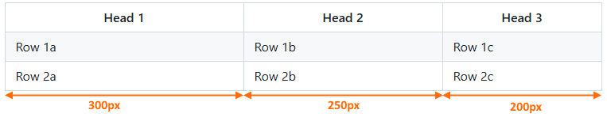
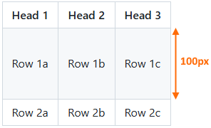

<a name="idtop"></a><!-- 🟢TOP OF PAGE - MARKER  (BLANK LINE BELOW)   -->

<!-- 🟢TOP OF PAGE - LOGO IMAGE -->
<p align="right"></p>      <!-- 🟢TOP OF PAGE - WEB ID     --> 

# 10<!--        🟥H1🟥-->Tables

Tables can be constructed in both Markdown and HTML.

It is fair to say that Markdown tables are very simplistic in nature and do not offer a great deal of flexibility: they always have a heading across the top (vertical headings cannot be accommodated), they have limited alignment capabilities (horizontal alignment is possible, but vertical alignments are not. Similarly the table alignment on the page is not possible) and they do not support the merging of cells.

Markdown tables are only suitable for very straight forward tables.

That said, Markdown tables have the appearance of tables in the Markdown and are easy to understand.

HTML tables on the other hand offer a very great deal of flexibility (they can do all the things listed in the Markdown limitations above) and allow the tables to be used as containers for other things: images, ordered and unordered lists, text blocks &c.

The disadvantage of HTML tables is that they are harder to understand when built in Markdown (each cell is on its own line, it’s harder to identify rows and columns). A second disadvantage is that HTML tables do not lend themselves to the direct import of spreadsheet cells *(this may seem a slightly odd point, but it is a common activity to copy data from a spreadsheet to a Wiki page)* the data has to be manipulated before it can be copied to the Markdown file.

The PracticalSeries Wikis use both types of tables, *but mainly HTML ones*.

**[:arrow_up: Top](#idtop)**<!-- END OF SECTION - LINK TO TOP🔽🔽(BLANK LINE ABOVE) -->
<HR>                        <!-- END OF SECTION - SEPARATING LINE                    -->
<br>                        <!-- END OF SECTION - PADDING    🔼🔼(BLANK LINE BELOW) -->

## 10.1<!--     🟥H2🟥-->Markdown tables

Tables in Markdown are pretty simple; they use the pipe character `|` to separate cells and three or more dashes `---` to identify the column header.

The easiest way to explain it is to show an example:

<table name="t-10-01" align="center"><!-- 🔴🟢🔵TABLE START🔽🔽(BLANK LINE ABOVE) -->
<!-- TOP & WIDTH --><tr><th width="850" align="right"><sup>Markdown and GitHub output
                    </sup></th></tr>
<!-- Header row --> <tr><!-- 🔴🔴🔴 -->
                        <th align="left">${\large \color{#0050C0}\text{M\ A\ R\ K\ D\ O\ W\ N}}$ 🔽</th>
                    </tr>
<!-- MD row -->    <tr><td align="left"><br><!-- 🔴MARKDOWN BELOW🔴 -->

```md
| Head 1 | Head 2 | Head 3 |
|--------|--------|--------|
| Row 1a | Row 1b | Row 1c |
| Row 2a | Row 2b | Row 2c |
| Row 3a | Row 3b | Row 3c |
| Row 4a | Row 4b | Row 4c |
```
<p> </p></td></tr><!-- 🔴MARKDOWN END OF ROW🔴 -->
<!-- Header row --> <tr><!-- 🔵🔵🔵 -->
                        <th align="left">${\large \color{#B00000}\text{G\ I\ T\ H\ U\ B}\space\ \space\text{O\ U\ T\ P\ U\ T}}$ 🔽</th>
                    </tr>
<!-- GIT row -->    <tr><td align="left"><!-- 🔵GITHUB OUTPUT BELOW (BLANK LINE BELOW)🔵 -->

| Head 1 | Head 2 | Head 3 |
|--------|--------|--------|
| Row 1a | Row 1b | Row 1c |
| Row 2a | Row 2b | Row 2c |
| Row 3a | Row 3b | Row 3c |
| Row 4a | Row 4b | Row 4c |

</td></tr><!-- 🔵GITHUB OUTPUT END (BLANK LINE ABOVE)🔵 -->
<!-- CAPTION -->    <tr><th align="left"><sup>
<!-- CAPTION TEXT -->Table 10.1 &mdash; A simple Markdown table
                    </sup></th></tr>
</table>                             <!-- 🟥🟩🟦TABLE END  🔼🔼(BLANK LINE BELOW) -->

The header row is always in bold, and alternate table body rows are shaded light grey `rgb (246,248,250)`, `#F6F8FA`.

Markdown tables are always left aligned on the page.

There is nothing that can be done about this with Markdown tables (however, there is with HTML tables, see <a href="#102html-tables">section&nbsp;10.2</a>).

### 10.1.1<!--  🟥H3🟥-->Horizontal alignment

By default the text in the heading cells is centred and the text in the body cells is left aligned:

<table name="t-10-02" align="center"><!-- 🔴🟢🔵TABLE START🔽🔽(BLANK LINE ABOVE) -->
<!-- TOP & WIDTH --><tr><th width="850" align="right"><sup>Markdown and GitHub output
                    </sup></th></tr>
<!-- Header row --> <tr><!-- 🔴🔴🔴 -->
                        <th align="left">${\large \color{#0050C0}\text{M\ A\ R\ K\ D\ O\ W\ N}}$ 🔽</th>
                    </tr>
<!-- MD row -->    <tr><td align="left"><br><!-- 🔴MARKDOWN BELOW🔴 -->

```md
| Head 1      | Head 2      | Head 3      |
|-------------|-------------|-------------|
| Row 1a      | Row 1b      | Row 1c      |
| Row 2a text | Row 2b text | Row 2c text |
```
<p> </p></td></tr><!-- 🔴MARKDOWN END OF ROW🔴 -->
<!-- Header row --> <tr><!-- 🔵🔵🔵 -->
                        <th align="left">${\large \color{#B00000}\text{G\ I\ T\ H\ U\ B}\space\ \space\text{O\ U\ T\ P\ U\ T}}$ 🔽</th>
                    </tr>
<!-- GIT row -->    <tr><td align="left"><!-- 🔵GITHUB OUTPUT BELOW (BLANK LINE BELOW)🔵 -->

| Head 1      | Head 2      | Head 3      |
|-------------|-------------|-------------|
| Row 1a      | Row 1b      | Row 1c      |
| Row 2a text | Row 2b text | Row 2c text |

</td></tr><!-- 🔵GITHUB OUTPUT END (BLANK LINE ABOVE)🔵 -->
<!-- CAPTION -->    <tr><th align="left"><sup>
<!-- CAPTION TEXT -->Table 10.2 &mdash; Markdown table default alignment
                    </sup></th></tr>
</table>                             <!-- 🟥🟩🟦TABLE END  🔼🔼(BLANK LINE BELOW) -->

The horizontal alignment can be changed by adding colons (:) to the row of dashes:

<table name="t-10-03" align="center"><!-- 🔴🟢🔵TABLE START🔽🔽(BLANK LINE ABOVE) -->
<!-- TOP & WIDTH --><tr><th width="850" align="right"><sup>Markdown and GitHub output
                    </sup></th></tr>
<!-- Header row --> <tr><!-- 🔴🔴🔴 -->
                        <th align="left">${\large \color{#0050C0}\text{M\ A\ R\ K\ D\ O\ W\ N}}$ 🔽</th>
                    </tr>
<!-- MD row -->    <tr><td align="left"><br><!-- 🔴MARKDOWN BELOW🔴 -->

```md
| Head 1      | Head 2      | Head 3      |
|:------------|:-----------:|------------:|
| Left        | Centred     | Right       |
| Row 2a text | Row 2b text | Row 2c text |
```
<p> </p></td></tr><!-- 🔴MARKDOWN END OF ROW🔴 -->
<!-- Header row --> <tr><!-- 🔵🔵🔵 -->
                        <th align="left">${\large \color{#B00000}\text{G\ I\ T\ H\ U\ B}\space\ \space\text{O\ U\ T\ P\ U\ T}}$ 🔽</th>
                    </tr>
<!-- GIT row -->    <tr><td align="left"><!-- 🔵GITHUB OUTPUT BELOW (BLANK LINE BELOW)🔵 -->

| Head 1      | Head 2      | Head 3      |
|:------------|:-----------:|------------:|
| Left        | Centred     | Right       |
| Row 2a text | Row 2b text | Row 2c text |

</td></tr><!-- 🔵GITHUB OUTPUT END (BLANK LINE ABOVE)🔵 -->
<!-- CAPTION -->    <tr><th align="left"><sup>
<!-- CAPTION TEXT -->Table 10.3 &mdash; Markdown table modified alignments
                    </sup></th></tr>
</table>

The colons have the following meanings:

<table name="t-10-04" align="center"><!-- TABLE START🔽🔽(BLANK LINE ABOVE) -->
<!-- HEADER ROW --> <tr>
                        <th width="100" align="center">Symbol</th>
                        <th width="300" align="center">Alignment</th>
                    </tr>
<!-- DATA ROW -->   <tr>
                        <td align="center"><code>:---</code></td>
                        <td align="left">Align left horizontally</td>
                    </tr>
<!-- DATA ROW -->   <tr>
                        <td align="center"><code>:---:</code></td>
                        <td align="left">Centred horizontally</td>
                    </tr>
<!-- DATA ROW -->   <tr>
                        <td align="center"><code>---:</code></td>
                        <td align="left">Align right horizontally</td>
                    </tr>
<!-- CAPTION -->    <tr><th colspan="2" align="left"><sup>
<!-- CAPTION TEXT -->Table 10.4 &mdash; Markdown horizontal alignment
                     </sup></th></tr>
</table>                             <!-- TABLE END  🔼🔼(BLANK LINE BELOW) -->

**If the alignment is changed, the heading cells will follow the same alignment.**

**[:arrow_up: Top](#idtop)**<!-- END OF SECTION - LINK TO TOP🔽🔽(BLANK LINE ABOVE) -->
<HR>                        <!-- END OF SECTION - SEPARATING LINE                    -->
<br>                        <!-- END OF SECTION - PADDING    🔼🔼(BLANK LINE BELOW) -->

### 10.1.2<!--  🟥H3🟥-->Table construction

In the previous example, everything was nicely lined up. Most people do this when building Markdown tables *(I think it’s an inherent sense of neatness)*.

It is not however, necessary. The following works perfectly well:

<table name="t-10-05" align="center"><!-- 🔴🟢🔵TABLE START🔽🔽(BLANK LINE ABOVE) -->
<!-- TOP & WIDTH --><tr><th width="850" align="right"><sup>Markdown and GitHub output
                    </sup></th></tr>
<!-- Header row --> <tr><!-- MARKDOWN HEADER 🔴🔴🔴 -->
                        <th align="left">${\large \color{#0050C0}\text{M\ A\ R\ K\ D\ O\ W\ N}}$ 🔽</th>
                    </tr>
<!-- MD row -->    <tr><td align="left"><br><!-- 🔴MARKDOWN BELOW🔴 -->

```md
|Head 1|Head 2|Head 3|
|:---|:---:|---:|
|Left| Centred|Right|
|Row 2a text|Row 2b text|Row 2c text|
```
<p> </p></td></tr><!-- MARKDOWN END OF ROW   🔴🔴🔴 -->
<!-- Header row --> <tr><!-- GITHUB HEADER   🔵🔵🔵 -->
                        <th align="left">${\large \color{#B00000}\text{G\ I\ T\ H\ U\ B}\space\ \space\text{O\ U\ T\ P\ U\ T}}$ 🔽</th>
                    </tr>
<!-- GIT row -->    <tr><td align="left"><!-- 🔵GITHUB OUTPUT BELOW (BLANK LINE BELOW)🔵 -->

|Head 1|Head 2|Head 3|
|:---|:---:|---:|
|Left| Centred|Right|
|Row 2a text|Row 2b text|Row 2c text|

</td></tr><!-- 🔵GITHUB END (BLANK LINE ABOVE)🔵🔵🔵 -->
<!-- CAPTION -->    <tr><th align="left"><sup>
<!-- CAPTION TEXT -->Table 10.5 &mdash; Minimalist Markdown table
                    </sup></th></tr>
</table>                             <!-- 🟥🟩🟦TABLE END  🔼🔼(BLANK LINE BELOW) -->

The only requirement is that there must be at least three dashes between the pipes in the column header row.

The first and last pipes on each row are not technically needed, GitHub works it out:

<table name="t-10-06" align="center"><!-- 🔴🟢🔵TABLE START🔽🔽(BLANK LINE ABOVE) -->
<!-- TOP & WIDTH --><tr><th width="850" align="right"><sup>Markdown and GitHub output
                    </sup></th></tr>
<!-- Header row --> <tr><!-- MARKDOWN HEADER 🔴🔴🔴 -->
                        <th align="left">${\large \color{#0050C0}\text{M\ A\ R\ K\ D\ O\ W\ N}}$ 🔽</th>
                    </tr>
<!-- MD row -->    <tr><td align="left"><br><!-- 🔴MARKDOWN BELOW🔴 -->

```md
Head 1|Head 2|Head 3
:---|:---:|---:
Left| Centred|Right
Row 2a text|Row 2b text|Row 2c text
```
<p> </p></td></tr><!-- MARKDOWN END OF ROW   🔴🔴🔴 -->
<!-- Header row --> <tr><!-- GITHUB HEADER   🔵🔵🔵 -->
                        <th align="left">${\large \color{#B00000}\text{G\ I\ T\ H\ U\ B}\space\ \space\text{O\ U\ T\ P\ U\ T}}$ 🔽</th>
                    </tr>
<!-- GIT row -->    <tr><td align="left"><!-- 🔵GITHUB OUTPUT BELOW (BLANK LINE BELOW)🔵 -->

Head 1|Head 2|Head 3
:---|:---:|---:
Left| Centred|Right
Row 2a text|Row 2b text|Row 2c text

</td></tr><!-- 🔵GITHUB END (BLANK LINE ABOVE)🔵🔵🔵 -->
<!-- CAPTION -->    <tr><th align="left"><sup>
<!-- CAPTION TEXT -->Table 10.6 &mdash; Minimalist Markdown table without start and end pipes
                    </sup></th></tr>
</table>                             <!-- 🟥🟩🟦TABLE END  🔼🔼(BLANK LINE BELOW) -->

*Even so, **don’t do this**, other Markdown parsers do need the start and end pipes, plus it makes the table look better in Markdown.*

**[:arrow_up: Top](#idtop)**<!-- END OF SECTION - LINK TO TOP🔽🔽(BLANK LINE ABOVE) -->
<HR>                        <!-- END OF SECTION - SEPARATING LINE                    -->
<br>                        <!-- END OF SECTION - PADDING    🔼🔼(BLANK LINE BELOW) -->

### 10.1.3<!--  🟥H3🟥-->Vertical line breaks and alignment

It is possible to add additional lines to a cell by using the <br> element (see <a href="../06-0000/06%20Basic%20Markdown%20and%20text%20formatting.md#621forced-line-break">section&nbsp;6.2.1</a>):

<table name="t-10-07" align="center"><!-- 🔴🟢🔵TABLE START🔽🔽(BLANK LINE ABOVE) -->
<!-- TOP & WIDTH --><tr><th width="850" align="right"><sup>Markdown and GitHub output
                    </sup></th></tr>
<!-- Header row --> <tr><!-- MARKDOWN HEADER 🔴🔴🔴 -->
                        <th align="left">${\large \color{#0050C0}\text{M\ A\ R\ K\ D\ O\ W\ N}}$ 🔽</th>
                    </tr>
<!-- MD row -->    <tr><td align="left"><br><!-- 🔴MARKDOWN BELOW🔴 -->

```md
| Head 1 | Head 2 | Head 3 |
|--------|--------|--------|
| Line 1<br>Line 2<br>Line 3 | Row 1b | Row 1c |
| Row 2a | Row 2b | Row 2c |
```
<p> </p></td></tr><!-- MARKDOWN END OF ROW   🔴🔴🔴 -->
<!-- Header row --> <tr><!-- GITHUB HEADER   🔵🔵🔵 -->
                        <th align="left">${\large \color{#B00000}\text{G\ I\ T\ H\ U\ B}\space\ \space\text{O\ U\ T\ P\ U\ T}}$ 🔽</th>
                    </tr>
<!-- GIT row -->    <tr><td align="left"><!-- 🔵GITHUB OUTPUT BELOW (BLANK LINE BELOW)🔵 -->

| Head 1 | Head 2 | Head 3 |
|--------|--------|--------|
| Line 1<br>Line 2<br>Line 3 | Row 1b | Row 1c |
| Row 2a | Row 2b | Row 2c |

</td></tr><!-- 🔵GITHUB END (BLANK LINE ABOVE)🔵🔵🔵 -->
<!-- CAPTION -->    <tr><th align="left"><sup>
<!-- CAPTION TEXT -->Table 10.7 &mdash; Line breaks in a Markdown table
                    </sup></th></tr>
</table>                             <!-- 🟥🟩🟦TABLE END  🔼🔼(BLANK LINE BELOW) -->

The `<br>` forces a line break within the cell.

**The vertical alignment of cells in a Markdown table is always centred**, this can be seen in the alignment of text in the cells Row&nbsp;1b and Row&nbsp;1c. There is nothing that can be done about this alignment in Markdown (**vertical alignment can be changed in HTML tables**, see <a href="#1027vertical-alignment">section&nbsp;10.2.7</a>).

**[:arrow_up: Top](#idtop)**<!-- END OF SECTION - LINK TO TOP🔽🔽(BLANK LINE ABOVE) -->
<HR>                        <!-- END OF SECTION - SEPARATING LINE                    -->
<br>                        <!-- END OF SECTION - PADDING    🔼🔼(BLANK LINE BELOW) -->

### 10.1.4<!--  🟥H3🟥-->Making columns wider

By default, the width of a column in a table is determined by the longest text in any cell in the column.

It is possible to force a column to a given width by adding special space characters (see <a href="../07-0000/07%20Special%20characters%20and%20escaping%20characters.md#72special-space-characters">section&nbsp;7.2</a>) such as the em-space `&emsp;` to cells in the header row *(it works in the body text too, but the header row is the most obvious place)*:

<table name="t-10-08" align="center"><!-- 🔴🟢🔵TABLE START🔽🔽(BLANK LINE ABOVE) -->
<!-- TOP & WIDTH --><tr><th width="850" align="right"><sup>Markdown and GitHub output
                    </sup></th></tr>
<!-- Header row --> <tr><!-- MARKDOWN HEADER 🔴🔴🔴 -->
                        <th align="left">${\large \color{#0050C0}\text{M\ A\ R\ K\ D\ O\ W\ N}}$ 🔽</th>
                    </tr>
<!-- MD row -->    <tr><td align="left"><br><!-- 🔴MARKDOWN BELOW🔴 -->

```md
| Wide 1 &emsp;&emsp;&emsp; | Head 2 | Head 3 |
|--------|--------|--------|
| Row 1a | Row 1b | Row 1c |
| Row 2a | Row 2b | Row 2c |
```
<p> </p></td></tr><!-- MARKDOWN END OF ROW   🔴🔴🔴 -->
<!-- Header row --> <tr><!-- GITHUB HEADER   🔵🔵🔵 -->
                        <th align="left">${\large \color{#B00000}\text{G\ I\ T\ H\ U\ B}\space\ \space\text{O\ U\ T\ P\ U\ T}}$ 🔽</th>
                    </tr>
<!-- GIT row -->    <tr><td align="left"><!-- 🔵GITHUB OUTPUT BELOW (BLANK LINE BELOW)🔵 -->

| Wide 1 &emsp;&emsp;&emsp; | Head 2 | Head 3 |
|--------|--------|--------|
| Row 1a | Row 1b | Row 1c |
| Row 2a | Row 2b | Row 2c |

</td></tr><!-- 🔵GITHUB END (BLANK LINE ABOVE)🔵🔵🔵 -->
<!-- CAPTION -->    <tr><th align="left"><sup>
<!-- CAPTION TEXT -->Table 10.8 &mdash; Changing the width of a column
                    </sup></th></tr>
</table>                             <!-- 🟥🟩🟦TABLE END  🔼🔼(BLANK LINE BELOW) -->

It has to be the special space characters, if the cell is padded with multiple spaces (from the space bar), these will be ignored (see <a href="../06-0000/06%20Basic%20Markdown%20and%20text%20formatting.md#613body-text-markdown-rules">section&nbsp;6.1.3</a>)

**[:arrow_up: Top](#idtop)**<!-- END OF SECTION - LINK TO TOP🔽🔽(BLANK LINE ABOVE) -->
<HR>                        <!-- END OF SECTION - SEPARATING LINE                    -->
<br>                        <!-- END OF SECTION - PADDING    🔼🔼(BLANK LINE BELOW) -->

### 10.1.5<!--  🟥H3🟥-->Other elements in a table

All the normal forms of emphasis (bold, italic &c.) can be used in tables. Block quotes and alerts however, cannot.

All escape characters, emojis and escape sequences can also be used, as can code fragments (see <a href="../13-0000/13%20Code%20fragments.md">section&nbsp;13</a>) and footnotes (see <a href="../12-0000/12%20Contents,%20collapsible%20content%20and%20footnotes.md#126footnotes">section&nbsp;12.6</a>).

All types of links (see <a href="../09-0000/09%20Links.md">section&nbsp;9</a>) and figures (see <a href="11-image">section&nbsp;11</a>) can be used in tables.

**[:arrow_up: Top](#idtop)**<!-- END OF SECTION - LINK TO TOP🔽🔽(BLANK LINE ABOVE) -->
<HR>                        <!-- END OF SECTION - SEPARATING LINE                    -->
<br>                        <!-- END OF SECTION - PADDING    🔼🔼(BLANK LINE BELOW) -->

### 10.1.6<!--  🟥H3🟥-->Markdown table restrictions

This is a list of the things you **can’t do** with Markdown tables:

<table name="l-10-01" align="center">   <!-- LIST START🔽🔽(BLANK LINE ABOVE) -->
<!-- LIST ROW 01  --><tr><td valign="top">&#x2776;<!-- 1  --></td>
    <td><!-- TEXT -->The header row cannot be absent (Markdown tables always have a header row)</td></tr>
<!-- LIST ROW 02  --><tr><td valign="top">&#x2777;<!-- 2  --></td>
    <td><!-- TEXT -->Headers cannot be arranged down a column</td></tr>
<!-- LIST ROW 03  --><tr><td valign="top">&#x2778;<!-- 3  --></td>
    <td><!-- TEXT -->Cells cannot be merged together or spanned</td></tr>
<!-- LIST ROW 04  --><tr><td valign="top">&#x2779;<!-- 4  --></td>
    <td><!-- TEXT -->The table cannot be centred on a page (always left-aligned)</td></tr>
<!-- LIST ROW 05  --><tr><td valign="top">&#x277A;<!-- 5  --></td>
    <td><!-- TEXT -->Cells cannot be vertically aligned</td></tr>
<!-- CAPTION -->          <tr><th width="52"></th><!-- SPACER -->
<!-- LIST WIDTH -->         <th align="left" width="798"><sup>
<!-- CAPTION TEXT --><!-- TEXT -->List 10.1 &mdash; Markdown table restrictions
                           </sup></th></tr>
</table>                              <!-- LIST END    🔼🔼(BLANK LINE BELOW) -->

**HTML tables do not have any of these restrictions** and generally offer much more flexi-bility.

**[:arrow_up: Top](#idtop)**<!-- END OF SECTION - LINK TO TOP🔽🔽(BLANK LINE ABOVE) -->
<HR>                        <!-- END OF SECTION - SEPARATING LINE                    -->
<br>                        <!-- END OF SECTION - PADDING    🔼🔼(BLANK LINE BELOW) -->

## 10.2<!--     🟥H2🟥-->HTML tables

HTML tables are very dated now *(in HTML terms)*, they have largely been overtaken by grids and flexbox arrangements, unfortunately both of these require CSS and that is forbidden on GitHub markdown pages.

This leaves us with the old-fashioned HTML `<table>`, this has been around pretty much from the start of HTML *(sometime in the 90s)* and has remained largely unchanged ever since. GitHub operates a restricted version of the HTML `<table>` tag (there are something it can’t do, such as change fonts or colours), **but even with these restrictions HTML tables are much more flexible than Markdown tables.**

I’m going to assume a degree of knowledge about HTML tables and how they work, just the basics. If you are completely unfamiliar with HTML tables, I have a website that explains them: [PracticalSeries Basic Guide to HTML tables](https://www.practicalseries.com/1001-webdevelopment/14-01-tables.html#js--140100).

**[:arrow_up: Top](#idtop)**<!-- END OF SECTION - LINK TO TOP🔽🔽(BLANK LINE ABOVE) -->
<HR>                        <!-- END OF SECTION - SEPARATING LINE                    -->
<br>                        <!-- END OF SECTION - PADDING    🔼🔼(BLANK LINE BELOW) -->

### 10.2.1<!--  🟥H3🟥-->A basic HTML table

Tables are defined with the `<table>...</table>` element. Each row of a table is enclosed in `<tr>...</tr>` elements and these are stacked one on top of the other. Within a given row, each cell is enclosed in either `<th>...</th>` tags or `<td>...</td>` tags.

The `<th>` tags contain a single cell that acts as a header (*table header* is what it stands for) or label for the column. The `<td`> tags *(table data)* are standard cells within a table that contain some information.

Look at this table for example:

<table name="f-10-01" align="center"><!-- FIGURE START🔽🔽(BLANK LINE ABOVE) -->
  <tr>
    <th>Mileage</th><th>Birmingham</th><th>Liverpool</th><th>London</th><th>Manchester</th><th>Newcastle</th>
  </tr>
  <tr>
    <th>Birmingham</th><td>0</td><td>113</td><td>126</td><td>87</td><td>146</td>
  </tr>
  <tr>
    <th>Liverpool</th><td>113</td><td>0</td><td>221</td><td>34</td><td>174</td>
  </tr>
  <tr>
    <th>London</th><td>126</td><td>221</td><td>0</td><td>209</td><td>283</td>
  </tr>
  <tr>
    <th>Manchester</th><td>87</td><td>34</td><td>209</td><td>0</td><td>145</td>
  </tr>
  <tr>
    <th>Newcastle</th><td>146</td><td>174</td><td>283</td><td>145</td><td>0</td>
  </tr>
<!-- CAPTION -->    <tr><th align="center" colspan="6"><sup>
<!-- CAPTION TEXT -->   Figure 10.1 &mdash; A basic table
                    </sup></th></tr>
</table>                             <!-- FIGURE END  🔼🔼(BLANK LINE BELOW) -->

This table has 6 rows and each row has 6 cells (it’s a 6×6 table). The top row is acting as a header for each of the columns and the first cell in each row is also a header.

At the most basic level, the HTML would be constructed as follows:

<table name="f-10-02" align="center"><!-- FIGURE START🔽🔽(BLANK LINE ABOVE) -->
<!-- Figure row --> <tr><td>
<!-- LINK -->         <a href="../10-0000/02-images/figm-10-02.png" title="Use ctrl+click to open image in new tab">
<!-- FIGURE -->         
                    </a></td></tr>
<!-- CAPTION -->    <tr><th align="center"><sup>
<!-- CAPTION TEXT -->   Figure 10.2 &mdash; HTML structure for a basic table
                    </sup></th></tr>
</table>                             <!-- FIGURE END  🔼🔼(BLANK LINE BELOW) -->

The HTML for the above table is:

<table name="t-10-09" align="center"><!-- 🔴🟢🔵TABLE START🔽🔽(BLANK LINE ABOVE) -->
<!-- TOP & WIDTH --><tr><th width="850" align="right"><sup>HTML and GitHub output
                    </sup></th></tr>
<!-- Header row --> <tr><!-- HTML HEADER     🟢🟢🟢 -->
                        <th align="left">${\large \color{#00C050}\text{H\ T\ M\ L}}$ 🔽</th>
                    </tr>
<!-- HTML row -->   <tr><td align="left"><br><!-- 🟢HTML BELOW🟢 -->

```html
<table>
  <tr>
    <th>Mileage</th><th>Birmingham</th><th>Liverpool</th><th>London</th><th>Manchester</th><th>Newcastle</th>
  </tr>
  <tr>
    <th>Birmingham</th><td>0</td><td>113</td><td>126</td><td>87</td><td>146</td>
  </tr>
  <tr>
    <th>Liverpool</th><td>113</td><td>0</td><td>221</td><td>34</td><td>174</td>
  </tr>
  <tr>
    <th>London</th><td>126</td><td>221</td><td>0</td><td>209</td><td>283</td>
  </tr>
  <tr>
    <th>Manchester</th><td>87</td><td>34</td><td>209</td><td>0</td><td>145</td>
  </tr>
  <tr>
    <th>Newcastle</th><td>146</td><td>174</td><td>283</td><td>145</td><td>0</td>
  </tr>
</table>
```
<p> </p></td></tr><!-- HTML END OF ROW       🟢🟢🟢 -->
<!-- Header row --> <tr><!-- GITHUB HEADER   🔵🔵🔵 -->
                        <th align="left">${\large \color{#B00000}\text{G\ I\ T\ H\ U\ B}\space\ \space\text{O\ U\ T\ P\ U\ T}}$ 🔽</th>
                    </tr>
<!-- GIT row -->    <tr><td align="left"><!-- 🔵GITHUB OUTPUT BELOW (BLANK LINE BELOW)🔵 -->

<table>
  <tr>
    <th>Mileage</th><th>Birmingham</th><th>Liverpool</th><th>London</th><th>Manchester</th><th>Newcastle</th>
  </tr>
  <tr>
    <th>Birmingham</th><td>0</td><td>113</td><td>126</td><td>87</td><td>146</td>
  </tr>
  <tr>
    <th>Liverpool</th><td>113</td><td>0</td><td>221</td><td>34</td><td>174</td>
  </tr>
  <tr>
    <th>London</th><td>126</td><td>221</td><td>0</td><td>209</td><td>283</td>
  </tr>
  <tr>
    <th>Manchester</th><td>87</td><td>34</td><td>209</td><td>0</td><td>145</td>
  </tr>
  <tr>
    <th>Newcastle</th><td>146</td><td>174</td><td>283</td><td>145</td><td>0</td>
  </tr>
</table>

</td></tr><!-- 🔵GITHUB END (BLANK LINE ABOVE)🔵🔵🔵 -->
<!-- CAPTION -->    <tr><th align="left"><sup>
<!-- CAPTION TEXT -->Table 10.9 &mdash; HTML for a basic table
                    </sup></th></tr>
</table>                             <!-- 🟥🟩🟦TABLE END  🔼🔼(BLANK LINE BELOW) -->

Once again, we can see that GitHub does certain things: the headings (everything within a `<th>` tag) is in bold and centred, the data cells (everything within a `<td>` tag) are left-aligned and alternate rows are shaded just like the Markdown table.

> [!NOTE]<!-- NOTE ALERT -->
> *One slight difference between the Markdown table and the HTML table; with a Markdown table the heading row always has a white background and so does the first row of the cells below the heading. With HTML, the first row (irrespective of whether it is a header row or not) is always white and the second row always shaded. I.e. with a Markdown table the shading starts on the third row, with HTML tables, the shading starts on the second row.*
>
> *There is no requirement for a table to have any heading* `<th>` *cells, the whole thing could be constructed using* `<td>` *cells.*

**[:arrow_up: Top](#idtop)**<!-- END OF SECTION - LINK TO TOP🔽🔽(BLANK LINE ABOVE) -->
<HR>                        <!-- END OF SECTION - SEPARATING LINE                    -->
<br>                        <!-- END OF SECTION - PADDING    🔼🔼(BLANK LINE BELOW) -->

### 10.2.2<!--  🟥H3🟥-->Aligning a table on a page

Unlike Markdown, HTML tables can be aligned on the GitHub web page. By default HTML tables are left-aligned on a page (just like the Markdown tables).

Consider the following:

<table name="t-10-10" align="center"><!-- 🔴🟢🔵TABLE START🔽🔽(BLANK LINE ABOVE) -->
<!-- TOP & WIDTH --><tr><th width="850" align="right"><sup>HTML and GitHub output
                    </sup></th></tr>
<!-- Header row --> <tr><!-- HTML HEADER     🟢🟢🟢 -->
                        <th align="left">${\large \color{#00C050}\text{H\ T\ M\ L}}$ 🔽</th>
                    </tr>
<!-- HTML row -->   <tr><td align="left"><br><!-- 🟢HTML BELOW🟢 -->

```html
<table>
  <tr>
    <th>Head 1</th><th>Head 2</th><th>Head 3</th>
  </tr>
  <tr>
    <td>Row 1a</td><td> Row 1b</td><td> Row 1c</td>
  </tr>
  <tr>
    <td>Row 2a</td><td> Row 2b</td><td> Row 2c</td>
  </tr>
  <tr>
    <td>Row 3a</td><td> Row 3b</td><td> Row 3c</td>
  </tr>
</table>

```
<p> </p></td></tr><!-- HTML END OF ROW       🟢🟢🟢 -->
<!-- Header row --> <tr><!-- GITHUB HEADER   🔵🔵🔵 -->
                        <th align="left">${\large \color{#B00000}\text{G\ I\ T\ H\ U\ B}\space\ \space\text{O\ U\ T\ P\ U\ T}}$ 🔽</th>
                    </tr>
<!-- GIT row -->    <tr><td align="left"><!-- 🔵GITHUB OUTPUT BELOW (BLANK LINE BELOW)🔵 -->

<table>
  <tr>
    <th>Head 1</th><th>Head 2</th><th>Head 3</th>
  </tr>
  <tr>
    <td>Row 1a</td><td> Row 1b</td><td> Row 1c</td>
  </tr>
  <tr>
    <td>Row 2a</td><td> Row 2b</td><td> Row 2c</td>
  </tr>
  <tr>
    <td>Row 3a</td><td> Row 3b</td><td> Row 3c</td>
  </tr>
</table>

</td></tr><!-- 🔵GITHUB END (BLANK LINE ABOVE)🔵🔵🔵 -->
<!-- CAPTION -->    <tr><th align="left"><sup>
<!-- CAPTION TEXT -->Table 10.10 &mdash; HTML default table alignment
                    </sup></th></tr>
</table>                             <!-- 🟥🟩🟦TABLE END  🔼🔼(BLANK LINE BELOW) -->

This is the default arrangement, the table is aligned to the left side of the page.

The `<table>` tag accepts the ${\large \color{#00B050}\text{align}}$ attribute and this can reposition the whole table horizontally on the web page:

<table name="t-10-11" align="center"><!-- 🔴🟢🔵TABLE START🔽🔽(BLANK LINE ABOVE) -->
<!-- TOP & WIDTH --><tr><th width="850" align="right"><sup>HTML and GitHub output
                    </sup></th></tr>

<!-- Header row --> <tr><!-- HTML HEADER     🟢🟢🟢 -->
                        <th align="left">${\large \color{#00C050}\text{H\ T\ M\ L}}$ 🔽</th>
                    </tr>
<!-- HTML row -->   <tr><td align="left"><br><!-- 🟢HTML BELOW🟢 -->

```html
<table align="center">
  <tr>
    <th>Head 1</th><th>Head 2</th><th>Head 3</th>
  </tr>
  <tr>
    <td>Row 1a</td><td> Row 1b</td><td> Row 1c</td>
  </tr>
  <tr>
    <td>Row 2a</td><td> Row 2b</td><td> Row 2c</td>
  </tr>
  <tr>
    <td>Row 3a</td><td> Row 3b</td><td> Row 3c</td>
  </tr>
</table>

```
<p> </p></td></tr><!-- HTML END OF ROW       🟢🟢🟢 -->
<!-- Header row --> <tr><!-- GITHUB HEADER   🔵🔵🔵 -->
                        <th align="left">${\large \color{#B00000}\text{G\ I\ T\ H\ U\ B}\space\ \space\text{O\ U\ T\ P\ U\ T}}$ 🔽</th>
                    </tr>
<!-- GIT row -->    <tr><td align="left"><!-- 🔵GITHUB OUTPUT BELOW (BLANK LINE BELOW)🔵 -->

<table align="center">
  <tr>
    <th>Head 1</th><th>Head 2</th><th>Head 3</th>
  </tr>
  <tr>
    <td>Row 1a</td><td> Row 1b</td><td> Row 1c</td>
  </tr>
  <tr>
    <td>Row 2a</td><td> Row 2b</td><td> Row 2c</td>
  </tr>
  <tr>
    <td>Row 3a</td><td> Row 3b</td><td> Row 3c</td>
  </tr>
</table>

</td></tr><!-- 🔵GITHUB END (BLANK LINE ABOVE)🔵🔵🔵 -->
<!-- CAPTION -->    <tr><th align="left"><sup>
<!-- CAPTION TEXT -->Table 10.11 &mdash; HTML centred table alignment
                    </sup></th></tr>
</table>                             <!-- 🟥🟩🟦TABLE END  🔼🔼(BLANK LINE BELOW) -->

The ${\large \color{#00B050}\text{align="center"}}$ in the first line of the above centres the table on the page.

> [!NOTE]<!-- NOTE ALERT -->
> *Center uses the American spelling*


Using ${\large \color{#00B050}\text{align="right"}}$ positions the table on the right of the page:

<table name="t-10-12" align="center"><!-- 🔴🟢🔵TABLE START🔽🔽(BLANK LINE ABOVE) -->
<!-- TOP & WIDTH --><tr><th width="850" align="right"><sup>HTML and GitHub output
                    </sup></th></tr>
<!-- Header row --> <tr><!-- HTML HEADER     🟢🟢🟢 -->
                        <th align="left">${\large \color{#00C050}\text{H\ T\ M\ L}}$ 🔽</th>
                    </tr>
<!-- HTML row -->   <tr><td align="left"><br><!-- 🟢HTML BELOW🟢 -->

```html
<table align="right">
  <tr>
    <th>Head 1</th><th>Head 2</th><th>Head 3</th>
  </tr>
  <tr>
    <td>Row 1a</td><td> Row 1b</td><td> Row 1c</td>
  </tr>
  <tr>
    <td>Row 2a</td><td> Row 2b</td><td> Row 2c</td>
  </tr>
  <tr>
    <td>Row 3a</td><td> Row 3b</td><td> Row 3c</td>
  </tr>
</table>

```
<p> </p></td></tr><!-- HTML END OF ROW       🟢🟢🟢 -->
<!-- Header row --> <tr><!-- GITHUB HEADER   🔵🔵🔵 -->
                        <th align="left">${\large \color{#B00000}\text{G\ I\ T\ H\ U\ B}\space\ \space\text{O\ U\ T\ P\ U\ T}}$ 🔽</th>
                    </tr>
<!-- GIT row -->    <tr><td align="left"><!-- 🔵GITHUB OUTPUT BELOW (BLANK LINE BELOW)🔵 -->

<table align="right">
  <tr>
    <th>Head 1</th><th>Head 2</th><th>Head 3</th>
  </tr>
  <tr>
    <td>Row 1a</td><td> Row 1b</td><td> Row 1c</td>
  </tr>
  <tr>
    <td>Row 2a</td><td> Row 2b</td><td> Row 2c</td>
  </tr>
  <tr>
    <td>Row 3a</td><td> Row 3b</td><td> Row 3c</td>
  </tr>
</table>

</td></tr><!-- 🔵GITHUB END (BLANK LINE ABOVE)🔵🔵🔵 -->
<!-- CAPTION -->    <tr><th align="left"><sup>
<!-- CAPTION TEXT -->Table 10.12 &mdash; HTML right aligned table
                    </sup></th></tr>
</table>                             <!-- 🟥🟩🟦TABLE END  🔼🔼(BLANK LINE BELOW) -->

Finally ${\large \color{#00B050}\text{align="left"}}$ is the same as the default arrangement:

<table name="t-10-13" align="center"><!-- 🔴🟢🔵TABLE START🔽🔽(BLANK LINE ABOVE) -->
<!-- TOP & WIDTH --><tr><th width="850" align="right"><sup>HTML and GitHub output
                    </sup></th></tr>
<!-- Header row --> <tr><!-- HTML HEADER     🟢🟢🟢 -->
                        <th align="left">${\large \color{#00C050}\text{H\ T\ M\ L}}$ 🔽</th>
                    </tr>
<!-- HTML row -->   <tr><td align="left"><br><!-- 🟢HTML BELOW🟢 -->

```html
<table align="left">
  <tr>
    <th>Head 1</th><th>Head 2</th><th>Head 3</th>
  </tr>
  <tr>
    <td>Row 1a</td><td> Row 1b</td><td> Row 1c</td>
  </tr>
  <tr>
    <td>Row 2a</td><td> Row 2b</td><td> Row 2c</td>
  </tr>
  <tr>
    <td>Row 3a</td><td> Row 3b</td><td> Row 3c</td>
  </tr>
</table>

```
<p> </p></td></tr><!-- HTML END OF ROW       🟢🟢🟢 -->
<!-- Header row --> <tr><!-- GITHUB HEADER   🔵🔵🔵 -->
                        <th align="left">${\large \color{#B00000}\text{G\ I\ T\ H\ U\ B}\space\ \space\text{O\ U\ T\ P\ U\ T}}$ 🔽</th>
                    </tr>
<!-- GIT row -->    <tr><td align="left"><!-- 🔵GITHUB OUTPUT BELOW (BLANK LINE BELOW)🔵 -->

<table align="left">
  <tr>
    <th>Head 1</th><th>Head 2</th><th>Head 3</th>
  </tr>
  <tr>
    <td>Row 1a</td><td> Row 1b</td><td> Row 1c</td>
  </tr>
  <tr>
    <td>Row 2a</td><td> Row 2b</td><td> Row 2c</td>
  </tr>
  <tr>
    <td>Row 3a</td><td> Row 3b</td><td> Row 3c</td>
  </tr>
</table>

</td></tr><!-- 🔵GITHUB END (BLANK LINE ABOVE)🔵🔵🔵 -->
<!-- CAPTION -->    <tr><th align="left"><sup>
<!-- CAPTION TEXT -->Table 10.13 &mdash; HTML left aligned table
                    </sup></th></tr>
</table>                             <!-- 🟥🟩🟦TABLE END  🔼🔼(BLANK LINE BELOW) -->

**[:arrow_up: Top](#idtop)**<!-- END OF SECTION - LINK TO TOP🔽🔽(BLANK LINE ABOVE) -->
<HR>                        <!-- END OF SECTION - SEPARATING LINE                    -->
<br>                        <!-- END OF SECTION - PADDING    🔼🔼(BLANK LINE BELOW) -->

### 10.2.3<!--  🟥H3🟥-->Text wrap and side-by-side tables

*Hmm*, I found this out by accident and I’ve not seen it referenced anywhere else *(and I’ve done a lot of searches in the course of writing this)*.

It is possible to have two (or more) tables side by side on the page. Look at the following:

<table name="t-10-14" align="center"><!-- 🔴🟢🔵TABLE START🔽🔽(BLANK LINE ABOVE) -->
<!-- TOP & WIDTH --><tr><th width="850" align="right"><sup>HTML and GitHub output
                    </sup></th></tr>
<!-- Header row --> <tr><!-- HTML HEADER     🟢🟢🟢 -->
                        <th align="left">${\large \color{#00C050}\text{H\ T\ M\ L}}$ 🔽</th>
                    </tr>
<!-- HTML row -->   <tr><td align="left"><br><!-- 🟢HTML BELOW🟢 -->

```html
<table>
  <tr>
    <th>Table 1 H1</th><th> Table 1 H2</th><th> Table 1 H3</th>
  </tr>
  <tr>
    <td>Row 1a</td><td> Row 1b</td><td> Row 1c</td>
  </tr>
  <tr>
    <td>Row 2a</td><td> Row 2b</td><td> Row 2c</td>
  </tr>
</table>

<table
  <tr>
    <th>Table 2 H1</th><th> Table 2 H2</th><th> Table 2 H3</th>
  </tr>
  <tr>
    <td>Row 1a</td><td> Row 1b</td><td> Row 1c</td>
  </tr>
  <tr>
    <td>Row 2a</td><td> Row 2b</td><td> Row 2c</td>
  </tr>
</table>
```
<p> </p></td></tr><!-- HTML END OF ROW       🟢🟢🟢 -->
<!-- Header row --> <tr><!-- GITHUB HEADER   🔵🔵🔵 -->
                        <th align="left">${\large \color{#B00000}\text{G\ I\ T\ H\ U\ B}\space\ \space\text{O\ U\ T\ P\ U\ T}}$ 🔽</th>
                    </tr>
<!-- GIT row -->    <tr><td align="left"><!-- 🔵GITHUB OUTPUT BELOW (BLANK LINE BELOW)🔵 -->

<table>
  <tr>
    <th>Table 1 H1</th><th> Table 1 H2</th><th> Table 1 H3</th>
  </tr>
  <tr>
    <td>Row 1a</td><td> Row 1b</td><td> Row 1c</td>
  </tr>
  <tr>
    <td>Row 2a</td><td> Row 2b</td><td> Row 2c</td>
  </tr>
</table>

<table
  <tr>
    <th>Table 2 H1</th><th> Table 2 H2</th><th> Table 2 H3</th>
  </tr>
  <tr>
    <td>Row 1a</td><td> Row 1b</td><td> Row 1c</td>
  </tr>
  <tr>
    <td>Row 2a</td><td> Row 2b</td><td> Row 2c</td>
  </tr>
</table>

</td></tr><!-- 🔵GITHUB END (BLANK LINE ABOVE)🔵🔵🔵 -->
<!-- CAPTION -->    <tr><th align="left"><sup>
<!-- CAPTION TEXT -->Table 10.14 &mdash; HTML two tables one above the other
                    </sup></th></tr>
</table>                             <!-- 🟥🟩🟦TABLE END  🔼🔼(BLANK LINE BELOW) -->

Two tables one above the other. *Pretty much what you would expect.*

Now change the `<table>` tab for the first table to include the ${\large \color{#00B050}\text{align="right"}}$ attribute:

<table name="t-10-15" align="center"><!-- 🔴🟢🔵TABLE START🔽🔽(BLANK LINE ABOVE) -->
<!-- TOP & WIDTH --><tr><th width="850" align="right"><sup>HTML and GitHub output
                    </sup></th></tr>
<!-- Header row --> <tr><!-- HTML HEADER     🟢🟢🟢 -->
                        <th align="left">${\large \color{#00C050}\text{H\ T\ M\ L}}$ 🔽</th>
                    </tr>
<!-- HTML row -->   <tr><td align="left"><br><!-- 🟢HTML BELOW🟢 -->

```html
<table align="right">
  <tr>
    <th>Table 1 H1</th><th> Table 1 H2</th><th> Table 1 H3</th>
  </tr>
  <tr>
    <td>Row 1a</td><td> Row 1b</td><td> Row 1c</td>
  </tr>
  <tr>
    <td>Row 2a</td><td> Row 2b</td><td> Row 2c</td>
  </tr>
</table>

<table>
  <tr>
    <th>Table 2 H1</th><th> Table 2 H2</th><th> Table 2 H3</th>
  </tr>
  <tr>
    <td>Row 1a</td><td> Row 1b</td><td> Row 1c</td>
  </tr>
  <tr>
    <td>Row 2a</td><td> Row 2b</td><td> Row 2c</td>
  </tr>
</table>
```
<p> </p></td></tr><!-- HTML END OF ROW       🟢🟢🟢 -->
<!-- Header row --> <tr><!-- GITHUB HEADER   🔵🔵🔵 -->
                        <th align="left">${\large \color{#B00000}\text{G\ I\ T\ H\ U\ B}\space\ \space\text{O\ U\ T\ P\ U\ T}}$ 🔽</th>
                    </tr>
<!-- GIT row -->    <tr><td align="left"><!-- 🔵GITHUB OUTPUT BELOW (BLANK LINE BELOW)🔵 -->

<table align="right">
  <tr>
    <th>Table 1 H1</th><th> Table 1 H2</th><th> Table 1 H3</th>
  </tr>
  <tr>
    <td>Row 1a</td><td> Row 1b</td><td> Row 1c</td>
  </tr>
  <tr>
    <td>Row 2a</td><td> Row 2b</td><td> Row 2c</td>
  </tr>
</table>

<table>
  <tr>
    <th>Table 2 H1</th><th> Table 2 H2</th><th> Table 2 H3</th>
  </tr>
  <tr>
    <td>Row 1a</td><td> Row 1b</td><td> Row 1c</td>
  </tr>
  <tr>
    <td>Row 2a</td><td> Row 2b</td><td> Row 2c</td>
  </tr>
</table>

</td></tr><!-- 🔵GITHUB END (BLANK LINE ABOVE)🔵🔵🔵 -->
<!-- CAPTION -->    <tr><th align="left"><sup>
<!-- CAPTION TEXT -->Table 10.15 &mdash; HTML two tables side by side
                    </sup></th></tr>
</table>                             <!-- 🟥🟩🟦TABLE END  🔼🔼(BLANK LINE BELOW) -->

Table 1 has moved over to the right *(like it was told it to)*, but Table 2 has sort of moved up into the gap it left on the other side.

This is slightly peculiar behaviour. Try it with some text instead of Table 2:

<table name="t-10-16" align="center"><!-- 🔴🟢🔵TABLE START🔽🔽(BLANK LINE ABOVE) -->
<!-- TOP & WIDTH --><tr><th width="850" align="right"><sup>HTML and GitHub output
                    </sup></th></tr>
<!-- Header row --> <tr><!-- HTML HEADER     🟢🟢🟢 -->
                        <th align="left">${\large \color{#00C050}\text{H\ T\ M\ L}}$ 🔽</th>
                    </tr>
<!-- HTML row -->   <tr><td align="left"><br><!-- 🟢HTML BELOW🟢 -->

```html
<table align="right">
  <tr>
    <th>Table 1 H1</th><th> Table 1 H2</th><th> Table 1 H3</th>
  </tr>
  <tr>
    <td>Row 1a</td><td> Row 1b</td><td> Row 1c</td>
  </tr>
  <tr>
    <td>Row 2a</td><td> Row 2b</td><td> Row 2c</td>
  </tr>
</table>

Lorem ipsum dolor sit amet, consectetur adipiscing elit. In consectetur tortor 
a tortor ornare, non pretium diam faucibus. Morbi ut mollis dolor, nec pretium 
tellus. Suspendisse ornare neque placerat orci aliquam, eu sodales dui blandit.
```
<p> </p></td></tr><!-- HTML END OF ROW       🟢🟢🟢 -->
<!-- Header row --> <tr><!-- GITHUB HEADER   🔵🔵🔵 -->
                        <th align="left">${\large \color{#B00000}\text{G\ I\ T\ H\ U\ B}\space\ \space\text{O\ U\ T\ P\ U\ T}}$ 🔽</th>
                    </tr>
<!-- GIT row -->    <tr><td align="left"><!-- 🔵GITHUB OUTPUT BELOW (BLANK LINE BELOW)🔵 -->

<table align="right">
  <tr>
    <th>Table 1 H1</th><th> Table 1 H2</th><th> Table 1 H3</th>
  </tr>
  <tr>
    <td>Row 1a</td><td> Row 1b</td><td> Row 1c</td>
  </tr>
  <tr>
    <td>Row 2a</td><td> Row 2b</td><td> Row 2c</td>
  </tr>
</table>

Lorem ipsum dolor sit amet, consectetur adipiscing elit. In consectetur tortor 
a tortor ornare, non pretium diam faucibus. Morbi ut mollis dolor, nec pretium 
tellus. Suspendisse ornare neque placerat orci aliquam, eu sodales dui blandit.

</td></tr><!-- 🔵GITHUB END (BLANK LINE ABOVE)🔵🔵🔵 -->
<!-- CAPTION -->    <tr><th align="left"><sup>
<!-- CAPTION TEXT -->Table 10.16 &mdash; HTML right aligned table followed by text
                    </sup></th></tr>
</table>                             <!-- 🟥🟩🟦TABLE END  🔼🔼(BLANK LINE BELOW) -->

Changing ${\large \color{#00B050}\text{align="right"}}$ to ${\large \color{#00B050}\text{align="left"}}$ does this:

<table name="t-10-16a" align="center"><!-- 🔴🟢🔵TABLE START🔽🔽(BLANK LINE ABOVE) -->
<!-- TOP & WIDTH --><tr><th width="850" align="right"><sup>HTML and GitHub output
                    </sup></th></tr>
<!-- Header row --> <tr><!-- HTML HEADER     🟢🟢🟢 -->
                        <th align="left">${\large \color{#00C050}\text{H\ T\ M\ L}}$ 🔽</th>
                    </tr>
<!-- HTML row -->   <tr><td align="left"><br><!-- 🟢HTML BELOW🟢 -->

```html
<table align="left">
  <tr>
    <th>Table 1 H1</th><th> Table 1 H2</th><th> Table 1 H3</th>
  </tr>
  <tr>
    <td>Row 1a</td><td> Row 1b</td><td> Row 1c</td>
  </tr>
  <tr>
    <td>Row 2a</td><td> Row 2b</td><td> Row 2c</td>
  </tr>
</table>

Lorem ipsum dolor sit amet, consectetur adipiscing elit. In consectetur tortor 
a tortor ornare, non pretium diam faucibus. Morbi ut mollis dolor, nec pretium 
tellus. Suspendisse ornare neque placerat orci aliquam, eu sodales dui blandit.
```
<p> </p></td></tr><!-- HTML END OF ROW       🟢🟢🟢 -->
<!-- Header row --> <tr><!-- GITHUB HEADER   🔵🔵🔵 -->
                        <th align="left">${\large \color{#B00000}\text{G\ I\ T\ H\ U\ B}\space\ \space\text{O\ U\ T\ P\ U\ T}}$ 🔽</th>
                    </tr>
<!-- GIT row -->    <tr><td align="left"><!-- 🔵GITHUB OUTPUT BELOW (BLANK LINE BELOW)🔵 -->

<table align="left">
  <tr>
    <th>Table 1 H1</th><th> Table 1 H2</th><th> Table 1 H3</th>
  </tr>
  <tr>
    <td>Row 1a</td><td> Row 1b</td><td> Row 1c</td>
  </tr>
  <tr>
    <td>Row 2a</td><td> Row 2b</td><td> Row 2c</td>
  </tr>
</table>

Lorem ipsum dolor sit amet, consectetur adipiscing elit. In consectetur tortor 
a tortor ornare, non pretium diam faucibus. Morbi ut mollis dolor, nec pretium 
tellus. Suspendisse ornare neque placerat orci aliquam, eu sodales dui blandit.

</td></tr><!-- 🔵GITHUB END (BLANK LINE ABOVE)🔵🔵🔵 -->
</table>                             <!-- 🟥🟩🟦TABLE END  🔼🔼(BLANK LINE BELOW) -->

And finally, ${\large \color{#00B050}\text{align="center"}}$ gives:

<table name="t-10-16b" align="center"><!-- 🔴🟢🔵TABLE START🔽🔽(BLANK LINE ABOVE) -->
<!-- TOP & WIDTH --><tr><th width="850" align="right"><sup>HTML and GitHub output
                    </sup></th></tr>
<!-- Header row --> <tr><!-- HTML HEADER     🟢🟢🟢 -->
                        <th align="left">${\large \color{#00C050}\text{H\ T\ M\ L}}$ 🔽</th>
                    </tr>
<!-- HTML row -->   <tr><td align="left"><br><!-- 🟢HTML BELOW🟢 -->

```html
<table align="center">
  <tr>
    <th>Table 1 H1</th><th> Table 1 H2</th><th> Table 1 H3</th>
  </tr>
  <tr>
    <td>Row 1a</td><td> Row 1b</td><td> Row 1c</td>
  </tr>
  <tr>
    <td>Row 2a</td><td> Row 2b</td><td> Row 2c</td>
  </tr>
</table>

Lorem ipsum dolor sit amet, consectetur adipiscing elit. In consectetur tortor 
a tortor ornare, non pretium diam faucibus. Morbi ut mollis dolor, nec pretium 
tellus. Suspendisse ornare neque placerat orci aliquam, eu sodales dui blandit.
```
<p> </p></td></tr><!-- HTML END OF ROW       🟢🟢🟢 -->
<!-- Header row --> <tr><!-- GITHUB HEADER   🔵🔵🔵 -->
                        <th align="left">${\large \color{#B00000}\text{G\ I\ T\ H\ U\ B}\space\ \space\text{O\ U\ T\ P\ U\ T}}$ 🔽</th>
                    </tr>
<!-- GIT row -->    <tr><td align="left"><!-- 🔵GITHUB OUTPUT BELOW (BLANK LINE BELOW)🔵 -->

<table align="center">
  <tr>
    <th>Table 1 H1</th><th> Table 1 H2</th><th> Table 1 H3</th>
  </tr>
  <tr>
    <td>Row 1a</td><td> Row 1b</td><td> Row 1c</td>
  </tr>
  <tr>
    <td>Row 2a</td><td> Row 2b</td><td> Row 2c</td>
  </tr>
</table>

Lorem ipsum dolor sit amet, consectetur adipiscing elit. In consectetur tortor 
a tortor ornare, non pretium diam faucibus. Morbi ut mollis dolor, nec pretium 
tellus. Suspendisse ornare neque placerat orci aliquam, eu sodales dui blandit.

</td></tr><!-- 🔵GITHUB END (BLANK LINE ABOVE)🔵🔵🔵 -->
</table>                             <!-- 🟥🟩🟦TABLE END  🔼🔼(BLANK LINE BELOW) -->

*So what is going on?*

It seems that when the ${\large \color{#00B050}\text{align}}$ attribute is used, it makes the table into a *floating object* (what in HTML terms is called an *inline block element)*.

Normally, when defining a table it starts on a new line and anything that follows it starts on the next new line after the table. HTML elements like this are called *block elements.*

*Inline block elements* do not do this. Inline block elements only take up as much space on a line as they need for their width, the remaining space on the line is taken up with whatever follows the inline block element (I have a website explaining this [here](https://www.practicalseries.com/1001-webdevelopment/06-00-box.html#js--060100)).

It seems that when we use the ${\large \color{#00B050}\text{align}}$ attribute, the table is turning from a block element to an inline block element and then *floating* to whichever position is requested.

At first, I thought this was a peculiarity of GitHub *(I thought GitHub might be doing something either intentionally or unintentionally to make the table an inline object)*, but it is not. When I created my own web page *(a proper web page, not anything to do with GitHub or Markdown)* with a table and did the same experiment, the browser did exactly the same thing. Without the ${\large \color{#00B050}\text{align}}$ attribute, the table is a block element and with it, it is an inline element. *Go figure.*

With ${\large \color{#00B050}\text{align="center"}}$ the table remains an inline element and nothing wraps around it *(I guess this may be because the browser doesn’t know which side to wrap the text to).*

<br><br>
#### <!--       🟥H4🟥--><u>What this means in practice<!-- Extended line -->&emsp;&emsp;&emsp;&emsp;&emsp;</u> 

What this means is that it is possible to wrap text around a table and this can look quite nice if that is what you want to do:


<table name="f-10-03" align="center"><!-- FIGURE START🔽🔽(BLANK LINE ABOVE) -->
<!-- Figure row --> <tr><td>
<table align="right">
  <tr>
    <th>Table 1 H1</th><th> Table 1 H2</th><th> Table 1 H3</th>
  </tr>
  <tr>
    <td>Row 1a</td><td> Row 1b</td><td> Row 1c</td>
  </tr>
  <tr>
    <td>Row 2a</td><td> Row 2b</td><td> Row 2c</td>
  </tr>
</table>

"Lorem ipsum dolor sit amet, consectetur adipiscing elit, sed do eiusmod tempor 
incididunt ut labore et dolore magna aliqua. Ut enim minim veniam, quis nostrud 
exercitation ullamco laboris nisi ut aliquip ex ea commodo consequat. Duis aute 
irure dolor in reprehenderit voluptate velit esse cillum dolore fugiat 
nulla pariatur. Excepteur sint. 

Lorem ipsum dolor sit amet, consectetur adipiscing elit. In consectetur tortor 
a tortor ornare, non pretium diam faucibus. Morbi ut mollis dolor, nec pretium 
tellus. Suspendisse ornare neque placerat orci aliquam, eu sodales dui blandit.
</td></tr>
<!-- CAPTION -->    <tr><th width="850" align="center"><sup>
<!-- CAPTION TEXT -->   Figure 10.3 &mdash; HTML text wrap around a table
                    </sup></th></tr>
</table>                             <!-- FIGURE END  🔼🔼(BLANK LINE BELOW) -->

And, as we saw earlier, it also allows two tables to be side by side:

<table name="f-10-04" align="center"><!-- FIGURE START🔽🔽(BLANK LINE ABOVE) -->
<!-- Figure row --> <tr><td width="850">
<table align="left">
  <tr>
    <th>Table 1 H1</th><th> Table 1 H2</th><th> Table 1 H3</th>
  </tr>
  <tr>
    <td>Row 1a</td><td> Row 1b</td><td> Row 1c</td>
  </tr>
  <tr>
    <td>Row 2a</td><td> Row 2b</td><td> Row 2c</td>
  </tr>
</table>

<table align="right">
  <tr>
    <th>Table 2 H1</th><th> Table 2 H2</th><th> Table 2 H3</th>
  </tr>
  <tr>
    <td>Row 1a</td><td> Row 1b</td><td> Row 1c</td>
  </tr>
  <tr>
    <td>Row 2a</td><td> Row 2b</td><td> Row 2c</td>
  </tr>
</table>
</td></tr>
<!-- CAPTION -->    <tr><th width="850" align="center"><sup>
<!-- CAPTION TEXT -->   Figure 10.4 &mdash; HTML two tables side by side
                    </sup></th></tr>
</table>                             <!-- FIGURE END  🔼🔼(BLANK LINE BELOW) -->

The Table 1 has the ${\large \color{#00B050}\text{align="left"}}$ attribute, Table 2 has the ${\large \color{#00B050}\text{align="right"}}$ attribute.

<br><br>
#### <!--       🟥H4🟥--><u>The problem with the align attribute<!-- Extended line -->&emsp;&emsp;&emsp;&emsp;&emsp;</u> 

**Yes, there is a problem.** Once you open up the inline block elements and have them floating left and right, things get a bit carried away. Look at the following:

<table name="t-10-17" align="center"><!-- 🔴🟢🔵TABLE START🔽🔽(BLANK LINE ABOVE) -->
<!-- TOP & WIDTH --><tr><th width="850" align="right"><sup>HTML and GitHub output
                    </sup></th></tr>
<!-- Header row --> <tr><!-- HTML HEADER     🟢🟢🟢 -->
                        <th align="left">${\large \color{#00C050}\text{H\ T\ M\ L}}$ 🔽</th>
                    </tr>
<!-- HTML row -->   <tr><td align="left"><br><!-- 🟢HTML BELOW🟢 -->

```html
<table align="left">
  <tr>
    <th>Table 1 H1</th><th> Table 1 H2</th><th> Table 1 H3</th>
  </tr>
  <tr>
    <td>Row 1a</td><td> Row 1b</td><td> Row 1c</td>
  </tr>
  <tr>
    <td>Row 2a</td><td> Row 2b</td><td> Row 2c</td>
  </tr>
</table>

<table align="right">
  <tr>
    <th>Table 2 H1</th><th> Table 2 H2</th><th> Table 2 H3</th>
  </tr>
  <tr>
    <td>Row 1a</td><td> Row 1b</td><td> Row 1c</td>
  </tr>
  <tr>
    <td>Row 2a</td><td> Row 2b</td><td> Row 2c</td>
  </tr>
</table>

Lorem ipsum dolor sit amet, consectetur adipiscing elit. In consectetur tortor 
a tortor ornare, non pretium diam faucibus. Morbi ut mollis dolor, nec pretium 
tellus. Suspendisse ornare neque placerat orci aliquam, eu sodales dui blandit.
```
<p> </p></td></tr><!-- HTML END OF ROW       🟢🟢🟢 -->
<!-- Header row --> <tr><!-- GITHUB HEADER   🔵🔵🔵 -->
                        <th align="left">${\large \color{#B00000}\text{G\ I\ T\ H\ U\ B}\space\ \space\text{O\ U\ T\ P\ U\ T}}$ 🔽</th>
                    </tr>
<!-- GIT row -->    <tr><td align="left"><!-- 🔵GITHUB OUTPUT BELOW (BLANK LINE BELOW)🔵 -->

<table align="left">
  <tr>
    <th>Table 1 H1</th><th> Table 1 H2</th><th> Table 1 H3</th>
  </tr>
  <tr>
    <td>Row 1a</td><td> Row 1b</td><td> Row 1c</td>
  </tr>
  <tr>
    <td>Row 2a</td><td> Row 2b</td><td> Row 2c</td>
  </tr>
</table>

<table align="right">
  <tr>
    <th>Table 2 H1</th><th> Table 2 H2</th><th> Table 2 H3</th>
  </tr>
  <tr>
    <td>Row 1a</td><td> Row 1b</td><td> Row 1c</td>
  </tr>
  <tr>
    <td>Row 2a</td><td> Row 2b</td><td> Row 2c</td>
  </tr>
</table>

Lorem ipsum dolor sit amet, consectetur adipiscing elit. In consectetur tortor 
a tortor ornare, non pretium diam faucibus. Morbi ut mollis dolor, nec pretium 
tellus. Suspendisse ornare neque placerat orci aliquam, eu sodales dui blandit.

</td></tr><!-- 🔵GITHUB END (BLANK LINE ABOVE)🔵🔵🔵 -->
<!-- CAPTION -->    <tr><th align="left"><sup>
<!-- CAPTION TEXT -->Table 10.17 &mdash; HTML problems with floating tables
                    </sup></th></tr>
</table>                             <!-- 🟥🟩🟦TABLE END  🔼🔼(BLANK LINE BELOW) --> 

This is the code for the side-by-side, but with some lorem ipsum text afterwards.

**It probably isn’t what is wanted.**

**The problem is that once you start down the route of making elements float (turn them into inline elements), it’s hard to put the genie back in the bottle.**

<br><br>
#### <!--       🟥H4🟥--><u>How to stop text wrapping<!-- Extended line -->&emsp;&emsp;&emsp;&emsp;&emsp;</u> 

Fortunately it is quite easy to stop the text (and anything else) from wrapping around these floating inline objects *(although it took me ages to find out how).*

To stop text wrapping around a floating inline object, use a special form of the line break command `<br>`.

The `<br`> tag supports the ${\large \color{#00B050}\text{clear}}$ attribute. The clear attribute forces a gap until either the ${\large \color{#00B050}\text{left}}$ side, the ${\large \color{#00B050}\text{right}}$ side or ${\large \color{#00B050}\text{all}}$ sides are clear. The ${\large \color{#00B050}\text{all}}$ option is the best one to use: 


&emsp;&emsp;&emsp;<!---🟡🟡--> ${\LARGE \color{#C00000}\text{<br\ clear="all">}}$

Using this, the previous example becomes:

<table name="t-10-18" align="center"><!-- 🔴🟢🔵TABLE START🔽🔽(BLANK LINE ABOVE) -->
<!-- TOP & WIDTH --><tr><th width="850" align="right"><sup>HTML and GitHub output
                    </sup></th></tr>
<!-- Header row --> <tr><!-- HTML HEADER     🟢🟢🟢 -->
                        <th align="left">${\large \color{#00C050}\text{H\ T\ M\ L}}$ 🔽</th>
                    </tr>
<!-- HTML row -->   <tr><td align="left"><br><!-- 🟢HTML BELOW🟢 -->

```html
<table align="left">
  <tr>
    <th>Table 1 H1</th><th> Table 1 H2</th><th> Table 1 H3</th>
  </tr>
  <tr>
    <td>Row 1a</td><td> Row 1b</td><td> Row 1c</td>
  </tr>
  <tr>
    <td>Row 2a</td><td> Row 2b</td><td> Row 2c</td>
  </tr>
</table>

<table align="right">
  <tr>
    <th>Table 2 H1</th><th> Table 2 H2</th><th> Table 2 H3</th>
  </tr>
  <tr>
    <td>Row 1a</td><td> Row 1b</td><td> Row 1c</td>
  </tr>
  <tr>
    <td>Row 2a</td><td> Row 2b</td><td> Row 2c</td>
  </tr>
</table>
<br clear="all">

Lorem ipsum dolor sit amet, consectetur adipiscing elit. In consectetur tortor 
a tortor ornare, non pretium diam faucibus. Morbi ut mollis dolor, nec pretium 
tellus. Suspendisse ornare neque placerat orci aliquam, eu sodales dui blandit.
```
<p> </p></td></tr><!-- HTML END OF ROW       🟢🟢🟢 -->
<!-- Header row --> <tr><!-- GITHUB HEADER   🔵🔵🔵 -->
                        <th align="left">${\large \color{#B00000}\text{G\ I\ T\ H\ U\ B}\space\ \space\text{O\ U\ T\ P\ U\ T}}$ 🔽</th>
                    </tr>
<!-- GIT row -->    <tr><td align="left"><!-- 🔵GITHUB OUTPUT BELOW (BLANK LINE BELOW)🔵 -->

<table align="left">
  <tr>
    <th>Table 1 H1</th><th> Table 1 H2</th><th> Table 1 H3</th>
  </tr>
  <tr>
    <td>Row 1a</td><td> Row 1b</td><td> Row 1c</td>
  </tr>
  <tr>
    <td>Row 2a</td><td> Row 2b</td><td> Row 2c</td>
  </tr>
</table>

<table align="right">
  <tr>
    <th>Table 2 H1</th><th> Table 2 H2</th><th> Table 2 H3</th>
  </tr>
  <tr>
    <td>Row 1a</td><td> Row 1b</td><td> Row 1c</td>
  </tr>
  <tr>
    <td>Row 2a</td><td> Row 2b</td><td> Row 2c</td>
  </tr>
</table>
<br clear="all">

Lorem ipsum dolor sit amet, consectetur adipiscing elit. In consectetur tortor 
a tortor ornare, non pretium diam faucibus. Morbi ut mollis dolor, nec pretium 
tellus. Suspendisse ornare neque placerat orci aliquam, eu sodales dui blandit.

</td></tr><!-- 🔵GITHUB END (BLANK LINE ABOVE)🔵🔵🔵 -->
<!-- CAPTION -->    <tr><th align="left"><sup>
<!-- CAPTION TEXT -->Table 10.18 &mdash; HTML fixing the text wrap problem
                    </sup></th></tr>
</table>

Using the ${\large \color{#C00000}\text{<br\ clear="all">}}$ tag after any floating element will force whatever follows it onto the next new line *(it puts the genie back in the bottle).*

This is it between a left aligned table and right aligned table:

<table name="t-10-19" align="center"><!-- 🔴🟢🔵TABLE START🔽🔽(BLANK LINE ABOVE) -->
<!-- TOP & WIDTH --><tr><th width="850" align="right"><sup>HTML and GitHub output
                    </sup></th></tr>
<!-- Header row --> <tr><!-- HTML HEADER     🟢🟢🟢 -->
                        <th align="left">${\large \color{#00C050}\text{H\ T\ M\ L}}$ 🔽</th>
                    </tr>
<!-- HTML row -->   <tr><td align="left"><br><!-- 🟢HTML BELOW🟢 -->

```html
<table align="left">
  <tr>
    <th>Table 1 H1</th><th> Table 1 H2</th><th> Table 1 H3</th>
  </tr>
  <tr>
    <td>Row 1a</td><td> Row 1b</td><td> Row 1c</td>
  </tr>
</table>
<br clear="all">
<table align="right">
  <tr>
    <th>Table 2 H1</th><th> Table 2 H2</th><th> Table 2 H3</th>
  </tr>
  <tr>
    <td>Row 1a</td><td> Row 1b</td><td> Row 1c</td>
  </tr>
</table>
```
<p> </p></td></tr><!-- HTML END OF ROW       🟢🟢🟢 -->
<!-- Header row --> <tr><!-- GITHUB HEADER   🔵🔵🔵 -->
                        <th align="left">${\large \color{#B00000}\text{G\ I\ T\ H\ U\ B}\space\ \space\text{O\ U\ T\ P\ U\ T}}$ 🔽</th>
                    </tr>
<!-- GIT row -->    <tr><td align="left"><!-- 🔵GITHUB OUTPUT BELOW (BLANK LINE BELOW)🔵 -->

<table align="left">
  <tr>
    <th>Table 1 H1</th><th> Table 1 H2</th><th> Table 1 H3</th>
  </tr>
  <tr>
    <td>Row 1a</td><td> Row 1b</td><td> Row 1c</td>
  </tr>
</table>
<br clear="all">
<table align="right">
  <tr>
    <th>Table 2 H1</th><th> Table 2 H2</th><th> Table 2 H3</th>
  </tr>
  <tr>
    <td>Row 1a</td><td> Row 1b</td><td> Row 1c</td>
  </tr>
</table>

</td></tr><!-- 🔵GITHUB END (BLANK LINE ABOVE)🔵🔵🔵 -->
<!-- CAPTION -->    <tr><th align="left"><sup>
<!-- CAPTION TEXT -->Table 10.19 &mdash; HTML left and right align table without wrap
                    </sup></th></tr>
</table>                             <!-- 🟥🟩🟦TABLE END  🔼🔼(BLANK LINE BELOW) -->

> [!NOTE]<!-- NOTE ALERT -->
> *There doesn’t have to be blank lines around the* `<br clear="all">` *tag.*

**[:arrow_up: Top](#idtop)**<!-- END OF SECTION - LINK TO TOP🔽🔽(BLANK LINE ABOVE) -->
<HR>                        <!-- END OF SECTION - SEPARATING LINE                    -->
<br>                        <!-- END OF SECTION - PADDING    🔼🔼(BLANK LINE BELOW) -->

### 10.2.4<!--  🟥H3🟥-->Setting the width of a table column

With Markdown tables the width of the table could only be adjusted by adding special space characters to for the columns to be wider.

With HTML things are a bit more sophisticated, the `<th>` and `<td>` tags support the ${\large \color{#00B050}\text{width}}$ attribute, this can be used to specify the width of the cell (and thus the column) in pixels<a name="rn-01" href="#fn-01"><!-- 🟨FOOTNOTE LINK🟨--><sup>💠1</sup></a>. The ${\large \color{#00B050}\text{width}}$ attribute is in the form ${\large \color{#00B050}\text{width="w"}}$ where ${\large \color{#00B050}\text{w}}$ is the required width in pixels:

<table name="t-10-20" align="center"><!-- 🔴🟢🔵TABLE START🔽🔽(BLANK LINE ABOVE) -->
<!-- TOP & WIDTH --><tr><th width="850" align="right"><sup>HTML and GitHub output
                    </sup></th></tr>
<!-- Header row --> <tr><!-- HTML HEADER     🟢🟢🟢 -->
                        <th align="left">${\large \color{#00C050}\text{H\ T\ M\ L}}$ 🔽</th>
                    </tr>
<!-- HTML row -->   <tr><td align="left"><br><!-- 🟢HTML BELOW🟢 -->

```html
<table>
  <tr>
    <th width="300">Head 1</th><th width="250">Head 2</th><th width="200">Head 3</th>
  </tr>
  <tr>
    <td>Row 1a</td><td> Row 1b</td><td> Row 1c</td>
  </tr>
  <tr>
    <td>Row 2a</td><td> Row 2b</td><td> Row 2c</td>
  </tr>
</table>
```
<p> </p></td></tr><!-- HTML END OF ROW       🟢🟢🟢 -->
<!-- Header row --> <tr><!-- GITHUB HEADER   🔵🔵🔵 -->
                        <th align="left">${\large \color{#B00000}\text{G\ I\ T\ H\ U\ B}\space\ \space\text{O\ U\ T\ P\ U\ T}}$ 🔽</th>
                    </tr>
<!-- GIT row -->    <tr><td align="left"><!-- 🔵GITHUB OUTPUT BELOW (BLANK LINE BELOW)🔵 -->

<table>
  <tr>
    <th width="300">Head 1</th><th width="250">Head 2</th><th width="200">Head 3</th>
  </tr>
  <tr>
    <td>Row 1a</td><td> Row 1b</td><td> Row 1c</td>
  </tr>
  <tr>
    <td>Row 2a</td><td> Row 2b</td><td> Row 2c</td>
  </tr>
</table>

</td></tr><!-- 🔵GITHUB END (BLANK LINE ABOVE)🔵🔵🔵 -->
<!-- CAPTION -->    <tr><th align="left"><sup>
<!-- CAPTION TEXT -->Table 10.20 &mdash; Setting the width of table columns in pixels
                    </sup></th></tr>
</table>                             <!-- 🟥🟩🟦TABLE END  🔼🔼(BLANK LINE BELOW) -->

Looking at this table in detail:

<table name="f-10-05" align="center"><!-- FIGURE START🔽🔽(BLANK LINE ABOVE) -->
<!-- Figure row --> <tr><td>
<!-- LINK -->         <a href="../10-0000/02-images/figm-10-05.png" title="Use ctrl+click to open image in new tab">
<!-- FIGURE -->         
                    </a></td></tr>
<!-- CAPTION -->    <tr><th align="center"><sup>
<!-- CAPTION TEXT -->   Figure 10.5 &mdash; Measured width of table columns in pixels
                    </sup></th></tr>
</table>                             <!-- FIGURE END  🔼🔼(BLANK LINE BELOW) -->

The first column (left side) is exactly 300&nbsp;px wide, the second (middle) is exactly 250&nbsp;px wide and the third (right side) column is exactly 200&nbsp;px wide.


> [!NOTE]<!-- NOTE ALERT -->
> *The maximum width of a table is 896 px (see <a href="../06-0000/06%20Basic%20Markdown%20and%20text%20formatting.md#611body-text-responsive-design">section&nbsp;6.1.1</a>). If the width values add up to more than this, then the widths will reduce in proportion (ish) until they fit the page area . This reduction feature is done by the browser rather than GitHub and the exact result depends on the browser being used.*

**[:arrow_up: Top](#idtop)**<!-- END OF SECTION - LINK TO TOP🔽🔽(BLANK LINE ABOVE) -->
<HR>                        <!-- END OF SECTION - SEPARATING LINE                    -->
<br>                        <!-- END OF SECTION - PADDING    🔼🔼(BLANK LINE BELOW) -->

### 10.2.5<!--  🟥H3🟥-->Setting the height of a table row

Unlike Markdown, it is possible to set the hight of a cell in HTML tables to a specific value (analogous to the ${\large \color{#00B050}\text{width}}$ attribute for setting the width of a column in the previous section).

Like the ${\large \color{#00B050}\text{width}}$ attribute, the `<th>` and `<td>` tags support the ${\large \color{#00B050}\text{height}}$ attribute, this works in exactly the same way as the ${\large \color{#00B050}\text{width}}$ attribute, but sets the height of the cell (and consequently the height of that table row) in pixels.

The height attribute is in the form ${\large \color{#00B050}\text{height="h"}}$ where ${\large \color{#00B050}\text{h}}$ is the required height in pixels:

<table name="t-10-21" align="center"><!-- 🔴🟢🔵TABLE START🔽🔽(BLANK LINE ABOVE) -->
<!-- TOP & WIDTH --><tr><th width="850" align="right"><sup>HTML and GitHub output
                    </sup></th></tr>
<!-- Header row --> <tr><!-- HTML HEADER     🟢🟢🟢 -->
                        <th align="left">${\large \color{#00C050}\text{H\ T\ M\ L}}$ 🔽</th>
                    </tr>
<!-- HTML row -->   <tr><td align="left"><br><!-- 🟢HTML BELOW🟢 -->

```html
<table>
  <tr>
    <th>Head 1</th><th>Head 2</th><th>Head 3</th>
  </tr>
  <tr>
    <td height="100">Row 1a</td><td> Row 1b</td><td> Row 1c</td>
  </tr>
  <tr>
    <td>Row 2a</td><td> Row 2b</td><td> Row 2c</td>
  </tr>
</table>
```
<p> </p></td></tr><!-- HTML END OF ROW       🟢🟢🟢 -->
<!-- Header row --> <tr><!-- GITHUB HEADER   🔵🔵🔵 -->
                        <th align="left">${\large \color{#B00000}\text{G\ I\ T\ H\ U\ B}\space\ \space\text{O\ U\ T\ P\ U\ T}}$ 🔽</th>
                    </tr>
<!-- GIT row -->    <tr><td align="left"><!-- 🔵GITHUB OUTPUT BELOW (BLANK LINE BELOW)🔵 -->

<table>
  <tr>
    <th>Head 1</th><th>Head 2</th><th>Head 3</th>
  </tr>
  <tr>
    <td height="100">Row 1a</td><td> Row 1b</td><td> Row 1c</td>
  </tr>
  <tr>
    <td>Row 2a</td><td> Row 2b</td><td> Row 2c</td>
  </tr>
</table>

</td></tr><!-- 🔵GITHUB END (BLANK LINE ABOVE)🔵🔵🔵 -->
<!-- CAPTION -->    <tr><th align="left"><sup>
<!-- CAPTION TEXT -->Table 10.21 &mdash; HTML setting the height of table row in pixels
                    </sup></th></tr>
</table>                             <!-- 🟥🟩🟦TABLE END  🔼🔼(BLANK LINE BELOW) -->

Looking at this table in detail:

<table name="f-10-06" align="center"><!-- FIGURE START🔽🔽(BLANK LINE ABOVE) -->
<!-- Figure row --> <tr><td>
<!-- LINK -->         <a href="../10-0000/02-images/figm-10-06.png" title="Use ctrl+click to open image in new tab">
<!-- FIGURE -->         
                    </a></td></tr>
<!-- CAPTION -->    <tr><th align="center"><sup>
<!-- CAPTION TEXT -->   Figure 10.6 &mdash; Measured height of table rows in pixels
                    </sup></th></tr>
</table>                             <!-- FIGURE END  🔼🔼(BLANK LINE BELOW) -->

Row 1 (middle) is exactly 100&nbsp;px high.

> [!NOTE]<!-- NOTE ALERT -->
> *There is no restriction on the height of a cell (unlike the width where the table has a maximum width to fit on a page), the web page just gets longer to accommodate it.*
> 
> *The* `height` *attribute can also be applied to a whole row from within the* `<tr>` *tag. E.g.* `<tr height="100">`. *Under these circumstances, the row height will be overridden if a particular cell, has its own* `height` *attribute with a greater height value.*


**[:arrow_up: Top](#idtop)**<!-- END OF SECTION - LINK TO TOP🔽🔽(BLANK LINE ABOVE) -->
<HR>                        <!-- END OF SECTION - SEPARATING LINE                    -->
<br>                        <!-- END OF SECTION - PADDING    🔼🔼(BLANK LINE BELOW) -->

### 10.2.6<!--  🟥H3🟥-->Horizontal alignment

The ${\large \color{#00B050}\text{align="left"}}$, ${\large \color{#00B050}\text{align="center"}}$ and ${\large \color{#00B050}\text{align="right"}}$ attributes of <a href="#1022aligning-a-table-on-a-page">section&nbsp;10.2.2</a> and <a href="#1023text-wrap-and-side-by-side-tables">section&nbsp;10.2.3</a> that were used to align the table on the page can also be used in the <th> and <td> tags to align text within a cell:

<table name="t-10-22" align="center"><!-- 🔴🟢🔵TABLE START🔽🔽(BLANK LINE ABOVE) -->
<!-- TOP & WIDTH --><tr><th width="850" align="right"><sup>HTML and GitHub output
                    </sup></th></tr>
<!-- Header row --> <tr><!-- HTML HEADER     🟢🟢🟢 -->
                        <th align="left">${\large \color{#00C050}\text{H\ T\ M\ L}}$ 🔽</th>
                    </tr>
<!-- HTML row -->   <tr><td align="left"><br><!-- 🟢HTML BELOW🟢 -->

```html
<table>
  <tr>
    <th>Wide Heading 1</th><th>Wide Heading 2</th><th>Wide Heading 3</th>
  </tr>
  <tr>
    <td td align="left">Row 1a</td><td align="center"> Row 1b</td><td align="right"> Row 1c</td>
  </tr>
  <tr>
    <td>Row 2a</td><td> Row 2b</td><td> Row 2c</td>
  </tr>
</table>
```
<p> </p></td></tr><!-- HTML END OF ROW       🟢🟢🟢 -->
<!-- Header row --> <tr><!-- GITHUB HEADER   🔵🔵🔵 -->
                        <th align="left">${\large \color{#B00000}\text{G\ I\ T\ H\ U\ B}\space\ \space\text{O\ U\ T\ P\ U\ T}}$ 🔽</th>
                    </tr>
<!-- GIT row -->    <tr><td align="left"><!-- 🔵GITHUB OUTPUT BELOW (BLANK LINE BELOW)🔵 -->

<table>
  <tr>
    <th>Wide Heading 1</th><th>Wide Heading 2</th><th>Wide Heading 3</th>
  </tr>
  <tr>
    <td td align="left">Row 1a</td><td align="center"> Row 1b</td><td align="right"> Row 1c</td>
  </tr>
  <tr>
    <td>Row 2a</td><td> Row 2b</td><td> Row 2c</td>
  </tr>
</table>

</td></tr><!-- 🔵GITHUB END (BLANK LINE ABOVE)🔵🔵🔵 -->
<!-- CAPTION -->    <tr><th align="left"><sup>
<!-- CAPTION TEXT -->Table 10.22 &mdash; HTML setting the horizontal alignment of text in a cell
                    </sup></th></tr>
</table>                             <!-- 🟥🟩🟦TABLE END  🔼🔼(BLANK LINE BELOW) -->

The wide headings are just to make the columns wider and the effects more visible.

The first cell in row 1 is left-aligned, the second centred and the third right-aligned.

> [!NOTE]<!-- NOTE ALERT -->
> *The* `align` *attribute can also be applied to a whole row from within the* `<tr>` *tag. E.g.* `<tr align="center">`. *Under these circumstances, the row alignment will be overridden for a particular cell, if that cell has its own* `align` *attribute.*

**[:arrow_up: Top](#idtop)**<!-- END OF SECTION - LINK TO TOP🔽🔽(BLANK LINE ABOVE) -->
<HR>                        <!-- END OF SECTION - SEPARATING LINE                    -->
<br>                        <!-- END OF SECTION - PADDING    🔼🔼(BLANK LINE BELOW) -->

### 10.2.7<!--  🟥H3🟥-->Vertical alignment

Vertical alignment wasn’t possible with Markdown tables. HTML tables, however, do support vertical alignment with the use of the ${\large \color{#00B050}\text{valign}}$ attribute. 

The ${\large \color{#00B050}\text{valign}}$ attribute works just like the ${\large \color{#00B050}\text{align}}$ attribute but has the values ${\large \color{#00B050}\text{top}}$, ${\large \color{#00B050}\text{middle}}$ and ${\large \color{#00B050}\text{bottom}}$. It works with the `<th>` and `<td>` tags:

<table name="t-10-23" align="center"><!-- 🔴🟢🔵TABLE START🔽🔽(BLANK LINE ABOVE) -->
<!-- TOP & WIDTH --><tr><th width="850" align="right"><sup>HTML and GitHub output
                    </sup></th></tr>
<!-- Header row --> <tr><!-- HTML HEADER     🟢🟢🟢 -->
                        <th align="left">${\large \color{#00C050}\text{H\ T\ M\ L}}$ 🔽</th>
                    </tr>
<!-- HTML row -->   <tr><td align="left"><br><!-- 🟢HTML BELOW🟢 -->

```html
<table>
  <tr>
    <th>Wide Heading 1</th><th>Wide Heading 2</th><th>Wide Heading 3</th>
  </tr>
  <tr>
    <td height="100" valign="top">Row 1a</td><td valign="middle"> Row 1b</td><td valign="bottom"> Row 1c</td>
  </tr>
  <tr>
    <td>Row 2a</td><td> Row 2b</td><td> Row 2c</td>
  </tr>
</table>
```
<p> </p></td></tr><!-- HTML END OF ROW       🟢🟢🟢 -->
<!-- Header row --> <tr><!-- GITHUB HEADER   🔵🔵🔵 -->
                        <th align="left">${\large \color{#B00000}\text{G\ I\ T\ H\ U\ B}\space\ \space\text{O\ U\ T\ P\ U\ T}}$ 🔽</th>
                    </tr>
<!-- GIT row -->    <tr><td align="left"><!-- 🔵GITHUB OUTPUT BELOW (BLANK LINE BELOW)🔵 -->

<table>
  <tr>
    <th>Wide Heading 1</th><th>Wide Heading 2</th><th>Wide Heading 3</th>
  </tr>
  <tr>
    <td height="100" valign="top">Row 1a</td><td valign="middle"> Row 1b</td><td valign="bottom"> Row 1c</td>
  </tr>
  <tr>
    <td>Row 2a</td><td> Row 2b</td><td> Row 2c</td>
  </tr>
</table>

</td></tr><!-- 🔵GITHUB END (BLANK LINE ABOVE)🔵🔵🔵 -->
<!-- CAPTION -->    <tr><th align="left"><sup>
<!-- CAPTION TEXT -->Table 10.23 &mdash; HTML setting the vertical alignment of a cell
                    </sup></th></tr>
</table>                             <!-- 🟥🟩🟦TABLE END  🔼🔼(BLANK LINE BELOW) -->

The ${\large \color{#00B050}\text{height="100"}}$ just makes the row higher so the effects can be seen. This results in the following table:

The first cell is top-aligned, the second aligned in the middle and the third bottom-aligned.

It is perfectly possible to mix horizontal and vertical alignments:

&emsp;&emsp;&emsp;<!---🟡🟡--> ${\large \color{#0050C0}\text{<td\ }\color{#C00000}\text{valign="middle"\ }\color{#1F883D}\text{align="center"}\color{#0050C0}\text{>\ Row\ 1b<}\text{td>}}$

Would centre the text both horizontally and vertically.

> [!NOTE]<!-- NOTE ALERT -->
> *The* `valign` *attribute can also be applied to a whole row from within the* `<tr>` *tag. E.g.* `<tr valign="top">`. *Under these circumstances, the row alignment will be overridden for a particular cell, if that cell has its own* `valign` *attribute.*

**[:arrow_up: Top](#idtop)**<!-- END OF SECTION - LINK TO TOP🔽🔽(BLANK LINE ABOVE) -->
<HR>                        <!-- END OF SECTION - SEPARATING LINE                    -->
<br>                        <!-- END OF SECTION - PADDING    🔼🔼(BLANK LINE BELOW) -->

### 10.2.8<!--  🟥H3🟥-->Spanning columns and rows

With HTML tables, it is possible to make a cell span multiple columns or multiple rows using either the ${\large \color{#00B050}\text{colspan}}$ or ${\large \color{#00B050}\text{rowspan}}$ attributes:

The `<th>` and `<td>` tags support the ${\large \color{#00B050}\text{colspan}}$ and ${\large \color{#00B050}\text{rowspan}}$ attributes, these can be used to specify the how many rows or columns the cell is to span. The colspan attribute is in the form ${\large \color{#00B050}\text{colspan="n"}}$ and roespan attribute is in the form ${\large \color{#00B050}\text{rowspan="n"}}$ where ${\large \color{#00B050}\text{n}}$ is number of rows or columns the cell is to span:

<table name="t-10-24" align="center"><!-- 🔴🟢🔵TABLE START🔽🔽(BLANK LINE ABOVE) -->
<!-- TOP & WIDTH --><tr><th width="850" align="right"><sup>HTML and GitHub output
                    </sup></th></tr>
<!-- Header row --> <tr><!-- HTML HEADER     🟢🟢🟢 -->
                        <th align="left">${\large \color{#00C050}\text{H\ T\ M\ L}}$ 🔽</th>
                    </tr>
<!-- HTML row -->   <tr><td align="left"><br><!-- 🟢HTML BELOW🟢 -->

```html
<table>
  <tr>
    <th>Heading 1</th><th>Heading 2</th><th>Heading 3</th><th>Heading 3</th>
  </tr>
  <tr>
    <td colspan="2">Row 1a/b</td><td>Row 1c</td><td rowspan="2">Row 1d/2d</td>
  </tr>
  <tr>
    <td>Row 2a</td><td>Row 2b</td><td>Row 2c</td>
  </tr>
  <tr>
    <td>Row 3a</td><td colspan="3">Row 3b/c/d</td>
  </tr>
</table>
```
<p> </p></td></tr><!-- HTML END OF ROW       🟢🟢🟢 -->
<!-- Header row --> <tr><!-- GITHUB HEADER   🔵🔵🔵 -->
                        <th align="left">${\large \color{#B00000}\text{G\ I\ T\ H\ U\ B}\space\ \space\text{O\ U\ T\ P\ U\ T}}$ 🔽</th>
                    </tr>
<!-- GIT row -->    <tr><td align="left"><!-- 🔵GITHUB OUTPUT BELOW (BLANK LINE BELOW)🔵 -->

<table>
  <tr>
    <th>Heading 1</th><th>Heading 2</th><th>Heading 3</th><th>Heading 3</th>
  </tr>
  <tr>
    <td colspan="2">Row 1a/b</td><td>Row 1c</td><td rowspan="2">Row 1d/2d</td>
  </tr>
  <tr>
    <td>Row 2a</td><td>Row 2b</td><td>Row 2c</td>
  </tr>
  <tr>
    <td>Row 3a</td><td colspan="3">Row 3b/c/d</td>
  </tr>
</table>

</td></tr><!-- 🔵GITHUB END (BLANK LINE ABOVE)🔵🔵🔵 -->
<!-- CAPTION -->    <tr><th align="left"><sup>
<!-- CAPTION TEXT -->Table 10.24 &mdash; HTML merging cells in a table
                    </sup></th></tr>
</table>                             <!-- 🟥🟩🟦TABLE END  🔼🔼(BLANK LINE BELOW) -->

There are two ${\large \color{#00B050}\text{colspan}}$ (row 1 and row 3) and one ${\large \color{#00B050}\text{rowspan}}$ (row d).

When using ${\large \color{#00B050}\text{colspan}}$ and ${\large \color{#00B050}\text{rowspan}}$ remove any other cells into which the expanded cells are encompassing (in the case of ${\large \color{#00B050}\text{colspan}}$ in row 1, this is cell Row 1b and in the case of the ${\large \color{#00B050}\text{colspan}}$ in row 3 it is cells Row 3c and Row 3d. The ${\large \color{#00B050}\text{rowspan}}$ in row d encompasses cell Row 2d).

**[:arrow_up: Top](#idtop)**<!-- END OF SECTION - LINK TO TOP🔽🔽(BLANK LINE ABOVE) -->
<HR>                        <!-- END OF SECTION - SEPARATING LINE                    -->
<br>                        <!-- END OF SECTION - PADDING    🔼🔼(BLANK LINE BELOW) -->

### 10.2.9<!--  🟥H3🟥-->Table border

This is an oddball thing; I think it exists more by accident than anything else.

Generally, all tables in a Wiki look the same when rendered by GitHub:

<table name="t-10-25" align="center"><!-- 🔴🟢🔵TABLE START🔽🔽(BLANK LINE ABOVE) -->
<!-- TOP & WIDTH --><tr><th width="850" align="right"><sup>HTML and GitHub output
                    </sup></th></tr>
<!-- Header row --> <tr><!-- HTML HEADER     🟢🟢🟢 -->
                        <th align="left">${\large \color{#00C050}\text{H\ T\ M\ L}}$ 🔽</th>
                    </tr>
<!-- HTML row -->   <tr><td align="left"><br><!-- 🟢HTML BELOW🟢 -->

```html
<table>
  <tr>
    <th>Head 1</th><th>Head 2</th><th>Head 3</th>
  </tr>
  <tr>
    <td>Row 1a</td><td> Row 1b</td><td> Row 1c</td>
  </tr>
  <tr>
    <td>Row 2a</td><td> Row 2b</td><td> Row 2c</td>
  </tr>
  <tr>
    <td>Row 3a</td><td> Row 3b</td><td> Row 3c</td>
  </tr>
</table>

```
<p> </p></td></tr><!-- HTML END OF ROW       🟢🟢🟢 -->
<!-- Header row --> <tr><!-- GITHUB HEADER   🔵🔵🔵 -->
                        <th align="left">${\large \color{#B00000}\text{G\ I\ T\ H\ U\ B}\space\ \space\text{O\ U\ T\ P\ U\ T}}$ 🔽</th>
                    </tr>
<!-- GIT row -->    <tr><td align="left"><!-- 🔵GITHUB OUTPUT BELOW (BLANK LINE BELOW)🔵 -->

<table>
  <tr>
    <th>Head 1</th><th>Head 2</th><th>Head 3</th>
  </tr>
  <tr>
    <td>Row 1a</td><td> Row 1b</td><td> Row 1c</td>
  </tr>
  <tr>
    <td>Row 2a</td><td> Row 2b</td><td> Row 2c</td>
  </tr>
  <tr>
    <td>Row 3a</td><td> Row 3b</td><td> Row 3c</td>
  </tr>
</table>

</td></tr><!-- 🔵GITHUB END (BLANK LINE ABOVE)🔵🔵🔵 -->
<!-- CAPTION -->    <tr><th align="left"><sup>
<!-- CAPTION TEXT -->Table 10.25 &mdash; HTML basic table in GitHub
                    </sup></th></tr>
</table>                             <!-- 🟥🟩🟦TABLE END  🔼🔼(BLANK LINE BELOW) -->

Headings in bold, alternate rows shaded and all cells have a 1-pixel border in a slightly darker shade of grey than the shading `rgb (209,217,224) #D1D9E0`.

There is a very old HTML tag called ${\large \color{#00B050}\text{border}}$ (it is either set to 1 or 0, 1 for a border, 0 for no border). If it is added to the table tag and set to 1, like this:

<table name="t-10-26" align="center"><!-- 🔴🟢🔵TABLE START🔽🔽(BLANK LINE ABOVE) -->
<!-- TOP & WIDTH --><tr><th width="850" align="right"><sup>HTML and GitHub output
                    </sup></th></tr>
<!-- Header row --> <tr><!-- HTML HEADER     🟢🟢🟢 -->
                        <th align="left">${\large \color{#00C050}\text{H\ T\ M\ L}}$ 🔽</th>
                    </tr>
<!-- HTML row -->   <tr><td align="left"><br><!-- 🟢HTML BELOW🟢 -->

```html
<table border="1">
  <tr>
    <th>Head 1</th><th>Head 2</th><th>Head 3</th>
  </tr>
  <tr>
    <td>Row 1a</td><td> Row 1b</td><td> Row 1c</td>
  </tr>
  <tr>
    <td>Row 2a</td><td> Row 2b</td><td> Row 2c</td>
  </tr>
  <tr>
    <td>Row 3a</td><td> Row 3b</td><td> Row 3c</td>
  </tr>
</table>

```
<p> </p></td></tr><!-- HTML END OF ROW       🟢🟢🟢 -->
<!-- Header row --> <tr><!-- GITHUB HEADER   🔵🔵🔵 -->
                        <th align="left">${\large \color{#B00000}\text{G\ I\ T\ H\ U\ B}\space\ \space\text{O\ U\ T\ P\ U\ T}}$ 🔽</th>
                    </tr>
<!-- GIT row -->    <tr><td align="left"><!-- 🔵GITHUB OUTPUT BELOW (BLANK LINE BELOW)🔵 -->

<table border="1">
  <tr>
    <th>Head 1</th><th>Head 2</th><th>Head 3</th>
  </tr>
  <tr>
    <td>Row 1a</td><td> Row 1b</td><td> Row 1c</td>
  </tr>
  <tr>
    <td>Row 2a</td><td> Row 2b</td><td> Row 2c</td>
  </tr>
  <tr>
    <td>Row 3a</td><td> Row 3b</td><td> Row 3c</td>
  </tr>
</table>

</td></tr><!-- 🔵GITHUB END (BLANK LINE ABOVE)🔵🔵🔵 -->
<!-- CAPTION -->    <tr><th align="left"><sup>
<!-- CAPTION TEXT -->Table 10.26 &mdash; HTML setting the border of a table
                    </sup></th></tr>
</table>                             <!-- 🟥🟩🟦TABLE END  🔼🔼(BLANK LINE BELOW) -->

The table gets a darker border `rgb (44,44,44) #2C2C2C` around the outside.
Setting border="0" just puts the table back how it was.

That is it, that is all that can be done in terms of modifying the border of a table.

**[:arrow_up: Top](#idtop)**<!-- END OF SECTION - LINK TO TOP🔽🔽(BLANK LINE ABOVE) -->
<HR>                        <!-- END OF SECTION - SEPARATING LINE                    -->
<br>                        <!-- END OF SECTION - PADDING    🔼🔼(BLANK LINE BELOW) -->

### 10.2.10<!-- 🟥H3🟥-->Giving a table a navigable name

It is often useful to be able to navigate to a table if it is reference elsewhere in the Wiki, this was explained in <a href="../09-0500/09.05%20Links.md#95linking-to-a-named-element">section&nbsp;9.5</a>, but is covered here specifically in terms of a table.

To make a table a navigable point (something that can be linked to from another point in the Wiki or even from an external website), the `<table>` tag is assigned a ${\large \color{#00B050}\text{name}}$. Like this:

<table name="t-10-26a" align="center"><!-- 🔴🟢🔵TABLE START🔽🔽(BLANK LINE ABOVE) -->
<!-- TOP & WIDTH --><tr><th width="850" align="right"><sup>HTML
                    </sup></th></tr>
<!-- Header row --> <tr>
                        <th align="left">${\large \color{#00C050}\text{H\ T\ M\ L}}$ 🔽</th>
                    </tr>
<!-- HTML row -->   <tr><td align="left"><br><!-- 🟢HTML BELOW🟢 -->

```html
<table name="idName">
```
<p> </p></td></tr><!-- 🟢HTML END OF ROW🟢 -->
</table>                             <!-- 🟥🟩🟦TABLE END  🔼🔼(BLANK LINE BELOW) -->

The ${\large \color{#00B050}\text{t-10-09}}$ in this case is just a text string, it could be anything you want, the only restriction being that it must be unique within the page. The format above is the PracticalSeries format, the t- indicates that it is a table (as opposed, say, to a figure) and the two numbers reflect the table number (table 10.9 in this case).

This is a worked example:

<table name="t-10-27" align="center"><!-- 🔴🟢🔵TABLE START🔽🔽(BLANK LINE ABOVE) -->
<!-- TOP & WIDTH --><tr><th width="850" align="right"><sup>HTML and GitHub output
                    </sup></th></tr>
<!-- Header row --> <tr><!-- HTML HEADER     🟢🟢🟢 -->
                        <th align="left">${\large \color{#00C050}\text{H\ T\ M\ L}}$ 🔽</th>
                    </tr>
<!-- HTML row -->   <tr><td align="left"><br><!-- 🟢HTML BELOW🟢 -->

```html
<table name="t-10-51">
  <tr>
    <th>Head 1</th><th>Head 2</th><th>Head 3</th>
  </tr>
  <tr>
    <td>Row 1a</td><td> Row 1b</td><td> Row 1c</td>
  </tr>
  <tr>
    <td>Row 2a</td><td> Row 2b</td><td> Row 2c</td>
  </tr>
  <tr>
    <td>Row 3a</td><td> Row 3b</td><td> Row 3c</td>
  </tr>
  <tr>
    <td colspan="3">Table 10.51</td>
  </tr>
</table>

Lorem ipsum dolor sit amet, consectetur adipiscing elit.

This is a link to [Table 10.11](#t-10-11)
```
<p> </p></td></tr><!-- HTML END OF ROW       🟢🟢🟢 -->
<!-- Header row --> <tr><!-- GITHUB HEADER   🔵🔵🔵 -->
                        <th align="left">${\large \color{#B00000}\text{G\ I\ T\ H\ U\ B}\space\ \space\text{O\ U\ T\ P\ U\ T}}$ 🔽</th>
                    </tr>
<!-- GIT row -->    <tr><td align="left"><!-- 🔵GITHUB OUTPUT BELOW (BLANK LINE BELOW)🔵 -->

<table name="t-10-51">
  <tr>
    <th>Head 1</th><th>Head 2</th><th>Head 3</th>
  </tr>
  <tr>
    <td>Row 1a</td><td> Row 1b</td><td> Row 1c</td>
  </tr>
  <tr>
    <td>Row 2a</td><td> Row 2b</td><td> Row 2c</td>
  </tr>
  <tr>
    <td>Row 3a</td><td> Row 3b</td><td> Row 3c</td>
  </tr>
  <tr>
    <td colspan="3">Table 10.51</td>
  </tr>
</table>

Lorem ipsum dolor sit amet, consectetur adipiscing elit.

This is a link to [Table 10.51](#t-10-51)


</td></tr><!-- 🔵GITHUB END (BLANK LINE ABOVE)🔵🔵🔵 -->
<!-- CAPTION -->    <tr><th align="left"><sup>
<!-- CAPTION TEXT -->Table 10.27 &mdash; HTML assigning a name to a table
                    </sup></th></tr>
</table>                             <!-- 🟥🟩🟦TABLE END  🔼🔼(BLANK LINE BELOW) -->

The link: `[Table 10.51](#t-10-51)` is the standard form of Markdown link covered in detail in <a href="../09-0500/09.05%20Links.md#95linking-to-a-named-element">section&nbsp;9.5</a>.

**[:arrow_up: Top](#idtop)**<!-- END OF SECTION - LINK TO TOP🔽🔽(BLANK LINE ABOVE) -->
<HR>                        <!-- END OF SECTION - SEPARATING LINE                    -->
<br>                        <!-- END OF SECTION - PADDING    🔼🔼(BLANK LINE BELOW) -->

### 10.2.11<!-- 🟥H3🟥-->Additional HTML tags

The HTML tags used in all the previous examples are:

<table name="t-10-28" align="center"><!-- TABLE START🔽🔽(BLANK LINE ABOVE) -->
<!-- HEADER ROW --> <tr>
                        <th width="200" align="center">HTML tag</th>
                        <th width="400" align="center">Meaning</th>
                    </tr>
<!-- DATA ROW -->   <tr>
                        <td align="left"><code>&lt;table&gt;...&lt;/table&gt;</code></td>
                        <td align="left">Defines the start and end of a table</td>
                    </tr>
<!-- DATA ROW -->   <tr>
                        <td align="left"><code>&lt;tr&gt;...&lt;/tr&gt;</code></td>
                        <td align="left">Defines the start and end of a table row</td>
                    </tr>
<!-- DATA ROW -->   <tr>
                        <td align="left"><code>&lt;th&gt;...&lt;/th&gt;</code></td>
                        <td align="left">Defines the start and end of a table heading cell</td>
                    </tr>
<!-- DATA ROW -->   <tr>
                        <td align="left"><code>&lt;td&gt;...&lt;/td&gt;</code></td>
                        <td align="left">Defines the start and end of a table data cell</td>
                    </tr>
<!-- CAPTION -->    <tr><th colspan="2" align="left"><sup>
<!-- CAPTION TEXT -->Table 10.28 &mdash; Standard HTML table tags
                     </sup></th></tr>
</table>                             <!-- TABLE END  🔼🔼(BLANK LINE BELOW) -->

HTML supports some additional table tags:

<table name="t-10-29" align="center"><!-- TABLE START🔽🔽(BLANK LINE ABOVE) -->
<!-- HEADER ROW --> <tr>
                        <th width="200" align="center">HTML tag</th>
                        <th width="400" align="center">Meaning</th>
                    </tr>
<!-- DATA ROW -->   <tr>
                        <td align="left"><code>&lt;thead&gt;...&lt;/thead&gt;</code></td>
                        <td align="left">Used to group the heading content of a table</td>
                    </tr>
<!-- DATA ROW -->   <tr>
                        <td align="left"><code>&lt;tbody&gt;...&lt;/tbody&gt;</code></td>
                        <td align="left">Used to group the body of a table</td>
                    </tr>
<!-- DATA ROW -->   <tr>
                        <td align="left"><code>&lt;tfoot&gt;...&lt;/tfoot&gt;</code></td>
                        <td align="left">Identifies any footer that the table may have</td>
                    </tr>
<!-- CAPTION -->    <tr><th colspan="2" align="left"><sup>
<!-- CAPTION TEXT -->Table 10.29 &mdash; Additional HTML table tags
                     </sup></th></tr>
</table>                             <!-- TABLE END  🔼🔼(BLANK LINE BELOW) -->

A typical table *(exactly like all the ones we have used so far)* would have the code:

<table name="t-10-30" align="center"><!-- 🔴🟢🔵TABLE START🔽🔽(BLANK LINE ABOVE) -->
<!-- TOP & WIDTH --><tr><th width="850" align="right"><sup>HTML and GitHub output
                    </sup></th></tr>
<!-- Header row --> <tr><!-- HTML HEADER     🟢🟢🟢 -->
                        <th align="left">${\large \color{#00C050}\text{H\ T\ M\ L}}$ 🔽</th>
                    </tr>
<!-- HTML row -->   <tr><td align="left"><br><!-- 🟢HTML BELOW🟢 -->

```html
<table>
  <tr>
    <th>Head 1</th><th>Head 2</th><th>Head 3</th>
  </tr>
  <tr>
    <td>Row 1a</td><td> Row 1b</td><td> Row 1c</td>
  </tr>
  <tr>
    <td>Row 2a</td><td> Row 2b</td><td> Row 2c</td>
  </tr>
  <tr>
    <td>Row 3a</td><td> Row 3b</td><td> Row 3c</td>
  </tr>
    <tr>
      <td colspan="3">Table 10.52</td>
    </tr>
</table>

```
<p> </p></td></tr><!-- HTML END OF ROW       🟢🟢🟢 -->
<!-- Header row --> <tr><!-- GITHUB HEADER   🔵🔵🔵 -->
                        <th align="left">${\large \color{#B00000}\text{G\ I\ T\ H\ U\ B}\space\ \space\text{O\ U\ T\ P\ U\ T}}$ 🔽</th>
                    </tr>
<!-- GIT row -->    <tr><td align="left"><!-- 🔵GITHUB OUTPUT BELOW (BLANK LINE BELOW)🔵 -->

<table>
  <tr>
    <th>Head 1</th><th>Head 2</th><th>Head 3</th>
  </tr>
  <tr>
    <td>Row 1a</td><td> Row 1b</td><td> Row 1c</td>
  </tr>
  <tr>
    <td>Row 2a</td><td> Row 2b</td><td> Row 2c</td>
  </tr>
  <tr>
    <td>Row 3a</td><td> Row 3b</td><td> Row 3c</td>
  </tr>
    <tr>
      <td colspan="3">Table 10.52</td>
    </tr>
</table>

</td></tr><!-- 🔵GITHUB END (BLANK LINE ABOVE)🔵🔵🔵 -->
<!-- CAPTION -->    <tr><th align="left"><sup>
<!-- CAPTION TEXT -->Table 10.30 &mdash; HTML a typical type of table
                    </sup></th></tr>
</table>                             <!-- 🟥🟩🟦TABLE END  🔼🔼(BLANK LINE BELOW) -->

Using the additional tags, this would become:

<table name="t-10-31" align="center"><!-- 🔴🟢🔵TABLE START🔽🔽(BLANK LINE ABOVE) -->
<!-- TOP & WIDTH --><tr><th width="850" align="right"><sup>HTML and GitHub output
                    </sup></th></tr>
<!-- Header row --> <tr><!-- HTML HEADER     🟢🟢🟢 -->
                        <th align="left">${\large \color{#00C050}\text{H\ T\ M\ L}}$ 🔽</th>
                    </tr>
<!-- HTML row -->   <tr><td align="left"><br><!-- 🟢HTML BELOW🟢 -->

```html
<table>
  <thead>
    <tr>
      <th>Head 1</th><th>Head 2</th><th>Head 3</th>
    </tr>
  </thead>
  <tbody>
    <tr>
      <td>Row 1a</td><td> Row 1b</td><td> Row 1c</td>
    </tr>
    <tr>
      <td>Row 2a</td><td> Row 2b</td><td> Row 2c</td>
    </tr>
    <tr>
      <td>Row 3a</td><td> Row 3b</td><td> Row 3c</td>
    </tr>
  </tbody>
  <tfoot>
    <tr>
      <td colspan="3">Table 10.52</td>
    </tr>
  </tfoot>
</table>
```
<p> </p></td></tr><!-- HTML END OF ROW       🟢🟢🟢 -->
<!-- Header row --> <tr><!-- GITHUB HEADER   🔵🔵🔵 -->
                        <th align="left">${\large \color{#B00000}\text{G\ I\ T\ H\ U\ B}\space\ \space\text{O\ U\ T\ P\ U\ T}}$ 🔽</th>
                    </tr>
<!-- GIT row -->    <tr><td align="left"><!-- 🔵GITHUB OUTPUT BELOW (BLANK LINE BELOW)🔵 -->

<table>
  <thead>
    <tr>
      <th>Head 1</th><th>Head 2</th><th>Head 3</th>
    </tr>
  </thead>
  <tbody>
    <tr>
      <td>Row 1a</td><td> Row 1b</td><td> Row 1c</td>
    </tr>
    <tr>
      <td>Row 2a</td><td> Row 2b</td><td> Row 2c</td>
    </tr>
    <tr>
      <td>Row 3a</td><td> Row 3b</td><td> Row 3c</td>
    </tr>
  </tbody>
  <tfoot>
    <tr>
      <td colspan="3">Table 10.52</td>
    </tr>
  </tfoot>
</table>

</td></tr><!-- 🔵GITHUB END (BLANK LINE ABOVE)🔵🔵🔵 -->
<!-- CAPTION -->    <tr><th align="left"><sup>
<!-- CAPTION TEXT -->Table 10.31 &mdash; A table with the additional tags
                    </sup></th></tr>
</table>                             <!-- 🟥🟩🟦TABLE END  🔼🔼(BLANK LINE BELOW) -->

These additional tags were introduced to better define the different areas of the table to make the HTML more definitive.

**These additional tags make absolutely no difference to how the table looks.**

Use them if you wish *(it’s probably better HTML)*. The PracticalSeries Wikis does not use them, more for historical reasons rather than anything else.

<hr><!-- FOOTNOTE SEPARATOR 🟡🟡🟡🟡🟡 -->
<a name="idfn" href="#idfn">Footnotes:<!-- 🟡FOOTNOTE TITLE🟡 -->&emsp;&emsp;&emsp;&emsp;&emsp;</a>
<br><br><br>

> [!NOTE]<!-- 🟡FOOTNOTE CONTENT -->
> <a name="fn-01" href="#rn-01"><sup>💠1</sup></a>&emsp;<!-- FOOTNOTE CONTENT TEXT -->The width attribute usually sets the width of the element in pixels, this is the default. It can also set the width as a percentage of the containing element width. This percentage measure is no longer supported *(it was very confusing)* and only the default pixel measurement is now used.<!--  CONTENT TEXT END --><a href="#rn-01">↩</a><!-- 🟡🟡🟡🟡🟡 FOOTNOTE END -->

<br><br>            <!-- END OF PAGE - 🟥🟥🟥🟥🟥 PADDING🔽🔽(NO BLANK LINE ABOVE) -->
<hr>                <!-- END OF PAGE - 🟥🟥🟥🟥🟥 SEPARATING LINE                   -->
<a name="idend"></a><!-- END OF PAGE – 🟥🟥🟥🟥🟥 MARKER 🔼🔼                      -->

- [10Tables](#10tables)
  - [10.1Markdown tables](#101markdown-tables)
    - [10.1.1Horizontal alignment](#1011horizontal-alignment)
    - [10.1.2Table construction](#1012table-construction)
    - [10.1.3Vertical line breaks and alignment](#1013vertical-line-breaks-and-alignment)
    - [10.1.4Making columns wider](#1014making-columns-wider)
    - [10.1.5Other elements in a table](#1015other-elements-in-a-table)
    - [10.1.6Markdown table restrictions](#1016markdown-table-restrictions)
  - [10.2HTML tables](#102html-tables)
    - [10.2.1A basic HTML table](#1021a-basic-html-table)
    - [10.2.2Aligning a table on a page](#1022aligning-a-table-on-a-page)
    - [10.2.3Text wrap and side-by-side tables](#1023text-wrap-and-side-by-side-tables)
      - [What this means in practice     ](#what-this-means-in-practice)
      - [The problem with the align attribute     ](#the-problem-with-the-align-attribute)
      - [How to stop text wrapping     ](#how-to-stop-text-wrapping)
    - [10.2.4Setting the width of a table column](#1024setting-the-width-of-a-table-column)
    - [10.2.5Setting the height of a table row](#1025setting-the-height-of-a-table-row)
    - [10.2.6Horizontal alignment](#1026horizontal-alignment)
    - [10.2.7Vertical alignment](#1027vertical-alignment)
    - [10.2.8Spanning columns and rows](#1028spanning-columns-and-rows)
    - [10.2.9Table border](#1029table-border)
    - [10.2.10Giving a table a navigable name](#10210giving-a-table-a-navigable-name)
    - [10.2.11Additional HTML tags](#10211additional-html-tags)
