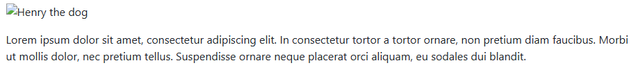
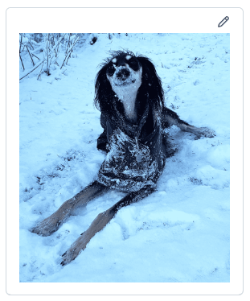
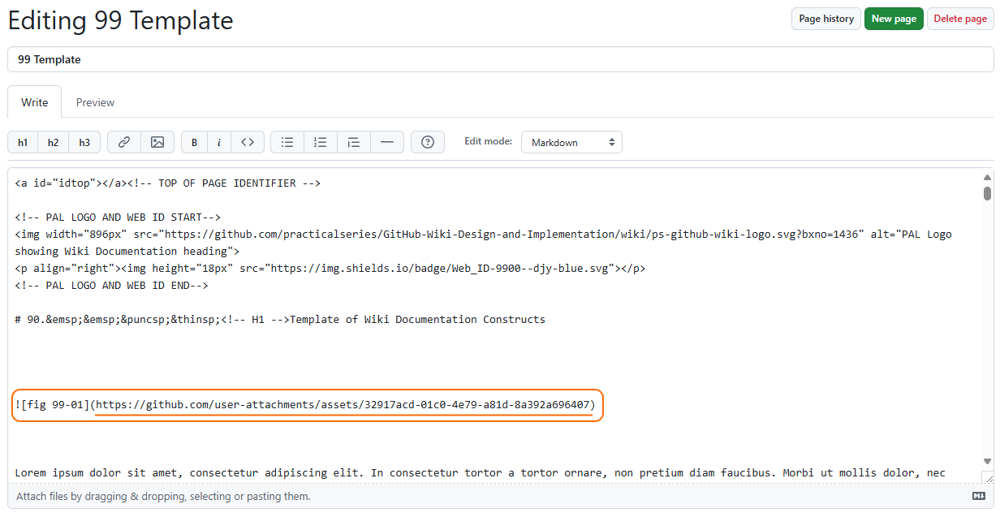
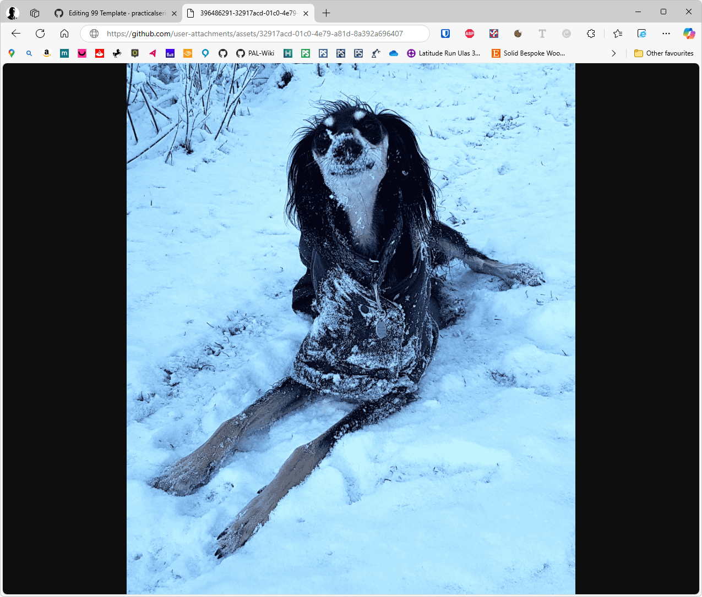

<a name="idtop"></a><!-- 🟢TOP OF PAGE - MARKER  (BLANK LINE BELOW)   -->

<!-- 🟢TOP OF PAGE - LOGO IMAGE -->
<p align="right"></p>      <!-- 🟢TOP OF PAGE - WEB ID     --> 

# 11<!--        🟥H1🟥-->Images

GitHub Markdown pages support the use of images, but do not support the use of video files (of any description) or audio files (of any description).

GitHub supports the following image file formats:

<table name="t-11-01" align="center"><!-- TABLE START🔽🔽(BLANK LINE ABOVE) -->
<!-- HEADER ROW --> <tr>
                        <th width="150" align="center">Image Type</th>
                        <th width="600" align="center">Meaning</th>
                    </tr>
<!-- DATA ROW -->   <tr>
                        <td align="center">GIF</td>
                        <td align="left">A very old and very limited image format (limited to 256 colours). GIFs are compressed, but lossless images</td>
                    </tr>
<!-- DATA ROW -->   <tr>
                        <td align="center">JPEG</td>
                        <td align="left">A compressed and lossy image format that give small image sizes. JPEGs do not support transparent backgrounds</td>
                    </tr>
<!-- DATA ROW -->   <tr>
                        <td align="center">BMP</td>
                        <td align="left">Another old image format. BMPs are uncompressed, lossless images that tend to be larger than other formats</td>
                    </tr>
<!-- DATA ROW -->   <tr>
                        <td align="center" height="61">PNG</td>
                        <td align="left">A compressed, but lossless image (intended as a replacement for BMPs and GIFs)</td>
                    </tr>
<!-- DATA ROW -->   <tr>
                        <td align="center">WEBP</td>
                        <td align="left">Similar to PNG but has better compression. It is a lossless format, but is not as well supported as the PNG format</td>
                    </tr>
<!-- DATA ROW -->   <tr>
                        <td align="center">SVG</td>
                        <td align="left">Scalar Vector Graphics. A vector graphic format that allows images to be scaled to any size without loss of resolution</td>
                    </tr>
<!-- CAPTION -->    <tr><th colspan="2" align="left"><sup>
<!-- CAPTION TEXT -->Table 11.1 &mdash; Supported image format types
                     </sup></th></tr>
</table>                             <!-- TABLE END  🔼🔼(BLANK LINE BELOW) -->

**Do not use `bmp` or `gif` formatted images (`bmp` files are superseded by `png` and `webp` types, `gifs` are too limited).**

`SVGs` tend to be for drawn or computer generated images (rather than photographs &c.).

The general rule for which image formats to use is:
<table name="l-11-01" align="center">   <!-- LIST START🔽🔽(BLANK LINE ABOVE) -->
<!-- LIST ROW 01  --><tr><td valign="top">&#x2776;<!-- 1  --></td>
    <td><!-- TEXT -->Use SVG where possible</td></tr>
<!-- LIST ROW 02  --><tr><td valign="top">&#x2777;<!-- 2  --></td>
    <td><!-- TEXT -->Use JPEGs for large images such as photographs</td></tr>
<!-- LIST ROW 03  --><tr><td valign="top">&#x2778;<!-- 3  --></td>
    <td><!-- TEXT -->Use PNGs or WEBPs for everything else</td></tr>
<!-- CAPTION -->          <tr><th width="52"></th><!-- SPACER -->
<!-- LIST WIDTH -->         <th align="left" width="500"><sup>
<!-- CAPTION TEXT --><!-- TEXT -->List 11.1 &mdash; Rules for image files
                           </sup></th></tr>
</table>                              <!-- LIST END    🔼🔼(BLANK LINE BELOW) -->

GitHub Markdown can be used to directly display images, but as with tables, HTML images have more flexibility (can be resized &c.) and you can do more with them.

GitHub Markdown also supports some built in mechanisms for creating diagrams and models:

<table name="l-11-02" align="center">   <!-- LIST START🔽🔽(BLANK LINE ABOVE) -->
<!-- LIST ROW 01  --><tr><td valign="top">&#x2776;&emsp;<strong>Mermaid diagrams</strong><!-- 1  --></td>
    <td><!-- TEXT -->A Markdown mechanism for producing various kinds of flow charts and organisational diagrams</td></tr>
<!-- LIST ROW 02  --><tr><td valign="top" height="61">&#x2777;&emsp;<strong>GeoJSON</strong><!-- 2  --></td>
    <td><!-- TEXT -->An interactive map for showing geographic points and areas</td></tr>
<!-- LIST ROW 03  --><tr><td valign="top">&#x2778;&emsp;<strong>TopoJSON</strong><!-- 3  --></td>
    <td><!-- TEXT -->An extended version of GeoJSON that is very difficult to understand</td></tr>
<!-- LIST ROW 04  --><tr><td valign="top" height="61">&#x2779;&emsp;<strong>ASCII STL</strong><!-- 4  --></td>
    <td><!-- TEXT -->Used to create interactive 3D models </td></tr>
<!-- CAPTION -->          <tr><th width="220"></th><!-- SPACER -->
<!-- LIST WIDTH -->         <th align="left" width="500"><sup>
<!-- CAPTION TEXT --><!-- TEXT -->List 11.2 &mdash; Built in diagrams
                           </sup></th></tr>
</table>                              <!-- LIST END    🔼🔼(BLANK LINE BELOW) -->

All of these are covered in the following sections.

**[:arrow_up: Top](#idtop)**<!-- END OF SECTION - LINK TO TOP🔽🔽(BLANK LINE ABOVE) -->
<HR>                        <!-- END OF SECTION - SEPARATING LINE                    -->
<br>                        <!-- END OF SECTION - PADDING    🔼🔼(BLANK LINE BELOW) -->

## 11.1<!--     🟥H2🟥-->Markdown images

It is fairly easy to insert an image directly into a Markdown page, it’s a bit like a link.

The Markdown to insert an image is:


<table name="t-11-01a" align="center"><!-- TABLE START🔽🔽(BLANK LINE ABOVE) -->
<tr><td width="850" height="60" valign="middle">

&emsp;&emsp;&nbsp;&nbsp; ${\LARGE \color{#0050C0}\text{!\[}\color{#C00000}\text{Alternative\ Text}\color{#0050C0}\text{\]\(}\color{#1F883D}\text{PathToImage}\color{#0050C0}\text{\ "}\color{#ED7D31}\text{ImageTitle}\color{#0050C0}\text{"\)}}$
</td></tr>
</table>                     <!-- TABLE END🔼🔼(BLANK LINE BELOW) -->

The ${\large \color{#ED7D31}\text{ImageTitle}}$ is optional, it is displayed if the mouse hovers over the image (like a tooltip in links). 

The ${\large \color{#C00000}\text{Alternative\ Text}}$ is only displayed if the image file cannot be found (it is also used by specialist screen readers, *it’s bad form not to include it)*.

The following is the Markdown to display the image of Henry (first seen in <a href="09.05-links#f-09-06">section&nbsp;9.6.2</a>):

<table name="t-11-02" align="center"><!-- 🔴🟢🔵TABLE START🔽🔽(BLANK LINE ABOVE) -->
<!-- TOP & WIDTH --><tr><th width="850" align="right"><sup>Markdown
                    </sup></th></tr>
<!-- Header row --> <tr>
                        <th align="left">${\large \color{#0050C0}\text{M\ A\ R\ K\ D\ O\ W\ N}}$ 🔽</th>
                    </tr>
<!-- MD row -->     <tr><td align="left"><br><!-- 🔴MARKDOWN BELOW🔴 -->

```md

```
<p> </p></td></tr><!-- 🔴MARKDOWN END OF ROW🔴 -->
<!-- CAPTION -->    <tr><th align="left"><sup>
<!-- CAPTION TEXT -->Table 11.2 &mdash; Markdown image
                    </sup></th></tr>
</table>                             <!-- 🟥🟩🟦TABLE END  🔼🔼(BLANK LINE BELOW) -->


If for whatever reason, the image file cannot be found (missing file, incorrect path &c.), GitHub will display the alternative text as follows:

<table name="f-11-01" align="center"><!-- FIGURE START🔽🔽(BLANK LINE ABOVE) -->
<!-- Figure row --> <tr><td>
<!-- LINK -->         <a href="../11-0000/02-images/figm-11-01.png" title="Use ctrl+click to open image in new tab">
<!-- FIGURE -->         
                    </a></td></tr>
<!-- CAPTION -->    <tr><th align="center"><sup>
<!-- CAPTION TEXT -->   Figure 11.1 &mdash; Markdown image broken link
                    </sup></th></tr>
</table>                             <!-- FIGURE END  🔼🔼(BLANK LINE BELOW) -->

It shows a broken image icon followed by the alternative text.

**[:arrow_up: Top](#idtop)**<!-- END OF SECTION - LINK TO TOP🔽🔽(BLANK LINE ABOVE) -->
<HR>                        <!-- END OF SECTION - SEPARATING LINE                    -->
<br>                        <!-- END OF SECTION - PADDING    🔼🔼(BLANK LINE BELOW) -->

### 11.1.1<!--  🟥H3🟥-->Image size in Markdown

Image sizes when displayed using direct Markdown, are either always the full width of the screen area (i.e. full width of the main body text area, or if displayed in a footer or sidebar, the full width of those areas), or, the natural width of the image, whichever is smaller. The following shows an image as it would appear in the sidebar:

<table name="f-11-02" align="center"><!-- FIGURE START🔽🔽(BLANK LINE ABOVE) -->
<!-- Figure row --> <tr><td>
<!-- LINK -->         <a href="../11-0000/02-images/figm-11-02.png" title="Use ctrl+click to open image in new tab">
<!-- FIGURE -->         
                    </a></td></tr>
<!-- CAPTION -->    <tr><th align="center"><sup>
<!-- CAPTION TEXT -->   Figure 11.2 &mdash; Image in a sidebar
                    </sup></th></tr>
</table>                             <!-- FIGURE END  🔼🔼(BLANK LINE BELOW) -->

It is only possible to change the image width by using HTML.

**[:arrow_up: Top](#idtop)**<!-- END OF SECTION - LINK TO TOP🔽🔽(BLANK LINE ABOVE) -->
<HR>                        <!-- END OF SECTION - SEPARATING LINE                    -->
<br>                        <!-- END OF SECTION - PADDING    🔼🔼(BLANK LINE BELOW) -->

### 11.1.2<!--  🟥H3🟥-->Making the image a link

It is possible in Markdown to make an image a clickable link (i.e. if you click the link it takes you to another page or website).

To make the image a link, surround it with brackets and then in parenthesis add the URL for the link (and any tooltip title):

<table name="t-11-02a" align="center"><!-- TABLE START🔽🔽(BLANK LINE ABOVE) -->
<tr><td width="850" height="60" valign="middle">

&emsp;&emsp;&nbsp;&nbsp; ${\LARGE \color{#0050C0}\text{\[!\[}\color{#C00000}\text{Alternative\ Text}\color{#0050C0}\text{\]\(}\color{#1F883D}\text{PathToImage}\color{#0050C0}\text{\ "}\color{#ED7D31}\text{ImageTitle}\color{#0050C0}\text{"\)\]\(}\color{#1F883D}\text{LinkURL}\color{#0050C0}\text{\ "}\color{#ED7D31}\text{LinkToolTip}\color{#0050C0}\text{"\)}}$
</td></tr>
</table>                     <!-- TABLE END🔼🔼(BLANK LINE BELOW) -->

To make the Henry picture a link to the PracticalSeries home page it would become:

<table name="t-11-03" align="center"><!-- 🔴🟢🔵TABLE START🔽🔽(BLANK LINE ABOVE) -->
<!-- TOP & WIDTH --><tr><th width="850" align="right"><sup>Markdown
                    </sup></th></tr>
<!-- Header row --> <tr>
                        <th align="left">${\large \color{#0050C0}\text{M\ A\ R\ K\ D\ O\ W\ N}}$ 🔽</th>
                    </tr>
<!-- MD row -->     <tr><td align="left"><br><!-- 🔴MARKDOWN BELOW🔴 -->

```md
[](https://practicalseries.com "PracticalSeries")
```
<p> </p></td></tr><!-- 🔴MARKDOWN END OF ROW🔴 -->
<!-- CAPTION -->    <tr><th align="left"><sup>
<!-- CAPTION TEXT -->Table 11.3 &mdash; Markdown image
                    </sup></th></tr>
</table>                             <!-- 🟥🟩🟦TABLE END  🔼🔼(BLANK LINE BELOW) -->

If two tooltips are used, one for the image (${\large \color{#ED7D31}\text{ImageTitle}}$) and one for the link (${\large \color{#ED7D31}\text{LinkToolTip}}$), the image takes priority.

**[:arrow_up: Top](#idtop)**<!-- END OF SECTION - LINK TO TOP🔽🔽(BLANK LINE ABOVE) -->
<HR>                        <!-- END OF SECTION - SEPARATING LINE                    -->
<br>                        <!-- END OF SECTION - PADDING    🔼🔼(BLANK LINE BELOW) -->

### 11.1.3<!--  🟥H3🟥-->Drag and drop image link

When constructing a page using the GitHub editor (via a browser), it is possible to drag and drop an image from your computer directly into the edit window.

In GitHub select the page you want to put the image in and select ${\large \color{#00B050}\langle\text{edit}\rangle}$, top-right.

Now using Windows file explorer navigate to the image you wish to put on the Wiki page and drag it from explorer into the edit window where you want it to appear:

<table name="f-11-03" align="center"><!-- FIGURE START🔽🔽(BLANK LINE ABOVE) -->
<!-- Figure row --> <tr><td>
<!-- LINK -->         <a href="../11-0000/02-images/figm-11-03.png" title="Use ctrl+click to open image in new tab">
<!-- FIGURE -->         
                    </a></td></tr>
<!-- CAPTION -->    <tr><th align="center"><sup>
<!-- CAPTION TEXT -->   Figure 11.3 &mdash; Drag and drop an image into a Wiki page
                    </sup></th></tr>
</table>                             <!-- FIGURE END  🔼🔼(BLANK LINE BELOW) -->

When you release the mouse, the link will be automatically created, *it’s a bit odd:*

<table name="f-11-04" align="center"><!-- FIGURE START🔽🔽(BLANK LINE ABOVE) -->
<!-- Figure row --> <tr><td>
<!-- LINK -->         <a href="../11-0000/02-images/figm-11-04.png" title="Use ctrl+click to open image in new tab">
<!-- FIGURE -->         
                    </a></td></tr>
<!-- CAPTION -->    <tr><th align="center"><sup>
<!-- CAPTION TEXT -->   Figure 11.3 &mdash; Drag and drop image created by GitHub
                    </sup></th></tr>
</table>                             <!-- FIGURE END  🔼🔼(BLANK LINE BELOW) -->

GitHub has done something funny with the image, look at the Markdown:

<table name="t-11-03a" align="center"><!-- 🔴🟢🔵TABLE START🔽🔽(BLANK LINE ABOVE) -->
<!-- TOP & WIDTH --><tr><th width="850" align="right"><sup>Markdown
                    </sup></th></tr>
<!-- Header row --> <tr>
                        <th align="left">${\large \color{#0050C0}\text{M\ A\ R\ K\ D\ O\ W\ N}}$ 🔽</th>
                    </tr>
<!-- MD row -->     <tr><td align="left"><br><!-- 🔴MARKDOWN BELOW🔴 -->

```md

```
<p> </p></td></tr><!-- 🔴MARKDOWN END OF ROW🔴 -->
</table>                             <!-- 🟥🟩🟦TABLE END  🔼🔼(BLANK LINE BELOW) -->

The ${\LARGE \color{#C00000}\text{Alternative\ Text}}$ is just the file name (without extension) of the file dragged into the edit window. 

The link:

&emsp;&emsp;&emsp;<!---🟡ENTER URL🟡-->`https://github.com/user-attachments/assets/32917acd-01c0-4e79-a81d-8a392a696407`

is something that GitHub has generated, it has taken the image that was dragged into the edit window and stored it on its own server at the address:

&emsp;&emsp;&emsp;<!---🟡ENTER URL🟡-->`https://github.com/user-attachments/assets/`

Next, it’s given the image its own unique identifier:

&emsp;&emsp;&emsp;<!---🟡ENTER URL🟡-->`32917acd-01c0-4e79-a81d-8a392a696407`

If you paste the link above into a browser, you will get the picture of Henry:


<table name="f-11-05" align="center"><!-- FIGURE START🔽🔽(BLANK LINE ABOVE) -->
<!-- Figure row --> <tr><td>
<!-- LINK -->         <a href="../11-0000/02-images/figm-11-05.png" title="Use ctrl+click to open image in new tab">
<!-- FIGURE -->         
                    </a></td></tr>
<!-- CAPTION -->    <tr><th align="center"><sup>
<!-- CAPTION TEXT -->   Figure 11.5 &mdash; The uploaded image
                    </sup></th></tr>
</table>                             <!-- FIGURE END  🔼🔼(BLANK LINE BELOW) -->

The unique identifier is, I think, some form of SHA key, just like a commit.

This is all fine, *but it is also peculiar*; GitHub has uploaded the image that was dropped into the file, but instead of storing it in the Wiki repository (or even the main repository), it has stored it in a directory that has nothing to do with the Wiki, the repository or even the user. 

GitHub has stored the image in a directory of its own that neither you, nor I, nor anyone else has control over *(except presumably GitHub).*

It also means that anyone who uploads an image to GitHub has their image stored in the same directory, but with a different identifier. They’re all in the same place.

I don’t particularly have a problem with this, except: ***how do you ever delete the image if you don’t want it anymore?***

If I delete the image link from the Wiki page and resave the page, the link above still works, the image is still in that `https://github.com/user-attachments/assets/` directory.

${\large \color{#B00000}\text{It’s\ odd.}}$

**[:arrow_up: Top](#idtop)**<!-- END OF SECTION - LINK TO TOP🔽🔽(BLANK LINE ABOVE) -->
<HR>                        <!-- END OF SECTION - SEPARATING LINE                    -->
<br>                        <!-- END OF SECTION - PADDING    🔼🔼(BLANK LINE BELOW) -->

#### <!--       🟥H4🟥--><u>A note by the Author<!-- Extended line -->&emsp;&emsp;&emsp;&emsp;&emsp;</u> 

I said above that I don’t have a problem with this arrangement, but the more I think about it, the more I do have a problem, *several in fact:*


<table name="l-11-03" align="center">   <!-- LIST START🔽🔽(BLANK LINE ABOVE) -->
<!-- LIST ROW 01  --><tr><td valign="top">&#x2776;<!-- 1  --></td>
    <td><!-- TEXT -->If I can’t delete any image, how do I control it?</td></tr>
<!-- LIST ROW 02  --><tr><td valign="top">&#x2777;<!-- 2  --></td>
    <td><!-- TEXT -->Who has access to the image?</td></tr>
<!-- LIST ROW 03  --><tr><td valign="top">&#x2778;<!-- 3  --></td>
    <td><!-- TEXT -->What is the copyright status of the image? <em>I mean that’s a pretty cute picture of Henry, I’m sure some marketing person would like it.</em></td></tr>
<!-- LIST ROW 04  --><tr><td valign="top">&#x2779;<!-- 4  --></td>
    <td><!-- TEXT -->Does the link ever expire?</td></tr>
<!-- CAPTION -->          <tr><th width="52"></th><!-- SPACER -->
<!-- LIST WIDTH -->         <th align="left" width="798"><sup>
<!-- CAPTION TEXT --><!-- TEXT -->List 11.3 &mdash; Problems with the drag and drop image
                           </sup></th></tr>
</table>                              <!-- LIST END    🔼🔼(BLANK LINE BELOW) -->

I’ve done a bit of digging and I can sort of answer some of these questions:

**Point &#x2776;**: The only way to delete the image is to delete the repository, GitHub will then remove the *“assets”* associated with the repository (including the Wiki files) as part of its cleanup process. It will however, take quite some time to do this *(it is not instantaneous, think weeks rather than hours).*

**Point &#x2777;**: Anyone who knows the link has access to the file.

**Point &#x2778;**: Technically, the image is available under the licence terms of the repository *(I suppose)*, however, if all you have is the link, there is no way to identify the parent repository and see what the licence terms are. So the long and short of it is: *I don’t know.*

**Point &#x2779;**: The link only expires if the associated repository is deleted *(or possibly if some sort of abuse is reported)*.

*Talking of abuse*, it strikes me that this whole drag and drop thing can be abused. GitHub imposes size limits on a repository (5 GB and preferably less than 1 GB) and on individual files (50 MB). It does not, however, impose size limits on files that can be dragged and dropped in this fashion.

Similarly, GitHub does not particularly care what type of files are dragged and dropped. If you drag and drop a Word file, it just uploads the file, creates a link to it and stores it in the `https://github.com/user-attachments/` area.

> [!NOTE]<!-- NOTE ALERT -->
> *Some files (zip, docx, pdf &c.) are stored in a slightly different area:* `https://github.com/user-attachments/files/` *(files instead of assets). I’m not sure what differentiates the file types.*
> 
> ***So, if I were of a mischievous nature, what would be to stop me loading huge document files into this area by dragging and dropping them into a Markdown file, I would get around the size limits imposed on a repository and on individual files.***
> 
> *A question for GitHub perhaps?*

**[:arrow_up: Top](#idtop)**<!-- END OF SECTION - LINK TO TOP🔽🔽(BLANK LINE ABOVE) -->
<HR>                        <!-- END OF SECTION - SEPARATING LINE                    -->
<br>                        <!-- END OF SECTION - PADDING    🔼🔼(BLANK LINE BELOW) -->

## 11.2<!--     🟥H2🟥-->HTML images

Like tables, HTML offers a lot more formatting options when used for images.

It is fair to say that HTML is the mechanism of choice when displaying images within Markdown pages.

### 11.2.1<!--  🟥H3🟥-->A basic HTML image

Within HTML, images are defined with the `` element (this tag has no closing `</img>`). It is in this form:

<table name="t-11-03b" align="center"><!-- TABLE START🔽🔽(BLANK LINE ABOVE) -->
<tr><td width="850" height="60" valign="middle">

&emsp;&emsp;&nbsp;&nbsp; ${\LARGE \color{#0050C0}\text{\}}$
</td></tr>
</table>                     <!-- TABLE END🔼🔼(BLANK LINE BELOW) -->

The ${\LARGE \color{#0050C0}\text{title="}\color{#ED7D31}\text{ImageTitle}\color{#0050C0}\text{"}}$ is optional, it is displayed if the mouse hovers over the image (like a tooltip in links). 

As before, the ${\LARGE \color{#C00000}\text{Alternative\ Text}}$ is only displayed if the image file cannot be found.
The following is the HTML to display the image of Henry *(lots more pictures of Henry):*

<table name="t-11-04" align="center"><!-- 🔴🟢🔵TABLE START🔽🔽(BLANK LINE ABOVE) -->
<!-- TOP & WIDTH --><tr><th width="850" align="right"><sup>HTML and GitHub output
                    </sup></th></tr>
<!-- Header row --> <tr><th align="left">${\large \color{#00C050}\text{H\ T\ M\ L}}$ 🔽</th></tr>
<!-- HTML row -->   <tr><td align="left"><br><!-- 🟢HTML BELOW🟢 -->

```html

```
<p> </p></td></tr><!-- 🟢HTML END OF ROW🟢 -->
<!-- Header row --> <tr><th align="left">${\large \color{#B00000}\text{G\ I\ T\ H\ U\ B}\space\ \space\text{O\ U\ T\ P\ U\ T}}$ 🔽</th></tr>
<!-- GIT row -->    <tr><td align="left" valign="top"><!-- 🔵GITHUB OUTPUT BELOW (BLANK LINE BELOW)🔵 -->


</td></tr><!-- 🔵GITHUB OUTPUT END (BLANK LINE ABOVE)🔵 -->
<!-- CAPTION -->    <tr><th align="left"><sup>
<!-- CAPTION TEXT -->Table 11.4 &mdash; HTML for a basic image
</table>                             <!-- 🟥🟩🟦TABLE END  🔼🔼(BLANK LINE BELOW) -->

If for whatever reason, the image file cannot be found (missing file, incorrect path &c.), GitHub will display the alternative text as follows:

<table name="f-11-06" align="center"><!-- FIGURE START🔽🔽(BLANK LINE ABOVE) -->
<!-- Figure row --> <tr><td>
<!-- LINK -->         <a href="../11-0000/02-images/figm-11-01.png" title="Use ctrl+click to open image in new tab">
<!-- FIGURE -->         
                    </a></td></tr>
<!-- CAPTION -->    <tr><th align="center"><sup>
<!-- CAPTION TEXT -->   Figure 11.6 &mdash; HTML Broken link
                    </sup></th></tr>
</table>                             <!-- FIGURE END  🔼🔼(BLANK LINE BELOW) -->

It shows a broken image icon followed by the alternative text *(just like Markdown)*.

**[:arrow_up: Top](#idtop)**<!-- END OF SECTION - LINK TO TOP🔽🔽(BLANK LINE ABOVE) -->
<HR>                        <!-- END OF SECTION - SEPARATING LINE                    -->
<br>                        <!-- END OF SECTION - PADDING    🔼🔼(BLANK LINE BELOW) -->

### 11.2.2<!--  🟥H3🟥-->Image size in HTML

HTML allows images to be resized (in pixels) using the ${\large \color{#00B050}\text{width}}$ or ${\large \color{#00B050}\text{height}}$ attributes (similar to cells in a table, see <a href="10-tables#1024setting-the-width-of-a-table-column">section&nbsp;10.2.4</a> and <a href="10-tables#1025setting-the-height-of-a-table-row">section&nbsp;10.2.5</a>).

The following reduces the Henry image to 300 px wide:

<table name="t-11-05" align="center"><!-- 🔴🟢🔵TABLE START🔽🔽(BLANK LINE ABOVE) -->
<!-- TOP & WIDTH --><tr><th width="850" align="right"><sup>HTML and GitHub output
                    </sup></th></tr>
<!-- Header row --> <tr><th align="left">${\large \color{#00C050}\text{H\ T\ M\ L}}$ 🔽</th></tr>
<!-- HTML row -->   <tr><td align="left"><br><!-- 🟢HTML BELOW🟢 -->

```html

```
<p> </p></td></tr><!-- 🟢HTML END OF ROW🟢 -->
<!-- Header row --> <tr><th align="left">${\large \color{#B00000}\text{G\ I\ T\ H\ U\ B}\space\ \space\text{O\ U\ T\ P\ U\ T}}$ 🔽</th></tr>
<!-- GIT row -->    <tr><td align="left" valign="top"><!-- 🔵GITHUB OUTPUT BELOW (BLANK LINE BELOW)🔵 -->


</td></tr><!-- 🔵GITHUB OUTPUT END (BLANK LINE ABOVE)🔵 -->
<!-- CAPTION -->    <tr><th align="left"><sup>
<!-- CAPTION TEXT -->Table 11.5 &mdash; Resized width image
</table>                             <!-- 🟥🟩🟦TABLE END  🔼🔼(BLANK LINE BELOW) -->

The height attribute is used in the same way, the following sets the image height to 300 px:

<table name="t-11-06" align="center"><!-- 🔴🟢🔵TABLE START🔽🔽(BLANK LINE ABOVE) -->
<!-- TOP & WIDTH --><tr><th width="850" align="right"><sup>HTML and GitHub output
                    </sup></th></tr>
<!-- Header row --> <tr><th align="left">${\large \color{#00C050}\text{H\ T\ M\ L}}$ 🔽</th></tr>
<!-- HTML row -->   <tr><td align="left"><br><!-- 🟢HTML BELOW🟢 -->

```html

```
<p> </p></td></tr><!-- 🟢HTML END OF ROW🟢 -->
<!-- Header row --> <tr><th align="left">${\large \color{#B00000}\text{G\ I\ T\ H\ U\ B}\space\ \space\text{O\ U\ T\ P\ U\ T}}$ 🔽</th></tr>
<!-- GIT row -->    <tr><td align="left" valign="top"><!-- 🔵GITHUB OUTPUT BELOW (BLANK LINE BELOW)🔵 -->


</td></tr><!-- 🔵GITHUB OUTPUT END (BLANK LINE ABOVE)🔵 -->
<!-- CAPTION -->    <tr><th align="left"><sup>
<!-- CAPTION TEXT -->Table 11.6 &mdash; Resized height image
</table>                             <!-- 🟥🟩🟦TABLE END  🔼🔼(BLANK LINE BELOW) -->

If both the width and height attributes are used, the image can be distorted (this sets the width to 300 pixels and height to 200 pixels):

<table name="t-11-07" align="center"><!-- 🔴🟢🔵TABLE START🔽🔽(BLANK LINE ABOVE) -->
<!-- TOP & WIDTH --><tr><th width="850" align="right"><sup>HTML and GitHub output
                    </sup></th></tr>
<!-- Header row --> <tr><th align="left">${\large \color{#00C050}\text{H\ T\ M\ L}}$ 🔽</th></tr>
<!-- HTML row -->   <tr><td align="left"><br><!-- 🟢HTML BELOW🟢 -->

```html

```
<p> </p></td></tr><!-- 🟢HTML END OF ROW🟢 -->
<!-- Header row --> <tr><th align="left">${\large \color{#B00000}\text{G\ I\ T\ H\ U\ B}\space\ \space\text{O\ U\ T\ P\ U\ T}}$ 🔽</th></tr>
<!-- GIT row -->    <tr><td align="left" valign="top"><!-- 🔵GITHUB OUTPUT BELOW (BLANK LINE BELOW)🔵 -->


</td></tr><!-- 🔵GITHUB OUTPUT END (BLANK LINE ABOVE)🔵 -->
<!-- CAPTION -->    <tr><th align="left"><sup>
<!-- CAPTION TEXT -->Table 11.7 &mdash; Resized width and height image
</table>                             <!-- 🟥🟩🟦TABLE END  🔼🔼(BLANK LINE BELOW) -->

**Poor old Henry.**

In all cases the image is left-aligned on the screen.

> [!NOTE]<!-- NOTE ALERT -->
> *If the width is set to a value that exceeds the width of the screen, the width will be limited to the width of the screen.*

**[:arrow_up: Top](#idtop)**<!-- END OF SECTION - LINK TO TOP🔽🔽(BLANK LINE ABOVE) -->
<HR>                        <!-- END OF SECTION - SEPARATING LINE                    -->
<br>                        <!-- END OF SECTION - PADDING    🔼🔼(BLANK LINE BELOW) -->

### 11.2.3<!--  🟥H3🟥-->Horizontal alignment

Like tables, HTML images can be left or right aligned on a page by using the ${\large \color{#00B050}\text{align}}$ attribute (note there is no centre alignment).

Left alignment first:

<table name="t-11-08" align="center"><!-- 🔴🟢🔵TABLE START🔽🔽(BLANK LINE ABOVE) -->
<!-- TOP & WIDTH --><tr><th width="850" align="right"><sup>HTML and GitHub output
                    </sup></th></tr>
<!-- Header row --> <tr><th align="left">${\large \color{#00C050}\text{H\ T\ M\ L}}$ 🔽</th></tr>
<!-- HTML row -->   <tr><td align="left"><br><!-- 🟢HTML BELOW🟢 -->

```html


<p>Lorem ipsum dolor sit amet, consectetur adipiscing elit. In consectetur tortor 
a tortor ornare, non pretium diam faucibus. Morbi ut mollis.</p>
```
<p> </p></td></tr><!-- 🟢HTML END OF ROW🟢 -->
<!-- Header row --> <tr><th align="left">${\large \color{#B00000}\text{G\ I\ T\ H\ U\ B}\space\ \space\text{O\ U\ T\ P\ U\ T}}$ 🔽</th></tr>
<!-- GIT row -->    <tr><td align="left" valign="top"><!-- 🔵GITHUB OUTPUT BELOW (BLANK LINE BELOW)🔵 -->


<p>Lorem ipsum dolor sit amet, consectetur adipiscing elit. In consectetur tortor 
a tortor ornare, non pretium diam faucibus. Morbi ut mollis.</p>

</td></tr><!-- 🔵GITHUB OUTPUT END (BLANK LINE ABOVE)🔵 -->
<!-- CAPTION -->    <tr><th align="left"><sup>
<!-- CAPTION TEXT -->Table 11.8 &mdash; left aligned image
</table>                             <!-- 🟥🟩🟦TABLE END  🔼🔼(BLANK LINE BELOW) -->


Now right alignment

<table name="t-11-08" align="center"><!-- 🔴🟢🔵TABLE START🔽🔽(BLANK LINE ABOVE) -->
<!-- TOP & WIDTH --><tr><th width="850" align="right"><sup>HTML and GitHub output
                    </sup></th></tr>
<!-- Header row --> <tr><th align="left">${\large \color{#00C050}\text{H\ T\ M\ L}}$ 🔽</th></tr>
<!-- HTML row -->   <tr><td align="left"><br><!-- 🟢HTML BELOW🟢 -->

```html


<p>Lorem ipsum dolor sit amet, consectetur adipiscing elit. In consectetur tortor 
a tortor ornare, non pretium diam faucibus. Morbi ut mollis.</p>
```
<p> </p></td></tr><!-- 🟢HTML END OF ROW🟢 -->
<!-- Header row --> <tr><th align="left">${\large \color{#B00000}\text{G\ I\ T\ H\ U\ B}\space\ \space\text{O\ U\ T\ P\ U\ T}}$ 🔽</th></tr>
<!-- GIT row -->    <tr><td align="left" valign="top"><!-- 🔵GITHUB OUTPUT BELOW (BLANK LINE BELOW)🔵 -->


<p>Lorem ipsum dolor sit amet, consectetur adipiscing elit. In consectetur tortor 
a tortor ornare, non pretium diam faucibus. Morbi ut mollis.</p>

</td></tr><!-- 🔵GITHUB OUTPUT END (BLANK LINE ABOVE)🔵 -->
<!-- CAPTION -->    <tr><th align="left"><sup>
<!-- CAPTION TEXT -->Table 11.8 &mdash; right aligned image
</table>                             <!-- 🟥🟩🟦TABLE END  🔼🔼(BLANK LINE BELOW) -->

> [!NOTE]<!-- NOTE ALERT -->
> *If the `align` attribute is not used, the text will not wrap, it will appear below the image.*

This leads to the text wrapping problem we came across with tables (see <a href="10-tables#1023text-wrap-and-side-by-side-tables">section&nbsp;10.2.3</a>). With images we have an additional option to solve the problem.

The first solution is to use the ${\LARGE \color{#C00000}\text{<br\ clear="all">}}$ tag after the image (this is just like the solution for tables <a href="10-tables#how-to-stop-text-wrapping">see here</a>):

<table name="t-11-10" align="center"><!-- 🔴🟢🔵TABLE START🔽🔽(BLANK LINE ABOVE) -->
<!-- TOP & WIDTH --><tr><th width="850" align="right"><sup>HTML and GitHub output
                    </sup></th></tr>
<!-- Header row --> <tr><th align="left">${\large \color{#00C050}\text{H\ T\ M\ L}}$ 🔽</th></tr>
<!-- HTML row -->   <tr><td align="left"><br><!-- 🟢HTML BELOW🟢 -->

```html

<br clear="all">

<p>Lorem ipsum dolor sit amet, consectetur adipiscing elit. In consectetur tortor 
a tortor ornare, non pretium diam faucibus. Morbi ut mollis.</p>
```
<p> </p></td></tr><!-- 🟢HTML END OF ROW🟢 -->
<!-- Header row --> <tr><th align="left">${\large \color{#B00000}\text{G\ I\ T\ H\ U\ B}\space\ \space\text{O\ U\ T\ P\ U\ T}}$ 🔽</th></tr>
<!-- GIT row -->    <tr><td align="left" valign="top"><!-- 🔵GITHUB OUTPUT BELOW (BLANK LINE BELOW)🔵 -->


<br clear="all">

<p>Lorem ipsum dolor sit amet, consectetur adipiscing elit. In consectetur tortor 
a tortor ornare, non pretium diam faucibus. Morbi ut mollis.</p>

</td></tr><!-- 🔵GITHUB OUTPUT END (BLANK LINE ABOVE)🔵 -->
<!-- CAPTION -->    <tr><th align="left"><sup>
<!-- CAPTION TEXT -->Table 11.10 &mdash; Right aligned image without text wrap
</table>                             <!-- 🟥🟩🟦TABLE END  🔼🔼(BLANK LINE BELOW) -->

HTML also offers another solution, instead of using the align attribute within the image tag, surround the image tag with a `<p>` paragraph tag and use the align attribute within the paragraph tag instead:
 
<table name="t-11-11" align="center"><!-- 🔴🟢🔵TABLE START🔽🔽(BLANK LINE ABOVE) -->
<!-- TOP & WIDTH --><tr><th width="850" align="right"><sup>HTML and GitHub output
                    </sup></th></tr>
<!-- Header row --> <tr><th align="left">${\large \color{#00C050}\text{H\ T\ M\ L}}$ 🔽</th></tr>
<!-- HTML row -->   <tr><td align="left"><br><!-- 🟢HTML BELOW🟢 -->

```html
<p align="right"> 
<br clear="all"></p>

<p>Lorem ipsum dolor sit amet, consectetur adipiscing elit. In consectetur tortor 
a tortor ornare, non pretium diam faucibus. Morbi ut mollis.</p>
```
<p> </p></td></tr><!-- 🟢HTML END OF ROW🟢 -->
<!-- Header row --> <tr><th align="left">${\large \color{#B00000}\text{G\ I\ T\ H\ U\ B}\space\ \space\text{O\ U\ T\ P\ U\ T}}$ 🔽</th></tr>
<!-- GIT row -->    <tr><td align="left" valign="top"><!-- 🔵GITHUB OUTPUT BELOW (BLANK LINE BELOW)🔵 -->

<p align="right"> 
<br clear="all"></p>

<p>Lorem ipsum dolor sit amet, consectetur adipiscing elit. In consectetur tortor 
a tortor ornare, non pretium diam faucibus. Morbi ut mollis.</p>

</td></tr><!-- 🔵GITHUB OUTPUT END (BLANK LINE ABOVE)🔵 -->
<!-- CAPTION -->    <tr><th align="left"><sup>
<!-- CAPTION TEXT -->Table 11.11 &mdash; Right aligned image using paragraphs
</table>                             <!-- 🟥🟩🟦TABLE END  🔼🔼(BLANK LINE BELOW) -->

The difference here is that using the paragraph arrangement, there is proper line spacing between the image and the following paragraph.

> [!NOTE]<!-- NOTE ALERT -->
> *This paragraph arrangement does not work for tables (surrounding a table with a paragraph does nothing to the table).*

The paragraph arrangement allows the image to be centred (which is not possible when using the `align` attribute directly with the `` tag):

<table name="t-11-12" align="center"><!-- 🔴🟢🔵TABLE START🔽🔽(BLANK LINE ABOVE) -->
<!-- TOP & WIDTH --><tr><th width="850" align="right"><sup>HTML and GitHub output
                    </sup></th></tr>
<!-- Header row --> <tr><th align="left">${\large \color{#00C050}\text{H\ T\ M\ L}}$ 🔽</th></tr>
<!-- HTML row -->   <tr><td align="left"><br><!-- 🟢HTML BELOW🟢 -->

```html
<p align="center"> 
<br clear="all"></p>

<p>Lorem ipsum dolor sit amet, consectetur adipiscing elit. In consectetur tortor 
a tortor ornare, non pretium diam faucibus. Morbi ut mollis.</p>
```
<p> </p></td></tr><!-- 🟢HTML END OF ROW🟢 -->
<!-- Header row --> <tr><th align="left">${\large \color{#B00000}\text{G\ I\ T\ H\ U\ B}\space\ \space\text{O\ U\ T\ P\ U\ T}}$ 🔽</th></tr>
<!-- GIT row -->    <tr><td align="left" valign="top"><!-- 🔵GITHUB OUTPUT BELOW (BLANK LINE BELOW)🔵 -->

<p align="center"> 
<br clear="all"></p>

<p>Lorem ipsum dolor sit amet, consectetur adipiscing elit. In consectetur tortor 
a tortor ornare, non pretium diam faucibus. Morbi ut mollis.</p>

</td></tr><!-- 🔵GITHUB OUTPUT END (BLANK LINE ABOVE)🔵 -->
<!-- CAPTION -->    <tr><th align="left"><sup>
<!-- CAPTION TEXT -->Table 11.12 &mdash; Centre aligned image using paragraphs
</table>                             <!-- 🟥🟩🟦TABLE END  🔼🔼(BLANK LINE BELOW) -->

*There is a third option for controlling image alignment and that is to use a table, this is discussed in <a href="#1125using-a-table-to-contain-an-image">section&nbsp;11.2.5</a>  and <a href="16.05-PracticalSeries-Wiki-conventions#1654images">section&nbsp;16.5.4</a>.*

**[:arrow_up: Top](#idtop)**<!-- END OF SECTION - LINK TO TOP🔽🔽(BLANK LINE ABOVE) -->
<HR>                        <!-- END OF SECTION - SEPARATING LINE                    -->
<br>                        <!-- END OF SECTION - PADDING    🔼🔼(BLANK LINE BELOW) -->

### 11.2.4<!--  🟥H3🟥-->Making the image a link

As with Markdown, it is possible to make an image a clickable link (i.e. if you click the link it takes you to another page or website) in HTML too.

To make the image a link, use the anchor `<a>` tag around the image:

<table name="t-11-13" align="center"><!-- 🔴🟢🔵TABLE START🔽🔽(BLANK LINE ABOVE) -->
<!-- TOP & WIDTH --><tr><th width="850" align="right"><sup>HTML
                    </sup></th></tr>
<!-- Header row --> <tr><th align="left">${\large \color{#00C050}\text{H\ T\ M\ L}}$ 🔽</th></tr>
<!-- HTML row -->   <tr><td align="left"><br><!-- 🟢HTML BELOW🟢 -->

```html
<a href="LinkURL" title="ImageTitle"></a>
```
<p> </p></td></tr><!-- 🟢HTML END OF ROW🟢 -->
<!-- CAPTION -->    <tr><th align="left"><sup>
<!-- CAPTION TEXT -->Table 11.13 &mdash; Image with a link
</table>                             <!-- 🟥🟩🟦TABLE END  🔼🔼(BLANK LINE BELOW) -->

To make the Henry picture a link to the PracticalSeries home page it would become:

<table name="t-11-14" align="center"><!-- 🔴🟢🔵TABLE START🔽🔽(BLANK LINE ABOVE) -->
<!-- TOP & WIDTH --><tr><th width="850" align="right"><sup>HTML
                    </sup></th></tr>
<!-- Header row --> <tr><th align="left">${\large \color{#00C050}\text{H\ T\ M\ L}}$ 🔽</th></tr>
<!-- HTML row -->   <tr><td align="left"><br><!-- 🟢HTML BELOW🟢 -->

```html
<a href="https://practicalseries.com" title="PracticalSeries"></a>
```
<p> </p></td></tr><!-- 🟢HTML END OF ROW🟢 -->
<!-- Header row --> <tr><th align="left">${\large \color{#B00000}\text{G\ I\ T\ H\ U\ B}\space\ \space\text{O\ U\ T\ P\ U\ T}}$ 🔽</th></tr>
<!-- GIT row -->    <tr><td align="left" valign="top"><!-- 🔵GITHUB OUTPUT BELOW (BLANK LINE BELOW)🔵 -->

<a href="https://practicalseries.com" title="PracticalSeries"></a>

</td></tr><!-- 🔵GITHUB OUTPUT END (BLANK LINE ABOVE)🔵 -->
<!-- CAPTION -->    <tr><th align="left"><sup>
<!-- CAPTION TEXT -->Table 11.14 &mdash; Henry with a link
</table>                             <!-- 🟥🟩🟦TABLE END  🔼🔼(BLANK LINE BELOW) -->

If both the image and the link have a ${\large \color{#00B050}\text{title}}$ attribute, the image title will take preference.

The ${\large \color{#00B050}\text{width}}$ and ${\large \color{#00B050}\text{align}}$ attributes can still be used with the `` tag in this format.

> [!NOTE]<!-- NOTE ALERT -->
> *The align attribute does not work with the anchor tag* `<a>`.

**[:arrow_up: Top](#idtop)**<!-- END OF SECTION - LINK TO TOP🔽🔽(BLANK LINE ABOVE) -->
<HR>                        <!-- END OF SECTION - SEPARATING LINE                    -->
<br>                        <!-- END OF SECTION - PADDING    🔼🔼(BLANK LINE BELOW) -->

### 11.2.5<!--  🟥H3🟥-->Using a table to contain an image

This I think give a much more professional look to an image; this is also the PracticalSeries mechanism for displaying an image. 

It looks like this:

<table name="f-11-07" align="center"><!-- FIGURE START🔽🔽(BLANK LINE ABOVE) -->
<!-- Figure row --> <tr><td>
<!-- FIGURE -->         
                    </td></tr>
<!-- CAPTION -->    <tr><th align="center"><sup>
<!-- CAPTION TEXT -->   Figure 11.7 &mdash; Table used to hold an image and caption
                    </sup></th></tr>
</table>                             <!-- FIGURE END  🔼🔼(BLANK LINE BELOW) -->

The use of a table to surround the image gives the image a grey border (1 px wide) and allows for a figure number and caption to be given below the image (in the next row of the table), this caption is shaded (the shading of the caption is accidental, the second row of a table is always shaded).

The HTML behind this is:

<table name="t-11-15" align="center"><!-- 🔴🟢🔵TABLE START🔽🔽(BLANK LINE ABOVE) -->
<!-- TOP & WIDTH --><tr><th align="right" colspan="2"><sup>HTML (numbered))
                    </sup></th></tr>
<!-- Header row --> <tr><td width="110"><sub>Line no.</sub></td>
                        <th align="left" width="830">${\large \color{#00C050}\text{H\ T\ M\ L}}$ 🔽</th>
                    </tr>
<!-- HTML row -->   <tr>
<!-- HTML row -->   <tr>
<!-- Line No -->  <td align="left" valign="top"><!-- 🟢HTML BELOW🟢 -->

```html
1
2
3
4
5
6
```
</td><!-- 🟢HTML END OF CELL 1🟢 -->
<!-- HTML cell 2 -->  <td align="left"><!-- 🟢HTML BELOW🟢 -->

```html
<table name="f-11-07" align="center"><!-- Leave blank line above --- IMAGE TABLE START -->
  <tr><td>

  </td></tr>
  <tr><th align="center"><sup>Figure 11.7 &mdash; Henry the dog</sup></th></tr><!-- CAPTION -->
</table>                             <!-- Leave blank line below --- IMAGE TABLE END-->
```
</td><!-- 🟢HTML END OF CELL 2🟢 -->
</tr><!-- 🟢HTML END OF ROW🟢 -->
<!-- CAPTION -->    <tr><th align="left" colspan="2"><sup>
<!-- CAPTION TEXT -->Table 11.15 &mdash; Image in a table
                    </sup></th></tr>
</table>                             <!-- 🟥🟩🟦TABLE END  🔼🔼(BLANK LINE BELOW) -->

This is a table with two rows, each with a single cell.

The table is defined in line 1 to be ${\large \color{#00B050}\text{align="center"}}$, i.e. it appears in the centre of the main body text area. The table is also given a name (${\large \color{#00B050}\text{name="f-11-07"}}$), in this case the name is ${\large \color{#00B050}\text{f-11-07}}$ indicating figure 11.7 *(this is the convention used in the PracticalSeries Wikis, you can use any name you like as long as it is unique within the Wiki page).*

Line 2 defines the first row and its data cell.

Line 3 is the image, this is exactly as described previously, there is no alignment, it will fill the cell to which it is assigned (the alignment is handled at the table level in line 1).

Line 4 is the end of the first cell and its row.

Line 5 defines the second row and its data cell, in this case the text within the cell is centre aligned (${\large \color{#00B050}\text{align="center"}}$). The caption text (`Figure 11.7 &mdash; Henry`) is the text that will appear in the row below the image, the `&mdash;` is an em dash (&mdash;) that separates the figure number from the figure description.

The `<sup>…</sup>` puts the caption text as a superscript (see <a href="06.07-basic-markdown-and-text-formatting#69superscript-and-subscript">section&nbsp;6.9</a>), it raises the text and makes it smaller, this is just to make the text look more like a caption than body text.

Line 6 is simply the closing table tag to finish the whole thing off.


> [!NOTE]<!-- NOTE ALERT -->
> *If both the image and the table cell have widths specified, whichever is larger has priority.*

There is one final point, with the image in a table, it is possible to put a dark border around the whole table by using the border attribute discussed in <a href="10-tables#1029table-border">section&nbsp;10.2.9</a>. To do this, change the first line to:


<table name="t-11-16" align="center"><!-- 🔴🟢🔵TABLE START🔽🔽(BLANK LINE ABOVE) -->
<!-- TOP & WIDTH --><tr><th width="850" align="right"><sup>HTML and GitHub output
                    </sup></th></tr>
<!-- Header row --> <tr><th align="left">${\large \color{#00C050}\text{H\ T\ M\ L}}$ 🔽</th></tr>
<!-- HTML row -->   <tr><td align="left"><br><!-- 🟢HTML BELOW🟢 -->

```html
<table name="f-11-07" align="center" border="1"><!-- Leave blank line above --- IMAGE TABLE START -->
  <tr><td>

  </td></tr>
  <tr><th align="center"><sup>Figure 11.7 &mdash; Henry the dog</sup></th></tr><!-- CAPTION -->
</table>                             <!-- Leave blank line below --- IMAGE TABLE END-->
```
<p> </p></td></tr><!-- 🟢HTML END OF ROW🟢 -->
<!-- Header row --> <tr><th align="left">${\large \color{#B00000}\text{G\ I\ T\ H\ U\ B}\space\ \space\text{O\ U\ T\ P\ U\ T}}$ 🔽</th></tr>
<!-- GIT row -->    <tr><td align="left" valign="top"><!-- 🔵GITHUB OUTPUT BELOW (BLANK LINE BELOW)🔵 -->

<table name="f-11-07" align="center" border="1"><!-- Leave blank line above --- IMAGE TABLE START -->
  <tr><td>

  </td></tr>
  <tr><th align="center"><sup>Figure 11.7 &mdash; Henry the dog</sup></th></tr><!-- CAPTION -->
</table>                             <!-- Leave blank line below --- IMAGE TABLE END-->

</td></tr><!-- 🔵GITHUB OUTPUT END (BLANK LINE ABOVE)🔵 -->
<!-- CAPTION -->    <tr><th align="left"><sup>
<!-- CAPTION TEXT -->Table 11.16 &mdash; Image in a table with border
</table>                             <!-- 🟥🟩🟦TABLE END  🔼🔼(BLANK LINE BELOW) -->

**[:arrow_up: Top](#idtop)**<!-- END OF SECTION - LINK TO TOP🔽🔽(BLANK LINE ABOVE) -->
<HR>                        <!-- END OF SECTION - SEPARATING LINE                    -->
<br>                        <!-- END OF SECTION - PADDING    🔼🔼(BLANK LINE BELOW) -->

## 11.3<!--     🟥H2🟥-->Forcing an image refresh

This is another oddball thing that crops up from time-to-time. It isn’t so much a GitHub thing as a browser thing.

When a link to an image is created on a Markdown page (either using Markdown or HTML) and that page is then viewed in a browser, the browser buffers all the images on the page and stores them in a cache on the local machine. It does this so that if the page is viewed again, it doesn’t have to reload the images and the page displays more quickly. 

After a while, the browser will discard these images and reload them<a name="rn-01" href="#fn-01"><!-- 🟨FOOTNOTE LINK🟨--><sup>💠1</sup></a>. This isn’t generally a problem, images on websites don’t change that frequently. It can however be a problem for us with a Wiki, particularly when it is the image that is being edited. If we change an image, we don’t really want to wait several minutes for the browser to refresh the image before we can see the changes.

If an image is changed in a GitHub Wiki, but its filename remains the same, the browser can’t tell the image in its cache is different to the image on the website (it doesn’t check anything other than the filename) and the cached image will be used by default (until such time as the browser refreshes the image).

It is possible to force a browser to do a hard refresh of a page (Edge uses ${\large \color{#00B050}\text{ctrl+F5}}$ to force a hard refresh), this reloads all the content of a page and ignores any cached images.

It is possible to add a *“query”* to an image link, this is a question mark followed by some text in the form:


<table name="t-11-16a" align="center"><!-- TABLE START🔽🔽(BLANK LINE ABOVE) -->
<tr><td width="850" height="60" valign="middle">

&emsp;&emsp;&nbsp;&nbsp; ${\LARGE \color{#C00000}\text{?}\color{#1F883D}\text{AnyText1}\color{#0050C0}\text{=}\color{#ED7D31}\text{AnyText2}}$
</td></tr>
</table>                     <!-- TABLE END🔼🔼(BLANK LINE BELOW) -->

${\LARGE \color{#1F883D}\text{AnyText1}}$ and ${\LARGE \color{#ED7D31}\text{AnyText2}}$ can be anything at all, they have no meaning. A query is simply a string of characters following a question mark that are supplied to the browser and forwarded to the host website (it’s how Google does searches), if the host website isn’t expecting a query, it is simply ignored

In the context of the previous example it might look like this: 

<table name="t-11-16b" align="center"><!-- 🔴🟢🔵TABLE START🔽🔽(BLANK LINE ABOVE) -->
<!-- TOP & WIDTH --><tr><th width="850" align="right"><sup>Markdown and HTML
                    </sup></th></tr>
<!-- Header row --> <tr><!-- MARKDOWN HEADER 🔴🔴🔴 -->
                        <th align="left">${\large \color{#0050C0}\text{M\ A\ R\ K\ D\ O\ W\ N}}$ 🔽</th>
                    </tr>
<!-- MD row -->    <tr><td align="left"><br><!-- 🔴MARKDOWN BELOW🔴 -->

```md

```
<p> </p></td></tr><!-- MARKDOWN END OF ROW   🔴🔴🔴 -->
<!-- Header row --> <tr><!-- HTML HEADER     🟢🟢🟢 -->
                        <th align="left">${\large \color{#00C050}\text{H\ T\ M\ L}}$ 🔽</th>
                    </tr>
<!-- HTML row -->   <tr><td align="left"><br><!-- 🟢HTML BELOW🟢 -->

```html
img src="../11-0000/02-images/figm-99-01.png?b=01">
```
<p> </p></td></tr><!-- HTML END OF ROW       🟢🟢🟢 -->
</table>                             <!-- 🟥🟩🟦TABLE END  🔼🔼(BLANK LINE BELOW) -->

By adding the `?b=01` we have created a query that does absolutely nothing, the image will appear just as it did and no additional text will be displayed. The browser will cache the image and everything will be as it was before.

If the image is modified and its name left the same, the browser will still display the old cached image in place of the change image (it knows no different). 

If, however, we now change the query (let’s say to `?b=02`), the browser now sees a different link (the query is part of the link as far as the browser is concerned) and it reloads the image into its cache. 


**Changing the query reloads the image.**

For PracticalSeries images, I use the query `?bxno=HHMM` where `bxno` simply means build number and `HHMM` is the time (hours and minutes) when I pushed the change to GitHub (this is usually enough to force a refresh).

**[:arrow_up: Top](#idtop)**<!-- END OF SECTION - LINK TO TOP🔽🔽(BLANK LINE ABOVE) -->
<HR>                        <!-- END OF SECTION - SEPARATING LINE                    -->
<br>                        <!-- END OF SECTION - PADDING    🔼🔼(BLANK LINE BELOW) -->

## 11.4<!--     🟥H2🟥-->Using a spacer image

It is possible to use an image to force a space of a given number of pixels.

The following is a 1 px by 1 px transparent png file (it contains nothing, but a transparent image that is 1 pixel wide by one pixel tall), you can download it here:

&emsp;&emsp;&emsp;<!---🟡ENTER URL🟡-->https://github.com/practicalseries/GitHub-Wiki-Design-and-Implementation/wiki/00-0000/02-images/wi-spacer.png

It is called:

&emsp;&emsp;&emsp;<!---🟡ENTER URL🟡-->wi-spacer.png

By inserting this image and setting its ${\large \color{#00B050}\text{width}}$ to a specific value, a space can be created between Markdown elements:

<table name="t-11-17" align="center"><!-- 🔴🟢🔵TABLE START🔽🔽(BLANK LINE ABOVE) -->
<!-- TOP & WIDTH --><tr><th width="850" align="right"><sup>HTML and GitHub output
                    </sup></th></tr>
<!-- Header row --> <tr><th align="left">${\large \color{#00C050}\text{H\ T\ M\ L}}$ 🔽</th></tr>
<!-- HTML row -->   <tr><td align="left"><br><!-- 🟢HTML BELOW🟢 -->

```html
StartEnd
```
<p> </p></td></tr><!-- 🟢HTML END OF ROW🟢 -->
<!-- Header row --> <tr><th align="left">${\large \color{#B00000}\text{G\ I\ T\ H\ U\ B}\space\ \space\text{O\ U\ T\ P\ U\ T}}$ 🔽</th></tr>
<!-- GIT row -->    <tr><td align="left" valign="top"><!-- 🔵GITHUB OUTPUT BELOW (BLANK LINE BELOW)🔵 -->

StartEnd

</td></tr><!-- 🔵GITHUB OUTPUT END (BLANK LINE ABOVE)🔵 -->
<!-- CAPTION -->    <tr><th align="left"><sup>
<!-- CAPTION TEXT -->Table 11.17 &mdash; Using a spacer image
</table>                             <!-- 🟥🟩🟦TABLE END  🔼🔼(BLANK LINE BELOW) -->

There is exactly 300 px between the last "t" of the word "start" and the "e" of the word "end".

When setting the ${\large \color{#00B050}\text{width}}$ to the required value, it is important the ${\large \color{#00B050}\text{height}}$ is always set to 1. If no height is specified, increasing the width will also increase the height in the same proportion (in this case, the height would become 300 px too) and this will lead to large gaps above the spaced text.

> [!NOTE]<!-- NOTE ALERT -->
> *Such spacings can be used in headings and tables of contents as an alternative to using special space characters (the is the approach taken with PracticalSeries Wikis) see <a href="16.05-practicalseries-wiki-conventions#1652headings">section&nbsp;16.5.2</a>.*

**[:arrow_up: Top](#idtop)**<!-- END OF SECTION - LINK TO TOP🔽🔽(BLANK LINE ABOVE) -->
<br>                        <!-- END OF SECTION - PADDING    🔼🔼(BLANK LINE BELOW) -->

<hr><!-- FOOTNOTE SEPARATOR 🟡🟡🟡🟡🟡 -->
<a name="idfn" href="#idfn">Footnotes:<!-- 🟡FOOTNOTE TITLE🟡 -->&emsp;&emsp;&emsp;&emsp;&emsp;</a>
<br><br><br>

> [!NOTE]<!-- 🟡FOOTNOTE CONTENT -->
> <a name="fn-01" href="#rn-01"><sup>💠1</sup></a>&emsp;<!-- FOOTNOTE CONTENT TEXT -->The actual time is set by the website (in this case GitHub) and is referred to as the *"time-to-live"* (*live* to rhyme with spiv not *live* to rhyme with thrive), it is sometimes called the *TTL setting*, this is how long an image will remain cached in a browser before being refreshed. 
> 
> For GitHub this is set to 937 seconds (15 minutes, 37 seconds). To find the TTL setting for any website (on a Windows computer) open a com-mand prompt and type:
> 
> &emsp;`nslookup -type=A -debug www.example.com`
> 
> Always use `www.` before the domain name (Windows requires it).<!--  CONTENT TEXT END --><a href="#rn-01">↩</a><!-- 🟡🟡🟡🟡🟡 FOOTNOTE END -->


<br><br>            <!-- END OF PAGE - 🟥🟥🟥🟥🟥 PADDING🔽🔽(NO BLANK LINE ABOVE) -->
<hr>                <!-- END OF PAGE - 🟥🟥🟥🟥🟥 SEPARATING LINE                   -->
<a name="idend"></a><!-- END OF PAGE – 🟥🟥🟥🟥🟥 MARKER 🔼🔼                      -->