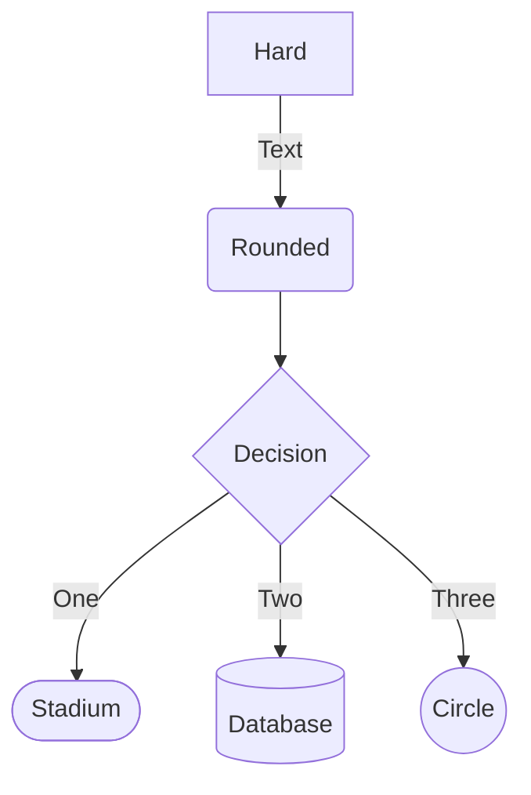
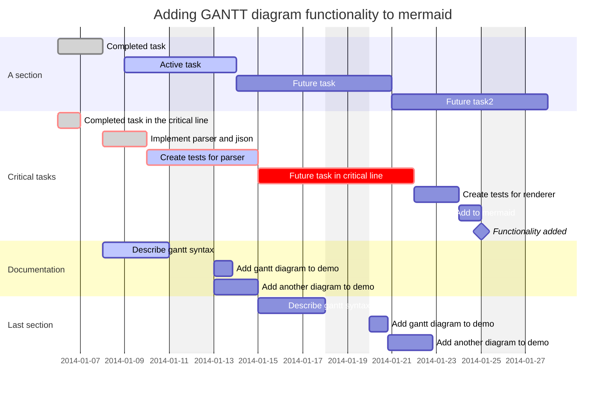
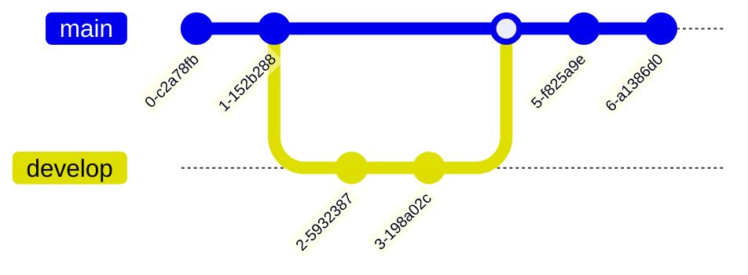
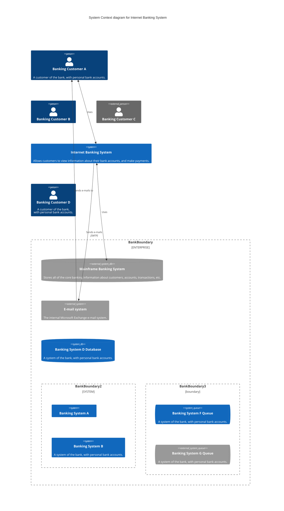
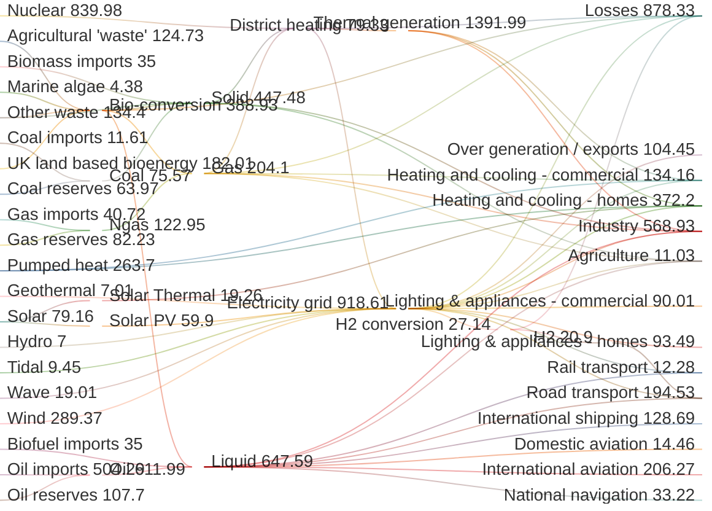

<a name="idtop"></a><!-- 🟢TOP OF PAGE - MARKER  (BLANK LINE BELOW)   -->

<!-- 🟢TOP OF PAGE - LOGO IMAGE -->
<p align="right"></p>      <!-- 🟢TOP OF PAGE - WEB ID     --> 

## 11.5<!--     🟥H2🟥-->Mermaid diagrams

This is a bit of an odd thing and it is entirely GitHub Markdown *(rather than Markdown in general).*

GitHub has built in support for something called Mermaid diagrams<a name="rn-01" href="#fn-01"><!-- 🟨FOOTNOTE LINK🟨--><sup>💠1</sup></a>, these allow various types of flowchart and planning diagrams to be coded directly in the Markdown file.

Mermaid diagrams are quite astonishing (there’s a lot of them), they range from simple flow charts:

<table name="t-11-18" align="center"><!-- 🔴🟢🔵TABLE START🔽🔽(BLANK LINE ABOVE) -->
<!-- TOP & WIDTH --><tr><th align="right" colspan="2"><sup>Markdown and GitHub output
                    </sup></th></tr>
<!-- Header row --> <tr>
                        <th align="left" width="200">${\large \color{#0050C0}\text{M\ A\ R\ K\ D\ O\ W\ N}}$ 🔽</th>
                        <th align="left" width="2650">${\large \color{#B00000}\text{G\ I\ T\ H\ U\ B}\space\ \space\text{O\ U\ T\ P\ U\ T}}$ 🔽</th>
<!-- Header end --> </tr>
<!-- Data row -->   <tr>
<!-- HTML cell --> <td align="left" valign="top"><br><!-- 🔴MARKDOWN BELOW🔴 -->

<pre>&#x0060;&#x0060;&#x0060;mermaid
flowchart TB
A[Hard] -->|Text| B(Rounded)
B --> C{Decision}
C -->|One| D([Stadium])
C -->|Two| E[(Database)]
C -->|Three| F((Circle))
&#x0060;&#x0060;&#x0060;</pre>

<p> </p></td><!-- 🔴MARKDOWN END OF CELL🔴 -->
<!-- GIT cell -->   <td align="left"><!-- 🔵GITHUB OUTPUT BELOW (BLANK LINE BELOW)🔵 -->




</td><!-- 🔵GITHUB OUTPUT END (BLANK LINE ABOVE)🔵 -->
<!-- Data row end--></tr>
<!-- CAPTION -->    <tr><th align="left" colspan="2"><sup>
<!-- CAPTION TEXT -->Table 11.18 &mdash; Mermaid flowchart
                    </sup></th></tr>
</table>                             <!-- 🟥🟩🟦TABLE END  🔼🔼(BLANK LINE BELOW) -->

To Gantt charts:

<table name="t-11-19" align="center"><!-- 🔴🟢🔵TABLE START🔽🔽(BLANK LINE ABOVE) -->
<!-- TOP & WIDTH --><tr><th width="850" align="right"><sup>Markdown and GitHub output
                    </sup></th></tr>
<!-- Header row --> <tr>
                        <th align="left">${\large \color{#0050C0}\text{M\ A\ R\ K\ D\ O\ W\ N}}$ 🔽</th>
                    </tr>
<!-- MD row -->     <tr><td align="left"><br><!-- 🔴MARKDOWN BELOW🔴 -->

<pre>&#x0060;&#x0060;&#x0060;mermaid
gantt
    dateFormat  YYYY-MM-DD
    title       Adding GANTT diagram functionality to mermaid
    excludes    weekends
    %% (`excludes` accepts specific dates in YYYY-MM-DD format, days of the week ("sunday") or "weekends", but not the word "weekdays".)

    section A section
    Completed task            :done,    des1, 2014-01-06,2014-01-08
    Active task               :active,  des2, 2014-01-09, 3d
    Future task               :         des3, after des2, 5d
    Future task2              :         des4, after des3, 5d

    section Critical tasks
    Completed task in the critical line :crit, done, 2014-01-06,24h
    Implement parser and jison          :crit, done, after des1, 2d
    Create tests for parser             :crit, active, 3d
    Future task in critical line        :crit, 5d
    Create tests for renderer           :2d
    Add to mermaid                      :until isadded
    Functionality added                 :milestone, isadded, 2014-01-25, 0d

    section Documentation
    Describe gantt syntax               :active, a1, after des1, 3d
    Add gantt diagram to demo      :after a1  , 20h
    Add another diagram to demo    :doc1, after a1  , 48h

    section Last section
    Describe gantt syntax               :after doc1, 3d
    Add gantt diagram to demo      :20h
    Add another diagram to demo    :48h
&#x0060;&#x0060;&#x0060;</pre>

<p> </p></td></tr><!-- 🔴MARKDOWN END OF ROW🔴 -->
<!-- Header row --> <tr>
                        <th align="left">${\large \color{#B00000}\text{G\ I\ T\ H\ U\ B}\space\ \space\text{O\ U\ T\ P\ U\ T}}$ 🔽</th>
                    </tr>
<!-- GIT row -->    <tr><td align="left" valign="top"><!-- 🔵GITHUB OUTPUT BELOW (BLANK LINE BELOW)🔵 -->



</td></tr><!-- 🔵GITHUB OUTPUT END (BLANK LINE ABOVE)🔵 -->
<!-- CAPTION -->    <tr><th align="left"><sup>
<!-- CAPTION TEXT -->Table 11.19 &mdash; Mermaid Gantt chart
</table>                             <!-- 🟥🟩🟦TABLE END  🔼🔼(BLANK LINE BELOW) -->


It can do GitHub branch diagrams:


<table name="t-11-20" align="center"><!-- 🔴🟢🔵TABLE START🔽🔽(BLANK LINE ABOVE) -->
<!-- TOP & WIDTH --><tr><th align="right" colspan="2"><sup>Markdown and GitHub output
                    </sup></th></tr>
<!-- Header row --> <tr>
                        <th align="left" width="200">${\large \color{#0050C0}\text{M\ A\ R\ K\ D\ O\ W\ N}}$ 🔽</th>
                        <th align="left" width="2650">${\large \color{#B00000}\text{G\ I\ T\ H\ U\ B}\space\ \space\text{O\ U\ T\ P\ U\ T}}$ 🔽</th>
<!-- Header end --> </tr>
<!-- Data row -->   <tr>
<!-- HTML cell --> <td align="left" valign="top"><br><!-- 🔴MARKDOWN BELOW🔴 -->

<pre>&#x0060;&#x0060;&#x0060;mermaid
gitGraph
   commit
   commit
   branch develop
   checkout develop
   commit
   commit
   checkout main
   merge develop
   commit
   commit
&#x0060;&#x0060;&#x0060;</pre>

<p> </p></td><!-- 🔴MARKDOWN END OF CELL🔴 -->
<!-- GIT cell -->   <td align="left"><!-- 🔵GITHUB OUTPUT BELOW (BLANK LINE BELOW)🔵 -->



</td><!-- 🔵GITHUB OUTPUT END (BLANK LINE ABOVE)🔵 -->
<!-- Data row end--></tr>
<!-- CAPTION -->    <tr><th align="left" colspan="2"><sup>
<!-- CAPTION TEXT -->Table 11.20 &mdash; Mermaid Git diagram
                    </sup></th></tr>
</table>                             <!-- 🟥🟩🟦TABLE END  🔼🔼(BLANK LINE BELOW) -->

And complicated structural C4 (context, containers, components, and code) models:


<table name="t-11-21" align="center"><!-- 🔴🟢🔵TABLE START🔽🔽(BLANK LINE ABOVE) -->
<!-- TOP & WIDTH --><tr><th width="850" align="right"><sup>Markdown and GitHub output
                    </sup></th></tr>
<!-- Header row --> <tr>
                        <th align="left">${\large \color{#0050C0}\text{M\ A\ R\ K\ D\ O\ W\ N}}$ 🔽</th>
                    </tr>
<!-- MD row -->     <tr><td align="left"><br><!-- 🔴MARKDOWN BELOW🔴 -->

<pre>&#x0060;&#x0060;&#x0060;mermaid
C4Context
title System Context diagram for Internet Banking System

Person(customerA, "Banking Customer A", "A customer of the bank, with personal bank accounts.")
Person(customerB, "Banking Customer B")
Person_Ext(customerC, "Banking Customer C")
System(SystemAA, "Internet Banking System", "Allows customers to view information about their bank accounts, and make payments.")

Person(customerD, "Banking Customer D", "A customer of the bank, <br/> with personal bank accounts.")

Enterprise_Boundary(b1, "BankBoundary") {

  SystemDb_Ext(SystemE, "Mainframe Banking System", "Stores all of the core banking information about customers, accounts, transactions, etc.")

  System_Boundary(b2, "BankBoundary2") {
    System(SystemA, "Banking System A")
    System(SystemB, "Banking System B", "A system of the bank, with personal bank accounts.")
  }

  System_Ext(SystemC, "E-mail system", "The internal Microsoft Exchange e-mail system.")
  SystemDb(SystemD, "Banking System D Database", "A system of the bank, with personal bank accounts.")

  Boundary(b3, "BankBoundary3", "boundary") {
    SystemQueue(SystemF, "Banking System F Queue", "A system of the bank, with personal bank accounts.")
    SystemQueue_Ext(SystemG, "Banking System G Queue", "A system of the bank, with personal bank accounts.")
  }
}

BiRel(customerA, SystemAA, "Uses")
BiRel(SystemAA, SystemE, "Uses")
Rel(SystemAA, SystemC, "Sends e-mails", "SMTP")
Rel(SystemC, customerA, "Sends e-mails to")

&#x0060;&#x0060;&#x0060;</pre>

<p> </p></td></tr><!-- 🔴MARKDOWN END OF ROW🔴 -->
<!-- Header row --> <tr>
                        <th align="left">${\large \color{#B00000}\text{G\ I\ T\ H\ U\ B}\space\ \space\text{O\ U\ T\ P\ U\ T}}$ 🔽</th>
                    </tr>
<!-- GIT row -->    <tr><td align="left" valign="top"><!-- 🔵GITHUB OUTPUT BELOW (BLANK LINE BELOW)🔵 -->



</td></tr><!-- 🔵GITHUB OUTPUT END (BLANK LINE ABOVE)🔵 -->
<!-- CAPTION -->    <tr><th align="left"><sup>
<!-- CAPTION TEXT -->Table 11.21 &mdash; Mermaid C4 chart
</table>                             <!-- 🟥🟩🟦TABLE END  🔼🔼(BLANK LINE BELOW) -->

In fact it supports all the following:

<table name="l-11-04" align="center">   <!-- LIST START🔽🔽(BLANK LINE ABOVE) -->
<!-- LIST ROW 01  --><tr><td valign="top">&#x2460;</td>
    <td><!-- TEXT -->Sequence Diagram</td></tr>
<!-- LIST ROW 02  --><tr><td valign="top">&#x2461;</td>
    <td><!-- TEXT -->Class Diagram</td></tr>
<!-- LIST ROW 03  --><tr><td valign="top">&#x2462;</td>
    <td><!-- TEXT -->State Diagram</td></tr>
<!-- LIST ROW 04  --><tr><td valign="top">&#x2463;</td>
    <td><!-- TEXT -->Entity Relationship Diagram</td></tr>
<!-- LIST ROW 05  --><tr><td valign="top">&#x2464;</td>
    <td><!-- TEXT -->User Journey</td></tr>
<!-- LIST ROW 06  --><tr><td valign="top">&#x2465;</td>
    <td><!-- TEXT -->Gantt</td></tr>
<!-- LIST ROW 07  --><tr><td valign="top">&#x2466;</td>
    <td><!-- TEXT -->Pie Chart</td></tr>
<!-- LIST ROW 08  --><tr><td valign="top">&#x2467;</td>
    <td><!-- TEXT -->Quadrant Chart</td></tr>
<!-- LIST ROW 09  --><tr><td valign="top">&#x2468;</td>
    <td><!-- TEXT -->Requirement Diagram</td></tr>
<!-- LIST ROW 10  --><tr><td valign="top">&#x2469;</td>
    <td><!-- TEXT -->Gitgraph (Git) Diagram</td></tr>
<!-- LIST ROW 11  --><tr><td valign="top">&#x246A;</td>
    <td><!-- TEXT -->C4 Diagram</td></tr>
<!-- LIST ROW 12  --><tr><td valign="top">&#x246B;</td>
    <td><!-- TEXT -->Mindmaps</td></tr>
<!-- LIST ROW 13  --><tr><td valign="top">&#x246C;</td>
    <td><!-- TEXT -->Timeline</td></tr>
<!-- LIST ROW 14  --><tr><td valign="top">&#x246D;</td>
    <td><!-- TEXT -->ZenUML</td></tr>
<!-- LIST ROW 15  --><tr><td valign="top">&#x246E;</td>
    <td><!-- TEXT -->Sankey</td></tr>
<!-- LIST ROW 16  --><tr><td valign="top">&#x246F;</td>
    <td><!-- TEXT -->XY Chart</td></tr>
<!-- LIST ROW 17  --><tr><td valign="top">&#x2470;</td>
    <td><!-- TEXT -->Block Diagram</td></tr>
<!-- LIST ROW 18  --><tr><td valign="top">&#x2471;</td>
    <td><!-- TEXT -->Packet</td></tr>
<!-- LIST ROW 19  --><tr><td valign="top">&#x2472;</td>
    <td><!-- TEXT -->Kanban</td></tr>
<!-- LIST ROW 20  --><tr><td valign="top">&#x2473;</td>
    <td><!-- TEXT -->Architecture</td></tr>
<!-- CAPTION -->          <tr><th width="52"></th><!-- SPACER -->
<!-- LIST WIDTH -->         <th align="left" width="500"><sup>
<!-- CAPTION TEXT --><!-- TEXT -->List 11.4 &mdash; List of Mermaid Diagram types
                           </sup></th></tr>
</table>                              <!-- LIST END    🔼🔼(BLANK LINE BELOW) -->

*Yes, I’ve no idea what a sanky diagram or a Kanban is either.*

**[:arrow_up: Top](#idtop)**<!-- END OF SECTION - LINK TO TOP🔽🔽(BLANK LINE ABOVE) -->
<HR>                        <!-- END OF SECTION - SEPARATING LINE                    -->
<br>                        <!-- END OF SECTION - PADDING    🔼🔼(BLANK LINE BELOW) -->

### 11.5.1<!--  🟥H3🟥-->Inserting a Mermaid diagram

Mermaid diagrams are created using a fenced code block (these are covered in detail in <a href="../13-0000/13%20Code%20fragments.md#132code-blocks">section&nbsp;13.2</a>). These begin with three backticks (` ``` `) followed by the word `mermaid`:

&emsp;&emsp;&emsp;` ```mermaid `

And end with three more backticks:

&emsp;&emsp;&emsp;` ``` `

The Mermaid configuration syntax fits in between the two:

<table name="t-11-21a" align="center"><!-- 🔴🟢🔵TABLE START🔽🔽(BLANK LINE ABOVE) -->
<!-- TOP & WIDTH --><tr><th align="right" colspan="2"><sup>Markdown and GitHub output
                    </sup></th></tr>
<!-- Header row --> <tr>
                        <th align="left" width="200">${\large \color{#0050C0}\text{M\ A\ R\ K\ D\ O\ W\ N}}$ 🔽</th>
                        <th align="left" width="2650">${\large \color{#B00000}\text{G\ I\ T\ H\ U\ B}\space\ \space\text{O\ U\ T\ P\ U\ T}}$ 🔽</th>
<!-- Header end --> </tr>
<!-- Data row -->   <tr>
<!-- HTML cell --> <td align="left" valign="top"><br><!-- 🔴MARKDOWN BELOW🔴 -->

<pre>&#x0060;&#x0060;&#x0060;mermaid
flowchart TB
A[Hard] -->|Text| B(Rounded)
B --> C{Decision}
C -->|One| D([Stadium])
C -->|Two| E[(Database)]
C -->|Three| F((Circle))
&#x0060;&#x0060;&#x0060;</pre>

<p> </p></td><!-- 🔴MARKDOWN END OF CELL🔴 -->
<!-- GIT cell -->   <td align="left"><!-- 🔵GITHUB OUTPUT BELOW (BLANK LINE BELOW)🔵 -->


</td><!-- 🔵GITHUB OUTPUT END (BLANK LINE ABOVE)🔵 -->
<!-- Data row end--></tr>
</table>                             <!-- 🟥🟩🟦TABLE END  🔼🔼(BLANK LINE BELOW) -->

The above renders as a top to bottom flow chart.

The full Mermaid language syntax is beyond the scope of this document *(it isn’t that difficult to understand, just that there is a lot of it)*. The Mermaid site contains a full set of documentation and tutorials, it’s available here:

&emsp;&emsp;&emsp;<!---🟡ENTER URL🟡-->https://mermaid.js.org/intro/

It’s very comprehensive.

The website looks like this:

<table name="f-11-08" align="center"><!-- FIGURE START🔽🔽(BLANK LINE ABOVE) -->
<!-- Figure row --> <tr><td>
<!-- LINK -->         <a href="../11-0500/02-images/figm-11-08.png" title="Use ctrl+click to open image in new tab">
<!-- FIGURE -->         
                    </a></td></tr>
<!-- CAPTION -->    <tr><th align="center"><sup>
<!-- CAPTION TEXT -->   Figure 11.8 &mdash; Mermaid documentation website
                    </sup></th></tr>
</table>                             <!-- FIGURE END  🔼🔼(BLANK LINE BELOW) -->

To find out how to render any of the diagrams highlighted, just click the link on the left and it will show the syntax, examples and all the options for that particular type of diagram *(I particularly recommend trying the Sankey diagram, shown below)*.



**[:arrow_up: Top](#idtop)**<!-- END OF SECTION - LINK TO TOP🔽🔽(BLANK LINE ABOVE) -->
<HR>                        <!-- END OF SECTION - SEPARATING LINE                    -->
<br>                        <!-- END OF SECTION - PADDING    🔼🔼(BLANK LINE BELOW) -->

### 11.5.2<!--  🟥H3🟥-->The rendered Mermaid diagram

The rendered diagram on the GitHub looks like this:


<table name="f-11-09" align="center"><!-- FIGURE START🔽🔽(BLANK LINE ABOVE) -->
<!-- Figure row --> <tr><td>
<!-- LINK -->         <a href="../11-0500/02-images/figm-11-09.png" title="Use ctrl+click to open image in new tab">
<!-- FIGURE -->         
                    </a></td></tr>
<!-- CAPTION -->    <tr><th align="center"><sup>
<!-- CAPTION TEXT -->   Figure 11.9 &mdash; Mermaid diagram controls
                    </sup></th></tr>
</table>                             <!-- FIGURE END  🔼🔼(BLANK LINE BELOW) -->

The controls (highlighted) allow the graphic to be manipulated as follows:


<table name="t-11-22" align="center"><!-- TABLE START🔽🔽(BLANK LINE ABOVE) -->
<!-- HEADER ROW --> <tr>
                        <th width="150" align="center">Symbol</th>
                        <th width="600" align="left">Function</th>
                    </tr>
<!-- DATA ROW -->   <tr>
                        <td align="left"></td>
                        <td align="left">Opens the diagram in an enlarged floating window</td>
                    </tr>
<!-- DATA ROW -->   <tr>
                        <td align="left"></td>
                        <td align="left">Copies the Markdown code behind the diagram</td>
                    </tr>
<!-- DATA ROW -->   <tr>
                        <td align="left"></td>
                        <td align="left">Zoom in/out </td>
                    </tr>
<!-- DATA ROW -->   <tr>
                        <td align="left"></td>
                        <td align="left">Scroll left, right, up or down</td>
                    </tr>
<!-- DATA ROW -->   <tr>
                        <td align="left"></td>
                        <td align="left">Reset the image to its original state (size)</td>
                    </tr>
<!-- CAPTION -->    <tr><th colspan="2" align="left"><sup>
<!-- CAPTION TEXT -->Table 1122 &mdash; Mermaid display controls
                     </sup></th></tr>
</table>                             <!-- TABLE END  🔼🔼(BLANK LINE BELOW) -->

**[:arrow_up: Top](#idtop)**<!-- END OF SECTION - LINK TO TOP🔽🔽(BLANK LINE ABOVE) -->
<HR>                        <!-- END OF SECTION - SEPARATING LINE                    -->
<br>                        <!-- END OF SECTION - PADDING    🔼🔼(BLANK LINE BELOW) -->

### 11.5.3<!--  🟥H3🟥-->Supported version of Mermaid

The version of Mermaid currently supported by GitHub can be identified by putting the following into a Markdown page:

<table name="t-11-21a" align="center"><!-- 🔴🟢🔵TABLE START🔽🔽(BLANK LINE ABOVE) -->
<!-- TOP & WIDTH --><tr><th align="right" colspan="2"><sup>Markdown and GitHub output
                    </sup></th></tr>
<!-- Header row --> <tr>
                        <th align="left" width="200">${\large \color{#0050C0}\text{M\ A\ R\ K\ D\ O\ W\ N}}$ 🔽</th>
                        <th align="left" width="2650">${\large \color{#B00000}\text{G\ I\ T\ H\ U\ B}\space\ \space\text{O\ U\ T\ P\ U\ T}}$ 🔽</th>
<!-- Header end --> </tr>
<!-- Data row -->   <tr>
<!-- HTML cell --> <td align="left" valign="top"><br><!-- 🔴MARKDOWN BELOW🔴 -->

<pre>&#x0060;&#x0060;&#x0060;mermaid
info
&#x0060;&#x0060;&#x0060;</pre>

<p> </p></td><!-- 🔴MARKDOWN END OF CELL🔴 -->
<!-- GIT cell -->   <td align="left"><!-- 🔵GITHUB OUTPUT BELOW (BLANK LINE BELOW)🔵 -->

```mermaid
info
```
</td><!-- 🔵GITHUB OUTPUT END (BLANK LINE ABOVE)🔵 -->
<!-- Data row end--></tr>
</table>                             <!-- 🟥🟩🟦TABLE END  🔼🔼(BLANK LINE BELOW) -->

This will display the current version on the rendered page. At the time of writing, GitHub was at version 11.3.0 of Mermaid; Mermaid itself was at version 11.4.1 so GitHub is a few revisions behind *(two to be exact)*.

The Mermaid project is actually a repository on GitHub and can be accessed here:

&emsp;&emsp;&emsp;<!---🟡ENTER URL🟡-->https://github.com/mermaid-js/mermaid


## 11.6<!--     🟥H2🟥-->Interactive maps

GitHub supports two types of interactive maps, the first is called GeoJSON and the second TopoJSON.

I’m going to ignore TopoJSON, it’s just too difficult to understand and work with.

This is a GeoJSON map of Chester (Chester cathedral to be exact):


<table name="t-11-23" align="center"><!-- 🔴🟢🔵TABLE START🔽🔽(BLANK LINE ABOVE) -->
<!-- TOP & WIDTH --><tr><th width="850" align="right"><sup>Markdown and GitHub output
                    </sup></th></tr>
<!-- Header row --> <tr>
                        <th align="left">${\large \color{#0050C0}\text{M\ A\ R\ K\ D\ O\ W\ N}}$ 🔽</th>
                    </tr>
<!-- MD row -->     <tr><td align="left"><br><!-- 🔴MARKDOWN BELOW🔴 -->

<pre>&#x0060;&#x0060;&#x0060;geojson
{
  "coordinates": [-2.890456668659124,53.19188063886462],
  "type": "Point"
}
&#x0060;&#x0060;&#x0060;</pre>

<p> </p></td></tr><!-- 🔴MARKDOWN END OF ROW🔴 -->
<!-- Header row --> <tr>
                        <th align="left">${\large \color{#B00000}\text{G\ I\ T\ H\ U\ B}\space\ \space\text{O\ U\ T\ P\ U\ T}}$ 🔽</th>
                    </tr>
<!-- GIT row -->    <tr><td align="left" valign="top"><!-- 🔵GITHUB OUTPUT BELOW (BLANK LINE BELOW)🔵 -->

```geojson
{
  "coordinates": [-2.890456668659124,53.19188063886462],
  "type": "Point"
}
```

</td></tr><!-- 🔵GITHUB OUTPUT END (BLANK LINE ABOVE)🔵 -->
<!-- CAPTION -->    <tr><th align="left"><sup>
<!-- CAPTION TEXT -->Table 11.23 &mdash; GeoJSON map
</table>    

The syntax involved in both the GeoJSON and TopoJSON applications can be complicated *(the example above is deceivingly simple)*. The syntax for TopoJSON was impenetrable and I ran out of patience with it.

GeoJSON does have a saving grace, it has its own website with a full map of the world that you can manipulate (zoom in, zoom out, drop points, mark areas &c.) and it will automatically generate the GeoJSON code that you can paste directly into your Markdown (that’s how I got the Map of Chester).

The website is:

&emsp;&emsp;&emsp;<!---🟡ENTER URL🟡-->https://geojson.io/

It looks like this:


<table name="f-11-10" align="center"><!-- FIGURE START🔽🔽(BLANK LINE ABOVE) -->
<!-- Figure row --> <tr><td>
<!-- LINK -->         <a href="../11-0500/02-images/figm-11-10.png" title="Use ctrl+click to open image in new tab">
<!-- FIGURE -->         
                    </a></td></tr>
<!-- CAPTION -->    <tr><th align="center"><sup>
<!-- CAPTION TEXT -->   Figure 11.10 &mdash; GeoJSON interactive map website
                    </sup></th></tr>
</table>                             <!-- FIGURE END  🔼🔼(BLANK LINE BELOW) -->

The area on the right contains the GeoJSON code for the current view.

Zooming into a particular area and then using the toolbar in the main area to select an area (with polygons, squares &c.) or drop points will produce code in the right-hand column.

In the following example, I’ve drawn a polygon area around Chester, the GeoJSON code for it can be seen in the right area.

<table name="f-11-11" align="center"><!-- FIGURE START🔽🔽(BLANK LINE ABOVE) -->
<!-- Figure row --> <tr><td>
<!-- LINK -->         <a href="../11-0500/02-images/figm-11-11.png" title="Use ctrl+click to open image in new tab">
<!-- FIGURE -->         
                    </a></td></tr>
<!-- CAPTION -->    <tr><th align="center"><sup>
<!-- CAPTION TEXT -->   Figure 11.11 &mdash; Cheser defined as an area
                    </sup></th></tr>
</table>                             <!-- FIGURE END  🔼🔼(BLANK LINE BELOW) -->

To use this in GitHub Markdown, simply copy everything in the right-hand area and paste it into the Markdown file.

The code must be preceeded with ` ```geojson` and followed with three backticks ` ``` `.


<table name="t-11-24" align="center"><!-- 🔴🟢🔵TABLE START🔽🔽(BLANK LINE ABOVE) -->
<!-- TOP & WIDTH --><tr><th width="850" align="right"><sup>Markdown and GitHub output
                    </sup></th></tr>
<!-- Header row --> <tr>
                        <th align="left">${\large \color{#0050C0}\text{M\ A\ R\ K\ D\ O\ W\ N}}$ 🔽</th>
                    </tr>
<!-- MD row -->     <tr><td align="left"><br><!-- 🔴MARKDOWN BELOW🔴 -->

<pre>&#x0060;&#x0060;&#x0060;geojson
{
  "type": "FeatureCollection",
  "features": [
    {
      "type": "Feature",
      "properties": {},
      "geometry": {
        "coordinates": [
          [
            [
              -2.894016844090686,
              53.22606316381487
            ],
            [
              -2.943029960491174,
              53.20339794394624
            ],
            [
              -2.9408566337193633,
              53.175461291545616
            ],
            [
              -2.8704974571575974,
              53.16529453461672
            ],
            [
              -2.8466077121183275,
              53.2009158858929
            ],
            [
              -2.894016844090686,
              53.22606316381487
            ]
          ]
        ],
        "type": "Polygon"
      }
    }
  ]
}
&#x0060;&#x0060;&#x0060;</pre>

<p> </p></td></tr><!-- 🔴MARKDOWN END OF ROW🔴 -->
<!-- Header row --> <tr>
                        <th align="left">${\large \color{#B00000}\text{G\ I\ T\ H\ U\ B}\space\ \space\text{O\ U\ T\ P\ U\ T}}$ 🔽</th>
                    </tr>
<!-- GIT row -->    <tr><td align="left" valign="top"><!-- 🔵GITHUB OUTPUT BELOW (BLANK LINE BELOW)🔵 -->

```geojson
{
  "type": "FeatureCollection",
  "features": [
    {
      "type": "Feature",
      "properties": {},
      "geometry": {
        "coordinates": [
          [
            [
              -2.894016844090686,
              53.22606316381487
            ],
            [
              -2.943029960491174,
              53.20339794394624
            ],
            [
              -2.9408566337193633,
              53.175461291545616
            ],
            [
              -2.8704974571575974,
              53.16529453461672
            ],
            [
              -2.8466077121183275,
              53.2009158858929
            ],
            [
              -2.894016844090686,
              53.22606316381487
            ]
          ]
        ],
        "type": "Polygon"
      }
    }
  ]
}
```

</td></tr><!-- 🔵GITHUB OUTPUT END (BLANK LINE ABOVE)🔵 -->
<!-- CAPTION -->    <tr><th align="left"><sup>
<!-- CAPTION TEXT -->Table 11.24 &mdash; GeoJSON script copied from the website
</table>    

> [!NOTE]<!-- NOTE ALERT -->
> *The same website can produce TopoJSON scripts too, instead of copying the code in the right window, click `Save` (top left) and select `TopoJSON` from the dropdown, it will save the code in a file for you.*
>
> *Paste the contents of the file into a Markdown file, but this time precede it with:* ` ```topojson`. 

**[:arrow_up: Top](#idtop)**<!-- END OF SECTION - LINK TO TOP🔽🔽(BLANK LINE ABOVE) -->
<HR>                        <!-- END OF SECTION - SEPARATING LINE                    -->
<br>                        <!-- END OF SECTION - PADDING    🔼🔼(BLANK LINE BELOW) -->

## 11.7<!--     🟥H2🟥-->3D models

This, I think, is also a bit peculiar *(the things GitHub want to include, we can have rotating 3D models, but we can’t change the font colour)*.

For whatever reason, GitHub supports the rendering of 3D models, these can be embedded into a Wiki page between  ` ```stl` and followed with three backticks ` ``` `, in a similar way to interactive maps and the Mermaid diagrams covered in the previous two sections.

The model itself is created in ASCII STL<a name="rn-02" href="#fn-02"><!-- 🟨FOOTNOTE LINK🟨--><sup>💠2</sup></a> which is a format often used by 3D printers. ASCII STL is text based, but STL files can be generated as binary files (this is the more common approach). Binary STL files can be converted to ASCII STL using an online converter such as this:

&emsp;&emsp;&emsp;<!---🟡ENTER URL🟡-->https://www.meshconvert.com/

The following is the ASCII STL for a cube:


<table name="t-11-25" align="center"><!-- 🔴🟢🔵TABLE START🔽🔽(BLANK LINE ABOVE) -->
<!-- TOP & WIDTH --><tr><th width="850" align="right"><sup>Markdown and GitHub output
                    </sup></th></tr>
<!-- Header row --> <tr>
                        <th align="left">${\large \color{#0050C0}\text{M\ A\ R\ K\ D\ O\ W\ N}}$ 🔽</th>
                    </tr>
<!-- MD row -->     <tr><td align="left"><br><!-- 🔴MARKDOWN BELOW🔴 -->

<pre>&#x0060;&#x0060;&#x0060;stl
solid AssimpScene
 facet normal 0 0 1
  outer loop
  vertex -35 60 20
  vertex -55 60 20
  vertex -35 40 20
  endloop
 endfacet

 facet normal 0 0 1
  outer loop
  vertex -35 40 20
  vertex -55 60 20
  vertex -55 40 20
  endloop
 endfacet

 facet normal 0 0 -1
  outer loop
  vertex -35 40 0
  vertex -55 40 0
  vertex -35 60 0
  endloop
 endfacet

 facet normal 0 0 -1
  outer loop
  vertex -35 60 0
  vertex -55 40 0
  vertex -55 60 0
  endloop
 endfacet

 facet normal 0 -1 0
  outer loop
  vertex -55 40 20
  vertex -55 40 0
  vertex -35 40 20
  endloop
 endfacet

 facet normal 0 -1 0
  outer loop
  vertex -35 40 20
  vertex -55 40 0
  vertex -35 40 0
  endloop
 endfacet

	 facet normal -1 0 0
  outer loop
  vertex -55 60 20
  vertex -55 60 0
  vertex -55 40 20
  endloop
 endfacet

 facet normal -1 0 0
  outer loop
  vertex -55 40 20
  vertex -55 60 0
  vertex -55 40 0
  endloop
 endfacet

 facet normal 0 1 0
  outer loop
  vertex -35 60 20
  vertex -35 60 0
  vertex -55 60 20
  endloop
 endfacet

 facet normal 0 1 0
  outer loop
  vertex -55 60 20
  vertex -35 60 0
  vertex -55 60 0
  endloop
 endfacet

 facet normal 1 0 0
  outer loop
  vertex -35 40 20
  vertex -35 40 0
  vertex -35 60 20
  endloop
 endfacet

 facet normal 1 0 0
  outer loop
  vertex -35 60 20
  vertex -35 40 0
  vertex -35 60 0
  endloop
 endfacet

endsolid AssimpScene
&#x0060;&#x0060;&#x0060;</pre>

<p> </p></td></tr><!-- 🔴MARKDOWN END OF ROW🔴 -->
<!-- Header row --> <tr>
                        <th align="left">${\large \color{#B00000}\text{G\ I\ T\ H\ U\ B}\space\ \space\text{O\ U\ T\ P\ U\ T}}$ 🔽</th>
                    </tr>
<!-- GIT row -->    <tr><td align="left" valign="top"><!-- 🔵GITHUB OUTPUT BELOW (BLANK LINE BELOW)🔵 -->

```stl
solid AssimpScene
 facet normal 0 0 1
  outer loop
  vertex -35 60 20
  vertex -55 60 20
  vertex -35 40 20
  endloop
 endfacet

 facet normal 0 0 1
  outer loop
  vertex -35 40 20
  vertex -55 60 20
  vertex -55 40 20
  endloop
 endfacet

 facet normal 0 0 -1
  outer loop
  vertex -35 40 0
  vertex -55 40 0
  vertex -35 60 0
  endloop
 endfacet

 facet normal 0 0 -1
  outer loop
  vertex -35 60 0
  vertex -55 40 0
  vertex -55 60 0
  endloop
 endfacet

 facet normal 0 -1 0
  outer loop
  vertex -55 40 20
  vertex -55 40 0
  vertex -35 40 20
  endloop
 endfacet

 facet normal 0 -1 0
  outer loop
  vertex -35 40 20
  vertex -55 40 0
  vertex -35 40 0
  endloop
 endfacet

	 facet normal -1 0 0
  outer loop
  vertex -55 60 20
  vertex -55 60 0
  vertex -55 40 20
  endloop
 endfacet

 facet normal -1 0 0
  outer loop
  vertex -55 40 20
  vertex -55 60 0
  vertex -55 40 0
  endloop
 endfacet

 facet normal 0 1 0
  outer loop
  vertex -35 60 20
  vertex -35 60 0
  vertex -55 60 20
  endloop
 endfacet

 facet normal 0 1 0
  outer loop
  vertex -55 60 20
  vertex -35 60 0
  vertex -55 60 0
  endloop
 endfacet

 facet normal 1 0 0
  outer loop
  vertex -35 40 20
  vertex -35 40 0
  vertex -35 60 20
  endloop
 endfacet

 facet normal 1 0 0
  outer loop
  vertex -35 60 20
  vertex -35 40 0
  vertex -35 60 0
  endloop
 endfacet

endsolid AssimpScene
```

</td></tr><!-- 🔵GITHUB OUTPUT END (BLANK LINE ABOVE)🔵 -->
<!-- CAPTION -->    <tr><th align="left"><sup>
<!-- CAPTION TEXT -->Table 11.25 &mdash; ASCII STL 3D model of a cube
</table>    

The cube can be re-oriented by clicking and dragging with a mouse, it will also automatically begin to rotate along the horizontal plane if left alone.

The Wireframe, Surface Angle and Solid options show the object as either its component wire frame, individual surfaces or a shaded solid.

<a href="../D-0000/App%20D%203D%20model.md">Appendix&nbsp;D</a> contains the code for a <a href="https://en.wikipedia.org/wiki/Menger_sponge">Sierpinski cube</a> (a fractal derivation of a cube), there is a lot of it.


**[:arrow_up: Top](#idtop)**<!-- END OF SECTION - LINK TO TOP🔽🔽(BLANK LINE ABOVE) -->
<br>                        <!-- END OF SECTION - PADDING    🔼🔼(BLANK LINE BELOW) -->

<hr><!-- FOOTNOTE SEPARATOR 🟡🟡🟡🟡🟡 -->
<a name="idfn" href="#idfn">Footnotes:<!-- 🟡FOOTNOTE TITLE🟡 -->&emsp;&emsp;&emsp;&emsp;&emsp;</a>
<br><br><br>

> [!NOTE]<!-- 🟡FOOTNOTE CONTENT -->
> <a name="fn-01" href="#rn-01"><sup>💠1</sup></a>&emsp;<!-- FOOTNOTE CONTENT TEXT -->Mermaid is a Markdown based tool developed by Knut Sveidqvist *(apparently, he named it Mermaid because his children were watching The Little Mermaid when he started the project)* that generates various type of diagrams: flowcharts, sequence diagrams, Gantt charts, class ar-rangements, Git branch diagrams, quadrants, pie charts &c.<!--  CONTENT TEXT END --><a href="#rn-01">↩</a><!-- 🟡🟡🟡🟡🟡 FOOTNOTE END -->


> [!NOTE]<!-- 🟡FOOTNOTE CONTENT -->
> <a name="fn-02" href="#rn-02"><sup>💠2</sup></a>&emsp;<!-- FOOTNOTE CONTENT TEXT -->STL stands for STereo Lithography and is a plain text mechanism for describing (and render-ing) the surface of an object as a mesh of triangles.<!--  CONTENT TEXT END --><a href="#rn-02">↩</a><!-- 🟡🟡🟡🟡🟡 FOOTNOTE END -->


<br><br>            <!-- END OF PAGE - 🟥🟥🟥🟥🟥 PADDING🔽🔽(NO BLANK LINE ABOVE) -->
<hr>                <!-- END OF PAGE - 🟥🟥🟥🟥🟥 SEPARATING LINE                   -->
<a name="idend"></a><!-- END OF PAGE – 🟥🟥🟥🟥🟥 MARKER 🔼🔼                      -->