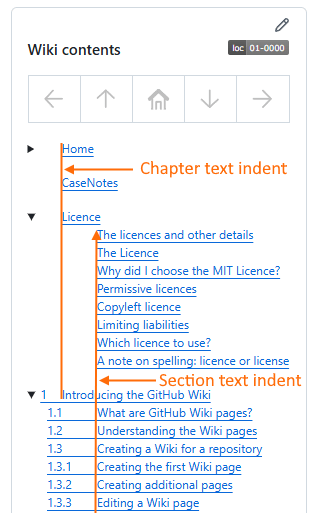
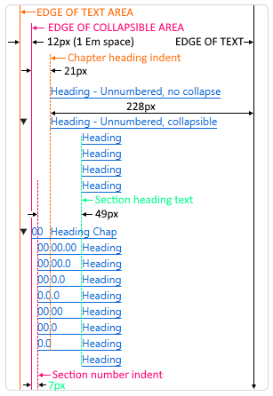
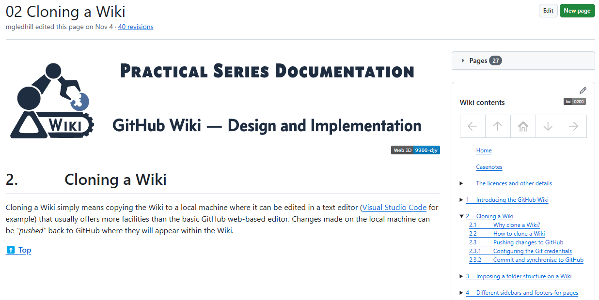
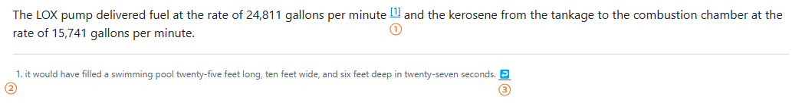
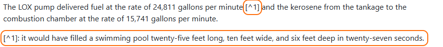
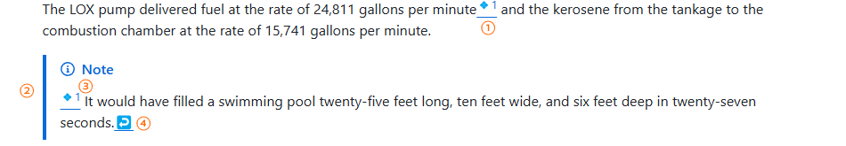

<a name="idtop"></a><!-- 🟢TOP OF PAGE - MARKER  (BLANK LINE BELOW)   -->

<!-- 🟢TOP OF PAGE - LOGO IMAGE -->
<p align="right"></p>      <!-- 🟢TOP OF PAGE - WEB ID     --> 

# 12<!--        🟥H1🟥-->Contents, collapsible content and footnotes

Tables of contents (TOCs) form an important part of a Wiki, PracticalSeries Wikis all have a table of contents in the sidebar, these are in a collapsible form that can be expanded or contracted by clicking a small black arrow at the side of the link.

Each entry in the TOC is a link that navigates to the appropriate section when clicked. This section explains how to construct a table of contents, how to make it collapsible and how to automatically produce the TOC entries.

Footnotes are also covered in this section. Footnotes are a peculiarity with GitHub Wikis; normally, footnotes can be created directly in the Markdown and using specific formatting characters that tell GitHub it’s a footnote and GitHub then creates a link to the footnote entry and from there, back to the original point in the body text. At least it does in normal Markdown files in a repository.

For some reason, footnotes don’t work in Wiki Markdown files. I have no reason why this should be. But there we go.

I’ve come up with a workaround to allow footnotes and their linkage to work on Wiki pages, and it is explained in this section.

**[:arrow_up: Top](#idtop)**<!-- END OF SECTION - LINK TO TOP🔽🔽(BLANK LINE ABOVE) -->
<HR>                        <!-- END OF SECTION - SEPARATING LINE                    -->
<br>                        <!-- END OF SECTION - PADDING    🔼🔼(BLANK LINE BELOW) -->

## 12.1<!--     🟥H2🟥-->A basic table of contents

A table of contents (TOC) is simply a list of the heading on a page (or on many Wiki pages) that form navigable links to the appropriate page and heading.

These links are identical to those discussed in <a href="09-links#93linking-to-headings-on-the-current-page">section&nbsp;9.3</a> and <a href="09-links#94linking-to-headings-on-a-different-page">section&nbsp;9.4</a>. The following is an extract of the TOC from this Wiki (it appears in the sidebar of the following page: https://github.com/practicalseries/GitHub-Wiki-Design-and-Implementation/wiki/../01-0000/01%20Introducing%20the%20GitHub%20Wiki.md).

<table name="f-12-01" align="center"><!-- FIGURE START🔽🔽(BLANK LINE ABOVE) -->
<!-- Figure row --> <tr><td>
<!-- LINK -->         <a href="../12-0000/02-images/figm-12-01.png" title="Use ctrl+click to open image in new tab">
<!-- FIGURE -->         
                    </a></td></tr>
<!-- CAPTION -->    <tr><th align="center"><sup>
<!-- CAPTION TEXT -->   Figure 12.1 &mdash; Table of contents in a sidebar
                    </sup></th></tr>
</table>                             <!-- FIGURE END  🔼🔼(BLANK LINE BELOW) -->

The Markdown behind this is:

<table name="t-12-01" align="center"><!-- 🔴🟢🔵TABLE START🔽🔽(BLANK LINE ABOVE) -->
<!-- TOP & WIDTH --><tr><th width="850" align="right"><sup>Markdown and GitHub output
                    </sup></th></tr>
<!-- Header row --> <tr>
                        <th align="left">${\large \color{#0050C0}\text{M\ A\ R\ K\ D\ O\ W\ N}}$ 🔽</th>
                    </tr>
<!-- MD row -->     <tr><td align="left"><br><!-- 🔴MARKDOWN BELOW🔴 -->

```md
&emsp;&emsp;&ensp;&thinsp;&hairsp;[Home](home)<br><!-- HOME -->

&emsp;&emsp;&ensp;&thinsp;&hairsp;[Casenotes](casenotes)<br><!-- CASENOTES -->

&emsp;&emsp;&ensp;&thinsp;&hairsp;[The licences and other details](licence)<br><!-- LICENCE -->
&emsp;&emsp;&emsp;&emsp;&emsp;&ensp;&nbsp;[The Licence](licence#the-licence)<br>
&emsp;&emsp;&emsp;&emsp;&emsp;&ensp;&nbsp;[Why did I choose the MIT Licence?](licence#why-did-i-choose-the-mit-licence)<br>
&emsp;&emsp;&emsp;&emsp;&emsp;&ensp;&nbsp;[Permissive licences](licence#permissive-licences)<br>
&emsp;&emsp;&emsp;&emsp;&emsp;&ensp;&nbsp;[Copyleft licence](licence#copyleft-licence)<br>
&emsp;&emsp;&emsp;&emsp;&emsp;&ensp;&nbsp;[Limiting liabilities](licence#limiting-liabilities)<br>
&emsp;&emsp;&emsp;&emsp;&emsp;&ensp;&nbsp;[Which licence to use?](licence#which-licence-to-use)<br>
&emsp;&emsp;&emsp;&emsp;&emsp;&ensp;&nbsp;[A note on spelling](licence#a-note-on-spelling-licence-or-license)<br>

&ensp;&nbsp;&nbsp;[1&ensp;&nbsp;&nbsp;&thinsp;Introducing the GitHub Wiki](../01-0000/01%20Introducing%20the%20GitHub%20Wiki.md)<br><!--SEC 01 -->
&emsp;&ensp;&hairsp;[1.3&emsp;&emsp;&nbsp;&nbsp;&thinsp;&hairsp;Creating a Wiki](../01-0000/01%20Introducing%20the%20GitHub%20Wiki.md#13creating-a-wiki-for-a-repository)<br>

```
<p> </p></td></tr><!-- 🔴MARKDOWN END OF ROW🔴 -->
<!-- Header row --> <tr>
                        <th align="left">${\large \color{#B00000}\text{G\ I\ T\ H\ U\ B}\space\ \space\text{O\ U\ T\ P\ U\ T}}$ 🔽</th>
                    </tr>
<!-- GIT row -->    <tr><td align="left" valign="top"><!-- 🔵GITHUB OUTPUT BELOW (BLANK LINE BELOW)🔵 -->

&emsp;&emsp;&ensp;&thinsp;&hairsp;[Home](home)<br><!-- HOME -->

&emsp;&emsp;&ensp;&thinsp;&hairsp;[Casenotes](casenotes)<br><!-- CASENOTES -->

&emsp;&emsp;&ensp;&thinsp;&hairsp;[The licences and other details](licence)<br><!-- LICENCE -->
&emsp;&emsp;&emsp;&emsp;&emsp;&ensp;&nbsp;[The Licence](licence#the-licence)<br>
&emsp;&emsp;&emsp;&emsp;&emsp;&ensp;&nbsp;[Why did I choose the MIT Licence?](licence#why-did-i-choose-the-mit-licence)<br>
&emsp;&emsp;&emsp;&emsp;&emsp;&ensp;&nbsp;[Permissive licences](licence#permissive-licences)<br>
&emsp;&emsp;&emsp;&emsp;&emsp;&ensp;&nbsp;[Copyleft licence](licence#copyleft-licence)<br>
&emsp;&emsp;&emsp;&emsp;&emsp;&ensp;&nbsp;[Limiting liabilities](licence#limiting-liabilities)<br>
&emsp;&emsp;&emsp;&emsp;&emsp;&ensp;&nbsp;[Which licence to use?](licence#which-licence-to-use)<br>
&emsp;&emsp;&emsp;&emsp;&emsp;&ensp;&nbsp;[A note on spelling](licence#a-note-on-spelling-licence-or-license)<br>

&ensp;&nbsp;&nbsp;[1&ensp;&nbsp;&nbsp;&thinsp;Introducing the GitHub Wiki](../01-0000/01%20Introducing%20the%20GitHub%20Wiki.md)<br><!--SEC 01 -->
&emsp;&ensp;&hairsp;[1.3&emsp;&emsp;&nbsp;&nbsp;&thinsp;&hairsp;Creating a Wiki](../01-0000/01%20Introducing%20the%20GitHub%20Wiki.md#13creating-a-wiki-for-a-repository)<br>


</td></tr><!-- 🔵GITHUB OUTPUT END (BLANK LINE ABOVE)🔵 -->
<!-- CAPTION -->    <tr><th align="left"><sup>
<!-- CAPTION TEXT -->Table 12.1 &mdash; A basic table of contents in Markdown
</table>                             <!-- 🟥🟩🟦TABLE END  🔼🔼(BLANK LINE BELOW) -->

> [!NOTE]<!-- NOTE ALERT -->
> *The `<br>` at the end of each line is required (the lines join up otherwise).*

Ignoring all the special space characters at the start *(these are just used to pad the links to the correct indentation)*, it becomes:

<table name="t-12-02" align="center"><!-- 🔴🟢🔵TABLE START🔽🔽(BLANK LINE ABOVE) -->
<!-- TOP & WIDTH --><tr><th width="850" align="right"><sup>Markdown and GitHub output
                    </sup></th></tr>
<!-- Header row --> <tr>
                        <th align="left">${\large \color{#0050C0}\text{M\ A\ R\ K\ D\ O\ W\ N}}$ 🔽</th>
                    </tr>
<!-- MD row -->     <tr><td align="left"><br><!-- 🔴MARKDOWN BELOW🔴 -->

```md
[Home](home)<br>

[Casenotes](casenotes)<br>

[The licences and other details](licence)<br>
[The Licence](licence#the-licence)<br>
[Why did I choose the MIT Licence?](licence#why-did-i-choose-the-mit-licence)<br>
[Permissive licences](licence#permissive-licences)<br>
[Copyleft licence](licence#copyleft-licence)<br>
[Limiting liabilities](licence#limiting-liabilities)<br>
[Which licence to use?](licence#which-licence-to-use)<br>
[A note on spelling](licence#a-note-on-spelling-licence-or-license)<br>

[1. Introducing the GitHub Wiki](../01-0000/01%20Introducing%20the%20GitHub%20Wiki.md)<br>

```
<p> </p></td></tr><!-- 🔴MARKDOWN END OF ROW🔴 -->
<!-- CAPTION -->    <tr><th align="left"><sup>
<!-- CAPTION TEXT -->Table 12.2 &mdash; A simplified table of contents
</table>                             <!-- 🟥🟩🟦TABLE END  🔼🔼(BLANK LINE BELOW) -->

These are just standard markdown links covered in <a href="09-links#94linking-to-headings-on-a-different-page">section&nbsp;9.4</a>, they are in the form:

<table name="t-12-02a" align="center"><!-- TABLE START🔽🔽(BLANK LINE ABOVE) -->
<tr><td width="850" height="60" valign="middle">

&emsp;&emsp;&nbsp;&nbsp; ${\LARGE \color{#0050C0}\text{\[}\color{#C00000}\text{Substitute\ Text}\color{#0050C0}\text{\]\(}\color{#4B0082}\text{pageName\}}$${\LARGE \color{#1F883D}\text{headingName}\color{#0050C0}\text{\)}}$
</td></tr>
</table>                     <!-- TABLE END🔼🔼(BLANK LINE BELOW) -->

If the link is just to a Wiki page (it will load at the top of the page), this is simplified to:

<table name="t-12-03a" align="center"><!-- TABLE START🔽🔽(BLANK LINE ABOVE) -->
<tr><td width="850" height="60" valign="middle">

&emsp;&emsp;&nbsp;&nbsp; ${\LARGE \color{#0050C0}\text{\[}\color{#C00000}\text{Substitute\ Text}\color{#0050C0}\text{\]\(}\color{#4B0082}\text{pageName\}\color{#0050C0}\text{\)}}$
</td></tr>
</table>                     <!-- TABLE END🔼🔼(BLANK LINE BELOW) -->

The HTML equivalent is:

<table name="t-12-03" align="center"><!-- 🔴🟢🔵TABLE START🔽🔽(BLANK LINE ABOVE) -->
<!-- TOP & WIDTH --><tr><th width="850" align="right"><sup>HTML and GitHub output
                    </sup></th></tr>
<!-- Header row --> <tr><th align="left">${\large \color{#00C050}\text{H\ T\ M\ L}}$ 🔽</th></tr>
<!-- HTML row -->   <tr><td align="left"><br><!-- 🟢HTML BELOW🟢 -->

```html
&emsp;&emsp;&ensp;&thinsp;&hairsp;<a href="home">Home</a><br>

&emsp;&emsp;&ensp;&thinsp;&hairsp;<a href="casenotes">Casenotes</a><br>

&emsp;&emsp;&ensp;&thinsp;&hairsp;<a href="licence">The licences and other details</a><br>
&emsp;&emsp;&emsp;&emsp;&emsp;&ensp;&nbsp;<a href="licence#the-licence">The Licence</a><br>
&emsp;&emsp;&emsp;&emsp;&emsp;&ensp;&nbsp;<a href="licence#why-did-i-choose-the-mit-licence">Why did I choose the MIT Licence?</a><br>
&emsp;&emsp;&emsp;&emsp;&emsp;&ensp;&nbsp;<a href="licence#permissive-licences">Permissive licences</a><br>
&emsp;&emsp;&emsp;&emsp;&emsp;&ensp;&nbsp;<a href="licence#copyleft-licence">Copyleft licence</a><br>
&emsp;&emsp;&emsp;&emsp;&emsp;&ensp;&nbsp;<a href="licence#limiting-liabilities">Limiting liabilities</a><br>
&emsp;&emsp;&emsp;&emsp;&emsp;&ensp;&nbsp;<a href="licence#which-licence-to-use">Which licence to use?</a><br>
&emsp;&emsp;&emsp;&emsp;&emsp;&ensp;&nbsp;<a href="licence#a-note-on-spelling-licence-or-license">A note on spelling</a><br>

&ensp;&nbsp;&nbsp;<a href="../01-0000/01%20Introducing%20the%20GitHub%20Wiki.md">1&ensp;&nbsp;&nbsp;&thinsp;Introducing the GitHub Wiki</a><br>
&emsp;&ensp;&hairsp;<a href="../01-0000/01%20Introducing%20the%20GitHub%20Wiki.md#13creating-a-wiki-for-a-repository">1.3&emsp;&emsp;&nbsp;&nbsp;&thinsp;&hairsp;Creating a Wiki</a><br>
```
<p> </p></td></tr><!-- 🟢HTML END OF ROW🟢 -->
<!-- Header row --> <tr><th align="left">${\large \color{#B00000}\text{G\ I\ T\ H\ U\ B}\space\ \space\text{O\ U\ T\ P\ U\ T}}$ 🔽</th></tr>
<!-- GIT row -->    <tr><td align="left" valign="top"><!-- 🔵GITHUB OUTPUT BELOW (BLANK LINE BELOW)🔵 -->

&emsp;&emsp;&ensp;&thinsp;&hairsp;<a href="home">Home</a><br>

&emsp;&emsp;&ensp;&thinsp;&hairsp;<a href="casenotes">Casenotes</a><br>

&emsp;&emsp;&ensp;&thinsp;&hairsp;<a href="licence">The licences and other details</a><br>
&emsp;&emsp;&emsp;&emsp;&emsp;&ensp;&nbsp;<a href="licence#the-licence">The Licence</a><br>
&emsp;&emsp;&emsp;&emsp;&emsp;&ensp;&nbsp;<a href="licence#why-did-i-choose-the-mit-licence">Why did I choose the MIT Licence?</a><br>
&emsp;&emsp;&emsp;&emsp;&emsp;&ensp;&nbsp;<a href="licence#permissive-licences">Permissive licences</a><br>
&emsp;&emsp;&emsp;&emsp;&emsp;&ensp;&nbsp;<a href="licence#copyleft-licence">Copyleft licence</a><br>
&emsp;&emsp;&emsp;&emsp;&emsp;&ensp;&nbsp;<a href="licence#limiting-liabilities">Limiting liabilities</a><br>
&emsp;&emsp;&emsp;&emsp;&emsp;&ensp;&nbsp;<a href="licence#which-licence-to-use">Which licence to use?</a><br>
&emsp;&emsp;&emsp;&emsp;&emsp;&ensp;&nbsp;<a href="licence#a-note-on-spelling-licence-or-license">A note on spelling</a><br>

&ensp;&nbsp;&nbsp;<a href="../01-0000/01%20Introducing%20the%20GitHub%20Wiki.md">1&ensp;&nbsp;&nbsp;&thinsp;Introducing the GitHub Wiki</a><br>
&emsp;&ensp;&hairsp;<a href="../01-0000/01%20Introducing%20the%20GitHub%20Wiki.md#13creating-a-wiki-for-a-repository">1.3&emsp;&emsp;&nbsp;&nbsp;&thinsp;&hairsp;Creating a Wiki</a><br>

</td></tr><!-- 🔵GITHUB OUTPUT END (BLANK LINE ABOVE)🔵 -->
<!-- CAPTION -->    <tr><th align="left"><sup>
<!-- CAPTION TEXT -->Table 12.3 &mdash; The basic table of contents in HTML
</table>                             <!-- 🟥🟩🟦TABLE END  🔼🔼(BLANK LINE BELOW) -->

Again, these are in the standard HTML format for a link to a point on a page:

<table name="t-12-03a" align="center"><!-- TABLE START🔽🔽(BLANK LINE ABOVE) -->
<tr><td width="850" height="60" valign="middle">

&emsp;&emsp;&nbsp;&nbsp; ${\LARGE \color{#0050C0}\text{<a\ href="}\color{#4B0082}\text{pageName}}$${\LARGE \color{#1F883D}\text{headingName}\color{#0050C0}\text{">}\color{#C00000}\text{Substitute\ Text}\color{#0050C0}\text{<\/a>}}$ 
</td></tr>
</table>                     <!-- TABLE END🔼🔼(BLANK LINE BELOW) -->

The `#headingName` can be omitted if linking to the top of the page

**[:arrow_up: Top](#idtop)**<!-- END OF SECTION - LINK TO TOP🔽🔽(BLANK LINE ABOVE) -->
<HR>                        <!-- END OF SECTION - SEPARATING LINE                    -->
<br>                        <!-- END OF SECTION - PADDING    🔼🔼(BLANK LINE BELOW) -->

## 12.2<!--     🟥H2🟥-->Understanding the space characters

In the above example (either Markdown or HTML) there are strings of special space characters at the start of each line *(an example is shown below)*:

<table name="t-12-04" align="center"><!-- 🔴🟢🔵TABLE START🔽🔽(BLANK LINE ABOVE) -->
<!-- TOP & WIDTH --><tr><th width="850" align="right"><sup>Markdown and GitHub output
                    </sup></th></tr>
<!-- Header row --> <tr>
                        <th align="left">${\large \color{#0050C0}\text{M\ A\ R\ K\ D\ O\ W\ N}}$ 🔽</th>
                    </tr>
<!-- MD row -->     <tr><td align="left"><br><!-- 🔴MARKDOWN BELOW🔴 -->

```md
&emsp;&ensp;&hairsp;[1.3.1&emsp;&nbsp;&nbsp;&nbsp;&nbsp;The first page]...
```
<p> </p></td></tr><!-- 🔴MARKDOWN END OF ROW🔴 -->
<!-- CAPTION -->    <tr><th align="left"><sup>
<!-- CAPTION TEXT -->Table 12.4 &mdash; Special space characters in a TOC
</table>                             <!-- 🟥🟩🟦TABLE END  🔼🔼(BLANK LINE BELOW) -->

These are used to indent the links so that they all line up, the alignment is as follows:

<table name="f-12-02" align="center"><!-- FIGURE START🔽🔽(BLANK LINE ABOVE) -->
<!-- Figure row --> <tr><td>
<!-- LINK -->         <a href="../12-0000/02-images/figm-12-02.png" title="Use ctrl+click to open image in new tab">
<!-- FIGURE -->         
                    </a></td></tr>
<!-- CAPTION -->    <tr><th align="center"><sup>
<!-- CAPTION TEXT -->   Figure 12.2 &mdash; Table of contents alignment in a sidebar
                    </sup></th></tr>
</table>                             <!-- FIGURE END  🔼🔼(BLANK LINE BELOW) -->

The general arrangement is that the chapter numbers all align on the left edge (with allowances for a collapsible area arrow, see <a href="12-Contents,-collapsible-content-and-footnotes#124collapsible-toc">section&nbsp;12.4</a>), this is shown by the solid pink line.

Section and subsection numbers are indented one numerical character (to align with a second digit of a chapter number), dotted pink line.

Chapter heading text is indented to align with the first full stop in a two-digit section number, dotted orange line. 

If unnumbered chapter headings are used (CaseNotes and Home in the example of the previous section), these are indented to the same position, again, the dotted orange line.

Section and subsection texts are indented sufficiently to allow a number in the form `nn.nn.nn` (i.e. three, two-digit numbers) to precede the text, dotted green line.

These spacings are created by the strings of special space characters, e.g.:

&emsp;&emsp;&emsp;`&emsp;&emsp;&ensp;&thinsp;&hairsp;`

These force a correctly spaced gap before the heading number and heading text in the table of contents. By being inserted before the opening bracket, they do not form part of the heading itself, indenting the underline bar that indicates a clickable link.

These special space characters just make everything line up correctly and give a pleasing appearance. They are used extensively within the PracticalSeries Wikis and are discussed further in <a href="16.06-practicalseries-wiki-conventions#166sidebar">section&nbsp;16.6</a>.

**[:arrow_up: Top](#idtop)**<!-- END OF SECTION - LINK TO TOP🔽🔽(BLANK LINE ABOVE) -->
<HR>                        <!-- END OF SECTION - SEPARATING LINE                    -->
<br>                        <!-- END OF SECTION - PADDING    🔼🔼(BLANK LINE BELOW) -->

## 12.3<!--     🟥H2🟥-->Collapsible content

Content within Markdown pages can be made collapsible (effectively hidden from view until clicked). Such content is often used within tables of contents, but can also be used for any text and even images.

The following shows two examples of collapsible content:

<details><!-- START OF COLLAPSIBLE AREA -->
<summary>An example of lorem ipsum</summary><!-- VISIBLE TEXT -->
<!-- HIDDEN CONTENT -->Lorem ipsum dolor sit amet, consectetur adipiscing elit. In consectetur tortor a tortor ornare, non pretium diam faucibus. Morbi ut mollis dolor, nec pretium tellus. Suspendisse ornare neque placerat orci aliquam, eu sodales dui blandit.
</details><!-- END OF COLLAPSIBLE AREA -->

<details><!-- START OF COLLAPSIBLE AREA -->
<summary>A picture of Henry</summary><!-- VISIBLE TEXT -->
<table align="center"><tr><td><!-- HIDDEN CONTENT -->
  
  </td></tr>
  <tr><th align="center"><sup>Figure 1.1 &mdash; Henry the dog</sup></th></tr>
</table>
</details><!-- END OF COLLAPSIBLE AREA -->

Clicking either of the two right-pointing arrows above will display the hidden content *(shown open below)*:

<details open><!-- START OF COLLAPSIBLE AREA -->
<summary>An example of lorem ipsum</summary><!-- VISIBLE TEXT -->
<!-- HIDDEN CONTENT -->Lorem ipsum dolor sit amet, consectetur adipiscing elit. In consectetur tortor a tortor ornare, non pretium diam faucibus. Morbi ut mollis dolor, nec pretium tellus. Suspendisse ornare neque placerat orci aliquam, eu sodales dui blandit.
</details><!-- END OF COLLAPSIBLE AREA -->

<details open><!-- START OF COLLAPSIBLE AREA -->
<summary>A picture of Henry</summary><!-- VISIBLE TEXT -->
<table align="center"><tr><td><!-- HIDDEN CONTENT -->
  
  </td></tr>
  <tr><th align="center"><sup>Figure 1.1 &mdash; Henry the dog</sup></th></tr>
</table>
</details><!-- END OF COLLAPSIBLE AREA -->

When the content is expanded, the arrows point downwards *(clicking the arrow again collapses the content once more)*.

Collapsible content is only possible with HTML, the code behind the first *“lorem ipsum”* example above is:

<table name="t-12-05" align="center"><!-- 🔴🟢🔵TABLE START🔽🔽(BLANK LINE ABOVE) -->
<!-- TOP & WIDTH --><tr><th width="850" align="right"><sup>HTML
                    </sup></th></tr>
<!-- Header row --> <tr><th align="left">${\large \color{#00C050}\text{H\ T\ M\ L}}$ 🔽</th></tr>
<!-- HTML row -->   <tr><td align="left"><br><!-- 🟢HTML BELOW🟢 -->

```html
<details><!-- START OF COLLAPSIBLE AREA -->
<summary>An example of lorem ipsum</summary><!-- VISIBLE TEXT -->
<!-- HIDDEN CONTENT -->Lorem ipsum dolor sit amet, consectetur adipiscing elit. In consectetur tortor a tortor ornare, non pretium diam faucibus. Morbi ut mollis dolor, nec pretium tellus. Suspendisse ornare neque placerat orci aliquam, eu sodales dui blandit.
</details><!-- END OF COLLAPSIBLE AREA -->
```
<p> </p></td></tr><!-- 🟢HTML END OF ROW🟢 -->
<!-- CAPTION -->    <tr><th align="left"><sup>
<!-- CAPTION TEXT -->Table 12.5 &mdash; HTML for collapsible content
</table>                             <!-- 🟥🟩🟦TABLE END  🔼🔼(BLANK LINE BELOW) -->

The format for any collapsible content is:

<table name="t-12-05a" align="center"><!-- 🔴🟢🔵TABLE START🔽🔽(BLANK LINE ABOVE) -->
<!-- TOP & WIDTH --><tr><th width="850" align="right"><sup>HTML
                    </sup></th></tr>
<!-- Header row --> <tr><th align="left">${\large \color{#00C050}\text{H\ T\ M\ L}}$ 🔽</th></tr>
<!-- HTML row -->   <tr><td align="left"><br><!-- 🟢HTML BELOW🟢 -->

${\color{#0050C0}\text{\<details\>}}$<br>
${\color{#0050C0}\text{\<summary\>}\color{#C00000}\text{VisibleText}\color{#0050C0}\text{\<\/summary\>}}$<br>
${\color{#1F883D}\text{HiddenContent}}$<br>
${\color{#0050C0}\text{\<\/details\>}}$

<p> </p></td></tr><!-- 🟢HTML END OF ROW🟢 -->
</table>                             <!-- 🟥🟩🟦TABLE END  🔼🔼(BLANK LINE BELOW) -->

The ${\color{#0050C0}\text{\<details\>}}$ tag is used to identify an area that contains additional information *(details)* that the user can open on demand.

The ${\large \color{#0050C0}\text{\<details\>}}$ tag is usually followed by a ${\large \color{#0050C0}\text{\<summary\>}}$ tag, anything within the ${\large \color{#0050C0}\text{\<summary\>}}$ tag becomes a ${\large \color{#C00000}\text{VisibleText}}$ heading for the ${\large \color{#0050C0}\text{\<details\>}}$ tag, it is always displayed and will have the little right-pointing arrow next to it.

Everything else between the ${\large \color{#0050C0}\text{\<details\>}}$ tags that is not enclosed in a ${\large \color{#0050C0}\text{\<summary\>}}$ tag will be hidden until the right-pointing arrow is clicked.

> [!NOTE]<!-- NOTE ALERT -->
> *There should only be one* `<summary>` *tag per* `<details>` *tag, if more than one is included, only the first will be displayed, subsequent entries will be shown as unordered list points*

For completeness, the HTML for the second “Henry” picture is:

<table name="t-12-06" align="center"><!-- 🔴🟢🔵TABLE START🔽🔽(BLANK LINE ABOVE) -->
<!-- TOP & WIDTH --><tr><th width="850" align="right"><sup>HTML
                    </sup></th></tr>
<!-- Header row --> <tr><th align="left">${\large \color{#00C050}\text{H\ T\ M\ L}}$ 🔽</th></tr>
<!-- HTML row -->   <tr><td align="left"><br><!-- 🟢HTML BELOW🟢 -->

```html
<details><!-- START OF COLLAPSIBLE AREA -->
<summary>A picture of Henry</summary><!-- VISIBLE TEXT -->
<table align="center"><tr><td><!-- HIDDEN CONTENT -->
  
  </td></tr>
  <tr><th align="center"><sup>Figure 1.1 &mdash; Henry the dog</sup></th></tr>
</table>
</details><!-- END OF COLLAPSIBLE AREA -->
```
<p> </p></td></tr><!-- 🟢HTML END OF ROW🟢 -->
<!-- CAPTION -->    <tr><th align="left"><sup>
<!-- CAPTION TEXT -->Table 12.6 &mdash; HTML for collapsible image in a table
</table>                             <!-- 🟥🟩🟦TABLE END  🔼🔼(BLANK LINE BELOW) -->

**[:arrow_up: Top](#idtop)**<!-- END OF SECTION - LINK TO TOP🔽🔽(BLANK LINE ABOVE) -->
<HR>                        <!-- END OF SECTION - SEPARATING LINE                    -->
<br>                        <!-- END OF SECTION - PADDING    🔼🔼(BLANK LINE BELOW) -->

### 12.3.1<!--  🟥H3🟥-->Defaulting to open

By default, collapsible areas are closed when a page loads, it is possible to force a collapsible area to default to the expanded state by using the ${\large \color{#00B050}\text{open}}$ attribute within the ${\large \color{#0050C0}\text{\<details\>}}$ tag:

<table name="t-12-07" align="center"><!-- 🔴🟢🔵TABLE START🔽🔽(BLANK LINE ABOVE) -->
<!-- TOP & WIDTH --><tr><th width="850" align="right"><sup>HTML and GitHub output
                    </sup></th></tr>
<!-- Header row --> <tr><th align="left">${\large \color{#00C050}\text{H\ T\ M\ L}}$ 🔽</th></tr>
<!-- HTML row -->   <tr><td align="left"><br><!-- 🟢HTML BELOW🟢 -->

```html
<details open><!-- START OF COLLAPSIBLE AREA -->
<summary>An example of lorem ipsum</summary><!-- VISIBLE TEXT -->
<!-- HIDDEN CONTENT -->Lorem ipsum dolor sit amet, consectetur adipiscing elit. In consectetur tortor a tortor ornare, non pretium diam faucibus. Morbi ut mollis dolor, nec pretium tellus. Suspendisse ornare neque placerat orci aliquam, eu sodales dui blandit.
</details><!-- END OF COLLAPSIBLE AREA -->

```
<p> </p></td></tr><!-- 🟢HTML END OF ROW🟢 -->
<!-- Header row --> <tr><th align="left">${\large \color{#B00000}\text{G\ I\ T\ H\ U\ B}\space\ \space\text{O\ U\ T\ P\ U\ T}}$ 🔽</th></tr>
<!-- GIT row -->    <tr><td align="left" valign="top"><!-- 🔵GITHUB OUTPUT BELOW (BLANK LINE BELOW)🔵 -->

<details open><!-- START OF COLLAPSIBLE AREA -->
<summary>An example of lorem ipsum</summary><!-- VISIBLE TEXT -->
<!-- HIDDEN CONTENT -->Lorem ipsum dolor sit amet, consectetur adipiscing elit. In consectetur tortor a tortor ornare, non pretium diam faucibus. Morbi ut mollis dolor, nec pretium tellus. Suspendisse ornare neque placerat orci aliquam, eu sodales dui blandit.
</details><!-- END OF COLLAPSIBLE AREA -->


</td></tr><!-- 🔵GITHUB OUTPUT END (BLANK LINE ABOVE)🔵 -->
<!-- CAPTION -->    <tr><th align="left"><sup>
<!-- CAPTION TEXT -->Table 12.7 &mdash; An expanded by default collapsible area
</table>                             <!-- 🟥🟩🟦TABLE END  🔼🔼(BLANK LINE BELOW) -->

This causes the hidden text to be expanded by default when the page loads *(clicking the arrow will close the expanded area as normal)*.

**[:arrow_up: Top](#idtop)**<!-- END OF SECTION - LINK TO TOP🔽🔽(BLANK LINE ABOVE) -->
<HR>                        <!-- END OF SECTION - SEPARATING LINE                    -->
<br>                        <!-- END OF SECTION - PADDING    🔼🔼(BLANK LINE BELOW) -->

### 12.3.2<!--  🟥H3🟥-->Markdown restrictions

There are certain restrictions with the ${\large \color{#0050C0}\text{\<summary\>}}$ tag: 

**It is not possible to put Markdown links (or indeed any Markdown formatting, not even `**`) inside a `<summary>` tag.**

Any link or formatting that is required inside the ${\large \color{#0050C0}\text{\<summary\>}}$ tag must use HTML.

HTML can be used in the ${\large \color{#1F883D}\text{HiddenContent}}$ area, however, to do so there must be a blank line following the closing ${\large \color{#0050C0}\text{\<\/summary\>}}$ tag.

**[:arrow_up: Top](#idtop)**<!-- END OF SECTION - LINK TO TOP🔽🔽(BLANK LINE ABOVE) -->
<HR>                        <!-- END OF SECTION - SEPARATING LINE                    -->
<br>                        <!-- END OF SECTION - PADDING    🔼🔼(BLANK LINE BELOW) -->

## 12.4<!--     🟥H2🟥-->Collapsible TOC

The most widely used application of collapsible content is to manage tables of content.

Within the PracticalSeries Wikis, the TOC in the sidebar uses collapsible content to display only the chapter numbers and headings (the sections and subsections for each chapter being hidden). The contents for the current page are, however, expanded showing the section and subsections for that page.

The following is the sidebar TOC for chapter 2 of this Wiki:

<table name="f-12-03" align="center"><!-- FIGURE START🔽🔽(BLANK LINE ABOVE) -->
<!-- Figure row --> <tr><td>
<!-- LINK -->         <a href="../12-0000/02-images/figm-12-03.png" title="Use ctrl+click to open image in new tab">
<!-- FIGURE -->         
                    </a></td></tr>
<!-- CAPTION -->    <tr><th align="center"><sup>
<!-- CAPTION TEXT -->   Figure 12.3 &mdash; Collapsible TOC
                    </sup></th></tr>
</table>   

To explain the collapsible TOC, consider the HTML (and Markdown) behind the chapter 2 TOC entry above:

<table name="t-12-08" align="center"><!-- 🔴🟢🔵TABLE START🔽🔽(BLANK LINE ABOVE) -->
<!-- TOP & WIDTH --><tr><th width="850" align="right"><sup>HTML and GitHub output
                    </sup></th></tr>
<!-- Header row --> <tr><th align="left">${\large \color{#00C050}\text{H\ T\ M\ L}}$ 🔽</th></tr>
<!-- HTML row -->   <tr><td align="left"><br><!-- 🟢HTML BELOW🟢 -->

```html
<details open><!-- SECTION 02 -->
<summary><a href="02-Cloning-a-Wiki">2&ensp;&nbsp;&nbsp;&thinsp;Cloning a Wiki</a>
</summary><!-- BLANK LINE BELOW -->

&emsp;&ensp;&hairsp;[2.1&emsp;&emsp;&nbsp;&nbsp;&thinsp;&hairsp;Why clone a Wiki?](02-Cloning-a-Wiki#21why-clone-a-wiki-to-a-local-machine)<br>
&emsp;&ensp;&hairsp;[2.2&emsp;&emsp;&nbsp;&nbsp;&thinsp;&hairsp;How to clone a Wiki](02-Cloning-a-Wiki#22how-to-clone-a-wiki-to-a-local-machine)<br>
&emsp;&ensp;&hairsp;[2.3&emsp;&emsp;&nbsp;&nbsp;&thinsp;&hairsp;Pushing changes to GitHub](02-Cloning-a-Wiki#23pushing-wiki-changes-back-to-github)<br>
&emsp;&ensp;&hairsp;[2.3.1&emsp;&nbsp;&nbsp;&nbsp;&nbsp;Configuring the Git credentials](02-Cloning-a-Wiki#231configuring-the-git-username-and-email-address)<br>
&emsp;&ensp;&hairsp;[2.3.2&emsp;&nbsp;&nbsp;&nbsp;&nbsp;Commit and synchronise to GitHub](02-Cloning-a-Wiki#232committing-the-changes-and-synchronising-with-github)<br>
</details><!-- END OF COLLAPSIBLE AREA -->

```
<p> </p></td></tr><!-- 🟢HTML END OF ROW🟢 -->
<!-- Header row --> <tr><th align="left">${\large \color{#B00000}\text{G\ I\ T\ H\ U\ B}\space\ \space\text{O\ U\ T\ P\ U\ T}}$ 🔽</th></tr>
<!-- GIT row -->    <tr><td align="left" valign="top"><!-- 🔵GITHUB OUTPUT BELOW (BLANK LINE BELOW)🔵 -->

<details open><!-- SECTION 02 -->
<summary><a href="02-Cloning-a-Wiki">2&ensp;&nbsp;&nbsp;&thinsp;Cloning a Wiki</a>
</summary><!-- BLANK LINE BELOW -->

&emsp;&ensp;&hairsp;[2.1&emsp;&emsp;&nbsp;&nbsp;&thinsp;&hairsp;Why clone a Wiki?](02-Cloning-a-Wiki#21why-clone-a-wiki-to-a-local-machine)<br>
&emsp;&ensp;&hairsp;[2.2&emsp;&emsp;&nbsp;&nbsp;&thinsp;&hairsp;How to clone a Wiki](02-Cloning-a-Wiki#22how-to-clone-a-wiki-to-a-local-machine)<br>
&emsp;&ensp;&hairsp;[2.3&emsp;&emsp;&nbsp;&nbsp;&thinsp;&hairsp;Pushing changes to GitHub](02-Cloning-a-Wiki#23pushing-wiki-changes-back-to-github)<br>
&emsp;&ensp;&hairsp;[2.3.1&emsp;&nbsp;&nbsp;&nbsp;&nbsp;Configuring the Git credentials](02-Cloning-a-Wiki#231configuring-the-git-username-and-email-address)<br>
&emsp;&ensp;&hairsp;[2.3.2&emsp;&nbsp;&nbsp;&nbsp;&nbsp;Commit and synchronise to GitHub](02-Cloning-a-Wiki#232committing-the-changes-and-synchronising-with-github)<br>
</details><!-- END OF COLLAPSIBLE AREA -->


</td></tr><!-- 🔵GITHUB OUTPUT END (BLANK LINE ABOVE)🔵 -->
<!-- CAPTION -->    <tr><th align="left"><sup>
<!-- CAPTION TEXT -->Table 12.8 &mdash; HTML for collapsible TOC
</table>                             <!-- 🟥🟩🟦TABLE END  🔼🔼(BLANK LINE BELOW) -->

This collapsible TOC is simply a collapsible content area that contains links in a similar fashion to the basic TOC in <a href="#121a-basic-table-of-contents">section&nbsp;12.1</a>.

The only differences being that the visible link contained within the ${\large \color{#0050C0}\text{\<summary\>}}$ tag is coded as HTML (Markdown formatting is not permitted within the ${\large \color{#0050C0}\text{\<summary\>}}$ tag, see <a href="#1232markdown-restrictions">section&nbsp;12.3.2</a>) and the ${\large \color{#0050C0}\text{\<\/summary\>}}$ tag is followed by a blank line.

The blank line after the ${\large \color{#0050C0}\text{\<\/summary\>}}$ tag is necessary for GitHub, if it is not present, GitHub will not render the Markdown links correctly.

Once collapsible TOCs have been created for each chapter *(in a particular sidebar)*, they can be copied en-masse to all other sidebars *(all sidebars have the same contents allowing navigation to any page in the Wiki)*.

The only distinction between the sidebars, is that the TOC for the chapter associated with the current page should be set to ${\large \color{#00B050}\text{open}}$.

**[:arrow_up: Top](#idtop)**<!-- END OF SECTION - LINK TO TOP🔽🔽(BLANK LINE ABOVE) -->
<HR>                        <!-- END OF SECTION - SEPARATING LINE                    -->
<br>                        <!-- END OF SECTION - PADDING    🔼🔼(BLANK LINE BELOW) -->

## 12.5<!--     🟥H2🟥-->TOCs in tables

TOCs can be inserted directly into HTML table (they can be inserted in to Markdown tables too, but Markdown tables require a heading row which isn’t required with a TOC).

<table name="t-12-09" align="center"><!-- 🔴🟢🔵TABLE START🔽🔽(BLANK LINE ABOVE) -->
<!-- TOP & WIDTH --><tr><th width="850" align="right"><sup>HTML and GitHub output
                    </sup></th></tr>
<!-- Header row --> <tr><th align="left">${\large \color{#00C050}\text{H\ T\ M\ L}}$ 🔽</th></tr>
<!-- HTML row -->   <tr><td align="left"><br><!-- 🟢HTML BELOW🟢 -->

```html
<table align="center">
<tr>
<td width="425" valign="top">
<details><!-- SECTION 01 -->
<summary><a href="https://github.com/practicalseries/GitHub-Wiki-Design-and-Implementation/wiki/../01-0000/01%20Introducing%20the%20GitHub%20Wiki.md">1&ensp;&nbsp;&nbsp;&thinsp;Introducing the GitHub Wiki</a>
</summary><!-- BLANK LINE BELOW -->

&emsp;&emsp;&emsp;&emsp;&emsp;&ensp;&nbsp;[A note by the Author](../01-0000/01%20Introducing%20the%20GitHub%20Wiki.md#a-note-by-the-author)<br>
&emsp;&ensp;&hairsp;[1.1&emsp;&emsp;&nbsp;&nbsp;&thinsp;&hairsp;What are GitHub Wiki pages?](../01-0000/01%20Introducing%20the%20GitHub%20Wiki.md#11what-are-github-wiki-pages)<br>
&emsp;&ensp;&hairsp;[1.2&emsp;&emsp;&nbsp;&nbsp;&thinsp;&hairsp;Understanding the Wiki pages](../01-0000/01%20Introducing%20the%20GitHub%20Wiki.md#12understanding-the-wiki-pages)<br>
&emsp;&ensp;&hairsp;[1.3&emsp;&emsp;&nbsp;&nbsp;&thinsp;&hairsp;Creating a Wiki for a repository](../01-0000/01%20Introducing%20the%20GitHub%20Wiki.md#13creating-a-wiki-for-a-repository)<br>
&emsp;&ensp;&hairsp;[1.3.1&emsp;&nbsp;&nbsp;&nbsp;&nbsp;Creating the first Wiki page](../01-0000/01%20Introducing%20the%20GitHub%20Wiki.md#131creating-the-first-wiki-page)<br>
</details>
</td>

<td width="425" valign="top">
<details><!-- SECTION 02 -->
<summary><a href="02-Cloning-a-Wiki">2&ensp;&nbsp;&nbsp;&thinsp;Cloning a Wiki</a>
</summary><!-- BLANK LINE BELOW -->

&emsp;&ensp;&hairsp;[2.1&emsp;&emsp;&nbsp;&nbsp;&thinsp;&hairsp;Why clone a Wiki?](02-Cloning-a-Wiki#21why-clone-a-wiki-to-a-local-machine)<br>
&emsp;&ensp;&hairsp;[2.2&emsp;&emsp;&nbsp;&nbsp;&thinsp;&hairsp;How to clone a Wiki](02-Cloning-a-Wiki#22how-to-clone-a-wiki-to-a-local-machine)<br>
&emsp;&ensp;&hairsp;[2.3&emsp;&emsp;&nbsp;&nbsp;&thinsp;&hairsp;Pushing changes to GitHub](02-Cloning-a-Wiki#23pushing-wiki-changes-back-to-github)<br>
&emsp;&ensp;&hairsp;[2.3.1&emsp;&nbsp;&nbsp;&nbsp;&nbsp;Configuring the Git credentials](02-Cloning-a-Wiki#231configuring-the-git-username-and-email-address)<br>
&emsp;&ensp;&hairsp;[2.3.2&emsp;&nbsp;&nbsp;&nbsp;&nbsp;Commit and synchronise to GitHub](02-Cloning-a-Wiki#232committing-the-changes-and-synchronising-with-github)<br>
</details>
</td></tr>
</table>

```
<p> </p></td></tr><!-- 🟢HTML END OF ROW🟢 -->
</table>                             <!-- 🟥🟩🟦TABLE END  🔼🔼(BLANK LINE BELOW) -->

<br><br><br>

It looks like this:


<table align="center">
<tr>
<td width="425" valign="top">
<details><!-- SECTION 01 -->
<summary><a href="https://github.com/practicalseries/GitHub-Wiki-Design-and-Implementation/wiki/../01-0000/01%20Introducing%20the%20GitHub%20Wiki.md">1&ensp;&nbsp;&nbsp;&thinsp;Introducing the GitHub Wiki</a>
</summary><!-- BLANK LINE BELOW -->

&emsp;&emsp;&emsp;&emsp;&emsp;&ensp;&nbsp;[A note by the Author](../01-0000/01%20Introducing%20the%20GitHub%20Wiki.md#a-note-by-the-author)<br>
&emsp;&ensp;&hairsp;[1.1&emsp;&emsp;&nbsp;&nbsp;&thinsp;&hairsp;What are GitHub Wiki pages?](../01-0000/01%20Introducing%20the%20GitHub%20Wiki.md#11what-are-github-wiki-pages)<br>
&emsp;&ensp;&hairsp;[1.2&emsp;&emsp;&nbsp;&nbsp;&thinsp;&hairsp;Understanding the Wiki pages](../01-0000/01%20Introducing%20the%20GitHub%20Wiki.md#12understanding-the-wiki-pages)<br>
&emsp;&ensp;&hairsp;[1.3&emsp;&emsp;&nbsp;&nbsp;&thinsp;&hairsp;Creating a Wiki for a repository](../01-0000/01%20Introducing%20the%20GitHub%20Wiki.md#13creating-a-wiki-for-a-repository)<br>
&emsp;&ensp;&hairsp;[1.3.1&emsp;&nbsp;&nbsp;&nbsp;&nbsp;Creating the first Wiki page](../01-0000/01%20Introducing%20the%20GitHub%20Wiki.md#131creating-the-first-wiki-page)<br>
</details>
</td>

<td width="425" valign="top">
<details open><!-- SECTION 02 -->
<summary><a href="02-Cloning-a-Wiki">2&ensp;&nbsp;&nbsp;&thinsp;Cloning a Wiki</a>
</summary><!-- BLANK LINE BELOW -->

&emsp;&ensp;&hairsp;[2.1&emsp;&emsp;&nbsp;&nbsp;&thinsp;&hairsp;Why clone a Wiki?](02-Cloning-a-Wiki#21why-clone-a-wiki-to-a-local-machine)<br>
&emsp;&ensp;&hairsp;[2.2&emsp;&emsp;&nbsp;&nbsp;&thinsp;&hairsp;How to clone a Wiki](02-Cloning-a-Wiki#22how-to-clone-a-wiki-to-a-local-machine)<br>
&emsp;&ensp;&hairsp;[2.3&emsp;&emsp;&nbsp;&nbsp;&thinsp;&hairsp;Pushing changes to GitHub](02-Cloning-a-Wiki#23pushing-wiki-changes-back-to-github)<br>
&emsp;&ensp;&hairsp;[2.3.1&emsp;&nbsp;&nbsp;&nbsp;&nbsp;Configuring the Git credentials](02-Cloning-a-Wiki#231configuring-the-git-username-and-email-address)<br>
&emsp;&ensp;&hairsp;[2.3.2&emsp;&nbsp;&nbsp;&nbsp;&nbsp;Commit and synchronise to GitHub](02-Cloning-a-Wiki#232committing-the-changes-and-synchronising-with-github)<br>
</details>
</td></tr>
<!-- CAPTION -->    <tr><th colspan="2" align="left"><sup>
<!-- CAPTION TEXT -->Table 12.9 &mdash; TOC in a table
</table>


The code for the collapsible TOC is the same as in the previous section (it starts and ends with the `<details>` tags). 

Around this is the code for a one-row, two-column table. 

The only thing of note here is that each cell is set to a width of 425 px to make the column widths equal and each is vertically aligned to the top, this stops the alternate column from centring vertically when one TOC is expanded and the other isn’t.

**[:arrow_up: Top](#idtop)**<!-- END OF SECTION - LINK TO TOP🔽🔽(BLANK LINE ABOVE) -->
<HR>                        <!-- END OF SECTION - SEPARATING LINE                    -->
<br>                        <!-- END OF SECTION - PADDING    🔼🔼(BLANK LINE BELOW) -->

## 12.6<!--     🟥H2🟥-->Footnotes

Footnotes are a slightly peculiar topic for the following reason:

GitHub Markdown has a structure for footnotes that works in Markdown files in a repository (a `README.md` file for example); the same structure does not, however, work in Wiki Markdown files.

In a repository Markdown file a footnote is indicated by entering `[^nnn]`, where nnn is a unique identifier (usually a number indicating the number of the footnote).

The footnote text is given at some other point in the file with the format `[^nnn]: FootnoteText`.
Here is an example:

<table name="t-12-10" align="center"><!-- 🔴🟢🔵TABLE START🔽🔽(BLANK LINE ABOVE) -->
<!-- TOP & WIDTH --><tr><th width="850" align="right"><sup>Markdown and GitHub output
                    </sup></th></tr>
<!-- Header row --> <tr>
                        <th align="left">${\large \color{#0050C0}\text{M\ A\ R\ K\ D\ O\ W\ N}}$ 🔽</th>
                    </tr>
<!-- MD row -->     <tr><td align="left"><br><!-- 🔴MARKDOWN BELOW🔴 -->

```md
The LOX pump delivered fuel at the rate of 24,811 gallons per minute [^1] and the kerosene from the tankage to the combustion chamber at the rate of 15,741 gallons per minute.

[^1]: it would have filled a swimming pool twenty-five feet long, ten feet wide, and six feet deep in twenty-seven seconds.
```
<p> </p></td></tr><!-- 🔴MARKDOWN END OF ROW🔴 -->
</td></tr><!-- 🔵GITHUB OUTPUT END (BLANK LINE ABOVE)🔵 -->
<!-- CAPTION -->    <tr><th align="left"><sup>
<!-- CAPTION TEXT -->Table 12.10 &mdash; A typical footnote in a repository Markdown file
</table>                             <!-- 🟥🟩🟦TABLE END  🔼🔼(BLANK LINE BELOW) -->

It looks like this in a repository `README.md` file:

<table name="f-12-04" align="center"><!-- FIGURE START🔽🔽(BLANK LINE ABOVE) -->
<!-- Figure row --> <tr><td>
<!-- LINK -->         <a href="../12-0000/02-images/figm-12-04.png" title="Use ctrl+click to open image in new tab">
<!-- FIGURE -->         
                    </a></td></tr>
<!-- CAPTION -->    <tr><th align="center"><sup>
<!-- CAPTION TEXT -->   Figure 12.4 &mdash; A footnote in a repository Markdown file
                    </sup></th></tr>
</table>   

The footnote reference appears as a superscript 1 in brackets, point &#x2460; above. The footnote itself appears at the end of the page, point &#x2461; (irrespective of where the footnote text is entered on the page). Clicking the footnote reference, point &#x2460;, navigates to the footnote text, clicking the return emoji, point &#x2462;, navigates back to the reference point.

Putting exactly the same code in a Wiki Markdown file does this:

<table name="f-12-05" align="center"><!-- FIGURE START🔽🔽(BLANK LINE ABOVE) -->
<!-- Figure row --> <tr><td>
<!-- LINK -->         <a href="../12-0000/02-images/figm-12-05.png" title="Use ctrl+click to open image in new tab">
<!-- FIGURE -->         
                    </a></td></tr>
<!-- CAPTION -->    <tr><th align="center"><sup>
<!-- CAPTION TEXT -->   Figure 12.5 &mdash; The same footnote in a Wiki Markdown file
                    </sup></th></tr>
</table>   

Here, the footnote formatting is ignored and the entries appear as literal text.

I don’t know why footnotes work in repository Markdown files, but not in Wiki Markdown files, there doesn’t seem to be any explanations online either.

*So what to do?*

I want to use footnotes; they lend themselves to my style of writing. So I came up with my own version. It uses HTML anchor points, links and the note alert.

My version of the above footnote looks like this:

<p align="center">🔽🔽🔽🔽🔽🔽</p>

The LOX pump had to deliver fuel at the rate of 24,811 gallons per minute<a name="rn-01" href="#fn-01"> and the kerosene from the tankage to the combustion chamber at the rate of 15,741 gallons per minute.


> [!NOTE]<!-- 🟡FOOTNOTE CONTENT -->
> <a name="fn-01" href="#rn-01"><sup>💠1</sup></a>&emsp;<!-- FOOTNOTE CONTENT TEXT -->It would have filled a swimming pool twenty-five feet long, ten wide and six deep in twenty-seven seconds.<!--  CONTENT TEXT END --><a href="#rn-01">↩</a><!-- 🟡🟡🟡🟡🟡 FOOTNOTE END -->

<p align="center">🔼🔼🔼🔼🔼🔼</p>

Breaking it down it looks like this:

<table name="f-12-06" align="center"><!-- FIGURE START🔽🔽(BLANK LINE ABOVE) -->
<!-- Figure row --> <tr><td>
<!-- LINK -->         <a href="../12-0000/02-images/figm-12-06.png" title="Use ctrl+click to open image in new tab">
<!-- FIGURE -->         
                    </a></td></tr>
<!-- CAPTION -->    <tr><th align="center"><sup>
<!-- CAPTION TEXT -->   Figure 12.6 &mdash; PracticalSeries footnote in a Wiki Markdown file
                    </sup></th></tr>
</table>   

This has a footnote reference (albeit with a diamond instead of the brackets), point &#x2460; above. The footnote itself, point &#x2461;, is a note type alert (see <a href="08-block-quotes,-lists-and-alerts#86alerts">section&nbsp;8.6</a>); this contains the footnote reference, point &#x2462; and a return link, point &#x2463;, clicking either of these links back to the original footnote reference.

*So how does it work?*

This is the code behind it

<table name="t-12-11" align="center"><!-- 🔴🟢🔵TABLE START🔽🔽(BLANK LINE ABOVE) -->
<!-- TOP & WIDTH --><tr><th width="850" align="right"><sup>HTML and GitHub output
                    </sup></th></tr>
<!-- Header row --> <tr><th align="left">${\large \color{#00C050}\text{H\ T\ M\ L}}$ 🔽</th></tr>
<!-- HTML row -->   <tr><td align="left"><br><!-- 🟢HTML BELOW🟢 -->

```html
The LOX pump had to deliver fuel at the rate of 24,811 gallons per minute<a name="rn-01" href="#fn-01"><sup>💠1</sup></a> 
and the kerosene from the tankage to the combustion chamber at the rate of 15,741 gallons per minute.


> [!NOTE]<!-- 🟡FOOTNOTE CONTENT -->
> <a name="fn-01" href="#rn-01"><sup>💠1</sup></a>&emsp;It would have filled a swimming pool twenty-five feet long, 
ten wide and six deep in twenty-seven seconds.<a href="#rn-01">↩</a>
```
<p> </p></td></tr><!-- 🟢HTML END OF ROW🟢 -->
<!-- Header row --> <tr><th align="left">${\large \color{#B00000}\text{G\ I\ T\ H\ U\ B}\space\ \space\text{O\ U\ T\ P\ U\ T}}$ 🔽</th></tr>
<!-- GIT row -->    <tr><td align="left" valign="top"><!-- 🔵GITHUB OUTPUT BELOW (BLANK LINE BELOW)🔵 -->

The LOX pump had to deliver fuel at the rate of 24,811 gallons per minute<a name="rn-01" href="#fn-01"><sup>💠1</sup></a> and the kerosene from<br>
 the tankage to the combustion chamber at the rate of 15,741 gallons per minute.


> [!NOTE]<!-- 🟡FOOTNOTE CONTENT -->
> <a name="fn-01" href="#rn-01"><sup>💠1</sup></a>&emsp;It would have filled a swimming pool twenty-five feet long, ten wide and six deep 
in twenty-seven seconds.<a href="#rn-01">↩</a>

</td></tr><!-- 🔵GITHUB OUTPUT END (BLANK LINE ABOVE)🔵 -->
<!-- CAPTION -->    <tr><th align="left"><sup>
<!-- CAPTION TEXT -->Table 12.11 &mdash; A PracticalSeries footnote in a Wiki Markdown file
</table>                             <!-- 🟥🟩🟦TABLE END  🔼🔼(BLANK LINE BELOW) -->

Examining the first bit, the footnote reference, it looks like this:

&emsp;&emsp;&emsp;`<a name="rn-01" href="#fn-01"><sup>💠1</sup></a>`

And has the general format:

&emsp;&emsp;&emsp;`<a name="returnID" href="#footnoteID"><sup>VisibleText</sup></a>`

Firstly, `returnID` and `footnoteID` must be unique within the page (I use `rn-xx` for the `returnID` and `fn-xx` for the `footnoteID`, I keep the number `xx` the same for both and increment by 1 for each successive footnote on the page).

The `name="returnID"` sets the return point from the footnote text, the `href="#footnoteID"` is the link to the footnote text (see <a href="09.05-links#95linking-to-a-named-element">section&nbsp;9.5</a> for full details of linking to anchor points). The `VisibleText` is simply what is displayed as the footnote link (in this case it is in superscript).

The footnote itself has to be positioned within the Markdown file. I tend to position them at the end of the page within which they occur.

The footnote itself is a Markdown *note alert* (see <a href="08-block-quotes,-lists-and-alerts#86alerts">section&nbsp;8.6</a> for full details), this displays the blue ℹ in a circle and the note caption and puts a blue line down the left-hand side of the footnote (again see <a href="08-block-quotes,-lists-and-alerts#86alerts">section&nbsp;8.6</a>).

The first part of the footnote shows the same `VisibleText` as the footnote reference above (a blue diamond with a number), this time the code is:

&emsp;&emsp;&emsp;`<a name="fn-01" href="#rn-01"><sup>💠1</sup></a>`

And has the general format:

&emsp;&emsp;&emsp;`<a name="footnoteID " href="#returnID "><sup>VisibleText</sup></a>`

The, `returnID` and `footnoteID` must be match those used in the footnote reference.

The `name="footnoteID"` sets the anchor point from the footnote text (this is linked to in the footnote reference), the `href="#returnID"` is the return link to the footnote reference in the body text. The `VisibleText` is simply what is displayed as the footnote link (it is identical to the footnote reference).

This anchor link is followed by the text of the footnote which terminates with:

&emsp;&emsp;&emsp;`<a href="#rn-01">↩</a>`

And has the general format:

&emsp;&emsp;&emsp;`<a href="#returnID "><sup>VisibleText</sup></a>`

This is just a return link to the footnote reference in the body text, this time with a return emoji.

<br><br>            <!-- END OF PAGE - 🟥🟥🟥🟥🟥 PADDING🔽🔽(NO BLANK LINE ABOVE) -->
<hr>                <!-- END OF PAGE - 🟥🟥🟥🟥🟥 SEPARATING LINE                   -->
<a name="idend"></a><!-- END OF PAGE – 🟥🟥🟥🟥🟥 MARKER 🔼🔼                      -->