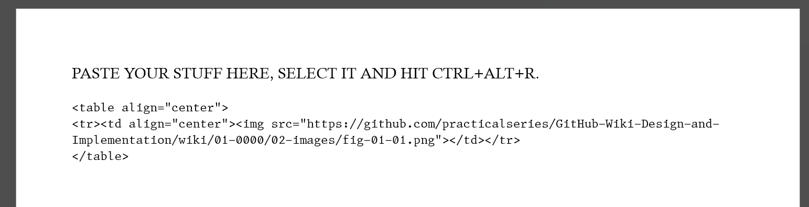
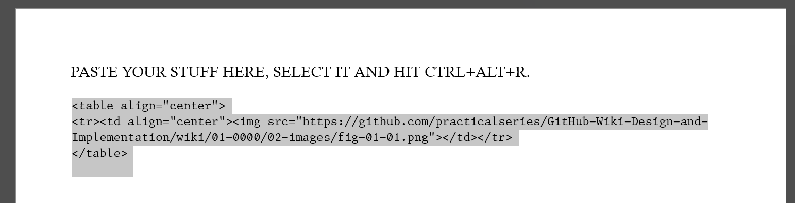
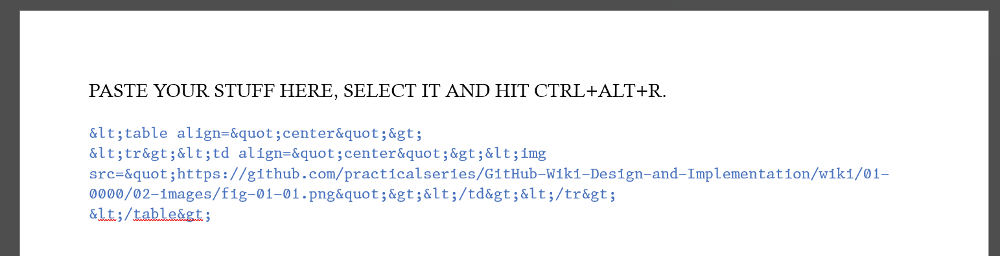

<a name="idtop"></a><!-- 🟢TOP OF PAGE - MARKER  (BLANK LINE BELOW)   -->

<!-- 🟢TOP OF PAGE - LOGO IMAGE -->
<p align="right"></p>      <!-- 🟢TOP OF PAGE - WEB ID     --> 

<table name="t-TOC-01" align="center"><!-- TABLE START🔽🔽(BLANK LINE ABOVE) -->
<!-- DATA ROW -->   <tr>
                        <td width="506" align="left" valign="top">
<details ><!-- HOME          🟢🟢🟢 UNNUMBERED, COLLAPSIBLE -->
<summary>&emsp;&ensp;&nbsp;<a href="../Home.md"><!-- HEAD -->Home</a>
</summary><!-- BLANK LINE BELOW -->

&emsp;&emsp;&emsp;&emsp;&emsp;&ensp;&nbsp;[The GitHub Wiki](../Home.md#github-wiki--design-and-implementation)<br>
&emsp;&emsp;&emsp;&emsp;&emsp;&ensp;&nbsp;[What does this guide cover?](../Home.md#what-does-this-guide-cover)<br>
&emsp;&emsp;&emsp;&emsp;&emsp;&ensp;&nbsp;[A note by the Author](../Home.md#a-note-by-the-author)<br>
</details><!--               🟩🟩🟩 -->

<details ><!-- LICENCE       🟢🟢🟢 UNNUMBERED, COLLAPSIBLE -->
<summary>&emsp;&ensp;&nbsp;<a href="../00-0000/Licence.md"><!-- HEAD -->Licence</a>
</summary><!-- BLANK LINE BELOW -->

&emsp;&emsp;&emsp;&emsp;&emsp;&ensp;&nbsp;[The licences and other details](../00-0000/Licence.md#the-licences-and-other-details)<br>
&emsp;&emsp;&emsp;&emsp;&emsp;&ensp;&nbsp;[The Licence](../00-0000/Licence.md#the-licence)<br>
&emsp;&emsp;&emsp;&emsp;&emsp;&ensp;&nbsp;[Why did I choose the MIT Licence?](../00-0000/Licence.md#why-did-i-choose-the-mit-licence)<br>
&emsp;&emsp;&emsp;&emsp;&emsp;&ensp;&nbsp;[Permissive licences](../00-0000/Licence.md#permissive-licences)<br>
&emsp;&emsp;&emsp;&emsp;&emsp;&ensp;&nbsp;[Copyleft licence](../00-0000/Licence.md#copyleft-licence)<br>
&emsp;&emsp;&emsp;&emsp;&emsp;&ensp;&nbsp;[Limiting liabilities](../00-0000/Licence.md#limiting-liabilities)<br>
&emsp;&emsp;&emsp;&emsp;&emsp;&ensp;&nbsp;[Which licence to use?](../00-0000/Licence.md#which-licence-to-use)<br>
&emsp;&emsp;&emsp;&emsp;&emsp;&ensp;&nbsp;[A note on spelling: licence or license](../00-0000/Licence.md#a-note-on-spelling-licence-or-license)<br>
</details><!--               🟩🟩🟩 -->

<details><!-- [SECTION 01]   🟢🟢🟢 SECTION GENERAL SINGLE DIGIT CHAPTER-->
<summary><a href="../01-0000/01%20Introducing%20the%20GitHub%20Wiki.md">1<!-- NUM -->&ensp;&nbsp;&nbsp;&thinsp;<!-- HEAD -->Introducing the GitHub Wiki</a>
</summary><!-- BLANK LINE BELOW -->

&emsp;&ensp;&hairsp;[1.1&emsp;&emsp;&nbsp;&nbsp;&thinsp;&hairsp;What are GitHub Wiki pages?](../01-0000/01%20Introducing%20the%20GitHub%20Wiki.md#11what-are-github-wiki-pages)<br>
&emsp;&ensp;&hairsp;[1.2&emsp;&emsp;&nbsp;&nbsp;&thinsp;&hairsp;Understanding the Wiki pages](../01-0000/01%20Introducing%20the%20GitHub%20Wiki.md#12understanding-the-wiki-pages)<br>
&emsp;&ensp;&hairsp;[1.3&emsp;&emsp;&nbsp;&nbsp;&thinsp;&hairsp;Creating a Wiki for a repository](../01-0000/01%20Introducing%20the%20GitHub%20Wiki.md#13creating-a-wiki-for-a-repository)<br>
&emsp;&ensp;&hairsp;[1.3.1&emsp;&nbsp;&nbsp;&nbsp;&nbsp;Creating the first Wiki page](../01-0000/01%20Introducing%20the%20GitHub%20Wiki.md#131creating-the-first-wiki-page)<br>
&emsp;&ensp;&hairsp;[1.3.2&emsp;&nbsp;&nbsp;&nbsp;&nbsp;Creating additional pages](../01-0000/01%20Introducing%20the%20GitHub%20Wiki.md#132creating-additional-pages)<br>
&emsp;&ensp;&hairsp;[1.3.3&emsp;&nbsp;&nbsp;&nbsp;&nbsp;Editing a Wiki page](../01-0000/01%20Introducing%20the%20GitHub%20Wiki.md#133editing-a-wiki-page)<br>
&emsp;&ensp;&hairsp;[1.4&emsp;&emsp;&nbsp;&nbsp;&thinsp;&hairsp;The Wiki is its own repository](../01-0000/01%20Introducing%20the%20GitHub%20Wiki.md#14the-wiki-is-its-own-repository)<br>
&emsp;&ensp;&hairsp;[1.4.1&emsp;&nbsp;&nbsp;&nbsp;&nbsp;Viewing a Wiki page history](../01-0000/01%20Introducing%20the%20GitHub%20Wiki.md#141viewing-a-wiki-page-history)<br>
&emsp;&ensp;&hairsp;[1.4.2&emsp;&nbsp;&nbsp;&nbsp;&nbsp;How GitHub handles Wiki branche](../01-0000/01%20Introducing%20the%20GitHub%20Wiki.md#142how-github-handles-wiki-branches)<br>
&emsp;&ensp;&hairsp;[1.4.3&emsp;&nbsp;&nbsp;&nbsp;&nbsp;The Wiki link to the main repository](../01-0000/01%20Introducing%20the%20GitHub%20Wiki.md#143the-wiki-and-its-link-to-the-main-repository)<br>
&emsp;&ensp;&hairsp;[1.5&emsp;&emsp;&nbsp;&nbsp;&thinsp;&hairsp;Basic components of a Wiki page](../01-0000/01%20Introducing%20the%20GitHub%20Wiki.md#15basic-components-of-a-wiki-page)<br>
&emsp;&ensp;&hairsp;[1.5.1&emsp;&nbsp;&nbsp;&nbsp;&nbsp;Title bar and revision](../01-0000/01%20Introducing%20the%20GitHub%20Wiki.md#151title-bar-and-revision)<br>
&emsp;&ensp;&hairsp;[1.5.2&emsp;&nbsp;&nbsp;&nbsp;&nbsp;Contents (pages) area](../01-0000/01%20Introducing%20the%20GitHub%20Wiki.md#152contents-pages-area)<br>
&emsp;&emsp;&emsp;&emsp;&emsp;&ensp;&nbsp;[Listing pages in the order you want](../01-0000/01%20Introducing%20the%20GitHub%20Wiki.md#listing-the-pages-in-the-order-you-want)<br>
&emsp;&ensp;&hairsp;[1.5.3&emsp;&nbsp;&nbsp;&nbsp;&nbsp;Sidebars](../01-0000/01%20Introducing%20the%20GitHub%20Wiki.md#153sidebars)<br>
&emsp;&ensp;&hairsp;[1.5.4&emsp;&nbsp;&nbsp;&nbsp;&nbsp;Footers](../01-0000/01%20Introducing%20the%20GitHub%20Wiki.md#154footers)<br>
&emsp;&ensp;&hairsp;[1.6&emsp;&emsp;&nbsp;&nbsp;&thinsp;&hairsp;Sidebars and footers](../01-0000/01%20Introducing%20the%20GitHub%20Wiki.md#16sidebars-and-footers)<br>
&emsp;&ensp;&hairsp;[1.6.1&emsp;&nbsp;&nbsp;&nbsp;&nbsp;Creating a sidebar and footer](../01-0000/01%20Introducing%20the%20GitHub%20Wiki.md#161creating-a-sidebar-and-footer-in-github)<br>
</details><!--               🟩🟩🟩 -->

<details><!-- [SECTION 02]   🟢🟢🟢 SECTION GENERAL SINGLE DIGIT CHAPTER-->
<summary><a href="../02-0000/02%20Cloning%20a%20Wiki.md">2<!-- NUM -->&ensp;&nbsp;&nbsp;&thinsp;<!-- HEAD -->Cloning a Wiki</a>
</summary><!-- BLANK LINE BELOW -->

&emsp;&ensp;&hairsp;[2.1&emsp;&emsp;&nbsp;&nbsp;&thinsp;&hairsp;Why clone a Wiki?](../02-0000/02%20Cloning%20a%20Wiki.md#21why-clone-a-wiki)<br>
&emsp;&ensp;&hairsp;[2.2&emsp;&emsp;&nbsp;&nbsp;&thinsp;&hairsp;How to clone a Wiki](../02-0000/02%20Cloning%20a%20Wiki.md#22how-to-clone-a-wiki)<br>
&emsp;&ensp;&hairsp;[2.3&emsp;&emsp;&nbsp;&nbsp;&thinsp;&hairsp;Pushing local changes to GitHub](../02-0000/02%20Cloning%20a%20Wiki.md#23pushing-local-changes-to-github)<br>
&emsp;&ensp;&hairsp;[2.3.1&emsp;&nbsp;&nbsp;&nbsp;&nbsp;Configuring username and email](../02-0000/02%20Cloning%20a%20Wiki.md#231configuring-a-git-username-and-email-address)<br>
&emsp;&ensp;&hairsp;[2.3.2&emsp;&nbsp;&nbsp;&nbsp;&nbsp;Modifying the local repository](../02-0000/02%20Cloning%20a%20Wiki.md#232modifying-the-local-repository)<br>
&emsp;&ensp;&hairsp;[2.3.3&emsp;&nbsp;&nbsp;&nbsp;&nbsp;Committing and synchronising](../02-0000/02%20Cloning%20a%20Wiki.md#233committing-and-synchronising-the-changes)<br>
</details><!--               🟩🟩🟩 -->

<details><!-- [SECTION 03]   🟢🟢🟢 SECTION GENERAL SINGLE DIGIT CHAPTER-->
<summary><a href="../03-0000/03%20A%20Wiki%20folder%20structure.md">3<!-- NUM -->&ensp;&nbsp;&nbsp;&thinsp;<!-- HEAD -->A Wiki folder structure</a>
</summary><!-- BLANK LINE BELOW -->

&emsp;&ensp;&hairsp;[3.1&emsp;&emsp;&nbsp;&nbsp;&thinsp;&hairsp;The default arrangement](../03-0000/03%20A%20Wiki%20folder%20structure.md#31the-default-arrangement)<br>
&emsp;&ensp;&hairsp;[3.2&emsp;&emsp;&nbsp;&nbsp;&thinsp;&hairsp;Create a sidebar or footer locally](../03-0000/03%20A%20Wiki%20folder%20structure.md#32create-a-sidebar-or-footer-locally)<br>
&emsp;&ensp;&hairsp;[3.3&emsp;&emsp;&nbsp;&nbsp;&thinsp;&hairsp;Page naming and Wiki limits](../03-0000/03%20A%20Wiki%20folder%20structure.md#33page-naming-and-wiki-limits)<br>
&emsp;&ensp;&hairsp;[3.3.1&emsp;&nbsp;&nbsp;&nbsp;&nbsp;Supported file types](../03-0000/03%20A%20Wiki%20folder%20structure.md#331supported-file-types)<br>
&emsp;&ensp;&hairsp;[3.3.2&emsp;&nbsp;&nbsp;&nbsp;&nbsp;Page names and numbering](../03-0000/03%20A%20Wiki%20folder%20structure.md#332page-names-and-numbering)<br>
&emsp;&ensp;&hairsp;[3.3.3&emsp;&nbsp;&nbsp;&nbsp;&nbsp;Rules for page numbering](../03-0000/03%20A%20Wiki%20folder%20structure.md#333rules-for-page-numbering)<br>
&emsp;&ensp;&hairsp;[3.3.4&emsp;&nbsp;&nbsp;&nbsp;&nbsp;Limits for Wiki pages](../03-0000/03%20A%20Wiki%20folder%20structure.md#334limits-for-wiki-pages)<br>
&emsp;&ensp;&hairsp;[3.4&emsp;&emsp;&nbsp;&nbsp;&thinsp;&hairsp;A Practical Wiki folder structure](../03-0000/03%20A%20Wiki%20folder%20structure.md#34a-practical-wiki-folder-structure)<br>
&emsp;&ensp;&hairsp;[3.4.1&emsp;&nbsp;&nbsp;&nbsp;&nbsp;Subfolder names for Wiki pages](../03-0000/03%20A%20Wiki%20folder%20structure.md#341subfolder-names-for-wiki-pages)<br>
&emsp;&ensp;&hairsp;[3.4.2&emsp;&nbsp;&nbsp;&nbsp;&nbsp;Storing images and other data](../03-0000/03%20A%20Wiki%20folder%20structure.md#342storing-images-and-other-data)<br>
</details><!--               🟩🟩🟩 -->

<details><!-- [SECTION 04]   🟢🟢🟢 SECTION GENERAL SINGLE DIGIT CHAPTER-->
<summary><a href="../04-0000/04%20Different%20sidebars%20and%20footers.md">4<!-- NUM -->&ensp;&nbsp;&nbsp;&thinsp;<!-- HEAD -->Different sidebars and footers</a>
</summary><!-- BLANK LINE BELOW -->

&emsp;&ensp;&hairsp;[4.1&emsp;&emsp;&nbsp;&nbsp;&thinsp;&hairsp;How sidebars work](../04-0000/04%20Different%20sidebars%20and%20footers.md#41how-sidebars-work)<br>
&emsp;&ensp;&hairsp;[4.1.1&emsp;&nbsp;&nbsp;&nbsp;&nbsp;The PracticalSeries sidebar](../04-0000/04%20Different%20sidebars%20and%20footers.md#411the-practicalseries-sidebar)<br>
&emsp;&ensp;&hairsp;[4.2&emsp;&emsp;&nbsp;&nbsp;&thinsp;&hairsp;How footers work](../04-0000/04%20Different%20sidebars%20and%20footers.md#42how-footers-work)<br>
&emsp;&ensp;&hairsp;[4.2.1&emsp;&nbsp;&nbsp;&nbsp;&nbsp;The PracticalSeries footer](../04-0000/04%20Different%20sidebars%20and%20footers.md#421the-practicalseries-footer)<br>
</details><!--               🟩🟩🟩 -->

<details><!-- [SECTION 05]   🟢🟢🟢 SECTION GENERAL SINGLE DIGIT CHAPTER-->
<summary><a href="../05-0000/05%20Markdown,%20GitHub%20Markdown%20and%20HTML.md">5<!-- NUM -->&ensp;&nbsp;&nbsp;&thinsp;<!-- HEAD -->Markdown, GitHub Markdown and HTML</a>
</summary><!-- BLANK LINE BELOW -->

&emsp;&ensp;&hairsp;[5.1&emsp;&emsp;&nbsp;&nbsp;&thinsp;&hairsp;Some useful Markdown sites](../05-0000/05%20Markdown,%20GitHub%20Markdown%20and%20HTML.md#51some-useful-markdown-sites)<br>
&emsp;&ensp;&hairsp;[5.2&emsp;&emsp;&nbsp;&nbsp;&thinsp;&hairsp;An overview of Markdown](../05-0000/05%20Markdown,%20GitHub%20Markdown%20and%20HTML.md#52an-overview-of-markdown)<br>
&emsp;&ensp;&hairsp;[5.3&emsp;&emsp;&nbsp;&nbsp;&thinsp;&hairsp;How Markdown works](../05-0000/05%20Markdown,%20GitHub%20Markdown%20and%20HTML.md#53how-markdown-works)<br>
&emsp;&ensp;&hairsp;[5.4&emsp;&emsp;&nbsp;&nbsp;&thinsp;&hairsp;Markdown flavours](../05-0000/05%20Markdown,%20GitHub%20Markdown%20and%20HTML.md#54markdown-flavours)<br>
&emsp;&ensp;&hairsp;[5.4.1&emsp;&nbsp;&nbsp;&nbsp;&nbsp;GitHub Flavoured Markdown (GFM)](../05-0000/05%20Markdown,%20GitHub%20Markdown%20and%20HTML.md#541github-flavoured-markdown-gfm)<br>
&emsp;&ensp;&hairsp;[5.5&emsp;&emsp;&nbsp;&nbsp;&thinsp;&hairsp;HTML and Markdown](../05-0000/05%20Markdown,%20GitHub%20Markdown%20and%20HTML.md#55html-and-markdown)<br>
&emsp;&ensp;&hairsp;[5.5.1&emsp;&nbsp;&nbsp;&nbsp;&nbsp;HTML with GFM](../05-0000/05%20Markdown,%20GitHub%20Markdown%20and%20HTML.md#551html-with-github-flavoured-markdown)<br>
&emsp;&emsp;&emsp;&emsp;&emsp;&ensp;&nbsp;[GFM blacklisted HTML tags](../05-0000/05%20Markdown,%20GitHub%20Markdown%20and%20HTML.md#gfm-blacklisted-html-tags)<br>
&emsp;&emsp;&emsp;&emsp;&emsp;&ensp;&nbsp;[GFM whitelisted HTML tags](../05-0000/05%20Markdown,%20GitHub%20Markdown%20and%20HTML.md#gfm-whitelisted-html-tags)<br>
&emsp;&emsp;&emsp;&emsp;&emsp;&ensp;&nbsp;[GFM HTML tags - the grey area](../05-0000/05%20Markdown,%20GitHub%20Markdown%20and%20HTML.md#gfm-html-tags--the-grey-area)<br>
&emsp;&emsp;&emsp;&emsp;&emsp;&ensp;&nbsp;[GFM whitelisted HTML attributes](../05-0000/05%20Markdown,%20GitHub%20Markdown%20and%20HTML.md#gfm-whitelisted-html-attributes)<br>
&emsp;&ensp;&hairsp;[5.5.2&emsp;&nbsp;&nbsp;&nbsp;&nbsp;PracticalSeries and Markdown](../05-0000/05%20Markdown,%20GitHub%20Markdown%20and%20HTML.md#552practicalseries-and-markdown)<br>
&emsp;&ensp;&hairsp;[5.6&emsp;&emsp;&nbsp;&nbsp;&thinsp;&hairsp;Markdown difference between files](../05-0000/05%20Markdown,%20GitHub%20Markdown%20and%20HTML.md#56markdown-difference-between-files)<br>
</details><!--               🟩🟩🟩 -->

<details><!-- [SECTION 06]   🟢🟢🟢 SECTION GENERAL SINGLE DIGIT CHAPTER-->
<summary><a href="../06-0000/06%20Basic%20Markdown%20and%20text%20formatting.md">6<!-- NUM -->&ensp;&nbsp;&nbsp;&thinsp;<!-- HEAD -->Basic Markdown and text formatting</a>
</summary><!-- BLANK LINE BELOW -->

&emsp;&ensp;&hairsp;[6.1&emsp;&emsp;&nbsp;&nbsp;&thinsp;&hairsp;Body text and fonts](../06-0000/06%20Basic%20Markdown%20and%20text%20formatting.md#61body-text-and-fonts)<br>
&emsp;&ensp;&hairsp;[6.1.1&emsp;&nbsp;&nbsp;&nbsp;&nbsp;Body text responsive design](../06-0000/06%20Basic%20Markdown%20and%20text%20formatting.md#611body-text-responsive-design)<br>
&emsp;&ensp;&hairsp;[6.1.2&emsp;&nbsp;&nbsp;&nbsp;&nbsp;Body text in sidebars and footers](../06-0000/06%20Basic%20Markdown%20and%20text%20formatting.md#612body-text-in-sidebars-and-footers)<br>
&emsp;&ensp;&hairsp;[6.1.3&emsp;&nbsp;&nbsp;&nbsp;&nbsp;Rules for body text](../06-0000/06%20Basic%20Markdown%20and%20text%20formatting.md#613body-text-markdown-rules)<br>
&emsp;&ensp;&hairsp;[6.1.4&emsp;&nbsp;&nbsp;&nbsp;&nbsp;Body text examples](../06-0000/06%20Basic%20Markdown%20and%20text%20formatting.md#614body-text-examples)<br>
&emsp;&ensp;&hairsp;[6.1.5&emsp;&nbsp;&nbsp;&nbsp;&nbsp;Alignment of Body text](../06-0000/06%20Basic%20Markdown%20and%20text%20formatting.md#615alignment-of-body-text)<br>
&emsp;&emsp;&emsp;&emsp;&emsp;&ensp;&nbsp;[Left aligned text (default)](../06-0000/06%20Basic%20Markdown%20and%20text%20formatting.md#left-aligned-text-default)<br>
&emsp;&emsp;&emsp;&emsp;&emsp;&ensp;&nbsp;[Right aligned text](../06-0000/06%20Basic%20Markdown%20and%20text%20formatting.md#right-aligned-text)<br>
&emsp;&emsp;&emsp;&emsp;&emsp;&ensp;&nbsp;[Centred text](../06-0000/06%20Basic%20Markdown%20and%20text%20formatting.md#centred-text)<br>
&emsp;&emsp;&emsp;&emsp;&emsp;&ensp;&nbsp;[Justified text](../06-0000/06%20Basic%20Markdown%20and%20text%20formatting.md#justified-text)<br>
&emsp;&ensp;&hairsp;[6.1.6&emsp;&nbsp;&nbsp;&nbsp;&nbsp;Body text propertie](../06-0000/06%20Basic%20Markdown%20and%20text%20formatting.md#616body-text-properties)<br>
&emsp;&ensp;&hairsp;[6.2&emsp;&emsp;&nbsp;&nbsp;&thinsp;&hairsp;Paragraphs and line breaks](../06-0000/06%20Basic%20Markdown%20and%20text%20formatting.md#62paragraphs-and-line-breaks)<br>
&emsp;&ensp;&hairsp;[6.2.1&emsp;&nbsp;&nbsp;&nbsp;&nbsp;Forced line break](../06-0000/06%20Basic%20Markdown%20and%20text%20formatting.md#621forced-line-break)<br>
&emsp;&ensp;&hairsp;[6.2.2&emsp;&nbsp;&nbsp;&nbsp;&nbsp;Blank line and a line break](../06-0000/06%20Basic%20Markdown%20and%20text%20formatting.md#622blank-line-and-a-line-break)<br>
&emsp;&ensp;&hairsp;[6.2.3&emsp;&nbsp;&nbsp;&nbsp;&nbsp;Trailing space line break](../06-0000/06%20Basic%20Markdown%20and%20text%20formatting.md#623trailing-space-line-break)<br>
&emsp;&ensp;&hairsp;[6.2.4&emsp;&nbsp;&nbsp;&nbsp;&nbsp;Paragraph and line break rules](../06-0000/06%20Basic%20Markdown%20and%20text%20formatting.md#624paragraph-and-line-break-markdown-rules)<br>
&emsp;&ensp;&hairsp;[6.2.5&emsp;&nbsp;&nbsp;&nbsp;&nbsp;Paragraph and line break examples](../06-0000/06%20Basic%20Markdown%20and%20text%20formatting.md#625paragraph-and-line-break-examples)<br>
&emsp;&ensp;&hairsp;[6.3&emsp;&emsp;&nbsp;&nbsp;&thinsp;&hairsp;Horizontal line](../06-0000/06%20Basic%20Markdown%20and%20text%20formatting.md#63horizontal-line)<br>
&emsp;&ensp;&hairsp;[6.3.1&emsp;&nbsp;&nbsp;&nbsp;&nbsp;Rules for horizontal lines](../06-0000/06%20Basic%20Markdown%20and%20text%20formatting.md#631markdown-rules-for-horizontal-lines)<br>
&emsp;&ensp;&hairsp;[6.4&emsp;&emsp;&nbsp;&nbsp;&thinsp;&hairsp;Emphasis with bold](../06-0400/06.04%20Basic%20Markdown%20and%20text%20formatting.md#64emphasis-with-bold)<br>
&emsp;&ensp;&hairsp;[6.4.1&emsp;&nbsp;&nbsp;&nbsp;&nbsp;Rules for bold](../06-0400/06.04%20Basic%20Markdown%20and%20text%20formatting.md#641markdown-rules-for-bold)<br>
&emsp;&ensp;&hairsp;[6.4.2&emsp;&nbsp;&nbsp;&nbsp;&nbsp;Bold text examples](../06-0400/06.04%20Basic%20Markdown%20and%20text%20formatting.md#642bold-text-examples)<br>
&emsp;&ensp;&hairsp;[6.5&emsp;&emsp;&nbsp;&nbsp;&thinsp;&hairsp;Emphasis with italics](../06-0400/06.04%20Basic%20Markdown%20and%20text%20formatting.md#65emphasis-with-italics)<br>
&emsp;&ensp;&hairsp;[6.5.1&emsp;&nbsp;&nbsp;&nbsp;&nbsp;Rules for italics](../06-0400/06.04%20Basic%20Markdown%20and%20text%20formatting.md#651markdown-rules-for-italics)<br>
&emsp;&ensp;&hairsp;[6.5.2&emsp;&nbsp;&nbsp;&nbsp;&nbsp;Italic text examples](../06-0400/06.04%20Basic%20Markdown%20and%20text%20formatting.md#652italic-text-examples)<br>
&emsp;&ensp;&hairsp;[6.6&emsp;&emsp;&nbsp;&nbsp;&thinsp;&hairsp;Emphasis with bold and italics](../06-0400/06.04%20Basic%20Markdown%20and%20text%20formatting.md#66emphasis-with-both-bold-and-italics)<br>
&emsp;&ensp;&hairsp;[6.6.1&emsp;&nbsp;&nbsp;&nbsp;&nbsp;Rules for bold and italics](../06-0400/06.04%20Basic%20Markdown%20and%20text%20formatting.md#661markdown-rules-for-both-bold-and-italics)<br>
&emsp;&ensp;&hairsp;[6.6.2&emsp;&nbsp;&nbsp;&nbsp;&nbsp;Bold and italic text examples](../06-0400/06.04%20Basic%20Markdown%20and%20text%20formatting.md#662both-bold-and-italic-text-examples)<br>
&emsp;&ensp;&hairsp;[6.7&emsp;&emsp;&nbsp;&nbsp;&thinsp;&hairsp;Emphasis with underlining](../06-0700/06.07%20Basic%20Markdown%20and%20text%20formatting.md#67emphasis-with-underlining)<br>
&emsp;&ensp;&hairsp;[6.7.1&emsp;&nbsp;&nbsp;&nbsp;&nbsp;Rules for underlining](../06-0700/06.07%20Basic%20Markdown%20and%20text%20formatting.md#671markdown-rules-for-underlining)<br>
&emsp;&ensp;&hairsp;[6.7.2&emsp;&nbsp;&nbsp;&nbsp;&nbsp;Underlining text examples](../06-0700/06.07%20Basic%20Markdown%20and%20text%20formatting.md#672underlining-text-examples)<br>
&emsp;&ensp;&hairsp;[6.8&emsp;&emsp;&nbsp;&nbsp;&thinsp;&hairsp;Emphasis with strikethrough](../06-0700/06.07%20Basic%20Markdown%20and%20text%20formatting.md#68emphasis-with-strikethrough)<br>
&emsp;&ensp;&hairsp;[6.8.1&emsp;&nbsp;&nbsp;&nbsp;&nbsp;Rules for strikethrough](../06-0700/06.07%20Basic%20Markdown%20and%20text%20formatting.md#681markdown-rules-for-strikethrough)<br>
&emsp;&ensp;&hairsp;[6.8.2&emsp;&nbsp;&nbsp;&nbsp;&nbsp;Strikethrough text examples](../06-0700/06.07%20Basic%20Markdown%20and%20text%20formatting.md#682strikethrough-text-examples)<br>
&emsp;&ensp;&hairsp;[6.9&emsp;&emsp;&nbsp;&nbsp;&thinsp;&hairsp;Superscript and subscript](../06-0700/06.07%20Basic%20Markdown%20and%20text%20formatting.md#69superscript-and-subscript)<br>
&emsp;&ensp;&hairsp;[6.9.1&emsp;&nbsp;&nbsp;&nbsp;&nbsp;Rules for superscript and subscript](../06-0700/06.07%20Basic%20Markdown%20and%20text%20formatting.md#691markdown-rules-for-superscript-and-subscript)<br>
&emsp;&ensp;&hairsp;[6.9.2&emsp;&nbsp;&nbsp;&nbsp;&nbsp;Superscript and subscript examples](../06-0700/06.07%20Basic%20Markdown%20and%20text%20formatting.md#692superscript-and-subscript-text-examples)<br>
&emsp;&ensp;&hairsp;[6.10&emsp;&emsp;&thinsp;&hairsp;Headings](../06-1000/06.10%20Basic%20Markdown%20and%20text%20formatting.md#610headings)<br>
&emsp;&emsp;&emsp;&emsp;&emsp;&ensp;&nbsp;[Alternatives for heading 1 and 2](../06-1000/06.10%20Basic%20Markdown%20and%20text%20formatting.md#alternatives-for-heading-1-and-2)<br>
&emsp;&ensp;&hairsp;[6.10.1&emsp;&nbsp;&nbsp;Headings Markdown rules](../06-1000/06.10%20Basic%20Markdown%20and%20text%20formatting.md#6101headings-markdown-rules)<br>
&emsp;&ensp;&hairsp;[6.10.2&emsp;&nbsp;&nbsp;Heading properties](../06-1000/06.10%20Basic%20Markdown%20and%20text%20formatting.md#6102heading-properties)<br>
</details><!--               🟩🟩🟩 -->

<details><!-- [SECTION 07]   🟢🟢🟢 SECTION GENERAL SINGLE DIGIT CHAPTER-->
<summary><a href="../07-0000/07%20Special%20characters%20and%20escaping%20characters.md">7<!-- NUM -->&ensp;&nbsp;&nbsp;&thinsp;<!-- HEAD -->Special characters and escaping characters</a>
</summary><!-- BLANK LINE BELOW -->

&emsp;&ensp;&hairsp;[7.1&emsp;&emsp;&nbsp;&nbsp;&thinsp;&hairsp;Escape characters and codes](../07-0000/07%20Special%20characters%20and%20escaping%20characters.md#71escape-characters-and-character-codes)<br>
&emsp;&ensp;&hairsp;[7.1.1&emsp;&nbsp;&nbsp;&nbsp;&nbsp;Markdown escape sequences](../07-0000/07%20Special%20characters%20and%20escaping%20characters.md#711markdown-escape-sequences)<br>
&emsp;&ensp;&hairsp;[7.1.2&emsp;&nbsp;&nbsp;&nbsp;&nbsp;HTML escape sequences](../07-0000/07%20Special%20characters%20and%20escaping%20characters.md#712html-escape-sequences)<br>
&emsp;&ensp;&hairsp;[7.1.3&emsp;&nbsp;&nbsp;&nbsp;&nbsp;Decimal and hexadecimal codes](../07-0000/07%20Special%20characters%20and%20escaping%20characters.md#713html-decimal-and-hexadecimal-escape-codes)<br>
&emsp;&emsp;&emsp;&emsp;&emsp;&ensp;&nbsp;[Hexadecimal escape codes](../07-0000/07%20Special%20characters%20and%20escaping%20characters.md#hexadecimal-escape-codes)<br>
&emsp;&ensp;&hairsp;[7.2&emsp;&emsp;&nbsp;&nbsp;&thinsp;&hairsp;Special space characters](../07-0000/07%20Special%20characters%20and%20escaping%20characters.md#72special-space-characters)<br>
&emsp;&ensp;&hairsp;[7.2.1&emsp;&nbsp;&nbsp;&nbsp;&nbsp;Escape sequence restrictions](../07-0000/07%20Special%20characters%20and%20escaping%20characters.md#721escape-sequence-restrictions-in-github-html)<br>
&emsp;&ensp;&hairsp;[7.3&emsp;&emsp;&nbsp;&nbsp;&thinsp;&hairsp;Emojis and emoticons](../07-0000/07%20Special%20characters%20and%20escaping%20characters.md#73emojis-and-emoticons)<br>
&emsp;&emsp;&emsp;&emsp;&emsp;&ensp;&nbsp;[A note by the Author about emojis](../07-0000/07%20Special%20characters%20and%20escaping%20characters.md#a-note-by-the-author-about-emojis)<br>
&emsp;&ensp;&hairsp;[7.4&emsp;&emsp;&nbsp;&nbsp;&thinsp;&hairsp;Comments](../07-0000/07%20Special%20characters%20and%20escaping%20characters.md#74comments)<br>
</details><!--               🟩🟩🟩 -->

<details><!-- [SECTION 08]   🟢🟢🟢 SECTION GENERAL SINGLE DIGIT CHAPTER-->
<summary><a href="../08-0000/08%20Block%20quotes,%20lists%20and%20alerts.md">8<!-- NUM -->&ensp;&nbsp;&nbsp;&thinsp;<!-- HEAD -->Block quotes, lists and alerts</a>
</summary><!-- BLANK LINE BELOW -->

&emsp;&ensp;&hairsp;[8.1&emsp;&emsp;&nbsp;&nbsp;&thinsp;&hairsp;Block quotes](../08-0000/08%20Block%20quotes,%20lists%20and%20alerts.md#81block-quotes)<br>
&emsp;&ensp;&hairsp;[8.1.1&emsp;&nbsp;&nbsp;&nbsp;&nbsp;Nested block quotes](../08-0000/08%20Block%20quotes,%20lists%20and%20alerts.md#811nested-block-quotes)<br>
&emsp;&ensp;&hairsp;[8.1.2&emsp;&nbsp;&nbsp;&nbsp;&nbsp;Adding other elements](../08-0000/08%20Block%20quotes,%20lists%20and%20alerts.md#812other-elements-inside-block-quotes)<br>
&emsp;&ensp;&hairsp;[8.1.3&emsp;&nbsp;&nbsp;&nbsp;&nbsp;Rules for block quotes](../08-0000/08%20Block%20quotes,%20lists%20and%20alerts.md#813markdown-rules-for-block-quotes)<br>
&emsp;&ensp;&hairsp;[8.2&emsp;&emsp;&nbsp;&nbsp;&thinsp;&hairsp;Unordered (unnumbered) lists](../08-0000/08%20Block%20quotes,%20lists%20and%20alerts.md#82unordered-unnumbered-lists)<br>
&emsp;&ensp;&hairsp;[8.2.1&emsp;&nbsp;&nbsp;&nbsp;&nbsp;Nested unordered lists](../08-0000/08%20Block%20quotes,%20lists%20and%20alerts.md#821nested-unordered-lists)<br>
&emsp;&ensp;&hairsp;[8.2.2&emsp;&nbsp;&nbsp;&nbsp;&nbsp;Type of bullet point](../08-0000/08%20Block%20quotes,%20lists%20and%20alerts.md#822type-of-bullet-point)<br>
&emsp;&ensp;&hairsp;[8.2.3&emsp;&nbsp;&nbsp;&nbsp;&nbsp;Indents and spacing](../08-0000/08%20Block%20quotes,%20lists%20and%20alerts.md#823indents-and-spacing)<br>
&emsp;&ensp;&hairsp;[8.2.4&emsp;&nbsp;&nbsp;&nbsp;&nbsp;Numbers in an unordered list](../08-0000/08%20Block%20quotes,%20lists%20and%20alerts.md#824numbers-in-an-unordered-list)<br>
&emsp;&ensp;&hairsp;[8.2.5&emsp;&nbsp;&nbsp;&nbsp;&nbsp;Adding paragraphs](../08-0000/08%20Block%20quotes,%20lists%20and%20alerts.md#825adding-paragraphs-to-an-unordered-list)<br>
&emsp;&ensp;&hairsp;[8.2.6&emsp;&nbsp;&nbsp;&nbsp;&nbsp;Adding other elements](../08-0000/08%20Block%20quotes,%20lists%20and%20alerts.md#826other-elements-inside-an-unordered-list)<br>
&emsp;&ensp;&hairsp;[8.2.7&emsp;&nbsp;&nbsp;&nbsp;&nbsp;Rules for unordered lists](../08-0000/08%20Block%20quotes,%20lists%20and%20alerts.md#827markdown-rules-for-unordered-lists)<br>
&emsp;&ensp;&hairsp;[8.3&emsp;&emsp;&nbsp;&nbsp;&thinsp;&hairsp;Ordered (numbered) lists](../08-0000/08%20Block%20quotes,%20lists%20and%20alerts.md#83ordered-numbered-lists)<br>
&emsp;&ensp;&hairsp;[8.3.1&emsp;&nbsp;&nbsp;&nbsp;&nbsp;Starting at a different number](../08-0000/08%20Block%20quotes,%20lists%20and%20alerts.md#831starting-at-a-different-number)<br>
&emsp;&ensp;&hairsp;[8.3.2&emsp;&nbsp;&nbsp;&nbsp;&nbsp;Nested ordered lists](../08-0000/08%20Block%20quotes,%20lists%20and%20alerts.md#832nested-ordered-lists)<br>
&emsp;&ensp;&hairsp;[8.3.3&emsp;&nbsp;&nbsp;&nbsp;&nbsp;Type of numbering](../08-0000/08%20Block%20quotes,%20lists%20and%20alerts.md#833type-of-numbering)<br>
&emsp;&ensp;&hairsp;[8.3.4&emsp;&nbsp;&nbsp;&nbsp;&nbsp;Indents and spacing](../08-0000/08%20Block%20quotes,%20lists%20and%20alerts.md#834indents-and-spacing)<br>
&emsp;&ensp;&hairsp;[8.3.5&emsp;&nbsp;&nbsp;&nbsp;&nbsp;Adding paragraphs](../08-0000/08%20Block%20quotes,%20lists%20and%20alerts.md#835adding-paragraphs-to-an-ordered-list)<br>
&emsp;&ensp;&hairsp;[8.3.6&emsp;&nbsp;&nbsp;&nbsp;&nbsp;Adding other elements](../08-0000/08%20Block%20quotes,%20lists%20and%20alerts.md#836other-elements-inside-an-ordered-list)<br>
&emsp;&ensp;&hairsp;[8.3.7&emsp;&nbsp;&nbsp;&nbsp;&nbsp;Rules for ordered lists](../08-0000/08%20Block%20quotes,%20lists%20and%20alerts.md#837markdown-rules-for-ordered-lists)<br>
&emsp;&ensp;&hairsp;[8.4&emsp;&emsp;&nbsp;&nbsp;&thinsp;&hairsp;Mixing ordered and unordered lists](../08-0000/08%20Block%20quotes,%20lists%20and%20alerts.md#84mixing-ordered-and-unordered-lists)<br>
&emsp;&ensp;&hairsp;[8.5&emsp;&emsp;&nbsp;&nbsp;&thinsp;&hairsp;Task lists (check boxes)](../08-0000/08%20Block%20quotes,%20lists%20and%20alerts.md#85task-lists-check-boxes)<br>
&emsp;&ensp;&hairsp;[8.5.1&emsp;&nbsp;&nbsp;&nbsp;&nbsp;Nested task lists](../08-0000/08%20Block%20quotes,%20lists%20and%20alerts.md#851nested-task-lists)<br>
&emsp;&ensp;&hairsp;[8.6&emsp;&emsp;&nbsp;&nbsp;&thinsp;&hairsp;Alerts](../08-0000/08%20Block%20quotes,%20lists%20and%20alerts.md#86alerts)<br>
&emsp;&ensp;&hairsp;[8.6.1&emsp;&nbsp;&nbsp;&nbsp;&nbsp;Rules for alerts](../08-0000/08%20Block%20quotes,%20lists%20and%20alerts.md#861markdown-rules-for-alerts)<br>
</details><!--               🟩🟩🟩 -->
                        </td>
                        <td width="506" align="left" valign="top">

<details><!-- [SECTION 09]   🟢🟢🟢 SECTION GENERAL SINGLE DIGIT CHAPTER-->
<summary><a href="../09-0000/09%20Links.md">9<!-- NUM -->&ensp;&nbsp;&nbsp;&thinsp;<!-- HEAD -->Links</a>
</summary><!-- BLANK LINE BELOW -->

&emsp;&ensp;&hairsp;[9.1&emsp;&emsp;&nbsp;&nbsp;&thinsp;&hairsp;Link to an external web page](../09-0000/09%20Links.md#91linking-to-an-external-web-page)<br>
&emsp;&ensp;&hairsp;[9.1.1&emsp;&nbsp;&nbsp;&nbsp;&nbsp;A direct link to a URL](../09-0000/09%20Links.md#911a-direct-link-to-a-url)<br>
&emsp;&ensp;&hairsp;[9.1.2&emsp;&nbsp;&nbsp;&nbsp;&nbsp;A link using substitute text](../09-0000/09%20Links.md#912a-link-using-substitute-text)<br>
&emsp;&ensp;&hairsp;[9.1.3&emsp;&nbsp;&nbsp;&nbsp;&nbsp;A link using tooltips](../09-0000/09%20Links.md#913a-link-using-substitute-text-with-tooltip)<br>
&emsp;&ensp;&hairsp;[9.2&emsp;&emsp;&nbsp;&nbsp;&thinsp;&hairsp;Link to another page in the Wiki](../09-0000/09%20Links.md#92linking-to-another-page-in-the-same-wiki)<br>
&emsp;&ensp;&hairsp;[9.2.1&emsp;&nbsp;&nbsp;&nbsp;&nbsp;Rules for linking to a Wiki page](../09-0000/09%20Links.md#921rules-for-linking-to-a-wiki-page)<br>
&emsp;&ensp;&hairsp;[9.3&emsp;&emsp;&nbsp;&nbsp;&thinsp;&hairsp;Link to headings on current page](../09-0000/09%20Links.md#93linking-to-headings-on-the-current-page)<br>
&emsp;&ensp;&hairsp;[9.3.1&emsp;&nbsp;&nbsp;&nbsp;&nbsp;Converting a heading to a link](../09-0000/09%20Links.md#931rules-for-converting-a-heading-to-a-link)<br>
&emsp;&ensp;&hairsp;[9.3.2&emsp;&nbsp;&nbsp;&nbsp;&nbsp;An example of a heading link](../09-0000/09%20Links.md#932an-example-of-a-heading-link)<br>
&emsp;&ensp;&hairsp;[9.3.3&emsp;&nbsp;&nbsp;&nbsp;&nbsp;Heading link with tooltips](../09-0000/09%20Links.md#933heading-link-with-tooltips)<br>
&emsp;&ensp;&hairsp;[9.4&emsp;&emsp;&nbsp;&nbsp;&thinsp;&hairsp;Link to headings on a different page](../09-0000/09%20Links.md#94linking-to-headings-on-a-different-page)<br>
&emsp;&ensp;&hairsp;[9.4.1&emsp;&nbsp;&nbsp;&nbsp;&nbsp;An example of a heading link](../09-0000/09%20Links.md#941an-example-of-a-heading-link)<br>
&emsp;&ensp;&hairsp;[9.5&emsp;&emsp;&nbsp;&nbsp;&thinsp;&hairsp;Link to a named element](../09-0500/09.05%20Links.md#95linking-to-a-named-element)<br>
&emsp;&emsp;&emsp;&emsp;&emsp;&ensp;&nbsp;[A note by the Author](../09-0500/09.05%20Links.md#a-note-by-the-author)<br>
&emsp;&ensp;&hairsp;[9.5.1&emsp;&nbsp;&nbsp;&nbsp;&nbsp;Link to a point on another page](../09-0500/09.05%20Links.md#951link-to-a-named-point-on-another-page)<br>
&emsp;&ensp;&hairsp;[9.6&emsp;&emsp;&nbsp;&nbsp;&thinsp;&hairsp;Downloading a file](../09-0500/09.05%20Links.md#96downloading-a-file)<br>
&emsp;&ensp;&hairsp;[9.6.1&emsp;&nbsp;&nbsp;&nbsp;&nbsp;The download attribute](../09-0500/09.05%20Links.md#961the-download-attribute)<br>
&emsp;&ensp;&hairsp;[9.6.2&emsp;&nbsp;&nbsp;&nbsp;&nbsp;Spaces in filenames](../09-0500/09.05%20Links.md#962spaces-in-filenames)<br>
&emsp;&ensp;&hairsp;[9.6.3&emsp;&nbsp;&nbsp;&nbsp;&nbsp;Downloading a .md file](../09-0500/09.05%20Links.md#963downloading-a-md-file)<br>
&emsp;&ensp;&hairsp;[9.7&emsp;&emsp;&nbsp;&nbsp;&thinsp;&hairsp;Reference style links](../09-0500/09.05%20Links.md#97reference-style-links)<br>
&emsp;&ensp;&hairsp;[9.8&emsp;&emsp;&nbsp;&nbsp;&thinsp;&hairsp;Relative links](../09-0500/09.05%20Links.md#98relative-links)<br>
&emsp;&ensp;&hairsp;[9.8.1&emsp;&nbsp;&nbsp;&nbsp;&nbsp;Relative links from any Wiki page](../09-0500/09.05%20Links.md#981relative-links-from-any-wiki-page)<br>
</details><!--               🟩🟩🟩 -->

<details><!-- [SECTION 10]   🟢🟢🟢 SECTION GENERAL DOUBLE DIGIT CHAPTER-->
<summary><a href="../10-0000/10%20Tables.md">10<!-- NUM -->&ensp;&thinsp;<!-- HEAD -->Tables</a>
</summary><!-- BLANK LINE BELOW -->

&emsp;&ensp;&hairsp;[10.1&emsp;&emsp;&thinsp;&hairsp;Markdown tables](../10-0000/10%20Tables.md#101markdown-tables)<br>
&emsp;&ensp;&hairsp;[10.1.1&emsp;&ensp;&hairsp;Horizontal alignment](../10-0000/10%20Tables.md#1011horizontal-alignment)<br>
&emsp;&ensp;&hairsp;[10.1.2&emsp;&ensp;&hairsp;Table construction](../10-0000/10%20Tables.md#1012table-construction)<br>
&emsp;&ensp;&hairsp;[10.1.3&emsp;&ensp;&hairsp;Vertical line breaks and alignment](../10-0000/10%20Tables.md#1013vertical-line-breaks-and-alignment)<br>
&emsp;&ensp;&hairsp;[10.1.4&emsp;&ensp;&hairsp;Making columns wider](../10-0000/10%20Tables.md#1014making-columns-wider)<br>
&emsp;&ensp;&hairsp;[10.1.5&emsp;&ensp;&hairsp;Other elements in a table](../10-0000/10%20Tables.md#1015other-elements-in-a-table)<br>
&emsp;&ensp;&hairsp;[10.1.6&emsp;&ensp;&hairsp;Markdown table restrictions](../10-0000/10%20Tables.md#1016markdown-table-restrictions)<br>
&emsp;&ensp;&hairsp;[10.2&emsp;&emsp;&thinsp;&hairsp;HTML tables](../10-0000/10%20Tables.md#102html-tables)<br>
&emsp;&ensp;&hairsp;[10.2.1&emsp;&ensp;&hairsp;A basic HTML table](../10-0000/10%20Tables.md#1021a-basic-html-table)<br>
&emsp;&ensp;&hairsp;[10.2.2&emsp;&ensp;&hairsp;Aligning a table on a page](../10-0000/10%20Tables.md#1022aligning-a-table-on-a-page)<br>
&emsp;&ensp;&hairsp;[10.2.3&emsp;&ensp;&hairsp;Text wrap and side-by-side tables](../10-0000/10%20Tables.md#1023text-wrap-and-side-by-side-tables)<br>
&emsp;&emsp;&emsp;&emsp;&emsp;&ensp;&nbsp;[What this means in practice](../10-0000/10%20Tables.md#what-this-means-in-practice)<br>
&emsp;&emsp;&emsp;&emsp;&emsp;&ensp;&nbsp;[The problem with the align attribute](../10-0000/10%20Tables.md#the-problem-with-the-align-attribute)<br>
&emsp;&emsp;&emsp;&emsp;&emsp;&ensp;&nbsp;[How to stop text wrapping](../10-0000/10%20Tables.md#how-to-stop-text-wrapping)<br>
&emsp;&ensp;&hairsp;[10.2.4&emsp;&ensp;&hairsp;Setting the width of a table column](../10-0000/10%20Tables.md#1024setting-the-width-of-a-table-column)<br>
&emsp;&ensp;&hairsp;[10.2.5&emsp;&ensp;&hairsp;Setting the height of a table row](../10-0000/10%20Tables.md#1025setting-the-height-of-a-table-row)<br>
&emsp;&ensp;&hairsp;[10.2.6&emsp;&ensp;&hairsp;Horizontal alignment](../10-0000/10%20Tables.md#1026horizontal-alignment)<br>
&emsp;&ensp;&hairsp;[10.2.7&emsp;&ensp;&hairsp;Vertical alignment](../10-0000/10%20Tables.md#1027vertical-alignment)<br>
&emsp;&ensp;&hairsp;[10.2.8&emsp;&ensp;&hairsp;Spanning columns and rows](../10-0000/10%20Tables.md#1028spanning-columns-and-rows)<br>
&emsp;&ensp;&hairsp;[10.2.9&emsp;&ensp;&hairsp;Table border](../10-0000/10%20Tables.md#1029table-border)<br>
&emsp;&ensp;&hairsp;[10.2.10&ensp;&nbsp;&nbsp;Giving a table a navigable name](../10-0000/10%20Tables.md#10210giving-a-table-a-navigable-name)<br>
&emsp;&ensp;&hairsp;[10.2.11&ensp;&nbsp;&nbsp;Additional HTML tags](../10-0000/10%20Tables.md#10211additional-html-tags)<br>
</details><!--               🟩🟩🟩 -->

<details><!-- [SECTION 11]   🟢🟢🟢 SECTION GENERAL DOUBLE DIGIT CHAPTER-->
<summary><a href="../11-0000/11%20Images.md">11<!-- NUM -->&ensp;&thinsp;<!-- HEAD -->Images</a>
</summary><!-- BLANK LINE BELOW -->

&emsp;&ensp;&hairsp;[11.1&emsp;&emsp;&thinsp;&hairsp;Markdown images](../11-0000/11%20Images.md#111markdown-images)<br>
&emsp;&ensp;&hairsp;[11.1.1&emsp;&ensp;&hairsp;Image size in Markdown](../11-0000/11%20Images.md#1111image-size-in-markdown)<br>
&emsp;&ensp;&hairsp;[11.1.2&emsp;&ensp;&hairsp;Making the image a link](../11-0000/11%20Images.md#1112making-the-image-a-link)<br>
&emsp;&ensp;&hairsp;[11.1.3&emsp;&ensp;&hairsp;Drag and drop image link](../11-0000/11%20Images.md#1113drag-and-drop-image-link)<br>
&emsp;&emsp;&emsp;&emsp;&emsp;&ensp;&nbsp;[A note by the Author](../11-0000/11%20Images.md#a-note-by-the-author)<br>
&emsp;&ensp;&hairsp;[11.2&emsp;&emsp;&thinsp;&hairsp;HTML images](../11-0000/11%20Images.md#112html-images)<br>
&emsp;&ensp;&hairsp;[11.2.1&emsp;&ensp;&hairsp;A basic HTML image](../11-0000/11%20Images.md#1121a-basic-html-image)<br>
&emsp;&ensp;&hairsp;[11.2.2&emsp;&ensp;&hairsp;Image size in HTML](../11-0000/11%20Images.md#1122image-size-in-html)<br>
&emsp;&ensp;&hairsp;[11.2.3&emsp;&ensp;&hairsp;Horizontal alignment](../11-0000/11%20Images.md#1123horizontal-alignment)<br>
&emsp;&ensp;&hairsp;[11.2.4&emsp;&ensp;&hairsp;Making the image a link](../11-0000/11%20Images.md#1124making-the-image-a-link)<br>
&emsp;&ensp;&hairsp;[11.2.5&emsp;&ensp;&hairsp;Using a table to contain an image](../11-0000/11%20Images.md#1125using-a-table-to-contain-an-image)<br>
&emsp;&ensp;&hairsp;[11.3&emsp;&emsp;&thinsp;&hairsp;Forcing an image refresh](../11-0000/11%20Images.md#113forcing-an-image-refresh)<br>
&emsp;&ensp;&hairsp;[11.4&emsp;&emsp;&thinsp;&hairsp;Using a spacer image](../11-0000/11%20Images.md#114using-a-spacer-image)<br>
&emsp;&ensp;&hairsp;[11.5&emsp;&emsp;&thinsp;&hairsp;Mermaid diagrams](../11-0500/11.05%20Images.md#115mermaid-diagrams)<br>
&emsp;&ensp;&hairsp;[11.5.1&emsp;&ensp;&hairsp;Inserting a Mermaid diagram](../11-0500/11.05%20Images.md#1151inserting-a-mermaid-diagram)<br>
&emsp;&ensp;&hairsp;[11.5.2&emsp;&ensp;&hairsp;The rendered Mermaid diagram](../11-0500/11.05%20Images.md#1152the-rendered-mermaid-diagram)<br>
&emsp;&ensp;&hairsp;[11.5.3&emsp;&ensp;&hairsp;Supported version of Mermaid](../11-0500/11.05%20Images.md#1153supported-version-of-mermaid)<br>
&emsp;&ensp;&hairsp;[11.6&emsp;&emsp;&thinsp;&hairsp;Interactive maps](../11-0500/11.05%20Images.md#116interactive-maps)<br>
&emsp;&ensp;&hairsp;[11.7&emsp;&emsp;&thinsp;&hairsp;3D models](../11-0500/11.05%20Images.md#1173d-models)<br>
</details><!--               🟩🟩🟩 -->

<details><!-- [SECTION 12]   🟢🟢🟢 SECTION GENERAL DOUBLE DIGIT CHAPTER-->
<summary><a href="../12-0000/12%20Contents,%20collapsible%20content%20and%20footnotes.md">12<!-- NUM -->&ensp;&thinsp;<!-- HEAD -->Contents (collapsible) and footnotes</a>
</summary><!-- BLANK LINE BELOW -->

&emsp;&ensp;&hairsp;[12.1&emsp;&emsp;&thinsp;&hairsp;A basic table of contents](../12-0000/12%20Contents,%20collapsible%20content%20and%20footnotes.md#121a-basic-table-of-contents)<br>
&emsp;&ensp;&hairsp;[12.2&emsp;&emsp;&thinsp;&hairsp;Understanding the space characters](../12-0000/12%20Contents,%20collapsible%20content%20and%20footnotes.md#122understanding-the-space-characters)<br>
&emsp;&ensp;&hairsp;[12.3&emsp;&emsp;&thinsp;&hairsp;Collapsible content](../12-0000/12%20Contents,%20collapsible%20content%20and%20footnotes.md#123collapsible-content)<br>
&emsp;&ensp;&hairsp;[12.3.1&emsp;&ensp;&hairsp;Defaulting to open](../12-0000/12%20Contents,%20collapsible%20content%20and%20footnotes.md#1231defaulting-to-open)<br>
&emsp;&ensp;&hairsp;[12.3.2&emsp;&ensp;&hairsp;Markdown restrictions](../12-0000/12%20Contents,%20collapsible%20content%20and%20footnotes.md#1232markdown-restrictions)<br>
&emsp;&ensp;&hairsp;[12.4&emsp;&emsp;&thinsp;&hairsp;Collapsible TOC](../12-0000/12%20Contents,%20collapsible%20content%20and%20footnotes.md#124collapsible-toc)<br>
&emsp;&ensp;&hairsp;[12.5&emsp;&emsp;&thinsp;&hairsp;TOCs in tables](../12-0000/12%20Contents,%20collapsible%20content%20and%20footnotes.md#125tocs-in-tables)<br>
&emsp;&ensp;&hairsp;[12.6&emsp;&emsp;&thinsp;&hairsp;Footnotes](../12-0000/12%20Contents,%20collapsible%20content%20and%20footnotes.md#126footnotes)<br>
</details><!--               🟩🟩🟩 -->

<details><!-- [SECTION 13]   🟢🟢🟢 SECTION GENERAL DOUBLE DIGIT CHAPTER-->
<summary><a href="../13-0000/13%20Code%20fragments.md">13<!-- NUM -->&ensp;&thinsp;<!-- HEAD -->Code fragments</a>
</summary><!-- BLANK LINE BELOW -->

&emsp;&ensp;&hairsp;[13.1&emsp;&emsp;&thinsp;&hairsp;Inline code](../13-0000/13%20Code%20fragments.md#131inline-code)<br>
&emsp;&ensp;&hairsp;[13.2&emsp;&emsp;&thinsp;&hairsp;Code blocks](../13-0000/13%20Code%20fragments.md#132code-blocks)<br>
&emsp;&ensp;&hairsp;[13.2.1&emsp;&ensp;&hairsp;Preferred mechanism](../13-0000/13%20Code%20fragments.md#1321preferred-mechanism-for-code-blocks)<br>
&emsp;&ensp;&hairsp;[13.3&emsp;&emsp;&thinsp;&hairsp;Syntax highlighting](../13-0000/13%20Code%20fragments.md#133syntax-highlighting)<br>
&emsp;&ensp;&hairsp;[13.3.1&emsp;&ensp;&hairsp;Supported languages](../13-0000/13%20Code%20fragments.md#1331supported-languages)<br>
&emsp;&ensp;&hairsp;[13.4&emsp;&emsp;&thinsp;&hairsp;HTML code fragments](../13-0000/13%20Code%20fragments.md#134html-code-fragments)<br>
&emsp;&ensp;&hairsp;[13.4.1&emsp;&ensp;&hairsp;Converting HTML to code](../13-0000/13%20Code%20fragments.md#1341converting-html-to-code-fragments)<br>
</details><!--               🟩🟩🟩 -->

<details><!-- [SECTION 14]   🟢🟢🟢 SECTION GENERAL DOUBLE DIGIT CHAPTER-->
<summary><a href="../14-0000/14%20Mathematical%20formulae.md../14-0000/14%20Mathematical%20formulae.md">14<!-- NUM -->&ensp;&thinsp;<!-- HEAD -->Mathematical formulae</a>
</summary><!-- BLANK LINE BELOW -->

&emsp;&ensp;&hairsp;[14.1&emsp;&emsp;&thinsp;&hairsp;An overview of LaTex](../14-0000/14%20Mathematical%20formulae.md../14-0000/14%20Mathematical%20formulae.md#141an-overview-of-latex)<br>
&emsp;&ensp;&hairsp;[14.2&emsp;&emsp;&thinsp;&hairsp;Inserting an inline formula](../14-0000/14%20Mathematical%20formulae.md../14-0000/14%20Mathematical%20formulae.md#142inserting-an-inline-formula)<br>
&emsp;&ensp;&hairsp;[14.2.1&emsp;&ensp;&nbsp;Alternative delimiter](../14-0000/14%20Mathematical%20formulae.md../14-0000/14%20Mathematical%20formulae.md#1421alternative-delimiter)<br>
&emsp;&ensp;&hairsp;[14.3&emsp;&emsp;&thinsp;&hairsp;A formula block](../14-0000/14%20Mathematical%20formulae.md../14-0000/14%20Mathematical%20formulae.md#143a-formula-block)<br>
&emsp;&ensp;&hairsp;[14.4&emsp;&emsp;&thinsp;&hairsp;Some example formulae](../14-0000/14%20Mathematical%20formulae.md../14-0000/14%20Mathematical%20formulae.md#144some-example-formulae)<br>
&emsp;&ensp;&hairsp;[14.5&emsp;&emsp;&thinsp;&hairsp;LaTeX syntax](../14-0000/14%20Mathematical%20formulae.md../14-0000/14%20Mathematical%20formulae.md#145latex-syntax)<br>
&emsp;&ensp;&hairsp;[14.5.1&emsp;&ensp;&hairsp;Greek lowercase](../14-0000/14%20Mathematical%20formulae.md../14-0000/14%20Mathematical%20formulae.md#1451greek-lowercase)<br>
&emsp;&ensp;&hairsp;[14.5.2&emsp;&ensp;&hairsp;Greek uppercase and Hebrew](../14-0000/14%20Mathematical%20formulae.md../14-0000/14%20Mathematical%20formulae.md#1452greek-uppercase-variations-and-hebrew)<br>
&emsp;&ensp;&hairsp;[14.5.3&emsp;&ensp;&hairsp;Mathematical constructions](../14-0000/14%20Mathematical%20formulae.md../14-0000/14%20Mathematical%20formulae.md#1453mathematical-constructions)<br>
&emsp;&ensp;&hairsp;[14.5.4&emsp;&ensp;&hairsp;Variable sized delimiters](../14-0000/14%20Mathematical%20formulae.md../14-0000/14%20Mathematical%20formulae.md#1454variable-sized-delimiters)<br>
&emsp;&ensp;&hairsp;[14.5.5&emsp;&ensp;&hairsp;Variable sized symbols](../14-0000/14%20Mathematical%20formulae.md../14-0000/14%20Mathematical%20formulae.md#1455variable-sized-symbols)<br>
&emsp;&ensp;&hairsp;[14.5.6&emsp;&ensp;&hairsp;Variable sized symbols with limits](../14-0000/14%20Mathematical%20formulae.md../14-0000/14%20Mathematical%20formulae.md#1456variable-sized-symbols-with-limits)<br>
&emsp;&ensp;&hairsp;[14.5.7&emsp;&ensp;&hairsp;Standard functions](../14-0000/14%20Mathematical%20formulae.md../14-0000/14%20Mathematical%20formulae.md#1457standard-functions)<br>
&emsp;&ensp;&hairsp;[14.5.8&emsp;&ensp;&hairsp;Operators and relational symbols](../14-0000/14%20Mathematical%20formulae.md../14-0000/14%20Mathematical%20formulae.md#1458operators-and-relational-symbols)<br>
&emsp;&ensp;&hairsp;[14.5.9&emsp;&ensp;&hairsp;Arrows](../14-0000/14%20Mathematical%20formulae.md../14-0000/14%20Mathematical%20formulae.md#1459arrows)<br>
&emsp;&ensp;&hairsp;[14.5.10&ensp;&nbsp;&nbsp;Other symbols](../14-0000/14%20Mathematical%20formulae.md../14-0000/14%20Mathematical%20formulae.md#14510other-symbols)<br>
&emsp;&ensp;&hairsp;[14.5.11&ensp;&nbsp;&nbsp;Accents](../14-0000/14%20Mathematical%20formulae.md../14-0000/14%20Mathematical%20formulae.md#14511accents)<br>
&emsp;&ensp;&hairsp;[14.5.12&ensp;&nbsp;&nbsp;Matrices](../14-0000/14%20Mathematical%20formulae.md../14-0000/14%20Mathematical%20formulae.md#14512matrices)<br>
&emsp;&ensp;&hairsp;[14.5.13&ensp;&nbsp;&nbsp;Cases](../14-0000/14%20Mathematical%20formulae.md../14-0000/14%20Mathematical%20formulae.md#14513cases)<br>
&emsp;&emsp;&emsp;&emsp;&emsp;&ensp;&nbsp;[Aligning multiple equations](../14-0000/14%20Mathematical%20formulae.md../14-0000/14%20Mathematical%20formulae.md#aligning-multiple-equations)<br>
&emsp;&ensp;&hairsp;[14.5.14&ensp;&nbsp;&nbsp;Text formatting](../14-0000/14%20Mathematical%20formulae.md../14-0000/14%20Mathematical%20formulae.md#14514text-formatting)<br>
&emsp;&emsp;&emsp;&emsp;&emsp;&ensp;&nbsp;[Font size](../14-0000/14%20Mathematical%20formulae.md../14-0000/14%20Mathematical%20formulae.md#font-size)<br>
&emsp;&emsp;&emsp;&emsp;&emsp;&ensp;&nbsp;[Font colour](../14-0000/14%20Mathematical%20formulae.md../14-0000/14%20Mathematical%20formulae.md#font-colour)<br>
&emsp;&emsp;&emsp;&emsp;&emsp;&ensp;&nbsp;[The text command](../14-0000/14%20Mathematical%20formulae.md../14-0000/14%20Mathematical%20formulae.md#the-text-command)<br>
&emsp;&emsp;&emsp;&emsp;&emsp;&ensp;&nbsp;[Font restrictions](../14-0000/14%20Mathematical%20formulae.md../14-0000/14%20Mathematical%20formulae.md#font-restrictions)<br>
&emsp;&ensp;&hairsp;[14.6&emsp;&emsp;&thinsp;&hairsp;Abusing LaTeX](../14-0000/14%20Mathematical%20formulae.md../14-0000/14%20Mathematical%20formulae.md#146abusing-latex)<br>
&emsp;&ensp;&hairsp;[14.6.1&emsp;&ensp;&hairsp;Changing font colour with LaTeX](../14-0000/14%20Mathematical%20formulae.md../14-0000/14%20Mathematical%20formulae.md#1461using-latex-to-change-the-font-colour)<br>
</details><!--               🟩🟩🟩 x1x1x1-->

<details><!-- [SECTION 15]   🟢🟢🟢 SECTION GENERAL DOUBLE DIGIT CHAPTER-->
<summary><a href="15-navigation-bars,-badges-and-buttons">15<!-- NUM -->&ensp;&thinsp;<!-- HEAD -->Navigation bars, badges and buttons</a>
</summary><!-- BLANK LINE BELOW -->

&emsp;&ensp;&hairsp;[15.1&emsp;&emsp;&thinsp;&hairsp;Navigation bars](15-navigation-bars,-badges-and-buttons#151navigation-bars)<br>
&emsp;&ensp;&hairsp;[15.1.1&emsp;&ensp;&hairsp;Navigation bar practicalities](15-navigation-bars,-badges-and-buttons#1511navigation-bar-practicalities)<br>
&emsp;&ensp;&hairsp;[15.2&emsp;&emsp;&thinsp;&hairsp;Badges](15-navigation-bars,-badges-and-buttons#152badges)<br>
&emsp;&ensp;&hairsp;[15.2.1&emsp;&ensp;&hairsp;Creating a badge](15-navigation-bars,-badges-and-buttons#1521creating-a-badge)<br>
&emsp;&ensp;&hairsp;[15.2.2&emsp;&ensp;&hairsp;Static badge options](15-navigation-bars,-badges-and-buttons#1522static-badge-options)<br>
&emsp;&ensp;&hairsp;[15.2.3&emsp;&ensp;&hairsp;Dynamic badges](15-navigation-bars,-badges-and-buttons#1523dynamic-badges)<br>
&emsp;&ensp;&hairsp;[15.3&emsp;&emsp;&thinsp;&hairsp;Buttons](15-navigation-bars,-badges-and-buttons#153buttons)<br>
</details><!--               🟩🟩🟩 -->


<details><!-- [SECTION 16]   🟢🟢🟢 SECTION GENERAL DOUBLE DIGIT CHAPTER-->
<summary><a href="../16-0000/16%20PracticalSeries%20Wiki%20conventions.md">16<!-- NUM -->&ensp;&thinsp;<!-- HEAD -->PracticalSeries Wiki conventions</a>
</summary><!-- BLANK LINE BELOW -->

&emsp;&ensp;&hairsp;[16.1&emsp;&emsp;&thinsp;&hairsp;The PracticalSeries Wiki page](../16-0000/16%20PracticalSeries%20Wiki%20conventions.md#161the-practicalseries-wiki-page)<br>
&emsp;&ensp;&hairsp;[16.2&emsp;&emsp;&thinsp;&hairsp;The PracticalSeries folder structure](../16-0000/16%20PracticalSeries%20Wiki%20conventions.md#162the-practicalseries-folder-structure)<br>
&emsp;&ensp;&hairsp;[16.2.1&emsp;&ensp;&hairsp;The root folder and home page](../16-0000/16%20PracticalSeries%20Wiki%20conventions.md#1621the-root-folder-and-home-page)<br>
&emsp;&ensp;&hairsp;[16.2.2&emsp;&ensp;&hairsp;Leading pages](../16-0000/16%20PracticalSeries%20Wiki%20conventions.md#1622leading-pages)<br>
&emsp;&ensp;&hairsp;[16.2.3&emsp;&ensp;&hairsp;.gitkeep files](../16-0000/16%20PracticalSeries%20Wiki%20conventions.md#1623gitkeep-files)<br>
&emsp;&ensp;&hairsp;[16.2.4&emsp;&ensp;&hairsp;Folder and Markdown file names](../16-0000/16%20PracticalSeries%20Wiki%20conventions.md#1624folder-and-markdown-file-names)<br>
&emsp;&emsp;&emsp;&emsp;&emsp;&ensp;&nbsp;[Wiki pages that start at a section](../16-0000/16%20PracticalSeries%20Wiki%20conventions.md#wiki-pages-that-start-at-a-section)<br>
&emsp;&ensp;&hairsp;[16.3&emsp;&emsp;&thinsp;&hairsp;The page title area](../16-0000/16%20PracticalSeries%20Wiki%20conventions.md#163the-page-title-area)<br>
&emsp;&ensp;&hairsp;[16.4&emsp;&emsp;&thinsp;&hairsp;The page heading area](../16-0000/16%20PracticalSeries%20Wiki%20conventions.md#164the-page-heading-area)<br>
&emsp;&ensp;&hairsp;[16.4.1&emsp;&ensp;&hairsp;Top of page marker](../16-0000/16%20PracticalSeries%20Wiki%20conventions.md#1641top-of-page-marker)<br>
&emsp;&ensp;&hairsp;[16.4.2&emsp;&ensp;&hairsp;Logo image](../16-0000/16%20PracticalSeries%20Wiki%20conventions.md#1642logo-image)<br>
&emsp;&ensp;&hairsp;[16.4.3&emsp;&ensp;&hairsp;Web ID badge](../16-0000/16%20PracticalSeries%20Wiki%20conventions.md#1643web-id-badge)<br>
&emsp;&ensp;&hairsp;[16.5&emsp;&emsp;&thinsp;&hairsp;Main body area](../16-0500/16.05%20PracticalSeries%20Wiki%20conventions.md#165main-body-area)<br>
&emsp;&ensp;&hairsp;[16.5.1&emsp;&ensp;&hairsp;Common page elements](../16-0500/16.05%20PracticalSeries%20Wiki%20conventions.md#1651common-page-elements)<br>
&emsp;&emsp;&emsp;&emsp;&emsp;&ensp;&nbsp;[End of page marker](../16-0500/16.05%20PracticalSeries%20Wiki%20conventions.md#end-of-page-marker)<br>
&emsp;&emsp;&emsp;&emsp;&emsp;&ensp;&nbsp;[End of section elements](../16-0500/16.05%20PracticalSeries%20Wiki%20conventions.md#end-of-section-elements)<br>
&emsp;&ensp;&hairsp;[16.5.2&emsp;&ensp;&hairsp;Headings](../16-0500/16.05%20PracticalSeries%20Wiki%20conventions.md#1652headings)<br>
&emsp;&emsp;&emsp;&emsp;&emsp;&ensp;&nbsp;[Compensating for number widths](../16-0500/16.05%20PracticalSeries%20Wiki%20conventions.md#compensating-for-number-widths)<br>
&emsp;&emsp;&emsp;&emsp;&emsp;&ensp;&nbsp;[Appendices headings](../16-0500/16.05%20PracticalSeries%20Wiki%20conventions.md#appendices-headings)<br>
&emsp;&ensp;&hairsp;[16.5.3&emsp;&ensp;&hairsp;Tables](../16-0500/16.05%20PracticalSeries%20Wiki%20conventions.md#1653tables)<br>
&emsp;&emsp;&emsp;&emsp;&emsp;&ensp;&nbsp;[Links to a table](../16-0500/16.05%20PracticalSeries%20Wiki%20conventions.md#links-to-a-table)<br>
&emsp;&emsp;&emsp;&emsp;&emsp;&ensp;&nbsp;[A note on Markdown tables](../16-0500/16.05%20PracticalSeries%20Wiki%20conventions.md#a-note-on-markdown-tables)<br>
&emsp;&ensp;&hairsp;[16.5.4&emsp;&ensp;&hairsp;Images](../16-0500/16.05%20PracticalSeries%20Wiki%20conventions.md#1654images)<br>
&emsp;&emsp;&emsp;&emsp;&emsp;&ensp;&nbsp;[Images that open in a new tab](../16-0500/16.05%20PracticalSeries%20Wiki%20conventions.md#images-that-open-in-a-new-tab)<br>
&emsp;&emsp;&emsp;&emsp;&emsp;&ensp;&nbsp;[Double images](../16-0500/16.05%20PracticalSeries%20Wiki%20conventions.md#double-images)<br>
&emsp;&emsp;&emsp;&emsp;&emsp;&ensp;&nbsp;[Links to a figure](../16-0500/16.05%20PracticalSeries%20Wiki%20conventions.md#links-to-a-figure)<br>
&emsp;&ensp;&hairsp;[16.5.5&emsp;&ensp;&hairsp;Lists](../16-0500/16.05%20PracticalSeries%20Wiki%20conventions.md#1655lists)<br>
&emsp;&emsp;&emsp;&emsp;&emsp;&ensp;&nbsp;[Common points for all lists](../16-0500/16.05%20PracticalSeries%20Wiki%20conventions.md#common-points-for-all-lists)<br>
&emsp;&emsp;&emsp;&emsp;&emsp;&ensp;&nbsp;[Basic unordered list](../16-0500/16.05%20PracticalSeries%20Wiki%20conventions.md#ps-basic-unordered-list)<br>
&emsp;&emsp;&emsp;&emsp;&emsp;&ensp;&nbsp;[Basic ordered list](../16-0500/16.05%20PracticalSeries%20Wiki%20conventions.md#ps-basic-ordered-list)<br>
&emsp;&emsp;&emsp;&emsp;&emsp;&ensp;&nbsp;[Mixed ordered and unordered lists](../16-0500/16.05%20PracticalSeries%20Wiki%20conventions.md#ps-mixed-ordered-and-unordered-lists)<br>
&emsp;&emsp;&emsp;&emsp;&emsp;&ensp;&nbsp;[Enhanced mixed lists](../16-0500/16.05%20PracticalSeries%20Wiki%20conventions.md#ps-enhanced-mixed-ordered-and-unordered-lists)<br>
&emsp;&emsp;&emsp;&emsp;&emsp;&ensp;&nbsp;[Index list](../16-0500/16.05%20PracticalSeries%20Wiki%20conventions.md#ps-index-list)<br>
&emsp;&emsp;&emsp;&emsp;&emsp;&ensp;&nbsp;[Reverse index list](../16-0500/16.05%20PracticalSeries%20Wiki%20conventions.md#ps-reverse-index-list)<br>
&emsp;&emsp;&emsp;&emsp;&emsp;&ensp;&nbsp;[Index list with text wrap](../16-0500/16.05%20PracticalSeries%20Wiki%20conventions.md#ps-index-list-with-text-wrap)<br>
&emsp;&emsp;&emsp;&emsp;&emsp;&ensp;&nbsp;[Reverse index list with text wrap](../16-0500/16.05%20PracticalSeries%20Wiki%20conventions.md#ps-reverse-index-list-with-text-wrap)<br>
&emsp;&emsp;&emsp;&emsp;&emsp;&ensp;&nbsp;[Indexed, mixed list](../16-0500/16.05%20PracticalSeries%20Wiki%20conventions.md#ps-indexed-mixed-list)<br>
&emsp;&emsp;&emsp;&emsp;&emsp;&ensp;&nbsp;[Reverse indexed, mixed list](../16-0500/16.05%20PracticalSeries%20Wiki%20conventions.md#ps-reverse-indexed-mixed-list)<br>
&emsp;&emsp;&emsp;&emsp;&emsp;&ensp;&nbsp;[Task list](../16-0500/16.05%20PracticalSeries%20Wiki%20conventions.md#ps-task-list)<br>
&emsp;&emsp;&emsp;&emsp;&emsp;&ensp;&nbsp;[Enhanced task list with observations](../16-0500/16.05%20PracticalSeries%20Wiki%20conventions.md#ps-enhanced-task-list-with-observations)<br>
&emsp;&ensp;&hairsp;[16.5.6&emsp;&ensp;&hairsp;Code fragments](../16-0500/16.05%20PracticalSeries%20Wiki%20conventions.md#1656code-fragments)<br>
&emsp;&ensp;&hairsp;[16.5.7&emsp;&ensp;&hairsp;Formulae](../16-0500/16.05%20PracticalSeries%20Wiki%20conventions.md#1657formulae)<br>
&emsp;&emsp;&emsp;&emsp;&emsp;&ensp;&nbsp;[Standard formulae](../16-0500/16.05%20PracticalSeries%20Wiki%20conventions.md#ps-standard-formulae)<br>
&emsp;&emsp;&emsp;&emsp;&emsp;&ensp;&nbsp;[Alternate  formulae](../16-0500/16.05%20PracticalSeries%20Wiki%20conventions.md#ps-alternate--formulae)<br>
&emsp;&ensp;&hairsp;[16.6&emsp;&emsp;&thinsp;&hairsp;Sidebar](16.06-practicalseries-wiki-conventions#166sidebar)<br>
&emsp;&ensp;&hairsp;[16.6.1&emsp;&ensp;&hairsp;sidebar files and locations](16.06-practicalseries-wiki-conventions#1661names-and-locations-of-the-sidebar-files)<br>
&emsp;&ensp;&hairsp;[16.6.2&emsp;&ensp;&hairsp;Sidebar title and location badge](16.06-practicalseries-wiki-conventions#1662sidebar-title-and-location-badge)<br>
&emsp;&ensp;&hairsp;[16.6.3&emsp;&ensp;&hairsp;Navigation bar](16.06-practicalseries-wiki-conventions#1663navigation-bar)<br>
&emsp;&ensp;&hairsp;[16.6.4&emsp;&ensp;&hairsp;Table of contents](16.06-practicalseries-wiki-conventions#1664table-of-contents)<br>
&emsp;&emsp;&emsp;&emsp;&emsp;&ensp;&nbsp;[Unnumbered, non-collapsible TOC](16.06-practicalseries-wiki-conventions#unnumbered-non-collapsible-toc)<br>
&emsp;&emsp;&emsp;&emsp;&emsp;&ensp;&nbsp;[Unnumbered, collapsible TOC](16.06-practicalseries-wiki-conventions#unnumbered-collapsible-toc)<br>
&emsp;&emsp;&emsp;&emsp;&emsp;&ensp;&nbsp;[Single digit, collapsible TOC](16.06-practicalseries-wiki-conventions#single-digit-chapter-collapsible-toc)<br>
&emsp;&emsp;&emsp;&emsp;&emsp;&ensp;&nbsp;[Double digit, collapsible TOC](16.06-practicalseries-wiki-conventions#double-digit-chapter-collapsible-toc)<br>
&emsp;&emsp;&emsp;&emsp;&emsp;&ensp;&nbsp;[TOCs for appendices](16.06-practicalseries-wiki-conventions#tocs-for-appendices)<br>
&emsp;&ensp;&hairsp;[16.6.5&emsp;&ensp;&hairsp;End of page link](16.06-practicalseries-wiki-conventions#1665end-of-page-link)<br>
&emsp;&ensp;&hairsp;[16.7&emsp;&emsp;&thinsp;&hairsp;Footer](16.06-practicalseries-wiki-conventions#167footer)<br>
&emsp;&ensp;&hairsp;[16.7.1&emsp;&ensp;&hairsp;Footer files and locations](16.06-practicalseries-wiki-conventions#1671names-and-locations-of-the-footer-files)<br>
&emsp;&ensp;&hairsp;[16.7.2&emsp;&ensp;&hairsp;Location badge](16.06-practicalseries-wiki-conventions#1672location-badge)<br>
&emsp;&ensp;&hairsp;[16.7.3&emsp;&ensp;&hairsp;Navigation bar](16.06-practicalseries-wiki-conventions#1673navigation-bar)<br>
&emsp;&ensp;&hairsp;[16.7.4&emsp;&ensp;&hairsp;Colophon](16.06-practicalseries-wiki-conventions#1674colophon)<br>
&emsp;&ensp;&hairsp;[16.7.5&emsp;&ensp;&hairsp;Links and contacts](16.06-practicalseries-wiki-conventions#1675links-and-contacts)<br>
</details><!--               🟩🟩🟩 -->

<details><!-- [SECTION 17]   🟢🟢🟢 SECTION GENERAL DOUBLE DIGIT CHAPTER-->
<summary><a href="../17-0000/17%20Managing%20a%20Wiki.md">17<!-- NUM -->&ensp;&thinsp;<!-- HEAD -->Managing a Wiki</a>
</summary><!-- BLANK LINE BELOW -->

&emsp;&ensp;&hairsp;[17.1&emsp;&emsp;&thinsp;&hairsp;Revision control](../17-0000/17%20Managing%20a%20Wiki.md#171revision-control)<br>
&emsp;&ensp;&hairsp;[17.1.1&emsp;&ensp;&hairsp;Managing commits](../17-0000/17%20Managing%20a%20Wiki.md#1711managing-commits)<br>
&emsp;&ensp;&hairsp;[17.2&emsp;&emsp;&thinsp;&hairsp;Finding the first Wiki commit](../17-0000/17%20Managing%20a%20Wiki.md#172finding-the-first-wiki-commit)<br>
&emsp;&ensp;&hairsp;[17.3&emsp;&emsp;&thinsp;&hairsp;Rebasing the Wiki](../17-0000/17%20Managing%20a%20Wiki.md#173rebasing-the-wiki)<br>
&emsp;&ensp;&hairsp;[17.3.1&emsp;&ensp;&hairsp;Summarising the rebase process](../17-0000/17%20Managing%20a%20Wiki.md#1731summarising-the-rebase-process)<br>
&emsp;&ensp;&hairsp;[17.3.2&emsp;&ensp;&hairsp;Executing the rebase process](../17-0000/17%20Managing%20a%20Wiki.md#1732executing-the-rebase-process)<br>
&emsp;&ensp;&hairsp;[17.4&emsp;&emsp;&thinsp;&hairsp;Wikis and search engine visibility](../17-0000/17%20Managing%20a%20Wiki.md#174wikis-and-search-engine-visibility)<br>
</details><!--               🟩🟩🟩 -->

<!-- APPENDICES -->
<details><!-- APPENDICES TOP 🔴🔴🔴 LEVEL COLLAPSE -->
<summary><a href="../A-0000/App%20A%20HTML%20escape%20characters.md"><!-- APP TOP LEVEL -->Appendices</a>
</summary>
<br><!-- BLANK LINE BELOW -->

<details><!-- [APP A   ]     🟡🟡🟡 SECTION GENERAL SINGLE DIGIT CHAPTER-->
<summary><a href="./../A-0000/App%20A%20HTML%20escape%20characters.md">A<!-- NUM -->&ensp;&nbsp;&nbsp;&#8202;<!-- HEAD -->Unicode and HTML escape </a>
</summary><!-- BLANK LINE BELOW -->

&emsp;&ensp;&hairsp;[A.1&emsp;&emsp;&nbsp;&nbsp;&thinsp;HTML Escape codes, full list](../A-0000/App%20A%20HTML%20escape%20characters.md#a1html-escape-codes-full-list)<br>
&emsp;&ensp;&hairsp;[A.2&emsp;&emsp;&nbsp;&nbsp;&thinsp;Non-functional escape sequences](../A-0200/App%20A.02%20HTML%20escape%20characters.md#heading)<br>
</details><!--               🟨🟨🟨 -->

<details><!-- [APP B]        🟡🟡🟡 SECTION GENERAL SINGLE DIGIT CHAPTER-->
<summary><a href="../B-0000/App%20B%20Emoji%20list.md">B<!-- NUM -->&ensp;&nbsp;&nbsp;&thinsp;<!-- HEAD -->Full list of all emoji characters</a>
</summary><!-- BLANK LINE BELOW -->

&emsp;&ensp;&hairsp;[B.1&emsp;&emsp;&nbsp;&nbsp;&thinsp;&hairsp;Emojis, a brief explanation](../B-0000/App%20B%20Emoji%20list.md#b1emojis-a-brief-explanation)<br>
&emsp;&ensp;&hairsp;[B.1.1&emsp;&nbsp;&nbsp;&nbsp;&nbsp;Emoji short names](../B-0000/App%20B%20Emoji%20list.md#b11emoji-short-names)<br>
&emsp;&ensp;&hairsp;[B.1.2&emsp;&nbsp;&nbsp;&nbsp;&nbsp;Emoji escape codes](../B-0000/App%20B%20Emoji%20list.md#b12emoji-escape-codes)<br>
&emsp;&ensp;&hairsp;[B.1.3&emsp;&nbsp;&nbsp;&nbsp;&nbsp;Emoji variations](../B-0000/App%20B%20Emoji%20list.md#b13emoji-variations)<br>
&emsp;&ensp;&hairsp;[B.1.4&emsp;&nbsp;&nbsp;&nbsp;&nbsp;Emoji numbers](../B-0000/App%20B%20Emoji%20list.md#b14emoji-numbers)<br>
&emsp;&ensp;&hairsp;[B.2&emsp;&emsp;&nbsp;&nbsp;&thinsp;&hairsp;Emojis characters by category](../B-0000/App%20B%20Emoji%20list.md#b2full-list-of-emojis-by-category)<br>
&emsp;&emsp;&emsp;&emsp;&emsp;&ensp;&nbsp;[Smileys and emotion](../B-0000/App%20B%20Emoji%20list.md#smileys-and-emotion)<br>
&emsp;&emsp;&emsp;&emsp;&emsp;&ensp;&nbsp;[People and body](../B-0000/App%20B%20Emoji%20list.md#people-and-body)<br>
&emsp;&emsp;&emsp;&emsp;&emsp;&ensp;&nbsp;[Component](../B-0000/App%20B%20Emoji%20list.md#component)<br>
&emsp;&emsp;&emsp;&emsp;&emsp;&ensp;&nbsp;[Animals and nature](../B-0000/App%20B%20Emoji%20list.md#animals-and-nature)<br>
&emsp;&emsp;&emsp;&emsp;&emsp;&ensp;&nbsp;[Food and drink](../B-0000/App%20B%20Emoji%20list.md#food-and-drink)<br>
&emsp;&emsp;&emsp;&emsp;&emsp;&ensp;&nbsp;[Travel and places](../B-0000/App%20B%20Emoji%20list.md#travel-and-places)<br>
&emsp;&emsp;&emsp;&emsp;&emsp;&ensp;&nbsp;[Activities](../B-0000/App%20B%20Emoji%20list.md#activities)<br>
&emsp;&emsp;&emsp;&emsp;&emsp;&ensp;&nbsp;[Objects](../B-0000/App%20B%20Emoji%20list.md#objects)<br>
&emsp;&emsp;&emsp;&emsp;&emsp;&ensp;&nbsp;[Symbols](../B-0000/App%20B%20Emoji%20list.md#symbols)<br>
&emsp;&emsp;&emsp;&emsp;&emsp;&ensp;&nbsp;[Flags](../B-0000/App%20B%20Emoji%20list.md#flags)<br>
&emsp;&ensp;&hairsp;[B.3&emsp;&emsp;&nbsp;&nbsp;&thinsp;&hairsp;Emoji characters by Unicode](../B-0300/App%20B.03%20Emoji%20list.md#b3full-list-of-all-emoji-characters-by-unicode-value)<br>
</details><!--               🟨🟨🟨 -->

<details><!-- [APP C]        🟡🟡🟡 SECTION GENERAL SINGLE DIGIT CHAPTER-->
<summary><a href="../C-0000/App%20C%20Segoe%20Character%20Set.md">C<!-- NUM -->&ensp;&nbsp;&nbsp;&#8202;<!-- HEAD -->Segoe UI full character set</a>
</summary><!-- BLANK LINE BELOW -->

&emsp;&emsp;&emsp;&emsp;&emsp;&ensp;&nbsp;[A note by the Author](../C-0000/App%20C%20Segoe%20Character%20Set.md#a-note-by-the-author)<br>
&emsp;&ensp;&hairsp;[C.1&emsp;&emsp;&nbsp;&nbsp;&thinsp;Inserting Unicode characters](../C-0000/App%20C%20Segoe%20Character%20Set.md#c1inserting-unicode-characters-in-a-markdown-file)<br>
&emsp;&ensp;&hairsp;[C.2&emsp;&emsp;&nbsp;&nbsp;&thinsp;Characters U+00000 to U+00FFF](../C-0200/App%20C.02%20Segoe%20Character%20Set.md)<br>
&emsp;&ensp;&hairsp;[C.3&emsp;&emsp;&nbsp;&nbsp;&thinsp;Characters U+01000 to U+01FFF](../C-0300/App%20C.03%20Segoe%20Character%20Set.md)<br>
&emsp;&ensp;&hairsp;[C.4&emsp;&emsp;&nbsp;&nbsp;&thinsp;Characters U+02000 to U+02FFF](../C-0400/App%20C.04%20Segoe%20Character%20Set.md)<br>
&emsp;&ensp;&hairsp;[C.5&emsp;&emsp;&nbsp;&nbsp;&thinsp;Characters U+03000 to U+09FFF](../C-0500/App%20C.05%20Segoe%20Character%20Set.md)<br>
&emsp;&ensp;&hairsp;[C.6&emsp;&emsp;&nbsp;&nbsp;&thinsp;Characters U+0A000 to U+0AFFF](../C-0600/App%20C.06%20Segoe%20Character%20Set.md)<br>
&emsp;&ensp;&hairsp;[C.7&emsp;&emsp;&nbsp;&nbsp;&thinsp;Characters U+0B000 to U+0FFFF](../C-0700/App%20C.07%20Segoe%20Character%20Set.md)<br>
&emsp;&ensp;&hairsp;[C.8&emsp;&emsp;&nbsp;&nbsp;&thinsp;Characters U+10000 to U+10FFF](../C-0800/App%20C.08%20Segoe%20Character%20Set.md)<br>
&emsp;&ensp;&hairsp;[C.9&emsp;&emsp;&nbsp;&nbsp;&thinsp;Characters U+11000 to U+11FFF](../C-0900/App%20C.09%20Segoe%20Character%20Set.md)<br>
&emsp;&ensp;&hairsp;[C.10&emsp;&emsp;&thinsp;Characters U+12000 to U+12FFF](../C-1000/App%20C.10%20Segoe%20Character%20Set.md)<br>
&emsp;&ensp;&hairsp;[C.11&emsp;&emsp;&thinsp;Characters U+13000 to U+15FFF](../C-1100/App%20C.11%20Segoe%20Character%20Set.md)<br>
&emsp;&ensp;&hairsp;[C.12&emsp;&emsp;&thinsp;Characters U+16000 to U+1CFFF](../C-1200/App%20C.12%20Segoe%20Character%20Set.md)<br>
&emsp;&ensp;&hairsp;[C.13&emsp;&emsp;&thinsp;Characters U+1D000 to U+1EFFF](../C-1300/App%20C.13%20Segoe%20Character%20Set.md)<br>
&emsp;&ensp;&hairsp;[C.14&emsp;&emsp;&thinsp;Characters U+1F000 to U+3FFFF](../C-1400/App%20C.14%20Segoe%20Character%20Set.md)<br>
</details><!--               🟨🟨🟨 -->


<details><!-- [APP D]        🟡🟡🟡 SECTION GENERAL SINGLE DIGIT CHAPTER-->
<summary><a href="../D-0000/App%20D%203D%20model.md">D<!-- NUM -->&ensp;&nbsp;&nbsp;<!-- HEAD -->3D Model of a Sierpinski cube</a>
</summary><!-- BLANK LINE BELOW -->

&emsp;&emsp;&emsp;&emsp;&emsp;&ensp;&nbsp;[3D Sierpinski cube](../D-0000/App%20D%203D%20model.md#3d-sierpinski-cube)<br>
</details><!--               🟨🟨🟨 -->

<details><!-- [APP E]       🟡🟡🟡 SECTION GENERAL SINGLE DIGIT CHAPTER-->
<summary><a href="../E-0000/App%20E%20Template.md">E<!-- NUM -->&ensp;&nbsp;&nbsp;&nbsp;<!-- HEAD -->Template</a>
</summary><!-- BLANK LINE BELOW -->

&emsp;&emsp;&emsp;&emsp;&emsp;&ensp;&nbsp;[COMMENT FIELDS](../E-0000/App%20E%20Template.md#--------comment-fields)<br>
&emsp;&emsp;&emsp;&emsp;&emsp;&ensp;&nbsp;[HEADINGS](../E-0000/App%20E%20Template.md#--------------headings)<br>
&emsp;&emsp;&emsp;&emsp;&emsp;&ensp;&nbsp;[TABLES](../E-0000/App%20E%20Template.md#----------------tables)<br>
&emsp;&emsp;&emsp;&emsp;&emsp;&ensp;&nbsp;[FIGURES](../E-0000/App%20E%20Template.md#---------------figures)<br>
&emsp;&emsp;&emsp;&emsp;&emsp;&ensp;&nbsp;[LISTS](../E-0000/App%20E%20Template.md#-----------------lists)<br>
&emsp;&emsp;&emsp;&emsp;&emsp;&ensp;&nbsp;[TASK LISTS](../E-0000/App%20E%20Template.md#------------task-lists)<br>
&emsp;&emsp;&emsp;&emsp;&emsp;&ensp;&nbsp;[CODE FRAGMENT](../E-0000/App%20E%20Template.md#---------code-fragment)<br>
&emsp;&emsp;&emsp;&emsp;&emsp;&ensp;&nbsp;[FORMULAE](../E-0000/App%20E%20Template.md#--------------formulae)<br>
&emsp;&emsp;&emsp;&emsp;&emsp;&ensp;&nbsp;[LINKS](../E-0000/App%20E%20Template.md#-----------------links)<br>
&emsp;&emsp;&emsp;&emsp;&emsp;&ensp;&nbsp;[BUTTONS](../E-0000/App%20E%20Template.md#---------------buttons)<br>
&emsp;&emsp;&emsp;&emsp;&emsp;&ensp;&nbsp;[ALERTS](../E-0000/App%20E%20Template.md#----------------alerts)<br>
&emsp;&emsp;&emsp;&emsp;&emsp;&ensp;&nbsp;[COLOURED TEXT](../E-0000/App%20E%20Template.md#---------coloured-text)<br>
&emsp;&emsp;&emsp;&emsp;&emsp;&ensp;&nbsp;[INDEX NUMBERS](../E-0000/App%20E%20Template.md#---------index-numbers)<br>
&emsp;&emsp;&emsp;&emsp;&emsp;&ensp;&nbsp;[END OF SECTION](../E-0000/App%20E%20Template.md#--------end-of-section)<br>
&emsp;&emsp;&emsp;&emsp;&emsp;&ensp;&nbsp;[FOOTNOTE](../E-0000/App%20E%20Template.md#--------------footnote)<br>
&emsp;&emsp;&emsp;&emsp;&emsp;&ensp;&nbsp;[END OF PAGE](../E-0000/App%20E%20Template.md#-----------end-of-page)<br>
</details><!--               🟨🟨🟨 -->

</details><!-- APPENDICES TOP🟥🟥🟥 LEVEL COLLAPSE -->
                        </td>
                    </tr>
<!-- CAPTION -->    <tr><th align="center">
<!-- CAPTION TEXT --><a href="#idtop"><strong>⬆ Top of page</strong></a><a href="#idend"><strong>⬇️ End of page</strong></a>
                     </th>
                     <td>
<table align="center"><tr><!-- NAVIGATION BAR -->
        <td align="center"><!-- PREVIOUS PAGE -->
                <a class="hlink" href="../C-1400/App%20C.14%20Segoe%20Character%20Set.md">
                </a></td>
        <td align="center"><!-- PREVIOUS CHAPTER -->
                <a class="hlink" href="../C-0000/App%20C%20Segoe%20Character%20Set.md">
                </a></td>
        <td align="center"><!-- HOME -->
                <a class="hlink" href="home">
                </a></td>
        <td align="center"><!-- NEXT CHAPTER -->
                <a class="hlink" href="../E-0000/App%20E%20Template.md">
                </a></td>
        <td align="center"><!-- NEXT PAGE -->
                <a class="hlink" href="../E-0000/App%20E%20Template.md">
                </a></td>
</tr></table><!-- END OF NAVIGATION BAR -->                     </td></tr>
</table>                             <!-- TABLE END  🔼🔼(BLANK LINE BELOW) -->

<br><br>

# 13<!--        🟥H1🟥-->Code fragments

GitHub, being a software development platform, needs some mechanism for allowing code to be displayed. Since code languages often include formatting characters within the various syntax arrangements, it is necessary that GitHub displays any code fragments exactly as they are entered without interpreting the various dashes, dots and backslashes as text formatting commands. 

I.e. it displays code fragments in the literal sense: exactly as they are entered. 

GitHub supports such code fragments, these can be displayed at a basic level (simply as code fragments without any coloration), they can also be displayed with syntax highlighting<a name="rn-01" href="#fn-01"><!-- 🟨FOOTNOTE LINK🟨--><sup>💠1</sup></a> (for known languages).

It also allows framed or fenced code highlights (these are large blocks of code that can cover several lines), again these can contain syntax highlighting.

**[:arrow_up: Top](#idtop)**<!-- END OF SECTION - LINK TO TOP🔽🔽(BLANK LINE ABOVE) -->
<HR>                        <!-- END OF SECTION - SEPARATING LINE                    -->
<br>                        <!-- END OF SECTION - PADDING    🔼🔼(BLANK LINE BELOW) -->

## 13.1<!--     🟥H2🟥-->Inline code

Inline code fragments can be inserted by surrounding the code with a single backtick character (\`). On a UK keyboard, the backtick is usually the key to the right of the number `1` key (immediately below the `esc` key).

The Markdown and HTML is as follows:

<table name="t-13-01" align="center"><!-- 🔴🟢🔵TABLE START🔽🔽(BLANK LINE ABOVE) -->
<!-- TOP & WIDTH --><tr><th width="850" align="right"><sup>Markdown, HTML equivalence and GitHub output
                    </sup></th></tr>
<!-- Header row --> <tr><!-- MARKDOWN HEADER 🔴🔴🔴 -->
                        <th align="left">${\large \color{#0050C0}\text{M\ A\ R\ K\ D\ O\ W\ N}}$ 🔽</th>
                    </tr>
<!-- MD row -->    <tr><td align="left"><br><!-- 🔴MARKDOWN BELOW🔴 -->

```md
The print command is `printf` in C.
```
<p> </p></td></tr><!-- MARKDOWN END OF ROW   🔴🔴🔴 -->
<!-- Header row --> <tr><!-- HTML HEADER     🟢🟢🟢 -->
                        <th align="left">${\large \color{#00C050}\text{H\ T\ M\ L}}$ 🔽</th>
                    </tr>
<!-- HTML row -->   <tr><td align="left"><br><!-- 🟢HTML BELOW🟢 -->

```html
The print command is <code>printf</code> in C
```
<p> </p></td></tr><!-- HTML END OF ROW       🟢🟢🟢 -->
<!-- Header row --> <tr><!-- GITHUB HEADER   🔵🔵🔵 -->
                        <th align="left">${\large \color{#B00000}\text{G\ I\ T\ H\ U\ B}\space\ \space\text{O\ U\ T\ P\ U\ T}}$ 🔽</th>
                    </tr>
<!-- GIT row -->    <tr><td align="left"><!-- 🔵GITHUB OUTPUT BELOW (BLANK LINE BELOW)🔵 -->

The print command is `printf` in C.

</td></tr><!-- 🔵GITHUB END (BLANK LINE ABOVE)🔵🔵🔵 -->
<!-- CAPTION -->    <tr><th align="left"><sup>
<!-- CAPTION TEXT -->Table 13.1 &mdash; An inline code fragment
                    </sup></th></tr>
</table>                             <!-- 🟥🟩🟦TABLE END  🔼🔼(BLANK LINE BELOW) -->

The code is displayed in a monospaced font (in this case Consolas) in a grey rounded rectangle `rgb: (240,241,242) #F0F1F2`. The font colour is the same as body text: `rgb: (31,35,40) #1F2328`.

With the HTML, the `<code>` tag carries out the same function as the backtick character in Markdown.

The `<code>` tag is always used for HTML inline code fragments (it does not need the `<pre>` tag discussed in the following section).

**[:arrow_up: Top](#idtop)**<!-- END OF SECTION - LINK TO TOP🔽🔽(BLANK LINE ABOVE) -->
<HR>                        <!-- END OF SECTION - SEPARATING LINE                    -->
<br>                        <!-- END OF SECTION - PADDING    🔼🔼(BLANK LINE BELOW) -->

## 13.2<!--     🟥H2🟥-->Code blocks

There are several ways to display code blocks in Markdown, some are more precise than others.

The simplest mechanism to display a block of code is to indent each line be at least four spaces *(depending on the text editor, this is sometimes done with the tab key)*:

<table name="t-13-02" align="center"><!-- 🔴🟢🔵TABLE START🔽🔽(BLANK LINE ABOVE) -->
<!-- TOP & WIDTH --><tr><th width="850" align="right"><sup>Markdown, HTML equivalence and GitHub output
                    </sup></th></tr>
<!-- Header row --> <tr><!-- MARKDOWN HEADER 🔴🔴🔴 -->
                        <th align="left">${\large \color{#0050C0}\text{M\ A\ R\ K\ D\ O\ W\ N}}$ 🔽</th>
                    </tr>
<!-- MD row -->    <tr><td align="left"><br><!-- 🔴MARKDOWN BELOW🔴 -->

```md
    #include <stdio.h>

    int main() {
        printf("Hello World");
        return 0;
    }
```
<p> </p></td></tr><!-- MARKDOWN END OF ROW   🔴🔴🔴 -->
<!-- Header row --> <tr><!-- HTML HEADER     🟢🟢🟢 -->
                        <th align="left">${\large \color{#00C050}\text{H\ T\ M\ L}}$ 🔽</th>
                    </tr>
<!-- HTML row -->   <tr><td align="left"><br><!-- 🟢HTML BELOW🟢 -->

```html
<pre><code>#include <stdio.h>

int main() {
    printf("Hello World");
    return 0;
}
</code></pre>
```
<p> </p></td></tr><!-- HTML END OF ROW       🟢🟢🟢 -->
<!-- Header row --> <tr><!-- GITHUB HEADER   🔵🔵🔵 -->
                        <th align="left">${\large \color{#B00000}\text{G\ I\ T\ H\ U\ B}\space\ \space\text{O\ U\ T\ P\ U\ T}}$ 🔽</th>
                    </tr>
<!-- GIT row -->    <tr><td align="left"><!-- 🔵GITHUB OUTPUT BELOW (BLANK LINE BELOW)🔵 -->

    #include <stdio.h>

    int main() {
        printf("Hello World");
        return 0;
    }

</td></tr><!-- 🔵GITHUB END (BLANK LINE ABOVE)🔵🔵🔵 -->
<!-- CAPTION -->    <tr><th align="left"><sup>
<!-- CAPTION TEXT -->Table 13.2 &mdash; A simple code fragment
                    </sup></th></tr>
</table>                             <!-- 🟥🟩🟦TABLE END  🔼🔼(BLANK LINE BELOW) -->

The code is again displayed in a monospaced font (in this case Consolas) in a grey rounded rectangle (see the previous section for colour details). 

The clipboard icon (highlighted) allows the code to be copied verbatim for pasting into some other editor.

With the HTML, the `<pre><code>` at the start informs the browser that what follows is to be rendered in a monospaced font and that spaces must be displayed (the `<pre>` tag does this) and that the content is a fragment of computer code (the `<code>` tag).

Technically, the `<code>` tag is for information only, the `<pre>` tag does everything we need; but syntactically `<pre><code>` is the correct format.

The `<pre><code>` is on the same line as the first line of the code, this stops additional line-breaks being inserted before the code fragment.

> [!IMPORTANT]<!-- IMPORTANT ALERT -->
> **GitHub will add a scrollbar to a code fragment if a line is too long to be displayed, there is nothing you can do about this *(no way to force it to wrap long lines)*, it is the way GitHub does it.**

**[:arrow_up: Top](#idtop)**<!-- END OF SECTION - LINK TO TOP🔽🔽(BLANK LINE ABOVE) -->
<HR>                        <!-- END OF SECTION - SEPARATING LINE                    -->
<br>                        <!-- END OF SECTION - PADDING    🔼🔼(BLANK LINE BELOW) -->

### 13.2.1<!--  🟥H3🟥-->Preferred mechanism for code blocks

Although indenting code by four spaces forces GitHub to interpret the text as code, it is not the preferred mechanism for doing so. Using tabs and spaces can be a bit hit and miss.

The preferred mechanism for Markdown code fragments is to surround the block with three backtick characters (` ``` `). This is unambiguous and clearly marks the text as a code fragment. This is the preferred format for the previous example:

<table name="t-13-03" align="center"><!-- 🔴🟢🔵TABLE START🔽🔽(BLANK LINE ABOVE) -->
<!-- TOP & WIDTH --><tr><th width="850" align="right"><sup>Markdown and GitHub output
                    </sup></th></tr>
<!-- Header row --> <tr>
                        <th align="left">${\large \color{#0050C0}\text{M\ A\ R\ K\ D\ O\ W\ N}}$ 🔽</th>
                    </tr>
<!-- MD row -->     <tr><td align="left"><br><!-- 🔴MARKDOWN BELOW🔴 -->

````md
```
#include <stdio.h>

int main() {
    printf("Hello World");
    return 0;
}
```
````
<p> </p></td></tr><!-- 🔴MARKDOWN END OF ROW🔴 -->
<!-- Header row --> <tr>
                        <th align="left">${\large \color{#B00000}\text{G\ I\ T\ H\ U\ B}\space\ \space\text{O\ U\ T\ P\ U\ T}}$ 🔽</th>
                    </tr>
<!-- GIT row -->    <tr><td align="left" valign="top"><!-- 🔵GITHUB OUTPUT BELOW (BLANK LINE BELOW)🔵 -->

```
#include <stdio.h>

int main() {
    printf("Hello World");
    return 0;
}
```

</td></tr><!-- 🔵GITHUB OUTPUT END (BLANK LINE ABOVE)🔵 -->
<!-- CAPTION -->    <tr><th align="left"><sup>
<!-- CAPTION TEXT -->Table 13.3 &mdash; Preferred Markdown for a code fragment
</table>                             <!-- 🟥🟩🟦TABLE END  🔼🔼(BLANK LINE BELOW) -->

With this mechanism leading spaces are not required.

**Each set of backticks must be on its own blank line.**

> [!NOTE]<!-- NOTE ALERT -->
> *Using three backtick characters* (` ``` `) *works just like the single backtick* (<code>`</code>) *when used with inline code fragments.*

To escape the triple backticks discussed in the previous section, wrap then in quadruple backticks:

<table name="t-13-04" align="center"><!-- 🔴🟢🔵TABLE START🔽🔽(BLANK LINE ABOVE) -->
<!-- TOP & WIDTH --><tr><th width="850" align="right"><sup>Markdown and GitHub output
                    </sup></th></tr>
<!-- Header row --> <tr>
                        <th align="left">${\large \color{#0050C0}\text{M\ A\ R\ K\ D\ O\ W\ N}}$ 🔽</th>
                    </tr>
<!-- MD row -->     <tr><td align="left"><br><!-- 🔴MARKDOWN BELOW🔴 -->

`````md
````
```
#include <stdio.h>

int main() {
    printf("Hello World");
    return 0;
}
```
````
`````
<p> </p></td></tr><!-- 🔴MARKDOWN END OF ROW🔴 -->
<!-- Header row --> <tr>
                        <th align="left">${\large \color{#B00000}\text{G\ I\ T\ H\ U\ B}\space\ \space\text{O\ U\ T\ P\ U\ T}}$ 🔽</th>
                    </tr>
<!-- GIT row -->    <tr><td align="left" valign="top"><!-- 🔵GITHUB OUTPUT BELOW (BLANK LINE BELOW)🔵 -->

````
```
#include <stdio.h>

int main() {
    printf("Hello World");
    return 0;
}
```
````

</td></tr><!-- 🔵GITHUB OUTPUT END (BLANK LINE ABOVE)🔵 -->
<!-- CAPTION -->    <tr><th align="left"><sup>
<!-- CAPTION TEXT -->Table 13.4 &mdash; Escaping three backticks
</table>                             <!-- 🟥🟩🟦TABLE END  🔼🔼(BLANK LINE BELOW) -->


*How to escape four backticks? You guessed it, use five — **now it just gets silly.***

**[:arrow_up: Top](#idtop)**<!-- END OF SECTION - LINK TO TOP🔽🔽(BLANK LINE ABOVE) -->
<HR>                        <!-- END OF SECTION - SEPARATING LINE                    -->
<br>                        <!-- END OF SECTION - PADDING    🔼🔼(BLANK LINE BELOW) -->

## 13.3<!--     🟥H2🟥-->Syntax highlighting

Syntax highlighting is used to colour certain aspects of the programming language to make the text more readable and easier to understand.

Syntax highlighting is only possible with GitHub Markdown (there is no HTML equivalent that works with GitHub).

The above code fragment looks like this with GitHub syntax highlighting (it is written in the C programming language):

<table name="t-13-05" align="center"><!-- 🔴🟢🔵TABLE START🔽🔽(BLANK LINE ABOVE) -->
<!-- TOP & WIDTH --><tr><th width="850" align="right"><sup>Markdown and GitHub output
                    </sup></th></tr>
<!-- Header row --> <tr>
                        <th align="left">${\large \color{#0050C0}\text{M\ A\ R\ K\ D\ O\ W\ N}}$ 🔽</th>
                    </tr>
<!-- MD row -->     <tr><td align="left"><br><!-- 🔴MARKDOWN BELOW🔴 -->

````md
```c
#include <stdio.h>

int main() {
    printf("Hello World");
    return 0;
}
```
````

<p> </p></td></tr><!-- 🔴MARKDOWN END OF ROW🔴 -->
<!-- Header row --> <tr>
                        <th align="left">${\large \color{#B00000}\text{G\ I\ T\ H\ U\ B}\space\ \space\text{O\ U\ T\ P\ U\ T}}$ 🔽</th>
                    </tr>
<!-- GIT row -->    <tr><td align="left" valign="top"><!-- 🔵GITHUB OUTPUT BELOW (BLANK LINE BELOW)🔵 -->


```c
#include <stdio.h>

int main() {
    printf("Hello World");
    return 0;
}
```
</td></tr><!-- 🔵GITHUB OUTPUT END (BLANK LINE ABOVE)🔵 -->
<!-- CAPTION -->    <tr><th align="left"><sup>
<!-- CAPTION TEXT -->Table 13.5 &mdash; Syntax highlighting in Markdown
</table>                             <!-- 🟥🟩🟦TABLE END  🔼🔼(BLANK LINE BELOW) -->

To activate syntax highlighting, simply follow the first three backticks with the lowercase code for the language being used, the  `c` in this case:

If the code were JavaScript, the three backticks would be followed by `java` for example (` ```java `).

There is no space between the backticks and the language code.

**[:arrow_up: Top](#idtop)**<!-- END OF SECTION - LINK TO TOP🔽🔽(BLANK LINE ABOVE) -->
<HR>                        <!-- END OF SECTION - SEPARATING LINE                    -->
<br>                        <!-- END OF SECTION - PADDING    🔼🔼(BLANK LINE BELOW) -->

### 13.3.1<!--  🟥H3🟥-->Supported languages

GitHub supports syntax highlighting for many programming languages, the following lists them all and the language code that must follow the three backticks:

| Language | Code | Language | Code | Language | Code |
| :--- | :--- | :--- | :--- | :--- | :--- |
| <sup>1C</sup> | <sup>`1c`</sup> | <sup>Grammatical Framework</sup> | <sup>`gf`</sup> | <sup>PowerShell</sup> | <sup>`powershell, ps, ps1`</sup> |
| <sup>4D</sup> | <sup>`4d`</sup> | <sup>Golo</sup> | <sup>`golo, gololang`</sup> | <sup>Processing</sup> | <sup>`processing`</sup> |
| <sup>ABAP</sup> | <sup>`sap-abap, abap`</sup> | <sup>Gradle</sup> | <sup>`gradle`</sup> | <sup>Prolog</sup> | <sup>`prolog`</sup> |
| <sup>ABNF</sup> | <sup>`abnf`</sup> | <sup>GraphQL</sup> | <sup>`graphql, gql`</sup> | <sup>Properties</sup> | <sup>`properties`</sup> |
| <sup>Access logs</sup> | <sup>`accesslog`</sup> | <sup>Groovy</sup> | <sup>`groovy`</sup> | <sup>Protocol Buffers</sup> | <sup>`proto, protobuf`</sup> |
| <sup>Ada</sup> | <sup>`ada`</sup> | <sup>GSQL</sup> | <sup>`gsql`</sup> | <sup>Puppet</sup> | <sup>`puppet, pp`</sup> |
| <sup>Apex</sup> | <sup>`apex`</sup> | <sup>HTML, XML</sup> | <sup>`xml, html, xhtml, rss, a`</sup> | <sup>Python</sup> | <sup>`python, py, gyp`</sup> |
| <sup>Arduino</sup> | <sup>`arduino, ino`</sup> | <sup>HTTP</sup> | <sup>`http, https`</sup> | <sup>Python profiler results</sup> | <sup>`profile`</sup> |
| <sup>ARM assembler</sup> | <sup>`armasm, arm`</sup> | <sup>Haml</sup> | <sup>`haml`</sup> | <sup>Python REPL</sup> | <sup>`python-repl, pycon`</sup> |
| <sup>AVR assembler</sup> | <sup>`avrasm`</sup> | <sup>Handlebars</sup> | <sup>`handlebars, hbs, html.hb`</sup> | <sup>Q#</sup> | <sup>`qsharp`</sup> |
| <sup>ActionScript</sup> | <sup>`actionscript, as`</sup> | <sup>Haskell</sup> | <sup>`haskell, hs`</sup> | <sup>Q</sup> | <sup>`k, kdb`</sup> |
| <sup>Alan IF</sup> | <sup>`alan, i`</sup> | <sup>Haxe</sup> | <sup>`haxe, hx`</sup> | <sup>QML</sup> | <sup>`qml`</sup> |
| <sup>Alan</sup> | <sup>`ln`</sup> | <sup>High-level shader language</sup> | <sup>`hlsl`</sup> | <sup>R</sup> | <sup>`r`</sup> |
| <sup>AngelScript</sup> | <sup>`angelscript, asc`</sup> | <sup>Hy</sup> | <sup>`hy, hylang`</sup> | <sup>Raku</sup> | <sup>`raku, perl6, p6, pm6, ra`</sup> |
| <sup>Apache</sup> | <sup>`apache, apacheconf`</sup> | <sup>Ini, TOML</sup> | <sup>`ini, toml`</sup> | <sup>RakuDoc</sup> | <sup>`pod6, rakudoc`</sup> |
| <sup>AppleScript</sup> | <sup>`applescript, osascript`</sup> | <sup>Inform7</sup> | <sup>`inform7, i7`</sup> | <sup>RakuQuoting</sup> | <sup>`rakuquoting`</sup> |
| <sup>Arcade</sup> | <sup>`arcade`</sup> | <sup>IRPF90</sup> | <sup>`irpf90`</sup> | <sup>RakuRegexe</sup> | <sup>`rakuregexe`</sup> |
| <sup>AsciiDoc</sup> | <sup>`asciidoc, adoc`</sup> | <sup>Iptables</sup> | <sup>`iptables`</sup> | <sup>Razor CSHTML</sup> | <sup>`cshtml, razor, razor-csh`</sup> |
| <sup>AspectJ</sup> | <sup>`aspectj`</sup> | <sup>JSON</sup> | <sup>`json, jsonc`</sup> | <sup>ReasonML</sup> | <sup>`reasonml, re`</sup> |
| <sup>AutoHotkey</sup> | <sup>`autohotkey`</sup> | <sup>JSONata</sup> | <sup>`jsonata`</sup> | <sup>Rebol & Red</sup> | <sup>`redbol, rebol, red, red-`</sup> |
| <sup>AutoIt</sup> | <sup>`autoit`</sup> | <sup>Java</sup> | <sup>`java, jsp`</sup> | <sup>RenderMan RIB</sup> | <sup>`rib`</sup> |
| <sup>Awk</sup> | <sup>`awk, mawk, nawk, gawk`</sup> | <sup>JavaScript</sup> | <sup>`javascript, js, jsx`</sup> | <sup>RenderMan RSL</sup> | <sup>`rsl`</sup> |
| <sup>Ballerina</sup> | <sup>`ballerina, bal`</sup> | <sup>Jolie</sup> | <sup>`jolie, iol, ol`</sup> | <sup>ReScript</sup> | <sup>`rescript, res`</sup> |
| <sup>Bash</sup> | <sup>`bash, sh, zsh`</sup> | <sup>Julia</sup> | <sup>`julia, jl`</sup> | <sup>RiScript</sup> | <sup>`risc, riscript`</sup> |
| <sup>Basic</sup> | <sup>`basic`</sup> | <sup>Julia REPL</sup> | <sup>`julia-repl`</sup> | <sup>RISC-V Assembly</sup> | <sup>`riscv, riscvasm`</sup> |
| <sup>BBCode</sup> | <sup>`bbcode`</sup> | <sup>Kotlin</sup> | <sup>`kotlin, kt`</sup> | <sup>Roboconf</sup> | <sup>`graph, instances`</sup> |
| <sup>Blade (Laravel)</sup> | <sup>`blade`</sup> | <sup>Lang</sup> | <sup>`lang`</sup> | <sup>Robot Framework</sup> | <sup>`robot, rf`</sup> |
| <sup>BNF</sup> | <sup>`bnf`</sup> | <sup>LaTeX</sup> | <sup>`tex`</sup> | <sup>RPM spec files</sup> | <sup>`rpm-specfile, rpm, spec,`</sup> |
| <sup>BQN</sup> | <sup>`bqn`</sup> | <sup>Leaf</sup> | <sup>`leaf`</sup> | <sup>Ruby</sup> | <sup>`ruby, rb, gemspec, podsp`</sup> |
| <sup>Brainfuck</sup> | <sup>`brainfuck, bf`</sup> | <sup>Lean</sup> | <sup>`lean`</sup> | <sup>Rust</sup> | <sup>`rust, rs`</sup> |
| <sup>C#</sup> | <sup>`csharp, cs`</sup> | <sup>Lasso</sup> | <sup>`lasso, ls, lassoscript`</sup> | <sup>RVT Script</sup> | <sup>`rvt, rvt-script`</sup> |
| <sup>C</sup> | <sup>`c, h`</sup> | <sup>Less</sup> | <sup>`less`</sup> | <sup>SAS</sup> | <sup>`SAS, sas`</sup> |
| <sup>C++</sup> | <sup>`cpp, hpp, cc, hh, c++, h`</sup> | <sup>LDIF</sup> | <sup>`ldif`</sup> | <sup>SCSS</sup> | <sup>`scss`</sup> |
| <sup>C/AL</sup> | <sup>`cal`</sup> | <sup>Liquid</sup> | <sup>`liquid`</sup> | <sup>SQL</sup> | <sup>`sql`</sup> |
| <sup>C3</sup> | <sup>`c3`</sup> | <sup>Lisp</sup> | <sup>`lisp`</sup> | <sup>STEP Part 21</sup> | <sup>`p21, step, stp`</sup> |
| <sup>Cache Object Script</sup> | <sup>`cos, cls`</sup> | <sup>LiveCode Server</sup> | <sup>`livecodeserver`</sup> | <sup>Scala</sup> | <sup>`scala`</sup> |
| <sup>Candid</sup> | <sup>`candid, did`</sup> | <sup>LiveScript</sup> | <sup>`livescript, ls`</sup> | <sup>Scheme</sup> | <sup>`scheme`</sup> |
| <sup>CMake</sup> | <sup>`cmake, cmake.in`</sup> | <sup>LookML</sup> | <sup>`lookml`</sup> | <sup>Scilab</sup> | <sup>`scilab, sci`</sup> |
| <sup>COBOL</sup> | <sup>`cobol, standard-cobol`</sup> | <sup>Lua</sup> | <sup>`lua, pluto`</sup> | <sup>SFZ</sup> | <sup>`sfz`</sup> |
| <sup>CODEOWNERS</sup> | <sup>`codeowners`</sup> | <sup>Luau</sup> | <sup>`luau`</sup> | <sup>Shape Expressions</sup> | <sup>`shexc`</sup> |
| <sup>Coq</sup> | <sup>`coq`</sup> | <sup>Macaulay2</sup> | <sup>`macaulay2`</sup> | <sup>Shell</sup> | <sup>`shell, console`</sup> |
| <sup>CSP</sup> | <sup>`csp`</sup> | <sup>Makefile</sup> | <sup>`makefile, mk, mak, make`</sup> | <sup>Smali</sup> | <sup>`smali`</sup> |
| <sup>CSS</sup> | <sup>`css`</sup> | <sup>Markdown</sup> | <sup>`markdown, md, mkdown, mk`</sup> | <sup>Smalltalk</sup> | <sup>`smalltalk, st`</sup> |
| <sup>Cap뗥 Proto</sup> | <sup>`capnproto, capnp`</sup> | <sup>Mathematica</sup> | <sup>`mathematica, mma, wl`</sup> | <sup>SML</sup> | <sup>`sml, ml`</sup> |
| <sup>Chaos</sup> | <sup>`chaos, kaos`</sup> | <sup>Matl+C86:D134ab</sup> | <sup>`matlab`</sup> | <sup>Solidity</sup> | <sup>`solidity, sol`</sup> |
| <sup>Chapel</sup> | <sup>`chapel, chpl`</sup> | <sup>Maxima</sup> | <sup>`maxima`</sup> | <sup>Splunk SPL</sup> | <sup>`spl`</sup> |
| <sup>Cisco CLI</sup> | <sup>`cisco`</sup> | <sup>Maya Embedded Language</sup> | <sup>`mel`</sup> | <sup>Stan</sup> | <sup>`stan, stanfuncs`</sup> |
| <sup>Clojure</sup> | <sup>`clojure, clj`</sup> | <sup>Mercury</sup> | <sup>`mercury`</sup> | <sup>Stata</sup> | <sup>`stata`</sup> |
| <sup>CoffeeScript</sup> | <sup>`coffeescript, coffee, cs`</sup> | <sup>MetaPost</sup> | <sup>`metapost`</sup> | <sup>Structured Text</sup> | <sup>`iecst, scl, stl, structu`</sup> |
| <sup>CpcdosC+</sup> | <sup>`cpc`</sup> | <sup>MIPS Assembler</sup> | <sup>`mips, mipsasm`</sup> | <sup>Stylus</sup> | <sup>`stylus, styl`</sup> |
| <sup>Crmsh</sup> | <sup>`crmsh, crm, pcmk`</sup> | <sup>Mint</sup> | <sup>`mint`</sup> | <sup>SubUnit</sup> | <sup>`subunit`</sup> |
| <sup>Crystal</sup> | <sup>`crystal, cr`</sup> | <sup>Mirth</sup> | <sup>`mirth`</sup> | <sup>Supercollider</sup> | <sup>`supercollider, sc`</sup> |
| <sup>cURL</sup> | <sup>`curl`</sup> | <sup>mIRC Scripting Language</sup> | <sup>`mirc, mrc`</sup> | <sup>Svelte</sup> | <sup>`svelte`</sup> |
| <sup>Cypher (Neo4j)</sup> | <sup>`cypher`</sup> | <sup>Mizar</sup> | <sup>`mizar`</sup> | <sup>Swift</sup> | <sup>`swift`</sup> |
| <sup>D</sup> | <sup>`d`</sup> | <sup>MKB</sup> | <sup>`mkb`</sup> | <sup>Tcl</sup> | <sup>`tcl, tk`</sup> |
| <sup>Dafny</sup> | <sup>`dafny`</sup> | <sup>MLIR</sup> | <sup>`mlir`</sup> | <sup>Terraform (HCL)</sup> | <sup>`terraform, tf, hcl`</sup> |
| <sup>Dart</sup> | <sup>`dart`</sup> | <sup>Mojolicious</sup> | <sup>`mojolicious`</sup> | <sup>Test Anything Protocol</sup> | <sup>`tap`</sup> |
| <sup>Delphi</sup> | <sup>`dpr, dfm, pas, pascal`</sup> | <sup>Monkey</sup> | <sup>`monkey`</sup> | <sup>Thrift</sup> | <sup>`thrift`</sup> |
| <sup>Diff</sup> | <sup>`diff, patch`</sup> | <sup>Moonscript</sup> | <sup>`moonscript, moon`</sup> | <sup>Toit</sup> | <sup>`toit`</sup> |
| <sup>Django</sup> | <sup>`django, jinja`</sup> | <sup>Motoko</sup> | <sup>`motoko, mo`</sup> | <sup>TP</sup> | <sup>`tp`</sup> |
| <sup>DNS Zone file</sup> | <sup>`dns, zone, bind`</sup> | <sup>N1QL</sup> | <sup>`n1ql`</sup> | <sup>Transact-SQL</sup> | <sup>`tsql`</sup> |
| <sup>Dockerfile</sup> | <sup>`dockerfile, docker`</sup> | <sup>NSIS</sup> | <sup>`nsis`</sup> | <sup>TTCN-3</sup> | <sup>`ttcn, ttcnpp, ttcn3`</sup> |
| <sup>DOS</sup> | <sup>`dos, bat, cmd`</sup> | <sup>Never</sup> | <sup>`never`</sup> | <sup>Twig</sup> | <sup>`twig, craftcms`</sup> |
| <sup>dsconfig</sup> | <sup>`dsconfig`</sup> | <sup>Nginx</sup> | <sup>`nginx, nginxconf`</sup> | <sup>TypeScript</sup> | <sup>`typescript, ts, tsx, mts`</sup> |
| <sup>DTS (Device Tree)</sup> | <sup>`dts`</sup> | <sup>Nim</sup> | <sup>`nim, nimrod`</sup> | <sup>Unicorn Rails log</sup> | <sup>`unicorn-rails-log`</sup> |
| <sup>Dust</sup> | <sup>`dust, dst`</sup> | <sup>Nix</sup> | <sup>`nix`</sup> | <sup>Unison</sup> | <sup>`unison, u`</sup> |
| <sup>Dylan</sup> | <sup>`dylan`</sup> | <sup>Oak</sup> | <sup>`oak`</sup> | <sup>VB.Net</sup> | <sup>`vbnet, vb`</sup> |
| <sup>EBNF</sup> | <sup>`ebnf`</sup> | <sup>Object Constraint Language</sup> | <sup>`ocl`</sup> | <sup>VBA</sup> | <sup>`vba`</sup> |
| <sup>Elixir</sup> | <sup>`elixir`</sup> | <sup>OCaml</sup> | <sup>`ocaml, ml`</sup> | <sup>VBScript</sup> | <sup>`vbscript, vbs`</sup> |
| <sup>Elm</sup> | <sup>`elm`</sup> | <sup>Objective C</sup> | <sup>`objectivec, objc, ob`</sup> | <sup>VHDL</sup> | <sup>`vhdl`</sup> |
| <sup>Erlang</sup> | <sup>`erlang, erl`</sup> | <sup>Odin</sup> | <sup>`odin`</sup> | <sup>Vala</sup> | <sup>`vala`</sup> |
| <sup>Excel</sup> | <sup>`excel, xls, xlsx`</sup> | <sup>OpenGL Shading Language</sup> | <sup>`glsl`</sup> | <sup>Verilog</sup> | <sup>`verilog, v`</sup> |
| <sup>Extempore</sup> | <sup>`extempore, xtlang, xtm`</sup> | <sup>OpenSCAD</sup> | <sup>`openscad, scad`</sup> | <sup>Vim Script</sup> | <sup>`vim`</sup> |
| <sup>F#</sup> | <sup>`fsharp, fs, fsx, fsi, fs`</sup> | <sup>Oracle Rules Language</sup> | <sup>`ruleslanguage`</sup> | <sup>WGSL</sup> | <sup>`wgsl`</sup> |
| <sup>FIX</sup> | <sup>`fix`</sup> | <sup>Oxygene</sup> | <sup>`oxygene`</sup> | <sup>X#</sup> | <sup>`xsharp, xs, prg`</sup> |
| <sup>Flix</sup> | <sup>`flix`</sup> | <sup>PF</sup> | <sup>`pf, pf.conf`</sup> | <sup>X++</sup> | <sup>`axapta, x++`</sup> |
| <sup>Fortran</sup> | <sup>`fortran, f90, f95`</sup> | <sup>PHP</sup> | <sup>`php`</sup> | <sup>x86 Assembly</sup> | <sup>`x86asm`</sup> |
| <sup>FunC</sup> | <sup>`func`</sup> | <sup>Papyrus</sup> | <sup>`papyrus, psc`</sup> | <sup>x86 Assembly (AT&T)</sup> | <sup>`x86asmatt`</sup> |
| <sup>G-Code</sup> | <sup>`gcode, nc`</sup> | <sup>Parser3</sup> | <sup>`parser3`</sup> | <sup>XL</sup> | <sup>`xl, tao`</sup> |
| <sup>Gams</sup> | <sup>`gams, gms`</sup> | <sup>Perl</sup> | <sup>`perl, pl, pm`</sup> | <sup>XQuery</sup> | <sup>`xquery, xpath, xq, xqm`</sup> |
| <sup>GAUSS</sup> | <sup>`gauss, gss`</sup> | <sup>Phix</sup> | <sup>`phix`</sup> | <sup>YAML</sup> | <sup>`yml, yaml`</sup> |
| <sup>GDScript</sup> | <sup>`godot, gdscript`</sup> | <sup>Pine Script</sup> | <sup>`pine, pinescript`</sup> | <sup>ZenScript</sup> | <sup>`zenscript, zs`</sup> |
| <sup>Gherkin</sup> | <sup>`gherkin`</sup> | <sup>Plaintext</sup> | <sup>`plaintext, txt, text`</sup> | <sup>Zephir</sup> | <sup>`zephir, zep`</sup> |
| <sup>Glimmer and EmberJS</sup> | <sup>`hbs, glimmer, html.hbs,`</sup> | <sup>Pony</sup> | <sup>`pony`</sup> | <sup>Zig</sup> | <sup>`zig`</sup> |
| <sup>GN for Ninja</sup> | <sup>`gn, gni`</sup> | <sup>PostgreSQL & PL/pgSQL</sup> | <sup>`pgsql, postgre`</sup> | <sup></sup> | <sup></sup> |
| <sup>Go</sup> | <sup>`go, golang`</sup> | <sup>PowerOn</sup> | <sup>`poweron, po`</sup> | <sup></sup> | <sup></sup> |

*Yeah, I뗬e no idea what most of them are either. Especially* `Brainfuck`.

**[:arrow_up: Top](#idtop)**<!-- END OF SECTION - LINK TO TOP🔽🔽(BLANK LINE ABOVE) -->
<HR>                        <!-- END OF SECTION - SEPARATING LINE                    -->
<br>                        <!-- END OF SECTION - PADDING    🔼🔼(BLANK LINE BELOW) -->

## 13.4<!--     🟥H2🟥-->HTML code fragments

Things can get a bit confusing when using HTML to display an HTML code fragment.

Let뗩 say for example that you wanted to use HTML to display the following as a code fragment:

```html
<table align="center">
<tr><td align="center"></td></tr>
</table>
```

You would think we would simply wrap it in the `<pre><code>` tags as follows:


```html
<pre><code><table align="center">
<tr><td align="center"></td></tr>
</table></code></pre>
```

What this give however is this:

<pre><code><table align="center">
<tr><td align="center"></td></tr>
</table></code></pre>

It has got the grey background of a code fragment, but the HTML starting with `<table>` has simply rendered as HTML, we don뗪 see the code, but the code has been executed and displays the image.

> [!IMPORTANT]<!-- IMPORTANT ALERT -->
> **This doesn뗪 happen if we use Markdown with three backticks.**

The solution to this problem is that we must replace all the greater than and less than symbols with their HTML escape codes (these were first discussed in <a href="../07-0000/07%20Special%20characters%20and%20escaping%20characters.md#712html-escape-sequences">section&nbsp;7.1.2</a>), the table of which is reproduced below:


<table name="t-13-07" align="center"><!-- TABLE START🔽🔽(BLANK LINE ABOVE) -->
<!-- Data row -->       <tr>
                            <td align="left"><p>Less than 	</p></td>
                            <td align="left"><p>&lt;</p></td>
                            <td align="left"><p>Replacement code:</p></td>
                            <td align="left"><p><code>&amp;lt;</code></p></td>
                        </tr>
<!-- Data row -->       <tr>
                            <td align="left"><p>Greater than </p></td>
                            <td align="left"><p>&gt;</p></td>
                            <td align="left"><p>Replacement code:</p></td>
                            <td align="left"><p><code>&amp;gt;</code></p></td>
                        </tr>
<!-- Data row -->       <tr>
                            <td align="left"><p>Ampersand </p></td>
                            <td align="left"><p>&amp;</p></td>
                            <td align="left"><p>Replacement code:</p></td>
                            <td align="left"><p><code>&amp;amp;</code></p></td>
                        </tr>
<!-- Data row -->       <tr>
                            <td align="left"><p>Double quotation mark</p></td>
                            <td align="left"><p>&quot;</p></td>
                            <td align="left"><p>Replacement code:</p></td>
                            <td align="left"><p><code>&amp;quot;</code></p></td>
                        </tr>
<!-- Data row -->       <tr>
                            <td align="left"><p>Single quotation mark</p></td>
                            <td align="left"><p>&apos;</p></td>
                            <td align="left"><p>Replacement code:</p></td>
                            <td align="left"><p><code>&amp;apos;</code></p></td>
                        </tr>
<!-- CAPTION -->    <tr><th colspan="4" align="left"><sup>
<!-- CAPTION TEXT -->Table 13.7 &mdash; HTML reserved characters and escape sequences 
                     </sup></th></tr>
</table>                             <!-- TABLE END  🔼🔼(BLANK LINE BELOW) -->

To make the HTML code fragment work, it must be re-written as:

<table name="t-13-08" align="center"><!-- 🔴🟢🔵TABLE START🔽🔽(BLANK LINE ABOVE) -->
<!-- TOP & WIDTH --><tr><th width="850" align="right"><sup>HTML and GitHub output
                    </sup></th></tr>
<!-- Header row --> <tr><th align="left">${\large \color{#00C050}\text{H\ T\ M\ L}}$ 🔽</th></tr>
<!-- HTML row -->   <tr><td align="left"><br><!-- 🟢HTML BELOW🟢 -->

```html
<pre><code>&lt;table align="center"&gt;
&lt;tr&gt;&lt;td align="center"&gt;&lt;img src="../01-0000/02-images/figm-01-01.png"&gt;&lt;/td&gt;&lt;/tr&gt;
&lt;/table&gt;</code></pre>

```
<p> </p></td></tr><!-- 🟢HTML END OF ROW🟢 -->
<!-- Header row --> <tr><th align="left">${\large \color{#B00000}\text{G\ I\ T\ H\ U\ B}\space\ \space\text{O\ U\ T\ P\ U\ T}}$ 🔽</th></tr>
<!-- GIT row -->    <tr><td align="left" valign="top"><!-- 🔵GITHUB OUTPUT BELOW (BLANK LINE BELOW)🔵 -->

<pre><code>&lt;table align="center"&gt;
&lt;tr&gt;&lt;td align="center"&gt;&lt;img src="../01-0000/02-images/figm-01-01.png"&gt;&lt;/td&gt;&lt;/tr&gt;
&lt;/table&gt;</code></pre>

</td></tr><!-- 🔵GITHUB OUTPUT END (BLANK LINE ABOVE)🔵 -->
<!-- CAPTION -->    <tr><th align="left"><sup>
<!-- CAPTION TEXT -->Table 13.8 &mdash; Corrected HTML code fragment using HTML
</table>                             <!-- 🟥🟩🟦TABLE END  🔼🔼(BLANK LINE BELOW) -->

**[:arrow_up: Top](#idtop)**<!-- END OF SECTION - LINK TO TOP🔽🔽(BLANK LINE ABOVE) -->
<HR>                        <!-- END OF SECTION - SEPARATING LINE                    -->
<br>                        <!-- END OF SECTION - PADDING    🔼🔼(BLANK LINE BELOW) -->

### 13.4.1<!--  🟥H3🟥-->Converting HTML to code fragments

Converting all the reserved characters in a HTML code fragment into escape codes, is, to put it bluntly, *a pain in the arse*.

It뗩 something I뗬e had to do a lot when producing the PracticalSeries website. In the end I used a Word document with embedded macros to do the conversion, it is available here for you to use:

&emsp;&emsp;&emsp;<!---🟡ENTER URL🟡--><a href="../13-0000/04-data/ps-html-converter.docm">ps-html-converter.docm</a>

To use this document: download the document, open it and enable the macros<a name="rn-02" href="#fn-02"><!-- 🟨FOOTNOTE LINK🟨--><sup>💠2</sup></a> (Word will try to stop you, especially since you downloaded it from the internet).

Copy the HTML you want to convert onto a blank page in the document (the one starting paste your stuff here will do), in this example I뗤 copying the HTML table example from the previous section, it looks like this in the document

<table name="f-13-01" align="center"><!-- FIGURE START🔽🔽(BLANK LINE ABOVE) -->
<!-- Figure row --> <tr><td>
<!-- LINK -->         <a href="../13-0000/02-images/figm-13-01.png" title="Use ctrl+click to open image in new tab">
<!-- FIGURE -->         
                    </a></td></tr>
<!-- CAPTION -->    <tr><th align="center"><sup>
<!-- CAPTION TEXT -->   Figure 13.1 &mdash; HTML code copied into the conversion document
                    </sup></th></tr>
</table>                             <!-- FIGURE END  🔼🔼(BLANK LINE BELOW) -->

Now select the code to be converted:

<table name="f-13-02" align="center"><!-- FIGURE START🔽🔽(BLANK LINE ABOVE) -->
<!-- Figure row --> <tr><td>
<!-- LINK -->         <a href="../13-0000/02-images/figm-13-02.png" title="Use ctrl+click to open image in new tab">
<!-- FIGURE -->         
                    </a></td></tr>
<!-- CAPTION -->    <tr><th align="center"><sup>
<!-- CAPTION TEXT -->   Figure 13.2 &mdash; Select the code fragment
                    </sup></th></tr>
</table>                             <!-- FIGURE END  🔼🔼(BLANK LINE BELOW) -->

Now press ctrl+alt+R to run the macro to convert the code. It does this:

<table name="f-13-03" align="center"><!-- FIGURE START🔽🔽(BLANK LINE ABOVE) -->
<!-- Figure row --> <tr><td>
<!-- LINK -->         <a href="../13-0000/02-images/figm-13-03.png" title="Use ctrl+click to open image in new tab">
<!-- FIGURE -->         
                    </a></td></tr>
<!-- CAPTION -->    <tr><th align="center"><sup>
<!-- CAPTION TEXT -->   Figure 13.3 &mdash; Converted the code fragment
                    </sup></th></tr>
</table>                             <!-- FIGURE END  🔼🔼(BLANK LINE BELOW) -->

Cut and paste the converted code into the HTML code fragment:

<table name="t-13-09" align="center"><!-- 🔴🟢🔵TABLE START🔽🔽(BLANK LINE ABOVE) -->
<!-- TOP & WIDTH --><tr><th width="850" align="right"><sup>HTML and GitHub output
                    </sup></th></tr>
<!-- Header row --> <tr><th align="left">${\large \color{#00C050}\text{H\ T\ M\ L}}$ 🔽</th></tr>
<!-- HTML row -->   <tr><td align="left"><br><!-- 🟢HTML BELOW🟢 -->

```html
<pre><code>&lt;table align=&quot;center&quot;&gt;
&lt;tr&gt;&lt;td align=&quot;center&quot;&gt;&lt;img src=&quot;https://github.com/practicalseries/GitHub-Wiki-Design-and-Implementation/wiki/01-0000/02-images/fig-01-01.png&quot;&gt;&lt;/td&gt;&lt;/tr&gt;
&lt;/table&gt;</code></pre>

```
<p> </p></td></tr><!-- 🟢HTML END OF ROW🟢 -->
<!-- Header row --> <tr><th align="left">${\large \color{#B00000}\text{G\ I\ T\ H\ U\ B}\space\ \space\text{O\ U\ T\ P\ U\ T}}$ 🔽</th></tr>
<!-- GIT row -->    <tr><td align="left" valign="top"><!-- 🔵GITHUB OUTPUT BELOW (BLANK LINE BELOW)🔵 -->

<pre><code>&lt;table align=&quot;center&quot;&gt;
&lt;tr&gt;&lt;td align=&quot;center&quot;&gt;&lt;img src=&quot;https://github.com/practicalseries/GitHub-Wiki-Design-and-Implementation/wiki/01-0000/02-images/fig-01-01.png&quot;&gt;&lt;/td&gt;&lt;/tr&gt;
&lt;/table&gt;</code></pre>


</td></tr><!-- 🔵GITHUB OUTPUT END (BLANK LINE ABOVE)🔵 -->
<!-- CAPTION -->    <tr><th align="left"><sup>
<!-- CAPTION TEXT -->Table 13.9 &mdash; Converted code fragment
</table>                             <!-- 🟥🟩🟦TABLE END  🔼🔼(BLANK LINE BELOW) -->

*Hope this helps.*


**[:arrow_up: Top](#idtop)**<!-- END OF SECTION - LINK TO TOP🔽🔽(BLANK LINE ABOVE) -->

<hr><!-- FOOTNOTE SEPARATOR 🟡🟡🟡🟡🟡 -->
<a name="idfn" href="#idfn">Footnotes:<!-- 🟡FOOTNOTE TITLE🟡 -->&emsp;&emsp;&emsp;&emsp;&emsp;</a>
<br><br><br>

> [!NOTE]<!-- 🟡FOOTNOTE CONTENT -->
> <a name="fn-01" href="#rn-01"><sup>💠1</sup></a>&emsp;<!-- FOOTNOTE CONTENT TEXT -->Syntax highlighting is the colouring of various commands, attributes, variables &c. within a code fragment to highlight different components of the code. It is done to make the code more readable.<!--  CONTENT TEXT END --><a href="#rn-01">↩</a><!-- 🟡🟡🟡🟡🟡 FOOTNOTE END -->


> [!NOTE]<!-- 🟡FOOTNOTE CONTENT -->
> <a name="fn-02" href="#rn-02"><sup>💠2</sup></a>&emsp;<!-- FOOTNOTE CONTENT TEXT -->To enable macros in Word, select the <u>File tab</u>, <u>options</u>, <u>trust centre</u>, <u>trust centre settings</u> (button on the right), this opens a new window. Select <u>macro settings</u> and click the <u>enable all macros</u> button and click <u>ok</u> to exit.
> 
>That뗩 the first part, now set the <u>trusted locations</u>, this is still in the <u>trust centre settings</u>, select <u>Trusted locations</u> and select <u>add new location</u>, navigate to wher-ever you have saved the document and select the folder containing it, select <u>include subfolders</u> if required.  
> 
> Now save, close and re-open the document.<!--  CONTENT TEXT END --><a href="#rn-02">↩</a><!-- 🟡🟡🟡🟡🟡 FOOTNOTE END -->


<br><br>            <!-- END OF PAGE - 🟥🟥🟥🟥🟥 PADDING🔽🔽(NO BLANK LINE ABOVE) -->
<hr>                <!-- END OF PAGE - 🟥🟥🟥🟥🟥 SEPARATING LINE                   -->
<a name="idend"></a><!-- END OF PAGE – 🟥🟥🟥🟥🟥 MARKER 🔼🔼                      -->