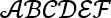
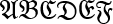

<a name="idtop"></a><!-- 🟢TOP OF PAGE - MARKER  (BLANK LINE BELOW)   -->

<!-- 🟢TOP OF PAGE - LOGO IMAGE -->
<p align="right"></p>      <!-- 🟢TOP OF PAGE - WEB ID     --> 

<table name="t-TOC-01" align="center"><!-- TABLE START🔽🔽(BLANK LINE ABOVE) -->
<!-- DATA ROW -->   <tr>
                        <td width="506" align="left" valign="top">
<details ><!-- HOME          🟢🟢🟢 UNNUMBERED, COLLAPSIBLE -->
<summary>&emsp;&ensp;&nbsp;<a href="../Home.md"><!-- HEAD -->Home</a>
</summary><!-- BLANK LINE BELOW -->

&emsp;&emsp;&emsp;&emsp;&emsp;&ensp;&nbsp;[The GitHub Wiki](../Home.md#github-wiki--design-and-implementation)<br>
&emsp;&emsp;&emsp;&emsp;&emsp;&ensp;&nbsp;[What does this guide cover?](../Home.md#what-does-this-guide-cover)<br>
&emsp;&emsp;&emsp;&emsp;&emsp;&ensp;&nbsp;[A note by the Author](../Home.md#a-note-by-the-author)<br>
</details><!--               🟩🟩🟩 -->

<details ><!-- LICENCE       🟢🟢🟢 UNNUMBERED, COLLAPSIBLE -->
<summary>&emsp;&ensp;&nbsp;<a href="../00-0000/Licence.md"><!-- HEAD -->Licence</a>
</summary><!-- BLANK LINE BELOW -->

&emsp;&emsp;&emsp;&emsp;&emsp;&ensp;&nbsp;[The licences and other details](../00-0000/Licence.md#the-licences-and-other-details)<br>
&emsp;&emsp;&emsp;&emsp;&emsp;&ensp;&nbsp;[The Licence](../00-0000/Licence.md#the-licence)<br>
&emsp;&emsp;&emsp;&emsp;&emsp;&ensp;&nbsp;[Why did I choose the MIT Licence?](../00-0000/Licence.md#why-did-i-choose-the-mit-licence)<br>
&emsp;&emsp;&emsp;&emsp;&emsp;&ensp;&nbsp;[Permissive licences](../00-0000/Licence.md#permissive-licences)<br>
&emsp;&emsp;&emsp;&emsp;&emsp;&ensp;&nbsp;[Copyleft licence](../00-0000/Licence.md#copyleft-licence)<br>
&emsp;&emsp;&emsp;&emsp;&emsp;&ensp;&nbsp;[Limiting liabilities](../00-0000/Licence.md#limiting-liabilities)<br>
&emsp;&emsp;&emsp;&emsp;&emsp;&ensp;&nbsp;[Which licence to use?](../00-0000/Licence.md#which-licence-to-use)<br>
&emsp;&emsp;&emsp;&emsp;&emsp;&ensp;&nbsp;[A note on spelling: licence or license](../00-0000/Licence.md#a-note-on-spelling-licence-or-license)<br>
</details><!--               🟩🟩🟩 -->

<details><!-- [SECTION 01]   🟢🟢🟢 SECTION GENERAL SINGLE DIGIT CHAPTER-->
<summary><a href="../01-0000/01%20Introducing%20the%20GitHub%20Wiki.md">1<!-- NUM -->&ensp;&nbsp;&nbsp;&thinsp;<!-- HEAD -->Introducing the GitHub Wiki</a>
</summary><!-- BLANK LINE BELOW -->

&emsp;&ensp;&hairsp;[1.1&emsp;&emsp;&nbsp;&nbsp;&thinsp;&hairsp;What are GitHub Wiki pages?](../01-0000/01%20Introducing%20the%20GitHub%20Wiki.md#11what-are-github-wiki-pages)<br>
&emsp;&ensp;&hairsp;[1.2&emsp;&emsp;&nbsp;&nbsp;&thinsp;&hairsp;Understanding the Wiki pages](../01-0000/01%20Introducing%20the%20GitHub%20Wiki.md#12understanding-the-wiki-pages)<br>
&emsp;&ensp;&hairsp;[1.3&emsp;&emsp;&nbsp;&nbsp;&thinsp;&hairsp;Creating a Wiki for a repository](../01-0000/01%20Introducing%20the%20GitHub%20Wiki.md#13creating-a-wiki-for-a-repository)<br>
&emsp;&ensp;&hairsp;[1.3.1&emsp;&nbsp;&nbsp;&nbsp;&nbsp;Creating the first Wiki page](../01-0000/01%20Introducing%20the%20GitHub%20Wiki.md#131creating-the-first-wiki-page)<br>
&emsp;&ensp;&hairsp;[1.3.2&emsp;&nbsp;&nbsp;&nbsp;&nbsp;Creating additional pages](../01-0000/01%20Introducing%20the%20GitHub%20Wiki.md#132creating-additional-pages)<br>
&emsp;&ensp;&hairsp;[1.3.3&emsp;&nbsp;&nbsp;&nbsp;&nbsp;Editing a Wiki page](../01-0000/01%20Introducing%20the%20GitHub%20Wiki.md#133editing-a-wiki-page)<br>
&emsp;&ensp;&hairsp;[1.4&emsp;&emsp;&nbsp;&nbsp;&thinsp;&hairsp;The Wiki is its own repository](../01-0000/01%20Introducing%20the%20GitHub%20Wiki.md#14the-wiki-is-its-own-repository)<br>
&emsp;&ensp;&hairsp;[1.4.1&emsp;&nbsp;&nbsp;&nbsp;&nbsp;Viewing a Wiki page history](../01-0000/01%20Introducing%20the%20GitHub%20Wiki.md#141viewing-a-wiki-page-history)<br>
&emsp;&ensp;&hairsp;[1.4.2&emsp;&nbsp;&nbsp;&nbsp;&nbsp;How GitHub handles Wiki branche](../01-0000/01%20Introducing%20the%20GitHub%20Wiki.md#142how-github-handles-wiki-branches)<br>
&emsp;&ensp;&hairsp;[1.4.3&emsp;&nbsp;&nbsp;&nbsp;&nbsp;The Wiki link to the main repository](../01-0000/01%20Introducing%20the%20GitHub%20Wiki.md#143the-wiki-and-its-link-to-the-main-repository)<br>
&emsp;&ensp;&hairsp;[1.5&emsp;&emsp;&nbsp;&nbsp;&thinsp;&hairsp;Basic components of a Wiki page](../01-0000/01%20Introducing%20the%20GitHub%20Wiki.md#15basic-components-of-a-wiki-page)<br>
&emsp;&ensp;&hairsp;[1.5.1&emsp;&nbsp;&nbsp;&nbsp;&nbsp;Title bar and revision](../01-0000/01%20Introducing%20the%20GitHub%20Wiki.md#151title-bar-and-revision)<br>
&emsp;&ensp;&hairsp;[1.5.2&emsp;&nbsp;&nbsp;&nbsp;&nbsp;Contents (pages) area](../01-0000/01%20Introducing%20the%20GitHub%20Wiki.md#152contents-pages-area)<br>
&emsp;&emsp;&emsp;&emsp;&emsp;&ensp;&nbsp;[Listing pages in the order you want](../01-0000/01%20Introducing%20the%20GitHub%20Wiki.md#listing-the-pages-in-the-order-you-want)<br>
&emsp;&ensp;&hairsp;[1.5.3&emsp;&nbsp;&nbsp;&nbsp;&nbsp;Sidebars](../01-0000/01%20Introducing%20the%20GitHub%20Wiki.md#153sidebars)<br>
&emsp;&ensp;&hairsp;[1.5.4&emsp;&nbsp;&nbsp;&nbsp;&nbsp;Footers](../01-0000/01%20Introducing%20the%20GitHub%20Wiki.md#154footers)<br>
&emsp;&ensp;&hairsp;[1.6&emsp;&emsp;&nbsp;&nbsp;&thinsp;&hairsp;Sidebars and footers](../01-0000/01%20Introducing%20the%20GitHub%20Wiki.md#16sidebars-and-footers)<br>
&emsp;&ensp;&hairsp;[1.6.1&emsp;&nbsp;&nbsp;&nbsp;&nbsp;Creating a sidebar and footer](../01-0000/01%20Introducing%20the%20GitHub%20Wiki.md#161creating-a-sidebar-and-footer-in-github)<br>
</details><!--               🟩🟩🟩 -->

<details><!-- [SECTION 02]   🟢🟢🟢 SECTION GENERAL SINGLE DIGIT CHAPTER-->
<summary><a href="../02-0000/02%20Cloning%20a%20Wiki.md">2<!-- NUM -->&ensp;&nbsp;&nbsp;&thinsp;<!-- HEAD -->Cloning a Wiki</a>
</summary><!-- BLANK LINE BELOW -->

&emsp;&ensp;&hairsp;[2.1&emsp;&emsp;&nbsp;&nbsp;&thinsp;&hairsp;Why clone a Wiki?](../02-0000/02%20Cloning%20a%20Wiki.md#21why-clone-a-wiki)<br>
&emsp;&ensp;&hairsp;[2.2&emsp;&emsp;&nbsp;&nbsp;&thinsp;&hairsp;How to clone a Wiki](../02-0000/02%20Cloning%20a%20Wiki.md#22how-to-clone-a-wiki)<br>
&emsp;&ensp;&hairsp;[2.3&emsp;&emsp;&nbsp;&nbsp;&thinsp;&hairsp;Pushing local changes to GitHub](../02-0000/02%20Cloning%20a%20Wiki.md#23pushing-local-changes-to-github)<br>
&emsp;&ensp;&hairsp;[2.3.1&emsp;&nbsp;&nbsp;&nbsp;&nbsp;Configuring username and email](../02-0000/02%20Cloning%20a%20Wiki.md#231configuring-a-git-username-and-email-address)<br>
&emsp;&ensp;&hairsp;[2.3.2&emsp;&nbsp;&nbsp;&nbsp;&nbsp;Modifying the local repository](../02-0000/02%20Cloning%20a%20Wiki.md#232modifying-the-local-repository)<br>
&emsp;&ensp;&hairsp;[2.3.3&emsp;&nbsp;&nbsp;&nbsp;&nbsp;Committing and synchronising](../02-0000/02%20Cloning%20a%20Wiki.md#233committing-and-synchronising-the-changes)<br>
</details><!--               🟩🟩🟩 -->

<details><!-- [SECTION 03]   🟢🟢🟢 SECTION GENERAL SINGLE DIGIT CHAPTER-->
<summary><a href="../03-0000/03%20A%20Wiki%20folder%20structure.md">3<!-- NUM -->&ensp;&nbsp;&nbsp;&thinsp;<!-- HEAD -->A Wiki folder structure</a>
</summary><!-- BLANK LINE BELOW -->

&emsp;&ensp;&hairsp;[3.1&emsp;&emsp;&nbsp;&nbsp;&thinsp;&hairsp;The default arrangement](../03-0000/03%20A%20Wiki%20folder%20structure.md#31the-default-arrangement)<br>
&emsp;&ensp;&hairsp;[3.2&emsp;&emsp;&nbsp;&nbsp;&thinsp;&hairsp;Create a sidebar or footer locally](../03-0000/03%20A%20Wiki%20folder%20structure.md#32create-a-sidebar-or-footer-locally)<br>
&emsp;&ensp;&hairsp;[3.3&emsp;&emsp;&nbsp;&nbsp;&thinsp;&hairsp;Page naming and Wiki limits](../03-0000/03%20A%20Wiki%20folder%20structure.md#33page-naming-and-wiki-limits)<br>
&emsp;&ensp;&hairsp;[3.3.1&emsp;&nbsp;&nbsp;&nbsp;&nbsp;Supported file types](../03-0000/03%20A%20Wiki%20folder%20structure.md#331supported-file-types)<br>
&emsp;&ensp;&hairsp;[3.3.2&emsp;&nbsp;&nbsp;&nbsp;&nbsp;Page names and numbering](../03-0000/03%20A%20Wiki%20folder%20structure.md#332page-names-and-numbering)<br>
&emsp;&ensp;&hairsp;[3.3.3&emsp;&nbsp;&nbsp;&nbsp;&nbsp;Rules for page numbering](../03-0000/03%20A%20Wiki%20folder%20structure.md#333rules-for-page-numbering)<br>
&emsp;&ensp;&hairsp;[3.3.4&emsp;&nbsp;&nbsp;&nbsp;&nbsp;Limits for Wiki pages](../03-0000/03%20A%20Wiki%20folder%20structure.md#334limits-for-wiki-pages)<br>
&emsp;&ensp;&hairsp;[3.4&emsp;&emsp;&nbsp;&nbsp;&thinsp;&hairsp;A Practical Wiki folder structure](../03-0000/03%20A%20Wiki%20folder%20structure.md#34a-practical-wiki-folder-structure)<br>
&emsp;&ensp;&hairsp;[3.4.1&emsp;&nbsp;&nbsp;&nbsp;&nbsp;Subfolder names for Wiki pages](../03-0000/03%20A%20Wiki%20folder%20structure.md#341subfolder-names-for-wiki-pages)<br>
&emsp;&ensp;&hairsp;[3.4.2&emsp;&nbsp;&nbsp;&nbsp;&nbsp;Storing images and other data](../03-0000/03%20A%20Wiki%20folder%20structure.md#342storing-images-and-other-data)<br>
</details><!--               🟩🟩🟩 -->

<details><!-- [SECTION 04]   🟢🟢🟢 SECTION GENERAL SINGLE DIGIT CHAPTER-->
<summary><a href="../04-0000/04%20Different%20sidebars%20and%20footers.md">4<!-- NUM -->&ensp;&nbsp;&nbsp;&thinsp;<!-- HEAD -->Different sidebars and footers</a>
</summary><!-- BLANK LINE BELOW -->

&emsp;&ensp;&hairsp;[4.1&emsp;&emsp;&nbsp;&nbsp;&thinsp;&hairsp;How sidebars work](../04-0000/04%20Different%20sidebars%20and%20footers.md#41how-sidebars-work)<br>
&emsp;&ensp;&hairsp;[4.1.1&emsp;&nbsp;&nbsp;&nbsp;&nbsp;The PracticalSeries sidebar](../04-0000/04%20Different%20sidebars%20and%20footers.md#411the-practicalseries-sidebar)<br>
&emsp;&ensp;&hairsp;[4.2&emsp;&emsp;&nbsp;&nbsp;&thinsp;&hairsp;How footers work](../04-0000/04%20Different%20sidebars%20and%20footers.md#42how-footers-work)<br>
&emsp;&ensp;&hairsp;[4.2.1&emsp;&nbsp;&nbsp;&nbsp;&nbsp;The PracticalSeries footer](../04-0000/04%20Different%20sidebars%20and%20footers.md#421the-practicalseries-footer)<br>
</details><!--               🟩🟩🟩 -->

<details><!-- [SECTION 05]   🟢🟢🟢 SECTION GENERAL SINGLE DIGIT CHAPTER-->
<summary><a href="../05-0000/05%20Markdown,%20GitHub%20Markdown%20and%20HTML.md">5<!-- NUM -->&ensp;&nbsp;&nbsp;&thinsp;<!-- HEAD -->Markdown, GitHub Markdown and HTML</a>
</summary><!-- BLANK LINE BELOW -->

&emsp;&ensp;&hairsp;[5.1&emsp;&emsp;&nbsp;&nbsp;&thinsp;&hairsp;Some useful Markdown sites](../05-0000/05%20Markdown,%20GitHub%20Markdown%20and%20HTML.md#51some-useful-markdown-sites)<br>
&emsp;&ensp;&hairsp;[5.2&emsp;&emsp;&nbsp;&nbsp;&thinsp;&hairsp;An overview of Markdown](../05-0000/05%20Markdown,%20GitHub%20Markdown%20and%20HTML.md#52an-overview-of-markdown)<br>
&emsp;&ensp;&hairsp;[5.3&emsp;&emsp;&nbsp;&nbsp;&thinsp;&hairsp;How Markdown works](../05-0000/05%20Markdown,%20GitHub%20Markdown%20and%20HTML.md#53how-markdown-works)<br>
&emsp;&ensp;&hairsp;[5.4&emsp;&emsp;&nbsp;&nbsp;&thinsp;&hairsp;Markdown flavours](../05-0000/05%20Markdown,%20GitHub%20Markdown%20and%20HTML.md#54markdown-flavours)<br>
&emsp;&ensp;&hairsp;[5.4.1&emsp;&nbsp;&nbsp;&nbsp;&nbsp;GitHub Flavoured Markdown (GFM)](../05-0000/05%20Markdown,%20GitHub%20Markdown%20and%20HTML.md#541github-flavoured-markdown-gfm)<br>
&emsp;&ensp;&hairsp;[5.5&emsp;&emsp;&nbsp;&nbsp;&thinsp;&hairsp;HTML and Markdown](../05-0000/05%20Markdown,%20GitHub%20Markdown%20and%20HTML.md#55html-and-markdown)<br>
&emsp;&ensp;&hairsp;[5.5.1&emsp;&nbsp;&nbsp;&nbsp;&nbsp;HTML with GFM](../05-0000/05%20Markdown,%20GitHub%20Markdown%20and%20HTML.md#551html-with-github-flavoured-markdown)<br>
&emsp;&emsp;&emsp;&emsp;&emsp;&ensp;&nbsp;[GFM blacklisted HTML tags](../05-0000/05%20Markdown,%20GitHub%20Markdown%20and%20HTML.md#gfm-blacklisted-html-tags)<br>
&emsp;&emsp;&emsp;&emsp;&emsp;&ensp;&nbsp;[GFM whitelisted HTML tags](../05-0000/05%20Markdown,%20GitHub%20Markdown%20and%20HTML.md#gfm-whitelisted-html-tags)<br>
&emsp;&emsp;&emsp;&emsp;&emsp;&ensp;&nbsp;[GFM HTML tags - the grey area](../05-0000/05%20Markdown,%20GitHub%20Markdown%20and%20HTML.md#gfm-html-tags--the-grey-area)<br>
&emsp;&emsp;&emsp;&emsp;&emsp;&ensp;&nbsp;[GFM whitelisted HTML attributes](../05-0000/05%20Markdown,%20GitHub%20Markdown%20and%20HTML.md#gfm-whitelisted-html-attributes)<br>
&emsp;&ensp;&hairsp;[5.5.2&emsp;&nbsp;&nbsp;&nbsp;&nbsp;PracticalSeries and Markdown](../05-0000/05%20Markdown,%20GitHub%20Markdown%20and%20HTML.md#552practicalseries-and-markdown)<br>
&emsp;&ensp;&hairsp;[5.6&emsp;&emsp;&nbsp;&nbsp;&thinsp;&hairsp;Markdown difference between files](../05-0000/05%20Markdown,%20GitHub%20Markdown%20and%20HTML.md#56markdown-difference-between-files)<br>
</details><!--               🟩🟩🟩 -->

<details><!-- [SECTION 06]   🟢🟢🟢 SECTION GENERAL SINGLE DIGIT CHAPTER-->
<summary><a href="../06-0000/06%20Basic%20Markdown%20and%20text%20formatting.md">6<!-- NUM -->&ensp;&nbsp;&nbsp;&thinsp;<!-- HEAD -->Basic Markdown and text formatting</a>
</summary><!-- BLANK LINE BELOW -->

&emsp;&ensp;&hairsp;[6.1&emsp;&emsp;&nbsp;&nbsp;&thinsp;&hairsp;Body text and fonts](../06-0000/06%20Basic%20Markdown%20and%20text%20formatting.md#61body-text-and-fonts)<br>
&emsp;&ensp;&hairsp;[6.1.1&emsp;&nbsp;&nbsp;&nbsp;&nbsp;Body text responsive design](../06-0000/06%20Basic%20Markdown%20and%20text%20formatting.md#611body-text-responsive-design)<br>
&emsp;&ensp;&hairsp;[6.1.2&emsp;&nbsp;&nbsp;&nbsp;&nbsp;Body text in sidebars and footers](../06-0000/06%20Basic%20Markdown%20and%20text%20formatting.md#612body-text-in-sidebars-and-footers)<br>
&emsp;&ensp;&hairsp;[6.1.3&emsp;&nbsp;&nbsp;&nbsp;&nbsp;Rules for body text](../06-0000/06%20Basic%20Markdown%20and%20text%20formatting.md#613body-text-markdown-rules)<br>
&emsp;&ensp;&hairsp;[6.1.4&emsp;&nbsp;&nbsp;&nbsp;&nbsp;Body text examples](../06-0000/06%20Basic%20Markdown%20and%20text%20formatting.md#614body-text-examples)<br>
&emsp;&ensp;&hairsp;[6.1.5&emsp;&nbsp;&nbsp;&nbsp;&nbsp;Alignment of Body text](../06-0000/06%20Basic%20Markdown%20and%20text%20formatting.md#615alignment-of-body-text)<br>
&emsp;&emsp;&emsp;&emsp;&emsp;&ensp;&nbsp;[Left aligned text (default)](../06-0000/06%20Basic%20Markdown%20and%20text%20formatting.md#left-aligned-text-default)<br>
&emsp;&emsp;&emsp;&emsp;&emsp;&ensp;&nbsp;[Right aligned text](../06-0000/06%20Basic%20Markdown%20and%20text%20formatting.md#right-aligned-text)<br>
&emsp;&emsp;&emsp;&emsp;&emsp;&ensp;&nbsp;[Centred text](../06-0000/06%20Basic%20Markdown%20and%20text%20formatting.md#centred-text)<br>
&emsp;&emsp;&emsp;&emsp;&emsp;&ensp;&nbsp;[Justified text](../06-0000/06%20Basic%20Markdown%20and%20text%20formatting.md#justified-text)<br>
&emsp;&ensp;&hairsp;[6.1.6&emsp;&nbsp;&nbsp;&nbsp;&nbsp;Body text propertie](../06-0000/06%20Basic%20Markdown%20and%20text%20formatting.md#616body-text-properties)<br>
&emsp;&ensp;&hairsp;[6.2&emsp;&emsp;&nbsp;&nbsp;&thinsp;&hairsp;Paragraphs and line breaks](../06-0000/06%20Basic%20Markdown%20and%20text%20formatting.md#62paragraphs-and-line-breaks)<br>
&emsp;&ensp;&hairsp;[6.2.1&emsp;&nbsp;&nbsp;&nbsp;&nbsp;Forced line break](../06-0000/06%20Basic%20Markdown%20and%20text%20formatting.md#621forced-line-break)<br>
&emsp;&ensp;&hairsp;[6.2.2&emsp;&nbsp;&nbsp;&nbsp;&nbsp;Blank line and a line break](../06-0000/06%20Basic%20Markdown%20and%20text%20formatting.md#622blank-line-and-a-line-break)<br>
&emsp;&ensp;&hairsp;[6.2.3&emsp;&nbsp;&nbsp;&nbsp;&nbsp;Trailing space line break](../06-0000/06%20Basic%20Markdown%20and%20text%20formatting.md#623trailing-space-line-break)<br>
&emsp;&ensp;&hairsp;[6.2.4&emsp;&nbsp;&nbsp;&nbsp;&nbsp;Paragraph and line break rules](../06-0000/06%20Basic%20Markdown%20and%20text%20formatting.md#624paragraph-and-line-break-markdown-rules)<br>
&emsp;&ensp;&hairsp;[6.2.5&emsp;&nbsp;&nbsp;&nbsp;&nbsp;Paragraph and line break examples](../06-0000/06%20Basic%20Markdown%20and%20text%20formatting.md#625paragraph-and-line-break-examples)<br>
&emsp;&ensp;&hairsp;[6.3&emsp;&emsp;&nbsp;&nbsp;&thinsp;&hairsp;Horizontal line](../06-0000/06%20Basic%20Markdown%20and%20text%20formatting.md#63horizontal-line)<br>
&emsp;&ensp;&hairsp;[6.3.1&emsp;&nbsp;&nbsp;&nbsp;&nbsp;Rules for horizontal lines](../06-0000/06%20Basic%20Markdown%20and%20text%20formatting.md#631markdown-rules-for-horizontal-lines)<br>
&emsp;&ensp;&hairsp;[6.4&emsp;&emsp;&nbsp;&nbsp;&thinsp;&hairsp;Emphasis with bold](../06-0400/06.04%20Basic%20Markdown%20and%20text%20formatting.md#64emphasis-with-bold)<br>
&emsp;&ensp;&hairsp;[6.4.1&emsp;&nbsp;&nbsp;&nbsp;&nbsp;Rules for bold](../06-0400/06.04%20Basic%20Markdown%20and%20text%20formatting.md#641markdown-rules-for-bold)<br>
&emsp;&ensp;&hairsp;[6.4.2&emsp;&nbsp;&nbsp;&nbsp;&nbsp;Bold text examples](../06-0400/06.04%20Basic%20Markdown%20and%20text%20formatting.md#642bold-text-examples)<br>
&emsp;&ensp;&hairsp;[6.5&emsp;&emsp;&nbsp;&nbsp;&thinsp;&hairsp;Emphasis with italics](../06-0400/06.04%20Basic%20Markdown%20and%20text%20formatting.md#65emphasis-with-italics)<br>
&emsp;&ensp;&hairsp;[6.5.1&emsp;&nbsp;&nbsp;&nbsp;&nbsp;Rules for italics](../06-0400/06.04%20Basic%20Markdown%20and%20text%20formatting.md#651markdown-rules-for-italics)<br>
&emsp;&ensp;&hairsp;[6.5.2&emsp;&nbsp;&nbsp;&nbsp;&nbsp;Italic text examples](../06-0400/06.04%20Basic%20Markdown%20and%20text%20formatting.md#652italic-text-examples)<br>
&emsp;&ensp;&hairsp;[6.6&emsp;&emsp;&nbsp;&nbsp;&thinsp;&hairsp;Emphasis with bold and italics](../06-0400/06.04%20Basic%20Markdown%20and%20text%20formatting.md#66emphasis-with-both-bold-and-italics)<br>
&emsp;&ensp;&hairsp;[6.6.1&emsp;&nbsp;&nbsp;&nbsp;&nbsp;Rules for bold and italics](../06-0400/06.04%20Basic%20Markdown%20and%20text%20formatting.md#661markdown-rules-for-both-bold-and-italics)<br>
&emsp;&ensp;&hairsp;[6.6.2&emsp;&nbsp;&nbsp;&nbsp;&nbsp;Bold and italic text examples](../06-0400/06.04%20Basic%20Markdown%20and%20text%20formatting.md#662both-bold-and-italic-text-examples)<br>
&emsp;&ensp;&hairsp;[6.7&emsp;&emsp;&nbsp;&nbsp;&thinsp;&hairsp;Emphasis with underlining](../06-0700/06.07%20Basic%20Markdown%20and%20text%20formatting.md#67emphasis-with-underlining)<br>
&emsp;&ensp;&hairsp;[6.7.1&emsp;&nbsp;&nbsp;&nbsp;&nbsp;Rules for underlining](../06-0700/06.07%20Basic%20Markdown%20and%20text%20formatting.md#671markdown-rules-for-underlining)<br>
&emsp;&ensp;&hairsp;[6.7.2&emsp;&nbsp;&nbsp;&nbsp;&nbsp;Underlining text examples](../06-0700/06.07%20Basic%20Markdown%20and%20text%20formatting.md#672underlining-text-examples)<br>
&emsp;&ensp;&hairsp;[6.8&emsp;&emsp;&nbsp;&nbsp;&thinsp;&hairsp;Emphasis with strikethrough](../06-0700/06.07%20Basic%20Markdown%20and%20text%20formatting.md#68emphasis-with-strikethrough)<br>
&emsp;&ensp;&hairsp;[6.8.1&emsp;&nbsp;&nbsp;&nbsp;&nbsp;Rules for strikethrough](../06-0700/06.07%20Basic%20Markdown%20and%20text%20formatting.md#681markdown-rules-for-strikethrough)<br>
&emsp;&ensp;&hairsp;[6.8.2&emsp;&nbsp;&nbsp;&nbsp;&nbsp;Strikethrough text examples](../06-0700/06.07%20Basic%20Markdown%20and%20text%20formatting.md#682strikethrough-text-examples)<br>
&emsp;&ensp;&hairsp;[6.9&emsp;&emsp;&nbsp;&nbsp;&thinsp;&hairsp;Superscript and subscript](../06-0700/06.07%20Basic%20Markdown%20and%20text%20formatting.md#69superscript-and-subscript)<br>
&emsp;&ensp;&hairsp;[6.9.1&emsp;&nbsp;&nbsp;&nbsp;&nbsp;Rules for superscript and subscript](../06-0700/06.07%20Basic%20Markdown%20and%20text%20formatting.md#691markdown-rules-for-superscript-and-subscript)<br>
&emsp;&ensp;&hairsp;[6.9.2&emsp;&nbsp;&nbsp;&nbsp;&nbsp;Superscript and subscript examples](../06-0700/06.07%20Basic%20Markdown%20and%20text%20formatting.md#692superscript-and-subscript-text-examples)<br>
&emsp;&ensp;&hairsp;[6.10&emsp;&emsp;&thinsp;&hairsp;Headings](../06-1000/06.10%20Basic%20Markdown%20and%20text%20formatting.md#610headings)<br>
&emsp;&emsp;&emsp;&emsp;&emsp;&ensp;&nbsp;[Alternatives for heading 1 and 2](../06-1000/06.10%20Basic%20Markdown%20and%20text%20formatting.md#alternatives-for-heading-1-and-2)<br>
&emsp;&ensp;&hairsp;[6.10.1&emsp;&nbsp;&nbsp;Headings Markdown rules](../06-1000/06.10%20Basic%20Markdown%20and%20text%20formatting.md#6101headings-markdown-rules)<br>
&emsp;&ensp;&hairsp;[6.10.2&emsp;&nbsp;&nbsp;Heading properties](../06-1000/06.10%20Basic%20Markdown%20and%20text%20formatting.md#6102heading-properties)<br>
</details><!--               🟩🟩🟩 -->

<details><!-- [SECTION 07]   🟢🟢🟢 SECTION GENERAL SINGLE DIGIT CHAPTER-->
<summary><a href="../07-0000/07%20Special%20characters%20and%20escaping%20characters.md">7<!-- NUM -->&ensp;&nbsp;&nbsp;&thinsp;<!-- HEAD -->Special characters and escaping characters</a>
</summary><!-- BLANK LINE BELOW -->

&emsp;&ensp;&hairsp;[7.1&emsp;&emsp;&nbsp;&nbsp;&thinsp;&hairsp;Escape characters and codes](../07-0000/07%20Special%20characters%20and%20escaping%20characters.md#71escape-characters-and-character-codes)<br>
&emsp;&ensp;&hairsp;[7.1.1&emsp;&nbsp;&nbsp;&nbsp;&nbsp;Markdown escape sequences](../07-0000/07%20Special%20characters%20and%20escaping%20characters.md#711markdown-escape-sequences)<br>
&emsp;&ensp;&hairsp;[7.1.2&emsp;&nbsp;&nbsp;&nbsp;&nbsp;HTML escape sequences](../07-0000/07%20Special%20characters%20and%20escaping%20characters.md#712html-escape-sequences)<br>
&emsp;&ensp;&hairsp;[7.1.3&emsp;&nbsp;&nbsp;&nbsp;&nbsp;Decimal and hexadecimal codes](../07-0000/07%20Special%20characters%20and%20escaping%20characters.md#713html-decimal-and-hexadecimal-escape-codes)<br>
&emsp;&emsp;&emsp;&emsp;&emsp;&ensp;&nbsp;[Hexadecimal escape codes](../07-0000/07%20Special%20characters%20and%20escaping%20characters.md#hexadecimal-escape-codes)<br>
&emsp;&ensp;&hairsp;[7.2&emsp;&emsp;&nbsp;&nbsp;&thinsp;&hairsp;Special space characters](../07-0000/07%20Special%20characters%20and%20escaping%20characters.md#72special-space-characters)<br>
&emsp;&ensp;&hairsp;[7.2.1&emsp;&nbsp;&nbsp;&nbsp;&nbsp;Escape sequence restrictions](../07-0000/07%20Special%20characters%20and%20escaping%20characters.md#721escape-sequence-restrictions-in-github-html)<br>
&emsp;&ensp;&hairsp;[7.3&emsp;&emsp;&nbsp;&nbsp;&thinsp;&hairsp;Emojis and emoticons](../07-0000/07%20Special%20characters%20and%20escaping%20characters.md#73emojis-and-emoticons)<br>
&emsp;&emsp;&emsp;&emsp;&emsp;&ensp;&nbsp;[A note by the Author about emojis](../07-0000/07%20Special%20characters%20and%20escaping%20characters.md#a-note-by-the-author-about-emojis)<br>
&emsp;&ensp;&hairsp;[7.4&emsp;&emsp;&nbsp;&nbsp;&thinsp;&hairsp;Comments](../07-0000/07%20Special%20characters%20and%20escaping%20characters.md#74comments)<br>
</details><!--               🟩🟩🟩 -->

<details><!-- [SECTION 08]   🟢🟢🟢 SECTION GENERAL SINGLE DIGIT CHAPTER-->
<summary><a href="../08-0000/08%20Block%20quotes,%20lists%20and%20alerts.md">8<!-- NUM -->&ensp;&nbsp;&nbsp;&thinsp;<!-- HEAD -->Block quotes, lists and alerts</a>
</summary><!-- BLANK LINE BELOW -->

&emsp;&ensp;&hairsp;[8.1&emsp;&emsp;&nbsp;&nbsp;&thinsp;&hairsp;Block quotes](../08-0000/08%20Block%20quotes,%20lists%20and%20alerts.md#81block-quotes)<br>
&emsp;&ensp;&hairsp;[8.1.1&emsp;&nbsp;&nbsp;&nbsp;&nbsp;Nested block quotes](../08-0000/08%20Block%20quotes,%20lists%20and%20alerts.md#811nested-block-quotes)<br>
&emsp;&ensp;&hairsp;[8.1.2&emsp;&nbsp;&nbsp;&nbsp;&nbsp;Adding other elements](../08-0000/08%20Block%20quotes,%20lists%20and%20alerts.md#812other-elements-inside-block-quotes)<br>
&emsp;&ensp;&hairsp;[8.1.3&emsp;&nbsp;&nbsp;&nbsp;&nbsp;Rules for block quotes](../08-0000/08%20Block%20quotes,%20lists%20and%20alerts.md#813markdown-rules-for-block-quotes)<br>
&emsp;&ensp;&hairsp;[8.2&emsp;&emsp;&nbsp;&nbsp;&thinsp;&hairsp;Unordered (unnumbered) lists](../08-0000/08%20Block%20quotes,%20lists%20and%20alerts.md#82unordered-unnumbered-lists)<br>
&emsp;&ensp;&hairsp;[8.2.1&emsp;&nbsp;&nbsp;&nbsp;&nbsp;Nested unordered lists](../08-0000/08%20Block%20quotes,%20lists%20and%20alerts.md#821nested-unordered-lists)<br>
&emsp;&ensp;&hairsp;[8.2.2&emsp;&nbsp;&nbsp;&nbsp;&nbsp;Type of bullet point](../08-0000/08%20Block%20quotes,%20lists%20and%20alerts.md#822type-of-bullet-point)<br>
&emsp;&ensp;&hairsp;[8.2.3&emsp;&nbsp;&nbsp;&nbsp;&nbsp;Indents and spacing](../08-0000/08%20Block%20quotes,%20lists%20and%20alerts.md#823indents-and-spacing)<br>
&emsp;&ensp;&hairsp;[8.2.4&emsp;&nbsp;&nbsp;&nbsp;&nbsp;Numbers in an unordered list](../08-0000/08%20Block%20quotes,%20lists%20and%20alerts.md#824numbers-in-an-unordered-list)<br>
&emsp;&ensp;&hairsp;[8.2.5&emsp;&nbsp;&nbsp;&nbsp;&nbsp;Adding paragraphs](../08-0000/08%20Block%20quotes,%20lists%20and%20alerts.md#825adding-paragraphs-to-an-unordered-list)<br>
&emsp;&ensp;&hairsp;[8.2.6&emsp;&nbsp;&nbsp;&nbsp;&nbsp;Adding other elements](../08-0000/08%20Block%20quotes,%20lists%20and%20alerts.md#826other-elements-inside-an-unordered-list)<br>
&emsp;&ensp;&hairsp;[8.2.7&emsp;&nbsp;&nbsp;&nbsp;&nbsp;Rules for unordered lists](../08-0000/08%20Block%20quotes,%20lists%20and%20alerts.md#827markdown-rules-for-unordered-lists)<br>
&emsp;&ensp;&hairsp;[8.3&emsp;&emsp;&nbsp;&nbsp;&thinsp;&hairsp;Ordered (numbered) lists](../08-0000/08%20Block%20quotes,%20lists%20and%20alerts.md#83ordered-numbered-lists)<br>
&emsp;&ensp;&hairsp;[8.3.1&emsp;&nbsp;&nbsp;&nbsp;&nbsp;Starting at a different number](../08-0000/08%20Block%20quotes,%20lists%20and%20alerts.md#831starting-at-a-different-number)<br>
&emsp;&ensp;&hairsp;[8.3.2&emsp;&nbsp;&nbsp;&nbsp;&nbsp;Nested ordered lists](../08-0000/08%20Block%20quotes,%20lists%20and%20alerts.md#832nested-ordered-lists)<br>
&emsp;&ensp;&hairsp;[8.3.3&emsp;&nbsp;&nbsp;&nbsp;&nbsp;Type of numbering](../08-0000/08%20Block%20quotes,%20lists%20and%20alerts.md#833type-of-numbering)<br>
&emsp;&ensp;&hairsp;[8.3.4&emsp;&nbsp;&nbsp;&nbsp;&nbsp;Indents and spacing](../08-0000/08%20Block%20quotes,%20lists%20and%20alerts.md#834indents-and-spacing)<br>
&emsp;&ensp;&hairsp;[8.3.5&emsp;&nbsp;&nbsp;&nbsp;&nbsp;Adding paragraphs](../08-0000/08%20Block%20quotes,%20lists%20and%20alerts.md#835adding-paragraphs-to-an-ordered-list)<br>
&emsp;&ensp;&hairsp;[8.3.6&emsp;&nbsp;&nbsp;&nbsp;&nbsp;Adding other elements](../08-0000/08%20Block%20quotes,%20lists%20and%20alerts.md#836other-elements-inside-an-ordered-list)<br>
&emsp;&ensp;&hairsp;[8.3.7&emsp;&nbsp;&nbsp;&nbsp;&nbsp;Rules for ordered lists](../08-0000/08%20Block%20quotes,%20lists%20and%20alerts.md#837markdown-rules-for-ordered-lists)<br>
&emsp;&ensp;&hairsp;[8.4&emsp;&emsp;&nbsp;&nbsp;&thinsp;&hairsp;Mixing ordered and unordered lists](../08-0000/08%20Block%20quotes,%20lists%20and%20alerts.md#84mixing-ordered-and-unordered-lists)<br>
&emsp;&ensp;&hairsp;[8.5&emsp;&emsp;&nbsp;&nbsp;&thinsp;&hairsp;Task lists (check boxes)](../08-0000/08%20Block%20quotes,%20lists%20and%20alerts.md#85task-lists-check-boxes)<br>
&emsp;&ensp;&hairsp;[8.5.1&emsp;&nbsp;&nbsp;&nbsp;&nbsp;Nested task lists](../08-0000/08%20Block%20quotes,%20lists%20and%20alerts.md#851nested-task-lists)<br>
&emsp;&ensp;&hairsp;[8.6&emsp;&emsp;&nbsp;&nbsp;&thinsp;&hairsp;Alerts](../08-0000/08%20Block%20quotes,%20lists%20and%20alerts.md#86alerts)<br>
&emsp;&ensp;&hairsp;[8.6.1&emsp;&nbsp;&nbsp;&nbsp;&nbsp;Rules for alerts](../08-0000/08%20Block%20quotes,%20lists%20and%20alerts.md#861markdown-rules-for-alerts)<br>
</details><!--               🟩🟩🟩 -->
                        </td>
                        <td width="506" align="left" valign="top">

<details><!-- [SECTION 09]   🟢🟢🟢 SECTION GENERAL SINGLE DIGIT CHAPTER-->
<summary><a href="../09-0000/09%20Links.md">9<!-- NUM -->&ensp;&nbsp;&nbsp;&thinsp;<!-- HEAD -->Links</a>
</summary><!-- BLANK LINE BELOW -->

&emsp;&ensp;&hairsp;[9.1&emsp;&emsp;&nbsp;&nbsp;&thinsp;&hairsp;Link to an external web page](../09-0000/09%20Links.md#91linking-to-an-external-web-page)<br>
&emsp;&ensp;&hairsp;[9.1.1&emsp;&nbsp;&nbsp;&nbsp;&nbsp;A direct link to a URL](../09-0000/09%20Links.md#911a-direct-link-to-a-url)<br>
&emsp;&ensp;&hairsp;[9.1.2&emsp;&nbsp;&nbsp;&nbsp;&nbsp;A link using substitute text](../09-0000/09%20Links.md#912a-link-using-substitute-text)<br>
&emsp;&ensp;&hairsp;[9.1.3&emsp;&nbsp;&nbsp;&nbsp;&nbsp;A link using tooltips](../09-0000/09%20Links.md#913a-link-using-substitute-text-with-tooltip)<br>
&emsp;&ensp;&hairsp;[9.2&emsp;&emsp;&nbsp;&nbsp;&thinsp;&hairsp;Link to another page in the Wiki](../09-0000/09%20Links.md#92linking-to-another-page-in-the-same-wiki)<br>
&emsp;&ensp;&hairsp;[9.2.1&emsp;&nbsp;&nbsp;&nbsp;&nbsp;Rules for linking to a Wiki page](../09-0000/09%20Links.md#921rules-for-linking-to-a-wiki-page)<br>
&emsp;&ensp;&hairsp;[9.3&emsp;&emsp;&nbsp;&nbsp;&thinsp;&hairsp;Link to headings on current page](../09-0000/09%20Links.md#93linking-to-headings-on-the-current-page)<br>
&emsp;&ensp;&hairsp;[9.3.1&emsp;&nbsp;&nbsp;&nbsp;&nbsp;Converting a heading to a link](../09-0000/09%20Links.md#931rules-for-converting-a-heading-to-a-link)<br>
&emsp;&ensp;&hairsp;[9.3.2&emsp;&nbsp;&nbsp;&nbsp;&nbsp;An example of a heading link](../09-0000/09%20Links.md#932an-example-of-a-heading-link)<br>
&emsp;&ensp;&hairsp;[9.3.3&emsp;&nbsp;&nbsp;&nbsp;&nbsp;Heading link with tooltips](../09-0000/09%20Links.md#933heading-link-with-tooltips)<br>
&emsp;&ensp;&hairsp;[9.4&emsp;&emsp;&nbsp;&nbsp;&thinsp;&hairsp;Link to headings on a different page](../09-0000/09%20Links.md#94linking-to-headings-on-a-different-page)<br>
&emsp;&ensp;&hairsp;[9.4.1&emsp;&nbsp;&nbsp;&nbsp;&nbsp;An example of a heading link](../09-0000/09%20Links.md#941an-example-of-a-heading-link)<br>
&emsp;&ensp;&hairsp;[9.5&emsp;&emsp;&nbsp;&nbsp;&thinsp;&hairsp;Link to a named element](../09-0500/09.05%20Links.md#95linking-to-a-named-element)<br>
&emsp;&emsp;&emsp;&emsp;&emsp;&ensp;&nbsp;[A note by the Author](../09-0500/09.05%20Links.md#a-note-by-the-author)<br>
&emsp;&ensp;&hairsp;[9.5.1&emsp;&nbsp;&nbsp;&nbsp;&nbsp;Link to a point on another page](../09-0500/09.05%20Links.md#951link-to-a-named-point-on-another-page)<br>
&emsp;&ensp;&hairsp;[9.6&emsp;&emsp;&nbsp;&nbsp;&thinsp;&hairsp;Downloading a file](../09-0500/09.05%20Links.md#96downloading-a-file)<br>
&emsp;&ensp;&hairsp;[9.6.1&emsp;&nbsp;&nbsp;&nbsp;&nbsp;The download attribute](../09-0500/09.05%20Links.md#961the-download-attribute)<br>
&emsp;&ensp;&hairsp;[9.6.2&emsp;&nbsp;&nbsp;&nbsp;&nbsp;Spaces in filenames](../09-0500/09.05%20Links.md#962spaces-in-filenames)<br>
&emsp;&ensp;&hairsp;[9.6.3&emsp;&nbsp;&nbsp;&nbsp;&nbsp;Downloading a .md file](../09-0500/09.05%20Links.md#963downloading-a-md-file)<br>
&emsp;&ensp;&hairsp;[9.7&emsp;&emsp;&nbsp;&nbsp;&thinsp;&hairsp;Reference style links](../09-0500/09.05%20Links.md#97reference-style-links)<br>
&emsp;&ensp;&hairsp;[9.8&emsp;&emsp;&nbsp;&nbsp;&thinsp;&hairsp;Relative links](../09-0500/09.05%20Links.md#98relative-links)<br>
&emsp;&ensp;&hairsp;[9.8.1&emsp;&nbsp;&nbsp;&nbsp;&nbsp;Relative links from any Wiki page](../09-0500/09.05%20Links.md#981relative-links-from-any-wiki-page)<br>
</details><!--               🟩🟩🟩 -->

<details><!-- [SECTION 10]   🟢🟢🟢 SECTION GENERAL DOUBLE DIGIT CHAPTER-->
<summary><a href="../10-0000/10%20Tables.md">10<!-- NUM -->&ensp;&thinsp;<!-- HEAD -->Tables</a>
</summary><!-- BLANK LINE BELOW -->

&emsp;&ensp;&hairsp;[10.1&emsp;&emsp;&thinsp;&hairsp;Markdown tables](../10-0000/10%20Tables.md#101markdown-tables)<br>
&emsp;&ensp;&hairsp;[10.1.1&emsp;&ensp;&hairsp;Horizontal alignment](../10-0000/10%20Tables.md#1011horizontal-alignment)<br>
&emsp;&ensp;&hairsp;[10.1.2&emsp;&ensp;&hairsp;Table construction](../10-0000/10%20Tables.md#1012table-construction)<br>
&emsp;&ensp;&hairsp;[10.1.3&emsp;&ensp;&hairsp;Vertical line breaks and alignment](../10-0000/10%20Tables.md#1013vertical-line-breaks-and-alignment)<br>
&emsp;&ensp;&hairsp;[10.1.4&emsp;&ensp;&hairsp;Making columns wider](../10-0000/10%20Tables.md#1014making-columns-wider)<br>
&emsp;&ensp;&hairsp;[10.1.5&emsp;&ensp;&hairsp;Other elements in a table](../10-0000/10%20Tables.md#1015other-elements-in-a-table)<br>
&emsp;&ensp;&hairsp;[10.1.6&emsp;&ensp;&hairsp;Markdown table restrictions](../10-0000/10%20Tables.md#1016markdown-table-restrictions)<br>
&emsp;&ensp;&hairsp;[10.2&emsp;&emsp;&thinsp;&hairsp;HTML tables](../10-0000/10%20Tables.md#102html-tables)<br>
&emsp;&ensp;&hairsp;[10.2.1&emsp;&ensp;&hairsp;A basic HTML table](../10-0000/10%20Tables.md#1021a-basic-html-table)<br>
&emsp;&ensp;&hairsp;[10.2.2&emsp;&ensp;&hairsp;Aligning a table on a page](../10-0000/10%20Tables.md#1022aligning-a-table-on-a-page)<br>
&emsp;&ensp;&hairsp;[10.2.3&emsp;&ensp;&hairsp;Text wrap and side-by-side tables](../10-0000/10%20Tables.md#1023text-wrap-and-side-by-side-tables)<br>
&emsp;&emsp;&emsp;&emsp;&emsp;&ensp;&nbsp;[What this means in practice](../10-0000/10%20Tables.md#what-this-means-in-practice)<br>
&emsp;&emsp;&emsp;&emsp;&emsp;&ensp;&nbsp;[The problem with the align attribute](../10-0000/10%20Tables.md#the-problem-with-the-align-attribute)<br>
&emsp;&emsp;&emsp;&emsp;&emsp;&ensp;&nbsp;[How to stop text wrapping](../10-0000/10%20Tables.md#how-to-stop-text-wrapping)<br>
&emsp;&ensp;&hairsp;[10.2.4&emsp;&ensp;&hairsp;Setting the width of a table column](../10-0000/10%20Tables.md#1024setting-the-width-of-a-table-column)<br>
&emsp;&ensp;&hairsp;[10.2.5&emsp;&ensp;&hairsp;Setting the height of a table row](../10-0000/10%20Tables.md#1025setting-the-height-of-a-table-row)<br>
&emsp;&ensp;&hairsp;[10.2.6&emsp;&ensp;&hairsp;Horizontal alignment](../10-0000/10%20Tables.md#1026horizontal-alignment)<br>
&emsp;&ensp;&hairsp;[10.2.7&emsp;&ensp;&hairsp;Vertical alignment](../10-0000/10%20Tables.md#1027vertical-alignment)<br>
&emsp;&ensp;&hairsp;[10.2.8&emsp;&ensp;&hairsp;Spanning columns and rows](../10-0000/10%20Tables.md#1028spanning-columns-and-rows)<br>
&emsp;&ensp;&hairsp;[10.2.9&emsp;&ensp;&hairsp;Table border](../10-0000/10%20Tables.md#1029table-border)<br>
&emsp;&ensp;&hairsp;[10.2.10&ensp;&nbsp;&nbsp;Giving a table a navigable name](../10-0000/10%20Tables.md#10210giving-a-table-a-navigable-name)<br>
&emsp;&ensp;&hairsp;[10.2.11&ensp;&nbsp;&nbsp;Additional HTML tags](../10-0000/10%20Tables.md#10211additional-html-tags)<br>
</details><!--               🟩🟩🟩 -->

<details><!-- [SECTION 11]   🟢🟢🟢 SECTION GENERAL DOUBLE DIGIT CHAPTER-->
<summary><a href="../11-0000/11%20Images.md">11<!-- NUM -->&ensp;&thinsp;<!-- HEAD -->Images</a>
</summary><!-- BLANK LINE BELOW -->

&emsp;&ensp;&hairsp;[11.1&emsp;&emsp;&thinsp;&hairsp;Markdown images](../11-0000/11%20Images.md#111markdown-images)<br>
&emsp;&ensp;&hairsp;[11.1.1&emsp;&ensp;&hairsp;Image size in Markdown](../11-0000/11%20Images.md#1111image-size-in-markdown)<br>
&emsp;&ensp;&hairsp;[11.1.2&emsp;&ensp;&hairsp;Making the image a link](../11-0000/11%20Images.md#1112making-the-image-a-link)<br>
&emsp;&ensp;&hairsp;[11.1.3&emsp;&ensp;&hairsp;Drag and drop image link](../11-0000/11%20Images.md#1113drag-and-drop-image-link)<br>
&emsp;&emsp;&emsp;&emsp;&emsp;&ensp;&nbsp;[A note by the Author](../11-0000/11%20Images.md#a-note-by-the-author)<br>
&emsp;&ensp;&hairsp;[11.2&emsp;&emsp;&thinsp;&hairsp;HTML images](../11-0000/11%20Images.md#112html-images)<br>
&emsp;&ensp;&hairsp;[11.2.1&emsp;&ensp;&hairsp;A basic HTML image](../11-0000/11%20Images.md#1121a-basic-html-image)<br>
&emsp;&ensp;&hairsp;[11.2.2&emsp;&ensp;&hairsp;Image size in HTML](../11-0000/11%20Images.md#1122image-size-in-html)<br>
&emsp;&ensp;&hairsp;[11.2.3&emsp;&ensp;&hairsp;Horizontal alignment](../11-0000/11%20Images.md#1123horizontal-alignment)<br>
&emsp;&ensp;&hairsp;[11.2.4&emsp;&ensp;&hairsp;Making the image a link](../11-0000/11%20Images.md#1124making-the-image-a-link)<br>
&emsp;&ensp;&hairsp;[11.2.5&emsp;&ensp;&hairsp;Using a table to contain an image](../11-0000/11%20Images.md#1125using-a-table-to-contain-an-image)<br>
&emsp;&ensp;&hairsp;[11.3&emsp;&emsp;&thinsp;&hairsp;Forcing an image refresh](../11-0000/11%20Images.md#113forcing-an-image-refresh)<br>
&emsp;&ensp;&hairsp;[11.4&emsp;&emsp;&thinsp;&hairsp;Using a spacer image](../11-0000/11%20Images.md#114using-a-spacer-image)<br>
&emsp;&ensp;&hairsp;[11.5&emsp;&emsp;&thinsp;&hairsp;Mermaid diagrams](../11-0500/11.05%20Images.md#115mermaid-diagrams)<br>
&emsp;&ensp;&hairsp;[11.5.1&emsp;&ensp;&hairsp;Inserting a Mermaid diagram](../11-0500/11.05%20Images.md#1151inserting-a-mermaid-diagram)<br>
&emsp;&ensp;&hairsp;[11.5.2&emsp;&ensp;&hairsp;The rendered Mermaid diagram](../11-0500/11.05%20Images.md#1152the-rendered-mermaid-diagram)<br>
&emsp;&ensp;&hairsp;[11.5.3&emsp;&ensp;&hairsp;Supported version of Mermaid](../11-0500/11.05%20Images.md#1153supported-version-of-mermaid)<br>
&emsp;&ensp;&hairsp;[11.6&emsp;&emsp;&thinsp;&hairsp;Interactive maps](../11-0500/11.05%20Images.md#116interactive-maps)<br>
&emsp;&ensp;&hairsp;[11.7&emsp;&emsp;&thinsp;&hairsp;3D models](../11-0500/11.05%20Images.md#1173d-models)<br>
</details><!--               🟩🟩🟩 -->

<details><!-- [SECTION 12]   🟢🟢🟢 SECTION GENERAL DOUBLE DIGIT CHAPTER-->
<summary><a href="../12-0000/12%20Contents,%20collapsible%20content%20and%20footnotes.md">12<!-- NUM -->&ensp;&thinsp;<!-- HEAD -->Contents (collapsible) and footnotes</a>
</summary><!-- BLANK LINE BELOW -->

&emsp;&ensp;&hairsp;[12.1&emsp;&emsp;&thinsp;&hairsp;A basic table of contents](../12-0000/12%20Contents,%20collapsible%20content%20and%20footnotes.md#121a-basic-table-of-contents)<br>
&emsp;&ensp;&hairsp;[12.2&emsp;&emsp;&thinsp;&hairsp;Understanding the space characters](../12-0000/12%20Contents,%20collapsible%20content%20and%20footnotes.md#122understanding-the-space-characters)<br>
&emsp;&ensp;&hairsp;[12.3&emsp;&emsp;&thinsp;&hairsp;Collapsible content](../12-0000/12%20Contents,%20collapsible%20content%20and%20footnotes.md#123collapsible-content)<br>
&emsp;&ensp;&hairsp;[12.3.1&emsp;&ensp;&hairsp;Defaulting to open](../12-0000/12%20Contents,%20collapsible%20content%20and%20footnotes.md#1231defaulting-to-open)<br>
&emsp;&ensp;&hairsp;[12.3.2&emsp;&ensp;&hairsp;Markdown restrictions](../12-0000/12%20Contents,%20collapsible%20content%20and%20footnotes.md#1232markdown-restrictions)<br>
&emsp;&ensp;&hairsp;[12.4&emsp;&emsp;&thinsp;&hairsp;Collapsible TOC](../12-0000/12%20Contents,%20collapsible%20content%20and%20footnotes.md#124collapsible-toc)<br>
&emsp;&ensp;&hairsp;[12.5&emsp;&emsp;&thinsp;&hairsp;TOCs in tables](../12-0000/12%20Contents,%20collapsible%20content%20and%20footnotes.md#125tocs-in-tables)<br>
&emsp;&ensp;&hairsp;[12.6&emsp;&emsp;&thinsp;&hairsp;Footnotes](../12-0000/12%20Contents,%20collapsible%20content%20and%20footnotes.md#126footnotes)<br>
</details><!--               🟩🟩🟩 -->

<details><!-- [SECTION 13]   🟢🟢🟢 SECTION GENERAL DOUBLE DIGIT CHAPTER-->
<summary><a href="../13-0000/13%20Code%20fragments.md">13<!-- NUM -->&ensp;&thinsp;<!-- HEAD -->Code fragments</a>
</summary><!-- BLANK LINE BELOW -->

&emsp;&ensp;&hairsp;[13.1&emsp;&emsp;&thinsp;&hairsp;Inline code](../13-0000/13%20Code%20fragments.md#131inline-code)<br>
&emsp;&ensp;&hairsp;[13.2&emsp;&emsp;&thinsp;&hairsp;Code blocks](../13-0000/13%20Code%20fragments.md#132code-blocks)<br>
&emsp;&ensp;&hairsp;[13.2.1&emsp;&ensp;&hairsp;Preferred mechanism](../13-0000/13%20Code%20fragments.md#1321preferred-mechanism-for-code-blocks)<br>
&emsp;&ensp;&hairsp;[13.3&emsp;&emsp;&thinsp;&hairsp;Syntax highlighting](../13-0000/13%20Code%20fragments.md#133syntax-highlighting)<br>
&emsp;&ensp;&hairsp;[13.3.1&emsp;&ensp;&hairsp;Supported languages](../13-0000/13%20Code%20fragments.md#1331supported-languages)<br>
&emsp;&ensp;&hairsp;[13.4&emsp;&emsp;&thinsp;&hairsp;HTML code fragments](../13-0000/13%20Code%20fragments.md#134html-code-fragments)<br>
&emsp;&ensp;&hairsp;[13.4.1&emsp;&ensp;&hairsp;Converting HTML to code](../13-0000/13%20Code%20fragments.md#1341converting-html-to-code-fragments)<br>
</details><!--               🟩🟩🟩 -->

<details><!-- [SECTION 14]   🟢🟢🟢 SECTION GENERAL DOUBLE DIGIT CHAPTER-->
<summary><a href="../14-0000/14%20Mathematical%20formulae.md../14-0000/14%20Mathematical%20formulae.md">14<!-- NUM -->&ensp;&thinsp;<!-- HEAD -->Mathematical formulae</a>
</summary><!-- BLANK LINE BELOW -->

&emsp;&ensp;&hairsp;[14.1&emsp;&emsp;&thinsp;&hairsp;An overview of LaTex](../14-0000/14%20Mathematical%20formulae.md../14-0000/14%20Mathematical%20formulae.md#141an-overview-of-latex)<br>
&emsp;&ensp;&hairsp;[14.2&emsp;&emsp;&thinsp;&hairsp;Inserting an inline formula](../14-0000/14%20Mathematical%20formulae.md../14-0000/14%20Mathematical%20formulae.md#142inserting-an-inline-formula)<br>
&emsp;&ensp;&hairsp;[14.2.1&emsp;&ensp;&nbsp;Alternative delimiter](../14-0000/14%20Mathematical%20formulae.md../14-0000/14%20Mathematical%20formulae.md#1421alternative-delimiter)<br>
&emsp;&ensp;&hairsp;[14.3&emsp;&emsp;&thinsp;&hairsp;A formula block](../14-0000/14%20Mathematical%20formulae.md../14-0000/14%20Mathematical%20formulae.md#143a-formula-block)<br>
&emsp;&ensp;&hairsp;[14.4&emsp;&emsp;&thinsp;&hairsp;Some example formulae](../14-0000/14%20Mathematical%20formulae.md../14-0000/14%20Mathematical%20formulae.md#144some-example-formulae)<br>
&emsp;&ensp;&hairsp;[14.5&emsp;&emsp;&thinsp;&hairsp;LaTeX syntax](../14-0000/14%20Mathematical%20formulae.md../14-0000/14%20Mathematical%20formulae.md#145latex-syntax)<br>
&emsp;&ensp;&hairsp;[14.5.1&emsp;&ensp;&hairsp;Greek lowercase](../14-0000/14%20Mathematical%20formulae.md../14-0000/14%20Mathematical%20formulae.md#1451greek-lowercase)<br>
&emsp;&ensp;&hairsp;[14.5.2&emsp;&ensp;&hairsp;Greek uppercase and Hebrew](../14-0000/14%20Mathematical%20formulae.md../14-0000/14%20Mathematical%20formulae.md#1452greek-uppercase-variations-and-hebrew)<br>
&emsp;&ensp;&hairsp;[14.5.3&emsp;&ensp;&hairsp;Mathematical constructions](../14-0000/14%20Mathematical%20formulae.md../14-0000/14%20Mathematical%20formulae.md#1453mathematical-constructions)<br>
&emsp;&ensp;&hairsp;[14.5.4&emsp;&ensp;&hairsp;Variable sized delimiters](../14-0000/14%20Mathematical%20formulae.md../14-0000/14%20Mathematical%20formulae.md#1454variable-sized-delimiters)<br>
&emsp;&ensp;&hairsp;[14.5.5&emsp;&ensp;&hairsp;Variable sized symbols](../14-0000/14%20Mathematical%20formulae.md../14-0000/14%20Mathematical%20formulae.md#1455variable-sized-symbols)<br>
&emsp;&ensp;&hairsp;[14.5.6&emsp;&ensp;&hairsp;Variable sized symbols with limits](../14-0000/14%20Mathematical%20formulae.md../14-0000/14%20Mathematical%20formulae.md#1456variable-sized-symbols-with-limits)<br>
&emsp;&ensp;&hairsp;[14.5.7&emsp;&ensp;&hairsp;Standard functions](../14-0000/14%20Mathematical%20formulae.md../14-0000/14%20Mathematical%20formulae.md#1457standard-functions)<br>
&emsp;&ensp;&hairsp;[14.5.8&emsp;&ensp;&hairsp;Operators and relational symbols](../14-0000/14%20Mathematical%20formulae.md../14-0000/14%20Mathematical%20formulae.md#1458operators-and-relational-symbols)<br>
&emsp;&ensp;&hairsp;[14.5.9&emsp;&ensp;&hairsp;Arrows](../14-0000/14%20Mathematical%20formulae.md../14-0000/14%20Mathematical%20formulae.md#1459arrows)<br>
&emsp;&ensp;&hairsp;[14.5.10&ensp;&nbsp;&nbsp;Other symbols](../14-0000/14%20Mathematical%20formulae.md../14-0000/14%20Mathematical%20formulae.md#14510other-symbols)<br>
&emsp;&ensp;&hairsp;[14.5.11&ensp;&nbsp;&nbsp;Accents](../14-0000/14%20Mathematical%20formulae.md../14-0000/14%20Mathematical%20formulae.md#14511accents)<br>
&emsp;&ensp;&hairsp;[14.5.12&ensp;&nbsp;&nbsp;Matrices](../14-0000/14%20Mathematical%20formulae.md../14-0000/14%20Mathematical%20formulae.md#14512matrices)<br>
&emsp;&ensp;&hairsp;[14.5.13&ensp;&nbsp;&nbsp;Cases](../14-0000/14%20Mathematical%20formulae.md../14-0000/14%20Mathematical%20formulae.md#14513cases)<br>
&emsp;&emsp;&emsp;&emsp;&emsp;&ensp;&nbsp;[Aligning multiple equations](../14-0000/14%20Mathematical%20formulae.md../14-0000/14%20Mathematical%20formulae.md#aligning-multiple-equations)<br>
&emsp;&ensp;&hairsp;[14.5.14&ensp;&nbsp;&nbsp;Text formatting](../14-0000/14%20Mathematical%20formulae.md../14-0000/14%20Mathematical%20formulae.md#14514text-formatting)<br>
&emsp;&emsp;&emsp;&emsp;&emsp;&ensp;&nbsp;[Font size](../14-0000/14%20Mathematical%20formulae.md../14-0000/14%20Mathematical%20formulae.md#font-size)<br>
&emsp;&emsp;&emsp;&emsp;&emsp;&ensp;&nbsp;[Font colour](../14-0000/14%20Mathematical%20formulae.md../14-0000/14%20Mathematical%20formulae.md#font-colour)<br>
&emsp;&emsp;&emsp;&emsp;&emsp;&ensp;&nbsp;[The text command](../14-0000/14%20Mathematical%20formulae.md../14-0000/14%20Mathematical%20formulae.md#the-text-command)<br>
&emsp;&emsp;&emsp;&emsp;&emsp;&ensp;&nbsp;[Font restrictions](../14-0000/14%20Mathematical%20formulae.md../14-0000/14%20Mathematical%20formulae.md#font-restrictions)<br>
&emsp;&ensp;&hairsp;[14.6&emsp;&emsp;&thinsp;&hairsp;Abusing LaTeX](../14-0000/14%20Mathematical%20formulae.md../14-0000/14%20Mathematical%20formulae.md#146abusing-latex)<br>
&emsp;&ensp;&hairsp;[14.6.1&emsp;&ensp;&hairsp;Changing font colour with LaTeX](../14-0000/14%20Mathematical%20formulae.md../14-0000/14%20Mathematical%20formulae.md#1461using-latex-to-change-the-font-colour)<br>
</details><!--               🟩🟩🟩 x1x1x1-->

<details><!-- [SECTION 15]   🟢🟢🟢 SECTION GENERAL DOUBLE DIGIT CHAPTER-->
<summary><a href="15-navigation-bars,-badges-and-buttons">15<!-- NUM -->&ensp;&thinsp;<!-- HEAD -->Navigation bars, badges and buttons</a>
</summary><!-- BLANK LINE BELOW -->

&emsp;&ensp;&hairsp;[15.1&emsp;&emsp;&thinsp;&hairsp;Navigation bars](15-navigation-bars,-badges-and-buttons#151navigation-bars)<br>
&emsp;&ensp;&hairsp;[15.1.1&emsp;&ensp;&hairsp;Navigation bar practicalities](15-navigation-bars,-badges-and-buttons#1511navigation-bar-practicalities)<br>
&emsp;&ensp;&hairsp;[15.2&emsp;&emsp;&thinsp;&hairsp;Badges](15-navigation-bars,-badges-and-buttons#152badges)<br>
&emsp;&ensp;&hairsp;[15.2.1&emsp;&ensp;&hairsp;Creating a badge](15-navigation-bars,-badges-and-buttons#1521creating-a-badge)<br>
&emsp;&ensp;&hairsp;[15.2.2&emsp;&ensp;&hairsp;Static badge options](15-navigation-bars,-badges-and-buttons#1522static-badge-options)<br>
&emsp;&ensp;&hairsp;[15.2.3&emsp;&ensp;&hairsp;Dynamic badges](15-navigation-bars,-badges-and-buttons#1523dynamic-badges)<br>
&emsp;&ensp;&hairsp;[15.3&emsp;&emsp;&thinsp;&hairsp;Buttons](15-navigation-bars,-badges-and-buttons#153buttons)<br>
</details><!--               🟩🟩🟩 -->


<details><!-- [SECTION 16]   🟢🟢🟢 SECTION GENERAL DOUBLE DIGIT CHAPTER-->
<summary><a href="../16-0000/16%20PracticalSeries%20Wiki%20conventions.md">16<!-- NUM -->&ensp;&thinsp;<!-- HEAD -->PracticalSeries Wiki conventions</a>
</summary><!-- BLANK LINE BELOW -->

&emsp;&ensp;&hairsp;[16.1&emsp;&emsp;&thinsp;&hairsp;The PracticalSeries Wiki page](../16-0000/16%20PracticalSeries%20Wiki%20conventions.md#161the-practicalseries-wiki-page)<br>
&emsp;&ensp;&hairsp;[16.2&emsp;&emsp;&thinsp;&hairsp;The PracticalSeries folder structure](../16-0000/16%20PracticalSeries%20Wiki%20conventions.md#162the-practicalseries-folder-structure)<br>
&emsp;&ensp;&hairsp;[16.2.1&emsp;&ensp;&hairsp;The root folder and home page](../16-0000/16%20PracticalSeries%20Wiki%20conventions.md#1621the-root-folder-and-home-page)<br>
&emsp;&ensp;&hairsp;[16.2.2&emsp;&ensp;&hairsp;Leading pages](../16-0000/16%20PracticalSeries%20Wiki%20conventions.md#1622leading-pages)<br>
&emsp;&ensp;&hairsp;[16.2.3&emsp;&ensp;&hairsp;.gitkeep files](../16-0000/16%20PracticalSeries%20Wiki%20conventions.md#1623gitkeep-files)<br>
&emsp;&ensp;&hairsp;[16.2.4&emsp;&ensp;&hairsp;Folder and Markdown file names](../16-0000/16%20PracticalSeries%20Wiki%20conventions.md#1624folder-and-markdown-file-names)<br>
&emsp;&emsp;&emsp;&emsp;&emsp;&ensp;&nbsp;[Wiki pages that start at a section](../16-0000/16%20PracticalSeries%20Wiki%20conventions.md#wiki-pages-that-start-at-a-section)<br>
&emsp;&ensp;&hairsp;[16.3&emsp;&emsp;&thinsp;&hairsp;The page title area](../16-0000/16%20PracticalSeries%20Wiki%20conventions.md#163the-page-title-area)<br>
&emsp;&ensp;&hairsp;[16.4&emsp;&emsp;&thinsp;&hairsp;The page heading area](../16-0000/16%20PracticalSeries%20Wiki%20conventions.md#164the-page-heading-area)<br>
&emsp;&ensp;&hairsp;[16.4.1&emsp;&ensp;&hairsp;Top of page marker](../16-0000/16%20PracticalSeries%20Wiki%20conventions.md#1641top-of-page-marker)<br>
&emsp;&ensp;&hairsp;[16.4.2&emsp;&ensp;&hairsp;Logo image](../16-0000/16%20PracticalSeries%20Wiki%20conventions.md#1642logo-image)<br>
&emsp;&ensp;&hairsp;[16.4.3&emsp;&ensp;&hairsp;Web ID badge](../16-0000/16%20PracticalSeries%20Wiki%20conventions.md#1643web-id-badge)<br>
&emsp;&ensp;&hairsp;[16.5&emsp;&emsp;&thinsp;&hairsp;Main body area](../16-0500/16.05%20PracticalSeries%20Wiki%20conventions.md#165main-body-area)<br>
&emsp;&ensp;&hairsp;[16.5.1&emsp;&ensp;&hairsp;Common page elements](../16-0500/16.05%20PracticalSeries%20Wiki%20conventions.md#1651common-page-elements)<br>
&emsp;&emsp;&emsp;&emsp;&emsp;&ensp;&nbsp;[End of page marker](../16-0500/16.05%20PracticalSeries%20Wiki%20conventions.md#end-of-page-marker)<br>
&emsp;&emsp;&emsp;&emsp;&emsp;&ensp;&nbsp;[End of section elements](../16-0500/16.05%20PracticalSeries%20Wiki%20conventions.md#end-of-section-elements)<br>
&emsp;&ensp;&hairsp;[16.5.2&emsp;&ensp;&hairsp;Headings](../16-0500/16.05%20PracticalSeries%20Wiki%20conventions.md#1652headings)<br>
&emsp;&emsp;&emsp;&emsp;&emsp;&ensp;&nbsp;[Compensating for number widths](../16-0500/16.05%20PracticalSeries%20Wiki%20conventions.md#compensating-for-number-widths)<br>
&emsp;&emsp;&emsp;&emsp;&emsp;&ensp;&nbsp;[Appendices headings](../16-0500/16.05%20PracticalSeries%20Wiki%20conventions.md#appendices-headings)<br>
&emsp;&ensp;&hairsp;[16.5.3&emsp;&ensp;&hairsp;Tables](../16-0500/16.05%20PracticalSeries%20Wiki%20conventions.md#1653tables)<br>
&emsp;&emsp;&emsp;&emsp;&emsp;&ensp;&nbsp;[Links to a table](../16-0500/16.05%20PracticalSeries%20Wiki%20conventions.md#links-to-a-table)<br>
&emsp;&emsp;&emsp;&emsp;&emsp;&ensp;&nbsp;[A note on Markdown tables](../16-0500/16.05%20PracticalSeries%20Wiki%20conventions.md#a-note-on-markdown-tables)<br>
&emsp;&ensp;&hairsp;[16.5.4&emsp;&ensp;&hairsp;Images](../16-0500/16.05%20PracticalSeries%20Wiki%20conventions.md#1654images)<br>
&emsp;&emsp;&emsp;&emsp;&emsp;&ensp;&nbsp;[Images that open in a new tab](../16-0500/16.05%20PracticalSeries%20Wiki%20conventions.md#images-that-open-in-a-new-tab)<br>
&emsp;&emsp;&emsp;&emsp;&emsp;&ensp;&nbsp;[Double images](../16-0500/16.05%20PracticalSeries%20Wiki%20conventions.md#double-images)<br>
&emsp;&emsp;&emsp;&emsp;&emsp;&ensp;&nbsp;[Links to a figure](../16-0500/16.05%20PracticalSeries%20Wiki%20conventions.md#links-to-a-figure)<br>
&emsp;&ensp;&hairsp;[16.5.5&emsp;&ensp;&hairsp;Lists](../16-0500/16.05%20PracticalSeries%20Wiki%20conventions.md#1655lists)<br>
&emsp;&emsp;&emsp;&emsp;&emsp;&ensp;&nbsp;[Common points for all lists](../16-0500/16.05%20PracticalSeries%20Wiki%20conventions.md#common-points-for-all-lists)<br>
&emsp;&emsp;&emsp;&emsp;&emsp;&ensp;&nbsp;[Basic unordered list](../16-0500/16.05%20PracticalSeries%20Wiki%20conventions.md#ps-basic-unordered-list)<br>
&emsp;&emsp;&emsp;&emsp;&emsp;&ensp;&nbsp;[Basic ordered list](../16-0500/16.05%20PracticalSeries%20Wiki%20conventions.md#ps-basic-ordered-list)<br>
&emsp;&emsp;&emsp;&emsp;&emsp;&ensp;&nbsp;[Mixed ordered and unordered lists](../16-0500/16.05%20PracticalSeries%20Wiki%20conventions.md#ps-mixed-ordered-and-unordered-lists)<br>
&emsp;&emsp;&emsp;&emsp;&emsp;&ensp;&nbsp;[Enhanced mixed lists](../16-0500/16.05%20PracticalSeries%20Wiki%20conventions.md#ps-enhanced-mixed-ordered-and-unordered-lists)<br>
&emsp;&emsp;&emsp;&emsp;&emsp;&ensp;&nbsp;[Index list](../16-0500/16.05%20PracticalSeries%20Wiki%20conventions.md#ps-index-list)<br>
&emsp;&emsp;&emsp;&emsp;&emsp;&ensp;&nbsp;[Reverse index list](../16-0500/16.05%20PracticalSeries%20Wiki%20conventions.md#ps-reverse-index-list)<br>
&emsp;&emsp;&emsp;&emsp;&emsp;&ensp;&nbsp;[Index list with text wrap](../16-0500/16.05%20PracticalSeries%20Wiki%20conventions.md#ps-index-list-with-text-wrap)<br>
&emsp;&emsp;&emsp;&emsp;&emsp;&ensp;&nbsp;[Reverse index list with text wrap](../16-0500/16.05%20PracticalSeries%20Wiki%20conventions.md#ps-reverse-index-list-with-text-wrap)<br>
&emsp;&emsp;&emsp;&emsp;&emsp;&ensp;&nbsp;[Indexed, mixed list](../16-0500/16.05%20PracticalSeries%20Wiki%20conventions.md#ps-indexed-mixed-list)<br>
&emsp;&emsp;&emsp;&emsp;&emsp;&ensp;&nbsp;[Reverse indexed, mixed list](../16-0500/16.05%20PracticalSeries%20Wiki%20conventions.md#ps-reverse-indexed-mixed-list)<br>
&emsp;&emsp;&emsp;&emsp;&emsp;&ensp;&nbsp;[Task list](../16-0500/16.05%20PracticalSeries%20Wiki%20conventions.md#ps-task-list)<br>
&emsp;&emsp;&emsp;&emsp;&emsp;&ensp;&nbsp;[Enhanced task list with observations](../16-0500/16.05%20PracticalSeries%20Wiki%20conventions.md#ps-enhanced-task-list-with-observations)<br>
&emsp;&ensp;&hairsp;[16.5.6&emsp;&ensp;&hairsp;Code fragments](../16-0500/16.05%20PracticalSeries%20Wiki%20conventions.md#1656code-fragments)<br>
&emsp;&ensp;&hairsp;[16.5.7&emsp;&ensp;&hairsp;Formulae](../16-0500/16.05%20PracticalSeries%20Wiki%20conventions.md#1657formulae)<br>
&emsp;&emsp;&emsp;&emsp;&emsp;&ensp;&nbsp;[Standard formulae](../16-0500/16.05%20PracticalSeries%20Wiki%20conventions.md#ps-standard-formulae)<br>
&emsp;&emsp;&emsp;&emsp;&emsp;&ensp;&nbsp;[Alternate  formulae](../16-0500/16.05%20PracticalSeries%20Wiki%20conventions.md#ps-alternate--formulae)<br>
&emsp;&ensp;&hairsp;[16.6&emsp;&emsp;&thinsp;&hairsp;Sidebar](16.06-practicalseries-wiki-conventions#166sidebar)<br>
&emsp;&ensp;&hairsp;[16.6.1&emsp;&ensp;&hairsp;sidebar files and locations](16.06-practicalseries-wiki-conventions#1661names-and-locations-of-the-sidebar-files)<br>
&emsp;&ensp;&hairsp;[16.6.2&emsp;&ensp;&hairsp;Sidebar title and location badge](16.06-practicalseries-wiki-conventions#1662sidebar-title-and-location-badge)<br>
&emsp;&ensp;&hairsp;[16.6.3&emsp;&ensp;&hairsp;Navigation bar](16.06-practicalseries-wiki-conventions#1663navigation-bar)<br>
&emsp;&ensp;&hairsp;[16.6.4&emsp;&ensp;&hairsp;Table of contents](16.06-practicalseries-wiki-conventions#1664table-of-contents)<br>
&emsp;&emsp;&emsp;&emsp;&emsp;&ensp;&nbsp;[Unnumbered, non-collapsible TOC](16.06-practicalseries-wiki-conventions#unnumbered-non-collapsible-toc)<br>
&emsp;&emsp;&emsp;&emsp;&emsp;&ensp;&nbsp;[Unnumbered, collapsible TOC](16.06-practicalseries-wiki-conventions#unnumbered-collapsible-toc)<br>
&emsp;&emsp;&emsp;&emsp;&emsp;&ensp;&nbsp;[Single digit, collapsible TOC](16.06-practicalseries-wiki-conventions#single-digit-chapter-collapsible-toc)<br>
&emsp;&emsp;&emsp;&emsp;&emsp;&ensp;&nbsp;[Double digit, collapsible TOC](16.06-practicalseries-wiki-conventions#double-digit-chapter-collapsible-toc)<br>
&emsp;&emsp;&emsp;&emsp;&emsp;&ensp;&nbsp;[TOCs for appendices](16.06-practicalseries-wiki-conventions#tocs-for-appendices)<br>
&emsp;&ensp;&hairsp;[16.6.5&emsp;&ensp;&hairsp;End of page link](16.06-practicalseries-wiki-conventions#1665end-of-page-link)<br>
&emsp;&ensp;&hairsp;[16.7&emsp;&emsp;&thinsp;&hairsp;Footer](16.06-practicalseries-wiki-conventions#167footer)<br>
&emsp;&ensp;&hairsp;[16.7.1&emsp;&ensp;&hairsp;Footer files and locations](16.06-practicalseries-wiki-conventions#1671names-and-locations-of-the-footer-files)<br>
&emsp;&ensp;&hairsp;[16.7.2&emsp;&ensp;&hairsp;Location badge](16.06-practicalseries-wiki-conventions#1672location-badge)<br>
&emsp;&ensp;&hairsp;[16.7.3&emsp;&ensp;&hairsp;Navigation bar](16.06-practicalseries-wiki-conventions#1673navigation-bar)<br>
&emsp;&ensp;&hairsp;[16.7.4&emsp;&ensp;&hairsp;Colophon](16.06-practicalseries-wiki-conventions#1674colophon)<br>
&emsp;&ensp;&hairsp;[16.7.5&emsp;&ensp;&hairsp;Links and contacts](16.06-practicalseries-wiki-conventions#1675links-and-contacts)<br>
</details><!--               🟩🟩🟩 -->

<details><!-- [SECTION 17]   🟢🟢🟢 SECTION GENERAL DOUBLE DIGIT CHAPTER-->
<summary><a href="../17-0000/17%20Managing%20a%20Wiki.md">17<!-- NUM -->&ensp;&thinsp;<!-- HEAD -->Managing a Wiki</a>
</summary><!-- BLANK LINE BELOW -->

&emsp;&ensp;&hairsp;[17.1&emsp;&emsp;&thinsp;&hairsp;Revision control](../17-0000/17%20Managing%20a%20Wiki.md#171revision-control)<br>
&emsp;&ensp;&hairsp;[17.1.1&emsp;&ensp;&hairsp;Managing commits](../17-0000/17%20Managing%20a%20Wiki.md#1711managing-commits)<br>
&emsp;&ensp;&hairsp;[17.2&emsp;&emsp;&thinsp;&hairsp;Finding the first Wiki commit](../17-0000/17%20Managing%20a%20Wiki.md#172finding-the-first-wiki-commit)<br>
&emsp;&ensp;&hairsp;[17.3&emsp;&emsp;&thinsp;&hairsp;Rebasing the Wiki](../17-0000/17%20Managing%20a%20Wiki.md#173rebasing-the-wiki)<br>
&emsp;&ensp;&hairsp;[17.3.1&emsp;&ensp;&hairsp;Summarising the rebase process](../17-0000/17%20Managing%20a%20Wiki.md#1731summarising-the-rebase-process)<br>
&emsp;&ensp;&hairsp;[17.3.2&emsp;&ensp;&hairsp;Executing the rebase process](../17-0000/17%20Managing%20a%20Wiki.md#1732executing-the-rebase-process)<br>
&emsp;&ensp;&hairsp;[17.4&emsp;&emsp;&thinsp;&hairsp;Wikis and search engine visibility](../17-0000/17%20Managing%20a%20Wiki.md#174wikis-and-search-engine-visibility)<br>
</details><!--               🟩🟩🟩 -->

<!-- APPENDICES -->
<details><!-- APPENDICES TOP 🔴🔴🔴 LEVEL COLLAPSE -->
<summary><a href="../A-0000/App%20A%20HTML%20escape%20characters.md"><!-- APP TOP LEVEL -->Appendices</a>
</summary>
<br><!-- BLANK LINE BELOW -->

<details><!-- [APP A   ]     🟡🟡🟡 SECTION GENERAL SINGLE DIGIT CHAPTER-->
<summary><a href="./../A-0000/App%20A%20HTML%20escape%20characters.md">A<!-- NUM -->&ensp;&nbsp;&nbsp;&#8202;<!-- HEAD -->Unicode and HTML escape </a>
</summary><!-- BLANK LINE BELOW -->

&emsp;&ensp;&hairsp;[A.1&emsp;&emsp;&nbsp;&nbsp;&thinsp;HTML Escape codes, full list](../A-0000/App%20A%20HTML%20escape%20characters.md#a1html-escape-codes-full-list)<br>
&emsp;&ensp;&hairsp;[A.2&emsp;&emsp;&nbsp;&nbsp;&thinsp;Non-functional escape sequences](../A-0200/App%20A.02%20HTML%20escape%20characters.md#heading)<br>
</details><!--               🟨🟨🟨 -->

<details><!-- [APP B]        🟡🟡🟡 SECTION GENERAL SINGLE DIGIT CHAPTER-->
<summary><a href="../B-0000/App%20B%20Emoji%20list.md">B<!-- NUM -->&ensp;&nbsp;&nbsp;&thinsp;<!-- HEAD -->Full list of all emoji characters</a>
</summary><!-- BLANK LINE BELOW -->

&emsp;&ensp;&hairsp;[B.1&emsp;&emsp;&nbsp;&nbsp;&thinsp;&hairsp;Emojis, a brief explanation](../B-0000/App%20B%20Emoji%20list.md#b1emojis-a-brief-explanation)<br>
&emsp;&ensp;&hairsp;[B.1.1&emsp;&nbsp;&nbsp;&nbsp;&nbsp;Emoji short names](../B-0000/App%20B%20Emoji%20list.md#b11emoji-short-names)<br>
&emsp;&ensp;&hairsp;[B.1.2&emsp;&nbsp;&nbsp;&nbsp;&nbsp;Emoji escape codes](../B-0000/App%20B%20Emoji%20list.md#b12emoji-escape-codes)<br>
&emsp;&ensp;&hairsp;[B.1.3&emsp;&nbsp;&nbsp;&nbsp;&nbsp;Emoji variations](../B-0000/App%20B%20Emoji%20list.md#b13emoji-variations)<br>
&emsp;&ensp;&hairsp;[B.1.4&emsp;&nbsp;&nbsp;&nbsp;&nbsp;Emoji numbers](../B-0000/App%20B%20Emoji%20list.md#b14emoji-numbers)<br>
&emsp;&ensp;&hairsp;[B.2&emsp;&emsp;&nbsp;&nbsp;&thinsp;&hairsp;Emojis characters by category](../B-0000/App%20B%20Emoji%20list.md#b2full-list-of-emojis-by-category)<br>
&emsp;&emsp;&emsp;&emsp;&emsp;&ensp;&nbsp;[Smileys and emotion](../B-0000/App%20B%20Emoji%20list.md#smileys-and-emotion)<br>
&emsp;&emsp;&emsp;&emsp;&emsp;&ensp;&nbsp;[People and body](../B-0000/App%20B%20Emoji%20list.md#people-and-body)<br>
&emsp;&emsp;&emsp;&emsp;&emsp;&ensp;&nbsp;[Component](../B-0000/App%20B%20Emoji%20list.md#component)<br>
&emsp;&emsp;&emsp;&emsp;&emsp;&ensp;&nbsp;[Animals and nature](../B-0000/App%20B%20Emoji%20list.md#animals-and-nature)<br>
&emsp;&emsp;&emsp;&emsp;&emsp;&ensp;&nbsp;[Food and drink](../B-0000/App%20B%20Emoji%20list.md#food-and-drink)<br>
&emsp;&emsp;&emsp;&emsp;&emsp;&ensp;&nbsp;[Travel and places](../B-0000/App%20B%20Emoji%20list.md#travel-and-places)<br>
&emsp;&emsp;&emsp;&emsp;&emsp;&ensp;&nbsp;[Activities](../B-0000/App%20B%20Emoji%20list.md#activities)<br>
&emsp;&emsp;&emsp;&emsp;&emsp;&ensp;&nbsp;[Objects](../B-0000/App%20B%20Emoji%20list.md#objects)<br>
&emsp;&emsp;&emsp;&emsp;&emsp;&ensp;&nbsp;[Symbols](../B-0000/App%20B%20Emoji%20list.md#symbols)<br>
&emsp;&emsp;&emsp;&emsp;&emsp;&ensp;&nbsp;[Flags](../B-0000/App%20B%20Emoji%20list.md#flags)<br>
&emsp;&ensp;&hairsp;[B.3&emsp;&emsp;&nbsp;&nbsp;&thinsp;&hairsp;Emoji characters by Unicode](../B-0300/App%20B.03%20Emoji%20list.md#b3full-list-of-all-emoji-characters-by-unicode-value)<br>
</details><!--               🟨🟨🟨 -->

<details><!-- [APP C]        🟡🟡🟡 SECTION GENERAL SINGLE DIGIT CHAPTER-->
<summary><a href="../C-0000/App%20C%20Segoe%20Character%20Set.md">C<!-- NUM -->&ensp;&nbsp;&nbsp;&#8202;<!-- HEAD -->Segoe UI full character set</a>
</summary><!-- BLANK LINE BELOW -->

&emsp;&emsp;&emsp;&emsp;&emsp;&ensp;&nbsp;[A note by the Author](../C-0000/App%20C%20Segoe%20Character%20Set.md#a-note-by-the-author)<br>
&emsp;&ensp;&hairsp;[C.1&emsp;&emsp;&nbsp;&nbsp;&thinsp;Inserting Unicode characters](../C-0000/App%20C%20Segoe%20Character%20Set.md#c1inserting-unicode-characters-in-a-markdown-file)<br>
&emsp;&ensp;&hairsp;[C.2&emsp;&emsp;&nbsp;&nbsp;&thinsp;Characters U+00000 to U+00FFF](../C-0200/App%20C.02%20Segoe%20Character%20Set.md)<br>
&emsp;&ensp;&hairsp;[C.3&emsp;&emsp;&nbsp;&nbsp;&thinsp;Characters U+01000 to U+01FFF](../C-0300/App%20C.03%20Segoe%20Character%20Set.md)<br>
&emsp;&ensp;&hairsp;[C.4&emsp;&emsp;&nbsp;&nbsp;&thinsp;Characters U+02000 to U+02FFF](../C-0400/App%20C.04%20Segoe%20Character%20Set.md)<br>
&emsp;&ensp;&hairsp;[C.5&emsp;&emsp;&nbsp;&nbsp;&thinsp;Characters U+03000 to U+09FFF](../C-0500/App%20C.05%20Segoe%20Character%20Set.md)<br>
&emsp;&ensp;&hairsp;[C.6&emsp;&emsp;&nbsp;&nbsp;&thinsp;Characters U+0A000 to U+0AFFF](../C-0600/App%20C.06%20Segoe%20Character%20Set.md)<br>
&emsp;&ensp;&hairsp;[C.7&emsp;&emsp;&nbsp;&nbsp;&thinsp;Characters U+0B000 to U+0FFFF](../C-0700/App%20C.07%20Segoe%20Character%20Set.md)<br>
&emsp;&ensp;&hairsp;[C.8&emsp;&emsp;&nbsp;&nbsp;&thinsp;Characters U+10000 to U+10FFF](../C-0800/App%20C.08%20Segoe%20Character%20Set.md)<br>
&emsp;&ensp;&hairsp;[C.9&emsp;&emsp;&nbsp;&nbsp;&thinsp;Characters U+11000 to U+11FFF](../C-0900/App%20C.09%20Segoe%20Character%20Set.md)<br>
&emsp;&ensp;&hairsp;[C.10&emsp;&emsp;&thinsp;Characters U+12000 to U+12FFF](../C-1000/App%20C.10%20Segoe%20Character%20Set.md)<br>
&emsp;&ensp;&hairsp;[C.11&emsp;&emsp;&thinsp;Characters U+13000 to U+15FFF](../C-1100/App%20C.11%20Segoe%20Character%20Set.md)<br>
&emsp;&ensp;&hairsp;[C.12&emsp;&emsp;&thinsp;Characters U+16000 to U+1CFFF](../C-1200/App%20C.12%20Segoe%20Character%20Set.md)<br>
&emsp;&ensp;&hairsp;[C.13&emsp;&emsp;&thinsp;Characters U+1D000 to U+1EFFF](../C-1300/App%20C.13%20Segoe%20Character%20Set.md)<br>
&emsp;&ensp;&hairsp;[C.14&emsp;&emsp;&thinsp;Characters U+1F000 to U+3FFFF](../C-1400/App%20C.14%20Segoe%20Character%20Set.md)<br>
</details><!--               🟨🟨🟨 -->


<details><!-- [APP D]        🟡🟡🟡 SECTION GENERAL SINGLE DIGIT CHAPTER-->
<summary><a href="../D-0000/App%20D%203D%20model.md">D<!-- NUM -->&ensp;&nbsp;&nbsp;<!-- HEAD -->3D Model of a Sierpinski cube</a>
</summary><!-- BLANK LINE BELOW -->

&emsp;&emsp;&emsp;&emsp;&emsp;&ensp;&nbsp;[3D Sierpinski cube](../D-0000/App%20D%203D%20model.md#3d-sierpinski-cube)<br>
</details><!--               🟨🟨🟨 -->

<details><!-- [APP E]       🟡🟡🟡 SECTION GENERAL SINGLE DIGIT CHAPTER-->
<summary><a href="../E-0000/App%20E%20Template.md">E<!-- NUM -->&ensp;&nbsp;&nbsp;&nbsp;<!-- HEAD -->Template</a>
</summary><!-- BLANK LINE BELOW -->

&emsp;&emsp;&emsp;&emsp;&emsp;&ensp;&nbsp;[COMMENT FIELDS](../E-0000/App%20E%20Template.md#--------comment-fields)<br>
&emsp;&emsp;&emsp;&emsp;&emsp;&ensp;&nbsp;[HEADINGS](../E-0000/App%20E%20Template.md#--------------headings)<br>
&emsp;&emsp;&emsp;&emsp;&emsp;&ensp;&nbsp;[TABLES](../E-0000/App%20E%20Template.md#----------------tables)<br>
&emsp;&emsp;&emsp;&emsp;&emsp;&ensp;&nbsp;[FIGURES](../E-0000/App%20E%20Template.md#---------------figures)<br>
&emsp;&emsp;&emsp;&emsp;&emsp;&ensp;&nbsp;[LISTS](../E-0000/App%20E%20Template.md#-----------------lists)<br>
&emsp;&emsp;&emsp;&emsp;&emsp;&ensp;&nbsp;[TASK LISTS](../E-0000/App%20E%20Template.md#------------task-lists)<br>
&emsp;&emsp;&emsp;&emsp;&emsp;&ensp;&nbsp;[CODE FRAGMENT](../E-0000/App%20E%20Template.md#---------code-fragment)<br>
&emsp;&emsp;&emsp;&emsp;&emsp;&ensp;&nbsp;[FORMULAE](../E-0000/App%20E%20Template.md#--------------formulae)<br>
&emsp;&emsp;&emsp;&emsp;&emsp;&ensp;&nbsp;[LINKS](../E-0000/App%20E%20Template.md#-----------------links)<br>
&emsp;&emsp;&emsp;&emsp;&emsp;&ensp;&nbsp;[BUTTONS](../E-0000/App%20E%20Template.md#---------------buttons)<br>
&emsp;&emsp;&emsp;&emsp;&emsp;&ensp;&nbsp;[ALERTS](../E-0000/App%20E%20Template.md#----------------alerts)<br>
&emsp;&emsp;&emsp;&emsp;&emsp;&ensp;&nbsp;[COLOURED TEXT](../E-0000/App%20E%20Template.md#---------coloured-text)<br>
&emsp;&emsp;&emsp;&emsp;&emsp;&ensp;&nbsp;[INDEX NUMBERS](../E-0000/App%20E%20Template.md#---------index-numbers)<br>
&emsp;&emsp;&emsp;&emsp;&emsp;&ensp;&nbsp;[END OF SECTION](../E-0000/App%20E%20Template.md#--------end-of-section)<br>
&emsp;&emsp;&emsp;&emsp;&emsp;&ensp;&nbsp;[FOOTNOTE](../E-0000/App%20E%20Template.md#--------------footnote)<br>
&emsp;&emsp;&emsp;&emsp;&emsp;&ensp;&nbsp;[END OF PAGE](../E-0000/App%20E%20Template.md#-----------end-of-page)<br>
</details><!--               🟨🟨🟨 -->

</details><!-- APPENDICES TOP🟥🟥🟥 LEVEL COLLAPSE -->
                        </td>
                    </tr>
<!-- CAPTION -->    <tr><th align="center">
<!-- CAPTION TEXT --><a href="#idtop"><strong>⬆ Top of page</strong></a><a href="#idend"><strong>⬇️ End of page</strong></a>
                     </th>
                     <td>
<table align="center"><tr><!-- NAVIGATION BAR -->
        <td align="center"><!-- PREVIOUS PAGE -->
                <a class="hlink" href="../13-0000/13%20Code%20fragments.md">
                </a></td>
        <td align="center"><!-- PREVIOUS CHAPTER -->
                <a class="hlink" href="../13-0000/13%20Code%20fragments.md">
                </a></td>
        <td align="center"><!-- HOME -->
                <a class="hlink" href="../Home.md">
                </a></td>
        <td align="center"><!-- NEXT CHAPTER -->
                <a class="hlink" href="../15-0000/15%20Navigation%20bars,%20badges%20and%20buttons.md">
                </a></td>
        <td align="center"><!-- NEXT PAGE -->
                <a class="hlink" href="../15-0000/15%20Navigation%20bars,%20badges%20and%20buttons.md">
                </a></td>
</tr></table><!-- END OF NAVIGATION BAR -->                 
</td></tr>
</table>                             <!-- TABLE END  🔼🔼(BLANK LINE BELOW) -->

<br><br>

# 14<!--        🟥H1🟥-->Mathematical formulae

GitHub flavoured Markdown supports the use of mathematical formulae (this was introduced in 2022). These are entered using the TeX and LaTeX<a name="rn-01" href="#fn-01"><!-- 🟨FOOTNOTE LINK🟨--><sup>💠1</sup></a> (more LaTeX than TeX).

LaTeX is a programming syntax used to encode a particular formula; it is a plain-text format. This is then interpreted by the JavaScript application MathJax which renders the formula in the correct, visually pleasing, form.

**[:arrow_up: Top](#idtop)**<!-- END OF SECTION - LINK TO TOP🔽🔽(BLANK LINE ABOVE) -->
<HR>                        <!-- END OF SECTION - SEPARATING LINE                    -->
<br>                        <!-- END OF SECTION - PADDING    🔼🔼(BLANK LINE BELOW) -->

## 14.1<!--     🟥H2🟥-->An overview of LaTex

The following is the LaTeX syntax for the common quadratic equation:

<table name="t-14-01" align="center"><!-- 🔴🟢🔵TABLE START🔽🔽(BLANK LINE ABOVE) -->
<!-- TOP & WIDTH --><tr><th width="850" align="right"><sup>Markdown and GitHub output
                    </sup></th></tr>
<!-- Header row --> <tr>
                        <th align="left">${\large \color{#0050C0}\text{M\ A\ R\ K\ D\ O\ W\ N}}$ 🔽</th>
                    </tr>
<!-- MD row -->     <tr><td align="left"><br><!-- 🔴MARKDOWN BELOW🔴 -->

```md
$x=\frac{-b\pm\sqrt{b^2—4ac}}{2a}$
```
<p> </p></td></tr><!-- 🔴MARKDOWN END OF ROW🔴 -->
<!-- Header row --> <tr>
                        <th align="left">${\large \color{#B00000}\text{G\ I\ T\ H\ U\ B}\space\ \space\text{O\ U\ T\ P\ U\ T}}$ 🔽</th>
                    </tr>
<!-- GIT row -->    <tr><td align="left" valign="middle" height="90"><!-- 🔵GITHUB OUTPUT BELOW (BLANK LINE BELOW)🔵 -->

$\Large x=\frac{-b\pm\sqrt{b^2—4ac}}{2a}$

</td></tr><!-- 🔵GITHUB OUTPUT END (BLANK LINE ABOVE)🔵 -->
<!-- CAPTION -->    <tr><th align="left"><sup>
<!-- CAPTION TEXT -->Table 14.1 &mdash; GitHub Wiki rendering of a mathematical formulae
</table>                             <!-- 🟥🟩🟦TABLE END  🔼🔼(BLANK LINE BELOW) -->

This rendering is carried out by the <a href="https://www.practicalseries.com/1001-webdevelopment/22-00-equations.html#js--000000">MathJax</a> application. It’s pretty good and does an excellent job of rendering equations.

I’ve used MathJax before, in fact I have a website about it <a href="https://www.mathjax.org/">here</a>.
The thing I liked about MathJax was that it could use AsciiMath<a name="rn-02" href="#fn-02"><!-- 🟨FOOTNOTE LINK🟨--><sup>💠2</sup></a>. 

AsciiMath is quite intuitive to use, this for example, is the quadratic formulae in AsciiMath form *(the one we all know from O levels)*: 

&emsp;&emsp;&emsp;<!---🟡ENTER URL🟡-->`x=(-b +- sqrt(b^2 — 4ac))/(2a)`

MathJax would render it as:

<p align="center">${\Large x=\frac{-b\pm\sqrt{b^2—4ac}}{2a}}$</p>

AsciiMath is a bit hard to explain, but at an intuitive level you can see exactly how it works. If you wanted to type that equation as a single line on a computer terminal, I bet you would come up with something similar to the above.

***When I found out the GitHub was using MathJax I had high hopes that it could use AsciiMath, but it can’t. It only uses the LaTeX syntax and this is harder to understand, see the next section.***

**[:arrow_up: Top](#idtop)**<!-- END OF SECTION - LINK TO TOP🔽🔽(BLANK LINE ABOVE) -->
<HR>                        <!-- END OF SECTION - SEPARATING LINE                    -->
<br>                        <!-- END OF SECTION - PADDING    🔼🔼(BLANK LINE BELOW) -->

## 14.2<!--     🟥H2🟥-->Inserting an inline formula

GitHub supports inline equations. Inline equations appear in the middle of a line or paragraph of text.

Inline equations are surrounded by an open dollar sign and left brace `${` and closed with a right brace and a dollar sign `}$`:


<table name="t-14-01" align="center"><!-- 🔴🟢🔵TABLE START🔽🔽(BLANK LINE ABOVE) -->
<!-- TOP & WIDTH --><tr><th width="850" align="right"><sup>Markdown and GitHub output
                    </sup></th></tr>
<!-- Header row --> <tr>
                        <th align="left">${\large \color{#0050C0}\text{M\ A\ R\ K\ D\ O\ W\ N}}$ 🔽</th>
                    </tr>
<!-- MD row -->     <tr><td align="left"><br><!-- 🔴MARKDOWN BELOW🔴 -->

```md
GitHub supports the use of inline formulae; they can be inserted directly into a paragraph of text
and the equation will be given the correct amount of spacing above and below. This is an inline 
formula ${x=\frac{-b\pm\sqrt{b^2—4ac}}{2a}}$, it sits in the middle of a line. The text 
surrounding the equation is normal body text, the equation itself uses a mathematical 
font that forms part of MathJax.
```
<p> </p></td></tr><!-- 🔴MARKDOWN END OF ROW🔴 -->
<!-- Header row --> <tr>
                        <th align="left">${\large \color{#B00000}\text{G\ I\ T\ H\ U\ B}\space\ \space\text{O\ U\ T\ P\ U\ T}}$ 🔽</th>
                    </tr>
<!-- GIT row -->    <tr><td align="left" valign="top"><!-- 🔵GITHUB OUTPUT BELOW (BLANK LINE BELOW)🔵 -->

GitHub supports the use of inline formulae; they can be inserted directly into a paragraph of text
and the equation will be given the correct amount of spacing above and below. This is an inline 
formula ${x=\frac{-b\pm\sqrt{b^2—4ac}}{2a}}$, it sits in the middle of a line. The text 
surrounding the equation is normal body text, the equation itself uses a mathematical 
font that forms part of MathJax.

</td></tr><!-- 🔵GITHUB OUTPUT END (BLANK LINE ABOVE)🔵 -->
<!-- CAPTION -->    <tr><th align="left"><sup>
<!-- CAPTION TEXT -->Table 14.1 &mdash; Inline equation
</table>                             <!-- 🟥🟩🟦TABLE END  🔼🔼(BLANK LINE BELOW) -->

Generally, the use of inline equations should be restricted to single line type equations (${x=b+1}$ for example), these look better. Where more complex equations are used, the difference in line spacing gives an untidy appearance.

**[:arrow_up: Top](#idtop)**<!-- END OF SECTION - LINK TO TOP🔽🔽(BLANK LINE ABOVE) -->
<HR>                        <!-- END OF SECTION - SEPARATING LINE                    -->
<br>                        <!-- END OF SECTION - PADDING    🔼🔼(BLANK LINE BELOW) -->

### 14.2.1<!--  🟥H3🟥-->Alternative delimiter

The normal delimiter for an inline equation is `${...}$` . An alternative is to start the equation with a dollar, backtick (<code>$&#x0060;</code>) and end it with a backtick dollar (<code>&#x0060;$</code>).

**[:arrow_up: Top](#idtop)**<!-- END OF SECTION - LINK TO TOP🔽🔽(BLANK LINE ABOVE) -->
<HR>                        <!-- END OF SECTION - SEPARATING LINE                    -->
<br>                        <!-- END OF SECTION - PADDING    🔼🔼(BLANK LINE BELOW) -->


## 14.3<!--     🟥H2🟥-->A formula block

A formula block is an equation that appears outside any text and may span multiple lines:

<table name="t-14-02" align="center"><!-- 🔴🟢🔵TABLE START🔽🔽(BLANK LINE ABOVE) -->
<!-- TOP & WIDTH --><tr><th width="850" align="right"><sup>Markdown and GitHub output
                    </sup></th></tr>
<!-- Header row --> <tr>
                        <th align="left">${\large \color{#0050C0}\text{M\ A\ R\ K\ D\ O\ W\ N}}$ 🔽</th>
                    </tr>
<!-- MD row -->     <tr><td align="left"><br><!-- 🔴MARKDOWN BELOW🔴 -->

````md
Lorem ipsum dolor sit amet, consectetur adipiscing elit.

```math
x=\frac{-b\pm\sqrt{b^2—4ad}}{2a}
```
Lorem ipsum dolor sit amet, consectetur adipiscing elit. 

````
<p> </p></td></tr><!-- 🔴MARKDOWN END OF ROW🔴 -->
<!-- Header row --> <tr>
                        <th align="left">${\large \color{#B00000}\text{G\ I\ T\ H\ U\ B}\space\ \space\text{O\ U\ T\ P\ U\ T}}$ 🔽</th>
                    </tr>
<!-- GIT row -->    <tr><td align="left" valign="top"><!-- 🔵GITHUB OUTPUT BELOW (BLANK LINE BELOW)🔵 -->

Lorem ipsum dolor sit amet, consectetur adipiscing elit. 

${x=\frac{-b\pm\sqrt{b^2—4ad}}{2a}}$

Lorem ipsum dolor sit amet, consectetur adipiscing elit. 

</td></tr><!-- 🔵GITHUB OUTPUT END (BLANK LINE ABOVE)🔵 -->
<!-- CAPTION -->    <tr><th align="left"><sup>
<!-- CAPTION TEXT -->Table 14.2 &mdash; Block equation
</table>                             <!-- 🟥🟩🟦TABLE END  🔼🔼(BLANK LINE BELOW) -->

Alternatively, the equation can be surrounded by a double dollar sign (`$$`) or the dollar, braces arrangement (`${...}$`):


<table name="t-14-03" align="center"><!-- 🔴🟢🔵TABLE START🔽🔽(BLANK LINE ABOVE) -->
<!-- TOP & WIDTH --><tr><th width="850" align="right"><sup>Markdown and GitHub output
                    </sup></th></tr>
<!-- Header row --> <tr>
                        <th align="left">${\large \color{#0050C0}\text{M\ A\ R\ K\ D\ O\ W\ N}}$ 🔽</th>
                    </tr>
<!-- MD row -->     <tr><td align="left"><br><!-- 🔴MARKDOWN BELOW🔴 -->

```md
Lorem ipsum dolor sit amet, consectetur adipiscing elit.

$$x=\frac{-b\pm\sqrt{b^2—4ad}}{2a}$$

${x=\frac{-b\pm\sqrt{b^2—4ad}}{2a}}$

Lorem ipsum dolor sit amet, consectetur adipiscing elit. 
````
<p> </p></td></tr><!-- 🔴MARKDOWN END OF ROW🔴 -->
<!-- Header row --> <tr>
                        <th align="left">${\large \color{#B00000}\text{G\ I\ T\ H\ U\ B}\space\ \space\text{O\ U\ T\ P\ U\ T}}$ 🔽</th>
                    </tr>
<!-- GIT row -->    <tr><td align="left" valign="top"><!-- 🔵GITHUB OUTPUT BELOW (BLANK LINE BELOW)🔵 -->

Lorem ipsum dolor sit amet, consectetur adipiscing elit.

$$x=\frac{-b\pm\sqrt{b^2—4ad}}{2a}$$

${x=\frac{-b\pm\sqrt{b^2—4ad}}{2a}}$

Lorem ipsum dolor sit amet, consectetur adipiscing elit. 

</td></tr><!-- 🔵GITHUB OUTPUT END (BLANK LINE ABOVE)🔵 -->
<!-- CAPTION -->    <tr><th align="left"><sup>
<!-- CAPTION TEXT -->Table 14.3 &mdash; Block equation alternative
</table>                             <!-- 🟥🟩🟦TABLE END  🔼🔼(BLANK LINE BELOW) -->

Both do exactly the same thing.

> [!IMPORTANT]<!-- IMPORTANT ALERT -->
> ***Block equations must have a blank line above and below.***

**[:arrow_up: Top](#idtop)**<!-- END OF SECTION - LINK TO TOP🔽🔽(BLANK LINE ABOVE) -->
<HR>                        <!-- END OF SECTION - SEPARATING LINE                    -->
<br>                        <!-- END OF SECTION - PADDING    🔼🔼(BLANK LINE BELOW) -->

## 14.4<!--     🟥H2🟥-->Some example formulae

The following section gives some insights into the LaTeX equation syntax, this section has several examples of the types of equations that are possible:

<table name="t-e01" align="left"><!-- 🔴🟢🔵TABLE START🔽🔽(BLANK LINE ABOVE) -->
<!-- Header row --> <tr>
                        <th width="567" align="left">${\large \color{#0050C0}\text{M\ A\ R\ K\ D\ O\ W\ N}}$ 🔽</th>
                        <th width="283" align="left">${\large \color{#B00000}\text{G\ I\ T\ H\ U\ B}\space\ \space\text{O\ U\ T\ P\ U\ T}}$ 🔽</th>
                    </tr>
</table>
<br clear="all">

<!--- 🔴EQU TABLE START🔴 -->
<table name="t-e01" align="left">
<!-- MD row -->     <tr><td width="567"  align="left">

````md
```math
f(x)=(x+a)(x+b)
```
````
<p> </p></td></tr>
</table><br>

```math
f(x)=(x+a)(x+b)
```
<br clear="all">
<!--- 🟥EQU TABLE END🟥 -->

<!--- 🔴EQU TABLE START🔴 -->
<table name="t-e02" align="left">
<!-- MD row -->     <tr><td width="567"  align="left">

````md
```math
\cos(2\theta\phi) = \cos^2 \theta\phi - \sin^2 \theta\phi
```
````
<p> </p></td></tr>
</table><br>

```math
\cos(2\theta\phi) = \cos^2 \theta\phi - \sin^2 \theta\phi
```
<br clear="all">
<!--- 🟥EQU TABLE END🟥 -->

<!--- 🔴EQU TABLE START🔴 -->
<table name="t-e03" align="left">
<!-- MD row -->     <tr><td width="567"  align="left">

````md
```math
(a+b)\left[1-\frac{b}{a+b}\right]=a
```
````
<p> </p></td></tr>
</table><br>

```math
(a+b)\left[1-\frac{b}{a+b}\right]=a
```
<br clear="all">
<!--- 🟥EQU TABLE END🟥 -->

<!--- 🔴EQU TABLE START🔴 -->
<table name="t-e04" align="left">
<!-- MD row -->     <tr><td width="567"  align="left">

````md
```math
\int_a^bu\frac{d^2v}{dx^2}\,dx
=\left.u\frac{dv}{dx}\right|_a^b
-\int_a^b\frac{du}{dx}\frac{dv}{dx}\,dx
```
````
<p> </p></td></tr>
</table><br>

```math
\int_a^bu\frac{d^2v}{dx^2}\,dx
=\left.u\frac{dv}{dx}\right|_a^b
-\int_a^b\frac{du}{dx}\frac{dv}{dx}\,dx
```
<br clear="all">
<!--- 🟥EQU TABLE END🟥 -->

<!--- 🔴EQU TABLE START🔴 -->
<table name="t-e05" align="left">
<!-- MD row -->     <tr><td width="567"  align="left">

````md
```math
\tilde f(\omega)=\frac{1}{2\pi}
\int_{-\infty}^\infty f(x)e^{-i\omega x}\,dx
```
````
<p> </p></td></tr>
</table><br>

```math
\tilde f(\omega)=\frac{1}{2\pi}
\int_{-\infty}^\infty f(x)e^{-i\omega x}\,dx
```
<br clear="all">
<!--- 🟥EQU TABLE END🟥 -->

<!--- 🔴EQU TABLE START🔴 -->
<table name="t-e06" align="left">
<!-- MD row -->     <tr><td width="567"  align="left">

````md
```math
x = a_0 + \frac{1}{a_1 + \frac{1}{a_2 + \frac{1}{a_3 + a_4}}}
```
````
<p> </p></td></tr>
</table><br>

```math
x = a_0 + \frac{1}{a_1 + \frac{1}{a_2 + \frac{1}{a_3 + a_4}}}
```
<br clear="all">
<!--- 🟥EQU TABLE END🟥 -->

<!--- EQU TABLE START -->
<table name="t-e07" align="left"><!-- 🔴🟢🔵TABLE START🔽🔽(BLANK LINE ABOVE) -->
<!-- MD row -->     <tr><td width="567"  align="left"><!-- 🔴MARKDOWN BELOW🔴 -->

````md
```math
x = a_0 + \frac{1}{\displaystyle a_1
+ \frac{1}{\displaystyle a_2
+ \fr
```
````
<p> </p></td></tr><!-- 🔴MARKDOWN END OF ROW🔴 -->
</table><br>                             <!-- 🟥🟩🟦TABLE END  🔼🔼(BLANK LINE BELOW) -->

```math
x = a_0 + \frac{1}{\displaystyle a_1
+ \frac{1}{\displaystyle a_2
+ \frac{1}{\displaystyle a_3 + a_4}}}
```
<br clear="all">
<!--- EQU TABLE END -->

<!--- 🔴EQU TABLE START🔴 -->
<table name="t-e08" align="left">
<!-- MD row -->     <tr><td width="567"  align="left">

````md
```math
\begin{bmatrix}
1 & x & 0 \\
0 & 1 & -1
\end{bmatrix}\begin{bmatrix}
1 \\
y \\
1
\end{bmatrix}
=\begin{bmatrix}
1+xy \\
y-1
\end{bmatrix}
```
````
<p> </p></td></tr>
</table><br><br><br><br>

```math
\begin{bmatrix}
1 & x & 0 \\
0 & 1 & -1
\end{bmatrix}\begin{bmatrix}
1 \\
y \\
1
\end{bmatrix}
=\begin{bmatrix}
1+xy \\
y-1
\end{bmatrix}
```
<br clear="all">
<!--- 🟥EQU TABLE END🟥 -->

<!--- 🔴EQU TABLE START🔴 -->
<table name="t-e09" align="left">
<!-- MD row -->     <tr><td width="567"  align="left">

````md
```math
\begin{pmatrix}
2 & 3 & 4\\
5 & 6 & 7\\
8 & 9 & 10 \end{pmatrix} v = 0
```
````
<p> </p></td></tr>
</table><br><br>

```math
\begin{pmatrix}
2 & 3 & 4\\
5 & 6 & 7\\
8 & 9 & 10 \end{pmatrix} v = 0

```
<br clear="all">
<!--- 🟥EQU TABLE END🟥 -->

<!--- 🔴EQU TABLE START🔴 -->
<table name="t-e10" align="left">
<!-- MD row -->     <tr><td width="567"  align="left">

````md
```math
\begin{matrix}
-2 & 1 & 0 & 0 & \cdots & 0 \\
1 & -2 & 1 & 0 & \cdots & 0 \\
0 & 1 & -2 & 1 & \cdots & 0 \\
0 & 0 & 1 & -2 & \ddots & \vdots \\
\vdots & \vdots & \vdots & \ddots & \ddots & 1 \\
0 & 0 & 0 & \cdots & 1 & -2
\end{matrix}
```
````
<p> </p></td></tr>
</table><br><br>

```math
\begin{matrix}
-2 & 1 & 0 & 0 & \cdots & 0 \\
1 & -2 & 1 & 0 & \cdots & 0 \\
0 & 1 & -2 & 1 & \cdots & 0 \\
0 & 0 & 1 & -2 & \ddots & \vdots \\
\vdots & \vdots & \vdots & \ddots & \ddots & 1 \\
0 & 0 & 0 & \cdots & 1 & -2
\end{matrix}
```
<br clear="all">
<!--- 🟥EQU TABLE END🟥 -->

<!--- 🔴EQU TABLE START🔴 -->
<table name="t-e11" align="left">
<!-- MD row -->     <tr><td width="567"  align="left">

````md
```math
|x|=\begin{cases}
x, & \text{if }x\geq 0 \\
-x, & \text{if }x< 0
\end{cases}
```
````
<p> </p></td></tr>
</table><br><br>

```math
|x|=\begin{cases}
x, & \text{if }x\geq 0 \\
-x, & \text{if }x< 0
\end{cases}
```
<br clear="all">
<!--- 🟥EQU TABLE END🟥 -->

<!--- 🔴EQU TABLE START🔴 -->
<table name="t-e12" align="left">
<!-- MD row -->     <tr><td width="567"  align="left">

````md
```math
(1+x)^n = \sum_{i=0}^n {n \choose i} x^i
```
````
<p> </p></td></tr>
</table>

```math
(1+x)^n = \sum_{i=0}^n {n \choose i} x^i
```
<br clear="all">
<!--- 🟥EQU TABLE END🟥 -->

<!--- 🔴EQU TABLE START🔴 -->
<table name="t-e13" align="left">
<!-- MD row -->     <tr><td width="567"  align="left">

````md
```math
e^x = 1 + x + \frac{x^2}{2} + \cdots = \sum_{n\geq 0} \frac{x^n}{n!}
```
````
<p> </p></td></tr>
</table><br>

```math
e^x = 1 + x + \frac{x^2}{2} + \cdots = \sum_{n\geq 0} \frac{x^n}{n!}
```
<br clear="all">
<!--- 🟥EQU TABLE END🟥 -->

<!--- 🔴EQU TABLE START🔴 -->
<table name="t-e14" align="left">
<!-- MD row -->     <tr><td width="567"  align="left">

````md
```math
\frac{n!}{k!(n-k)!} = \binom{n}{k}
```
````
<p> </p></td></tr>
</table><br>

```math
\frac{n!}{k!(n-k)!} = \binom{n}{k}
```
<br clear="all">
<!--- 🟥EQU TABLE END🟥 -->

<!--- 🔴EQU TABLE START🔴 -->
<table name="t-e13" align="left">
<!-- MD row -->     <tr><td width="567"  align="left">

````md
```math
e^x = 1 + x + \frac{x^2}{2} + \cdots = \sum_{n\geq 0} \frac{x^n}{n!}
```
````
<p> </p></td></tr>
</table><br>

```math
e^x = 1 + x + \frac{x^2}{2} + \cdots = \sum_{n\geq 0} \frac{x^n}{n!}
```
<br clear="all">
<!--- 🟥EQU TABLE END🟥 -->

<!--- 🔴EQU TABLE START🔴 -->
<table align="left">
<!-- MD row -->     <tr><td width="850"  align="left">
<sup>Table 14.4 &mdash; Example equations</sup>
<p> </p></td></tr>
</table>
<br clear="all">
<!--- 🟥EQU TABLE END🟥 -->

**[:arrow_up: Top](#idtop)**<!-- END OF SECTION - LINK TO TOP🔽🔽(BLANK LINE ABOVE) -->
<HR>                        <!-- END OF SECTION - SEPARATING LINE                    -->
<br>                        <!-- END OF SECTION - PADDING    🔼🔼(BLANK LINE BELOW) -->

## 14.5<!--     🟥H2🟥-->LaTeX syntax

LaTeX isn’t quite as intuitive as AsciiMath, but the more you use it, the more you begin to understand it.

LaTeX uses some mathematical operators: `+`, `-`, `=`, and brackets and parenthesis `[]`, `()` directly, just by typing them on a keyboard. Other things are entered as commands: `\sqrt` these always start with a backslash character.


Some commands have arguments, these are encompassed in braces `{}`. For example the fraction is in the form:

<!--- 🔴EQU TABLE START🔴 -->
<table align="left">
<!-- MD row -->     <tr><td width="567"  align="left">

````md
```math
\frac{a}{a+b}
```
````
<p> </p></td></tr>
</table><br>

```math
\frac{a}{a+b}
```
<br clear="all">
<!--- 🟥EQU TABLE END🟥 -->

Everything in the first pair of braces is numerator (top of the fraction) and everything in the second pair of braces is the denominator (bottom of the fraction).

Brackets and parenthesis do not by default expand vertically to encompass whatever is inside them:

<!--- 🔴EQU TABLE START🔴 -->
<table align="left">
<!-- MD row -->     <tr><td width="567"  align="left">

````md
```math
x=(1-\frac{a}{b})
```
````
<p> </p></td></tr>
</table><br>

```math
x=(1-\frac{a}{b})
```
<br clear="all">
<!--- 🟥EQU TABLE END🟥 -->

Here, the parentheses remain small and the fraction extends above and below it.

To make brackets and parenthesis resize, precede the left bracket/parenthesis with `\left` and the right bracket/parenthesis with `\right`:


<!--- 🔴EQU TABLE START🔴 -->
<table align="left">
<!-- MD row -->     <tr><td width="567"  align="left">

````md
```math
x=\left(1-\frac{a}{b}\right)
```
````
<p> </p></td></tr>
</table><br>

```math
x=\left(1-\frac{a}{b}\right)
```
<br clear="all">
<!--- 🟥EQU TABLE END🟥 -->

To use braces (instead of brackets or parentheses), precede the brace with a backslash:

<!--- 🔴EQU TABLE START🔴 -->
<table align="left">
<!-- MD row -->     <tr><td width="567"  align="left">

````md
```math
x=\{1-\frac{a}{b}\}
```
````
<p> </p></td></tr>
</table><br>

```math
x=\{1-\frac{a}{b}\}
```
<br clear="all">
<!--- 🟥EQU TABLE END🟥 -->

\left and \right: work in the same way as before:

<!--- 🔴EQU TABLE START🔴 -->
<table align="left">
<!-- MD row -->     <tr><td width="567"  align="left">

````md
```math
x=\left\{1-\frac{a}{b}\right\}
```
````
<p> </p></td></tr>
</table><br>

```math
x=\left\{1-\frac{a}{b}\right\}
```
<br clear="all">
<!--- 🟥EQU TABLE END🟥 -->

Various characters (Greek characters, symbols &c.) have their own commands:


<!--- 🔴EQU TABLE START🔴 -->
<table align="left">
<!-- MD row -->     <tr><td width="567"  align="left">

````md
```math
\tau\epsilon\chi
```
````
<p> </p></td></tr>
</table><br><br>

```math
\tau\epsilon\chi
```
<br clear="all">
<!--- 🟥EQU TABLE END🟥 -->

Superscript characters are preceded with `^` and subscript with `_`. Thes can also be used for limits on operators:

<!--- 🔴EQU TABLE START🔴 -->
<table align="left">
<!-- MD row -->     <tr><td width="567"  align="left">

````md
```math
a^b
```
````
<p> </p></td></tr>
</table><br><br>

```math
a^b
```
<br clear="all">
<!--- 🟥EQU TABLE END🟥 -->

<!--- 🔴EQU TABLE START🔴 -->
<table align="left">
<!-- MD row -->     <tr><td width="567"  align="left">

````md
```math
a_b
```
````
<p> </p></td></tr>
</table><br><br>

```math
a_b
```
<br clear="all">
<!--- 🟥EQU TABLE END🟥 -->

With limits, it is like this:

<!--- 🔴EQU TABLE START🔴 -->
<table align="left">
<!-- MD row -->     <tr><td width="567"  align="left">

````md
```math
\sum_{n=1}^{\infty}
```
````
<p> </p></td></tr>
</table><br>

```math
\sum_{n=1}^{\infty}
```
<br clear="all">
<!--- 🟥EQU TABLE END🟥 -->


<!--- 🔴EQU TABLE START🔴 -->
<table align="left">
<!-- MD row -->     <tr><td width="567"  align="left">

````md
```math
\int_{0}^{\infty}
```
````
<p> </p></td></tr>
</table><br>

```math
\int_{0}^{\infty}
```
<br clear="all">
<!--- 🟥EQU TABLE END🟥 -->

The braces are not always required, but where multiple limit (or super/subscript) terms are used, it is best to put the braces around everything that should be a limit or super/subscript.

The following tables summarise all the LaTeX commands:


### 14.5.1<!--  🟥H3🟥-->Greek lowercase

<table align="center">
<tr><td width="50" align="center">Sym</td><th width="163" align="left">Command</th><td width="50" align="center">Sym</td><th width="163" align="left">Command</th><td width="50" align="center">Sym</td><th width="163" align="left">Command</th><td width="50" align="center">Sym</td><th width="163" align="left">Command</th></tr>
<!--DATA ROW --><tr>
<td>

```math
\alpha
```
</td>
<td><code>\alpha</code></td>
<td>

```math
\gamma
```
</td>
<td><code>\gamma</code></td>
<td>

```math
\omega
```
</td>
<td><code>\omega</code></td>
<td>

```math
\sigma
```
</td>
<td><code>\sigma</code></td>
<!-- ROW END --></tr>
<!--DATA ROW --><tr>
<td>

```math
\beta
```
</td>
<td><code>\beta</code></td>
<td>

```math
\iota
```
</td>
<td><code>\iota</code></td>
<td>

```math
\phi
```
</td>
<td><code>\phi</code></td>
<td>

```math
\tau
```
</td>
<td><code>\tau</code></td>
<!-- ROW END --></tr>
<!--DATA ROW --><tr>
<td>

```math
\chi
```
</td>
<td><code>\chi</code></td>
<td>

```math
\kappa
```
</td>
<td><code>\kappa</code></td>
<td>

```math
\varphi
```
</td>
<td><code>\varphi</code></td>
<td>

```math
\theta
```
</td>
<td><code>\theta</code></td>
<!-- ROW END --></tr>
<!--DATA ROW --><tr>
<td>

```math
\delta
```
</td>
<td><code>\delta</code></td>
<td>

```math
\lambda
```
</td>
<td><code>\lambda</code></td>
<td>

```math
\pi
```
</td>
<td><code>\pi</code></td>
<td>

```math
\upsilon
```
</td>
<td><code>\upsilon</code></td>
<!-- ROW END --></tr>
<!--DATA ROW --><tr>
<td>

```math
\epsilon
```
</td>
<td><code>\epsilon</code></td>
<td>

```math
\mu
```
</td>
<td><code>\mu</code></td>
<td>

```math
\psi
```
</td>
<td><code>\psi</code></td>
<td>

```math
\xi
```
</td>
<td><code>\xi</code></td>
<!-- ROW END --></tr>
<!--DATA ROW --><tr>
<td>

```math
\eta
```
</td>
<td><code>\eta</code></td>
<td>

```math
\nu
```
</td>
<td><code>\nu</code></td>
<td>

```math
\rho
```
</td>
<td><code>\rho</code></td>
<td>

```math
\zeta
```
</td>
<td><code>\zeta</code></td>
<!-- ROW END --></tr>
</table><br><br><br>

### 14.5.2<!--  🟥H3🟥-->Greek uppercase, variations and Hebrew

<table align="center">
<tr><td width="50" align="center">Sym</td><th width="163" align="left">Command</th><td width="50" align="center">Sym</td><th width="163" align="left">Command</th><td width="50" align="center">Sym</td><th width="163" align="left">Command</th><td width="50" align="center">Sym</td><th width="163" align="left">Command</th></tr>
<!--DATA ROW --><tr>
<td>

```math
\Delta
```
</td>
<td><code>\Delta</code></td>
<td>

```math
\Psi
```
</td>
<td><code>\Psi</code></td>
<td>

```math
\varepsilon
```
</td>
<td><code>\varepsilon</code></td>
<td>

```math
\aleph
```
</td>
<td><code>\aleph</code></td>
<!-- ROW END --></tr>
<!--DATA ROW --><tr>
<td>

```math
\Gamma
```
</td>
<td><code>\Gamma</code></td>
<td>

```math
\Sigma
```
</td>
<td><code>\Sigma</code></td>
<td>

```math
\varkappa
```
</td>
<td><code>\varkappa</code></td>
<td>

```math
\beth
```
</td>
<td><code>\beth</code></td>
<!-- ROW END --></tr>
<!--DATA ROW --><tr>
<td>

```math
\Lambda
```
</td>
<td><code>\Lambda</code></td>
<td>

```math
\Theta
```
</td>
<td><code>\Theta</code></td>
<td>

```math
\Phi
```
</td>
<td><code>\Phi</code></td>
<td>

```math
\daleth
```
</td>
<td><code>\daleth</code></td>
<!-- ROW END --></tr>
<!--DATA ROW --><tr>
<td>

```math
\Omega
```
</td>
<td><code>\Omega</code></td>
<td>

```math
\Upsilon
```
</td>
<td><code>\Upsilon</code></td>
<td>

```math
\Pi
```
</td>
<td><code>\Pi</code></td>
<td>

```math
\gimel
```
</td>
<td><code>\gimel</code></td>
<!-- ROW END --></tr>
<!--DATA ROW --><tr>
<td>

```math
\Xi
```
</td>
<td><code>\Xi</code></td>
<td>

```math
\vartheta
```
</td>
<td><code>\vartheta</code></td>
<td>

```math
\varepsilon
```
</td>
<td><code>\varepsilon</code></td>
<td>

</td>
<td></td>
<!-- ROW END --></tr>
</table><br><br><br>

### 14.5.3<!--  🟥H3🟥-->Mathematical constructions

<table align="center">
<tr><td width="100" align="center">Sym</td><th width="184" align="left">Command</th><td width="100" align="center">Sym</td><th width="184" align="left">Command</th><td width="100" align="center">Sym</td><th width="184" align="left">Command</th></tr>
<!--DATA ROW --><tr>
<td>

```math
\frac{abc}{xyz}
```
</td>
<td><code>\frac{abc}{xyz}</code></td>
<td>

```math
\overline{abc}
```
</td>
<td><code>\overline{abc}</code></td>
<td>

```math
\overrightarrow{abc}
```
</td>
<td><code>\overrightarrow{abc}</code></td>
<!-- ROW END --></tr>
<!--DATA ROW --><tr>
<td>

```math
f’
```
</td>
<td><code>f’</code></td>
<td>

```math
\underline{abc}
```
</td>
<td><code>\underline{abc}</code></td>
<td>

```math
\overleftarrow{abc}
```
</td>
<td><code>\overleftarrow{abc}</code></td>
<!-- ROW END --></tr>
<!--DATA ROW --><tr>
<td>

```math
\sqrt{abc}
```
</td>
<td><code>\sqrt{abc}</code></td>
<td>

```math
\widehat{abc}
```
</td>
<td><code>\widehat{abc}</code></td>
<td>

```math
\overbrace{abc}
```
</td>
<td><code>\overbrace{abc}</code></td>
<!-- ROW END --></tr>
<!--DATA ROW --><tr>
<td>

```math
\sqrt[n]{abc}
```
</td>
<td><code>\sqrt[n]{abc}</code></td>
<td>

```math
\widetilde{abc}
```
</td>
<td><code>\widetilde{abc}</code></td>
<td>

```math
\underbrace{abc}
```
</td>
<td><code>\underbrace{abc}</code></td>
<!-- ROW END --></tr>
</table><br><br><br>


### 14.5.4<!--  🟥H3🟥-->Variable sized delimiters

<table align="center">
<tr><td width="50" align="center">Sym</td><th width="163" align="left">Command</th><td width="50" align="center">Sym</td><th width="163" align="left">Command</th><td width="50" align="center">Sym</td><th width="163" align="left">Command</th><td width="50" align="center">Sym</td><th width="163" align="left">Command</th></tr>
<!--DATA ROW --><tr>
<td>

```math
|
```
</td>
<td><code>|</code></td>
<td>

```math
\{
```
</td>
<td><code>\{</code></td>
<td>

```math
\Uparrow
```
</td>
<td><code>\Uparrow</code></td>
<td>

```math
/
```
</td>
<td><code>/</code></td>
<!-- ROW END --></tr>
<!--DATA ROW --><tr>
<td>

```math
\vert
```
</td>
<td><code>\vert</code></td>
<td>

```math
\}
```
</td>
<td><code>\}</code></td>
<td>

```math
\uparrow
```
</td>
<td><code>\uparrow</code></td>
<td>

```math
\backslash
```
</td>
<td><code>\backslash</code></td>
<!-- ROW END --></tr>
<!--DATA ROW --><tr>
<td>

```math
\Vert
```
</td>
<td><code>\Vert</code></td>
<td>

```math
\langle
```
</td>
<td><code>\langle</code></td>
<td>

```math
\Downarrow
```
</td>
<td><code>\Downarrow</code></td>
<td>

</td>
<td></td>
<!-- ROW END --></tr>
<!--DATA ROW --><tr>
<td>

```math
(
```
</td>
<td><code>(</code></td>
<td>

```math
\rangle
```
</td>
<td><code>\rangle</code></td>
<td>

```math
\downarrow
```
</td>
<td><code>\downarrow</code></td>
<td>

</td>
<td></td>
<!-- ROW END --></tr>
<!--DATA ROW --><tr>
<td>

```math
)
```
</td>
<td><code>)</code></td>
<td>

```math
\lfloor
```
</td>
<td><code>\lfloor</code></td>
<td>

```math
\llcorner
```
</td>
<td><code>\llcorner</code></td>
<td>

</td>
<td></td>
<!-- ROW END --></tr>
<!--DATA ROW --><tr>
<td>

```math
[
```
</td>
<td><code>[</code></td>
<td>

```math
\rfloor
```
</td>
<td><code>\rfloor</code></td>
<td>

```math
\lrcorner
```
</td>
<td><code>\lrcorner</code></td>
<td>

</td>
<td></td>
<!-- ROW END --></tr>
<!--DATA ROW --><tr>
<td>

```math
]
```
</td>
<td><code>]</code></td>
<td>

```math
\lceil
```
</td>
<td><code>\lceil</code></td>
<td>

```math
\llcorner
```
</td>
<td><code>\ulcorner</code></td>
<td>

</td>
<td></td>
<!-- ROW END --></tr>
<!--DATA ROW --><tr>
<td>

</td>
<td></td>
<td>

```math
\rceil
```
</td>
<td><code>\rceil</code></td>
<td>

```math
\urcorner
```
</td>
<td><code>\urcorner</code></td>
<td>

</td>
<td></td>
<!-- ROW END --></tr>
</table>

Precede the first delimiter with \left and last delimiter with \right to match the height of their content (note \left and \right must be paired). E.g.:


<table align="center">
<tr><td width="100" align="center">Sym</td><th width="328" align="left">Command</th><td width="100" align="center">Sym</td><th width="328" align="left">Command</th></tr>
<!--DATA ROW --><tr>
<td>

```math
\left(1-\frac{a}{b}\right)
```
</td>
<td><code>\left(1-\frac{a}{b}\right)</code></td>
<td>

```math
\left[1-\frac{a}{b}\right]
```
</td>
<td><code>\left[1-\frac{a}{b}\right]</code></td>
<!-- ROW END --></tr>
</table><br><br><br>


### 14.5.5<!--  🟥H3🟥-->Variable sized symbols

<table align="center">
<tr><td width="100" align="center">Sym</td><th width="328" align="left">Command</th><td width="100" align="center">Sym</td><th width="328" align="left">Command</th></tr>
<!--DATA ROW --><tr>
<td>

```math
\sum
```
</td>
<td><code>\sum</code></td>
<td>

```math
\biguplus
```
</td>
<td><code>\biguplus</code></td>
<!-- ROW END --></tr>
<!--DATA ROW --><tr>
<td>

```math
\prod
```
</td>
<td><code>\prod</code></td>
<td>

```math
\bigcap
```
</td>
<td><code>\bigcap</code></td>
<!-- ROW END --></tr>
<!--DATA ROW --><tr>
<td>

```math
\coprod
```
</td>
<td><code>\coprod</code></td>
<td>

```math
\bigcup
```
</td>
<td><code>\bigcup</code></td>
<!-- ROW END --></tr>
<!--DATA ROW --><tr>
<td>

```math
\int
```
</td>
<td><code>\int</code></td>
<td>

```math
\bigoplus
```
</td>
<td><code>\bigoplus</code></td>
<!-- ROW END --></tr>
<!--DATA ROW --><tr>
<td>

```math
\oint
```
</td>
<td><code>\oint</code></td>
<td>

```math
\bigotimes
```
</td>
<td><code>\bigotimes</code></td>
<!-- ROW END --></tr>
<!--DATA ROW --><tr>
<td>

```math
\iint
```
</td>
<td><code>\iint</code></td>
<td>

```math
\bigodot
```
</td>
<td><code>\bigodot</code></td>
<!-- ROW END --></tr>
<!--DATA ROW --><tr>
<td>

```math
\iiint
```
</td>
<td><code>\iiint</code></td>
<td>

```math
\bigvee
```
</td>
<td><code>\bigvee</code></td>
<!-- ROW END --></tr>
<!--DATA ROW --><tr>
<td>

```math
\lim
```
</td>
<td><code>\lim</code></td>
<td>

```math
\bigwedge
```
</td>
<td><code>\bigwedge</code></td>
<!-- ROW END --></tr>
</table><br><br><br>


### 14.5.6<!--  🟥H3🟥-->Variable sized symbols with limits

<table align="center">
<tr><td width="100" align="center">Sym</td><th width="328" align="left">Command</th><td width="100" align="center">Sym</td><th width="328" align="left">Command</th></tr>
<!--DATA ROW --><tr>
<td>

```math
\sum_{def}^{abc}x_y^z
```
</td>
<td><code>\sum_{def}^{abc}x_y^z</code></td>
<td>

```math
\biguplus_{n=1}^{10}A_n
```
</td>
<td><code>\biguplus_{n=1}^{10}A_n</code></td>
<!-- ROW END --></tr>
<!--DATA ROW --><tr>
<td>

```math
\prod_{def}^{abc} x_y^z
```
</td>
<td><code>\prod_{def}^{abc} x_y^z</code></td>
<td>

```math
\bigcap_{n=1}^{10}A_n
```
</td>
<td><code>\bigcap_{n=1}^{10}A_n</code></td>
<!-- ROW END --></tr>
<!--DATA ROW --><tr>
<td>

```math
\coprod_{n=1}^{\infty} x_y^z
```
</td>
<td><code>\coprod_{n=1}^{\infty} x_y^z</code></td>
<td>

```math
\bigcup_{n=1}^{10}A_n
```
</td>
<td><code>\bigcup_{n=1}^{10}A_n</code></td>
<!-- ROW END --></tr>
<!--DATA ROW --><tr>
<td>

```math
\int_{0}^{\infty} x^2 dx
```
</td>
<td><code>\int_{0}^{\infty} x^2 dx</code></td>
<td>

```math
\bigoplus_{b\epsilon B}R_b
```
</td>
<td><code>\bigoplus_{b\epsilon B}R_b</code></td>
<!-- ROW END --></tr>
<!--DATA ROW --><tr>
<td>

```math
\oint_{c_1} \frac{-y}{x^2 +y^2}dr
```
</td>
<td><code>\oint_{c_1} \frac{-y}{x^2 +y^2}dr</code></td>
<td>

```math
\bigotimes_{b\epsilon B}R_b
```
</td>
<td><code>\bigotimes_{b\epsilon B}R_b</code></td>
<!-- ROW END --></tr>
<!--DATA ROW --><tr>
<td>

```math
\iint_{w}^{k} dV
```
</td>
<td><code>\iint_{w}^{k} dV</code></td>
<td>

```math
\bigodot_{b\epsilon B}R_b
```
</td>
<td><code>\bigodot_{b\epsilon B}R_b</code></td>
<!-- ROW END --></tr>
<!--DATA ROW --><tr>
<td>

```math
\iiint_{w}^{k} dV
```
</td>
<td><code>\iiint_{w}^{k} dV</code></td>
<td>

```math
\bigvee_{n=1}^{10}A_n
```
</td>
<td><code>\bigvee_{n=1}^{10}A_n</code></td>
<!-- ROW END --></tr>
<!--DATA ROW --><tr>
<td>

```math
\lim_{x\to \infty} x^2
```
</td>
<td><code>\lim_{x\to \infty} x^2</code></td>
<td>

```math
\bigwedge_{n=1}^{10}A_n
```
</td>
<td><code>\bigwedge_{n=1}^{10}A_n</code></td>
<!-- ROW END --></tr>
</table><br><br><br>

### 14.5.7<!--  🟥H3🟥-->Standard functions

<table align="center">
<tr><td width="50" align="center">Sym</td><th width="163" align="left">Command</th><td width="50" align="center">Sym</td><th width="163" align="left">Command</th><td width="50" align="center">Sym</td><th width="163" align="left">Command</th><td width="50" align="center">Sym</td><th width="163" align="left">Command</th></tr>
<!--DATA ROW --><tr>
<td>

```math
\arccos
```
</td>
<td><code>\arccos</code></td>
<td>

```math
\arcsin
```
</td>
<td><code>\arcsin</code></td>
<td>

```math
\arctan
```
</td>
<td><code>\arctan</code></td>
<td>

```math
\arg
```
</td>
<td><code>\arg</code></td>
<!-- ROW END --></tr>
<!--DATA ROW --><tr>
<td>

```math
\cos
```
</td>
<td><code>\cos</code></td>
<td>

```math
\cosh
```
</td>
<td><code>\cosh</code></td>
<td>

```math
\cot
```
</td>
<td><code>\cot</code></td>
<td>

```math
\coth
```
</td>
<td><code>\coth</code></td>
<!-- ROW END --></tr>
<!--DATA ROW --><tr>
<td>

```math
\csc
```
</td>
<td><code>\csc</code></td>
<td>

```math
\deg
```
</td>
<td><code>\deg</code></td>
<td>

```math
\det
```
</td>
<td><code>\det</code></td>
<td>

```math
\dim
```
</td>
<td><code>\dim</code></td>
<!-- ROW END --></tr>
<!--DATA ROW --><tr>
<td>

```math
\exp
```
</td>
<td><code>\exp</code></td>
<td>

```math
\gcd
```
</td>
<td><code>\gcd</code></td>
<td>

```math
\hom
```
</td>
<td><code>\hom</code></td>
<td>

```math
\inf
```
</td>
<td><code>\inf</code></td>
<!-- ROW END --></tr>
<!--DATA ROW --><tr>
<td>

```math
\ker
```
</td>
<td><code>\ker</code></td>
<td>

```math
\lg
```
</td>
<td><code>\lg</code></td>
<td>

```math
\lim
```
</td>
<td><code>\lim</code></td>
<td>

```math
\liminf
```
</td>
<td><code>liminf</code></td>
<!-- ROW END --></tr>
<!--DATA ROW --><tr>
<td>

```math
\limsup
```
</td>
<td><code>\limsup</code></td>
<td>

```math
\ln
```
</td>
<td><code>\ln</code></td>
<td>

```math
\log
```
</td>
<td><code>\log</code></td>
<td>

```math
\max
```
</td>
<td><code>\max</code></td>
<!-- ROW END --></tr>
<!--DATA ROW --><tr>
<td>

```math
\min
```
</td>
<td><code>\min</code></td>
<td>

```math
\Pr
```
</td>
<td><code>\Pr</code></td>
<td>

```math
\sec
```
</td>
<td><code>\sec</code></td>
<td>

```math
\sin
```
</td>
<td><code>\sin</code></td>
<!-- ROW END --></tr>
<!--DATA ROW --><tr>
<td>

```math
\sinh
```
</td>
<td><code>\sinh</code></td>
<td>

```math
\sup
```
</td>
<td><code>\sup</code></td>
<td>

```math
\tan
```
</td>
<td><code>\tan</code></td>
<td>

```math
\tanh
```
</td>
<td><code>\tanh</code></td>
<!-- ROW END --></tr>
</table>

Standard functions should appear as Roman regular characters, not italics.
<br><br><br>

### 14.5.8<!--  🟥H3🟥-->Operators and relational symbols


<table align="center">
<tr><td width="50" align="center">Sym</td><th width="163" align="left">Command</th><td width="50" align="center">Sym</td><th width="163" align="left">Command</th><td width="50" align="center">Sym</td><th width="163" align="left">Command</th><td width="50" align="center">Sym</td><th width="163" align="left">Command</th></tr>
<!--DATA ROW --><tr>
<td>

```math
\ast
```
</td>
<td><code>\ast</code></td>
<td>

```math
\pm
```
</td>
<td><code>\pm</code></td>
<td>

```math
\cap
```
</td>
<td><code>\cap</code></td>
<td>

```math
\lhd
```
</td>
<td><code>\lhd</code></td>
<!-- ROW END --></tr>
<!--DATA ROW --><tr>
<td>

```math
\star
```
</td>
<td><code>\aaa</code></td>
<td>

```math
\mp
```
</td>
<td><code>\mp</code></td>
<td>

```math
\cup
```
</td>
<td><code>\cup</code></td>
<td>

```math
\rhd
```
</td>
<td><code>\rhd</code></td>
<!-- ROW END --></tr>
<!--DATA ROW --><tr>
<td>

```math
\cdot
```
</td>
<td><code>\cdot</code></td>
<td>

```math
\amalg
```
</td>
<td><code>\amalg</code></td>
<td>

```math
\uplus
```
</td>
<td><code>\uplus</code></td>
<td>

```math
\triangleleft
```
</td>
<td><code>\triangleleft</code></td>
<!-- ROW END --></tr>
<!--DATA ROW --><tr>
<td>

```math
\circ
```
</td>
<td><code>\circ</code></td>
<td>

```math
\odot
```
</td>
<td><code>\odot</code></td>
<td>

```math
\sqcap
```
</td>
<td><code>\sqcap</code></td>
<td>

```math
\triangleright
```
</td>
<td><code>\triangleright</code></td>
<!-- ROW END --></tr>
<!--DATA ROW --><tr>
<td>

```math
\bullet
```
</td>
<td><code>\bullet</code></td>
<td>

```math
\ominus
```
</td>
<td><code>\ominus</code></td>
<td>

```math
\sqcup
```
</td>
<td><code>\sqcup</code></td>
<td>

```math
\unlhd
```
</td>
<td><code>\unlhd</code></td>
<!-- ROW END --></tr>
<!--DATA ROW --><tr>
<td>

```math
\bigcirc
```
</td>
<td><code>\bigcirc</code></td>
<td>

```math
\oplus
```
</td>
<td><code>\oplus</code></td>
<td>

```math
\wedge
```
</td>
<td><code>\wedge</code></td>
<td>

```math
\unrhd
```
</td>
<td><code>\unrhd</code></td>
<!-- ROW END --></tr>
<!--DATA ROW --><tr>
<td>

```math
\diamond
```
</td>
<td><code>\diamond</code></td>
<td>

```math
\oslash
```
</td>
<td><code>\oslash</code></td>
<td>

```math
\vee
```
</td>
<td><code>\vee</code></td>
<td>

```math
\bigtriangledown
```
</td>
<td><code>\bigtriangledown</code></td>
<!-- ROW END --></tr>
<!--DATA ROW --><tr>
<td>

```math
\times
```
</td>
<td><code>\times</code></td>
<td>

```math
\otimes
```
</td>
<td><code>\otimes</code></td>
<td>

```math
\dagger
```
</td>
<td><code>\dagger</code></td>
<td>

```math
\bigtriangleup
```
</td>
<td><code>\bigtriangleup</code></td>
<!-- ROW END --></tr>
<!--DATA ROW --><tr>
<td>

```math
\div
```
</td>
<td><code>\div</code></td>
<td>

```math
\wr
```
</td>
<td><code>\wr</code></td>
<td>

```math
\ddagger
```
</td>
<td><code>\ddagger</code></td>
<td>

```math
\setminus
```
</td>
<td><code>\setminus</code></td>
<!-- ROW END --></tr>
<!--DATA ROW --><tr>
<td>

```math
\centerdot
```
</td>
<td><code>\centerdot</code></td>
<td>

```math
\Box
```
</td>
<td><code>\Box</code></td>
<td>

```math
\barwedge
```
</td>
<td><code>\barwedge</code></td>
<td>

```math
\veebar
```
</td>
<td><code>\veebar</code></td>
<!-- ROW END --></tr>
<!--DATA ROW --><tr>
<td>

```math
\circledast
```
</td>
<td><code>\circledast</code></td>
<td>

```math
\boxplus
```
</td>
<td><code>\boxplus</code></td>
<td>

```math
\curlywedge
```
</td>
<td><code>\curlywedge</code></td>
<td>

```math
\curlyvee
```
</td>
<td><code>\curlyvee</code></td>
<!-- ROW END --></tr>
<!--DATA ROW --><tr>
<td>

```math
\circledcirc
```
</td>
<td><code>\circledcirc</code></td>
<td>

```math
\boxminus
```
</td>
<td><code>\boxminus</code></td>
<td>

```math
\Cap
```
</td>
<td><code>\Cap</code></td>
<td>

```math
\Cup
```
</td>
<td><code>\Cup</code></td>
<!-- ROW END --></tr>
<!--DATA ROW --><tr>
<td>

```math
\circleddash
```
</td>
<td><code>\circleddash</code></td>
<td>

```math
\boxtimes
```
</td>
<td><code>\boxtimes</code></td>
<td>

```math
\bot
```
</td>
<td><code>\bot</code></td>
<td>

```math
\top
```
</td>
<td><code>\top</code></td>
<!-- ROW END --></tr>
<!--DATA ROW --><tr>
<td>

```math
\dotplus
```
</td>
<td><code>\dotplus</code></td>
<td>

```math
\boxdot
```
</td>
<td><code>\boxdot</code></td>
<td>

```math
\intercal
```
</td>
<td><code>\intercal</code></td>
<td>

```math
\rightthreetimes
```
</td>
<td><code>\rightthreetimes</code></td>
<!-- ROW END --></tr>
<!--DATA ROW --><tr>
<td>

```math
\divideontimes
```
</td>
<td><code>\divideontimes</code></td>
<td>

```math
\square
```
</td>
<td><code>\square</code></td>
<td>

```math
\doublebarwedge
```
</td>
<td><code>\doublebarwedge</code></td>
<td>

```math
\leftthreetimes
```
</td>
<td><code>\leftthreetimes</code></td>
<!-- ROW END --></tr>
</table><br><br><br>


<table align="center">
<tr><td width="50" align="center">Sym</td><th width="163" align="left">Command</th><td width="50" align="center">Sym</td><th width="163" align="left">Command</th><td width="50" align="center">Sym</td><th width="163" align="left">Command</th><td width="50" align="center">Sym</td><th width="163" align="left">Command</th></tr>
<!--DATA ROW --><tr>
<td>

```math
\equiv
```
</td>
<td><code>\equiv</code></td>
<td>

```math
\leq
```
</td>
<td><code>\leq</code></td>
<td>

```math
\geq
```
</td>
<td><code>\geq</code></td>
<td>

```math
\perp
```
</td>
<td><code>\perp</code></td>
<!-- ROW END --></tr>
<!--DATA ROW --><tr>
<td>

```math
\cong
```
</td>
<td><code>\cong</code></td>
<td>

```math
\prec
```
</td>
<td><code>\prec</code></td>
<td>

```math
\succ
```
</td>
<td><code>\succ</code></td>
<td>

```math
\mid
```
</td>
<td><code>\mid</code></td>
<!-- ROW END --></tr>
<!--DATA ROW --><tr>
<td>

```math
\neq
```
</td>
<td><code>\neq</code></td>
<td>

```math
\preceq
```
</td>
<td><code>\preceq</code></td>
<td>

```math
\succeq
```
</td>
<td><code>\succeq</code></td>
<td>

```math
\parallel
```
</td>
<td><code>\parallel</code></td>
<!-- ROW END --></tr>
<!--DATA ROW --><tr>
<td>

```math
\sim
```
</td>
<td><code>\sim</code></td>
<td>

```math
\ll
```
</td>
<td><code>\ll</code></td>
<td>

```math
\gg
```
</td>
<td><code>\gg</code></td>
<td>

```math
\bowtie
```
</td>
<td><code>\bowtie</code></td>
<!-- ROW END --></tr>
<!--DATA ROW --><tr>
<td>

```math
\simeq
```
</td>
<td><code>\simeq</code></td>
<td>

```math
\subset
```
</td>
<td><code>\subset</code></td>
<td>

```math
\supset
```
</td>
<td><code>\supset</code></td>
<td>

```math
\Join
```
</td>
<td><code>\Join</code></td>
<!-- ROW END --></tr>
<!--DATA ROW --><tr>
<td>

```math
\approx
```
</td>
<td><code>\approx</code></td>
<td>

```math
\subseteq
```
</td>
<td><code>\subseteq</code></td>
<td>

```math
\supseteq
```
</td>
<td><code>\supseteq</code></td>
<td>

```math
\ltimes
```
</td>
<td><code>\ltimes</code></td>
<!-- ROW END --></tr>
<!--DATA ROW --><tr>
<td>

```math
\asymp
```
</td>
<td><code>\asymp</code></td>
<td>

```math
\sqsubset
```
</td>
<td><code>\sqsubset</code></td>
<td>

```math
\sqsupset
```
</td>
<td><code>\sqsupset</code></td>
<td>

```math
\rtimes
```
</td>
<td><code>\rtimes</code></td>
<!-- ROW END --></tr>
<!--DATA ROW --><tr>
<td>

```math
\doteq
```
</td>
<td><code>\doteq</code></td>
<td>

```math
\sqsubseteq
```
</td>
<td><code>\sqsubseteq</code></td>
<td>

```math
\sqsupseteq
```
</td>
<td><code>\sqsupseteq</code></td>
<td>

```math
\smile
```
</td>
<td><code>\smile</code></td>
<!-- ROW END --></tr>
<!--DATA ROW --><tr>
<td>

```math
\propto
```
</td>
<td><code>\propto</code></td>
<td>

```math
\dashv
```
</td>
<td><code>\dashv</code></td>
<td>

```math
\vdash
```
</td>
<td><code>\vdash</code></td>
<td>

```math
\frown
```
</td>
<td><code>\frown</code></td>
<!-- ROW END --></tr>
<!--DATA ROW --><tr>
<td>

```math
\models
```
</td>
<td><code>\models</code></td>
<td>

```math
\in
```
</td>
<td><code>\in</code></td>
<td>

```math
\ni
```
</td>
<td><code>\ni</code></td>
<td>

```math
\notin
```
</td>
<td><code>\notin</code></td>
<!-- ROW END --></tr>
</table><br><br><br>


<table align="center">
<tr><td width="50" align="center">Sym</td><th width="163" align="left">Command</th><td width="50" align="center">Sym</td><th width="163" align="left">Command</th><td width="50" align="center">Sym</td><th width="163" align="left">Command</th><td width="50" align="center">Sym</td><th width="163" align="left">Command</th></tr>
<!--DATA ROW --><tr>
<td>

```math
\approxeq
```
</td>
<td><code>\approxeq</code></td>
<td>

```math
\leqq
```
</td>
<td><code>\leqq</code></td>
<td>

```math
\geqq
```
</td>
<td><code>\geqq</code></td>
<td>

```math
\lessgtr
```
</td>
<td><code>\lessgtr</code></td>
<!-- ROW END --></tr>
<!--DATA ROW --><tr>
<td>

```math
\thicksim
```
</td>
<td><code>\thicksim</code></td>
<td>

```math
\leqslant
```
</td>
<td><code>\leqslant</code></td>
<td>

```math
\geqslant
```
</td>
<td><code>\geqslantcc</code></td>
<td>

```math
\lesseqgtr
```
</td>
<td><code>\lesseqgtr</code></td>
<!-- ROW END --></tr>
<!--DATA ROW --><tr>
<td>

```math
\backsim
```
</td>
<td><code>\backsim</code></td>
<td>

```math
\lessapprox
```
</td>
<td><code>\lessapprox</code></td>
<td>

```math
\gtrapprox
```
</td>
<td><code>\gtrapprox</code></td>
<td>

```math
\lesseqqgtr
```
</td>
<td><code>\lesseqqgtr</code></td>
<!-- ROW END --></tr>
<!--DATA ROW --><tr>
<td>

```math
\backsimeq
```
</td>
<td><code>\backsimeq</code></td>
<td>

```math
\lll
```
</td>
<td><code>\lll</code></td>
<td>

```math
\ggg
```
</td>
<td><code>\ggg</code></td>
<td>

```math
\gtreqqless
```
</td>
<td><code>\gtreqqless</code></td>
<!-- ROW END --></tr>
<!--DATA ROW --><tr>
<td>

```math
\triangleq
```
</td>
<td><code>\triangleq</code></td>
<td>

```math
\lessdot
```
</td>
<td><code>\lessdot</code></td>
<td>

```math
\gtrdot
```
</td>
<td><code>\gtrdot</code></td>
<td>

```math
\gtreqless
```
</td>
<td><code>\gtreqless</code></td>
<!-- ROW END --></tr>
<!--DATA ROW --><tr>
<td>

```math
\circeq
```
</td>
<td><code>\circeq</code></td>
<td>

```math
\lesssim
```
</td>
<td><code>\lesssim</code></td>
<td>

```math
\gtrsim
```
</td>
<td><code>\gtrsim</code></td>
<td>

```math
\gtrless
```
</td>
<td><code>\gtrless</code></td>
<!-- ROW END --></tr>
<!--DATA ROW --><tr>
<td>

```math
\bumpeq
```
</td>
<td><code>\bumpeq</code></td>
<td>

```math
\eqslantless
```
</td>
<td><code>\eqslantless</code></td>
<td>

```math
\eqslantgtr
```
</td>
<td><code>\eqslantgtr</code></td>
<td>

```math
\backepsilon
```
</td>
<td><code>\backepsilon</code></td>
<!-- ROW END --></tr>
<!--DATA ROW --><tr>
<td>

```math
\Bumpeq
```
</td>
<td><code>\Bumpeq</code></td>
<td>

```math
\precsim
```
</td>
<td><code>\precsim</code></td>
<td>

```math
\succsim
```
</td>
<td><code>\succsim</code></td>
<td>

```math
\between
```
</td>
<td><code>\between</code></td>
<!-- ROW END --></tr>
<!--DATA ROW --><tr>
<td>

```math
\doteqdot
```
</td>
<td><code>\doteqdot</code></td>
<td>

```math
\precapprox
```
</td>
<td><code>\precapprox</code></td>
<td>

```math
\succapprox
```
</td>
<td><code>\succapprox</code></td>
<td>

```math
\pitchfork
```
</td>
<td><code>\pitchfork</code></td>
<!-- ROW END --></tr>
<!--DATA ROW --><tr>
<td>

```math
\thickapprox
```
</td>
<td><code>\thickapprox</code></td>
<td>

```math
\Subset
```
</td>
<td><code>\Subset</code></td>
<td>

```math
\Supset
```
</td>
<td><code>\Supset</code></td>
<td>

```math
\shortmid
```
</td>
<td><code>\shortmid</code></td>
<!-- ROW END --></tr>
<!--DATA ROW --><tr>
<td>

```math
\fallingdotseq
```
</td>
<td><code>\fallingdotseq</code></td>
<td>

```math
\subseteqq
```
</td>
<td><code>\subseteqq</code></td>
<td>

```math
\supseteqq
```
</td>
<td><code>\csupseteqqcc</code></td>
<td>

```math
\smallfrown
```
</td>
<td><code>\smallfrown</code></td>
<!-- ROW END --></tr>
<!--DATA ROW --><tr>
<td>

```math
\risingdotseq
```
</td>
<td><code>\risingdotseq</code></td>
<td>

```math
\sqsubset
```
</td>
<td><code>\sqsubset</code></td>
<td>

```math
\sqsupset
```
</td>
<td><code>\sqsupset</code></td>
<td>

```math
\smallsmile
```
</td>
<td><code>\smallsmile</code></td>
<!-- ROW END --></tr>
<!--DATA ROW --><tr>
<td>

```math
\varpropto
```
</td>
<td><code>\varpropto</code></td>
<td>

```math
\preccurlyeq
```
</td>
<td><code>\preccurlyeq</code></td>
<td>

```math
\succcurlyeq
```
</td>
<td><code>\succcurlyeq</code></td>
<td>

```math
\Vdash
```
</td>
<td><code>\Vdash</code></td>
<!-- ROW END --></tr>
<!--DATA ROW --><tr>
<td>

```math
\therefore
```
</td>
<td><code>\therefore</code></td>
<td>

```math
\curlyeqprec
```
</td>
<td><code>\curlyeqprec</code></td>
<td>

```math
\curlyeqsucc
```
</td>
<td><code>\curlyeqsucc</code></td>
<td>

```math
\vDash
```
</td>
<td><code>\vDash</code></td>
<!-- ROW END --></tr>
<!--DATA ROW --><tr>
<td>

```math
\because
```
</td>
<td><code>\because</code></td>
<td>

```math
\blacktriangleleft
```
</td>
<td><code>\blacktriangleleft</code></td>
<td>

```math
\blacktriangleright
```
</td>
<td><code>\blacktriangleright</code></td>
<td>

```math
\Vvdash
```
</td>
<td><code>\Vvdash</code></td>
<!-- ROW END --></tr>
<!--DATA ROW --><tr>
<td>

```math
\eqcirc
```
</td>
<td><code>\eqcirc</code></td>
<td>

```math
\trianglelefteq
```
</td>
<td><code>\trianglelefteq</code></td>
<td>

```math
\trianglerighteq
```
</td>
<td><code>\trianglerighteq</code></td>
<td>

```math
\shortparallel
```
</td>
<td><code>\shortparallel</code></td>
<!-- ROW END --></tr>
<!--DATA ROW --><tr>
<td>

```math
\neq
```
</td>
<td><code>\neq</code></td>
<td>

```math
\vartriangleleft
```
</td>
<td><code>\vartriangleleft</code></td>
<td>

```math
\vartriangleright
```
</td>
<td><code>\vartriangleright</code></td>
<td>

```math
\nshortparallel
```
</td>
<td><code>\nshortparallel</code></td>
<!-- ROW END --></tr>
</table><br><br><br>


<table align="center">
<tr><td width="50" align="center">Sym</td><th width="163" align="left">Command</th><td width="50" align="center">Sym</td><th width="163" align="left">Command</th><td width="50" align="center">Sym</td><th width="163" align="left">Command</th><td width="50" align="center">Sym</td><th width="163" align="left">Command</th></tr>
<!--DATA ROW --><tr>
<td>

```math
\ncong
```
</td>
<td><code>\ncong</code></td>
<td>

```math
\nleq
```
</td>
<td><code>\nleq</code></td>
<td>

```math
\ngeq
```
</td>
<td><code>\ngeq</code></td>
<td>

```math
\nsubseteq
```
</td>
<td><code>\nsubseteq</code></td>
<!-- ROW END --></tr>
<!--DATA ROW --><tr>
<td>

```math
\nmid
```
</td>
<td><code>\nmid</code></td>
<td>

```math
\nleqq
```
</td>
<td><code>\nleqq</code></td>
<td>

```math
\ngeqq
```
</td>
<td><code>\ngeqq</code></td>
<td>

```math
\nsupseteq
```
</td>
<td><code>\nsupseteq</code></td>
<!-- ROW END --></tr>
<!--DATA ROW --><tr>
<td>

```math
\nparallel
```
</td>
<td><code>\nparallel</code></td>
<td>

```math
\nleqslant
```
</td>
<td><code>\nleqslant</code></td>
<td>

```math
\ngeqslant
```
</td>
<td><code>\ngeqslant</code></td>
<td>

```math
\nsubseteqq
```
</td>
<td><code>\nsubseteqq</code></td>
<!-- ROW END --></tr>
<!--DATA ROW --><tr>
<td>

```math
\nshortmid
```
</td>
<td><code>\nshortmid</code></td>
<td>

```math
\nless
```
</td>
<td><code>\nless</code></td>
<td>

```math
\ngtr
```
</td>
<td><code>\ngtr</code></td>
<td>

```math
\nsupseteqq
```
</td>
<td><code>\nsupseteqq</code></td>
<!-- ROW END --></tr>
<!--DATA ROW --><tr>
<td>

```math
\nshortparallel
```
</td>
<td><code>\nshortparallel</code></td>
<td>

```math
\nprec
```
</td>
<td><code>\nprec</code></td>
<td>

```math
\nsucc
```
</td>
<td><code>\nsucc</code></td>
<td>

```math
\subsetneq
```
</td>
<td><code>\subsetneq</code></td>
<!-- ROW END --></tr>
<!--DATA ROW --><tr>
<td>

```math
\nsim
```
</td>
<td><code>\nsim</code></td>
<td>

```math
\npreceq
```
</td>
<td><code>\npreceq</code></td>
<td>

```math
\nsucceq
```
</td>
<td><code>\nsucceq</code></td>
<td>

```math
\supsetneq
```
</td>
<td><code>\supsetneq</code></td>
<!-- ROW END --></tr>
<!--DATA ROW --><tr>
<td>

```math
\nVDash
```
</td>
<td><code>\nVDash</code></td>
<td>

```math
\precnapprox
```
</td>
<td><code>\precnapprox</code></td>
<td>

```math
\succnapprox
```
</td>
<td><code>\succnapprox</code></td>
<td>

```math
\subsetneqq
```
</td>
<td><code>\subsetneqq</code></td>
<!-- ROW END --></tr>
<!--DATA ROW --><tr>
<td>

```math
\nvDash
```
</td>
<td><code>\nvDash</code></td>
<td>

```math
\precnsim
```
</td>
<td><code>\precnsim</code></td>
<td>

```math
\succnsim
```
</td>
<td><code>\succnsim</code></td>
<td>

```math
\supsetneqq
```
</td>
<td><code>\supsetneqq</code></td>
<!-- ROW END --></tr>
<!--DATA ROW --><tr>
<td>

```math
\nvdash
```
</td>
<td><code>\nvdash</code></td>
<td>

```math
\lnapprox
```
</td>
<td><code>\lnapprox</code></td>
<td>

```math
\gnapprox
```
</td>
<td><code>\gnapprox</code></td>
<td>

```math
\varsubsetneq
```
</td>
<td><code>\varsubsetneq</code></td>
<!-- ROW END --></tr>
<!--DATA ROW --><tr>
<td>

```math
\ntriangleleft
```
</td>
<td><code>\ntriangleleft</code></td>
<td>

```math
\lneq
```
</td>
<td><code>\lneq</code></td>
<td>

```math
\gneq
```
</td>
<td><code>\gneq</code></td>
<td>

```math
\varsupsetneq
```
</td>
<td><code>\varsupsetneq</code></td>
<!-- ROW END --></tr>
<!--DATA ROW --><tr>
<td>

```math
\ntrianglelefteq
```
</td>
<td><code>\ntrianglelefteq</code></td>
<td>

```math
\lneqq
```
</td>
<td><code>\lneqq</code></td>
<td>

```math
\gneqq
```
</td>
<td><code>\gneqq</code></td>
<td>

```math
\varsubsetneqq
```
</td>
<td><code>\varsubsetneqq</code></td>
<!-- ROW END --></tr>
<!--DATA ROW --><tr>
<td>

```math
\ntriangleright
```
</td>
<td><code>\ntriangleright</code></td>
<td>

```math
\lnsim
```
</td>
<td><code>\lnsim</code></td>
<td>

```math
\gnsim
```
</td>
<td><code>\gnsim</code></td>
<td>

```math
\varsupsetneqq
```
</td>
<td><code>\varsupsetneqq</code></td>
<!-- ROW END --></tr>
<!--DATA ROW --><tr>
<td>

```math
\ntrianglerighteq
```
</td>
<td><code>\ntrianglerighteq</code></td>
<td>

```math
\lvertneqq
```
</td>
<td><code>\blvertneqqbb</code></td>
<td>

```math
\gvertneqq
```
</td>
<td><code>\gvertneqq</code></td>
<td>
</td>
<td></td>
<!-- ROW END --></tr>
</table><br><br><br>

### 14.5.9<!--  🟥H3🟥-->Arrows

<table align="center">
<tr><td width="100" align="center">Sym</td><th width="184" align="left">Command</th><td width="100" align="center">Sym</td><th width="184" align="left">Command</th><td width="100" align="center">Sym</td><th width="184" align="left">Command</th></tr>
<!--DATA ROW --><tr>
<td>

```math
\leftarrow
```
</td>
<td><code>\leftarrow</code></td>
<td>

```math
\longleftarrow
```
</td>
<td><code>\longleftarrow</code></td>
<td>

```math
\uparrow
```
</td>
<td><code>\uparrow</code></td>
<!-- ROW END --></tr>
<!--DATA ROW --><tr>
<td>

```math
\Leftarrow
```
</td>
<td><code>\Leftarrow</code></td>
<td>

```math
\Longleftarrow
```
</td>
<td><code>\Longleftarrow</code></td>
<td>

```math
\Uparrow
```
</td>
<td><code>\Uparrow</code></td>
<!-- ROW END --></tr>
<!--DATA ROW --><tr>
<td>

```math
\rightarrow
```
</td>
<td><code>\rightarrow</code></td>
<td>

```math
\longrightarrow
```
</td>
<td><code>\longrightarrow</code></td>
<td>

```math
\downarrow
```
</td>
<td><code>\downarrow</code></td>
<!-- ROW END --></tr>
<!--DATA ROW --><tr>
<td>

```math
\Rightarrow
```
</td>
<td><code>\Rightarrow</code></td>
<td>

```math
\Longrightarrow
```
</td>
<td><code>\Longrightarrow</code></td>
<td>

```math
\Downarrow
```
</td>
<td><code>\Downarrow</code></td>
<!-- ROW END --></tr>
<!--DATA ROW --><tr>
<td>

```math
\leftrightarrow
```
</td>
<td><code>\leftrightarrow</code></td>
<td>

```math
\longleftrightarrow
```
</td>
<td><code>\longleftrightarrow</code></td>
<td>

```math
\updownarrow
```
</td>
<td><code>\updownarrow</code></td>
<!-- ROW END --></tr>
</table><br><br><br>


<table align="center">
<tr><td width="100" align="center">Sym</td><th width="184" align="left">Command</th><td width="100" align="center">Sym</td><th width="184" align="left">Command</th><td width="100" align="center">Sym</td><th width="184" align="left">Command</th></tr>
<!--DATA ROW --><tr>
<td>

```math
\mapsto
```
</td>
<td><code>\mapsto</code></td>
<td>

```math
\longmapsto
```
</td>
<td><code>\longmapsto</code></td>
<td>

```math
\nearrow
```
</td>
<td><code>\nearrow</code></td>
<!-- ROW END --></tr>
<!--DATA ROW --><tr>
<td>

```math
\hookleftarrow
```
</td>
<td><code>\hookleftarrow</code></td>
<td>

```math
\hookrightarrow
```
</td>
<td><code>\hookrightarrow</code></td>
<td>

```math
\searrow
```
</td>
<td><code>\searrow</code></td>
<!-- ROW END --></tr>
<!--DATA ROW --><tr>
<td>

```math
\leftharpoonup
```
</td>
<td><code>\leftharpoonup</code></td>
<td>

```math
\rightharpoonup
```
</td>
<td><code>\rightharpoonup</code></td>
<td>

```math
\swarrow
```
</td>
<td><code>\swarrow</code></td>
<!-- ROW END --></tr>
<!--DATA ROW --><tr>
<td>

```math
\leftharpoondown
```
</td>
<td><code>\leftharpoondown</code></td>
<td>

```math
\rightharpoondown
```
</td>
<td><code>\rightharpoondown</code></td>
<td>

```math
\nwarrow
```
</td>
<td><code>\nwarrow</code></td>
<!-- ROW END --></tr>
<!--DATA ROW --><tr>
<td>

```math
\rightleftharpoons
```
</td>
<td><code>\rightleftharpoons</code></td>
<td>
</td>
<td></td>
<td>
</td>
<td></td>
<!-- ROW END --></tr>
</table><br><br><br>


<table align="center">
<tr><td width="100" align="center">Sym</td><th width="184" align="left">Command</th><td width="100" align="center">Sym</td><th width="184" align="left">Command</th><td width="100" align="center">Sym</td><th width="184" align="left">Command</th></tr>
<!--DATA ROW --><tr>
<td>

```math
\dashrightarrow
```
</td>
<td><code>\dashrightarrow</code></td>
<td>

```math
\dashleftarrow
```
</td>
<td><code>\dashleftarrow</code></td>
<td>

```math
\leftleftarrows
```
</td>
<td><code>\leftleftarrows</code></td>
<!-- ROW END --></tr>
<!--DATA ROW --><tr>
<td>

```math
\leftrightarrows
```
</td>
<td><code>\leftrightarrows</code></td>
<td>

```math
\Lleftarrow
```
</td>
<td><code>\Lleftarrow</code></td>
<td>

```math
\twoheadleftarrow
```
</td>
<td><code>\twoheadleftarrow</code></td>
<!-- ROW END --></tr>
<!--DATA ROW --><tr>
<td>

```math
\leftarrowtail
```
</td>
<td><code>\leftarrowtail</code></td>
<td>

```math
\looparrowleft
```
</td>
<td><code>\looparrowleft</code></td>
<td>

```math
\leftrightharpoons
```
</td>
<td><code>\leftrightharpoons</code></td>
<!-- ROW END --></tr>
<!--DATA ROW --><tr>
<td>

```math
\curvearrowleft
```
</td>
<td><code>\curvearrowleft</code></td>
<td>

```math
\circlearrowleft
```
</td>
<td><code>\circlearrowleft</code></td>
<td>

```math
\Lsh
```
</td>
<td><code>\Lsh</code></td>
<!-- ROW END --></tr>
<!--DATA ROW --><tr>
<td>

```math
\upuparrows
```
</td>
<td><code>\upuparrows</code></td>
<td>

```math
\upharpoonleft
```
</td>
<td><code>\upharpoonleft</code></td>
<td>

```math
\downharpoonleft
```
</td>
<td><code>\downharpoonleft</code></td>
<!-- ROW END --></tr>
<!--DATA ROW --><tr>
<td>

```math
\multimap
```
</td>
<td><code>\multimap</code></td>
<td>

```math
\leftrightsquigarrow
```
</td>
<td><code>\leftrightsquigarrow</code></td>
<td>

```math
\rightrightarrows
```
</td>
<td><code>\rightrightarrows</code></td>
<!-- ROW END --></tr>
<!--DATA ROW --><tr>
<td>

```math
\rightleftarrows
```
</td>
<td><code>\rightleftarrows</code></td>
<td>

```math
\rightrightarrows
```
</td>
<td><code>\rightrightarrows</code></td>
<td>

```math
\rightleftarrows
```
</td>
<td><code>\rightleftarrows</code></td>
<!-- ROW END --></tr>
<!--DATA ROW --><tr>
<td>

```math
\twoheadrightarrow
```
</td>
<td><code>\twoheadrightarrow</code></td>
<td>

```math
\rightarrowtail
```
</td>
<td><code>\rightarrowtail</code></td>
<td>

```math
\looparrowright
```
</td>
<td><code>\looparrowright</code></td>
<!-- ROW END --></tr>
<!--DATA ROW --><tr>
<td>

```math
\rightleftharpoons
```
</td>
<td><code>\rightleftharpoons</code></td>
<td>

```math
\curvearrowright
```
</td>
<td><code>\curvearrowright</code></td>
<td>

```math
\circlearrowright
```
</td>
<td><code>\circlearrowright</code></td>
<!-- ROW END --></tr>
<!--DATA ROW --><tr>
<td>

```math
\Rsh
```
</td>
<td><code>\Rsh</code></td>
<td>

```math
\downdownarrows
```
</td>
<td><code>\downdownarrows</code></td>
<td>

```math
\upharpoonright
```
</td>
<td><code>\upharpoonright</code></td>
<!-- ROW END --></tr>
<!--DATA ROW --><tr>
<td>

```math
\downharpoonright
```
</td>
<td><code>\downharpoonright</code></td>
<td>

```math
\rightsquigarrow
```
</td>
<td><code>\rightsquigarrow</code></td>
<td>

</td>
<td></td>
<!-- ROW END --></tr>
</table><br><br><br>


<table align="center">
<tr><td width="100" align="center">Sym</td><th width="184" align="left">Command</th><td width="100" align="center">Sym</td><th width="184" align="left">Command</th><td width="100" align="center">Sym</td><th width="184" align="left">Command</th></tr>
<!--DATA ROW --><tr>
<td>

```math
\nleftarrow
```
</td>
<td><code>\nleftarrow</code></td>
<td>

```math
\nrightarrow
```
</td>
<td><code>\nrightarrow</code></td>
<td>

```math
\nLeftarrow
```
</td>
<td><code>\nLeftarrow</code></td>
<!-- ROW END --></tr>
<!--DATA ROW --><tr>
<td>

```math
\nRightarrow
```
</td>
<td><code>\nRightarrow</code></td>
<td>

```math
\nleftrightarrow
```
</td>
<td><code>\nleftrightarrow</code></td>
<td>

```math
\nLeftrightarrow
```
</td>
<td><code>\nLeftrightarrow</code></td>
<!-- ROW END --></tr>
</table><br><br><br>


### 14.5.10<!--  🟥H3🟥-->Other symbols

<table align="center">
<tr><td width="50" align="center">Sym</td><th width="163" align="left">Command</th><td width="50" align="center">Sym</td><th width="163" align="left">Command</th><td width="50" align="center">Sym</td><th width="163" align="left">Command</th><td width="50" align="center">Sym</td><th width="163" align="left">Command</th></tr>
<!--DATA ROW --><tr>
<td>

```math
\infty
```
</td>
<td><code>\infty</code></td>
<td>

```math
\forall
```
</td>
<td><code>\forall</code></td>
<td>

```math
\Diamond
```
</td>
<td><code>\Diamond</code></td>
<td>

```math
\complement
```
</td>
<td><code>\complement</code></td>
<!-- ROW END --></tr>
<!--DATA ROW --><tr>
<td>

```math
\nabla
```
</td>
<td><code>\nabla</code></td>
<td>

```math
\exists
```
</td>
<td><code>\exists</code></td>
<td>

```math
\Finv
```
</td>
<td><code>\Finv</code></td>
<td>

```math
\triangledown
```
</td>
<td><code>\dtriangledowndd</code></td>
<!-- ROW END --></tr>
<!--DATA ROW --><tr>
<td>

```math
\partial
```
</td>
<td><code>\partial</code></td>
<td>

```math
\nexists
```
</td>
<td><code>\nexists</code></td>
<td>
</td>
<td></td>
<td>

```math
\triangle
```
</td>
<td><code>\triangle</code></td>
<!-- ROW END --></tr>
<!--DATA ROW --><tr>
<td>

```math
\eth
```
</td>
<td><code>\eth</code></td>
<td>

```math
\emptyset
```
</td>
<td><code>\emptyset</code></td>
<td>

```math
\hbar
```
</td>
<td><code>\hbar</code></td>
<td>

```math
\vartriangle
```
</td>
<td><code>\vartriangle</code></td>
<!-- ROW END --></tr>
<!--DATA ROW --><tr>
<td>

```math
\clubsuit
```
</td>
<td><code>\clubsuit</code></td>
<td>

```math
\varnothing
```
</td>
<td><code>\varnothing</code></td>
<td>

```math
\hslash
```
</td>
<td><code>\hslash</code></td>
<td>

```math
\blacklozenge
```
</td>
<td><code>\blacklozenge</code></td>
<!-- ROW END --></tr>
<!--DATA ROW --><tr>
<td>

```math
\diamondsuit
```
</td>
<td><code>\diamondsuit</code></td>
<td>

```math
\imath
```
</td>
<td><code>\imath</code></td>
<td>

```math
\lozenge
```
</td>
<td><code>\lozenge</code></td>
<td>

```math
\blacksquare
```
</td>
<td><code>\blacksquare</code></td>
<!-- ROW END --></tr>
<!--DATA ROW --><tr>
<td>

```math
\heartsuit
```
</td>
<td><code>\heartsuit</code></td>
<td>

```math
\jmath
```
</td>
<td><code>\jmath</code></td>
<td>

```math
\mho
```
</td>
<td><code>\mho</code></td>
<td>

```math
\blacktriangle
```
</td>
<td><code>\blacktriangle</code></td>
<!-- ROW END --></tr>
<!--DATA ROW --><tr>
<td>

```math
\spadesuit
```
</td>
<td><code>\spadesuit</code></td>
<td>

```math
\ell
```
</td>
<td><code>\ell</code></td>
<td>

```math
\prime
```
</td>
<td><code>\prime</code></td>
<td>
</td>
<td></td>
<!-- ROW END --></tr>
<!--DATA ROW --><tr>
<td>

```math
\cdots
```
</td>
<td><code>\cdots</code></td>
<td>

```math
\sharp
```
</td>
<td><code>\sharp</code></td>
<td>

```math
\square
```
</td>
<td><code>\square</code></td>
<td>

```math
\backprime
```
</td>
<td><code>\backprime</code></td>
<!-- ROW END --></tr>
<!--DATA ROW --><tr>
<td>

```math
\vdots
```
</td>
<td><code>\vdots</code></td>
<td>

```math
\flat
```
</td>
<td><code>\flat</code></td>
<td>

```math
\surd
```
</td>
<td><code>\surd</code></td>
<td>

```math
\circledS
```
</td>
<td><code>\circledS</code></td>
<!-- ROW END --></tr>
<!--DATA ROW --><tr>
<td>

```math
\ldots
```
</td>
<td><code>\ldots</code></td>
<td>

```math
\natural
```
</td>
<td><code>\natural</code></td>
<td>

```math
\wp
```
</td>
<td><code>\wp</code></td>
<td>

```math
\measuredangle
```
</td>
<td><code>\measuredangle</code></td>
<!-- ROW END --></tr>
<!--DATA ROW --><tr>
<td>

```math
\Im
```
</td>
<td><code>\Im</code></td>
<td>

```math
\Re
```
</td>
<td><code>\Re</code></td>
<td>

```math
\diagdown
```
</td>
<td><code>\diagdown</code></td>
<td>

```math
\diagup
```
</td>
<td><code>\diagup</code></td>
<!-- ROW END --></tr>
</table><br><br><br>

### 14.5.11<!--  🟥H3🟥-->Accents

<table align="center">
<tr><td width="50" align="center">Sym</td><th width="163" align="left">Command</th><td width="50" align="center">Sym</td><th width="163" align="left">Command</th><td width="50" align="center">Sym</td><th width="163" align="left">Command</th><td width="50" align="center">Sym</td><th width="163" align="left">Command</th></tr>
<!--DATA ROW --><tr>
<td>

```math
\acute{a}
```
</td>
<td><code>\acute{a}</code></td>
<td>

```math
\bar{a}
```
</td>
<td><code>\bar{a}</code></td>
<td>

```math
\breve{a}
```
</td>
<td><code>\breve{a}</code></td>
<td>

```math
\check{a}
```
</td>
<td><code>\check{a}</code></td>
<!-- ROW END --></tr>
<!--DATA ROW --><tr>
<td>

```math
\ddot{a}
```
</td>
<td><code>\ddot{a}</code></td>
<td>

```math
\dot{a}
```
</td>
<td><code>\dot{a}</code></td>
<td>

```math
\grave{a}
```
</td>
<td><code>\grave{a}</code></td>
<td>

```math
\hat{a}
```
</td>
<td><code>\hat{a}</code></td>
<!-- ROW END --></tr>
<!--DATA ROW --><tr>
<td>

```math
\tilde{a}
```
</td>
<td><code>\atilde{a}aa</code></td>
<td>

```math
\vec{a}
```
</td>
<td><code>\vec{a}</code></td>
<td>
</td>
<td></td>
<td>
</td>
<td></td>
<!-- ROW END --></tr>
</table><br><br><br>

### 14.5.12<!--  🟥H3🟥-->Matrices

Matrices can be generated using the `\begin{xmatrix}` command where `x` defines the type of delimiter used. 

Following the command, columns are separated by the `&` character and a new row follows a double backslash character `\\`. 

The following are some examples (in each case the `x` character preceding matrix changes):

<table align="left"><!-- 🔴🟢🔵TABLE START🔽🔽(BLANK LINE ABOVE) -->
<!-- Header row --> <tr>
                        <th width="283" align="left">${\large \color{#00C050}\text{D\ E\ S\ C\ R\ I\ P\ T\ I\ O\ N}}$ 🔽</th>
                        <th width="283" align="left">${\large \color{#0050C0}\text{M\ A\ R\ K\ D\ O\ W\ N}}$ 🔽</th>
                        <th width="283" align="left">${\large \color{#B00000}\text{G\ I\ T\ H\ U\ B}\space\ \space\text{O\ U\ T\ P\ U\ T}}$ 🔽</th>
                    </tr>
</table>
<br clear="all">

<!--- 🔴EQU TABLE START🔴 -->
<table align="left">
<!-- MD row -->     <tr><th width="283" align="center" >No delimiter</th>

<td width="284"  align="left">

````md
```math
\begin{matrix}
1 & 2 & 3\\
a & b & c
\end{matrix}
```
````
<p> </p></td></tr>
</table><br><br><br>

```math
\begin{matrix}
1 & 2 & 3\\
a & b & c
\end{matrix}
```
<br clear="all">
<!--- 🟥EQU TABLE END🟥 -->

<!--- 🔴EQU TABLE START🔴 -->
<table align="left">
<!-- MD row -->     <tr><th width="283" align="center">Parentheses</th>

<td width="284"  align="left">

````md
```math
\begin{pmatrix}
1 & 2 & 3\\
a & b & c
\end{pmatrix}
```
````
<p> </p></td></tr>
</table><br><br><br>

```math
\begin{pmatrix}
1 & 2 & 3\\
a & b & c
\end{pmatrix}
```
<br clear="all">
<!--- 🟥EQU TABLE END🟥 -->


<!--- 🔴EQU TABLE START🔴 -->
<table align="left">
<!-- MD row -->     <tr><th width="283" align="center">Brackets</th>

<td width="284"  align="left">

````md
```math
\begin{bmatrix}
1 & 2 & 3\\
a & b & c
\end{bmatrix}
```
````
<p> </p></td></tr>
</table><br><br><br>

```math
\begin{bmatrix}
1 & 2 & 3\\
a & b & c
\end{bmatrix}
```
<br clear="all">
<!--- 🟥EQU TABLE END🟥 -->

<!--- 🔴EQU TABLE START🔴 -->
<table align="left">
<!-- MD row -->     <tr><th width="283" align="center">Braces</th>

<td width="284"  align="left">

````md
```math
\begin{Bmatrix}
1 & 2 & 3\\
a & b & c
\end{Bmatrix}
```
````
<p> </p></td></tr>
</table><br><br><br>

```math
\begin{Bmatrix}
1 & 2 & 3\\
a & b & c
\end{Bmatrix}
```
<br clear="all">
<!--- 🟥EQU TABLE END🟥 -->

<!--- 🔴EQU TABLE START🔴 -->
<table align="left">
<!-- MD row -->     <tr><th width="283" align="center">Pipes</th>

<td width="284"  align="left">

````md
```math
\begin{vmatrix}
1 & 2 & 3\\
a & b & c
\end{vmatrix}
```
````
<p> </p></td></tr>
</table><br><br><br>

```math
\begin{vmatrix}
1 & 2 & 3\\
a & b & c
\end{vmatrix}
```
<br clear="all">
<!--- 🟥EQU TABLE END🟥 -->

<!--- 🔴EQU TABLE START🔴 -->
<table align="left">
<!-- MD row -->     <tr><th width="283" align="center">Double pipes</th>

<td width="284"  align="left">

````md
```math
\begin{Vmatrix}
1 & 2 & 3\\
a & b & c
\end{Vmatrix}
```
````
<p> </p></td></tr>
</table><br><br><br>

```math
\begin{Vmatrix}
1 & 2 & 3\\
a & b & c
\end{Vmatrix}
```
<br clear="all">
<!--- 🟥EQU TABLE END🟥 -->

<!--- 🔴EQU TABLE START🔴 -->
<table align="left">
<!-- MD row -->     <tr><th width="283" align="center">Left and right ceiling delimiters <br>(these use a plain matrix<br>inside the specified delimiter)
</th>

<td width="284"  align="left">

````md
```math
\left\lceil
\begin{matrix}
1 & 2 & 3\\
a & b & c
\end{matrix}
\right\rceil
```
````
<p> </p></td></tr>
</table><br><br><br>

```math
\left\lceil
\begin{matrix}
1 & 2 & 3\\
a & b & c
\end{matrix}
\right\rceil
```
<br clear="all">
<!--- 🟥EQU TABLE END🟥 -->

<!--- 🔴EQU TABLE START🔴 -->
<table align="left">
<!-- MD row -->     <tr><th width="283" align="center">Different delimiters either side</th>

<td width="284"  align="left">

````md
```math
\left\langle
\begin{matrix}
1 & 2 & 3\\
a & b & c
\end{matrix}
\right\rangle
```
````
<p> </p></td></tr>
</table><br><br><br>

```math
\left\langle
\begin{matrix}
1 & 2 & 3\\
a & b & c
\end{matrix}
\right\rangle
```
<br clear="all">
<!--- 🟥EQU TABLE END🟥 -->

Matrices automatically align the columns where the content is wider: 


<!--- 🔴EQU TABLE START🔴 -->
<table align="left">
<!-- MD row -->     <tr><th width="283" align="center">Different column widths</th>

<td width="284"  align="left">

````md
```math
\begin{pmatrix}
111 & 2 & 3\\
a & b & ccc
\end{pmatrix}
```
````
<p> </p></td></tr>
</table><br><br><br>

```math
\begin{pmatrix}
111 & 2 & 3\\
a & b & ccc
\end{pmatrix}
```
<br clear="all">
<!--- 🟥EQU TABLE END🟥 -->
<!--- 🔴EQU TABLE START🔴 -->
<table align="left">
<!-- MD row -->     <tr><td width="850"  align="left">
<sup>Table 14.5 &mdash; Matrices</sup>
<p> </p></td></tr>
</table>
<br clear="all">
<!--- 🟥EQU TABLE END🟥 -->

<br><br><br>

### 14.5.13<!--  🟥H3🟥-->Cases

Cases are a variation of matrices; they are often referred to as a piecewise function and consist of a left brace containing the results that occur under specific conditions. Cases are generated using the `\begin{cases}` command. 

Following the command, columns are separated by the `&` character and a new row follows a double backslash character `\\`.


<table align="left"><!-- 🔴🟢🔵TABLE START🔽🔽(BLANK LINE ABOVE) -->
<!-- Header row --> <tr>
                        <th width="283" align="left">${\large \color{#00C050}\text{D\ E\ S\ C\ R\ I\ P\ T\ I\ O\ N}}$ 🔽</th>
                        <th width="283" align="left">${\large \color{#0050C0}\text{M\ A\ R\ K\ D\ O\ W\ N}}$ 🔽</th>
                        <th width="283" align="left">${\large \color{#B00000}\text{G\ I\ T\ H\ U\ B}\space\ \space\text{O\ U\ T\ P\ U\ T}}$ 🔽</th>
                    </tr>
</table>
<br clear="all">

<!--- 🔴EQU TABLE START🔴 -->
<table align="left">
<!-- MD row -->     <tr><th width="283" align="center" >Typical case</th>

<td width="284"  align="left">

````md
```math
x=\begin{cases}
x, & \text{if }x\geq 0 \\
0, & \text{if }x< 0
\end{cases}
```
````
<p> </p></td></tr>
</table><br><br>

```math
x=\begin{cases}
x, & \text{if }x\geq 0 \\
0, & \text{if }x< 0
\end{cases}
```
<br clear="all">
<!--- 🟥EQU TABLE END🟥 -->
<!--- 🔴EQU TABLE START🔴 -->
<table align="left">
<!-- MD row -->     <tr><td width="850"  align="left">
<sup>Table 14.6 &mdash; Cases</sup>
<p> </p></td></tr>
</table>
<br clear="all">
<!--- 🟥EQU TABLE END🟥 -->

The `\text{}` command is used to render the text between the braces literally (see <a href="#the-text-command">Text formatting — the text command section</a> for details).

<br><br><br>


#### <!--       🟥H4🟥--><u>Aligning multiple equations<!-- Extended line -->&emsp;&emsp;&emsp;&emsp;&emsp;</u> 

The `\begin{align}` command will align multiple equations at the `&` sign, the `&` can be inserted anywhere in the equation (usually before the equals sign). 

The equations for each line are separated by the double backslash character `\\`.


<table align="left"><!-- 🔴🟢🔵TABLE START🔽🔽(BLANK LINE ABOVE) -->
<!-- Header row --> <tr>
                        <th width="283" align="left">${\large \color{#00C050}\text{D\ E\ S\ C\ R\ I\ P\ T\ I\ O\ N}}$ 🔽</th>
                        <th width="283" align="left">${\large \color{#0050C0}\text{M\ A\ R\ K\ D\ O\ W\ N}}$ 🔽</th>
                        <th width="283" align="left">${\large \color{#B00000}\text{G\ I\ T\ H\ U\ B}\space\ \space\text{O\ U\ T\ P\ U\ T}}$ 🔽</th>
                    </tr>
</table>
<br clear="all">

<!--- 🔴EQU TABLE START🔴 -->
<table align="left">
<!-- MD row -->     <tr><th width="283" align="center" >Equation alignment</th>

<td width="284"  align="left">

````md
```math
\begin{align} 
x - 5y &= 8 \\ 
3x + 9y &= -12
\end{align}
```
````
<p> </p></td></tr>
</table><br><br>

```math
\begin{align} 
x - 5y &= 8 \\ 
3x + 9y &= -12
\end{align}
```
<br clear="all">
<!--- 🟥EQU TABLE END🟥 -->
<!--- 🔴EQU TABLE START🔴 -->
<table align="left">
<!-- MD row -->     <tr><td width="850"  align="left">
<sup>Table 14.7 &mdash; Aligning multiple equations</sup>
<p> </p></td></tr>
</table>
<br clear="all">
<!--- 🟥EQU TABLE END🟥 -->


<br><br><br>
### 14.5.14<!--  🟥H3🟥-->Text formatting

LaTeX is a typsetting language and supports various text formatting operations, these are discussed below:

#### <!--       🟥H4🟥--><u>Font size<!-- Extended line -->&emsp;&emsp;&emsp;&emsp;&emsp;</u> 

LaTeX supports different font sizes, some are general sizes (`large`, `tiny` &c.) and some are mathematical formula sizes (these all end with the word `style`). GitHub is a bit inconsistent in how these render (some are just duplicates of others).


To change the font size, use the command below, everything following the command will be at the size specified. The point sizes are those generated by GitHub in the main body text area:


<table name="t-14-08" align="left"><!-- 🔴🟢🔵TABLE START🔽🔽(BLANK LINE ABOVE) -->
<!-- Header row --> <tr>
                        <th width="283" align="left">${\large \color{#0050C0}\text{M\ A\ R\ K\ D\ O\ W\ N}}$ 🔽</th>
                        <th width="283" align="left">${\large \color{#00C050}\text{P\ O\ I\ N\ T}\space\ \space\text{S\ I\ Z\ E}}$ 🔽</th>
                        <th width="283" align="left">${\large \color{#B00000}\text{G\ I\ T\ H\ U\ B}\space\ \space\text{O\ U\ T\ P\ U\ T}}$ 🔽</th>
                    </tr>
<tr>
<td><code>\scriptscriptstyle</code></td>
<th align="center">9.60</th>
<td>${\scriptscriptstyle \text{Lorem\ ipsum}}$</td>
</tr>
<tr>
<td><code>\tiny </code></td>
<th align="center">11.31</th>
<td>${\tiny  \text{Lorem\ ipsum}}$</td>
</tr>
<tr>
<td><code>\scriptsize</code></td>
<th align="center">11.31</th>
<td>${\scriptsize \text{Lorem\ ipsum}}$</td>
</tr>
<tr>
<td><code>\scriptstyle</code></td>
<th align="center">11.68</th>
<td>${\scriptstyle \text{Lorem\ ipsum}}$</td>
</tr>
<tr>
<td><code>\small</code></td>
<th align="center">13.60</th>
<td>${\small \text{Lorem\ ipsum}}$</td>
</tr>
<tr>
<td><code>\normalsize </code></td>
<th align="center">16.00</th>
<td>${\normalsize  \text{Lorem\ ipsum}}$</td>
</tr>
<tr>
<td><code>\textstyle </code></td>
<th align="center">16.00</th>
<td>${\textstyle  \text{Lorem\ ipsum}}$</td>
</tr>
<tr>
<td><code>\displaystyle</code></td>
<th align="center">16.00</th>
<td>${\displaystyle \text{Lorem\ ipsum}}$</td>
</tr>
<tr>
<td><code>\large</code></td>
<th align="center">19.20</th>
<td>${\large \text{Lorem\ ipsum}}$</td>
</tr>
<tr>
<td><code>\Large</code></td>
<th align="center">23.04</th>
<td>${\Large \text{Lorem\ ipsum}}$</td>
</tr>
<tr>
<td><code>\huge </code></td>
<th align="center">23.04</th>
<td>${\huge \text{Lorem\ ipsum}}$</td>
</tr>
<tr>
<td><code>\Huge </code></td>
<th align="center">23.04</th>
<td>${\Huge \text{Lorem\ ipsum}}$</td>
</tr>
<!-- CAPTION -->    <tr><th align="left" colspan="3"><sup>
<!-- CAPTION TEXT -->Table 14.8 &mdash; LaTeX text formatting, point size
                    </sup></th></tr>
</table>
<br clear="all">

<br><br><br>

#### <!--       🟥H4🟥--><u>Font colour<!-- Extended line -->&emsp;&emsp;&emsp;&emsp;&emsp;</u> 

The `\color{}` command can be used to change the colour of any text that follows.

It is fairly flexible in its approach, it can use pre-named colours, RGB hex colours, RGB decimal colours, RGBA with transparency, HSL colours and HSLA with transparency.

Once invoked, everything that follows the closing brace will be in the specified colour:

<table name="t-14-09" align="center">
<tr><td width="130" align="center">Sym</td><th width="760" align="left">Command</th></tr>
<!--DATA ROW --><tr>
<td>
${\color{red}EXAMPLE}$
</td>
<td><code>\color{red}EXAMPLE</code></td>
<!-- ROW END --></tr>
<!--DATA ROW --><tr>
<td>
${\color{blue}EXAMPLE}$
</td>
<td><code>\color{blue}EXAMPLE</code></td>
<!-- ROW END --></tr>
<!--DATA ROW --><tr>
<td>
${\color{#446FBD}EXAMPLE}$
</td>
<td><code>\color{#446FBD}EXAMPLE</code></td>
<!-- ROW END --></tr>
<!--DATA ROW --><tr>
<td>
${\color{rgb(255,0,0)}EXAMPLE}$
</td>
<td><code>\color{rgb(255,0,0)}EXAMPLE</code></td>
<!-- ROW END --></tr>
<!--DATA ROW --><tr>
<td>
${\color{rgba(0,255,0, 0.5)}EXAMPLE}$
</td>
<td><code>\color{rgba(0,255,0, 0.5)}EXAMPLE</code></td>
<!-- ROW END --></tr>
<!--DATA ROW --><tr>
<td>
${\color{hsl(100%,0,0)}EXAMPLE}$
</td>
<td><code>\color{hsl(100%,0,0)}EXAMPLE</code></td>
<!-- ROW END --></tr>
<!--DATA ROW --><tr>
<td>
${\color{hsla(120, 100%, 50%, 0.5)}EXAMPLE}$
</td>
<td><code>\color{hsla(120, 100%, 50%, 0.5)}EXAMPLE</code></td>
<!-- ROW END --></tr>
<!-- CAPTION -->    <tr><th align="left" colspan="2"><sup>
<!-- CAPTION TEXT -->Table 14.9 &mdash; LaTeX text formatting, colours
                    </sup></th></tr>
<table>

The predefined colours are:


<table name="t-14-10" align="center"><!-- TABLE START🔽🔽(BLANK LINE ABOVE) -->
<!-- Header row --> <tr>
                        <th width="222" align="left">Colour</th>
                        <th width="222" align="left">Name</th>
                        <th width="224" align="left">RGB</th>
                        <th width="224" align="left">Hex</th>
                    </tr>
<!-- Data row -->   <tr>
                        <td align="left">${\color{black}\text{EXAMPLE}}$</td>
                        <td align="left"><code>black</code></td>
                        <td align="left"><code>0,0,0</code></td>
                        <td align="left"><code>#000000</code></td>
                    </tr>
<!-- Data row -->   <tr>
                        <td align="left">${\color{blue}\text{EXAMPLE}}$</td>
                        <td align="left"><code>blue</code></td>
                        <td align="left"><code>0,0,255</code></td>
                        <td align="left"><code>#0000FF</code></td>
                    </tr>
<!-- Data row -->   <tr>
                        <td align="left">${\color{brown}\text{EXAMPLE}}$</td>
                        <td align="left"><code>brown</code></td>
                        <td align="left"><code>191,248,64</code></td>
                        <td align="left"><code>#BF8040</code></td>
                    </tr>
<!-- Data row -->   <tr>
                        <td align="left">${\color{cyan}\text{EXAMPLE}}$</td>
                        <td align="left"><code>cyan</code></td>
                        <td align="left"><code>0,185,224</code></td>
                        <td align="left"><code>#00B9F2</code></td>
                    </tr>
<!-- Data row -->   <tr>
                        <td align="left">${\color{darkgrey}\text{EXAMPLE}}$</td>
                        <td align="left"><code>darkgrey</code></td>
                        <td align="left"><code>64,64,64</code></td>
                        <td align="left"><code>#404040</code></td>
                    </tr>
<!-- Data row -->   <tr>
                        <td align="left">${\color{gray}\text{EXAMPLE}}$</td>
                        <td align="left"><code>gray</code></td>
                        <td align="left"><code>156,156,156</code></td>
                        <td align="left"><code>#9C9C9C</code></td>
                    </tr>
<!-- Data row -->   <tr>
                        <td align="left">${\color{green}\text{EXAMPLE}}$</td>
                        <td align="left"><code>green</code></td>
                        <td align="left"><code>0,255,0</code></td>
                        <td align="left"><code>#00FF00</code></td>
                    </tr>
<!-- Data row -->   <tr>
                        <td align="left">${\color{lightgrey}\text{EXAMPLE}}$</td>
                        <td align="left"><code>lightgrey</code></td>
                        <td align="left"><code>191,191,191</code></td>
                        <td align="left"><code>#BFBFBF</code></td>
                    </tr>
<!-- Data row -->   <tr>
                        <td align="left">${\color{lime}\text{EXAMPLE}}$</td>
                        <td align="left"><code>lime</code></td>
                        <td align="left"><code>191,255,0</code></td>
                        <td align="left"><code>#BFFF00</code></td>
                    </tr>
<!-- Data row -->   <tr>
                        <td align="left">${\color{magenta}\text{EXAMPLE}}$</td>
                        <td align="left"><code>magenta</code></td>
                        <td align="left"><code>251,49,153</code></td>
                        <td align="left"><code>#FB3199</code></td>
                    </tr>
<!-- Data row -->   <tr>
                        <td align="left">${\color{olive}\text{EXAMPLE}}$</td>
                        <td align="left"><code>olive</code></td>
                        <td align="left"><code>159,140,24</code></td>
                        <td align="left"><code>#9F8C18</code></td>
                    </tr>
<!-- Data row -->   <tr>
                        <td align="left">${\color{orange}\text{EXAMPLE}}$</td>
                        <td align="left"><code>orange</code></td>
                        <td align="left"><code>255,128,0</code></td>
                        <td align="left"><code>#FF8000</code></td>
                    </tr>
<!-- Data row -->   <tr>
                        <td align="left">${\color{pink}\text{EXAMPLE}}$</td>
                        <td align="left"><code>pink</code></td>
                        <td align="left"><code>255,191,191</code></td>
                        <td align="left"><code>#FFBFBF</code></td>
                    </tr>
<!-- Data row -->   <tr>
                        <td align="left">${\color{purple}\text{EXAMPLE}}$</td>
                        <td align="left"><code>purple</code></td>
                        <td align="left"><code>191,0,64</code></td>
                        <td align="left"><code>#BF0040</code></td>
                    </tr>
<!-- Data row -->   <tr>
                        <td align="left">${\color{red}\text{EXAMPLE}}$</td>
                        <td align="left"><code>red</code></td>
                        <td align="left"><code>255,0,0</code></td>
                        <td align="left"><code>#FF0000</code></td>
                    </tr>
<!-- Data row -->   <tr>
                        <td align="left">${\color{teal}\text{EXAMPLE}}$</td>
                        <td align="left"><code>teal</code></td>
                        <td align="left"><code>0,128,128</code></td>
                        <td align="left"><code>#008080</code></td>
                    </tr>
<!-- Data row -->   <tr>
                        <td align="left">${\color{violet}\text{EXAMPLE}}$</td>
                        <td align="left"><code>violet</code></td>
                        <td align="left"><code>128,0,128</code></td>
                        <td align="left"><code>#800080</code></td>
                    </tr>
<!-- Data row -->   <tr>
                        <td align="left">${\color{yellow}\text{EXAMPLE}}$</td>
                        <td align="left"><code>yellow</code></td>
                        <td align="left"><code>255,235,61</code></td>
                        <td align="left"><code>#FFEB3D</code></td>
                    </tr>
<!-- Data row -->   <tr>
                        <td align="left">${\color{white}\text{EXAMPLE}}$</td>
                        <td align="left"><code>white</code></td>
                        <td align="left"><code>255,255,255</code></td>
                        <td align="left"><code>#FFFFFF</code></td>
                    </tr>
<!-- CAPTION -->    <tr><th colspan="4" align="left"><sup>
<!-- CAPTION TEXT -->   Table 14.10 &mdash; LaTeX predefined colours
                    </sup></th></tr>
</table>
<br clear="all">                     <!-- TABLE END🔼🔼(BLANK LINE BELOW) -->


<br><br><br>

#### <!--       🟥H4🟥--><u>The text command<!-- Extended line -->&emsp;&emsp;&emsp;&emsp;&emsp;</u> 

Text can be entered directly into an equation by just typing it in:


<table align="center">
<tr><td width="200" align="center">Sym</td><th width="690" align="left">Command</th></tr>
<!--DATA ROW --><tr>
<td align="center">
${EXAMPLE}$
</td>
<td><code>EXAMPLE</code></td>
<!-- ROW END --></tr>
<table>

The problem with this is that text entered this way is always in italics and, depending on the context and position, some spaces can go missing.

To ensure that text is displayed correctly, use the `\text{}` command:

<table align="center">
<tr><td width="200" align="center">Sym</td><th width="690" align="left">Command</th></tr>
<!--DATA ROW --><tr>
<td align="center">
${\text{EXAMPLE}}$
</td>
<td><code>\text{EXAMPLE}</code></td>
<!-- ROW END --></tr>
<table>

The `\text{}` command can be a bit hit and miss with spaces, to make sure that a space is definitely shown, precede it with a backslash (`\ `). I.e. backslash space. 

<table align="center">
<tr><td width="200" align="center">Sym</td><th width="690" align="left">Command</th></tr>
<!--DATA ROW --><tr>
<td align="center">

${\text{EXAMPLE\ TEXT}}$
</td>
<td><code>\text{EXAMPLE\ TEXT}</code></td>
<!-- ROW END --></tr>
<table>

> [!IMPORTANT]<!-- IMPORTANT ALERT -->
> **The `\ ` backslash space also works in an equation outside of the `\text{}` command, as does the `\space` option (which does not work inside the`\text{}` command).**


<br><br><br>

#### <!--       🟥H4🟥--><u>Font restrictions<!-- Extended line -->&emsp;&emsp;&emsp;&emsp;&emsp;</u> 

LaTeX supports different fonts *(of course it does, it’s a typesetting language)*. It has all the following options available to it (and this is just for maths formulae).

It should work like this:


<table name="t-14-08" align="left"><!-- 🔴🟢🔵TABLE START🔽🔽(BLANK LINE ABOVE) -->
<!-- Header row --> <tr>
                        <th width="283" align="left">${\large \color{#0050C0}\text{M\ A\ R\ K\ D\ O\ W\ N}}$ 🔽</th>
                        <th width="283" align="center">${\large \color{#00C050}\text{D\ E\ S\ C\ R\ I\ P\ T\ I\ O\ N}}$ 🔽</th>
                        <th width="283" align="left">${\large \color{#B00000}\text{E\ X\ P\ E\ C\ T\ E\ D}\space\ \space\text{O\ U\ T\ P\ U\ T}}$ 🔽</th>
                    </tr>
<tr>
<td><code>\mathsf{ABCDEF}</code></td>
<th align="center">San-serif font</th>
<td></td>
</tr>
<tr>
<td><code>\mathbf{ABCDEF}</code></td>
<th align="center">Bold  font</th>
<td></td>
</tr>
<tr>
<td><code>\mathcal{ABCDEF}</code></td>
<th align="center">Script  font</th>
<td></td>
</tr>
<tr>
<td><code>\mathbb{ABCDEF}</code></td>
<th align="center">Double struck font</th>
<td></td>
</tr>
<tr>
<td><code>\mathefrak{ABCDEF}</code></td>
<th align="center">Frakturs  font</th>
<td></td>
</tr>
</table>
<br clear="all">

***This is good I thought, now I can play tunes with GitHub, but it wasn’t to be.***

<p align="center">${\Large \color{#C00000}\text{GitHub\ ignores\ all\ these\ commands.}}$</p>


GitHub ignores all commands that apply specific fonts. All LaTeX entries are always rendered in the standard GitHub Math font (a serif font).

***So there go my hopes for using a different font.***

**[:arrow_up: Top](#idtop)**<!-- END OF SECTION - LINK TO TOP🔽🔽(BLANK LINE ABOVE) -->
<HR>                        <!-- END OF SECTION - SEPARATING LINE                    -->
<br>                        <!-- END OF SECTION - PADDING    🔼🔼(BLANK LINE BELOW) -->

## 14.6<!--     🟥H2🟥-->Abusing LaTeX

*Er… I might need to rethink that title.*

GitHub doesn’t allow the font colour to be changed. It will change it itself for things like links, but as users, we can’t just change the font to green for example.

The following uses inline LaTeX formulas to add text in any colour to a GitHub page, it is a poor substitute, it is clumsy to enter and uses the standard LaTeX serif font, but it does work:

**[:arrow_up: Top](#idtop)**<!-- END OF SECTION - LINK TO TOP🔽🔽(BLANK LINE ABOVE) -->
<HR>                        <!-- END OF SECTION - SEPARATING LINE                    -->
<br>                        <!-- END OF SECTION - PADDING    🔼🔼(BLANK LINE BELOW) -->

### 14.6.1<!--  🟥H3🟥-->Using LaTeX to change the font colour

The following is an extract from an earlier section of this document:

&emsp;&emsp;&nbsp;&nbsp; $$\large \color{#7030A0}\text{https:/}\text{/github.com}\color{#446FBD}\text{/}\color{#ED7D31}\text{[UserName]}\color{#446FBD}\text{/}\color{#00B050}\text{[RepositoryName]}\color{#446FBD}\text{/}\color{#c00000}\text{wiki}$$

The Markdown behind this is:

<table name="t-14-11" align="center"><!-- 🔴🟢🔵TABLE START🔽🔽(BLANK LINE ABOVE) -->
<!-- TOP & WIDTH --><tr><th width="850" align="right"><sup>Markdown
                    </sup></th></tr>
<!-- Header row --> <tr>
                        <th align="left">${\large \color{#0050C0}\text{M\ A\ R\ K\ D\ O\ W\ N}}$ 🔽</th>
                    </tr>
<!-- MD row -->     <tr><td align="left"><br><!-- 🔴MARKDOWN BELOW🔴 -->

```md
$$\large \color{#7030A0}\text{https:/}\text{/github.com}\color{#446FBD}\text{/}\color{#ED7D31}\text{[UserName]}\color{#446FBD}\text{/}\color{#00B050}\text{[RepositoryName]}\color{#446FBD}\text{/}\color{#c00000}\text{wiki}$$
```
<p> </p></td></tr><!-- 🔴MARKDOWN END OF ROW🔴 -->
<!-- CAPTION -->    <tr><th align="left"><sup>
<!-- CAPTION TEXT -->Table 14.11 &mdash; Coloured text example
</table>                             <!-- 🟥🟩🟦TABLE END  🔼🔼(BLANK LINE BELOW) -->

It starts and ends with a double dollar sign (`$$`), this makes it a block equation (centres it on the page). It then uses a series of `\color{}` and `\text{}` commands to construct the visible text string and assign the different colours.

The only oddball thing here is the splitting of the `https://github.com` web address, it has become `\text{https:}\text{//github.com}`. I.e. it has been split into two parts, `https:` and `//github.com`. 

The reason for this is that GitHub doesn’t like links in LaTeX formula *(it won’t render the formula if there is a link in it)*, hence splitting it into two components that are not interpreted by GitHub as a link, but look like one when joined together.

Inline colour is perfectly possible too:

This line has inline ${\color{#C00000}\text{coloured}}$ ${\color{#00B050}\text{text}}$ information.

The Markdown being


<table name="t-14-12" align="center"><!-- 🔴🟢🔵TABLE START🔽🔽(BLANK LINE ABOVE) -->
<!-- TOP & WIDTH --><tr><th width="850" align="right"><sup>Markdown
                    </sup></th></tr>
<!-- Header row --> <tr>
                        <th align="left">${\large \color{#0050C0}\text{M\ A\ R\ K\ D\ O\ W\ N}}$ 🔽</th>
                    </tr>
<!-- MD row -->     <tr><td align="left"><br><!-- 🔴MARKDOWN BELOW🔴 -->

```md
This line has inline ${\color{#C00000}\text{coloured}}$ ${\color{#00B050}\text{text}}$ information.
```
<p> </p></td></tr><!-- 🔴MARKDOWN END OF ROW🔴 -->
<!-- CAPTION -->    <tr><th align="left"><sup>
<!-- CAPTION TEXT -->Table 14.12 &mdash; Inline colours
</table>                             <!-- 🟥🟩🟦TABLE END  🔼🔼(BLANK LINE BELOW) -->

The principle is exactly the same, just encapsulate it between `${…}$` to signify an inline formula (see <a href="#142inserting-an-inline-formula">section&nbsp;14.2</a>)

<hr><!-- FOOTNOTE SEPARATOR 🟡🟡🟡🟡🟡 -->
<a name="idfn" href="#idfn">Footnotes:<!-- 🟡FOOTNOTE TITLE🟡 -->&emsp;&emsp;&emsp;&emsp;&emsp;</a>
<br><br><br>

> [!NOTE]<!-- 🟡FOOTNOTE CONTENT -->
> <a name="fn-01" href="#rn-01"><sup>💠1</sup></a>&emsp;<!-- FOOTNOTE CONTENT TEXT -->TeX and LaTeX; TeX (pronounced *tech)* came first. It’s named after the Greek word τέχνη which means something between art and skill, the first three letters being tau, epsilon, and chi or TEX in the Roman alphabet (the chi character looks like an x, but is pronounced “k”, hence tech not tex).
> 
> TeX is a very low-level typesetting programming language (developed by Donald Knuth in 1978), it was intended as a mechanism for producing professional documents, in particular it is used for the publication of mathematical, engineering and physics documentation. It is a comprehensive set of extensions (sometimes *engines)* and macros that provide extensive type-setting functions, including the representation of mathematical formulae.
> 
> LaTeX (pronounced *Lay-tech)* is a version of TeX created by Leslie Lamport in 1984 (the La being the first two letters of his surname). It works at a (slightly) higher programming language level than TeX and provides various macros that move away from the elementary programming commands of Tex to a markup language format.
> 
> Generally, LaTeX is more widely used and it is this format that GitHub uses to display mathe-matical formulae<!--  CONTENT TEXT END --><a href="#rn-01">↩</a><!-- 🟡🟡🟡🟡🟡 FOOTNOTE END -->


> [!NOTE]<!-- 🟡FOOTNOTE CONTENT -->
> <a name="fn-02" href="#rn-01"><sup>💠1</sup></a>&emsp;<!-- FOOTNOTE CONTENT TEXT -->AsciiMath itself is a plain-text form of notation for writing equations.<!--  CONTENT TEXT END --><a href="#rn-02">↩</a><!-- 🟡🟡🟡🟡🟡 FOOTNOTE END -->


<br><br>            <!-- END OF PAGE - 🟥🟥🟥🟥🟥 PADDING🔽🔽(NO BLANK LINE ABOVE) -->
<hr>                <!-- END OF PAGE - 🟥🟥🟥🟥🟥 SEPARATING LINE                   -->
<a name="idend"></a><!-- END OF PAGE – 🟥🟥🟥🟥🟥 MARKER 🔼🔼                      -->

<p align="right"><!-- LOCATION BADGE -->

<table align="center"><tr><!-- NAVIGATION BAR -->
        <td align="center"><!-- PREVIOUS PAGE -->
                <a class="hlink" href="../13-0000/13%20Code%20fragments.md">
                </a></td>
        <td align="center"><!-- PREVIOUS CHAPTER -->
                <a class="hlink" href="../13-0000/13%20Code%20fragments.md">
                </a></td>
        <td align="center"><!-- HOME -->
                <a class="hlink" href="../Home.md">
                </a></td>
        <td align="center"><!-- NEXT CHAPTER -->
                <a class="hlink" href="../15-0000/15%20Navigation%20bars,%20badges%20and%20buttons.md">
                </a></td>
        <td align="center"><!-- NEXT PAGE -->
                <a class="hlink" href="../15-0000/15%20Navigation%20bars,%20badges%20and%20buttons.md">
                </a></td>
</tr></table><!-- END OF NAVIGATION BAR -->

<!--- COLOPHON -->
<p align="center"><strong><!-- NAME -->The PracticalSeries of Publications&nbsp;&mdash;&nbsp;<!-- COPYRGT -->Copyright &copy; 2025 Michael Gledhill</strong></p>

<!--- LINKS AND LOCATION BADGE -->
<p align="center">
<!-- TOP   --><a href="#idtop">⬆️ Top</a>&nbsp;&emsp;&nbsp;|&nbsp;&emsp;
<!-- EMAIL --><a href="mailto:mg@practicalseries.com">mg@practicalseries.com</a>&nbsp;&emsp;&nbsp;|&nbsp;&emsp;
<!-- WEB   --><a href="https://practicalseries.com/">PracticalSeries of Publications</a>&nbsp;&emsp;&nbsp;|&nbsp;&emsp;
<!-- REPO  --><a href="https://github.com/practicalseries/GitHub-Wiki-Design-and-Implementation">Main repository</a></p>
