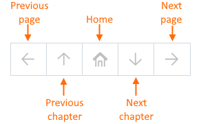
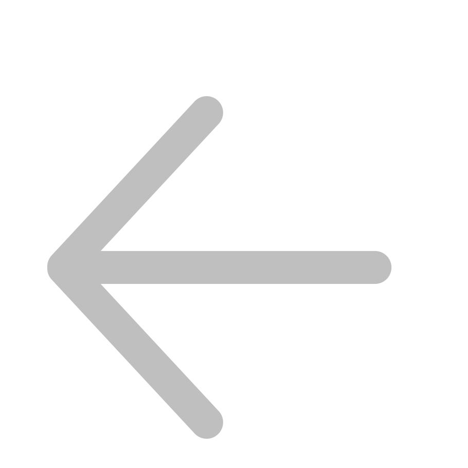
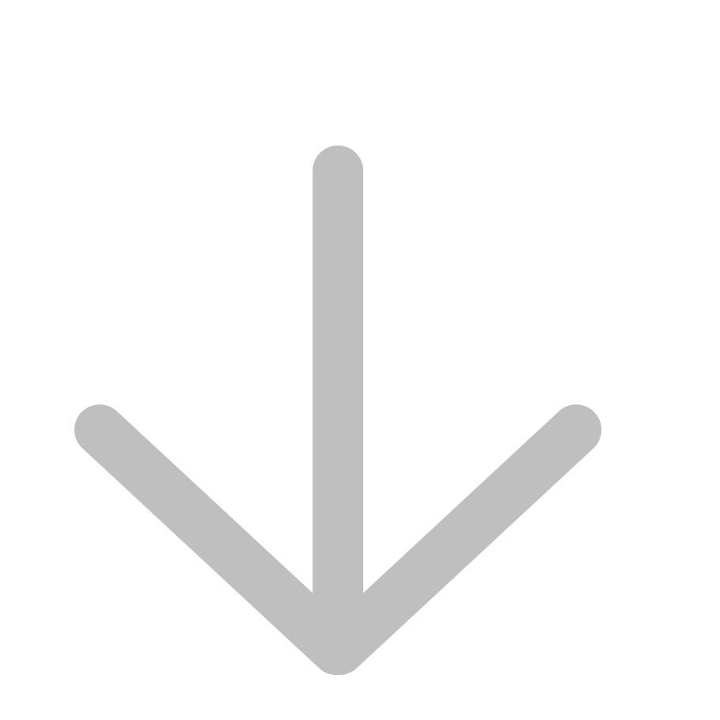
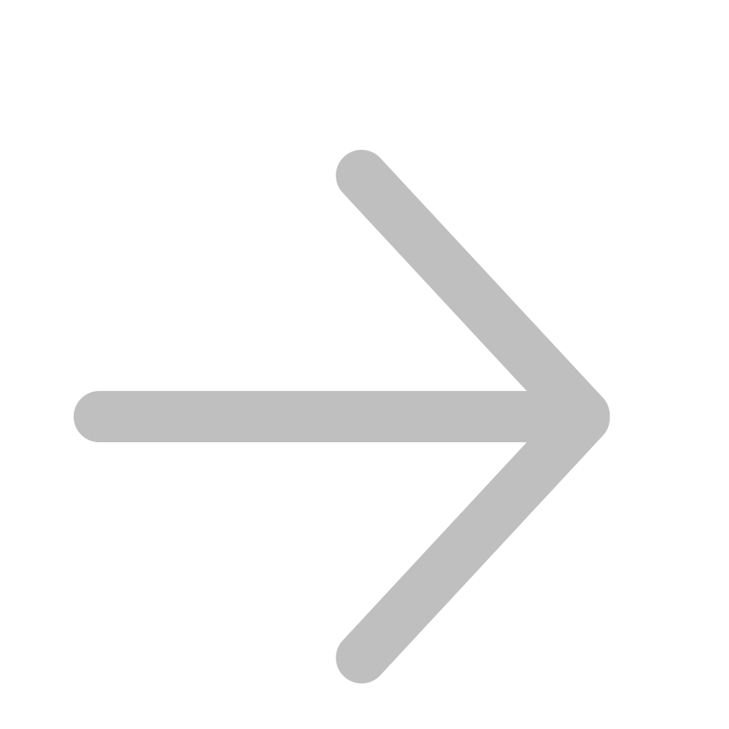
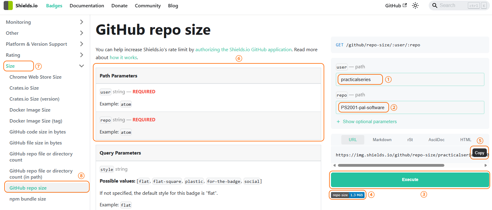

<a name="idtop"></a><!-- 🟢TOP OF PAGE - MARKER  (BLANK LINE BELOW)   -->

<!-- 🟢TOP OF PAGE - LOGO IMAGE -->
<p align="right"></p>      <!-- 🟢TOP OF PAGE - WEB ID     --> 

# 15<!--        🟥H1🟥-->Navigation bars, badges and buttons

Navigation bars are convenient mechanisms for switching between pages within the Wiki, buttons allow for the downloading of files and badges are simple images that show the status of a Wiki page.

All are covered in the following sections.

**[:arrow_up: Top](#idtop)**<!-- END OF SECTION - LINK TO TOP🔽🔽(BLANK LINE ABOVE) -->
<HR>                        <!-- END OF SECTION - SEPARATING LINE                    -->
<br>                        <!-- END OF SECTION - PADDING    🔼🔼(BLANK LINE BELOW) -->

## 15.1<!--     🟥H2🟥-->Navigation bars

Navigation bars are used in all PracticalSeries sidebars and footers, they are used to navigate around the Wiki, they look like this:

<table name="f-15-01" align="center"><!-- FIGURE START🔽🔽(BLANK LINE ABOVE) -->
<!-- Figure row --> <tr><td>
<!-- LINK -->         <a href="../15-0000/02-images/figm-15-01.png" title="Use ctrl+click to open image in new tab">
<!-- FIGURE -->         
                    </a></td></tr>
<!-- CAPTION -->    <tr><th align="center"><sup>
<!-- CAPTION TEXT -->   Figure 15.1 &mdash; Navigation bars
                    </sup></th></tr>
</table>                             <!-- FIGURE END  🔼🔼(BLANK LINE BELOW) -->

The navigation bars in the sidebar and footer are identical for a particular page, the icons have the following meanings:


<table name="f-15-02" align="center"><!-- FIGURE START🔽🔽(BLANK LINE ABOVE) -->
<!-- Figure row --> <tr><td>
<!-- LINK -->         <a href="../15-0000/02-images/figm-15-02.png" title="Use ctrl+click to open image in new tab">
<!-- FIGURE -->         
                    </a></td></tr>
<!-- CAPTION -->    <tr><th align="center"><sup>
<!-- CAPTION TEXT -->   Figure 15.2 &mdash; Navigation bar details
                    </sup></th></tr>
</table>                             <!-- FIGURE END  🔼🔼(BLANK LINE BELOW) -->

The navigation bar is constructed as a five-column table, each cell is configured with a link to the relevant page. The table is constructed using HTML, the following is a typical example:

<table name="t-15-01" align="center"><!-- 🔴🟢🔵TABLE START🔽🔽(BLANK LINE ABOVE) -->
<!-- TOP & WIDTH --><tr><th width="850" align="right"><sup>HTML and GitHub output
                    </sup></th></tr>
<!-- Header row --> <tr><th align="left">${\large \color{#00C050}\text{H\ T\ M\ L}}$ 🔽</th></tr>
<!-- HTML row -->   <tr><td align="left"><br><!-- 🟢HTML BELOW🟢 -->

```html
<table align="center"><tr><!-- NAVIGATION BAR -->
    <td align="center"><!-- PREVIOUS PAGE -->
        <a class="hlink" href="../06-0400/06.04%20Basic%20Markdown%20and%20text%20formatting.md">
        </a></td>
    <td align="center"><!-- PREVIOUS CHAPTER -->
        <a class="hlink" href="../05-0000/05%20Markdown,%20GitHub%20Markdown%20and%20HTML.md">
        </a></td>
    <td align="center"><!-- HOME -->
        <a class="hlink" href="home">
        </a></td>
    <td align="center"><!-- NEXT CHAPTER -->
        <a class="hlink" href="../07-0000/07%20Special%20characters%20and%20escaping%20characters.md">
        </a></td>
    <td align="center"><!-- NEXT PAGE -->
        <a class="hlink" href="../06-1000/06.10%20Basic%20Markdown%20and%20text%20formatting.md">
        </a></td>
</tr></table><!-- END OF NAVIGATION BAR -->

```
<p> </p></td></tr><!-- 🟢HTML END OF ROW🟢 -->
<!-- Header row --> <tr><th align="left">${\large \color{#B00000}\text{G\ I\ T\ H\ U\ B}\space\ \space\text{O\ U\ T\ P\ U\ T}}$ 🔽</th></tr>
<!-- GIT row -->    <tr><td align="left" valign="top"><!-- 🔵GITHUB OUTPUT BELOW (BLANK LINE BELOW)🔵 -->

<table align="center"><tr><!-- NAVIGATION BAR -->
    <td align="center"><!-- PREVIOUS PAGE -->
        <a class="hlink" href="../06-0400/06.04%20Basic%20Markdown%20and%20text%20formatting.md">
        </a></td>
    <td align="center"><!-- PREVIOUS CHAPTER -->
        <a class="hlink" href="../05-0000/05%20Markdown,%20GitHub%20Markdown%20and%20HTML.md">
        </a></td>
    <td align="center"><!-- HOME -->
        <a class="hlink" href="home">
        </a></td>
    <td align="center"><!-- NEXT CHAPTER -->
        <a class="hlink" href="../07-0000/07%20Special%20characters%20and%20escaping%20characters.md">
        </a></td>
    <td align="center"><!-- NEXT PAGE -->
        <a class="hlink" href="../06-1000/06.10%20Basic%20Markdown%20and%20text%20formatting.md">
        </a></td>
</tr></table><!-- END OF NAVIGATION BAR -->


</td></tr><!-- 🔵GITHUB OUTPUT END (BLANK LINE ABOVE)🔵 -->
<!-- CAPTION -->    <tr><th align="left"><sup>
<!-- CAPTION TEXT -->Table 15.1 &mdash; Navigation bar HTML
</table>                             <!-- 🟥🟩🟦TABLE END  🔼🔼(BLANK LINE BELOW) -->

*This is the link from the side bar of <a href="../06-0700/06.07%20Basic%20Markdown%20and%20text%20formatting.md#67emphasis-with-underlining">section&nbsp;6.7</a>.*

Each cell of the table `<td>` contains a link in the form:

&emsp; ${\color{#446FBD}\text{<td\ align="center">}}$

&emsp;&emsp; ${\color{#446FBD}\text{<a\ class="hlink"\ }\color{#B00000}\text{href="[PageName]"}}$

&emsp;&emsp; ${\color{#446FBD}\text{<\/a><\/td>}}$

Where the ${\color{#B00000}\text{href="[PageName]"}}$ is the name of the Wiki page being linked to in the standard format for a link (see <a href="../09-0000/09%20Links.md#921rules-for-linking-to-a-wiki-page">section&nbsp;9.2.1</a>), i.e.:<br><br>

<table name="l-15-01" align="center">   <!-- LIST START🔽🔽(BLANK LINE ABOVE) -->
<!-- LIST ROW 01  --><tr><td valign="top">&#x2776;<!-- 1  --></td>
    <td><!-- TEXT -->Do not add the <code>.md</code> extension to the ${\color{#B00000}\text{PageName}}$</td></tr>
<!-- LIST ROW 02  --><tr><td valign="top">&#x2777;<!-- 2  --></td>
    <td><!-- TEXT -->Any spaces within the ${\color{#B00000}\text{PageName}}$ are replaced with a dash `-`</td></tr>
<!-- LIST ROW 03  --><tr><td valign="top">&#x2778;<!-- 3  --></td>
    <td><!-- TEXT -->All uppercase letters are made lowercase (optional)</td></tr>
</table>                              <!-- LIST END    🔼🔼(BLANK LINE BELOW) -->

<br><br>
The ${\color{#00B050}\text{[ImageName]}}$ is one of five images stored in the Wiki directory: 

&emsp;&emsp;&nbsp;&nbsp; ${\color{#446FBD}\text{00-0000/02-images}}$


<table name="t-15-02" align="center"><!-- TABLE START🔽🔽(BLANK LINE ABOVE) -->
<!-- Header row --> <tr>
                        <th width="50" align="left">Image</th>
                        <th width="150" align="left">Filename</th>
                        <th width="250" align="left">Description</th>
                        <th width="250" align="left">Function</th>
                    </tr>
<!-- Data row -->   <tr>
                        <td align="center"></td>
                        <td align="left"><code>wi-l.svg</code></td>
                        <td align="left">Wiki image, left arrow</td>
                        <td align="left">Prev page</td>
                    </tr>
<!-- Data row -->   <tr>
                        <td align="center"></td>
                        <td align="left"><code>wi-u.svg</code></td>
                        <td align="left">Wiki image, up arrow</td>
                        <td align="left">Prev chapter</td>
                    </tr>
<!-- Data row -->   <tr>
                        <td align="center"></td>
                        <td align="left"><code>wi-h.svg</code></td>
                        <td align="left">Wiki image, home</td>
                        <td align="left">Home page</td>
                    </tr>
<!-- Data row -->   <tr>
                        <td align="center"></td>
                        <td align="left"><code>wi-d.svg</code></td>
                        <td align="left">Wiki image, down arrow</td>
                        <td align="left">Next chapter</td>
                    </tr>
<!-- Data row -->   <tr>
                        <td align="center"></td>
                        <td align="left"><code>wi-r.svg</code></td>
                        <td align="left">Wiki image, right arrow</td>
                        <td align="left">Next page</td>
                    </tr>
<!-- Data row -->   <tr>
                        <td align="center"></td>
                        <td align="left"><code>wi-b.svg</code></td>
                        <td align="left">Wiki image, white square (blank)</td>
                        <td align="left">Place holder for a blank cell</td>
                    </tr>
<!-- CAPTION -->    <tr><th colspan="4" align="left"><sup>
<!-- CAPTION TEXT -->   Table 15.2 &mdash; Navigation bar icon images
                    </sup></th></tr>
</table>
<br clear="all">                     <!-- TABLE END🔼🔼(BLANK LINE BELOW) -->

If you wish to use these images, I make them available to you, they are contained in the following zip file: 

<p align="center"><a href="https://github.com/practicalseries/GitHub-Wiki-Design-and-Implementation/wiki/00-0000/04-data/nav-bar-icons.zip"></a></p>

The ${\color{#ED7D31}\text{[AltText]}}$ and ${\color{#ED7D31}\text{[ToolTip]}}$ are always the same for each entry, they provide the tooltip that shows when the mouse hovers over the link and the alternate text if the image is not present. 

The text for each of these is listed in the Function column of the above table.

**[:arrow_up: Top](#idtop)**<!-- END OF SECTION - LINK TO TOP🔽🔽(BLANK LINE ABOVE) -->
<HR>                        <!-- END OF SECTION - SEPARATING LINE                    -->
<br>                        <!-- END OF SECTION - PADDING    🔼🔼(BLANK LINE BELOW) -->

### 15.1.1<!--  🟥H3🟥-->Navigation bar practicalities

Most pages in a Wiki contain a whole chapter. Under these circumstances, the previous page and the previous chapter have the same link (to the previous chapter). Similarly, the next page and the next chapter are also identical.

Where chapters are split, the previous/next page links to the adjacent section in the current chapter, the previous/next chapter always links to the chapter preceding or following the current chapter.

The first page in the Wiki (generally, the `home` page) does not have any previous chapter or previous page options; similarly the last page in the Wiki does not have next chapter or next page entries.

In these cases, where a cell in the navigation bar is empty, the entry becomes:

&emsp; ${\color{#446FBD}\text{<td\ align="center">}}$

&emsp;&emsp; ${\color{#446FBD}\text{<\/a><\/td>}}$

I.e. the cell simply contains the blank image (it has the same dimensions as the link images), this maintains the cell width. The cell does not contain an `<a>` anchor tag, there is no link.

**[:arrow_up: Top](#idtop)**<!-- END OF SECTION - LINK TO TOP🔽🔽(BLANK LINE ABOVE) -->
<HR>                        <!-- END OF SECTION - SEPARATING LINE                    -->
<br>                        <!-- END OF SECTION - PADDING    🔼🔼(BLANK LINE BELOW) -->

## 15.2<!--     🟥H2🟥-->Badges

Badges are used extensively in GitHub; these are some examples:

&emsp;&emsp;&emsp;<!---🟡ENTER URL🟡-->

&emsp;&emsp;&emsp;<!---🟡ENTER URL🟡-->

&emsp;&emsp;&emsp;<!---🟡ENTER URL🟡-->

These types of badges are used on all the PracticalSeries Wiki pages. The `Web ID` one at the top contains the chapter and section number of the current page, the three letters at the end (`eck` in this case), are a mechanism for tracking the page revision<a name="rn-01" href="#fn-01"><!-- 🟨FOOTNOTE LINK🟨--><sup>💠1</sup></a>.

The `loc` badge is used on sidebar and footer pages to identify which folder the sidebar or footer is located in *(it is a mechanism for identifying a particular sidebar or footer, it isn’t always clear which sidebar or footer you are working on, they all have the same name, just the folder is different, see <a href="../04-0000/04%20Different%20sidebars%20and%20footers.md">section&nbsp;4</a> for details)*.

The badge in the middle is just an example of what can be done with badges.

The badges used by the PracticalSeries Wiki *(and judging by appearances, most GitHub repositories)*, are generated on demand by the <a href="https://shields.io/">Shields.IO</a> website.

**[:arrow_up: Top](#idtop)**<!-- END OF SECTION - LINK TO TOP🔽🔽(BLANK LINE ABOVE) -->
<HR>                        <!-- END OF SECTION - SEPARATING LINE                    -->
<br>                        <!-- END OF SECTION - PADDING    🔼🔼(BLANK LINE BELOW) -->

### 15.2.1<!--  🟥H3🟥-->Creating a badge

These badges are not images stored in the Wiki. They are created dynamically by the <a href="https://shields.io/">Shields.IO</a> website from data passed to it from the Wiki page. Here’s an example:

<table name="t-15-02a" align="center"><!-- 🔴🟢🔵TABLE START🔽🔽(BLANK LINE ABOVE) -->
<!-- TOP & WIDTH --><tr><th width="850" align="right"><sup>HTML and GitHub output
                    </sup></th></tr>
<!-- Header row --> <tr><th align="left">${\large \color{#00C050}\text{H\ T\ M\ L}}$ 🔽</th></tr>
<!-- HTML row -->   <tr><td align="left"><br><!-- 🟢HTML BELOW🟢 -->

```html

```
<p> </p></td></tr><!-- 🟢HTML END OF ROW🟢 -->
<!-- Header row --> <tr><th align="left">${\large \color{#B00000}\text{G\ I\ T\ H\ U\ B}\space\ \space\text{O\ U\ T\ P\ U\ T}}$ 🔽</th></tr>
<!-- GIT row -->    <tr><td align="left" height="70" valign="middle"><!-- 🔵GITHUB OUTPUT BELOW (BLANK LINE BELOW)🔵 -->


</td></tr><!-- 🔵GITHUB OUTPUT END (BLANK LINE ABOVE)🔵 -->
</table>                             <!-- 🟥🟩🟦TABLE END  🔼🔼(BLANK LINE BELOW) -->

This is what Shields IO refer to as a *static* badge. Static badges contain fixed information passed to the website when the page is rendered *(as opposed to dynamic badges that can read various live data values from a repository, such as the number of commits &c.)*.

By default static badges are 20 px high (this is generally about right for the GitHub pages). To make the badges bigger or smaller, include the height attribute:

<table name="t-15-02b" align="center"><!-- 🔴🟢🔵TABLE START🔽🔽(BLANK LINE ABOVE) -->
<!-- TOP & WIDTH --><tr><th width="850" align="right"><sup>HTML and GitHub output
                    </sup></th></tr>
<!-- Header row --> <tr><th align="left">${\large \color{#00C050}\text{H\ T\ M\ L}}$ 🔽</th></tr>
<!-- HTML row -->   <tr><td align="left"><br><!-- 🟢HTML BELOW🟢 -->

```html

```
<p> </p></td></tr><!-- 🟢HTML END OF ROW🟢 -->
<!-- Header row --> <tr><th align="left">${\large \color{#B00000}\text{G\ I\ T\ H\ U\ B}\space\ \space\text{O\ U\ T\ P\ U\ T}}$ 🔽</th></tr>
<!-- GIT row -->    <tr><td align="left" height="70" valign="middle"><!-- 🔵GITHUB OUTPUT BELOW (BLANK LINE BELOW)🔵 -->


</td></tr><!-- 🔵GITHUB OUTPUT END (BLANK LINE ABOVE)🔵 -->
</table>                             <!-- 🟥🟩🟦TABLE END  🔼🔼(BLANK LINE BELOW) -->

> [!IMPORTANT]<!-- IMPORTANT ALERT -->
> ***The Shields IO badges are generated as SVG images and will scale either up or down without distortion.***

The image source is always the URL: `https://img.shields.io/badge/`, this is followed by the text for the `BadgeName` (the left-hand section of the badge with the grey background), followed by a dash character `-` and then the `BadgeText` (the right-hand section of the badge with the coloured background). 

This is followed by an addition dash `-` and then the colour for the background of the right-hand side of the badge.

The predefined colours are as follows; each is a range of colours from the top to the bottom:

<table name="t-15-03" align="center"><!-- TABLE START🔽🔽(BLANK LINE ABOVE) -->
<!-- Header row --> <tr>
                        <th width="100" align="center">Colour</th>
                        <th width="300" align="left">Name</th>
                        <th width="200" align="center">Top colour</th>
                        <th width="200" align="center">Bottom colour</th>
                    </tr>
<!-- Data row -->   <tr>
                        <td align="center"></td>
                        <td align="left"><code>brightgreen, success</code></td>
                        <td align="center"><code>#4FCA21</code></td>
                        <td align="center"><code>#3DB80F</code></td>
                    </tr>
<!-- Data row -->   <tr>
                        <td align="center"></td>
                        <td align="left"><code>green</code></td>
                        <td align="center"><code>#9AC812</code></td>
                        <td align="center"><code>#89B701</code></td>
                    </tr>
<!-- Data row -->   <tr>
                        <td align="center"></td>
                        <td align="left"><code>yellow</code></td>
                        <td align="center"><code>#DBB327</code></td>
                        <td align="center"><code>#C9A115</code></td>
                    </tr>
<!-- Data row -->   <tr>
                        <td align="center"></td>
                        <td align="left"><code>yellowgreen</code></td>
                        <td align="center"><code>#A6A82C</code></td>
                        <td align="center"><code>#94961A</code></td>
                    </tr>
<!-- Data row -->   <tr>
                        <td align="center"></td>
                        <td align="left"><code>orange, important</code></td>
                        <td align="center"><code>#F78344</code></td>
                        <td align="center"><code>#E57132</code></td>
                    </tr>
<!-- Data row -->   <tr>
                        <td align="center"></td>
                        <td align="left"><code>red, critical</code></td>
                        <td align="center"><code>#DC664F</code></td>
                        <td align="center"><code>#CA543D</code></td>
                    </tr>
<!-- Data row -->   <tr>
                        <td align="center"></td>
                        <td align="left"><code>blue, informational</code></td>
                        <td align="center"><code>#4FCA21</code></td>
                        <td align="center"><code>#3DB80F</code></td>
                    </tr>
<!-- Data row -->   <tr>
                        <td align="center"></td>
                        <td align="left"><code>grey, gray</code></td>
                        <td align="center"><code>#5F5F5F</code></td>
                        <td align="center"><code>#4D4D4D</code></td>
                    </tr>
<!-- Data row -->   <tr>
                        <td align="center"></td>
                        <td align="left"><code>lightgrey, lightgray, inactive</code></td>
                        <td align="center"><code>#A1A1A1</code></td>
                        <td align="center"><code>#8F8F8F</code></td>
                    </tr>
<!-- CAPTION -->    <tr><th colspan="4" align="left"><sup>
<!-- CAPTION TEXT -->   Table 15.3 &mdash; Shield.IO predefined colours and names
                    </sup></th></tr>
</table>
<br clear="all">                     <!-- TABLE END🔼🔼(BLANK LINE BELOW) -->

The colour can also be specified in hexadecimal RGB format:

<table name="t-15-03a" align="center"><!-- 🔴🟢🔵TABLE START🔽🔽(BLANK LINE ABOVE) -->
<!-- TOP & WIDTH --><tr><th width="850" align="right"><sup>HTML and GitHub output
                    </sup></th></tr>
<!-- Header row --> <tr><th align="left">${\large \color{#00C050}\text{H\ T\ M\ L}}$ 🔽</th></tr>
<!-- HTML row -->   <tr><td align="left"><br><!-- 🟢HTML BELOW🟢 -->

```html

```
<p> </p></td></tr><!-- 🟢HTML END OF ROW🟢 -->
<!-- Header row --> <tr><th align="left">${\large \color{#B00000}\text{G\ I\ T\ H\ U\ B}\space\ \space\text{O\ U\ T\ P\ U\ T}}$ 🔽</th></tr>
<!-- GIT row -->    <tr><td align="left" height="70" valign="middle"><!-- 🔵GITHUB OUTPUT BELOW (BLANK LINE BELOW)🔵 -->


</td></tr><!-- 🔵GITHUB OUTPUT END (BLANK LINE ABOVE)🔵 -->
</table>                             <!-- 🟥🟩🟦TABLE END  🔼🔼(BLANK LINE BELOW) -->

> [!NOTE]<!-- NOTE ALERT -->
> *The hexadecimal number is entered without a leading hash* `#`.

Spaces can be inserted into the text strings by using an underscore `_` or by using the `%20` character string (see <a href="../09-0500/09.05%20Links.md#962spaces-in-filenames">section&nbsp;9.6.2</a>). For example:

<table name="t-15-03b" align="center"><!-- 🔴🟢🔵TABLE START🔽🔽(BLANK LINE ABOVE) -->
<!-- TOP & WIDTH --><tr><th width="850" align="right"><sup>HTML and GitHub output
                    </sup></th></tr>
<!-- Header row --> <tr><th align="left">${\large \color{#00C050}\text{H\ T\ M\ L}}$ 🔽</th></tr>
<!-- HTML row -->   <tr><td align="left"><br><!-- 🟢HTML BELOW🟢 -->

```html

```
<p> </p></td></tr><!-- 🟢HTML END OF ROW🟢 -->
<!-- Header row --> <tr><th align="left">${\large \color{#B00000}\text{G\ I\ T\ H\ U\ B}\space\ \space\text{O\ U\ T\ P\ U\ T}}$ 🔽</th></tr>
<!-- GIT row -->    <tr><td align="left" height="70" valign="middle"><!-- 🔵GITHUB OUTPUT BELOW (BLANK LINE BELOW)🔵 -->


</td></tr><!-- 🔵GITHUB OUTPUT END (BLANK LINE ABOVE)🔵 -->
</table>                             <!-- 🟥🟩🟦TABLE END  🔼🔼(BLANK LINE BELOW) -->

Other escape sequences are:

A dash character `-` is entered as a double dash `--`
An underscore character `_` is entered as a double underscore `__`

<table name="t-15-03c" align="center"><!-- 🔴🟢🔵TABLE START🔽🔽(BLANK LINE ABOVE) -->
<!-- TOP & WIDTH --><tr><th width="850" align="right"><sup>HTML and GitHub output
                    </sup></th></tr>
<!-- Header row --> <tr><th align="left">${\large \color{#00C050}\text{H\ T\ M\ L}}$ 🔽</th></tr>
<!-- HTML row -->   <tr><td align="left"><br><!-- 🟢HTML BELOW🟢 -->

```html

```
<p> </p></td></tr><!-- 🟢HTML END OF ROW🟢 -->
<!-- Header row --> <tr><th align="left">${\large \color{#B00000}\text{G\ I\ T\ H\ U\ B}\space\ \space\text{O\ U\ T\ P\ U\ T}}$ 🔽</th></tr>
<!-- GIT row -->    <tr><td align="left" height="70" valign="middle"><!-- 🔵GITHUB OUTPUT BELOW (BLANK LINE BELOW)🔵 -->


</td></tr><!-- 🔵GITHUB OUTPUT END (BLANK LINE ABOVE)🔵 -->
</table>                             <!-- 🟥🟩🟦TABLE END  🔼🔼(BLANK LINE BELOW) -->

**[:arrow_up: Top](#idtop)**<!-- END OF SECTION - LINK TO TOP🔽🔽(BLANK LINE ABOVE) -->
<HR>                        <!-- END OF SECTION - SEPARATING LINE                    -->
<br>                        <!-- END OF SECTION - PADDING    🔼🔼(BLANK LINE BELOW) -->

### 15.2.2<!--  🟥H3🟥-->Static badge options


The basic form of the static badge:

<table name="t-15-03d" align="center"><!-- 🔴🟢🔵TABLE START🔽🔽(BLANK LINE ABOVE) -->
<!-- TOP & WIDTH --><tr><th width="850" align="right"><sup>HTML
                    </sup></th></tr>
<!-- Header row --> <tr><th align="left">${\large \color{#00C050}\text{H\ T\ M\ L}}$ 🔽</th></tr>
<!-- HTML row -->   <tr><td align="left"><br><!-- 🟢HTML BELOW🟢 -->

```html

```
<p> </p></td></tr><!-- 🟢HTML END OF ROW🟢 -->
</table>                             <!-- 🟥🟩🟦TABLE END  🔼🔼(BLANK LINE BELOW) -->

Can be supplemented by various other parameters. These are added to the URL as queries after the `Colour` entry as follows:


<table name="t-15-03e" align="center"><!-- 🔴🟢🔵TABLE START🔽🔽(BLANK LINE ABOVE) -->
<!-- TOP & WIDTH --><tr><th width="850" align="right"><sup>HTML
                    </sup></th></tr>
<!-- Header row --> <tr><th align="left">${\large \color{#00C050}\text{H\ T\ M\ L}}$ 🔽</th></tr>
<!-- HTML row -->   <tr><td align="left"><br><!-- 🟢HTML BELOW🟢 -->

```html

```
<p> </p></td></tr><!-- 🟢HTML END OF ROW🟢 -->
</table>                             <!-- 🟥🟩🟦TABLE END  🔼🔼(BLANK LINE BELOW) -->

Where:


<table name="t-15-04" align="center"><!-- TABLE START🔽🔽(BLANK LINE ABOVE) -->
<!-- Header row --> <tr>
                        <th width="100" align="center">Parameter</th>
                        <th width="250" align="left">Function</th>
                        <th width="200" align="center">Values</th>
                        <th width="300" align="center">Example</th>
                    </tr>
<!-- Data row -->   <tr>
                        <td align="center" rowspan="5"><code>[style]</code></td>
                        <td align="left" rowspan="5">Changes the appearance of the badge.<br><em>Note: any defined colours are ignored if the social style is selected.</em></td>
                        <td align="center"><code>#flat</code> (default)</td>
                        <td align="center"></td>
                    </tr>
<!-- Span row -->   <tr>
                    <td align="center"><code>flat-square</code></td>
                    <td align="center"></td>
                    </tr>
                    <tr>
                    <td align="center"><code>plastic</code></td>
                    <td align="center"></td>
                    </tr>
                    <tr>
                    <td align="center"><code>for-the-badge</code></td>
                    <td align="center"></td>
                    </tr>
                    <tr>
                    <td align="center"><code>social</code></td>
                    <td align="center"></td>
                    </tr>
<!-- Data row -->   <tr>
                        <td align="center" rowspan="3"><code>[logo]</code></td>
                        <td align="left" rowspan="3">Adds a particular logo to the badge before the BadgeName<br>The full list of logo codes is available here:<br>https://simpleicons.org/</td>
                        <td align="center"><code>dotenv</code></td>
                        <td align="center"></td>
                    </tr>
<!-- Span row -->   <tr>
                    <td align="center"><code>github</code></td>
                    <td align="center"></td>
                    </tr>
                    <tr>
                    <td align="center"><code>git</code></td>
                    <td align="center"></td>
                    </tr>
<!-- Data row -->   <tr>
                        <td align="center"><code>[logoColor]</code></td>
                        <td align="left">Changes the colour of any selected logo (see [logo])</td>
                        <td align="center"><code>blue</code></td>
                        <td align="center"></td>
                    </tr>
<!-- Data row -->   <tr>
                        <td align="center"><code>[logoSize]</code></td>
                        <td align="left">The only option is <code>auto</code>, it resizes some logos and make them fit better</td>
                        <td align="center"><code>auto</code></td>
                        <td align="center"></td>
                    </tr>
<!-- Data row -->   <tr>
                        <td align="center"><code>[labelColor]</code></td>
                        <td align="left">Changes the background colour of the left-hand side of the badge</td>
                        <td align="center"><code>#C00000</code></td>
                        <td align="center"></td>
                    </tr>
<!-- Data row -->   <tr>
                        <td align="center"><code>[Color]</code></td>
                        <td align="left">Changes the background colour of the right-hand side of the badge<br><em>(overrides any colour specified in the link)</em></td>
                        <td align="center"><code>orange</code></td>
                        <td align="center"></td>
                    </tr>
<!-- CAPTION -->    <tr><th colspan="4" align="left"><sup>
<!-- CAPTION TEXT -->   Table 15.4 &mdash; Shields.IO static badge parameters
                    </sup></th></tr>
</table>
<br clear="all">                     <!-- TABLE END🔼🔼(BLANK LINE BELOW) -->

The following produces this badge:

<table name="t-15-04a" align="center"><!-- 🔴🟢🔵TABLE START🔽🔽(BLANK LINE ABOVE) -->
<!-- TOP & WIDTH --><tr><th width="850" align="right"><sup>HTML and GitHub output
                    </sup></th></tr>
<!-- Header row --> <tr><th align="left">${\large \color{#00C050}\text{H\ T\ M\ L}}$ 🔽</th></tr>
<!-- HTML row -->   <tr><td align="left"><br><!-- 🟢HTML BELOW🟢 -->

```html


```
<p> </p></td></tr><!-- 🟢HTML END OF ROW🟢 -->
<!-- GIT row -->    <tr><td align="left" valign="top"><!-- 🔵GITHUB OUTPUT BELOW (BLANK LINE BELOW)🔵 -->


</td></tr><!-- 🔵GITHUB OUTPUT END (BLANK LINE ABOVE)🔵 -->
</table>                             <!-- 🟥🟩🟦TABLE END  🔼🔼(BLANK LINE BELOW) -->

**[:arrow_up: Top](#idtop)**<!-- END OF SECTION - LINK TO TOP🔽🔽(BLANK LINE ABOVE) -->
<HR>                        <!-- END OF SECTION - SEPARATING LINE                    -->
<br>                        <!-- END OF SECTION - PADDING    🔼🔼(BLANK LINE BELOW) -->

### 15.2.3<!--  🟥H3🟥-->Dynamic badges

Dynamic badges display some information about a repository (number of commits, repository size, releases status &c.). Dynamic badges are orientated towards the repository itself and not the Wiki associated with a repository so they have limited use as far as the Wiki is concerned.

Dynamic badges are again created by the <a href="https://shields.io/">Shields.IO</a> website from data passed to it from the Wiki page. Here’s an example (repository size):


<table name="t-15-04b" align="center"><!-- 🔴🟢🔵TABLE START🔽🔽(BLANK LINE ABOVE) -->
<!-- TOP & WIDTH --><tr><th width="850" align="right"><sup>HTML and GitHub output
                    </sup></th></tr>
<!-- Header row --> <tr><th align="left">${\large \color{#00C050}\text{H\ T\ M\ L}}$ 🔽</th></tr>
<!-- HTML row -->   <tr><td align="left"><br><!-- 🟢HTML BELOW🟢 -->

```html


```
<p> </p></td></tr><!-- 🟢HTML END OF ROW🟢 -->
<!-- GIT row -->    <tr><td align="left" valign="top"><!-- 🔵GITHUB OUTPUT BELOW (BLANK LINE BELOW)🔵 -->


</td></tr><!-- 🔵GITHUB OUTPUT END (BLANK LINE ABOVE)🔵 -->
</table>                             <!-- 🟥🟩🟦TABLE END  🔼🔼(BLANK LINE BELOW) -->

The data in the badge updates each time the webpage is reloaded or refreshed.

Dynamic badges require information about the repository, in the above example it needed the username and repository name in the format:


&emsp;&emsp; ${\color{#446FBD}\text{}}$

The `repo-size` entry changes depending on the metric being accessed.

There are a great many different dynamic badges available via the Shields.IO website. The website also has a built-in configuration tool that generates and tests the badge from information you supply.

The following is the populated webpage for the above badge, the page is available here:

&emsp;&emsp;&emsp;<!---🟡ENTER URL🟡-->https://shields.io/badges/git-hub-repo-size

The populated page looks like this:

<table name="f-15-03" align="center"><!-- FIGURE START🔽🔽(BLANK LINE ABOVE) -->
<!-- Figure row --> <tr><td>
<!-- LINK -->         <a href="../15-0000/02-images/figm-15-03.png" title="Use ctrl+click to open image in new tab">
<!-- FIGURE -->         
                    </a></td></tr>
<!-- CAPTION -->    <tr><th align="center"><sup>
<!-- CAPTION TEXT -->   Figure 15.1 &mdash; Dynamic badge configuration
                    </sup></th></tr>
</table>                             <!-- FIGURE END  🔼🔼(BLANK LINE BELOW) -->

Enter the username in point 1 and enter the repository name in point 2.

To see what the badge looks like, click the ${\large \color{#00B050}\langle\text{Execute}\rangle}$ button, point 3 and the badge is displayed point 4.

The populated link can be copied by hovering the mouse over it and clicking the copy button, point 5. This is the `src="https:…"` link in the `` tag above.

There is a very brief description of what each entry means in the centre of the page, point 6. Sometimes these are not very helpful and some experimentation is required.

All the dynamic badges for GitHub are listed in the entries on the left-hand side, in this case it was under Size, point 7 and GitHub repo size, point 8. The biggest problem is guessing the title under which the badge you require is listed.

> [!NOTE]<!-- NOTE ALERT -->
> *All the dynamic badges that can be used on GitHub start with the word GitHub.*

Some badges require a commit number, generally give this as the full 40-digit sha number. E.g.: `224d0145ba4afb930a9517c91817ed61c732cb2c`.

Dynamic badges can be coloured and the text changed using the same options as for a static badge, see <a href="#152badges">section&nbsp;15.2.2</a>. 

**[:arrow_up: Top](#idtop)**<!-- END OF SECTION - LINK TO TOP🔽🔽(BLANK LINE ABOVE) -->
<HR>                        <!-- END OF SECTION - SEPARATING LINE                    -->
<br>                        <!-- END OF SECTION - PADDING    🔼🔼(BLANK LINE BELOW) -->

## 15.3<!--     🟥H2🟥-->Buttons

GitHub doesn’t directly support the use of buttons in Markdown, despite having its own buttons on the screen (the ${\large \color{#00B050}\langle\text{new\ page}\rangle}$ button at the top of each Wiki page for example).

It is possible to add a button by creating an image (with any associated text) and pasting it into a Wiki page as a link (see <a href="../11-0000/11%20Images.md#1124making-the-image-a-link">section&nbsp;11.2.4</a>).

There is, however, a much easier way using the Shield IO (discussed in the previous sections). Look at the following (it works by the way):

<p align="center"><a href="https://github.com/practicalseries/GitHub-Wiki-Design-and-Implementation/wiki/00-0000/04-data/github-wiki-design.pdf"></a></p>

This uses a Shields IO badge in a HTML link as follows:

<table name="t-15-05" align="center"><!-- 🔴🟢🔵TABLE START🔽🔽(BLANK LINE ABOVE) -->
<!-- TOP & WIDTH --><tr><th width="850" align="right"><sup>HTML and GitHub output
                    </sup></th></tr>
<!-- Header row --> <tr><th align="left">${\large \color{#00C050}\text{H\ T\ M\ L}}$ 🔽</th></tr>
<!-- HTML row -->   <tr><td align="left"><br><!-- 🟢HTML BELOW🟢 -->

```html
<a href="https://github.com/practicalseries/GitHub-Wiki-Design-and-Implementation/wiki/00-0000/04-data/github-wiki-design.pdf"></a>
```
<p> </p></td></tr><!-- 🟢HTML END OF ROW🟢 -->
<!-- Header row --> <tr><th align="left">${\large \color{#B00000}\text{G\ I\ T\ H\ U\ B}\space\ \space\text{O\ U\ T\ P\ U\ T}}$ 🔽</th></tr>
<!-- GIT row -->    <tr><td align="left" valign="top"><!-- 🔵GITHUB OUTPUT BELOW (BLANK LINE BELOW)🔵 -->

<a href="https://github.com/practicalseries/GitHub-Wiki-Design-and-Implementation/wiki/00-0000/04-data/github-wiki-design.pdf"></a>

</td></tr><!-- 🔵GITHUB OUTPUT END (BLANK LINE ABOVE)🔵 -->
<!-- CAPTION -->    <tr><th align="left"><sup>
<!-- CAPTION TEXT -->Table 15.5 &mdash; An example button
</table>                             <!-- 🟥🟩🟦TABLE END  🔼🔼(BLANK LINE BELOW) -->

The first part is an anchor link to the downloadable document (see <a href="../09-0500/09.05%20Links.md#96downloading-a-file">section&nbsp;9.6</a> for details). In this case it is:

&emsp;`https://github.com/practicalseries/GitHub-Wiki-Design-and-Implementation/wiki/00-0000/04-data/github-wiki-design.pdf`

*This is the download link to the pdf version of this Wiki, it works if you put it into a web browser.*

This is followed by an `` tag that contains a Shields IO badge *(just like those in the previous sections)*. The only difference is that the BadgeName (the left-hand side of the badge) is missing.

This is a perfectly acceptable arrangement for Shield IO badges. 

The normal format for a Shields IO badge is:

<table name="t-15-05a" align="center"><!-- 🔴🟢🔵TABLE START🔽🔽(BLANK LINE ABOVE) -->
<!-- TOP & WIDTH --><tr><th width="850" align="right"><sup>HTML and GitHub output
                    </sup></th></tr>
<!-- Header row --> <tr><th align="left">${\large \color{#00C050}\text{H\ T\ M\ L}}$ 🔽</th></tr>
<!-- HTML row -->   <tr><td align="left"><br><!-- 🟢HTML BELOW🟢 -->

```html

```
<p> </p></td></tr><!-- 🟢HTML END OF ROW🟢 -->
<!-- Header row --> <tr><th align="left">${\large \color{#B00000}\text{G\ I\ T\ H\ U\ B}\space\ \space\text{O\ U\ T\ P\ U\ T}}$ 🔽</th></tr>
<!-- GIT row -->    <tr><td align="left" height="70" valign="middle"><!-- 🔵GITHUB OUTPUT BELOW (BLANK LINE BELOW)🔵 -->


</td></tr><!-- 🔵GITHUB OUTPUT END (BLANK LINE ABOVE)🔵 -->
</table>                             <!-- 🟥🟩🟦TABLE END  🔼🔼(BLANK LINE BELOW) -->

By removing the `BadgeName` and the first dash `-` we have:

<table name="t-15-05a" align="center"><!-- 🔴🟢🔵TABLE START🔽🔽(BLANK LINE ABOVE) -->
<!-- TOP & WIDTH --><tr><th width="850" align="right"><sup>HTML and GitHub output
                    </sup></th></tr>
<!-- Header row --> <tr><th align="left">${\large \color{#00C050}\text{H\ T\ M\ L}}$ 🔽</th></tr>
<!-- HTML row -->   <tr><td align="left"><br><!-- 🟢HTML BELOW🟢 -->

```html

```
<p> </p></td></tr><!-- 🟢HTML END OF ROW🟢 -->
<!-- Header row --> <tr><th align="left">${\large \color{#B00000}\text{G\ I\ T\ H\ U\ B}\space\ \space\text{O\ U\ T\ P\ U\ T}}$ 🔽</th></tr>
<!-- GIT row -->    <tr><td align="left" height="70" valign="middle"><!-- 🔵GITHUB OUTPUT BELOW (BLANK LINE BELOW)🔵 -->


</td></tr><!-- 🔵GITHUB OUTPUT END (BLANK LINE ABOVE)🔵 -->
</table>                             <!-- 🟥🟩🟦TABLE END  🔼🔼(BLANK LINE BELOW) -->

That’s all we’ve done here, the general format for a button is thus:

<table name="t-15-06" align="center"><!-- 🔴🟢🔵TABLE START🔽🔽(BLANK LINE ABOVE) -->
<!-- TOP & WIDTH --><tr><th width="850" align="right"><sup>HTML
                    </sup></th></tr>
<!-- Header row --> <tr><th align="left">${\large \color{#00C050}\text{H\ T\ M\ L}}$ 🔽</th></tr>
<!-- HTML row -->   <tr><td align="left"><br><!-- 🟢HTML BELOW🟢 -->

```html
<a href="[LinkURL]" download></a>
```
<p> </p></td></tr><!-- 🟢HTML END OF ROW🟢 -->
<!-- CAPTION -->    <tr><th align="left"><sup>
<!-- CAPTION TEXT -->Table 15.6 &mdash; Button general format
</table>                             <!-- 🟥🟩🟦TABLE END  🔼🔼(BLANK LINE BELOW) -->

Where `[LinkURL]` is the link to whatever the button is linking to.

The `[BadgeText]` is the text that appears on the button.

The button itself is given the colour `#1F883D` which is the green colour of the GitHub buttons *(obviously, you can choose any colour for your button, I’ve just made mine the same as GitHub)*.


To centre a button on the screen put a `<p align="center">` before the link and `</p>` after it:


<table name="t-15-06a" align="center"><!-- 🔴🟢🔵TABLE START🔽🔽(BLANK LINE ABOVE) -->
<!-- TOP & WIDTH --><tr><th width="850" align="right"><sup>HTML and GitHub output
                    </sup></th></tr>
<!-- Header row --> <tr><th align="left">${\large \color{#00C050}\text{H\ T\ M\ L}}$ 🔽</th></tr>
<!-- HTML row -->   <tr><td align="left"><br><!-- 🟢HTML BELOW🟢 -->

```html
<p align="center"><a href="https://github.com/practicalseries/GitHub-Wiki-Design-and-Implementation/
wiki/00-0000/04-data/github-wiki-design.pdf"></a></p>
```
<p> </p></td></tr><!-- 🟢HTML END OF ROW🟢 -->
<!-- Header row --> <tr><th align="left">${\large \color{#B00000}\text{G\ I\ T\ H\ U\ B}\space\ \space\text{O\ U\ T\ P\ U\ T}}$ 🔽</th></tr>
<!-- GIT row -->    <tr><td align="left" height="70" valign="middle"><!-- 🔵GITHUB OUTPUT BELOW (BLANK LINE BELOW)🔵 -->

<p align="center"><a href="https://github.com/practicalseries/GitHub-Wiki-Design-and-Implementation/wiki/00-0000/04-data/github-wiki-design.pdf"></a></p>

</td></tr><!-- 🔵GITHUB OUTPUT END (BLANK LINE ABOVE)🔵 -->
</table>                             <!-- 🟥🟩🟦TABLE END  🔼🔼(BLANK LINE BELOW) -->

<hr><!-- FOOTNOTE SEPARATOR 🟡🟡🟡🟡🟡 -->
<a name="idfn" href="#idfn">Footnotes:<!-- 🟡FOOTNOTE TITLE🟡 -->&emsp;&emsp;&emsp;&emsp;&emsp;</a>
<br><br><br>

> [!NOTE]<!-- 🟡FOOTNOTE CONTENT -->
> <a name="fn-01" href="#rn-01"><sup>💠1</sup></a>&emsp;<!-- FOOTNOTE CONTENT TEXT -->The encoding I use is just the date I posted the page, it helps me keep track of which revision the page is at. The first letter is the year (starting at `a`=2021, `b`=2022 &c.). The second letter is the month (`a`=January, `b`=February &c) and the third is the day (`a`=1, `b`=2, … `A`=27, … `E`=31).
> 
> In the example, `eck` corresponds to 11<sup>th</sup> March 2025.<!--  CONTENT TEXT END --><a href="#rn-01">↩</a><!-- 🟡🟡🟡🟡🟡 FOOTNOTE END -->

<br><br>            <!-- END OF PAGE - 🟥🟥🟥🟥🟥 PADDING🔽🔽(NO BLANK LINE ABOVE) -->
<hr>                <!-- END OF PAGE - 🟥🟥🟥🟥🟥 SEPARATING LINE                   -->
<a name="idend"></a><!-- END OF PAGE – 🟥🟥🟥🟥🟥 MARKER 🔼🔼                      -->

- [15Navigation bars, badges and buttons](#15navigation-bars-badges-and-buttons)
  - [15.1Navigation bars](#151navigation-bars)
    - [15.1.1Navigation bar practicalities](#1511navigation-bar-practicalities)
  - [15.2Badges](#152badges)
    - [15.2.1Creating a badge](#1521creating-a-badge)
    - [15.2.2Static badge options](#1522static-badge-options)
    - [15.2.3Dynamic badges](#1523dynamic-badges)
  - [15.3Buttons](#153buttons)
