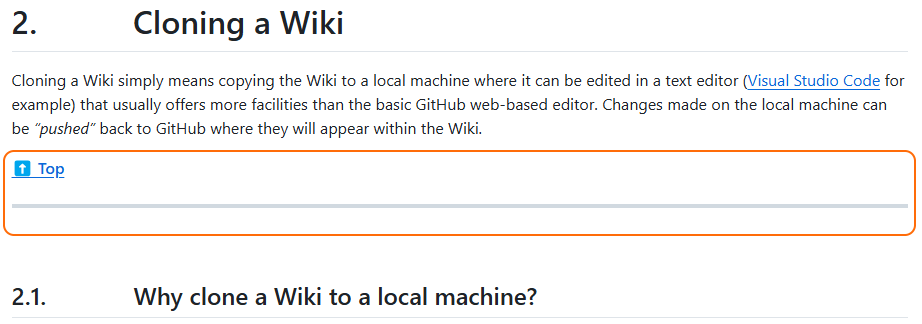
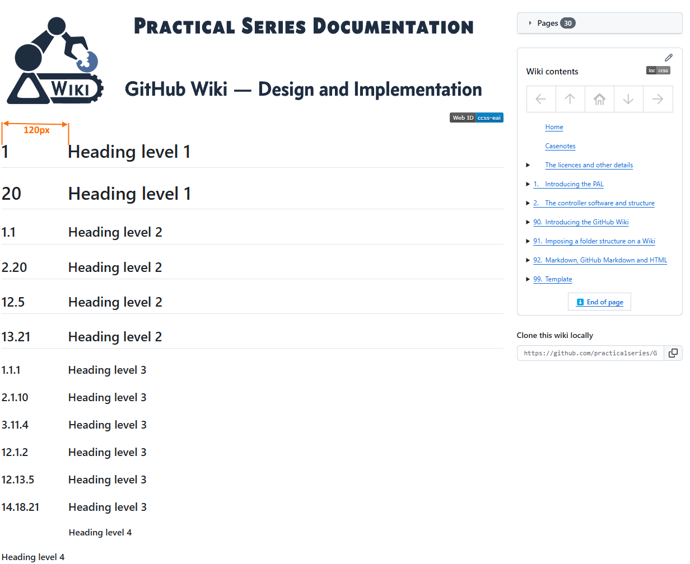
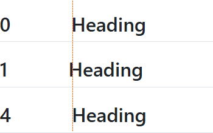
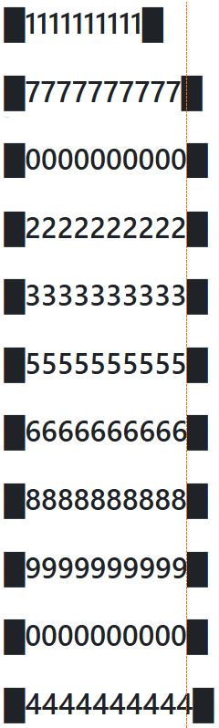

<a name="idtop"></a><!-- 🟢TOP OF PAGE - MARKER  (BLANK LINE BELOW)   -->

<!-- 🟢TOP OF PAGE - LOGO IMAGE -->
<p align="right"></p>      <!-- 🟢TOP OF PAGE - WEB ID     --> 

<table name="t-TOC-01" align="center"><!-- TABLE START🔽🔽(BLANK LINE ABOVE) -->
<!-- DATA ROW -->   <tr>
                        <td width="506" align="left" valign="top">
<details ><!-- HOME          🟢🟢🟢 UNNUMBERED, COLLAPSIBLE -->
<summary>&emsp;&ensp;&nbsp;<a href="../Home.md"><!-- HEAD -->Home</a>
</summary><!-- BLANK LINE BELOW -->

&emsp;&emsp;&emsp;&emsp;&emsp;&ensp;&nbsp;[The GitHub Wiki](../Home.md#github-wiki--design-and-implementation)<br>
&emsp;&emsp;&emsp;&emsp;&emsp;&ensp;&nbsp;[What does this guide cover?](../Home.md#what-does-this-guide-cover)<br>
&emsp;&emsp;&emsp;&emsp;&emsp;&ensp;&nbsp;[A note by the Author](../Home.md#a-note-by-the-author)<br>
</details><!--               🟩🟩🟩 -->

<details ><!-- LICENCE       🟢🟢🟢 UNNUMBERED, COLLAPSIBLE -->
<summary>&emsp;&ensp;&nbsp;<a href="../00-0000/Licence.md"><!-- HEAD -->Licence</a>
</summary><!-- BLANK LINE BELOW -->

&emsp;&emsp;&emsp;&emsp;&emsp;&ensp;&nbsp;[The licences and other details](../00-0000/Licence.md#the-licences-and-other-details)<br>
&emsp;&emsp;&emsp;&emsp;&emsp;&ensp;&nbsp;[The Licence](../00-0000/Licence.md#the-licence)<br>
&emsp;&emsp;&emsp;&emsp;&emsp;&ensp;&nbsp;[Why did I choose the MIT Licence?](../00-0000/Licence.md#why-did-i-choose-the-mit-licence)<br>
&emsp;&emsp;&emsp;&emsp;&emsp;&ensp;&nbsp;[Permissive licences](../00-0000/Licence.md#permissive-licences)<br>
&emsp;&emsp;&emsp;&emsp;&emsp;&ensp;&nbsp;[Copyleft licence](../00-0000/Licence.md#copyleft-licence)<br>
&emsp;&emsp;&emsp;&emsp;&emsp;&ensp;&nbsp;[Limiting liabilities](../00-0000/Licence.md#limiting-liabilities)<br>
&emsp;&emsp;&emsp;&emsp;&emsp;&ensp;&nbsp;[Which licence to use?](../00-0000/Licence.md#which-licence-to-use)<br>
&emsp;&emsp;&emsp;&emsp;&emsp;&ensp;&nbsp;[A note on spelling: licence or license](../00-0000/Licence.md#a-note-on-spelling-licence-or-license)<br>
</details><!--               🟩🟩🟩 -->

<details><!-- [SECTION 01]   🟢🟢🟢 SECTION GENERAL SINGLE DIGIT CHAPTER-->
<summary><a href="../01-0000/01%20Introducing%20the%20GitHub%20Wiki.md">1<!-- NUM -->&ensp;&nbsp;&nbsp;&thinsp;<!-- HEAD -->Introducing the GitHub Wiki</a>
</summary><!-- BLANK LINE BELOW -->

&emsp;&ensp;&hairsp;[1.1&emsp;&emsp;&nbsp;&nbsp;&thinsp;&hairsp;What are GitHub Wiki pages?](../01-0000/01%20Introducing%20the%20GitHub%20Wiki.md#11what-are-github-wiki-pages)<br>
&emsp;&ensp;&hairsp;[1.2&emsp;&emsp;&nbsp;&nbsp;&thinsp;&hairsp;Understanding the Wiki pages](../01-0000/01%20Introducing%20the%20GitHub%20Wiki.md#12understanding-the-wiki-pages)<br>
&emsp;&ensp;&hairsp;[1.3&emsp;&emsp;&nbsp;&nbsp;&thinsp;&hairsp;Creating a Wiki for a repository](../01-0000/01%20Introducing%20the%20GitHub%20Wiki.md#13creating-a-wiki-for-a-repository)<br>
&emsp;&ensp;&hairsp;[1.3.1&emsp;&nbsp;&nbsp;&nbsp;&nbsp;Creating the first Wiki page](../01-0000/01%20Introducing%20the%20GitHub%20Wiki.md#131creating-the-first-wiki-page)<br>
&emsp;&ensp;&hairsp;[1.3.2&emsp;&nbsp;&nbsp;&nbsp;&nbsp;Creating additional pages](../01-0000/01%20Introducing%20the%20GitHub%20Wiki.md#132creating-additional-pages)<br>
&emsp;&ensp;&hairsp;[1.3.3&emsp;&nbsp;&nbsp;&nbsp;&nbsp;Editing a Wiki page](../01-0000/01%20Introducing%20the%20GitHub%20Wiki.md#133editing-a-wiki-page)<br>
&emsp;&ensp;&hairsp;[1.4&emsp;&emsp;&nbsp;&nbsp;&thinsp;&hairsp;The Wiki is its own repository](../01-0000/01%20Introducing%20the%20GitHub%20Wiki.md#14the-wiki-is-its-own-repository)<br>
&emsp;&ensp;&hairsp;[1.4.1&emsp;&nbsp;&nbsp;&nbsp;&nbsp;Viewing a Wiki page history](../01-0000/01%20Introducing%20the%20GitHub%20Wiki.md#141viewing-a-wiki-page-history)<br>
&emsp;&ensp;&hairsp;[1.4.2&emsp;&nbsp;&nbsp;&nbsp;&nbsp;How GitHub handles Wiki branche](../01-0000/01%20Introducing%20the%20GitHub%20Wiki.md#142how-github-handles-wiki-branches)<br>
&emsp;&ensp;&hairsp;[1.4.3&emsp;&nbsp;&nbsp;&nbsp;&nbsp;The Wiki link to the main repository](../01-0000/01%20Introducing%20the%20GitHub%20Wiki.md#143the-wiki-and-its-link-to-the-main-repository)<br>
&emsp;&ensp;&hairsp;[1.5&emsp;&emsp;&nbsp;&nbsp;&thinsp;&hairsp;Basic components of a Wiki page](../01-0000/01%20Introducing%20the%20GitHub%20Wiki.md#15basic-components-of-a-wiki-page)<br>
&emsp;&ensp;&hairsp;[1.5.1&emsp;&nbsp;&nbsp;&nbsp;&nbsp;Title bar and revision](../01-0000/01%20Introducing%20the%20GitHub%20Wiki.md#151title-bar-and-revision)<br>
&emsp;&ensp;&hairsp;[1.5.2&emsp;&nbsp;&nbsp;&nbsp;&nbsp;Contents (pages) area](../01-0000/01%20Introducing%20the%20GitHub%20Wiki.md#152contents-pages-area)<br>
&emsp;&emsp;&emsp;&emsp;&emsp;&ensp;&nbsp;[Listing pages in the order you want](../01-0000/01%20Introducing%20the%20GitHub%20Wiki.md#listing-the-pages-in-the-order-you-want)<br>
&emsp;&ensp;&hairsp;[1.5.3&emsp;&nbsp;&nbsp;&nbsp;&nbsp;Sidebars](../01-0000/01%20Introducing%20the%20GitHub%20Wiki.md#153sidebars)<br>
&emsp;&ensp;&hairsp;[1.5.4&emsp;&nbsp;&nbsp;&nbsp;&nbsp;Footers](../01-0000/01%20Introducing%20the%20GitHub%20Wiki.md#154footers)<br>
&emsp;&ensp;&hairsp;[1.6&emsp;&emsp;&nbsp;&nbsp;&thinsp;&hairsp;Sidebars and footers](../01-0000/01%20Introducing%20the%20GitHub%20Wiki.md#16sidebars-and-footers)<br>
&emsp;&ensp;&hairsp;[1.6.1&emsp;&nbsp;&nbsp;&nbsp;&nbsp;Creating a sidebar and footer](../01-0000/01%20Introducing%20the%20GitHub%20Wiki.md#161creating-a-sidebar-and-footer-in-github)<br>
</details><!--               🟩🟩🟩 -->

<details><!-- [SECTION 02]   🟢🟢🟢 SECTION GENERAL SINGLE DIGIT CHAPTER-->
<summary><a href="../02-0000/02%20Cloning%20a%20Wiki.md">2<!-- NUM -->&ensp;&nbsp;&nbsp;&thinsp;<!-- HEAD -->Cloning a Wiki</a>
</summary><!-- BLANK LINE BELOW -->

&emsp;&ensp;&hairsp;[2.1&emsp;&emsp;&nbsp;&nbsp;&thinsp;&hairsp;Why clone a Wiki?](../02-0000/02%20Cloning%20a%20Wiki.md#21why-clone-a-wiki)<br>
&emsp;&ensp;&hairsp;[2.2&emsp;&emsp;&nbsp;&nbsp;&thinsp;&hairsp;How to clone a Wiki](../02-0000/02%20Cloning%20a%20Wiki.md#22how-to-clone-a-wiki)<br>
&emsp;&ensp;&hairsp;[2.3&emsp;&emsp;&nbsp;&nbsp;&thinsp;&hairsp;Pushing local changes to GitHub](../02-0000/02%20Cloning%20a%20Wiki.md#23pushing-local-changes-to-github)<br>
&emsp;&ensp;&hairsp;[2.3.1&emsp;&nbsp;&nbsp;&nbsp;&nbsp;Configuring username and email](../02-0000/02%20Cloning%20a%20Wiki.md#231configuring-a-git-username-and-email-address)<br>
&emsp;&ensp;&hairsp;[2.3.2&emsp;&nbsp;&nbsp;&nbsp;&nbsp;Modifying the local repository](../02-0000/02%20Cloning%20a%20Wiki.md#232modifying-the-local-repository)<br>
&emsp;&ensp;&hairsp;[2.3.3&emsp;&nbsp;&nbsp;&nbsp;&nbsp;Committing and synchronising](../02-0000/02%20Cloning%20a%20Wiki.md#233committing-and-synchronising-the-changes)<br>
</details><!--               🟩🟩🟩 -->

<details><!-- [SECTION 03]   🟢🟢🟢 SECTION GENERAL SINGLE DIGIT CHAPTER-->
<summary><a href="../03-0000/03%20A%20Wiki%20folder%20structure.md">3<!-- NUM -->&ensp;&nbsp;&nbsp;&thinsp;<!-- HEAD -->A Wiki folder structure</a>
</summary><!-- BLANK LINE BELOW -->

&emsp;&ensp;&hairsp;[3.1&emsp;&emsp;&nbsp;&nbsp;&thinsp;&hairsp;The default arrangement](../03-0000/03%20A%20Wiki%20folder%20structure.md#31the-default-arrangement)<br>
&emsp;&ensp;&hairsp;[3.2&emsp;&emsp;&nbsp;&nbsp;&thinsp;&hairsp;Create a sidebar or footer locally](../03-0000/03%20A%20Wiki%20folder%20structure.md#32create-a-sidebar-or-footer-locally)<br>
&emsp;&ensp;&hairsp;[3.3&emsp;&emsp;&nbsp;&nbsp;&thinsp;&hairsp;Page naming and Wiki limits](../03-0000/03%20A%20Wiki%20folder%20structure.md#33page-naming-and-wiki-limits)<br>
&emsp;&ensp;&hairsp;[3.3.1&emsp;&nbsp;&nbsp;&nbsp;&nbsp;Supported file types](../03-0000/03%20A%20Wiki%20folder%20structure.md#331supported-file-types)<br>
&emsp;&ensp;&hairsp;[3.3.2&emsp;&nbsp;&nbsp;&nbsp;&nbsp;Page names and numbering](../03-0000/03%20A%20Wiki%20folder%20structure.md#332page-names-and-numbering)<br>
&emsp;&ensp;&hairsp;[3.3.3&emsp;&nbsp;&nbsp;&nbsp;&nbsp;Rules for page numbering](../03-0000/03%20A%20Wiki%20folder%20structure.md#333rules-for-page-numbering)<br>
&emsp;&ensp;&hairsp;[3.3.4&emsp;&nbsp;&nbsp;&nbsp;&nbsp;Limits for Wiki pages](../03-0000/03%20A%20Wiki%20folder%20structure.md#334limits-for-wiki-pages)<br>
&emsp;&ensp;&hairsp;[3.4&emsp;&emsp;&nbsp;&nbsp;&thinsp;&hairsp;A Practical Wiki folder structure](../03-0000/03%20A%20Wiki%20folder%20structure.md#34a-practical-wiki-folder-structure)<br>
&emsp;&ensp;&hairsp;[3.4.1&emsp;&nbsp;&nbsp;&nbsp;&nbsp;Subfolder names for Wiki pages](../03-0000/03%20A%20Wiki%20folder%20structure.md#341subfolder-names-for-wiki-pages)<br>
&emsp;&ensp;&hairsp;[3.4.2&emsp;&nbsp;&nbsp;&nbsp;&nbsp;Storing images and other data](../03-0000/03%20A%20Wiki%20folder%20structure.md#342storing-images-and-other-data)<br>
</details><!--               🟩🟩🟩 -->

<details><!-- [SECTION 04]   🟢🟢🟢 SECTION GENERAL SINGLE DIGIT CHAPTER-->
<summary><a href="../04-0000/04%20Different%20sidebars%20and%20footers.md">4<!-- NUM -->&ensp;&nbsp;&nbsp;&thinsp;<!-- HEAD -->Different sidebars and footers</a>
</summary><!-- BLANK LINE BELOW -->

&emsp;&ensp;&hairsp;[4.1&emsp;&emsp;&nbsp;&nbsp;&thinsp;&hairsp;How sidebars work](../04-0000/04%20Different%20sidebars%20and%20footers.md#41how-sidebars-work)<br>
&emsp;&ensp;&hairsp;[4.1.1&emsp;&nbsp;&nbsp;&nbsp;&nbsp;The PracticalSeries sidebar](../04-0000/04%20Different%20sidebars%20and%20footers.md#411the-practicalseries-sidebar)<br>
&emsp;&ensp;&hairsp;[4.2&emsp;&emsp;&nbsp;&nbsp;&thinsp;&hairsp;How footers work](../04-0000/04%20Different%20sidebars%20and%20footers.md#42how-footers-work)<br>
&emsp;&ensp;&hairsp;[4.2.1&emsp;&nbsp;&nbsp;&nbsp;&nbsp;The PracticalSeries footer](../04-0000/04%20Different%20sidebars%20and%20footers.md#421the-practicalseries-footer)<br>
</details><!--               🟩🟩🟩 -->

<details><!-- [SECTION 05]   🟢🟢🟢 SECTION GENERAL SINGLE DIGIT CHAPTER-->
<summary><a href="../05-0000/05%20Markdown,%20GitHub%20Markdown%20and%20HTML.md">5<!-- NUM -->&ensp;&nbsp;&nbsp;&thinsp;<!-- HEAD -->Markdown, GitHub Markdown and HTML</a>
</summary><!-- BLANK LINE BELOW -->

&emsp;&ensp;&hairsp;[5.1&emsp;&emsp;&nbsp;&nbsp;&thinsp;&hairsp;Some useful Markdown sites](../05-0000/05%20Markdown,%20GitHub%20Markdown%20and%20HTML.md#51some-useful-markdown-sites)<br>
&emsp;&ensp;&hairsp;[5.2&emsp;&emsp;&nbsp;&nbsp;&thinsp;&hairsp;An overview of Markdown](../05-0000/05%20Markdown,%20GitHub%20Markdown%20and%20HTML.md#52an-overview-of-markdown)<br>
&emsp;&ensp;&hairsp;[5.3&emsp;&emsp;&nbsp;&nbsp;&thinsp;&hairsp;How Markdown works](../05-0000/05%20Markdown,%20GitHub%20Markdown%20and%20HTML.md#53how-markdown-works)<br>
&emsp;&ensp;&hairsp;[5.4&emsp;&emsp;&nbsp;&nbsp;&thinsp;&hairsp;Markdown flavours](../05-0000/05%20Markdown,%20GitHub%20Markdown%20and%20HTML.md#54markdown-flavours)<br>
&emsp;&ensp;&hairsp;[5.4.1&emsp;&nbsp;&nbsp;&nbsp;&nbsp;GitHub Flavoured Markdown (GFM)](../05-0000/05%20Markdown,%20GitHub%20Markdown%20and%20HTML.md#541github-flavoured-markdown-gfm)<br>
&emsp;&ensp;&hairsp;[5.5&emsp;&emsp;&nbsp;&nbsp;&thinsp;&hairsp;HTML and Markdown](../05-0000/05%20Markdown,%20GitHub%20Markdown%20and%20HTML.md#55html-and-markdown)<br>
&emsp;&ensp;&hairsp;[5.5.1&emsp;&nbsp;&nbsp;&nbsp;&nbsp;HTML with GFM](../05-0000/05%20Markdown,%20GitHub%20Markdown%20and%20HTML.md#551html-with-github-flavoured-markdown)<br>
&emsp;&emsp;&emsp;&emsp;&emsp;&ensp;&nbsp;[GFM blacklisted HTML tags](../05-0000/05%20Markdown,%20GitHub%20Markdown%20and%20HTML.md#gfm-blacklisted-html-tags)<br>
&emsp;&emsp;&emsp;&emsp;&emsp;&ensp;&nbsp;[GFM whitelisted HTML tags](../05-0000/05%20Markdown,%20GitHub%20Markdown%20and%20HTML.md#gfm-whitelisted-html-tags)<br>
&emsp;&emsp;&emsp;&emsp;&emsp;&ensp;&nbsp;[GFM HTML tags - the grey area](../05-0000/05%20Markdown,%20GitHub%20Markdown%20and%20HTML.md#gfm-html-tags--the-grey-area)<br>
&emsp;&emsp;&emsp;&emsp;&emsp;&ensp;&nbsp;[GFM whitelisted HTML attributes](../05-0000/05%20Markdown,%20GitHub%20Markdown%20and%20HTML.md#gfm-whitelisted-html-attributes)<br>
&emsp;&ensp;&hairsp;[5.5.2&emsp;&nbsp;&nbsp;&nbsp;&nbsp;PracticalSeries and Markdown](../05-0000/05%20Markdown,%20GitHub%20Markdown%20and%20HTML.md#552practicalseries-and-markdown)<br>
&emsp;&ensp;&hairsp;[5.6&emsp;&emsp;&nbsp;&nbsp;&thinsp;&hairsp;Markdown difference between files](../05-0000/05%20Markdown,%20GitHub%20Markdown%20and%20HTML.md#56markdown-difference-between-files)<br>
</details><!--               🟩🟩🟩 -->

<details><!-- [SECTION 06]   🟢🟢🟢 SECTION GENERAL SINGLE DIGIT CHAPTER-->
<summary><a href="../06-0000/06%20Basic%20Markdown%20and%20text%20formatting.md">6<!-- NUM -->&ensp;&nbsp;&nbsp;&thinsp;<!-- HEAD -->Basic Markdown and text formatting</a>
</summary><!-- BLANK LINE BELOW -->

&emsp;&ensp;&hairsp;[6.1&emsp;&emsp;&nbsp;&nbsp;&thinsp;&hairsp;Body text and fonts](../06-0000/06%20Basic%20Markdown%20and%20text%20formatting.md#61body-text-and-fonts)<br>
&emsp;&ensp;&hairsp;[6.1.1&emsp;&nbsp;&nbsp;&nbsp;&nbsp;Body text responsive design](../06-0000/06%20Basic%20Markdown%20and%20text%20formatting.md#611body-text-responsive-design)<br>
&emsp;&ensp;&hairsp;[6.1.2&emsp;&nbsp;&nbsp;&nbsp;&nbsp;Body text in sidebars and footers](../06-0000/06%20Basic%20Markdown%20and%20text%20formatting.md#612body-text-in-sidebars-and-footers)<br>
&emsp;&ensp;&hairsp;[6.1.3&emsp;&nbsp;&nbsp;&nbsp;&nbsp;Rules for body text](../06-0000/06%20Basic%20Markdown%20and%20text%20formatting.md#613body-text-markdown-rules)<br>
&emsp;&ensp;&hairsp;[6.1.4&emsp;&nbsp;&nbsp;&nbsp;&nbsp;Body text examples](../06-0000/06%20Basic%20Markdown%20and%20text%20formatting.md#614body-text-examples)<br>
&emsp;&ensp;&hairsp;[6.1.5&emsp;&nbsp;&nbsp;&nbsp;&nbsp;Alignment of Body text](../06-0000/06%20Basic%20Markdown%20and%20text%20formatting.md#615alignment-of-body-text)<br>
&emsp;&emsp;&emsp;&emsp;&emsp;&ensp;&nbsp;[Left aligned text (default)](../06-0000/06%20Basic%20Markdown%20and%20text%20formatting.md#left-aligned-text-default)<br>
&emsp;&emsp;&emsp;&emsp;&emsp;&ensp;&nbsp;[Right aligned text](../06-0000/06%20Basic%20Markdown%20and%20text%20formatting.md#right-aligned-text)<br>
&emsp;&emsp;&emsp;&emsp;&emsp;&ensp;&nbsp;[Centred text](../06-0000/06%20Basic%20Markdown%20and%20text%20formatting.md#centred-text)<br>
&emsp;&emsp;&emsp;&emsp;&emsp;&ensp;&nbsp;[Justified text](../06-0000/06%20Basic%20Markdown%20and%20text%20formatting.md#justified-text)<br>
&emsp;&ensp;&hairsp;[6.1.6&emsp;&nbsp;&nbsp;&nbsp;&nbsp;Body text propertie](../06-0000/06%20Basic%20Markdown%20and%20text%20formatting.md#616body-text-properties)<br>
&emsp;&ensp;&hairsp;[6.2&emsp;&emsp;&nbsp;&nbsp;&thinsp;&hairsp;Paragraphs and line breaks](../06-0000/06%20Basic%20Markdown%20and%20text%20formatting.md#62paragraphs-and-line-breaks)<br>
&emsp;&ensp;&hairsp;[6.2.1&emsp;&nbsp;&nbsp;&nbsp;&nbsp;Forced line break](../06-0000/06%20Basic%20Markdown%20and%20text%20formatting.md#621forced-line-break)<br>
&emsp;&ensp;&hairsp;[6.2.2&emsp;&nbsp;&nbsp;&nbsp;&nbsp;Blank line and a line break](../06-0000/06%20Basic%20Markdown%20and%20text%20formatting.md#622blank-line-and-a-line-break)<br>
&emsp;&ensp;&hairsp;[6.2.3&emsp;&nbsp;&nbsp;&nbsp;&nbsp;Trailing space line break](../06-0000/06%20Basic%20Markdown%20and%20text%20formatting.md#623trailing-space-line-break)<br>
&emsp;&ensp;&hairsp;[6.2.4&emsp;&nbsp;&nbsp;&nbsp;&nbsp;Paragraph and line break rules](../06-0000/06%20Basic%20Markdown%20and%20text%20formatting.md#624paragraph-and-line-break-markdown-rules)<br>
&emsp;&ensp;&hairsp;[6.2.5&emsp;&nbsp;&nbsp;&nbsp;&nbsp;Paragraph and line break examples](../06-0000/06%20Basic%20Markdown%20and%20text%20formatting.md#625paragraph-and-line-break-examples)<br>
&emsp;&ensp;&hairsp;[6.3&emsp;&emsp;&nbsp;&nbsp;&thinsp;&hairsp;Horizontal line](../06-0000/06%20Basic%20Markdown%20and%20text%20formatting.md#63horizontal-line)<br>
&emsp;&ensp;&hairsp;[6.3.1&emsp;&nbsp;&nbsp;&nbsp;&nbsp;Rules for horizontal lines](../06-0000/06%20Basic%20Markdown%20and%20text%20formatting.md#631markdown-rules-for-horizontal-lines)<br>
&emsp;&ensp;&hairsp;[6.4&emsp;&emsp;&nbsp;&nbsp;&thinsp;&hairsp;Emphasis with bold](../06-0400/06.04%20Basic%20Markdown%20and%20text%20formatting.md#64emphasis-with-bold)<br>
&emsp;&ensp;&hairsp;[6.4.1&emsp;&nbsp;&nbsp;&nbsp;&nbsp;Rules for bold](../06-0400/06.04%20Basic%20Markdown%20and%20text%20formatting.md#641markdown-rules-for-bold)<br>
&emsp;&ensp;&hairsp;[6.4.2&emsp;&nbsp;&nbsp;&nbsp;&nbsp;Bold text examples](../06-0400/06.04%20Basic%20Markdown%20and%20text%20formatting.md#642bold-text-examples)<br>
&emsp;&ensp;&hairsp;[6.5&emsp;&emsp;&nbsp;&nbsp;&thinsp;&hairsp;Emphasis with italics](../06-0400/06.04%20Basic%20Markdown%20and%20text%20formatting.md#65emphasis-with-italics)<br>
&emsp;&ensp;&hairsp;[6.5.1&emsp;&nbsp;&nbsp;&nbsp;&nbsp;Rules for italics](../06-0400/06.04%20Basic%20Markdown%20and%20text%20formatting.md#651markdown-rules-for-italics)<br>
&emsp;&ensp;&hairsp;[6.5.2&emsp;&nbsp;&nbsp;&nbsp;&nbsp;Italic text examples](../06-0400/06.04%20Basic%20Markdown%20and%20text%20formatting.md#652italic-text-examples)<br>
&emsp;&ensp;&hairsp;[6.6&emsp;&emsp;&nbsp;&nbsp;&thinsp;&hairsp;Emphasis with bold and italics](../06-0400/06.04%20Basic%20Markdown%20and%20text%20formatting.md#66emphasis-with-both-bold-and-italics)<br>
&emsp;&ensp;&hairsp;[6.6.1&emsp;&nbsp;&nbsp;&nbsp;&nbsp;Rules for bold and italics](../06-0400/06.04%20Basic%20Markdown%20and%20text%20formatting.md#661markdown-rules-for-both-bold-and-italics)<br>
&emsp;&ensp;&hairsp;[6.6.2&emsp;&nbsp;&nbsp;&nbsp;&nbsp;Bold and italic text examples](../06-0400/06.04%20Basic%20Markdown%20and%20text%20formatting.md#662both-bold-and-italic-text-examples)<br>
&emsp;&ensp;&hairsp;[6.7&emsp;&emsp;&nbsp;&nbsp;&thinsp;&hairsp;Emphasis with underlining](../06-0700/06.07%20Basic%20Markdown%20and%20text%20formatting.md#67emphasis-with-underlining)<br>
&emsp;&ensp;&hairsp;[6.7.1&emsp;&nbsp;&nbsp;&nbsp;&nbsp;Rules for underlining](../06-0700/06.07%20Basic%20Markdown%20and%20text%20formatting.md#671markdown-rules-for-underlining)<br>
&emsp;&ensp;&hairsp;[6.7.2&emsp;&nbsp;&nbsp;&nbsp;&nbsp;Underlining text examples](../06-0700/06.07%20Basic%20Markdown%20and%20text%20formatting.md#672underlining-text-examples)<br>
&emsp;&ensp;&hairsp;[6.8&emsp;&emsp;&nbsp;&nbsp;&thinsp;&hairsp;Emphasis with strikethrough](../06-0700/06.07%20Basic%20Markdown%20and%20text%20formatting.md#68emphasis-with-strikethrough)<br>
&emsp;&ensp;&hairsp;[6.8.1&emsp;&nbsp;&nbsp;&nbsp;&nbsp;Rules for strikethrough](../06-0700/06.07%20Basic%20Markdown%20and%20text%20formatting.md#681markdown-rules-for-strikethrough)<br>
&emsp;&ensp;&hairsp;[6.8.2&emsp;&nbsp;&nbsp;&nbsp;&nbsp;Strikethrough text examples](../06-0700/06.07%20Basic%20Markdown%20and%20text%20formatting.md#682strikethrough-text-examples)<br>
&emsp;&ensp;&hairsp;[6.9&emsp;&emsp;&nbsp;&nbsp;&thinsp;&hairsp;Superscript and subscript](../06-0700/06.07%20Basic%20Markdown%20and%20text%20formatting.md#69superscript-and-subscript)<br>
&emsp;&ensp;&hairsp;[6.9.1&emsp;&nbsp;&nbsp;&nbsp;&nbsp;Rules for superscript and subscript](../06-0700/06.07%20Basic%20Markdown%20and%20text%20formatting.md#691markdown-rules-for-superscript-and-subscript)<br>
&emsp;&ensp;&hairsp;[6.9.2&emsp;&nbsp;&nbsp;&nbsp;&nbsp;Superscript and subscript examples](../06-0700/06.07%20Basic%20Markdown%20and%20text%20formatting.md#692superscript-and-subscript-text-examples)<br>
&emsp;&ensp;&hairsp;[6.10&emsp;&emsp;&thinsp;&hairsp;Headings](../06-1000/06.10%20Basic%20Markdown%20and%20text%20formatting.md#610headings)<br>
&emsp;&emsp;&emsp;&emsp;&emsp;&ensp;&nbsp;[Alternatives for heading 1 and 2](../06-1000/06.10%20Basic%20Markdown%20and%20text%20formatting.md#alternatives-for-heading-1-and-2)<br>
&emsp;&ensp;&hairsp;[6.10.1&emsp;&nbsp;&nbsp;Headings Markdown rules](../06-1000/06.10%20Basic%20Markdown%20and%20text%20formatting.md#6101headings-markdown-rules)<br>
&emsp;&ensp;&hairsp;[6.10.2&emsp;&nbsp;&nbsp;Heading properties](../06-1000/06.10%20Basic%20Markdown%20and%20text%20formatting.md#6102heading-properties)<br>
</details><!--               🟩🟩🟩 -->

<details><!-- [SECTION 07]   🟢🟢🟢 SECTION GENERAL SINGLE DIGIT CHAPTER-->
<summary><a href="../07-0000/07%20Special%20characters%20and%20escaping%20characters.md">7<!-- NUM -->&ensp;&nbsp;&nbsp;&thinsp;<!-- HEAD -->Special characters and escaping characters</a>
</summary><!-- BLANK LINE BELOW -->

&emsp;&ensp;&hairsp;[7.1&emsp;&emsp;&nbsp;&nbsp;&thinsp;&hairsp;Escape characters and codes](../07-0000/07%20Special%20characters%20and%20escaping%20characters.md#71escape-characters-and-character-codes)<br>
&emsp;&ensp;&hairsp;[7.1.1&emsp;&nbsp;&nbsp;&nbsp;&nbsp;Markdown escape sequences](../07-0000/07%20Special%20characters%20and%20escaping%20characters.md#711markdown-escape-sequences)<br>
&emsp;&ensp;&hairsp;[7.1.2&emsp;&nbsp;&nbsp;&nbsp;&nbsp;HTML escape sequences](../07-0000/07%20Special%20characters%20and%20escaping%20characters.md#712html-escape-sequences)<br>
&emsp;&ensp;&hairsp;[7.1.3&emsp;&nbsp;&nbsp;&nbsp;&nbsp;Decimal and hexadecimal codes](../07-0000/07%20Special%20characters%20and%20escaping%20characters.md#713html-decimal-and-hexadecimal-escape-codes)<br>
&emsp;&emsp;&emsp;&emsp;&emsp;&ensp;&nbsp;[Hexadecimal escape codes](../07-0000/07%20Special%20characters%20and%20escaping%20characters.md#hexadecimal-escape-codes)<br>
&emsp;&ensp;&hairsp;[7.2&emsp;&emsp;&nbsp;&nbsp;&thinsp;&hairsp;Special space characters](../07-0000/07%20Special%20characters%20and%20escaping%20characters.md#72special-space-characters)<br>
&emsp;&ensp;&hairsp;[7.2.1&emsp;&nbsp;&nbsp;&nbsp;&nbsp;Escape sequence restrictions](../07-0000/07%20Special%20characters%20and%20escaping%20characters.md#721escape-sequence-restrictions-in-github-html)<br>
&emsp;&ensp;&hairsp;[7.3&emsp;&emsp;&nbsp;&nbsp;&thinsp;&hairsp;Emojis and emoticons](../07-0000/07%20Special%20characters%20and%20escaping%20characters.md#73emojis-and-emoticons)<br>
&emsp;&emsp;&emsp;&emsp;&emsp;&ensp;&nbsp;[A note by the Author about emojis](../07-0000/07%20Special%20characters%20and%20escaping%20characters.md#a-note-by-the-author-about-emojis)<br>
&emsp;&ensp;&hairsp;[7.4&emsp;&emsp;&nbsp;&nbsp;&thinsp;&hairsp;Comments](../07-0000/07%20Special%20characters%20and%20escaping%20characters.md#74comments)<br>
</details><!--               🟩🟩🟩 -->

<details><!-- [SECTION 08]   🟢🟢🟢 SECTION GENERAL SINGLE DIGIT CHAPTER-->
<summary><a href="../08-0000/08%20Block%20quotes,%20lists%20and%20alerts.md">8<!-- NUM -->&ensp;&nbsp;&nbsp;&thinsp;<!-- HEAD -->Block quotes, lists and alerts</a>
</summary><!-- BLANK LINE BELOW -->

&emsp;&ensp;&hairsp;[8.1&emsp;&emsp;&nbsp;&nbsp;&thinsp;&hairsp;Block quotes](../08-0000/08%20Block%20quotes,%20lists%20and%20alerts.md#81block-quotes)<br>
&emsp;&ensp;&hairsp;[8.1.1&emsp;&nbsp;&nbsp;&nbsp;&nbsp;Nested block quotes](../08-0000/08%20Block%20quotes,%20lists%20and%20alerts.md#811nested-block-quotes)<br>
&emsp;&ensp;&hairsp;[8.1.2&emsp;&nbsp;&nbsp;&nbsp;&nbsp;Adding other elements](../08-0000/08%20Block%20quotes,%20lists%20and%20alerts.md#812other-elements-inside-block-quotes)<br>
&emsp;&ensp;&hairsp;[8.1.3&emsp;&nbsp;&nbsp;&nbsp;&nbsp;Rules for block quotes](../08-0000/08%20Block%20quotes,%20lists%20and%20alerts.md#813markdown-rules-for-block-quotes)<br>
&emsp;&ensp;&hairsp;[8.2&emsp;&emsp;&nbsp;&nbsp;&thinsp;&hairsp;Unordered (unnumbered) lists](../08-0000/08%20Block%20quotes,%20lists%20and%20alerts.md#82unordered-unnumbered-lists)<br>
&emsp;&ensp;&hairsp;[8.2.1&emsp;&nbsp;&nbsp;&nbsp;&nbsp;Nested unordered lists](../08-0000/08%20Block%20quotes,%20lists%20and%20alerts.md#821nested-unordered-lists)<br>
&emsp;&ensp;&hairsp;[8.2.2&emsp;&nbsp;&nbsp;&nbsp;&nbsp;Type of bullet point](../08-0000/08%20Block%20quotes,%20lists%20and%20alerts.md#822type-of-bullet-point)<br>
&emsp;&ensp;&hairsp;[8.2.3&emsp;&nbsp;&nbsp;&nbsp;&nbsp;Indents and spacing](../08-0000/08%20Block%20quotes,%20lists%20and%20alerts.md#823indents-and-spacing)<br>
&emsp;&ensp;&hairsp;[8.2.4&emsp;&nbsp;&nbsp;&nbsp;&nbsp;Numbers in an unordered list](../08-0000/08%20Block%20quotes,%20lists%20and%20alerts.md#824numbers-in-an-unordered-list)<br>
&emsp;&ensp;&hairsp;[8.2.5&emsp;&nbsp;&nbsp;&nbsp;&nbsp;Adding paragraphs](../08-0000/08%20Block%20quotes,%20lists%20and%20alerts.md#825adding-paragraphs-to-an-unordered-list)<br>
&emsp;&ensp;&hairsp;[8.2.6&emsp;&nbsp;&nbsp;&nbsp;&nbsp;Adding other elements](../08-0000/08%20Block%20quotes,%20lists%20and%20alerts.md#826other-elements-inside-an-unordered-list)<br>
&emsp;&ensp;&hairsp;[8.2.7&emsp;&nbsp;&nbsp;&nbsp;&nbsp;Rules for unordered lists](../08-0000/08%20Block%20quotes,%20lists%20and%20alerts.md#827markdown-rules-for-unordered-lists)<br>
&emsp;&ensp;&hairsp;[8.3&emsp;&emsp;&nbsp;&nbsp;&thinsp;&hairsp;Ordered (numbered) lists](../08-0000/08%20Block%20quotes,%20lists%20and%20alerts.md#83ordered-numbered-lists)<br>
&emsp;&ensp;&hairsp;[8.3.1&emsp;&nbsp;&nbsp;&nbsp;&nbsp;Starting at a different number](../08-0000/08%20Block%20quotes,%20lists%20and%20alerts.md#831starting-at-a-different-number)<br>
&emsp;&ensp;&hairsp;[8.3.2&emsp;&nbsp;&nbsp;&nbsp;&nbsp;Nested ordered lists](../08-0000/08%20Block%20quotes,%20lists%20and%20alerts.md#832nested-ordered-lists)<br>
&emsp;&ensp;&hairsp;[8.3.3&emsp;&nbsp;&nbsp;&nbsp;&nbsp;Type of numbering](../08-0000/08%20Block%20quotes,%20lists%20and%20alerts.md#833type-of-numbering)<br>
&emsp;&ensp;&hairsp;[8.3.4&emsp;&nbsp;&nbsp;&nbsp;&nbsp;Indents and spacing](../08-0000/08%20Block%20quotes,%20lists%20and%20alerts.md#834indents-and-spacing)<br>
&emsp;&ensp;&hairsp;[8.3.5&emsp;&nbsp;&nbsp;&nbsp;&nbsp;Adding paragraphs](../08-0000/08%20Block%20quotes,%20lists%20and%20alerts.md#835adding-paragraphs-to-an-ordered-list)<br>
&emsp;&ensp;&hairsp;[8.3.6&emsp;&nbsp;&nbsp;&nbsp;&nbsp;Adding other elements](../08-0000/08%20Block%20quotes,%20lists%20and%20alerts.md#836other-elements-inside-an-ordered-list)<br>
&emsp;&ensp;&hairsp;[8.3.7&emsp;&nbsp;&nbsp;&nbsp;&nbsp;Rules for ordered lists](../08-0000/08%20Block%20quotes,%20lists%20and%20alerts.md#837markdown-rules-for-ordered-lists)<br>
&emsp;&ensp;&hairsp;[8.4&emsp;&emsp;&nbsp;&nbsp;&thinsp;&hairsp;Mixing ordered and unordered lists](../08-0000/08%20Block%20quotes,%20lists%20and%20alerts.md#84mixing-ordered-and-unordered-lists)<br>
&emsp;&ensp;&hairsp;[8.5&emsp;&emsp;&nbsp;&nbsp;&thinsp;&hairsp;Task lists (check boxes)](../08-0000/08%20Block%20quotes,%20lists%20and%20alerts.md#85task-lists-check-boxes)<br>
&emsp;&ensp;&hairsp;[8.5.1&emsp;&nbsp;&nbsp;&nbsp;&nbsp;Nested task lists](../08-0000/08%20Block%20quotes,%20lists%20and%20alerts.md#851nested-task-lists)<br>
&emsp;&ensp;&hairsp;[8.6&emsp;&emsp;&nbsp;&nbsp;&thinsp;&hairsp;Alerts](../08-0000/08%20Block%20quotes,%20lists%20and%20alerts.md#86alerts)<br>
&emsp;&ensp;&hairsp;[8.6.1&emsp;&nbsp;&nbsp;&nbsp;&nbsp;Rules for alerts](../08-0000/08%20Block%20quotes,%20lists%20and%20alerts.md#861markdown-rules-for-alerts)<br>
</details><!--               🟩🟩🟩 -->
                        </td>
                        <td width="506" align="left" valign="top">

<details><!-- [SECTION 09]   🟢🟢🟢 SECTION GENERAL SINGLE DIGIT CHAPTER-->
<summary><a href="../09-0000/09%20Links.md">9<!-- NUM -->&ensp;&nbsp;&nbsp;&thinsp;<!-- HEAD -->Links</a>
</summary><!-- BLANK LINE BELOW -->

&emsp;&ensp;&hairsp;[9.1&emsp;&emsp;&nbsp;&nbsp;&thinsp;&hairsp;Link to an external web page](../09-0000/09%20Links.md#91linking-to-an-external-web-page)<br>
&emsp;&ensp;&hairsp;[9.1.1&emsp;&nbsp;&nbsp;&nbsp;&nbsp;A direct link to a URL](../09-0000/09%20Links.md#911a-direct-link-to-a-url)<br>
&emsp;&ensp;&hairsp;[9.1.2&emsp;&nbsp;&nbsp;&nbsp;&nbsp;A link using substitute text](../09-0000/09%20Links.md#912a-link-using-substitute-text)<br>
&emsp;&ensp;&hairsp;[9.1.3&emsp;&nbsp;&nbsp;&nbsp;&nbsp;A link using tooltips](../09-0000/09%20Links.md#913a-link-using-substitute-text-with-tooltip)<br>
&emsp;&ensp;&hairsp;[9.2&emsp;&emsp;&nbsp;&nbsp;&thinsp;&hairsp;Link to another page in the Wiki](../09-0000/09%20Links.md#92linking-to-another-page-in-the-same-wiki)<br>
&emsp;&ensp;&hairsp;[9.2.1&emsp;&nbsp;&nbsp;&nbsp;&nbsp;Rules for linking to a Wiki page](../09-0000/09%20Links.md#921rules-for-linking-to-a-wiki-page)<br>
&emsp;&ensp;&hairsp;[9.3&emsp;&emsp;&nbsp;&nbsp;&thinsp;&hairsp;Link to headings on current page](../09-0000/09%20Links.md#93linking-to-headings-on-the-current-page)<br>
&emsp;&ensp;&hairsp;[9.3.1&emsp;&nbsp;&nbsp;&nbsp;&nbsp;Converting a heading to a link](../09-0000/09%20Links.md#931rules-for-converting-a-heading-to-a-link)<br>
&emsp;&ensp;&hairsp;[9.3.2&emsp;&nbsp;&nbsp;&nbsp;&nbsp;An example of a heading link](../09-0000/09%20Links.md#932an-example-of-a-heading-link)<br>
&emsp;&ensp;&hairsp;[9.3.3&emsp;&nbsp;&nbsp;&nbsp;&nbsp;Heading link with tooltips](../09-0000/09%20Links.md#933heading-link-with-tooltips)<br>
&emsp;&ensp;&hairsp;[9.4&emsp;&emsp;&nbsp;&nbsp;&thinsp;&hairsp;Link to headings on a different page](../09-0000/09%20Links.md#94linking-to-headings-on-a-different-page)<br>
&emsp;&ensp;&hairsp;[9.4.1&emsp;&nbsp;&nbsp;&nbsp;&nbsp;An example of a heading link](../09-0000/09%20Links.md#941an-example-of-a-heading-link)<br>
&emsp;&ensp;&hairsp;[9.5&emsp;&emsp;&nbsp;&nbsp;&thinsp;&hairsp;Link to a named element](../09-0500/09.05%20Links.md#95linking-to-a-named-element)<br>
&emsp;&emsp;&emsp;&emsp;&emsp;&ensp;&nbsp;[A note by the Author](../09-0500/09.05%20Links.md#a-note-by-the-author)<br>
&emsp;&ensp;&hairsp;[9.5.1&emsp;&nbsp;&nbsp;&nbsp;&nbsp;Link to a point on another page](../09-0500/09.05%20Links.md#951link-to-a-named-point-on-another-page)<br>
&emsp;&ensp;&hairsp;[9.6&emsp;&emsp;&nbsp;&nbsp;&thinsp;&hairsp;Downloading a file](../09-0500/09.05%20Links.md#96downloading-a-file)<br>
&emsp;&ensp;&hairsp;[9.6.1&emsp;&nbsp;&nbsp;&nbsp;&nbsp;The download attribute](../09-0500/09.05%20Links.md#961the-download-attribute)<br>
&emsp;&ensp;&hairsp;[9.6.2&emsp;&nbsp;&nbsp;&nbsp;&nbsp;Spaces in filenames](../09-0500/09.05%20Links.md#962spaces-in-filenames)<br>
&emsp;&ensp;&hairsp;[9.6.3&emsp;&nbsp;&nbsp;&nbsp;&nbsp;Downloading a .md file](../09-0500/09.05%20Links.md#963downloading-a-md-file)<br>
&emsp;&ensp;&hairsp;[9.7&emsp;&emsp;&nbsp;&nbsp;&thinsp;&hairsp;Reference style links](../09-0500/09.05%20Links.md#97reference-style-links)<br>
&emsp;&ensp;&hairsp;[9.8&emsp;&emsp;&nbsp;&nbsp;&thinsp;&hairsp;Relative links](../09-0500/09.05%20Links.md#98relative-links)<br>
&emsp;&ensp;&hairsp;[9.8.1&emsp;&nbsp;&nbsp;&nbsp;&nbsp;Relative links from any Wiki page](../09-0500/09.05%20Links.md#981relative-links-from-any-wiki-page)<br>
</details><!--               🟩🟩🟩 -->

<details><!-- [SECTION 10]   🟢🟢🟢 SECTION GENERAL DOUBLE DIGIT CHAPTER-->
<summary><a href="../10-0000/10%20Tables.md">10<!-- NUM -->&ensp;&thinsp;<!-- HEAD -->Tables</a>
</summary><!-- BLANK LINE BELOW -->

&emsp;&ensp;&hairsp;[10.1&emsp;&emsp;&thinsp;&hairsp;Markdown tables](../10-0000/10%20Tables.md#101markdown-tables)<br>
&emsp;&ensp;&hairsp;[10.1.1&emsp;&ensp;&hairsp;Horizontal alignment](../10-0000/10%20Tables.md#1011horizontal-alignment)<br>
&emsp;&ensp;&hairsp;[10.1.2&emsp;&ensp;&hairsp;Table construction](../10-0000/10%20Tables.md#1012table-construction)<br>
&emsp;&ensp;&hairsp;[10.1.3&emsp;&ensp;&hairsp;Vertical line breaks and alignment](../10-0000/10%20Tables.md#1013vertical-line-breaks-and-alignment)<br>
&emsp;&ensp;&hairsp;[10.1.4&emsp;&ensp;&hairsp;Making columns wider](../10-0000/10%20Tables.md#1014making-columns-wider)<br>
&emsp;&ensp;&hairsp;[10.1.5&emsp;&ensp;&hairsp;Other elements in a table](../10-0000/10%20Tables.md#1015other-elements-in-a-table)<br>
&emsp;&ensp;&hairsp;[10.1.6&emsp;&ensp;&hairsp;Markdown table restrictions](../10-0000/10%20Tables.md#1016markdown-table-restrictions)<br>
&emsp;&ensp;&hairsp;[10.2&emsp;&emsp;&thinsp;&hairsp;HTML tables](../10-0000/10%20Tables.md#102html-tables)<br>
&emsp;&ensp;&hairsp;[10.2.1&emsp;&ensp;&hairsp;A basic HTML table](../10-0000/10%20Tables.md#1021a-basic-html-table)<br>
&emsp;&ensp;&hairsp;[10.2.2&emsp;&ensp;&hairsp;Aligning a table on a page](../10-0000/10%20Tables.md#1022aligning-a-table-on-a-page)<br>
&emsp;&ensp;&hairsp;[10.2.3&emsp;&ensp;&hairsp;Text wrap and side-by-side tables](../10-0000/10%20Tables.md#1023text-wrap-and-side-by-side-tables)<br>
&emsp;&emsp;&emsp;&emsp;&emsp;&ensp;&nbsp;[What this means in practice](../10-0000/10%20Tables.md#what-this-means-in-practice)<br>
&emsp;&emsp;&emsp;&emsp;&emsp;&ensp;&nbsp;[The problem with the align attribute](../10-0000/10%20Tables.md#the-problem-with-the-align-attribute)<br>
&emsp;&emsp;&emsp;&emsp;&emsp;&ensp;&nbsp;[How to stop text wrapping](../10-0000/10%20Tables.md#how-to-stop-text-wrapping)<br>
&emsp;&ensp;&hairsp;[10.2.4&emsp;&ensp;&hairsp;Setting the width of a table column](../10-0000/10%20Tables.md#1024setting-the-width-of-a-table-column)<br>
&emsp;&ensp;&hairsp;[10.2.5&emsp;&ensp;&hairsp;Setting the height of a table row](../10-0000/10%20Tables.md#1025setting-the-height-of-a-table-row)<br>
&emsp;&ensp;&hairsp;[10.2.6&emsp;&ensp;&hairsp;Horizontal alignment](../10-0000/10%20Tables.md#1026horizontal-alignment)<br>
&emsp;&ensp;&hairsp;[10.2.7&emsp;&ensp;&hairsp;Vertical alignment](../10-0000/10%20Tables.md#1027vertical-alignment)<br>
&emsp;&ensp;&hairsp;[10.2.8&emsp;&ensp;&hairsp;Spanning columns and rows](../10-0000/10%20Tables.md#1028spanning-columns-and-rows)<br>
&emsp;&ensp;&hairsp;[10.2.9&emsp;&ensp;&hairsp;Table border](../10-0000/10%20Tables.md#1029table-border)<br>
&emsp;&ensp;&hairsp;[10.2.10&ensp;&nbsp;&nbsp;Giving a table a navigable name](../10-0000/10%20Tables.md#10210giving-a-table-a-navigable-name)<br>
&emsp;&ensp;&hairsp;[10.2.11&ensp;&nbsp;&nbsp;Additional HTML tags](../10-0000/10%20Tables.md#10211additional-html-tags)<br>
</details><!--               🟩🟩🟩 -->

<details><!-- [SECTION 11]   🟢🟢🟢 SECTION GENERAL DOUBLE DIGIT CHAPTER-->
<summary><a href="../11-0000/11%20Images.md">11<!-- NUM -->&ensp;&thinsp;<!-- HEAD -->Images</a>
</summary><!-- BLANK LINE BELOW -->

&emsp;&ensp;&hairsp;[11.1&emsp;&emsp;&thinsp;&hairsp;Markdown images](../11-0000/11%20Images.md#111markdown-images)<br>
&emsp;&ensp;&hairsp;[11.1.1&emsp;&ensp;&hairsp;Image size in Markdown](../11-0000/11%20Images.md#1111image-size-in-markdown)<br>
&emsp;&ensp;&hairsp;[11.1.2&emsp;&ensp;&hairsp;Making the image a link](../11-0000/11%20Images.md#1112making-the-image-a-link)<br>
&emsp;&ensp;&hairsp;[11.1.3&emsp;&ensp;&hairsp;Drag and drop image link](../11-0000/11%20Images.md#1113drag-and-drop-image-link)<br>
&emsp;&emsp;&emsp;&emsp;&emsp;&ensp;&nbsp;[A note by the Author](../11-0000/11%20Images.md#a-note-by-the-author)<br>
&emsp;&ensp;&hairsp;[11.2&emsp;&emsp;&thinsp;&hairsp;HTML images](../11-0000/11%20Images.md#112html-images)<br>
&emsp;&ensp;&hairsp;[11.2.1&emsp;&ensp;&hairsp;A basic HTML image](../11-0000/11%20Images.md#1121a-basic-html-image)<br>
&emsp;&ensp;&hairsp;[11.2.2&emsp;&ensp;&hairsp;Image size in HTML](../11-0000/11%20Images.md#1122image-size-in-html)<br>
&emsp;&ensp;&hairsp;[11.2.3&emsp;&ensp;&hairsp;Horizontal alignment](../11-0000/11%20Images.md#1123horizontal-alignment)<br>
&emsp;&ensp;&hairsp;[11.2.4&emsp;&ensp;&hairsp;Making the image a link](../11-0000/11%20Images.md#1124making-the-image-a-link)<br>
&emsp;&ensp;&hairsp;[11.2.5&emsp;&ensp;&hairsp;Using a table to contain an image](../11-0000/11%20Images.md#1125using-a-table-to-contain-an-image)<br>
&emsp;&ensp;&hairsp;[11.3&emsp;&emsp;&thinsp;&hairsp;Forcing an image refresh](../11-0000/11%20Images.md#113forcing-an-image-refresh)<br>
&emsp;&ensp;&hairsp;[11.4&emsp;&emsp;&thinsp;&hairsp;Using a spacer image](../11-0000/11%20Images.md#114using-a-spacer-image)<br>
&emsp;&ensp;&hairsp;[11.5&emsp;&emsp;&thinsp;&hairsp;Mermaid diagrams](../11-0500/11.05%20Images.md#115mermaid-diagrams)<br>
&emsp;&ensp;&hairsp;[11.5.1&emsp;&ensp;&hairsp;Inserting a Mermaid diagram](../11-0500/11.05%20Images.md#1151inserting-a-mermaid-diagram)<br>
&emsp;&ensp;&hairsp;[11.5.2&emsp;&ensp;&hairsp;The rendered Mermaid diagram](../11-0500/11.05%20Images.md#1152the-rendered-mermaid-diagram)<br>
&emsp;&ensp;&hairsp;[11.5.3&emsp;&ensp;&hairsp;Supported version of Mermaid](../11-0500/11.05%20Images.md#1153supported-version-of-mermaid)<br>
&emsp;&ensp;&hairsp;[11.6&emsp;&emsp;&thinsp;&hairsp;Interactive maps](../11-0500/11.05%20Images.md#116interactive-maps)<br>
&emsp;&ensp;&hairsp;[11.7&emsp;&emsp;&thinsp;&hairsp;3D models](../11-0500/11.05%20Images.md#1173d-models)<br>
</details><!--               🟩🟩🟩 -->

<details><!-- [SECTION 12]   🟢🟢🟢 SECTION GENERAL DOUBLE DIGIT CHAPTER-->
<summary><a href="../12-0000/12%20Contents,%20collapsible%20content%20and%20footnotes.md">12<!-- NUM -->&ensp;&thinsp;<!-- HEAD -->Contents (collapsible) and footnotes</a>
</summary><!-- BLANK LINE BELOW -->

&emsp;&ensp;&hairsp;[12.1&emsp;&emsp;&thinsp;&hairsp;A basic table of contents](../12-0000/12%20Contents,%20collapsible%20content%20and%20footnotes.md#121a-basic-table-of-contents)<br>
&emsp;&ensp;&hairsp;[12.2&emsp;&emsp;&thinsp;&hairsp;Understanding the space characters](../12-0000/12%20Contents,%20collapsible%20content%20and%20footnotes.md#122understanding-the-space-characters)<br>
&emsp;&ensp;&hairsp;[12.3&emsp;&emsp;&thinsp;&hairsp;Collapsible content](../12-0000/12%20Contents,%20collapsible%20content%20and%20footnotes.md#123collapsible-content)<br>
&emsp;&ensp;&hairsp;[12.3.1&emsp;&ensp;&hairsp;Defaulting to open](../12-0000/12%20Contents,%20collapsible%20content%20and%20footnotes.md#1231defaulting-to-open)<br>
&emsp;&ensp;&hairsp;[12.3.2&emsp;&ensp;&hairsp;Markdown restrictions](../12-0000/12%20Contents,%20collapsible%20content%20and%20footnotes.md#1232markdown-restrictions)<br>
&emsp;&ensp;&hairsp;[12.4&emsp;&emsp;&thinsp;&hairsp;Collapsible TOC](../12-0000/12%20Contents,%20collapsible%20content%20and%20footnotes.md#124collapsible-toc)<br>
&emsp;&ensp;&hairsp;[12.5&emsp;&emsp;&thinsp;&hairsp;TOCs in tables](../12-0000/12%20Contents,%20collapsible%20content%20and%20footnotes.md#125tocs-in-tables)<br>
&emsp;&ensp;&hairsp;[12.6&emsp;&emsp;&thinsp;&hairsp;Footnotes](../12-0000/12%20Contents,%20collapsible%20content%20and%20footnotes.md#126footnotes)<br>
</details><!--               🟩🟩🟩 -->

<details><!-- [SECTION 13]   🟢🟢🟢 SECTION GENERAL DOUBLE DIGIT CHAPTER-->
<summary><a href="../13-0000/13%20Code%20fragments.md">13<!-- NUM -->&ensp;&thinsp;<!-- HEAD -->Code fragments</a>
</summary><!-- BLANK LINE BELOW -->

&emsp;&ensp;&hairsp;[13.1&emsp;&emsp;&thinsp;&hairsp;Inline code](../13-0000/13%20Code%20fragments.md#131inline-code)<br>
&emsp;&ensp;&hairsp;[13.2&emsp;&emsp;&thinsp;&hairsp;Code blocks](../13-0000/13%20Code%20fragments.md#132code-blocks)<br>
&emsp;&ensp;&hairsp;[13.2.1&emsp;&ensp;&hairsp;Preferred mechanism](../13-0000/13%20Code%20fragments.md#1321preferred-mechanism-for-code-blocks)<br>
&emsp;&ensp;&hairsp;[13.3&emsp;&emsp;&thinsp;&hairsp;Syntax highlighting](../13-0000/13%20Code%20fragments.md#133syntax-highlighting)<br>
&emsp;&ensp;&hairsp;[13.3.1&emsp;&ensp;&hairsp;Supported languages](../13-0000/13%20Code%20fragments.md#1331supported-languages)<br>
&emsp;&ensp;&hairsp;[13.4&emsp;&emsp;&thinsp;&hairsp;HTML code fragments](../13-0000/13%20Code%20fragments.md#134html-code-fragments)<br>
&emsp;&ensp;&hairsp;[13.4.1&emsp;&ensp;&hairsp;Converting HTML to code](../13-0000/13%20Code%20fragments.md#1341converting-html-to-code-fragments)<br>
</details><!--               🟩🟩🟩 -->

<details><!-- [SECTION 14]   🟢🟢🟢 SECTION GENERAL DOUBLE DIGIT CHAPTER-->
<summary><a href="../14-0000/14%20Mathematical%20formulae.md../14-0000/14%20Mathematical%20formulae.md">14<!-- NUM -->&ensp;&thinsp;<!-- HEAD -->Mathematical formulae</a>
</summary><!-- BLANK LINE BELOW -->

&emsp;&ensp;&hairsp;[14.1&emsp;&emsp;&thinsp;&hairsp;An overview of LaTex](../14-0000/14%20Mathematical%20formulae.md../14-0000/14%20Mathematical%20formulae.md#141an-overview-of-latex)<br>
&emsp;&ensp;&hairsp;[14.2&emsp;&emsp;&thinsp;&hairsp;Inserting an inline formula](../14-0000/14%20Mathematical%20formulae.md../14-0000/14%20Mathematical%20formulae.md#142inserting-an-inline-formula)<br>
&emsp;&ensp;&hairsp;[14.2.1&emsp;&ensp;&nbsp;Alternative delimiter](../14-0000/14%20Mathematical%20formulae.md../14-0000/14%20Mathematical%20formulae.md#1421alternative-delimiter)<br>
&emsp;&ensp;&hairsp;[14.3&emsp;&emsp;&thinsp;&hairsp;A formula block](../14-0000/14%20Mathematical%20formulae.md../14-0000/14%20Mathematical%20formulae.md#143a-formula-block)<br>
&emsp;&ensp;&hairsp;[14.4&emsp;&emsp;&thinsp;&hairsp;Some example formulae](../14-0000/14%20Mathematical%20formulae.md../14-0000/14%20Mathematical%20formulae.md#144some-example-formulae)<br>
&emsp;&ensp;&hairsp;[14.5&emsp;&emsp;&thinsp;&hairsp;LaTeX syntax](../14-0000/14%20Mathematical%20formulae.md../14-0000/14%20Mathematical%20formulae.md#145latex-syntax)<br>
&emsp;&ensp;&hairsp;[14.5.1&emsp;&ensp;&hairsp;Greek lowercase](../14-0000/14%20Mathematical%20formulae.md../14-0000/14%20Mathematical%20formulae.md#1451greek-lowercase)<br>
&emsp;&ensp;&hairsp;[14.5.2&emsp;&ensp;&hairsp;Greek uppercase and Hebrew](../14-0000/14%20Mathematical%20formulae.md../14-0000/14%20Mathematical%20formulae.md#1452greek-uppercase-variations-and-hebrew)<br>
&emsp;&ensp;&hairsp;[14.5.3&emsp;&ensp;&hairsp;Mathematical constructions](../14-0000/14%20Mathematical%20formulae.md../14-0000/14%20Mathematical%20formulae.md#1453mathematical-constructions)<br>
&emsp;&ensp;&hairsp;[14.5.4&emsp;&ensp;&hairsp;Variable sized delimiters](../14-0000/14%20Mathematical%20formulae.md../14-0000/14%20Mathematical%20formulae.md#1454variable-sized-delimiters)<br>
&emsp;&ensp;&hairsp;[14.5.5&emsp;&ensp;&hairsp;Variable sized symbols](../14-0000/14%20Mathematical%20formulae.md../14-0000/14%20Mathematical%20formulae.md#1455variable-sized-symbols)<br>
&emsp;&ensp;&hairsp;[14.5.6&emsp;&ensp;&hairsp;Variable sized symbols with limits](../14-0000/14%20Mathematical%20formulae.md../14-0000/14%20Mathematical%20formulae.md#1456variable-sized-symbols-with-limits)<br>
&emsp;&ensp;&hairsp;[14.5.7&emsp;&ensp;&hairsp;Standard functions](../14-0000/14%20Mathematical%20formulae.md../14-0000/14%20Mathematical%20formulae.md#1457standard-functions)<br>
&emsp;&ensp;&hairsp;[14.5.8&emsp;&ensp;&hairsp;Operators and relational symbols](../14-0000/14%20Mathematical%20formulae.md../14-0000/14%20Mathematical%20formulae.md#1458operators-and-relational-symbols)<br>
&emsp;&ensp;&hairsp;[14.5.9&emsp;&ensp;&hairsp;Arrows](../14-0000/14%20Mathematical%20formulae.md../14-0000/14%20Mathematical%20formulae.md#1459arrows)<br>
&emsp;&ensp;&hairsp;[14.5.10&ensp;&nbsp;&nbsp;Other symbols](../14-0000/14%20Mathematical%20formulae.md../14-0000/14%20Mathematical%20formulae.md#14510other-symbols)<br>
&emsp;&ensp;&hairsp;[14.5.11&ensp;&nbsp;&nbsp;Accents](../14-0000/14%20Mathematical%20formulae.md../14-0000/14%20Mathematical%20formulae.md#14511accents)<br>
&emsp;&ensp;&hairsp;[14.5.12&ensp;&nbsp;&nbsp;Matrices](../14-0000/14%20Mathematical%20formulae.md../14-0000/14%20Mathematical%20formulae.md#14512matrices)<br>
&emsp;&ensp;&hairsp;[14.5.13&ensp;&nbsp;&nbsp;Cases](../14-0000/14%20Mathematical%20formulae.md../14-0000/14%20Mathematical%20formulae.md#14513cases)<br>
&emsp;&emsp;&emsp;&emsp;&emsp;&ensp;&nbsp;[Aligning multiple equations](../14-0000/14%20Mathematical%20formulae.md../14-0000/14%20Mathematical%20formulae.md#aligning-multiple-equations)<br>
&emsp;&ensp;&hairsp;[14.5.14&ensp;&nbsp;&nbsp;Text formatting](../14-0000/14%20Mathematical%20formulae.md../14-0000/14%20Mathematical%20formulae.md#14514text-formatting)<br>
&emsp;&emsp;&emsp;&emsp;&emsp;&ensp;&nbsp;[Font size](../14-0000/14%20Mathematical%20formulae.md../14-0000/14%20Mathematical%20formulae.md#font-size)<br>
&emsp;&emsp;&emsp;&emsp;&emsp;&ensp;&nbsp;[Font colour](../14-0000/14%20Mathematical%20formulae.md../14-0000/14%20Mathematical%20formulae.md#font-colour)<br>
&emsp;&emsp;&emsp;&emsp;&emsp;&ensp;&nbsp;[The text command](../14-0000/14%20Mathematical%20formulae.md../14-0000/14%20Mathematical%20formulae.md#the-text-command)<br>
&emsp;&emsp;&emsp;&emsp;&emsp;&ensp;&nbsp;[Font restrictions](../14-0000/14%20Mathematical%20formulae.md../14-0000/14%20Mathematical%20formulae.md#font-restrictions)<br>
&emsp;&ensp;&hairsp;[14.6&emsp;&emsp;&thinsp;&hairsp;Abusing LaTeX](../14-0000/14%20Mathematical%20formulae.md../14-0000/14%20Mathematical%20formulae.md#146abusing-latex)<br>
&emsp;&ensp;&hairsp;[14.6.1&emsp;&ensp;&hairsp;Changing font colour with LaTeX](../14-0000/14%20Mathematical%20formulae.md../14-0000/14%20Mathematical%20formulae.md#1461using-latex-to-change-the-font-colour)<br>
</details><!--               🟩🟩🟩 x1x1x1-->

<details><!-- [SECTION 15]   🟢🟢🟢 SECTION GENERAL DOUBLE DIGIT CHAPTER-->
<summary><a href="15-navigation-bars,-badges-and-buttons">15<!-- NUM -->&ensp;&thinsp;<!-- HEAD -->Navigation bars, badges and buttons</a>
</summary><!-- BLANK LINE BELOW -->

&emsp;&ensp;&hairsp;[15.1&emsp;&emsp;&thinsp;&hairsp;Navigation bars](15-navigation-bars,-badges-and-buttons#151navigation-bars)<br>
&emsp;&ensp;&hairsp;[15.1.1&emsp;&ensp;&hairsp;Navigation bar practicalities](15-navigation-bars,-badges-and-buttons#1511navigation-bar-practicalities)<br>
&emsp;&ensp;&hairsp;[15.2&emsp;&emsp;&thinsp;&hairsp;Badges](15-navigation-bars,-badges-and-buttons#152badges)<br>
&emsp;&ensp;&hairsp;[15.2.1&emsp;&ensp;&hairsp;Creating a badge](15-navigation-bars,-badges-and-buttons#1521creating-a-badge)<br>
&emsp;&ensp;&hairsp;[15.2.2&emsp;&ensp;&hairsp;Static badge options](15-navigation-bars,-badges-and-buttons#1522static-badge-options)<br>
&emsp;&ensp;&hairsp;[15.2.3&emsp;&ensp;&hairsp;Dynamic badges](15-navigation-bars,-badges-and-buttons#1523dynamic-badges)<br>
&emsp;&ensp;&hairsp;[15.3&emsp;&emsp;&thinsp;&hairsp;Buttons](15-navigation-bars,-badges-and-buttons#153buttons)<br>
</details><!--               🟩🟩🟩 -->


<details><!-- [SECTION 16]   🟢🟢🟢 SECTION GENERAL DOUBLE DIGIT CHAPTER-->
<summary><a href="../16-0000/16%20PracticalSeries%20Wiki%20conventions.md">16<!-- NUM -->&ensp;&thinsp;<!-- HEAD -->PracticalSeries Wiki conventions</a>
</summary><!-- BLANK LINE BELOW -->

&emsp;&ensp;&hairsp;[16.1&emsp;&emsp;&thinsp;&hairsp;The PracticalSeries Wiki page](../16-0000/16%20PracticalSeries%20Wiki%20conventions.md#161the-practicalseries-wiki-page)<br>
&emsp;&ensp;&hairsp;[16.2&emsp;&emsp;&thinsp;&hairsp;The PracticalSeries folder structure](../16-0000/16%20PracticalSeries%20Wiki%20conventions.md#162the-practicalseries-folder-structure)<br>
&emsp;&ensp;&hairsp;[16.2.1&emsp;&ensp;&hairsp;The root folder and home page](../16-0000/16%20PracticalSeries%20Wiki%20conventions.md#1621the-root-folder-and-home-page)<br>
&emsp;&ensp;&hairsp;[16.2.2&emsp;&ensp;&hairsp;Leading pages](../16-0000/16%20PracticalSeries%20Wiki%20conventions.md#1622leading-pages)<br>
&emsp;&ensp;&hairsp;[16.2.3&emsp;&ensp;&hairsp;.gitkeep files](../16-0000/16%20PracticalSeries%20Wiki%20conventions.md#1623gitkeep-files)<br>
&emsp;&ensp;&hairsp;[16.2.4&emsp;&ensp;&hairsp;Folder and Markdown file names](../16-0000/16%20PracticalSeries%20Wiki%20conventions.md#1624folder-and-markdown-file-names)<br>
&emsp;&emsp;&emsp;&emsp;&emsp;&ensp;&nbsp;[Wiki pages that start at a section](../16-0000/16%20PracticalSeries%20Wiki%20conventions.md#wiki-pages-that-start-at-a-section)<br>
&emsp;&ensp;&hairsp;[16.3&emsp;&emsp;&thinsp;&hairsp;The page title area](../16-0000/16%20PracticalSeries%20Wiki%20conventions.md#163the-page-title-area)<br>
&emsp;&ensp;&hairsp;[16.4&emsp;&emsp;&thinsp;&hairsp;The page heading area](../16-0000/16%20PracticalSeries%20Wiki%20conventions.md#164the-page-heading-area)<br>
&emsp;&ensp;&hairsp;[16.4.1&emsp;&ensp;&hairsp;Top of page marker](../16-0000/16%20PracticalSeries%20Wiki%20conventions.md#1641top-of-page-marker)<br>
&emsp;&ensp;&hairsp;[16.4.2&emsp;&ensp;&hairsp;Logo image](../16-0000/16%20PracticalSeries%20Wiki%20conventions.md#1642logo-image)<br>
&emsp;&ensp;&hairsp;[16.4.3&emsp;&ensp;&hairsp;Web ID badge](../16-0000/16%20PracticalSeries%20Wiki%20conventions.md#1643web-id-badge)<br>
&emsp;&ensp;&hairsp;[16.5&emsp;&emsp;&thinsp;&hairsp;Main body area](../16-0500/16.05%20PracticalSeries%20Wiki%20conventions.md#165main-body-area)<br>
&emsp;&ensp;&hairsp;[16.5.1&emsp;&ensp;&hairsp;Common page elements](../16-0500/16.05%20PracticalSeries%20Wiki%20conventions.md#1651common-page-elements)<br>
&emsp;&emsp;&emsp;&emsp;&emsp;&ensp;&nbsp;[End of page marker](../16-0500/16.05%20PracticalSeries%20Wiki%20conventions.md#end-of-page-marker)<br>
&emsp;&emsp;&emsp;&emsp;&emsp;&ensp;&nbsp;[End of section elements](../16-0500/16.05%20PracticalSeries%20Wiki%20conventions.md#end-of-section-elements)<br>
&emsp;&ensp;&hairsp;[16.5.2&emsp;&ensp;&hairsp;Headings](../16-0500/16.05%20PracticalSeries%20Wiki%20conventions.md#1652headings)<br>
&emsp;&emsp;&emsp;&emsp;&emsp;&ensp;&nbsp;[Compensating for number widths](../16-0500/16.05%20PracticalSeries%20Wiki%20conventions.md#compensating-for-number-widths)<br>
&emsp;&emsp;&emsp;&emsp;&emsp;&ensp;&nbsp;[Appendices headings](../16-0500/16.05%20PracticalSeries%20Wiki%20conventions.md#appendices-headings)<br>
&emsp;&ensp;&hairsp;[16.5.3&emsp;&ensp;&hairsp;Tables](../16-0500/16.05%20PracticalSeries%20Wiki%20conventions.md#1653tables)<br>
&emsp;&emsp;&emsp;&emsp;&emsp;&ensp;&nbsp;[Links to a table](../16-0500/16.05%20PracticalSeries%20Wiki%20conventions.md#links-to-a-table)<br>
&emsp;&emsp;&emsp;&emsp;&emsp;&ensp;&nbsp;[A note on Markdown tables](../16-0500/16.05%20PracticalSeries%20Wiki%20conventions.md#a-note-on-markdown-tables)<br>
&emsp;&ensp;&hairsp;[16.5.4&emsp;&ensp;&hairsp;Images](../16-0500/16.05%20PracticalSeries%20Wiki%20conventions.md#1654images)<br>
&emsp;&emsp;&emsp;&emsp;&emsp;&ensp;&nbsp;[Images that open in a new tab](../16-0500/16.05%20PracticalSeries%20Wiki%20conventions.md#images-that-open-in-a-new-tab)<br>
&emsp;&emsp;&emsp;&emsp;&emsp;&ensp;&nbsp;[Double images](../16-0500/16.05%20PracticalSeries%20Wiki%20conventions.md#double-images)<br>
&emsp;&emsp;&emsp;&emsp;&emsp;&ensp;&nbsp;[Links to a figure](../16-0500/16.05%20PracticalSeries%20Wiki%20conventions.md#links-to-a-figure)<br>
&emsp;&ensp;&hairsp;[16.5.5&emsp;&ensp;&hairsp;Lists](../16-0500/16.05%20PracticalSeries%20Wiki%20conventions.md#1655lists)<br>
&emsp;&emsp;&emsp;&emsp;&emsp;&ensp;&nbsp;[Common points for all lists](../16-0500/16.05%20PracticalSeries%20Wiki%20conventions.md#common-points-for-all-lists)<br>
&emsp;&emsp;&emsp;&emsp;&emsp;&ensp;&nbsp;[Basic unordered list](../16-0500/16.05%20PracticalSeries%20Wiki%20conventions.md#ps-basic-unordered-list)<br>
&emsp;&emsp;&emsp;&emsp;&emsp;&ensp;&nbsp;[Basic ordered list](../16-0500/16.05%20PracticalSeries%20Wiki%20conventions.md#ps-basic-ordered-list)<br>
&emsp;&emsp;&emsp;&emsp;&emsp;&ensp;&nbsp;[Mixed ordered and unordered lists](../16-0500/16.05%20PracticalSeries%20Wiki%20conventions.md#ps-mixed-ordered-and-unordered-lists)<br>
&emsp;&emsp;&emsp;&emsp;&emsp;&ensp;&nbsp;[Enhanced mixed lists](../16-0500/16.05%20PracticalSeries%20Wiki%20conventions.md#ps-enhanced-mixed-ordered-and-unordered-lists)<br>
&emsp;&emsp;&emsp;&emsp;&emsp;&ensp;&nbsp;[Index list](../16-0500/16.05%20PracticalSeries%20Wiki%20conventions.md#ps-index-list)<br>
&emsp;&emsp;&emsp;&emsp;&emsp;&ensp;&nbsp;[Reverse index list](../16-0500/16.05%20PracticalSeries%20Wiki%20conventions.md#ps-reverse-index-list)<br>
&emsp;&emsp;&emsp;&emsp;&emsp;&ensp;&nbsp;[Index list with text wrap](../16-0500/16.05%20PracticalSeries%20Wiki%20conventions.md#ps-index-list-with-text-wrap)<br>
&emsp;&emsp;&emsp;&emsp;&emsp;&ensp;&nbsp;[Reverse index list with text wrap](../16-0500/16.05%20PracticalSeries%20Wiki%20conventions.md#ps-reverse-index-list-with-text-wrap)<br>
&emsp;&emsp;&emsp;&emsp;&emsp;&ensp;&nbsp;[Indexed, mixed list](../16-0500/16.05%20PracticalSeries%20Wiki%20conventions.md#ps-indexed-mixed-list)<br>
&emsp;&emsp;&emsp;&emsp;&emsp;&ensp;&nbsp;[Reverse indexed, mixed list](../16-0500/16.05%20PracticalSeries%20Wiki%20conventions.md#ps-reverse-indexed-mixed-list)<br>
&emsp;&emsp;&emsp;&emsp;&emsp;&ensp;&nbsp;[Task list](../16-0500/16.05%20PracticalSeries%20Wiki%20conventions.md#ps-task-list)<br>
&emsp;&emsp;&emsp;&emsp;&emsp;&ensp;&nbsp;[Enhanced task list with observations](../16-0500/16.05%20PracticalSeries%20Wiki%20conventions.md#ps-enhanced-task-list-with-observations)<br>
&emsp;&ensp;&hairsp;[16.5.6&emsp;&ensp;&hairsp;Code fragments](../16-0500/16.05%20PracticalSeries%20Wiki%20conventions.md#1656code-fragments)<br>
&emsp;&ensp;&hairsp;[16.5.7&emsp;&ensp;&hairsp;Formulae](../16-0500/16.05%20PracticalSeries%20Wiki%20conventions.md#1657formulae)<br>
&emsp;&emsp;&emsp;&emsp;&emsp;&ensp;&nbsp;[Standard formulae](../16-0500/16.05%20PracticalSeries%20Wiki%20conventions.md#ps-standard-formulae)<br>
&emsp;&emsp;&emsp;&emsp;&emsp;&ensp;&nbsp;[Alternate  formulae](../16-0500/16.05%20PracticalSeries%20Wiki%20conventions.md#ps-alternate--formulae)<br>
&emsp;&ensp;&hairsp;[16.6&emsp;&emsp;&thinsp;&hairsp;Sidebar](16.06-practicalseries-wiki-conventions#166sidebar)<br>
&emsp;&ensp;&hairsp;[16.6.1&emsp;&ensp;&hairsp;sidebar files and locations](16.06-practicalseries-wiki-conventions#1661names-and-locations-of-the-sidebar-files)<br>
&emsp;&ensp;&hairsp;[16.6.2&emsp;&ensp;&hairsp;Sidebar title and location badge](16.06-practicalseries-wiki-conventions#1662sidebar-title-and-location-badge)<br>
&emsp;&ensp;&hairsp;[16.6.3&emsp;&ensp;&hairsp;Navigation bar](16.06-practicalseries-wiki-conventions#1663navigation-bar)<br>
&emsp;&ensp;&hairsp;[16.6.4&emsp;&ensp;&hairsp;Table of contents](16.06-practicalseries-wiki-conventions#1664table-of-contents)<br>
&emsp;&emsp;&emsp;&emsp;&emsp;&ensp;&nbsp;[Unnumbered, non-collapsible TOC](16.06-practicalseries-wiki-conventions#unnumbered-non-collapsible-toc)<br>
&emsp;&emsp;&emsp;&emsp;&emsp;&ensp;&nbsp;[Unnumbered, collapsible TOC](16.06-practicalseries-wiki-conventions#unnumbered-collapsible-toc)<br>
&emsp;&emsp;&emsp;&emsp;&emsp;&ensp;&nbsp;[Single digit, collapsible TOC](16.06-practicalseries-wiki-conventions#single-digit-chapter-collapsible-toc)<br>
&emsp;&emsp;&emsp;&emsp;&emsp;&ensp;&nbsp;[Double digit, collapsible TOC](16.06-practicalseries-wiki-conventions#double-digit-chapter-collapsible-toc)<br>
&emsp;&emsp;&emsp;&emsp;&emsp;&ensp;&nbsp;[TOCs for appendices](16.06-practicalseries-wiki-conventions#tocs-for-appendices)<br>
&emsp;&ensp;&hairsp;[16.6.5&emsp;&ensp;&hairsp;End of page link](16.06-practicalseries-wiki-conventions#1665end-of-page-link)<br>
&emsp;&ensp;&hairsp;[16.7&emsp;&emsp;&thinsp;&hairsp;Footer](16.06-practicalseries-wiki-conventions#167footer)<br>
&emsp;&ensp;&hairsp;[16.7.1&emsp;&ensp;&hairsp;Footer files and locations](16.06-practicalseries-wiki-conventions#1671names-and-locations-of-the-footer-files)<br>
&emsp;&ensp;&hairsp;[16.7.2&emsp;&ensp;&hairsp;Location badge](16.06-practicalseries-wiki-conventions#1672location-badge)<br>
&emsp;&ensp;&hairsp;[16.7.3&emsp;&ensp;&hairsp;Navigation bar](16.06-practicalseries-wiki-conventions#1673navigation-bar)<br>
&emsp;&ensp;&hairsp;[16.7.4&emsp;&ensp;&hairsp;Colophon](16.06-practicalseries-wiki-conventions#1674colophon)<br>
&emsp;&ensp;&hairsp;[16.7.5&emsp;&ensp;&hairsp;Links and contacts](16.06-practicalseries-wiki-conventions#1675links-and-contacts)<br>
</details><!--               🟩🟩🟩 -->

<details><!-- [SECTION 17]   🟢🟢🟢 SECTION GENERAL DOUBLE DIGIT CHAPTER-->
<summary><a href="../17-0000/17%20Managing%20a%20Wiki.md">17<!-- NUM -->&ensp;&thinsp;<!-- HEAD -->Managing a Wiki</a>
</summary><!-- BLANK LINE BELOW -->

&emsp;&ensp;&hairsp;[17.1&emsp;&emsp;&thinsp;&hairsp;Revision control](../17-0000/17%20Managing%20a%20Wiki.md#171revision-control)<br>
&emsp;&ensp;&hairsp;[17.1.1&emsp;&ensp;&hairsp;Managing commits](../17-0000/17%20Managing%20a%20Wiki.md#1711managing-commits)<br>
&emsp;&ensp;&hairsp;[17.2&emsp;&emsp;&thinsp;&hairsp;Finding the first Wiki commit](../17-0000/17%20Managing%20a%20Wiki.md#172finding-the-first-wiki-commit)<br>
&emsp;&ensp;&hairsp;[17.3&emsp;&emsp;&thinsp;&hairsp;Rebasing the Wiki](../17-0000/17%20Managing%20a%20Wiki.md#173rebasing-the-wiki)<br>
&emsp;&ensp;&hairsp;[17.3.1&emsp;&ensp;&hairsp;Summarising the rebase process](../17-0000/17%20Managing%20a%20Wiki.md#1731summarising-the-rebase-process)<br>
&emsp;&ensp;&hairsp;[17.3.2&emsp;&ensp;&hairsp;Executing the rebase process](../17-0000/17%20Managing%20a%20Wiki.md#1732executing-the-rebase-process)<br>
&emsp;&ensp;&hairsp;[17.4&emsp;&emsp;&thinsp;&hairsp;Wikis and search engine visibility](../17-0000/17%20Managing%20a%20Wiki.md#174wikis-and-search-engine-visibility)<br>
</details><!--               🟩🟩🟩 -->

<!-- APPENDICES -->
<details><!-- APPENDICES TOP 🔴🔴🔴 LEVEL COLLAPSE -->
<summary><a href="../A-0000/App%20A%20HTML%20escape%20characters.md"><!-- APP TOP LEVEL -->Appendices</a>
</summary>
<br><!-- BLANK LINE BELOW -->

<details><!-- [APP A   ]     🟡🟡🟡 SECTION GENERAL SINGLE DIGIT CHAPTER-->
<summary><a href="./../A-0000/App%20A%20HTML%20escape%20characters.md">A<!-- NUM -->&ensp;&nbsp;&nbsp;&#8202;<!-- HEAD -->Unicode and HTML escape </a>
</summary><!-- BLANK LINE BELOW -->

&emsp;&ensp;&hairsp;[A.1&emsp;&emsp;&nbsp;&nbsp;&thinsp;HTML Escape codes, full list](../A-0000/App%20A%20HTML%20escape%20characters.md#a1html-escape-codes-full-list)<br>
&emsp;&ensp;&hairsp;[A.2&emsp;&emsp;&nbsp;&nbsp;&thinsp;Non-functional escape sequences](../A-0200/App%20A.02%20HTML%20escape%20characters.md#heading)<br>
</details><!--               🟨🟨🟨 -->

<details><!-- [APP B]        🟡🟡🟡 SECTION GENERAL SINGLE DIGIT CHAPTER-->
<summary><a href="../B-0000/App%20B%20Emoji%20list.md">B<!-- NUM -->&ensp;&nbsp;&nbsp;&thinsp;<!-- HEAD -->Full list of all emoji characters</a>
</summary><!-- BLANK LINE BELOW -->

&emsp;&ensp;&hairsp;[B.1&emsp;&emsp;&nbsp;&nbsp;&thinsp;&hairsp;Emojis, a brief explanation](../B-0000/App%20B%20Emoji%20list.md#b1emojis-a-brief-explanation)<br>
&emsp;&ensp;&hairsp;[B.1.1&emsp;&nbsp;&nbsp;&nbsp;&nbsp;Emoji short names](../B-0000/App%20B%20Emoji%20list.md#b11emoji-short-names)<br>
&emsp;&ensp;&hairsp;[B.1.2&emsp;&nbsp;&nbsp;&nbsp;&nbsp;Emoji escape codes](../B-0000/App%20B%20Emoji%20list.md#b12emoji-escape-codes)<br>
&emsp;&ensp;&hairsp;[B.1.3&emsp;&nbsp;&nbsp;&nbsp;&nbsp;Emoji variations](../B-0000/App%20B%20Emoji%20list.md#b13emoji-variations)<br>
&emsp;&ensp;&hairsp;[B.1.4&emsp;&nbsp;&nbsp;&nbsp;&nbsp;Emoji numbers](../B-0000/App%20B%20Emoji%20list.md#b14emoji-numbers)<br>
&emsp;&ensp;&hairsp;[B.2&emsp;&emsp;&nbsp;&nbsp;&thinsp;&hairsp;Emojis characters by category](../B-0000/App%20B%20Emoji%20list.md#b2full-list-of-emojis-by-category)<br>
&emsp;&emsp;&emsp;&emsp;&emsp;&ensp;&nbsp;[Smileys and emotion](../B-0000/App%20B%20Emoji%20list.md#smileys-and-emotion)<br>
&emsp;&emsp;&emsp;&emsp;&emsp;&ensp;&nbsp;[People and body](../B-0000/App%20B%20Emoji%20list.md#people-and-body)<br>
&emsp;&emsp;&emsp;&emsp;&emsp;&ensp;&nbsp;[Component](../B-0000/App%20B%20Emoji%20list.md#component)<br>
&emsp;&emsp;&emsp;&emsp;&emsp;&ensp;&nbsp;[Animals and nature](../B-0000/App%20B%20Emoji%20list.md#animals-and-nature)<br>
&emsp;&emsp;&emsp;&emsp;&emsp;&ensp;&nbsp;[Food and drink](../B-0000/App%20B%20Emoji%20list.md#food-and-drink)<br>
&emsp;&emsp;&emsp;&emsp;&emsp;&ensp;&nbsp;[Travel and places](../B-0000/App%20B%20Emoji%20list.md#travel-and-places)<br>
&emsp;&emsp;&emsp;&emsp;&emsp;&ensp;&nbsp;[Activities](../B-0000/App%20B%20Emoji%20list.md#activities)<br>
&emsp;&emsp;&emsp;&emsp;&emsp;&ensp;&nbsp;[Objects](../B-0000/App%20B%20Emoji%20list.md#objects)<br>
&emsp;&emsp;&emsp;&emsp;&emsp;&ensp;&nbsp;[Symbols](../B-0000/App%20B%20Emoji%20list.md#symbols)<br>
&emsp;&emsp;&emsp;&emsp;&emsp;&ensp;&nbsp;[Flags](../B-0000/App%20B%20Emoji%20list.md#flags)<br>
&emsp;&ensp;&hairsp;[B.3&emsp;&emsp;&nbsp;&nbsp;&thinsp;&hairsp;Emoji characters by Unicode](../B-0300/App%20B.03%20Emoji%20list.md#b3full-list-of-all-emoji-characters-by-unicode-value)<br>
</details><!--               🟨🟨🟨 -->

<details><!-- [APP C]        🟡🟡🟡 SECTION GENERAL SINGLE DIGIT CHAPTER-->
<summary><a href="../C-0000/App%20C%20Segoe%20Character%20Set.md">C<!-- NUM -->&ensp;&nbsp;&nbsp;&#8202;<!-- HEAD -->Segoe UI full character set</a>
</summary><!-- BLANK LINE BELOW -->

&emsp;&emsp;&emsp;&emsp;&emsp;&ensp;&nbsp;[A note by the Author](../C-0000/App%20C%20Segoe%20Character%20Set.md#a-note-by-the-author)<br>
&emsp;&ensp;&hairsp;[C.1&emsp;&emsp;&nbsp;&nbsp;&thinsp;Inserting Unicode characters](../C-0000/App%20C%20Segoe%20Character%20Set.md#c1inserting-unicode-characters-in-a-markdown-file)<br>
&emsp;&ensp;&hairsp;[C.2&emsp;&emsp;&nbsp;&nbsp;&thinsp;Characters U+00000 to U+00FFF](../C-0200/App%20C.02%20Segoe%20Character%20Set.md)<br>
&emsp;&ensp;&hairsp;[C.3&emsp;&emsp;&nbsp;&nbsp;&thinsp;Characters U+01000 to U+01FFF](../C-0300/App%20C.03%20Segoe%20Character%20Set.md)<br>
&emsp;&ensp;&hairsp;[C.4&emsp;&emsp;&nbsp;&nbsp;&thinsp;Characters U+02000 to U+02FFF](../C-0400/App%20C.04%20Segoe%20Character%20Set.md)<br>
&emsp;&ensp;&hairsp;[C.5&emsp;&emsp;&nbsp;&nbsp;&thinsp;Characters U+03000 to U+09FFF](../C-0500/App%20C.05%20Segoe%20Character%20Set.md)<br>
&emsp;&ensp;&hairsp;[C.6&emsp;&emsp;&nbsp;&nbsp;&thinsp;Characters U+0A000 to U+0AFFF](../C-0600/App%20C.06%20Segoe%20Character%20Set.md)<br>
&emsp;&ensp;&hairsp;[C.7&emsp;&emsp;&nbsp;&nbsp;&thinsp;Characters U+0B000 to U+0FFFF](../C-0700/App%20C.07%20Segoe%20Character%20Set.md)<br>
&emsp;&ensp;&hairsp;[C.8&emsp;&emsp;&nbsp;&nbsp;&thinsp;Characters U+10000 to U+10FFF](../C-0800/App%20C.08%20Segoe%20Character%20Set.md)<br>
&emsp;&ensp;&hairsp;[C.9&emsp;&emsp;&nbsp;&nbsp;&thinsp;Characters U+11000 to U+11FFF](../C-0900/App%20C.09%20Segoe%20Character%20Set.md)<br>
&emsp;&ensp;&hairsp;[C.10&emsp;&emsp;&thinsp;Characters U+12000 to U+12FFF](../C-1000/App%20C.10%20Segoe%20Character%20Set.md)<br>
&emsp;&ensp;&hairsp;[C.11&emsp;&emsp;&thinsp;Characters U+13000 to U+15FFF](../C-1100/App%20C.11%20Segoe%20Character%20Set.md)<br>
&emsp;&ensp;&hairsp;[C.12&emsp;&emsp;&thinsp;Characters U+16000 to U+1CFFF](../C-1200/App%20C.12%20Segoe%20Character%20Set.md)<br>
&emsp;&ensp;&hairsp;[C.13&emsp;&emsp;&thinsp;Characters U+1D000 to U+1EFFF](../C-1300/App%20C.13%20Segoe%20Character%20Set.md)<br>
&emsp;&ensp;&hairsp;[C.14&emsp;&emsp;&thinsp;Characters U+1F000 to U+3FFFF](../C-1400/App%20C.14%20Segoe%20Character%20Set.md)<br>
</details><!--               🟨🟨🟨 -->


<details><!-- [APP D]        🟡🟡🟡 SECTION GENERAL SINGLE DIGIT CHAPTER-->
<summary><a href="../D-0000/App%20D%203D%20model.md">D<!-- NUM -->&ensp;&nbsp;&nbsp;<!-- HEAD -->3D Model of a Sierpinski cube</a>
</summary><!-- BLANK LINE BELOW -->

&emsp;&emsp;&emsp;&emsp;&emsp;&ensp;&nbsp;[3D Sierpinski cube](../D-0000/App%20D%203D%20model.md#3d-sierpinski-cube)<br>
</details><!--               🟨🟨🟨 -->

<details><!-- [APP E]       🟡🟡🟡 SECTION GENERAL SINGLE DIGIT CHAPTER-->
<summary><a href="../E-0000/App%20E%20Template.md">E<!-- NUM -->&ensp;&nbsp;&nbsp;&nbsp;<!-- HEAD -->Template</a>
</summary><!-- BLANK LINE BELOW -->

&emsp;&emsp;&emsp;&emsp;&emsp;&ensp;&nbsp;[COMMENT FIELDS](../E-0000/App%20E%20Template.md#--------comment-fields)<br>
&emsp;&emsp;&emsp;&emsp;&emsp;&ensp;&nbsp;[HEADINGS](../E-0000/App%20E%20Template.md#--------------headings)<br>
&emsp;&emsp;&emsp;&emsp;&emsp;&ensp;&nbsp;[TABLES](../E-0000/App%20E%20Template.md#----------------tables)<br>
&emsp;&emsp;&emsp;&emsp;&emsp;&ensp;&nbsp;[FIGURES](../E-0000/App%20E%20Template.md#---------------figures)<br>
&emsp;&emsp;&emsp;&emsp;&emsp;&ensp;&nbsp;[LISTS](../E-0000/App%20E%20Template.md#-----------------lists)<br>
&emsp;&emsp;&emsp;&emsp;&emsp;&ensp;&nbsp;[TASK LISTS](../E-0000/App%20E%20Template.md#------------task-lists)<br>
&emsp;&emsp;&emsp;&emsp;&emsp;&ensp;&nbsp;[CODE FRAGMENT](../E-0000/App%20E%20Template.md#---------code-fragment)<br>
&emsp;&emsp;&emsp;&emsp;&emsp;&ensp;&nbsp;[FORMULAE](../E-0000/App%20E%20Template.md#--------------formulae)<br>
&emsp;&emsp;&emsp;&emsp;&emsp;&ensp;&nbsp;[LINKS](../E-0000/App%20E%20Template.md#-----------------links)<br>
&emsp;&emsp;&emsp;&emsp;&emsp;&ensp;&nbsp;[BUTTONS](../E-0000/App%20E%20Template.md#---------------buttons)<br>
&emsp;&emsp;&emsp;&emsp;&emsp;&ensp;&nbsp;[ALERTS](../E-0000/App%20E%20Template.md#----------------alerts)<br>
&emsp;&emsp;&emsp;&emsp;&emsp;&ensp;&nbsp;[COLOURED TEXT](../E-0000/App%20E%20Template.md#---------coloured-text)<br>
&emsp;&emsp;&emsp;&emsp;&emsp;&ensp;&nbsp;[INDEX NUMBERS](../E-0000/App%20E%20Template.md#---------index-numbers)<br>
&emsp;&emsp;&emsp;&emsp;&emsp;&ensp;&nbsp;[END OF SECTION](../E-0000/App%20E%20Template.md#--------end-of-section)<br>
&emsp;&emsp;&emsp;&emsp;&emsp;&ensp;&nbsp;[FOOTNOTE](../E-0000/App%20E%20Template.md#--------------footnote)<br>
&emsp;&emsp;&emsp;&emsp;&emsp;&ensp;&nbsp;[END OF PAGE](../E-0000/App%20E%20Template.md#-----------end-of-page)<br>
</details><!--               🟨🟨🟨 -->

</details><!-- APPENDICES TOP🟥🟥🟥 LEVEL COLLAPSE -->
                        </td>
                    </tr>
<!-- CAPTION -->    <tr><th align="center">
<!-- CAPTION TEXT --><a href="#idtop"><strong>⬆ Top of page</strong></a><a href="#idend"><strong>⬇️ End of page</strong></a>
                     </th>
                     <td>
<table align="center"><tr><!-- NAVIGATION BAR -->
        <td align="center"><!-- PREVIOUS PAGE -->
                <a class="hlink" href="../C-1400/App%20C.14%20Segoe%20Character%20Set.md">
                </a></td>
        <td align="center"><!-- PREVIOUS CHAPTER -->
                <a class="hlink" href="../C-0000/App%20C%20Segoe%20Character%20Set.md">
                </a></td>
        <td align="center"><!-- HOME -->
                <a class="hlink" href="home">
                </a></td>
        <td align="center"><!-- NEXT CHAPTER -->
                <a class="hlink" href="../E-0000/App%20E%20Template.md">
                </a></td>
        <td align="center"><!-- NEXT PAGE -->
                <a class="hlink" href="../E-0000/App%20E%20Template.md">
                </a></td>
</tr></table><!-- END OF NAVIGATION BAR -->                     </td></tr>
</table>                             <!-- TABLE END  🔼🔼(BLANK LINE BELOW) -->

<br><br>

## 16.5<!--     🟥H2🟥-->Main body area

This is a big section; the body text can contain absolutely anything (it is whatever you want to write).

That said, there are a lot of common things that can appear in main body area and any page will almost certainly use a subset of them, this section contains examples of all the following:

<table name="l-16-03" align="center">   <!-- LIST START🔽🔽(BLANK LINE ABOVE) -->
<!-- MAIN LIST - START --><tr><td colspan="2">
&emsp;&#x2776;<!-- 1  -->&emsp;&ensp;&thinsp;<!-- TEXT -->Common elements (things on every page)<br>
<!-- END OF MAIN LIST --> </td></tr>
<!-- SUB LIST - START --> <tr><td></td><td><ul>
<li>&emsp;&emsp;<!-- TEXT -->End of page marker</li>
<li>&emsp;&emsp;<!-- TEXT -->End of section elements</li>
<!-- END OF SUB LIST -->  </ul></td></tr>
<!-- MAIN LIST - START --><tr><td colspan="2">
&emsp;&#x2777;<!-- 2  -->&emsp;&ensp;&thinsp;<!-- TEXT -->Heading<br>
&emsp;&#x2778;<!-- 3  -->&emsp;&ensp;&thinsp;<!-- TEXT -->Tables<br>
&emsp;&#x2779;<!-- 4  -->&emsp;&ensp;&thinsp;<!-- TEXT -->Images<br>
&emsp;&#x277A;<!-- 5  -->&emsp;&ensp;&thinsp;<!-- TEXT -->Lists<br>
&emsp;&#x277B;<!-- 6  -->&emsp;&ensp;&thinsp;<!-- TEXT -->Code fragments<br>
&emsp;&#x277C;<!-- 7  -->&emsp;&ensp;&thinsp;<!-- TEXT -->Formulae<br>
<!-- END OF MAIN LIST --> </td></tr>
<!-- CAPTION -->          <tr><th width="52"></th><!-- SPACER -->
<!-- LIST WIDTH -->         <th align="left" width="400"><sup>
<!-- CAPTION TEXT -->&emsp;<!-- TEXT -->List 16.3 &mdash; Main area components
                           </sup></th></tr>
</table>                              <!-- LIST END    🔼🔼(BLANK LINE BELOW) -->

**[:arrow_up: Top](#idtop)**<!-- END OF SECTION - LINK TO TOP🔽🔽(BLANK LINE ABOVE) -->
<HR>                        <!-- END OF SECTION - SEPARATING LINE                    -->
<br>                        <!-- END OF SECTION - PADDING    🔼🔼(BLANK LINE BELOW) -->

### 16.5.1<!--  🟥H3🟥-->Common page elements

The PracticalSeries Wiki pages have certain common elements within the main body area of a page, the first is an end of page marker, the second is how sections and divisions are separated from each other. Taking these in turn: 

**[:arrow_up: Top](#idtop)**<!-- END OF SECTION - LINK TO TOP🔽🔽(BLANK LINE ABOVE) -->
<HR>                        <!-- END OF SECTION - SEPARATING LINE                    -->
<br>                        <!-- END OF SECTION - PADDING    🔼🔼(BLANK LINE BELOW) -->

<br><br>
#### <!--       🟥H4🟥--><u>End of page marker<!-- Extended line -->&emsp;&emsp;&emsp;&emsp;&emsp;</u> 

<table name="t-16-07" align="center"><!-- 🔴🟢🔵TABLE START🔽🔽(BLANK LINE ABOVE) -->
<!-- TOP & WIDTH --><tr><th width="850" align="right"><sup>Markdown and GitHub output
                    </sup></th></tr>
<!-- Header row --> <tr>
                        <th align="left">${\large \color{#0050C0}\text{M\ A\ R\ K\ D\ O\ W\ N}}$ 🔽</th>
                    </tr>
<!-- MD row -->     <tr><td align="left"><br><!-- 🔴MARKDOWN BELOW🔴 -->

```md
<br><br>
<hr>
<a name="idend"></a>
```
<p> </p></td></tr><!-- 🔴MARKDOWN END OF ROW🔴 -->
<!-- Header row --> <tr>
                        <th align="left">${\large \color{#B00000}\text{G\ I\ T\ H\ U\ B}\space\ \space\text{O\ U\ T\ P\ U\ T}}$ 🔽</th>
                    </tr>
<!-- GIT row -->    <tr><td align="left" valign="top"><!-- 🔵GITHUB OUTPUT BELOW (BLANK LINE BELOW)🔵 -->

<br><br>
<hr>
<a name="idendx"></a>

</td></tr><!-- 🔵GITHUB OUTPUT END (BLANK LINE ABOVE)🔵 -->
<!-- CAPTION -->    <tr><th align="left"><sup>
<!-- CAPTION TEXT -->Table 16.7 &mdash; Main body end of page
</table>                             <!-- 🟥🟩🟦TABLE END  🔼🔼(BLANK LINE BELOW) -->

The horizontal line (see <a href="../06-0000/06%20Basic%20Markdown%20and%20text%20formatting.md#63horizontal-line">section&nbsp;6.3</a>) indicating the end of the page is separated from the last text (the Lorem ipsum in the above image) by two lines, the `<br><br>`. The horizontal line is HTML version `<hr>`.

The end of page marker is analogous to the top of page marker (see <a href="../16-0000/16%20PracticalSeries%20Wiki%20conventions.md#1641top-of-page-marker">section&nbsp;16.4.1</a>), it is a named anchor element that is used to identify the end of the page and allow navigation back to it (navigation to named elements was covered in <a href="../09-0500/09.05%20Links.md#95linking-to-a-named-element">section&nbsp;9.5</a>)

The end of page marker is completely invisible and does not render on the page (it is just a named anchor point, but the anchor point itself is empty, there is no text or `href` attribute). The Markdown for this is:


<table name="t-16-08" align="center"><!-- 🔴🟢🔵TABLE START🔽🔽(BLANK LINE ABOVE) -->
<!-- TOP & WIDTH --><tr><th width="850" align="right"><sup>Markdown
                    </sup></th></tr>
<!-- Header row --> <tr>
                        <th align="left">${\large \color{#0050C0}\text{M\ A\ R\ K\ D\ O\ W\ N}}$ 🔽</th>
                    </tr>
<!-- MD row -->     <tr><td align="left"><br><!-- 🔴MARKDOWN BELOW🔴 -->

```md
<a name="idend"></a>
```
<p> </p></td></tr><!-- 🔴MARKDOWN END OF ROW🔴 -->
<!-- CAPTION -->    <tr><th align="left"><sup>
<!-- CAPTION TEXT -->Table 16.8 &mdash; End of page marker
</table>                             <!-- 🟥🟩🟦TABLE END  🔼🔼(BLANK LINE BELOW) -->

This is the last line of every Wiki page

Navigation links to the end of page marker are always in the sidebar, itlooks like this:


<table name="t-16-09" align="center"><!-- 🔴🟢🔵TABLE START🔽🔽(BLANK LINE ABOVE) -->
<!-- TOP & WIDTH --><tr><th width="850" align="right"><sup>Markdown and GitHub output
                    </sup></th></tr>
<!-- Header row --> <tr>
                        <th align="left">${\large \color{#0050C0}\text{M\ A\ R\ K\ D\ O\ W\ N}}$ 🔽</th>
                    </tr>
<!-- MD row -->     <tr><td align="left"><br><!-- 🔴MARKDOWN BELOW🔴 -->

```md
<table align="center"><tr>
        <td><a href="#idend"><strong>⬇️ End of page</strong></a></td>
</tr></table>
```
<p> </p></td></tr><!-- 🔴MARKDOWN END OF ROW🔴 -->
<!-- Header row --> <tr>
                        <th align="left">${\large \color{#B00000}\text{G\ I\ T\ H\ U\ B}\space\ \space\text{O\ U\ T\ P\ U\ T}}$ 🔽</th>
                    </tr>
<!-- GIT row -->    <tr><td align="left" valign="top"><!-- 🔵GITHUB OUTPUT BELOW (BLANK LINE BELOW)🔵 -->

<table align="center"><tr><!-- 🟣END OF PAG🟣E -->
        <td><a href="#idend"><strong>⬇️ End of page</strong></a></td>
</tr></table>

</td></tr><!-- 🔵GITHUB OUTPUT END (BLANK LINE ABOVE)🔵 -->
<!-- CAPTION -->    <tr><th align="left"><sup>
<!-- CAPTION TEXT -->Table 16.9 &mdash; End of page navigation
</table>                             <!-- 🟥🟩🟦TABLE END  🔼🔼(BLANK LINE BELOW) -->

The `:arrow_down:` is the emoji ⬇. The link is `#idend`, this is the same name used in the end of page anchor name attribute preceded with a hash `#`. The link should be preceded with a blank line, the link is contained within a central table that places a box around the link.

**[:arrow_up: Top](#idtop)**<!-- END OF SECTION - LINK TO TOP🔽🔽(BLANK LINE ABOVE) -->
<HR>                        <!-- END OF SECTION - SEPARATING LINE                    -->
<br>                        <!-- END OF SECTION - PADDING    🔼🔼(BLANK LINE BELOW) -->

<br><br>
#### <!--       🟥H4🟥--><u>End of section elements<!-- Extended line -->&emsp;&emsp;&emsp;&emsp;&emsp;</u> 

Each section in a chapter has a common look and feel before the start of the next section (with the exception of the last section on a page, this is simply followed by the end of page marker discussed in the previous section)

Each section ends with a link to the top of the page and a horizontal bar separating the sections (highlighted below):

<table name="f-16-10" align="center"><!-- FIGURE START🔽🔽(BLANK LINE ABOVE) -->
<!-- Figure row --> <tr><td>
<!-- LINK -->         <a href="../16-0500/02-images/figm-16-10.png" title="Use ctrl+click to open image in new tab">
<!-- FIGURE -->         
                    </a></td></tr>
<!-- CAPTION -->    <tr><th align="center"><sup>
<!-- CAPTION TEXT -->   Figure 16.10 &mdash; End of section
                    </sup></th></tr>
</table>                             <!-- FIGURE END  🔼🔼(BLANK LINE BELOW) -->

The Markdown is:


<table name="t-16-10" align="center"><!-- 🔴🟢🔵TABLE START🔽🔽(BLANK LINE ABOVE) -->
<!-- TOP & WIDTH --><tr><th width="850" align="right"><sup>Markdown and GitHub output
                    </sup></th></tr>
<!-- Header row --> <tr>
                        <th align="left">${\large \color{#0050C0}\text{M\ A\ R\ K\ D\ O\ W\ N}}$ 🔽</th>
                    </tr>
<!-- MD row -->     <tr><td align="left"><br><!-- 🔴MARKDOWN BELOW🔴 -->

```md

**[:arrow_up: Top](#idtop)**
<HR>
<br>

```
<p> </p></td></tr><!-- 🔴MARKDOWN END OF ROW🔴 -->
<!-- Header row --> <tr>
                        <th align="left">${\large \color{#B00000}\text{G\ I\ T\ H\ U\ B}\space\ \space\text{O\ U\ T\ P\ U\ T}}$ 🔽</th>
                    </tr>
<!-- GIT row -->    <tr><td align="left" valign="top"><!-- 🔵GITHUB OUTPUT BELOW (BLANK LINE BELOW)🔵 -->

**[:arrow_up: Top](#idtop)**
<HR>
<br>

</td></tr><!-- 🔵GITHUB OUTPUT END (BLANK LINE ABOVE)🔵 -->
<!-- CAPTION -->    <tr><th align="left"><sup>
<!-- CAPTION TEXT -->Table 16.10 &mdash; End of section
</table>                             <!-- 🟥🟩🟦TABLE END  🔼🔼(BLANK LINE BELOW) -->

The `:arrow_up:` is the emoji ⬆. The link is `#idtop`, this is the same name used in the top of page anchor name attribute preceded with a hash `#`. The link should be preceded with a blank line, the `<hr>` provides the horizontal line separating the sections and the `<br>` at the end give the correct spacing to the following text, there should be a further blank line between the last `<br>` and the next heading.

> [!NOTE]<!-- NOTE ALERT -->
> *This was also discussed in <a href="../16-0000/16%20PracticalSeries%20Wiki%20conventions.md#1641top-of-page-marker">section&nbsp;16.4.1</a>*

### 16.5.2<!--  🟥H3🟥-->Headings

Headings in the PracticalSeries Wikis are standardised:

<table name="t-16-11" align="center"><!-- TABLE START🔽🔽(BLANK LINE ABOVE) -->
<!-- Header row --> <tr>
                        <th width="80" align="left">Level</th>
                        <th width="250" align="left">Chapter, section, division</th>
                        <th width="566" align="left">Examples</th>
                    </tr>
<!-- Data row -->   <tr>
                        <td align="left">Level 1</td>
                        <td align="left">Chapter only</td>
                        <td align="left"><h1>1<!--         🟥H1🟥-->Heading_level_1</h1>
                        <h1>20<!--        🟥H1🟥-->Heading_level_1</h1>                     
                        </td>
                    </tr>
<!-- Data row -->   <tr>
                        <td align="left">Level 2</td>
                        <td align="left">Chapter and section</td>
                        <td align="left"><h2>1.1<!--      🟥H2🟥-->Heading_level_2</h2>
                        <h2>2.10<!--     🟥H2🟥-->Heading_level_2</h2>
                        <h2>12.5<!--     🟥H2🟥-->Heading_level_2</h2>
                        <h2>13.21<!--    🟥H2🟥-->Heading_level_2</h2>                 
                        </td>
                    </tr>
<!-- Data row -->   <tr>
                        <td align="left">Level 2</td>
                        <td align="left">Chapter, section and division</td>
                        <td align="left"><h3>1.1.1<!--   🟥H3🟥-->Heading_level_3</h3>
                        <h3>2.1.10<!--  🟥H3🟥-->Heading_level_3</h3>
                        <h3>3.10.5<!--  🟥H3🟥-->Heading_level_3</h3>
                        <h3>12.1.2<!--  🟥H3🟥-->Heading_level_3</h3>
                        <h3>12.13.5<!-- 🟥H3🟥-->Heading_level_3</h3>
                        <h3>14.18.21<!--🟥H3🟥-->Heading_level_3</h3>
                        </td>
                    </tr>
<!-- Data row -->   <tr>
                        <td align="left">Level 4</td>
                        <td align="left">Inline headings<br><em>(not indented, indented and trailing line)</em></td>
                        <td align="left"><h4>Heading_level_4</h4>
                        <h4>Heading_level_4</h4>
                        <h4><u>Heading_level_4<!-- Extended line -->&emsp;&emsp;&emsp;&emsp;&emsp;</u></h4>                   
                        </td>
                    </tr>
<!-- CAPTION -->    <tr><th colspan="3" align="left"><sup>
<!-- CAPTION TEXT -->   Table 16.11 &mdash; PracticalSeries headings
                    </sup></th></tr>
</table>
<br clear="all">                     <!-- TABLE END🔼🔼(BLANK LINE BELOW) -->

The first three level headings (1 to 3) are numbered with chapters, chapters and sections and chapters, section and divisions respectively.

Examining these on a Wiki page, it looks like this:

<table name="f-16-11" align="center"><!-- FIGURE START🔽🔽(BLANK LINE ABOVE) -->
<!-- Figure row --> <tr><td>
<!-- LINK -->         <a href="../16-0500/02-images/figm-16-11.png" title="Use ctrl+click to open image in new tab">
<!-- FIGURE -->         
                    </a></td></tr>
<!-- CAPTION -->    <tr><th align="center"><sup>
<!-- CAPTION TEXT -->   Figure 16.11 &mdash; Headings and different numbering arrangements
                    </sup></th></tr>
</table>                             <!-- FIGURE END  🔼🔼(BLANK LINE BELOW) -->

In all cases, the heading numbers start on left edge of the main body area (left-edge of the page). The heading text is indented 120 pixels from the left edge (as shown).

The heading text, irrespective of heading level, all line up at the same indentation. 

Level 4 headings are inline headings and do not have a section number. In this case, there are two versions, one indented (to the same level as numbered headings) and one without indentation. It’s personal preference which to use, *I tend to go for the non-indented one*.

*There is a slight variation of the non-indented level 4 heading which has a trailing line at the end.*

Where headings are numbered, leading zeros are not used (unlike with folder names and Web IDs), this is proper typographical practice for headings. 

<table name="t-16-12" align="center"><!-- 🔴🟢🔵TABLE START🔽🔽(BLANK LINE ABOVE) -->
<!-- TOP & WIDTH --><tr><th width="850" align="right"><sup>Markdown
                    </sup></th></tr>
<!-- Header row --> <tr>
                        <th align="left">${\large \color{#0050C0}\text{M\ A\ R\ K\ D\ O\ W\ N}}$ 🔽</th>
                    </tr>
<!-- MD row -->     <tr><td align="left"><br><!-- 🔴MARKDOWN BELOW🔴 -->

```md
# 1<!--         H1-->Heading level 1
# 20<!--        H1-->Heading level 1

## 1.1<!--      H2-->Heading level 2
## 2.20<!--     H2-->Heading level 2
## 12.5<!--     H2-->Heading level 2
## 13.21<!--    H2-->Heading level 2

### 1.1.1<!--   H3-->Heading level 3
### 2.1.10<!--  H3-->Heading level 3
### 3.11.4<!--  H3-->Heading level 3
### 12.1.2<!--  H3-->Heading level 3
### 12.13.5<!-- H3-->Heading level 3
### 14.18.21<!--H3-->Heading level 3

#### <!--       H4-->Heading level 4 
#### <!--       H4-->Heading level 4
#### <!--       H4--><u>Heading_level_4<!-- Extended line -->&emsp;&emsp;&emsp;&emsp;&emsp;</u> 

```
<p> </p></td></tr><!-- 🔴MARKDOWN END OF ROW🔴 -->
<!-- CAPTION -->    <tr><th align="left"><sup>
<!-- CAPTION TEXT -->Table 16.12 &mdash; Typical heading Markdown
</table>                             <!-- 🟥🟩🟦TABLE END  🔼🔼(BLANK LINE BELOW) -->

<br>

Heading levels 1 to 3 all have a very similar format, as follows (I’ve removed the comments to make it fit better on the page):

<table name="t-16-12a" align="center"><!-- 🔴🟢🔵TABLE START🔽🔽(BLANK LINE ABOVE) -->
<!-- TOP & WIDTH --><tr><th width="850" align="right"><sup>Markdown
                    </sup></th></tr>
<!-- Header row --> <tr>
                        <th align="left">${\large \color{#0050C0}\text{M\ A\ R\ K\ D\ O\ W\ N}}$ 🔽</th>
                    </tr>
<!-- MD row -->     <tr><td align="left"><br><!-- 🔴MARKDOWN BELOW🔴 -->

```md
## 1.1Text
```
<p> </p></td></tr><!-- 🔴MARKDOWN END OF ROW🔴 -->
</table>                             <!-- 🟥🟩🟦TABLE END  🔼🔼(BLANK LINE BELOW) -->

Headings are covered in <a href="../06-1000/06.10%20Basic%20Markdown%20and%20text%20formatting.md#610headings">section&nbsp;6.10</a>, but these headings are slightly different.

The heading starts with hashes, one hash `#` for level 1, two `##` for level 2, three `###` for level 3 and four `####` for level 4. 

The PracticalSeries Wikis only use four level headings.

The starting hashes are always followed by a space for clarity.

> [!NOTE]<!-- NOTE ALERT -->
> *The space is not actually required, the heading will render in exactly the same way if the space is not included (the space doesn’t add any space to the rendered output, GitHub ignores it). By convention, the space is always included, it makes the Markdown easier to read.*

The space is followed by the number of the chapter (and section and division depending on the heading level).

Level 1 headings just have the chapter number, level 2 headings have the chapter number and section number separated by a full stop. Level 3 have chapter, section and division number with a full stop between chapter and section and another full stop between section and division.

In all cases, there is no full stop at the end of the number.

The number is followed by a comment field that identifies the heading level (e.g. `<1-- H1 -->`).

The next bit is an image that gives the spacing between the end of the number and the start of the heading text. This is an `` tag, linking to the image `wi-spacer.png` (this image is available to down load here: <a href="https://github.com/practicalseries/GitHub-Wiki-Design-and-Implementation/wiki/00-0000/02-images/wi-spacer.png">wi-spacer.png</a> and is discussed in <a href="../11-0000/11%20Images.md#114using-a-spacer-image">section&nbsp;11.4</a>).

The image is a 1 pixel by 1 pixel transparent png image. Being transparent, the image is always invisible on a web page, but by setting its width (and keeping its height at 1 px), it can be used to create a space between the heading number and the heading text (again see <a href="../11-0000/11%20Images.md#114using-a-spacer-image">section&nbsp;11.4</a> for details).

The image tag is in the form:

&emsp;&emsp; ${\color{#446FBD}\text{" }}$


Where ${\color{#C00000}\text{width="nnn"}}$ determines the gap between the number and heading text, nnn represents the width of the image in pixels.

It can be seen that the width varies for each heading type and the number of digits in the heading number. The image itself is stored in the folder `00-0000/02-images`. The image is given the `alt` text of `Indent` to clarify its meaning.

Finally comes the heading text. This should always be in sentence case (first letter capitalised along with proper nouns), it is not a title and should not use title case (all words capitalised except for articles, conjunctions and prepositions).


The template page of this Wiki contains a full set of headings, each with the appropriately sized image for the various combinations of one-digit and two-digit chapter, section and division numbering.: <a href="../E-0000/App%20E%20Template.md">Appendix&nbsp;E Template</a>

**[:arrow_up: Top](#idtop)**<!-- END OF SECTION - LINK TO TOP🔽🔽(BLANK LINE ABOVE) -->
<HR>                        <!-- END OF SECTION - SEPARATING LINE                    -->
<br>                        <!-- END OF SECTION - PADDING    🔼🔼(BLANK LINE BELOW) -->

<br><br>
#### <!--       🟥H4🟥--><u>Compensating for number widths<!-- Extended line -->&emsp;&emsp;&emsp;&emsp;&emsp;</u> 

Take a look at the following:

<table name="f-16-12" align="center"><!-- FIGURE START🔽🔽(BLANK LINE ABOVE) -->
<!-- Figure row --> <tr><td>
<!-- LINK -->         <a href="../16-0500/02-images/figm-16-12.png" title="Use ctrl+click to open image in new tab">
<!-- FIGURE -->         
                    </a></td></tr>
<!-- CAPTION -->    <tr><th align="center"><sup>
<!-- CAPTION TEXT -->   Figure 16.12 &mdash; Heading number widths
                    </sup></th></tr>
</table>                             <!-- FIGURE END  🔼🔼(BLANK LINE BELOW) -->

The code here is this:

<table name="t-16-12b" align="center"><!-- 🔴🟢🔵TABLE START🔽🔽(BLANK LINE ABOVE) -->
<!-- TOP & WIDTH --><tr><th width="850" align="right"><sup>Markdown
                    </sup></th></tr>
<!-- Header row --> <tr>
                        <th align="left">${\large \color{#0050C0}\text{M\ A\ R\ K\ D\ O\ W\ N}}$ 🔽</th>
                    </tr>
<!-- MD row -->     <tr><td align="left"><br><!-- 🔴MARKDOWN BELOW🔴 -->

```md
# 0Heading 
# 1Heading 
# 4Heading 
```
<p> </p></td></tr><!-- 🔴MARKDOWN END OF ROW🔴 -->
</table>                             <!-- 🟥🟩🟦TABLE END  🔼🔼(BLANK LINE BELOW) -->

In each case, the spacing image is the same ${\color{#C00000}\text{width="100"}}$ (100 px).

The top heading (with the number 0) is correct, the heading text is 120 px from the left edge of the page.

The next two lines are wrong, the one starting with 1 is too far to the left and the one starting with a 4 is too far to the right.

These inaccuracies arise because the font use to display the numbers and text (Segoe UI) is a non-proportional font. This means the characters in the font are different widths, a “W” is wider than an “i” for example.

This is also true of numbers, with the Segoe UI font, the number 1 is the narrowest, followed by the number 7, numbers 0, 2, 3, 5, 6, 8, and 9 are all the same width and slightly wider than the 7. Number 4 is the widest.

The difference is amplified by repeating each character between blocks (10 repetitions of each number per line):

<table name="f-16-13" align="center"><!-- FIGURE START🔽🔽(BLANK LINE ABOVE) -->
<!-- Figure row --> <tr><td>
<!-- LINK -->         <a href="../16-0500/02-images/figm-16-13.png" title="Use ctrl+click to open image in new tab">
<!-- FIGURE -->         
                    </a></td></tr>
<!-- CAPTION -->    <tr><th align="center"><sup>
<!-- CAPTION TEXT -->   Figure 16.13 &mdash; Relative withs of different number characters
                    </sup></th></tr>
</table>                             <!-- FIGURE END  🔼🔼(BLANK LINE BELOW) -->

The dotted orange line coincides with the extent of the zero character.

This difference it character widths means that the image spacer in each heading has to be adjusted for the numbers in question whenever the number contains a 1, a 4 or a 7.

This becomes slightly more complicated when the heading incorporates section and division numbers, particularly where each number may be 1 or 2-digits.

Again, the template contains a full set of combinations: <a href="../E-0000/App%20E%20Template.md">Appendix&nbsp;E Template</a>

**[:arrow_up: Top](#idtop)**<!-- END OF SECTION - LINK TO TOP🔽🔽(BLANK LINE ABOVE) -->
<HR>                        <!-- END OF SECTION - SEPARATING LINE                    -->
<br>                        <!-- END OF SECTION - PADDING    🔼🔼(BLANK LINE BELOW) -->

<br><br>
#### <!--       🟥H4🟥--><u>Appendices headings<!-- Extended line -->&emsp;&emsp;&emsp;&emsp;&emsp;</u> 

Heading for appendices are also supported, these have the following appearances:

# A<!--         🟥H1🟥-->Heading_level_1
## A.1<!--      🟥H2🟥-->Heading_level_2
## B.20<!--     🟥H2🟥-->Heading_level_2
### A.1.1<!--   🟥H3🟥-->Heading_level_3
### B.1.10<!--  🟥H3🟥-->Heading_level_3
### C.11.4<!--  🟥H3🟥-->Heading_level_3

The difference here is that the chapter number is always a capital letter.

This leads to more combinations for the image spacer, particularly since most of the capital letter widths vary.

Again a full *(probably)* set of combinations is available on the template page: <a href="../E-0000/App%20E%20Template.md">Appendix&nbsp;E Template</a>

**[:arrow_up: Top](#idtop)**<!-- END OF SECTION - LINK TO TOP🔽🔽(BLANK LINE ABOVE) -->
<HR>                        <!-- END OF SECTION - SEPARATING LINE                    -->
<br>                        <!-- END OF SECTION - PADDING    🔼🔼(BLANK LINE BELOW) -->

#### <!--       🟥H4🟥--><u>Converting a heading into a TOC entry<!-- Extended line -->&emsp;&emsp;&emsp;&emsp;&emsp;</u> 

You may be wondering how the inclusion of an `` tag in a heading affects any links to that heading in a table of contents (TOC) or other link.

The answer is it doesn’t, when converting the heading to a TOC or link, the rules first discussed in <a href="../09-0000/09%20Links.md#931rules-for-converting-a-heading-to-a-link">section&nbsp;9.3.1</a> and reproduces here still apply:

The ${\large \color{#00B050}\text{headingName}}$ is the same as the heading itself with the following changes:

<table name="l-16-04" align="center">   <!-- LIST START🔽🔽(BLANK LINE ABOVE) -->
<!-- LIST ROW 01  --><tr><td valign="top">&#x2776;<!-- 1  --></td>
    <td><!-- TEXT -->There is only one hash `#` before the ${\large \color{#00B050}\text{headingName}}$ irrespective of the heading level</td></tr>
<!-- LIST ROW 02  --><tr><td valign="top">&#x2777;<!-- 2  --></td>
    <td><!-- TEXT -->All text is converted to lowercase</td></tr>
<!-- LIST ROW 03  --><tr><td valign="top">&#x2778;<!-- 3  --></td>
    <td><!-- TEXT -->Spaces are converted to a single dash</td></tr>
<!-- LIST ROW 04  --><tr><td valign="top">&#x2779;<!-- 4  --></td>
    <td><!-- TEXT -->If multiple consecutive spaces are present, they are converted to a single dash</td></tr>
<!-- LIST ROW 05  --><tr><td valign="top">&#x277A;<!-- 5  --></td>
    <td><!-- TEXT -->Special space characters (see <a href="../07-0000/07%20Special%20characters%20and%20escaping%20characters.md#72special-space-characters">section&nbsp;7.2</a>) are ignored</td></tr>
<!-- LIST ROW 06  --><tr><td valign="top">&#x277B;<!-- 6  --></td>
    <td><!-- TEXT -->Any HTML tags are ignored (tags and attributes between `<>`)</td></tr>
<!-- LIST ROW 07  --><tr><td valign="top">&#x277C;<!-- 7  --></td>
    <td><!-- TEXT -->Any comments within the heading (text between `<!--  -->`) are ignored</td></tr>
<!-- LIST ROW 08  --><tr><td valign="top">&#x277D;<!-- 8  --></td>
    <td><!-- TEXT -->Numbers (0 to 9) are included</td></tr>
<!-- LIST ROW 09  --><tr><td valign="top">&#x277E;<!-- 9  --></td>
    <td><!-- TEXT -->All non-alphanumeric characters are ignored</td></tr>
<!-- CAPTION -->          <tr><th width="52"></th><!-- SPACER -->
<!-- LIST WIDTH -->         <th align="left" width="798"><sup>
<!-- CAPTION TEXT --><!-- TEXT -->List 16.4 &mdash; Rules for converting a heading
                           </sup></th></tr>
</table>                              <!-- LIST END    🔼🔼(BLANK LINE BELOW) -->

So the heading:

<table name="t-16-12b" align="center"><!-- 🔴🟢🔵TABLE START🔽🔽(BLANK LINE ABOVE) -->
<!-- TOP & WIDTH --><tr><th width="850" align="right"><sup>Markdown
                    </sup></th></tr>
<!-- Header row --> <tr>
                        <th align="left">${\large \color{#0050C0}\text{M\ A\ R\ K\ D\ O\ W\ N}}$ 🔽</th>
                    </tr>
<!-- MD row -->     <tr><td align="left"><br><!-- 🔴MARKDOWN BELOW🔴 -->

```md
## 1.1Heading name
```
<p> </p></td></tr><!-- 🔴MARKDOWN END OF ROW🔴 -->
</table>                             <!-- 🟥🟩🟦TABLE END  🔼🔼(BLANK LINE BELOW) -->

Becomes the following link (in a TOC):

<table name="t-16-12c" align="center"><!-- 🔴🟢🔵TABLE START🔽🔽(BLANK LINE ABOVE) -->
<!-- TOP & WIDTH --><tr><th width="850" align="right"><sup>Markdown
                    </sup></th></tr>
<!-- Header row --> <tr>
                        <th align="left">${\large \color{#0050C0}\text{M\ A\ R\ K\ D\ O\ W\ N}}$ 🔽</th>
                    </tr>
<!-- MD row -->     <tr><td align="left"><br><!-- 🔴MARKDOWN BELOW🔴 -->

```md
[Heading name](#11heading-name)
```
<p> </p></td></tr><!-- 🔴MARKDOWN END OF ROW🔴 -->
</table>                             <!-- 🟥🟩🟦TABLE END  🔼🔼(BLANK LINE BELOW) -->

The `` tag is completely ignored as are any comments `<!-- -->`.

**[:arrow_up: Top](#idtop)**<!-- END OF SECTION - LINK TO TOP🔽🔽(BLANK LINE ABOVE) -->
<HR>                        <!-- END OF SECTION - SEPARATING LINE                    -->
<br>                        <!-- END OF SECTION - PADDING    🔼🔼(BLANK LINE BELOW) -->

### 16.5.3<!--  🟥H3🟥-->Tables

The PracticalSeries Wikis almost always use HTML tables, largely because the tables are usually centred on the page (not possible with Markdown tables) and each table has a caption at the bottom that spans the columns (again not possible with Markdown tables). This being an example:


<table name="t-16-14" align="center"><!-- 🔴🟢🔵TABLE START🔽🔽(BLANK LINE ABOVE) -->
<!-- TOP & WIDTH --><tr><th width="850" align="right"><sup>Markdown and GitHub output
                    </sup></th></tr>
<!-- Header row --> <tr>
                        <th align="left">${\large \color{#0050C0}\text{M\ A\ R\ K\ D\ O\ W\ N}}$ 🔽</th>
                    </tr>
<!-- MD row -->     <tr><td align="left"><br><!-- 🔴MARKDOWN BELOW🔴 -->

```md
<table name="t-16-14" align="center"><!-- TABLE START   (BLANK LINE ABOVE) -->
<!-- Header row --> <tr>
                        <th width="200" align="left">Character</th>
                        <th width="200" align="left">Name</th>
                        <th width="200" align="center">Escape symbol</th>
                    </tr>
<!-- Data row -->   <tr>
                        <td align="left">\</td>
                        <td align="left">Backslash</td>
                        <td align="center">\\</td>
                    </tr>
<!-- Data row -->   <tr>
                        <td align="left">`</td>
                        <td align="left">Backtick</td>
                        <td align="center">\`</td>
                    </tr>
<!-- Data row -->   <tr>
                        <td align="left">*</td>
                        <td align="left">Asterisk</td>
                        <td align="center">\*</td>
                    </tr>
<!-- CAPTION -->    <tr><th colspan="3" align="center"><sup>
<!-- CAPTION TEXT -->   Table 16.14 &mdash; Markdown escape characters
                    </sup></th></tr>
</table>
<br clear="all">                     <!-- TABLE END     (BLANK LINE BELOW) -->
```
<p> </p></td></tr><!-- 🔴MARKDOWN END OF ROW🔴 -->
<!-- Header row --> <tr>
                        <th align="left">${\large \color{#B00000}\text{G\ I\ T\ H\ U\ B}\space\ \space\text{O\ U\ T\ P\ U\ T}}$ 🔽</th>
                    </tr>
<!-- GIT row -->    <tr><td align="left" valign="top"><!-- 🔵GITHUB OUTPUT BELOW (BLANK LINE BELOW)🔵 -->
<br><br>

<table name="t-16-14x" align="center"><!-- TABLE START   (BLANK LINE ABOVE) -->
<!-- Header row --> <tr>
                        <th width="200" align="left">Character</th>
                        <th width="200" align="left">Name</th>
                        <th width="200" align="center">Escape symbol</th>
                    </tr>
<!-- Data row -->   <tr>
                        <td align="left">\</td>
                        <td align="left">Backslash</td>
                        <td align="center">\\</td>
                    </tr>
<!-- Data row -->   <tr>
                        <td align="left">`</td>
                        <td align="left">Backtick</td>
                        <td align="center">\`</td>
                    </tr>
<!-- Data row -->   <tr>
                        <td align="left">*</td>
                        <td align="left">Asterisk</td>
                        <td align="center">\*</td>
                    </tr>
<!-- CAPTION -->    <tr><th colspan="3" align="center"><sup>
<!-- CAPTION TEXT -->   Table 16.14 &mdash; Markdown escape characters
                    </sup></th></tr>
</table>
<br clear="all">                     <!-- TABLE END     (BLANK LINE BELOW) -->

</td></tr><!-- 🔵GITHUB OUTPUT END (BLANK LINE ABOVE)🔵 -->
<!-- CAPTION -->    <tr><th align="left"><sup>
<!-- CAPTION TEXT -->Table 16.14 &mdash; A simple table
</table>                             <!-- 🟥🟩🟦TABLE END  🔼🔼(BLANK LINE BELOW) -->

The table starts with the HTML `<table>` tag with various attributes:

<table name="t-16-14a" align="center"><!-- 🔴🟢🔵TABLE START🔽🔽(BLANK LINE ABOVE) -->
<!-- TOP & WIDTH --><tr><th width="850" align="right"><sup>Markdown
                    </sup></th></tr>
<!-- Header row --> <tr>
                        <th align="left">${\large \color{#0050C0}\text{M\ A\ R\ K\ D\ O\ W\ N}}$ 🔽</th>
                    </tr>
<!-- MD row -->     <tr><td align="left"><br><!-- 🔴MARKDOWN BELOW🔴 -->

```md
<table name="t-16-14" align="center">
```
<p> </p></td></tr><!-- 🔴MARKDOWN END OF ROW🔴 -->
</table>                             <!-- 🟥🟩🟦TABLE END  🔼🔼(BLANK LINE BELOW) -->

All PracticalSeries tables have a `name` attribute, in the form: `t-cc-nn`, where `cc` is the chapter number containing the table and `nn` is the consecutive numbering of the tables within the chapter, in this case it is `t-16-14` meaning it is the fourteenth table in chapter 16.

This `name` attribute allows navigation to the table from any point in the Wiki where it is referenced (see below for the navigation link details).

The `align` attribute determines where the table appears on the page, PracticalSeries Wiki tables are usually centred on the page so the alignment is set to `center`. Use `left` or `right` to align the table to either side of the page. Be aware of the word wrap problems that this can entail (see <a href="../10-0000/10%20Tables.md#1023text-wrap-and-side-by-side-tables">section&nbsp;10.2.3</a>)

The header row of the table is optional *(it is not necessary to have a header row, unlike Markdown tables which have to have one)*. The header row looks like this:


<table name="t-16-14b" align="center"><!-- 🔴🟢🔵TABLE START🔽🔽(BLANK LINE ABOVE) -->
<!-- TOP & WIDTH --><tr><th width="850" align="right"><sup>Markdown
                    </sup></th></tr>
<!-- Header row --> <tr>
                        <th align="left">${\large \color{#0050C0}\text{M\ A\ R\ K\ D\ O\ W\ N}}$ 🔽</th>
                    </tr>
<!-- MD row -->     <tr><td align="left"><br><!-- 🔴MARKDOWN BELOW🔴 -->

```md
<!-- Header row --> <tr>
                        <th width="200" align="left">Character</th>
                        <th width="200" align="left">Name</th>
                        <th width="200" align="center">Escape symbol</th>
                    </tr>
```
<p> </p></td></tr><!-- 🔴MARKDOWN END OF ROW🔴 -->
</table>                             <!-- 🟥🟩🟦TABLE END  🔼🔼(BLANK LINE BELOW) -->

This particular table is three columns wide, add or remove `<th>` lines as required to give more or fewer columns. Each cell within the row has its own horizontal alignment (`align` attribute), if vertical alignment is required (by default the cell will vertically align in the middle of the cell), use the `valign` attribute, see <a href="../10-0000/10%20Tables.md#1027vertical-alignment">section&nbsp;10.2.7</a> for details.

The header row is also used to specify the width of each column with the `width` attribute. In this case, each row is set to 200 px.

There now follows multiple sets of data rows:


<table name="t-16-14c" align="center"><!-- 🔴🟢🔵TABLE START🔽🔽(BLANK LINE ABOVE) -->
<!-- TOP & WIDTH --><tr><th width="850" align="right"><sup>Markdown
                    </sup></th></tr>
<!-- Header row --> <tr>
                        <th align="left">${\large \color{#0050C0}\text{M\ A\ R\ K\ D\ O\ W\ N}}$ 🔽</th>
                    </tr>
<!-- MD row -->     <tr><td align="left"><br><!-- 🔴MARKDOWN BELOW🔴 -->

```md
<!-- Data row -->   <tr>
                        <td align="left">\</td>
                        <td align="left">Backslash</td>
                        <td align="center">\\</td>
                    </tr>
```
<p> </p></td></tr><!-- 🔴MARKDOWN END OF ROW🔴 -->
</table>                             <!-- 🟥🟩🟦TABLE END  🔼🔼(BLANK LINE BELOW) -->

These are similar to the header rows; the alignment of each cell is specified and vertical alignment can also be added if required. Add as many data rows as are required.

The data rows are followed by a caption row (this is the bit at the bottom of the table that gives the table number):

<table name="t-16-14d" align="center"><!-- 🔴🟢🔵TABLE START🔽🔽(BLANK LINE ABOVE) -->
<!-- TOP & WIDTH --><tr><th width="850" align="right"><sup>Markdown
                    </sup></th></tr>
<!-- Header row --> <tr>
                        <th align="left">${\large \color{#0050C0}\text{M\ A\ R\ K\ D\ O\ W\ N}}$ 🔽</th>
                    </tr>
<!-- MD row -->     <tr><td align="left"><br><!-- 🔴MARKDOWN BELOW🔴 -->

```md
<!-- CAPTION -->    <tr><th colspan="3" align="center"><sup>
<!-- CAPTION TEXT -->   Table 16.14 &mdash; Markdown escape characters
                    </sup></th></tr>
```
<p> </p></td></tr><!-- 🔴MARKDOWN END OF ROW🔴 -->
</table>                             <!-- 🟥🟩🟦TABLE END  🔼🔼(BLANK LINE BELOW) -->

There are a few things here.

Firstly, the caption cell is a heading cell `<th>` not `<td>`, this puts the caption in a bold font (saving the use of a `<strong>` tag).

The caption spans the full width of the table; in this case there are three columns, hence the `colspan="3"` attribute, if the table had two columns, this would become `colspan="2"` &c.

The caption is always centred across the width of the table, hence the `align="center"`.

The caption text always has the form: `Table x.y &mdash; Description`.

Where `x` and `y` are the chapter number and sequential table number within the chapter (these are the same as the numbers given in the `t-cc-nn` name at the start of the table, but without leading zeros), in this case it is 16.14.

The `&mdash`; is an em dash (&mdash;) use to separate the table number from the description that follows "Markdown escape characters" in this case. 

The table terminates with:

<table name="t-16-14e" align="center"><!-- 🔴🟢🔵TABLE START🔽🔽(BLANK LINE ABOVE) -->
<!-- TOP & WIDTH --><tr><th width="850" align="right"><sup>Markdown
                    </sup></th></tr>
<!-- Header row --> <tr>
                        <th align="left">${\large \color{#0050C0}\text{M\ A\ R\ K\ D\ O\ W\ N}}$ 🔽</th>
                    </tr>
<!-- MD row -->     <tr><td align="left"><br><!-- 🔴MARKDOWN BELOW🔴 -->

```md
</table>
<br clear="all">                     <!-- TABLE END     (BLANK LINE BELOW) -->
```
<p> </p></td></tr><!-- 🔴MARKDOWN END OF ROW🔴 -->
</table>                             <!-- 🟥🟩🟦TABLE END  🔼🔼(BLANK LINE BELOW) -->

The `<br clear="all">` is used to stop any text wrapping around the table (see <a href="../10-0000/10%20Tables.md#1023text-wrap-and-side-by-side-tables">section&nbsp;10.2.3</a>).

Each table should be preceded and followed by a blank line.

**[:arrow_up: Top](#idtop)**<!-- END OF SECTION - LINK TO TOP🔽🔽(BLANK LINE ABOVE) -->
<HR>                        <!-- END OF SECTION - SEPARATING LINE                    -->
<br>                        <!-- END OF SECTION - PADDING    🔼🔼(BLANK LINE BELOW) -->

<br><br>
#### <!--       🟥H4🟥--><u>Links to a table<!-- Extended line -->&emsp;&emsp;&emsp;&emsp;&emsp;</u> 

The naming of each table means that a link can be made to the table from any page within the Wiki (or even from an external website).

Using the previous table as an example, this had the name t-16-14. To link to this table from a point within the same Wiki page, the link would be:

<table name="t-16-15" align="center"><!-- 🔴🟢🔵TABLE START🔽🔽(BLANK LINE ABOVE) -->
<!-- TOP & WIDTH --><tr><th width="850" align="right"><sup>Markdown and GitHub output
                    </sup></th></tr>
<!-- Header row --> <tr>
                        <th align="left">${\large \color{#0050C0}\text{M\ A\ R\ K\ D\ O\ W\ N}}$ 🔽</th>
                    </tr>
<!-- MD row -->     <tr><td align="left"><br><!-- 🔴MARKDOWN BELOW🔴 -->

```md
This is a link to <a href="#t-16-14">Table 16.14</a>.
```
<p> </p></td></tr><!-- 🔴MARKDOWN END OF ROW🔴 -->
<!-- Header row --> <tr>
                        <th align="left">${\large \color{#B00000}\text{G\ I\ T\ H\ U\ B}\space\ \space\text{O\ U\ T\ P\ U\ T}}$ 🔽</th>
                    </tr>
<!-- GIT row -->    <tr><td align="left" valign="top"><!-- 🔵GITHUB OUTPUT BELOW (BLANK LINE BELOW)🔵 -->

This is a link to <a href="#t-16-14">Table 16.14</a>.

</td></tr><!-- 🔵GITHUB OUTPUT END (BLANK LINE ABOVE)🔵 -->
<!-- CAPTION -->    <tr><th align="left"><sup>
<!-- CAPTION TEXT -->Table 16.15 &mdash; Link to a table 
</table>                             <!-- 🟥🟩🟦TABLE END  🔼🔼(BLANK LINE BELOW) -->

If linking from a different page in the Wiki, the destination page must also be referenced, in this case it is on the this page, so the link becomes:

<table name="t-16-15a" align="center"><!-- 🔴🟢🔵TABLE START🔽🔽(BLANK LINE ABOVE) -->
<!-- TOP & WIDTH --><tr><th width="850" align="right"><sup>Markdown
                    </sup></th></tr>
<!-- Header row --> <tr>
                        <th align="left">${\large \color{#0050C0}\text{M\ A\ R\ K\ D\ O\ W\ N}}$ 🔽</th>
                    </tr>
<!-- MD row -->     <tr><td align="left"><br><!-- 🔴MARKDOWN BELOW🔴 -->

```md
This is a link to <a href="#t-16-14">Table 16.14</a>.
```
<p> </p></td></tr><!-- 🔴MARKDOWN END OF ROW🔴 -->
</table>                             <!-- 🟥🟩🟦TABLE END  🔼🔼(BLANK LINE BELOW) -->

The destination page is added prior to the `#`.

Finally, to link to the table from an external website, the full URL for the Wiki page must be used, in this case it is:

<table name="t-16-15a" align="center"><!-- 🔴🟢🔵TABLE START🔽🔽(BLANK LINE ABOVE) -->
<!-- TOP & WIDTH --><tr><th width="850" align="right"><sup>Markdown
                    </sup></th></tr>
<!-- Header row --> <tr>
                        <th align="left">${\large \color{#0050C0}\text{M\ A\ R\ K\ D\ O\ W\ N}}$ 🔽</th>
                    </tr>
<!-- MD row -->     <tr><td align="left"><br><!-- 🔴MARKDOWN BELOW🔴 -->

```md
This is a link to <a href="https://github.com/practicalseries/GitHub-Wiki-Design-and-Implementation/
wiki/../16-0500/16.05%20PracticalSeries%20Wiki%20conventions.md#t-16-14">Table 16.14</a>.
```
<p> </p></td></tr><!-- 🔴MARKDOWN END OF ROW🔴 -->
</table>                             <!-- 🟥🟩🟦TABLE END  🔼🔼(BLANK LINE BELOW) -->

A full discussion of these types of links is given in <a href="../09-0500/09.05%20Links.md#95linking-to-a-named-element">section&nbsp;9.5</a>.

**[:arrow_up: Top](#idtop)**<!-- END OF SECTION - LINK TO TOP🔽🔽(BLANK LINE ABOVE) -->
<HR>                        <!-- END OF SECTION - SEPARATING LINE                    -->
<br>                        <!-- END OF SECTION - PADDING    🔼🔼(BLANK LINE BELOW) -->

<br><br>
#### <!--       🟥H4🟥--><u>A note on Markdown tables<!-- Extended line -->&emsp;&emsp;&emsp;&emsp;&emsp;</u> 

The PracticalSeries predominantly uses HTML tables, it does, however, use Markdown tables occasionally. These are usually in appendices, for example the emoji tables of <a href="../B-0000/App%20B%20Emoji%20list.md">Appendix&nbsp;B</a> are Markdown tables:


<table name="t-16-16" align="center"><!-- 🔴🟢🔵TABLE START🔽🔽(BLANK LINE ABOVE) -->
<!-- TOP & WIDTH --><tr><th width="850" align="right"><sup>Markdown and GitHub output
                    </sup></th></tr>
<!-- Header row --> <tr>
                        <th align="left">${\large \color{#0050C0}\text{M\ A\ R\ K\ D\ O\ W\ N}}$ 🔽</th>
                    </tr>
<!-- MD row -->     <tr><td align="left"><br><!-- 🔴MARKDOWN BELOW🔴 -->

```md
#### Face Glasses
|Emoji<br>(No.)|Short Name (gitHub)<br>Short Name (Unicode CDLR)|Esc code (Dec)<br>Esc Code (Hex)|
|:---:|:---|:---|
|😎<br>74|GitHub: `:sunglasses:`<br>CLDR:&emsp;`smiling face with sunglasses`|<sub>&amp;#128526;</sub><br><sup>&amp;#x1F60E;</sup>|
|🤓<br>75|GitHub: `:nerd_face:`<br>CLDR:&emsp;`nerd face`|<sub>&amp;#129299;</sub><br><sup>&amp;#x1F913;</sup>|
|🧐<br>76|GitHub: `:monocle_face:`<br>CLDR:&emsp;`face with monocle`|<sub>&amp;#129488;</sub><br><sup>&amp;#x1F9D0;</sup>|

```
<p> </p></td></tr><!-- 🔴MARKDOWN END OF ROW🔴 -->
<!-- Header row --> <tr>
                        <th align="left">${\large \color{#B00000}\text{G\ I\ T\ H\ U\ B}\space\ \space\text{O\ U\ T\ P\ U\ T}}$ 🔽</th>
                    </tr>
<!-- GIT row -->    <tr><td align="left" valign="top"><!-- 🔵GITHUB OUTPUT BELOW (BLANK LINE BELOW)🔵 -->

#### Face Glasses
|Emoji<br>(No.)|Short Name (gitHub)<br>Short Name (Unicode CDLR)|Esc code (Dec)<br>Esc Code (Hex)|
|:---:|:---|:---|
|😎<br>74|GitHub: `:sunglasses:`<br>CLDR:&emsp;`smiling face with sunglasses`|<sub>&amp;#128526;</sub><br><sup>&amp;#x1F60E;</sup>|
|🤓<br>75|GitHub: `:nerd_face:`<br>CLDR:&emsp;`nerd face`|<sub>&amp;#129299;</sub><br><sup>&amp;#x1F913;</sup>|
|🧐<br>76|GitHub: `:monocle_face:`<br>CLDR:&emsp;`face with monocle`|<sub>&amp;#129488;</sub><br><sup>&amp;#x1F9D0;</sup>|


</td></tr><!-- 🔵GITHUB OUTPUT END (BLANK LINE ABOVE)🔵 -->
<!-- CAPTION -->    <tr><th align="left"><sup>
<!-- CAPTION TEXT -->Table 16.16 &mdash; A Markdown table
</table>                             <!-- 🟥🟩🟦TABLE END  🔼🔼(BLANK LINE BELOW) -->

It is a straight forward Markdown table of the type discussed in <a href="../10-0000/10%20Tables.md#101markdown-tables">section&nbsp;10.1</a> (albeit with more `<br>` tags than is usual). These tables do not have captions or table numbers (`name`). 

Such tables are used where required. If the data is in a spread sheet or something that can easily be converted to Markdown and doesn’t require the formatting that can only be achieved with HTML.

**[:arrow_up: Top](#idtop)**<!-- END OF SECTION - LINK TO TOP🔽🔽(BLANK LINE ABOVE) -->
<HR>                        <!-- END OF SECTION - SEPARATING LINE                    -->
<br>                        <!-- END OF SECTION - PADDING    🔼🔼(BLANK LINE BELOW) -->

### 16.5.4<!--  🟥H3🟥-->Images

PracticalSeries images are always contained in a table *(this time it’s my other dog, Matilda, a puppy, or possibly a space alien, at the time the picture was taken)*:


<table name="f-16-14" align="center"><!-- FIGURE START🔽🔽(BLANK LINE ABOVE) -->
<!-- Figure row --> <tr><td>
<!-- LINK -->         <a href="../16-0500/02-images/figm-16-14.png" title="Use ctrl+click to open image in new tab">
<!-- FIGURE -->         
                    </a></td></tr>
<!-- CAPTION -->    <tr><th align="center"><sup>
<!-- CAPTION TEXT -->   Figure 16.14 &mdash; Matilda the saluki
                    </sup></th></tr>
</table>                             <!-- FIGURE END  🔼🔼(BLANK LINE BELOW) -->

The code behind this is very similar to the table code:


<table name="t-16-17" align="center"><!-- 🔴🟢🔵TABLE START🔽🔽(BLANK LINE ABOVE) -->
<!-- TOP & WIDTH --><tr><th width="850" align="right"><sup>Markdown
                    </sup></th></tr>
<!-- Header row --> <tr>
                        <th align="left">${\large \color{#0050C0}\text{M\ A\ R\ K\ D\ O\ W\ N}}$ 🔽</th>
                    </tr>
<!-- MD row -->     <tr><td align="left"><br><!-- 🔴MARKDOWN BELOW🔴 -->

```md
<table name="f-16-14" align="center"><!-- FIGURE START🔽🔽(BLANK LINE ABOVE) -->
<!-- Figure row --> <tr><td>
<!-- FIGURE -->         
                    </td></tr>
<!-- CAPTION -->    <tr><th align="center"><sup>
<!-- CAPTION TEXT -->   Figure 16.14 &mdash; Matilda the saluki
                    </sup></th></tr>
</table>                             <!-- FIGURE END  🔼🔼(BLANK LINE BELOW) -->
```
<p> </p></td></tr><!-- 🔴MARKDOWN END OF ROW🔴 -->
<!-- CAPTION -->    <tr><th align="left"><sup>
<!-- CAPTION TEXT -->Table 16.17 &mdash; A PracticalSeries figure
</table>                             <!-- 🟥🟩🟦TABLE END  🔼🔼(BLANK LINE BELOW) -->

The figure table starts with the HTML `<table>` tag with various attributes:

<table name="f-16-14" align="center"><!-- 🔴🟢🔵TABLE START🔽🔽(BLANK LINE ABOVE) -->
<!-- TOP & WIDTH --><tr><th width="850" align="right"><sup>Markdown and GitHub output
<!-- Header row --> <tr>
                        <th align="left">${\large \color{#0050C0}\text{M\ A\ R\ K\ D\ O\ W\ N}}$ 🔽</th>
                    </tr>
<!-- MD row -->     <tr><td align="left"><br><!-- 🔴MARKDOWN BELOW🔴 -->

```md
<table name="t-16-17a" align="center">
```
<p> </p></td></tr><!-- 🔴MARKDOWN END OF ROW🔴 -->
</table>                             <!-- 🟥🟩🟦TABLE END  🔼🔼(BLANK LINE BELOW) -->

All PracticalSeries figures have a name attribute, in the form: `f-cc-nn`, where `cc` is the chapter number containing the figure and `nn` is the consecutive numbering of the figure within the chapter, in this case it is `f-16-14` meaning it is the forteenth figure in chapter 16.

This `name` attribute allows navigation to the table from any point in the Wiki where it is referenced (see below for the navigation link details).

Figures are always aligned in the centre of the page `align="center"`.

The figure image itself occupies a single row of the table (first row) and for single images, the row only has one cell (a single column tables):

<table name="t-16-17b" align="center"><!-- 🔴🟢🔵TABLE START🔽🔽(BLANK LINE ABOVE) -->
<!-- TOP & WIDTH --><tr><th width="850" align="right"><sup>Markdown
                    </sup></th></tr>
<!-- Header row --> <tr>
                        <th align="left">${\large \color{#0050C0}\text{M\ A\ R\ K\ D\ O\ W\ N}}$ 🔽</th>
                    </tr>
<!-- MD row -->     <tr><td align="left"><br><!-- 🔴MARKDOWN BELOW🔴 -->

```md
<!-- Figure row --> <tr><td>
<!-- FIGURE -->         
                    </td></tr>
```
<p> </p></td></tr><!-- 🔴MARKDOWN END OF ROW🔴 -->
</table>                             <!-- 🟥🟩🟦TABLE END  🔼🔼(BLANK LINE BELOW) -->

The image displayed as the Figure is within an `` tag, the `width` attribute determines the size of the image (in this case the image is restricted to a maximum width of 600 pixels, `width="600"`). 

The `src` attributes gives (in this case) the relative path to the image, the image itself is the file: `figm-16-125.png`.

The `alt` text entry should always be used and give some textual description of the image *(as a general rule of thumb, make the `alt` text the same as the figure caption text)*.

The figure row is followed by a caption row (this is the bit at the bottom of the figure that gives the figure number and description):

<table name="t-16-17c" align="center"><!-- 🔴🟢🔵TABLE START🔽🔽(BLANK LINE ABOVE) -->
<!-- TOP & WIDTH --><tr><th width="850" align="right"><sup>Markdown
                    </sup></th></tr>
<!-- Header row --> <tr>
                        <th align="left">${\large \color{#0050C0}\text{M\ A\ R\ K\ D\ O\ W\ N}}$ 🔽</th>
                    </tr>
<!-- MD row -->     <tr><td align="left"><br><!-- 🔴MARKDOWN BELOW🔴 -->

```md
<!-- CAPTION -->    <tr><th align="center"><sup>
<!-- CAPTION TEXT -->   Figure 16.14 &mdash; Matilda the saluki
                    </sup></th></tr>
```
<p> </p></td></tr><!-- 🔴MARKDOWN END OF ROW🔴 -->
</table>                             <!-- 🟥🟩🟦TABLE END  🔼🔼(BLANK LINE BELOW) -->

The caption is very similar to the caption used in tables (see the previous section).

The caption cell is a heading cell `<th>` not `<td>`, this puts the caption in a bold font (saving the use of a `<strong>` tag).

The caption is always centred across the width of the table, hence the `align="center"`.

> [!NOTE]<!-- NOTE ALERT -->
> *The figure is a contained in a table with a single column, hence there is no need for a* 1colspan1 *attribute*

The caption is within a `<sup>`, superscript tag. This makes the text smaller than normal and give it a caption type appearance.

The caption text always has the form: `Figure x.y &mdash; Description`.

Where `x` and `y `are the chapter number and sequential figure number within the chapter (these are the same as the numbers given in the `f-cc-nn` name at the start of the table, but without leading zeros), in this case it is `16.15`.

The &mdash; is an em dash (&mdash;) use to separate the table number from the description text.

The table terminates with a simple `</table>`

> [!NOTE]<!-- NOTE ALERT -->
> *There is no* `<br clear="all">`* tag after the table; figures are always centred on the page and are not floating tables (see <a href="../10-0000/10%20Tables.md#1023text-wrap-and-side-by-side-tables">section&nbsp;10.2.3</a> for details of floating elements).*

Each table should be preceded and followed by a blank line.

**[:arrow_up: Top](#idtop)**<!-- END OF SECTION - LINK TO TOP🔽🔽(BLANK LINE ABOVE) -->
<HR>                        <!-- END OF SECTION - SEPARATING LINE                    -->
<br>                        <!-- END OF SECTION - PADDING    🔼🔼(BLANK LINE BELOW) -->

<br><br>
#### <!--       🟥H4🟥--><u>Images that open in a new tab<!-- Extended line -->&emsp;&emsp;&emsp;&emsp;&emsp;</u> 

It is possible to add a link in the image table that allows the image to open in a new window *(sort of)*.

This is the Markdown:


<table name="t-16-18" align="center"><!-- 🔴🟢🔵TABLE START🔽🔽(BLANK LINE ABOVE) -->
<!-- TOP & WIDTH --><tr><th width="850" align="right"><sup>Markdown and GitHub output
                    </sup></th></tr>
<!-- Header row --> <tr>
                        <th align="left">${\large \color{#0050C0}\text{M\ A\ R\ K\ D\ O\ W\ N}}$ 🔽</th>
                    </tr>
<!-- MD row -->     <tr><td align="left"><br><!-- 🔴MARKDOWN BELOW🔴 -->

```md
<table name="f-16-14a" align="center"><!-- FIGURE START🔽🔽(BLANK LINE ABOVE) -->
<!-- Figure row --> <tr><td>
<!-- LINK -->         <a href="../16-0500/02-images/fig-16-16.png" title="Use ctrl+click to open image in new tab">
<!-- FIGURE -->         
                    </td></tr>
<!-- CAPTION -->    <tr><th align="center"><sup>
<!-- CAPTION TEXT -->   Figure 16.14a &mdash; Adult Matilda
                    </sup></th></tr>
</table>                             <!-- FIGURE END  🔼🔼(BLANK LINE BELOW) -->
```
<p> </p></td></tr><!-- 🔴MARKDOWN END OF ROW🔴 -->
<!-- Header row --> <tr>
                        <th align="left">${\large \color{#B00000}\text{G\ I\ T\ H\ U\ B}\space\ \space\text{O\ U\ T\ P\ U\ T}}$ 🔽</th>
                    </tr>
<!-- GIT row -->    <tr><td align="left" valign="top"><!-- 🔵GITHUB OUTPUT BELOW (BLANK LINE BELOW)🔵 -->

<table name="f-16-14a" align="center"><!-- FIGURE START🔽🔽(BLANK LINE ABOVE) -->
<!-- Figure row --> <tr><td>
<!-- LINK -->         <a href="../16-0500/02-images/figm-16-16.png" title="Use ctrl+click to open image in new tab">
<!-- FIGURE -->         
                    </td></tr>
<!-- CAPTION -->    <tr><th align="center"><sup>
<!-- CAPTION TEXT -->   Figure 16.14a &mdash; Adult Matilda
                    </sup></th></tr>
</table>                             <!-- FIGURE END  🔼🔼(BLANK LINE BELOW) -->

</td></tr><!-- 🔵GITHUB OUTPUT END (BLANK LINE ABOVE)🔵 -->
<!-- CAPTION -->    <tr><th align="left"><sup>
<!-- CAPTION TEXT -->Table 16.18 &mdash; An image that opens in a new tab
</table>                             <!-- 🟥🟩🟦TABLE END  🔼🔼(BLANK LINE BELOW) -->

It has a link line above the `` line

<table name="t-16-18a" align="center"><!-- 🔴🟢🔵TABLE START🔽🔽(BLANK LINE ABOVE) -->
<!-- TOP & WIDTH --><tr><th width="850" align="right"><sup>Markdown
                    </sup></th></tr>
<!-- Header row --> <tr>
                        <th align="left">${\large \color{#0050C0}\text{M\ A\ R\ K\ D\ O\ W\ N}}$ 🔽</th>
                    </tr>
<!-- MD row -->     <tr><td align="left"><br><!-- 🔴MARKDOWN BELOW🔴 -->

```md
<a href="../16-0500/02-images/fig-16-17.png" title="Use ctrl+click to open image in new tab">
```
<p> </p></td></tr><!-- 🔴MARKDOWN END OF ROW🔴 -->
</table>                             <!-- 🟥🟩🟦TABLE END  🔼🔼(BLANK LINE BELOW) -->

The link itself `href="../16-0500/02-images/fig-16-17.png"` is identical to the `src` link for the image itself. 

The `title` attribute for the link always has the text 

&emsp;&emsp;&emsp;`Use ctrl+click to open image in new tab`

This is an instruction that appears if the mouse hovers over the image. Pressing `ctrl` and clicking the image will open the image in a new browser tab.

The image that opens will be full size (or will have it's size restricted by the browser window size).

> [!IMPORTANT]<!-- IMPORTANT ALERT -->
> **It’s not actually possible to make GitHub open an image automatically in a new tab. This is the closest I could get.**

**[:arrow_up: Top](#idtop)**<!-- END OF SECTION - LINK TO TOP🔽🔽(BLANK LINE ABOVE) -->
<HR>                        <!-- END OF SECTION - SEPARATING LINE                    -->
<br>                        <!-- END OF SECTION - PADDING    🔼🔼(BLANK LINE BELOW) -->

<br><br>
#### <!--       🟥H4🟥--><u>Double images<!-- Extended line -->&emsp;&emsp;&emsp;&emsp;&emsp;</u> 

Here’s a double image:

<table align="center"><!-- DBL FIGURE START             🔽🔽(BLANK LINE ABOVE) -->
<!-- Figure row --> <tr>
<!-- FIGURE 1 ID -->    <td name="f-16-15">
<!-- FIGURE 1 IMAGE --> 
                        </td>
<!-- FIGURE 2 ID -->    <td name="f-16-16">
<!-- FIGURE 2 IMAGE --> 
                        </td>
                    </tr>
<!-- CAPTION -->    <tr>
                        <th align="center"><sup>
<!-- CAPTION TEXT 1 --> Figure 16.15 &mdash; Matilda the puppy
                        </sup></th>
                        <th align="center"><sup>
<!-- CAPTION TEXT 2 --> Figure 16.16 &mdash; Matilda the adult
                        </sup></th>
                    </tr>
</table>                             <!-- DBL FIGURE END🔼🔼(BLANK LINE BELOW) -->

*She’s quite a pretty dog really.*

The code is:


<table name="t-16-19" align="center"><!-- 🔴🟢🔵TABLE START🔽🔽(BLANK LINE ABOVE) -->
<!-- TOP & WIDTH --><tr><th width="850" align="right"><sup>Markdown
                    </sup></th></tr>
<!-- Header row --> <tr>
                        <th align="left">${\large \color{#0050C0}\text{M\ A\ R\ K\ D\ O\ W\ N}}$ 🔽</th>
                    </tr>
<!-- MD row -->     <tr><td align="left"><br><!-- 🔴MARKDOWN BELOW🔴 -->

```md
<table align="center"><!-- DBL FIGURE START             🔽🔽(BLANK LINE ABOVE) -->
<!-- Figure row --> <tr>
<!-- FIGURE 1 ID -->    <td name="f-16-15">
<!-- FIGURE 1 IMAGE --> 
                        </td>
<!-- FIGURE 2 ID -->    <td name="f-16-16">
<!-- FIGURE 2 IMAGE --> 
                        </td>
                    </tr>
<!-- CAPTION -->    <tr>
                        <th align="center"><sup>
<!-- CAPTION TEXT 1 --> Figure 16.15 &mdash; Matilda the puppy
                        </sup></th>
                        <th align="center"><sup>
<!-- CAPTION TEXT 2 --> Figure 16.16 &mdash; Matilda the adult
                        </sup></th>
                    </tr>
</table>                             <!-- DBL FIGURE END🔼🔼(BLANK LINE BELOW) -->

```
<p> </p></td></tr><!-- 🔴MARKDOWN END OF ROW🔴 -->
<!-- CAPTION -->    <tr><th align="left"><sup>
<!-- CAPTION TEXT -->Table 16.19 &mdash; A PracticalSeries double figure
</table>                             <!-- 🟥🟩🟦TABLE END  🔼🔼(BLANK LINE BELOW) -->

This is basically the same table as before, just with two cells on each row (one for each image on the first row and one for each of the two captions on the second row).

The main difference between this and the single figure is that there are two `name` attributes and they have been moved to the `<td>` cells. 

The reason for this is that it is not possible to give a tag multiple `name` attributes, i.e. The following wouldn’t work:

&emsp;&emsp;&emsp;`<table name="f-16-21" name="f-16-22" align="center">`

By moving the name attributes to the `<td>` element, it allows navigation to either image to work.


**[:arrow_up: Top](#idtop)**<!-- END OF SECTION - LINK TO TOP🔽🔽(BLANK LINE ABOVE) -->
<HR>                        <!-- END OF SECTION - SEPARATING LINE                    -->
<br>                        <!-- END OF SECTION - PADDING    🔼🔼(BLANK LINE BELOW) -->

<br><br>
#### <!--       🟥H4🟥--><u>Links to a figure<!-- Extended line -->&emsp;&emsp;&emsp;&emsp;&emsp;</u> 

These are very similar to the links to a table discussed in <a href="#1653tables">section&nbsp;16.5.3</a>.


The naming of each table figure  that a link can be made to the figure from any page within the Wiki (or even from an external website).

Using the previous figure as an example, this had the name f-16-15. To link to this figure from a point within the same Wiki page, the link would be:

<table name="t-16-18" align="center"><!-- 🔴🟢🔵TABLE START🔽🔽(BLANK LINE ABOVE) -->
<!-- TOP & WIDTH --><tr><th width="850" align="right"><sup>Markdown and GitHub output
                    </sup></th></tr>
<!-- Header row --> <tr>
                        <th align="left">${\large \color{#0050C0}\text{M\ A\ R\ K\ D\ O\ W\ N}}$ 🔽</th>
                    </tr>
<!-- MD row -->     <tr><td align="left"><br><!-- 🔴MARKDOWN BELOW🔴 -->

```md
This is a link to <a href="#f-16-15">Figure 16.15</a>.
```
<p> </p></td></tr><!-- 🔴MARKDOWN END OF ROW🔴 -->
<!-- Header row --> <tr>
                        <th align="left">${\large \color{#B00000}\text{G\ I\ T\ H\ U\ B}\space\ \space\text{O\ U\ T\ P\ U\ T}}$ 🔽</th>
                    </tr>
<!-- GIT row -->    <tr><td align="left" valign="top"><!-- 🔵GITHUB OUTPUT BELOW (BLANK LINE BELOW)🔵 -->

This is a link to <a href="#f-16-15">Figure 16.15</a>.

</td></tr><!-- 🔵GITHUB OUTPUT END (BLANK LINE ABOVE)🔵 -->
<!-- CAPTION -->    <tr><th align="left"><sup>
<!-- CAPTION TEXT -->Table 16.18 &mdash; Link to a figure 
</table>                             <!-- 🟥🟩🟦TABLE END  🔼🔼(BLANK LINE BELOW) -->

If linking from a different page in the Wiki, the destination page must also be referenced, in this case it is on the this page, so the link becomes:

<table name="t-16-18a" align="center"><!-- 🔴🟢🔵TABLE START🔽🔽(BLANK LINE ABOVE) -->
<!-- TOP & WIDTH --><tr><th width="850" align="right"><sup>Markdown
                    </sup></th></tr>
<!-- Header row --> <tr>
                        <th align="left">${\large \color{#0050C0}\text{M\ A\ R\ K\ D\ O\ W\ N}}$ 🔽</th>
                    </tr>
<!-- MD row -->     <tr><td align="left"><br><!-- 🔴MARKDOWN BELOW🔴 -->

```md
This is a link to <a href="#f-16-15">Figure 16.15</a>.
```
<p> </p></td></tr><!-- 🔴MARKDOWN END OF ROW🔴 -->
</table>                             <!-- 🟥🟩🟦TABLE END  🔼🔼(BLANK LINE BELOW) -->

The destination page is added prior to the `#`.

Finally, to link to the table from an external website, the full URL for the Wiki page must be used, in this case it is:

<table name="t-16-18b" align="center"><!-- 🔴🟢🔵TABLE START🔽🔽(BLANK LINE ABOVE) -->
<!-- TOP & WIDTH --><tr><th width="850" align="right"><sup>Markdown
                    </sup></th></tr>
<!-- Header row --> <tr>
                        <th align="left">${\large \color{#0050C0}\text{M\ A\ R\ K\ D\ O\ W\ N}}$ 🔽</th>
                    </tr>
<!-- MD row -->     <tr><td align="left"><br><!-- 🔴MARKDOWN BELOW🔴 -->

```md
This is a link to <a href="https://github.com/practicalseries/GitHub-Wiki-Design-and-Implementation/
wiki/../16-0500/16.05%20PracticalSeries%20Wiki%20conventions.md#f-16-15">Figure 16.15</a>.
```
<p> </p></td></tr><!-- 🔴MARKDOWN END OF ROW🔴 -->
</table>                             <!-- 🟥🟩🟦TABLE END  🔼🔼(BLANK LINE BELOW) -->

A full discussion of these types of links is given in <a href="../09-0500/09.05%20Links.md#95linking-to-a-named-element">section&nbsp;9.5</a>.

**[:arrow_up: Top](#idtop)**<!-- END OF SECTION - LINK TO TOP🔽🔽(BLANK LINE ABOVE) -->
<HR>                        <!-- END OF SECTION - SEPARATING LINE                    -->
<br>                        <!-- END OF SECTION - PADDING    🔼🔼(BLANK LINE BELOW) -->

### 16.5.5<!--  🟥H3🟥-->Lists

I don’t like the lists that are available via Markdown or HTML (see section 8.2 & 8.3), they are too simplistic and they don’t look very good:

<table name="t-16-18c" align="center"><!-- TABLE START🔽🔽(BLANK LINE ABOVE) -->
<!-- DATA ROW -->   <tr>
                        <td align="left">
                        <ol>
<li>&emsp;&emsp;<!-- TEXT -->OrderedPoint</li>
<li>&emsp;&emsp;<!-- TEXT -->OrderedPoint</li>
<li>&emsp;&emsp;<!-- TEXT -->OrderedPoint</li>
<li>&emsp;&emsp;<!-- TEXT -->OrderedPoint</li>
<li>&emsp;&emsp;<!-- TEXT -->OrderedPoint</li>
<!-- END OF LIST -->  </ol>
                        </td>
                        <td align="left">
                        <ul>
<li>&emsp;&emsp;<!-- TEXT -->UnorderedPoint</li>
<li>&emsp;&emsp;<!-- TEXT -->UnorderedPoint</li>
<li>&emsp;&emsp;<!-- TEXT -->UnorderedPoint</li>
<li>&emsp;&emsp;<!-- TEXT -->UnorderedPoint</li>
<li>&emsp;&emsp;<!-- TEXT -->UnorderedPoint</li>
<!-- END OF LIST -->  </ul>
                        </td>
                    </tr>
<!-- HEADER ROW --> <tr>
                        <th width="400" align="left">An ordered (numbered) list</th>
                        <th width="400" align="left">An unordered (unnumbered) list</th>
                    </tr>
</table>                             <!-- TABLE END  🔼🔼(BLANK LINE BELOW) -->

The PracticalSeries supports more *“exciting”* lists, here’s some examples:

<table name="l-cc-nn" align="center">   <!-- LIST START🔽🔽(BLANK LINE ABOVE) -->
<!-- UNORD LIST -->   <tr><td><ul>
<li>&emsp;&emsp;<!-- TEXT -->UnorderedPoint</li>
<li>&emsp;&emsp;<!-- TEXT -->UnorderedPoint</li>
<li>&emsp;&emsp;<!-- TEXT -->UnorderedPoint</li>
<li>&emsp;&emsp;<!-- TEXT -->UnorderedPoint</li>
<li>&emsp;&emsp;<!-- TEXT -->UnorderedPoint</li>
<!-- END OF LIST -->  </ul></td></tr>
<!-- CAPTION -->      <tr>
<!-- LIST WIDTH -->     <th align="left" width="400">&emsp;&emsp;&emsp;&ensp;&nbsp;<sup>
<!-- CAPTION TEXT -->List c.n &mdash; PS Basic unordered 
                       </sup></th></tr>
</table>                                <!-- LIST END  🔼🔼(BLANK LINE BELOW) -->


<table name="l-cc-nn" align="center">   <!-- LIST START🔽🔽(BLANK LINE ABOVE) -->
<!-- ORD LIST -->     <tr><td><ol>
<li>&emsp;&emsp;<!-- TEXT -->OrderedPoint</li>
<li>&emsp;&emsp;<!-- TEXT -->OrderedPoint</li>
<li>&emsp;&emsp;<!-- TEXT -->OrderedPoint</li>
<li>&emsp;&emsp;<!-- TEXT -->OrderedPoint</li>
<li>&emsp;&emsp;<!-- TEXT -->OrderedPoint</li>
<!-- END OF LIST -->  </ol></td></tr>
<!-- CAPTION -->      <tr>
<!-- LIST WIDTH -->     <th align="left" width="400">&emsp;&emsp;&emsp;&ensp;&nbsp;<sup>
<!-- CAPTION TEXT -->List c.n &mdash; PS Basic ordered 
                       </sup></th></tr>
</table>                                <!-- LIST END  🔼🔼(BLANK LINE BELOW) -->

<table name="l-cc-nn" align="center">  <!-- LIST START🔽🔽(BLANK LINE ABOVE) -->
<!-- MAIN LIST - START --><tr><td colspan="2"><ol start="1">
<li>&emsp;&emsp;<!-- TEXT -->MainPoint</li>
<li>&emsp;&emsp;<!-- TEXT -->MainPoint</li>
<!-- END OF MAIN LIST --> </ol></td></tr>
<!-- SUB LIST - START --> <tr><td></td><td><ul>
<li>&emsp;&emsp;<!-- TEXT -->SubPoint</li>
<li>&emsp;&emsp;<!-- TEXT -->SubPoint</li>
<!-- END OF SUB LIST -->  </ul></td></tr>
<!-- MAIN LIST - START --><tr><td colspan="2"><ol start="3">
<li>&emsp;&emsp;<!-- TEXT -->MainPoint</li>
<li>&emsp;&emsp;<!-- TEXT -->MainPoint</li>
<!-- END OF MAIN LIST --> </ol></td></tr>
<!-- SUB LIST - START --> <tr><td></td><td><ul>
<li>&emsp;&emsp;<!-- TEXT -->SubPoint</li>
<li>&emsp;&emsp;<!-- TEXT -->SubPoint</li>
<!-- END OF SUB LIST -->  </ul></td></tr>
<!-- MAIN LIST - START --><tr><td colspan="2"><ol start="5">
<li>&emsp;&emsp;<!-- TEXT -->MainPoint</li>
<li>&emsp;&emsp;<!-- TEXT -->MainPoint</li>
<!-- END OF MAIN LIST --> </ol></td></tr>
<!-- CAPTION -->          <tr><th width="52"></th><!-- SPACER -->
<!-- LIST WIDTH -->         <th align="left" width="358"><sup>
<!-- CAPTION TEXT -->&emsp;<!-- TEXT -->List c.n &mdash; PS mixed, basic list
                          </sup></th></tr>
</table>                               <!-- LIST END  🔼🔼(BLANK LINE BELOW) -->

<table name="l-cc-nn" align="center">   <!-- LIST START🔽🔽(BLANK LINE ABOVE) -->
<!-- LIST ROW 01  --><tr><td valign="top">&#x25CF;</td>
    <td><!-- TEXT -->MainPoint</td></tr>
<!-- LIST ROW 02  --><tr><td valign="top">&#x25CF;</td>
    <td><!-- TEXT -->MainPoint</td></tr>
<!-- LIST ROW 03  --><tr><td valign="top">&#x25CF;</td>
    <td><!-- TEXT -->MainPoint</td></tr>
<!-- LIST ROW 04  --><tr><td valign="top">&#x25CF;</td>
    <td><!-- TEXT -->MainPoint</td></tr>
<!-- LIST ROW 05  --><tr><td valign="top">&#x25CF;</td>
    <td><!-- TEXT -->MainPoint</td></tr>
<!-- LIST ROW 06  --><tr><td valign="top">&#x25CF;</td>
    <td><!-- TEXT -->MainPoint</td></tr>
<!-- LIST ROW 07  --><tr><td valign="top">&#x25CF;</td>
    <td><!-- TEXT -->MainPoint</td></tr>
<!-- LIST ROW 08  --><tr><td valign="top">&#x25CF;</td>
    <td><!-- TEXT -->MainPoint</td></tr>
<!-- LIST ROW 09  --><tr><td valign="top">&#x25CF;</td>
    <td><!-- TEXT -->MainPoint</td></tr>
<!-- LIST ROW 10  --><tr><td valign="top">&#x25CF;</td>
    <td><!-- TEXT -->MainPoint</td></tr>
<!-- CAPTION -->          <tr><th width="52"></th><!-- SPACER -->
<!-- LIST WIDTH -->         <th align="left" width="358"><sup>
<!-- CAPTION TEXT --><!-- TEXT -->List c.n &mdash; PS unnumberd 2-column list
                           </sup></th></tr>
</table>                              <!-- LIST END    🔼🔼(BLANK LINE BELOW) -->

<table name="l-cc-nn" align="center">   <!-- LIST START🔽🔽(BLANK LINE ABOVE) -->
<!-- LIST ROW 01  --><tr><td valign="top">&#x2460;<!-- 1  --></td>
    <td><!-- TEXT -->MainPoint</td></tr>
<!-- LIST ROW 02  --><tr><td valign="top">&#x2461;<!-- 2  --></td>
    <td><!-- TEXT -->MainPoint</td></tr>
<!-- LIST ROW 03  --><tr><td valign="top">&#x2462;<!-- 3  --></td>
    <td><!-- TEXT -->MainPoint</td></tr>
<!-- LIST ROW 04  --><tr><td valign="top">&#x2463;<!-- 4  --></td>
    <td><!-- TEXT -->MainPoint</td></tr>
<!-- LIST ROW 05  --><tr><td valign="top">&#x2464;<!-- 5  --></td>
    <td><!-- TEXT -->MainPoint</td></tr>
<!-- LIST ROW 06  --><tr><td valign="top">&#x2465;<!-- 6  --></td>
    <td><!-- TEXT -->MainPoint</td></tr>
<!-- LIST ROW 07  --><tr><td valign="top">&#x2466;<!-- 7  --></td>
    <td><!-- TEXT -->MainPoint</td></tr>
<!-- LIST ROW 08  --><tr><td valign="top">&#x2467;<!-- 8  --></td>
    <td><!-- TEXT -->MainPoint</td></tr>
<!-- LIST ROW 09  --><tr><td valign="top">&#x2468;<!-- 9  --></td>
    <td><!-- TEXT -->MainPoint</td></tr>
<!-- LIST ROW 10  --><tr><td valign="top">&#x2469;<!-- 10 --></td>
    <td><!-- TEXT -->MainPoint</td></tr>
<!-- CAPTION -->          <tr><th width="52"></th><!-- SPACER -->
<!-- LIST WIDTH -->         <th align="left" width="358"><sup>
<!-- CAPTION TEXT --><!-- TEXT -->List c.n &mdash; PS indexed 2-column list
                           </sup></th></tr>
</table>                              <!-- LIST END    🔼🔼(BLANK LINE BELOW) -->


<table name="l-cc-nn" align="center">   <!-- LIST START🔽🔽(BLANK LINE ABOVE) -->
<!-- LIST ROW 01  --><tr><td valign="top">&#x2776;<!-- 1  --></td>
    <td><!-- TEXT -->MainPoint</td></tr>
<!-- LIST ROW 02  --><tr><td valign="top">&#x2777;<!-- 2  --></td>
    <td><!-- TEXT -->MainPoint</td></tr>
<!-- LIST ROW 03  --><tr><td valign="top">&#x2778;<!-- 3  --></td>
    <td><!-- TEXT -->MainPoint</td></tr>
<!-- LIST ROW 04  --><tr><td valign="top">&#x2779;<!-- 4  --></td>
    <td><!-- TEXT -->MainPoint</td></tr>
<!-- LIST ROW 05  --><tr><td valign="top">&#x277A;<!-- 5  --></td>
    <td><!-- TEXT -->MainPoint</td></tr>
<!-- LIST ROW 06  --><tr><td valign="top">&#x277B;<!-- 6  --></td>
    <td><!-- TEXT -->MainPoint</td></tr>
<!-- LIST ROW 07  --><tr><td valign="top">&#x277C;<!-- 7  --></td>
    <td><!-- TEXT -->MainPoint</td></tr>
<!-- LIST ROW 08  --><tr><td valign="top">&#x277D;<!-- 8  --></td>
    <td><!-- TEXT -->MainPoint</td></tr>
<!-- LIST ROW 09  --><tr><td valign="top">&#x277E;<!-- 9  --></td>
    <td><!-- TEXT -->MainPoint</td></tr>
<!-- LIST ROW 10  --><tr><td valign="top">&#x277F;<!-- 10 --></td>
    <td><!-- TEXT -->MainPoint</td></tr>
<!-- CAPTION -->          <tr><th width="52"></th><!-- SPACER -->
<!-- LIST WIDTH -->         <th align="left" width="358"><sup>
<!-- CAPTION TEXT --><!-- TEXT -->List c.n &mdash; PS Reversed indexed 2-column list
                           </sup></th></tr>
</table>                              <!-- LIST END    🔼🔼(BLANK LINE BELOW) -->

<table name="l-cc-nn" align="center">   <!-- LIST START🔽🔽(BLANK LINE ABOVE) -->
<!-- MAIN LIST - START --><tr><td colspan="2">
&emsp;&#x2460;<!-- 1  -->&emsp;&emsp;<!-- TEXT -->MainPoint<br>
&emsp;&#x2461;<!-- 2  -->&emsp;&emsp;<!-- TEXT -->MainPoint<br>
<!-- END OF MAIN LIST --> </td></tr>
<!-- SUB LIST - START --> <tr><td></td><td><ul>
<li>&emsp;&emsp;<!-- TEXT -->SubPoint</li>
<li>&emsp;&emsp;<!-- TEXT -->SubPoint</li>
<!-- END OF SUB LIST -->  </ul></td></tr>
<!-- MAIN LIST - START --><tr><td colspan="2">
&emsp;&#x2462;<!-- 3  -->&emsp;&emsp;<!-- TEXT -->MainPoint<br>
&emsp;&#x2463;<!-- 4  -->&emsp;&emsp;<!-- TEXT -->MainPoint<br>
<!-- END OF MAIN LIST --> </td></tr>
<!-- SUB LIST - START --> <tr><td></td><td><ul>
<li>&emsp;&emsp;<!-- TEXT -->SubPoint</li>
<li>&emsp;&emsp;<!-- TEXT -->SubPoint</li>
<!-- END OF SUB LIST -->  </ul></td></tr>
<!-- MAIN LIST - START --><tr><td colspan="2">
&emsp;&#x2464;<!-- 5  -->&emsp;&emsp;<!-- TEXT -->MainPoint<br>
&emsp;&#x2465;<!-- 6  -->&emsp;&emsp;<!-- TEXT -->MainPoint<br>
&emsp;&#x2466;<!-- 7  -->&emsp;&emsp;<!-- TEXT -->MainPoint<br>
&emsp;&#x2467;<!-- 8  -->&emsp;&emsp;<!-- TEXT -->MainPoint<br>
&emsp;&#x2468;<!-- 9  -->&emsp;&emsp;<!-- TEXT -->MainPoint<br>
&emsp;&#x2469;<!-- 10 -->&emsp;&emsp;<!-- TEXT -->MainPoint<br>
<!-- END OF MAIN LIST --> </td></tr>
<!-- CAPTION -->          <tr><th width="52"></th><!-- SPACER -->
<!-- LIST WIDTH -->         <th align="left" width="358"><sup>
<!-- CAPTION TEXT -->&emsp;<!-- TEXT -->List c.n &mdash; PS mixed indexed list
                           </sup></th></tr>
</table>                              <!-- LIST END    🔼🔼(BLANK LINE BELOW) -->

<table name="l-cc-nn" align="center">   <!-- LIST START🔽🔽(BLANK LINE ABOVE) -->
<!-- MAIN LIST - START --><tr><td colspan="2">
&emsp;&#x2776;<!-- 1  -->&emsp;&ensp;&thinsp;<!-- TEXT -->MainPoint<br>
&emsp;&#x2777;<!-- 2  -->&emsp;&ensp;&thinsp;<!-- TEXT -->MainPoint<br>
<!-- END OF MAIN LIST --> </td></tr>
<!-- SUB LIST - START --> <tr><td></td><td><ul>
<li>&emsp;&emsp;<!-- TEXT -->SubPoint</li>
<li>&emsp;&emsp;<!-- TEXT -->SubPoint</li>
<!-- END OF SUB LIST -->  </ul></td></tr>
<!-- MAIN LIST - START --><tr><td colspan="2">
&emsp;&#x2778;<!-- 3  -->&emsp;&ensp;&thinsp;<!-- TEXT -->MainPoint<br>
&emsp;&#x2779;<!-- 4  -->&emsp;&ensp;&thinsp;<!-- TEXT -->MainPoint<br>
<!-- END OF MAIN LIST --> </td></tr>
<!-- SUB LIST - START --> <tr><td></td><td><ul>
<li>&emsp;&emsp;<!-- TEXT -->SubPoint</li>
<li>&emsp;&emsp;<!-- TEXT -->SubPoint</li>
<!-- END OF SUB LIST -->  </ul></td></tr>
<!-- MAIN LIST - START --><tr><td colspan="2">
&emsp;&#x277A;<!-- 5  -->&emsp;&ensp;&thinsp;<!-- TEXT -->MainPoint<br>
&emsp;&#x277B;<!-- 6  -->&emsp;&ensp;&thinsp;<!-- TEXT -->MainPoint<br>
&emsp;&#x277C;<!-- 7  -->&emsp;&ensp;&thinsp;<!-- TEXT -->MainPoint<br>
&emsp;&#x277D;<!-- 8  -->&emsp;&ensp;&thinsp;<!-- TEXT -->MainPoint<br>
&emsp;&#x277E;<!-- 9  -->&emsp;&ensp;&thinsp;<!-- TEXT -->MainPoint<br>
&emsp;&#x277F;<!-- 10 -->&emsp;&ensp;&thinsp;<!-- TEXT -->MainPoint<br>
<!-- END OF MAIN LIST --> </td></tr>
<!-- CAPTION -->          <tr><th width="52"></th><!-- SPACER -->
<!-- LIST WIDTH -->         <th align="left" width="358"><sup>
<!-- CAPTION TEXT -->&emsp;<!-- TEXT -->List c.n &mdash; PS mixed reverse indexed list
                           </sup></th></tr>
</table>                              <!-- LIST END    🔼🔼(BLANK LINE BELOW) -->

Task lists are catered for too:

<table name="l-cc-nn" align="center"><!-- TASK LIST START🔽🔽(BLANK LINE ABOVE) ⭕✅-->
<!-- MAIN LIST -->     <tr><th colspan="2" align="left">
⭕&emsp;&emsp;<!-- TEXT -->MainPoint<br>
✅&emsp;&emsp;<!-- TEXT -->MainPoint<br>
⭕&emsp;&emsp;<!-- TEXT -->MainPoint<br>
✅&emsp;&emsp;<!-- TEXT -->MainPoint<br>
⭕&emsp;&emsp;<!-- TEXT -->MainPoint<br>
<!-- END OF MAIN -->   </th></tr>
<!-- SUBLIST -->       <tr><td></td><td>
  ✅&emsp;&emsp;<!-- TEXT -->Subpoint<br>
  ⭕&emsp;&emsp;<!-- TEXT -->Subpoint<br>
  ✅&emsp;&emsp;<!-- TEXT -->Subpoint<br>
  ⭕&emsp;&emsp;<!-- TEXT -->Subpoint<br>
  ✅&emsp;&emsp;<!-- TEXT -->Subpoint<br>
<!-- END OF SUBLIST --></td></tr>
<!-- CAPTION -->          <tr><th width="52"></th><!-- SPACER -->
<!-- LIST WIDTH -->         <th align="left" width="358"><sup>&#8202;
<!-- CAPTION TEXT -->List c.n &mdash; PS task list 
                       </sup></th></tr>
</table>                             <!-- TASK LIST END  🔼🔼(BLANK LINE BELOW) -->

<table name="l-cc-nn" align="center"><!-- TASK LIST START🔽🔽(BLANK LINE ABOVE) ⭕✅-->
<tr><th width="52"></th><th align="left" width="179">Points and subpoints</th><th align="left" width="179">Observations</th></tr>
<!-- MAIN LIST -->     <tr><th colspan="2" align="left">
⭕&emsp;&emsp;<!-- TEXT -->MainPoint<br>
✅&emsp;&emsp;<!-- TEXT -->MainPoint<br>
⭕&emsp;&emsp;<!-- TEXT -->MainPoint<br>
✅&emsp;&emsp;<!-- TEXT -->MainPoint<br>
⭕&emsp;&emsp;<!-- TEXT -->MainPoint<br>
<!-- END OF POINTS -->   </th>
<!-- OBSERVATIONS -->    <td>
    Observation<br>
    Observation<br>
    Observation<br>
    Observation<br>
    Observation<br>
<!-- END OF OBS -->      </td>
<!-- END OF MAIN -->   </tr>
<!-- SUBLIST -->       <tr><td></td><td>
  ✅&emsp;&emsp;<!-- TEXT -->Subpoint<br>
  ⭕&emsp;&emsp;<!-- TEXT -->Subpoint<br>
  ✅&emsp;&emsp;<!-- TEXT -->Subpoint<br>
  ⭕&emsp;&emsp;<!-- TEXT -->Subpoint<br>
  ✅&emsp;&emsp;<!-- TEXT -->Subpoint<br>
<!-- END OF SUBLIST --></td></td>
<!-- OBSERVATIONS -->  <td>
    Observation<br>
    Observation<br>
    Observation<br>
    Observation<br>
    Observation<br>
<!-- END OF OBS -->    </td>
<!-- END OF MAIN --> </tr>
<!-- CAPTION -->     <tr><th></th><!-- SPACER -->
                       <th align="left" colspan="2"><sup>&#8202;
<!-- CAPTION TEXT -->List c.n &mdash; PS enhanced task list
                       </sup></th></tr>
</table>                             <!-- TASK LIST END  🔼🔼(BLANK LINE BELOW) -->

The one thing all these lists have in common is that they are all contained within tables.

*I think it is fair to say that this list looks better than a default GitHub list.*

The default lists don’t stand out enough, putting it in a table applies more emphasis to the table and allows them to become navigable objects.

The following sections go through the various PracticalSeries list formats, some are easy to use, others are more esoteric and don’t self-number. 

I go through each in turn (unfortunately, there are quite a few of them). Each starts with an example showing how the list appears on a page, ignore the ones you don’t like.

The terminology I use is this: mixed lists have a combination of ordered and unnumbered lists, indexed lists use numbers in circles (&#x2460;, &#x2461;, &#x2462; &c.), reverse index have numbers in a black circle (&#x2776;, &#x2777;, &#x2778; &c.). Task lists have either a tick ✅ or a circle&nbsp;⭕.

**[:arrow_up: Top](#idtop)**<!-- END OF SECTION - LINK TO TOP🔽🔽(BLANK LINE ABOVE) -->
<HR>                        <!-- END OF SECTION - SEPARATING LINE                    -->
<br>                        <!-- END OF SECTION - PADDING    🔼🔼(BLANK LINE BELOW) -->

<br><br>
#### <!--       🟥H4🟥--><u>Common points for all lists<!-- Extended line -->&emsp;&emsp;&emsp;&emsp;&emsp;</u> 

All lists discussed here are contained within a HTML table, in fact the lists themselves are also in HTML format (this is necessary, it is not possible to use Markdown within a HTML table).

All the lists are within a `<table>` tag with a `name` attribute, the list table is always centred on the page `align="center"`.


<table name="t-16-20" align="center"><!-- 🔴🟢🔵TABLE START🔽🔽(BLANK LINE ABOVE) -->
<!-- TOP & WIDTH --><tr><th width="850" align="right"><sup>Markdown
                    </sup></th></tr>
<!-- Header row --> <tr>
                        <th align="left">${\large \color{#0050C0}\text{M\ A\ R\ K\ D\ O\ W\ N}}$ 🔽</th>
                    </tr>
<!-- MD row -->     <tr><td align="left"><br><!-- 🔴MARKDOWN BELOW🔴 -->

```md
<table name="l-cc-nn" align="center">   <!-- LIST START🔽🔽(BLANK LINE ABOVE) -->
```
<p> </p></td></tr><!-- 🔴MARKDOWN END OF ROW🔴 -->
<!-- CAPTION -->    <tr><th align="left"><sup>
<!-- CAPTION TEXT -->Table 16.20 &mdash; Common points for lists
</table>                             <!-- 🟥🟩🟦TABLE END  🔼🔼(BLANK LINE BELOW) -->

All PracticalSeries lists (like tables and figures) have a `name` attribute, in the form: `l-cc-nn`, where `cc` is the chapter number containing the list and `nn` is the consecutive numbering of the list within the chapter, example `l-01-05` meaning it is the fifth list in chapter 1.

These lists can be linked to in exactly the same way as that for tables and figures discussed in the previous sections.

Lists are either one, two or three columns wide, the width of each column is set at some point within the table by the `width` attribute (usually in the caption area and sometimes in the heading area). The `width` attribute is contained with a `<td>` or `<th>` tag and sets the width of the column in pixels.


**Generally, each point within a list should fit on a single line (without wrapping onto the next line), there are some lists that specifically manage wrapped text, but for most lists, stick to one line.

The lists are largely similar in construction, the first list below covers the main points of a list, subsequent lists explain the differences.

**[:arrow_up: Top](#idtop)**<!-- END OF SECTION - LINK TO TOP🔽🔽(BLANK LINE ABOVE) -->
<HR>                        <!-- END OF SECTION - SEPARATING LINE                    -->
<br>                        <!-- END OF SECTION - PADDING    🔼🔼(BLANK LINE BELOW) -->

<br><br>
#### <!--       🟥H4🟥--><u>PS basic unordered list<!-- Extended line -->&emsp;&emsp;&emsp;&emsp;&emsp;</u> 

<table name="l-16-05" align="center">   <!-- LIST START🔽🔽(BLANK LINE ABOVE) -->
<!-- UNORD LIST -->   <tr><td><ul>
<li>&emsp;&emsp;<!-- TEXT -->UnorderedPoint</li>
<li>&emsp;&emsp;<!-- TEXT -->UnorderedPoint</li>
<li>&emsp;&emsp;<!-- TEXT -->UnorderedPoint</li>
<li>&emsp;&emsp;<!-- TEXT -->UnorderedPoint</li>
<li>&emsp;&emsp;<!-- TEXT -->UnorderedPoint</li>
<!-- END OF LIST -->  </ul></td></tr>
<!-- CAPTION -->      <tr>
<!-- LIST WIDTH -->     <th align="left" width="400">&emsp;&emsp;&emsp;&ensp;&nbsp;<sup>
<!-- CAPTION TEXT -->List 16.5 &mdash; PS basic unordered list
                       </sup></th></tr>
</table>                                <!-- LIST END  🔼🔼(BLANK LINE BELOW) -->

This is the simplest of the PracticalSeries lists, the code is:

<table name="t-16-21" align="center"><!-- 🔴🟢🔵TABLE START🔽🔽(BLANK LINE ABOVE) -->
<!-- TOP & WIDTH --><tr><th width="850" align="right"><sup>Markdown
                    </sup></th></tr>
<!-- Header row --> <tr>
                        <th align="left">${\large \color{#0050C0}\text{M\ A\ R\ K\ D\ O\ W\ N}}$ 🔽</th>
                    </tr>
<!-- MD row -->     <tr><td align="left"><br><!-- 🔴MARKDOWN BELOW🔴 -->

```md
<table name="l-16-05" align="center">   <!-- LIST START🔽🔽(BLANK LINE ABOVE) -->
<!-- UNORD LIST -->   <tr><td><ul>
<li>&emsp;&emsp;<!-- TEXT -->UnorderedPoint</li>
<li>&emsp;&emsp;<!-- TEXT -->UnorderedPoint</li>
<li>&emsp;&emsp;<!-- TEXT -->UnorderedPoint</li>
<li>&emsp;&emsp;<!-- TEXT -->UnorderedPoint</li>
<li>&emsp;&emsp;<!-- TEXT -->UnorderedPoint</li>
<!-- END OF LIST -->  </ul></td></tr>
<!-- CAPTION -->      <tr>
<!-- LIST WIDTH -->     <th align="left" width="400">&emsp;&emsp;&emsp;&ensp;&nbsp;<sup>
<!-- CAPTION TEXT -->List 16.5 &mdash; PS basic unordered list
                       </sup></th></tr>
</table>                                <!-- LIST END  🔼🔼(BLANK LINE BELOW) -->
```
<p> </p></td></tr><!-- 🔴MARKDOWN END OF ROW🔴 -->
<!-- CAPTION -->    <tr><th align="left"><sup>
<!-- CAPTION TEXT -->Table 16.21 &mdash; PS basic unordered list code
</table>                             <!-- 🟥🟩🟦TABLE END  🔼🔼(BLANK LINE BELOW) -->

The unordered list is within a one column, 2 row table. The first row contains the individual points in the list (the UnorderedPoint in the above code), these should be changed to reflect the required points in the list. Lines can be deleted or added as required.

The list itself is within with the `<ul>` unordered list HMTL tag, and each entry in the list is within its own `<li>` list tag, see <a href="../08-0000/08%20Block%20quotes,%20lists%20and%20alerts.md#82unordered-unnumbered-lists">section&nbsp;8.2</a>.

The text of each point within the list (the UnorderedPoint text in the above code), is indented by two em-spaces, these add whitespace between the point character and the text, it just makes things look nicer.

The second row of the table contains the list caption (a list number followed by a descriptive text)

The caption is very similar to the caption used in tables (see <a href="#1653tables">section&nbsp;16.5.3</a>).

The caption is indented by several space characters, to make the text align with the text of the individual list points (again, just to make the thing look better). 

Other points in the caption are comparible with table captions, again see <a href="#1653tables">section&nbsp;16.5.3</a>.

The width of the table must be specified and must be wide enough that each point within the list does not wrap onto a second line. The width of the table is set in the `<th>` tag of the caption with the `width="400"` attribute. In this case the table is set to a width of 400 pixels.


**[:arrow_up: Top](#idtop)**<!-- END OF SECTION - LINK TO TOP🔽🔽(BLANK LINE ABOVE) -->
<HR>                        <!-- END OF SECTION - SEPARATING LINE                    -->
<br>                        <!-- END OF SECTION - PADDING    🔼🔼(BLANK LINE BELOW) -->

<br><br>
#### <!--       🟥H4🟥--><u>PS basic ordered list<!-- Extended line -->&emsp;&emsp;&emsp;&emsp;&emsp;</u> 

<table name="l-16-06" align="center">   <!-- LIST START🔽🔽(BLANK LINE ABOVE) -->
<!-- ORD LIST -->     <tr><td><ol start="1">
<li>&emsp;&emsp;<!-- TEXT -->OrderedPoint</li>
<li>&emsp;&emsp;<!-- TEXT -->OrderedPoint</li>
<li>&emsp;&emsp;<!-- TEXT -->OrderedPoint</li>
<li>&emsp;&emsp;<!-- TEXT -->OrderedPoint</li>
<li>&emsp;&emsp;<!-- TEXT -->OrderedPoint</li>
<!-- END OF LIST -->  </ol></td></tr>
<!-- CAPTION -->      <tr>
<!-- LIST WIDTH -->     <th align="left" width="400">&emsp;&emsp;&emsp;&ensp;&nbsp;<sup>
<!-- CAPTION TEXT -->List 16.6 &mdash; PS basic ordered list
                       </sup></th></tr>
</table>                                <!-- LIST END  🔼🔼(BLANK LINE BELOW) -->

The code is:

<table name="t-16-22" align="center"><!-- 🔴🟢🔵TABLE START🔽🔽(BLANK LINE ABOVE) -->
<!-- TOP & WIDTH --><tr><th width="850" align="right"><sup>Markdown
                    </sup></th></tr>
<!-- Header row --> <tr>
                        <th align="left">${\large \color{#0050C0}\text{M\ A\ R\ K\ D\ O\ W\ N}}$ 🔽</th>
                    </tr>
<!-- MD row -->     <tr><td align="left"><br><!-- 🔴MARKDOWN BELOW🔴 -->

```md
<table name="l-16-06" align="center">   <!-- LIST START🔽🔽(BLANK LINE ABOVE) -->
<!-- ORD LIST -->     <tr><td><ol start="1">
<li>&emsp;&emsp;<!-- TEXT -->OrderedPoint</li>
<li>&emsp;&emsp;<!-- TEXT -->OrderedPoint</li>
<li>&emsp;&emsp;<!-- TEXT -->OrderedPoint</li>
<li>&emsp;&emsp;<!-- TEXT -->OrderedPoint</li>
<li>&emsp;&emsp;<!-- TEXT -->OrderedPoint</li>
<!-- END OF LIST -->  </ol></td></tr>
<!-- CAPTION -->      <tr>
<!-- LIST WIDTH -->     <th align="left" width="400">&emsp;&emsp;&emsp;&ensp;&nbsp;<sup>
<!-- CAPTION TEXT -->List 16.6 &mdash; PS basic ordered list
                       </sup></th></tr>
</table>                                <!-- LIST END  🔼🔼(BLANK LINE BELOW) -->
                                <!-- LIST END  🔼🔼(BLANK LINE BELOW) -->
```
<p> </p></td></tr><!-- 🔴MARKDOWN END OF ROW🔴 -->
<!-- CAPTION -->    <tr><th align="left"><sup>
<!-- CAPTION TEXT -->Table 16.22 &mdash; PS basic ordered list code
</table>                             <!-- 🟥🟩🟦TABLE END  🔼🔼(BLANK LINE BELOW) -->

This is identical to the unordered list of the previous section with the exception of using the ordered list tag `<ol>` in place of the unordered tag `<ul>`. Change the `start` value to renumber the list (by default, it is set to 1).

Again the width of the table must be set in the caption `<th>` tag.

**[:arrow_up: Top](#idtop)**<!-- END OF SECTION - LINK TO TOP🔽🔽(BLANK LINE ABOVE) -->
<HR>                        <!-- END OF SECTION - SEPARATING LINE                    -->
<br>                        <!-- END OF SECTION - PADDING    🔼🔼(BLANK LINE BELOW) -->

<br><br>
#### <!--       🟥H4🟥--><u>PS mixed ordered and unordered lists<!-- Extended line -->&emsp;&emsp;&emsp;&emsp;&emsp;</u> 

<table name="l-16-07" align="center">   <!-- LIST START🔽🔽(BLANK LINE ABOVE) -->
<!-- MAIN LIST - START --><tr><td colspan="2"><ol start="1">
<li>&emsp;&emsp;<!-- TEXT -->MainPoint</li>
<li>&emsp;&emsp;<!-- TEXT -->MainPoint</li>
<!-- END OF MAIN LIST --> </ol></td></tr>
<!-- SUB LIST - START --> <tr><td></td><td><ul>
<li>&emsp;&emsp;<!-- TEXT -->SubPoint</li>
<li>&emsp;&emsp;<!-- TEXT -->SubPoint</li>
<!-- END OF SUB LIST -->  </ul></td></tr>
<!-- MAIN LIST - START --><tr><td colspan="2"><ol start="3">
<li>&emsp;&emsp;<!-- TEXT -->MainPoint</li>
<li>&emsp;&emsp;<!-- TEXT -->MainPoint</li>
<!-- END OF MAIN LIST --> </ol></td></tr>
<!-- SUB LIST - START --> <tr><td></td><td><ul>
<li>&emsp;&emsp;<!-- TEXT -->SubPoint</li>
<li>&emsp;&emsp;<!-- TEXT -->SubPoint</li>
<!-- END OF SUB LIST -->  </ul></td></tr>
<!-- MAIN LIST - START --><tr><td colspan="2"><ol start="5">
<li>&emsp;&emsp;<!-- TEXT -->MainPoint</li>
<li>&emsp;&emsp;<!-- TEXT -->MainPoint</li>
<!-- END OF MAIN LIST --> </ol></td></tr>
<!-- CAPTION -->          <tr><th width="52"></th><!-- SPACER -->
<!-- LIST WIDTH -->         <th align="left" width="400"><sup>
<!-- CAPTION TEXT -->&emsp;<!-- TEXT -->List 16.7 &mdash; PS mixed ordered and unordered lists
                          </sup></th></tr>
</table>                               <!-- LIST END  🔼🔼(BLANK LINE BELOW) -->

This is a mixture of ordered (numbered) list points and unorder list points, referred to here a *“staged”* list.

The list is in a two column, multiple row table. 

The main points are ordered (numbered) and span both columns in a row, the unordered sub-points (unnumbered) are in the second column of the next row down (generally, main points are in an unshaded row and sub-points in the shaded rows).

The width of the first column is fixed and is arranged such that the point character of the sub-points aligns with the text of the main points.

The code is:

<table name="t-16-23" align="center"><!-- 🔴🟢🔵TABLE START🔽🔽(BLANK LINE ABOVE) -->
<!-- TOP & WIDTH --><tr><th width="850" align="right"><sup>Markdown
                    </sup></th></tr>
<!-- Header row --> <tr>
                        <th align="left">${\large \color{#0050C0}\text{M\ A\ R\ K\ D\ O\ W\ N}}$ 🔽</th>
                    </tr>
<!-- MD row -->     <tr><td align="left"><br><!-- 🔴MARKDOWN BELOW🔴 -->

```md
<table name="l-16-07" align="center">   <!-- LIST START🔽🔽(BLANK LINE ABOVE) -->
<!-- MAIN LIST - START --><tr><td colspan="2"><ol start="1">
<li>&emsp;&emsp;<!-- TEXT -->MainPoint</li>
<li>&emsp;&emsp;<!-- TEXT -->MainPoint</li>
<!-- END OF MAIN LIST --> </ol></td></tr>
<!-- SUB LIST - START --> <tr><td></td><td><ul>
<li>&emsp;&emsp;<!-- TEXT -->SubPoint</li>
<li>&emsp;&emsp;<!-- TEXT -->SubPoint</li>
<!-- END OF SUB LIST -->  </ul></td></tr>
<!-- MAIN LIST - START --><tr><td colspan="2"><ol start="3">
<li>&emsp;&emsp;<!-- TEXT -->MainPoint</li>
<li>&emsp;&emsp;<!-- TEXT -->MainPoint</li>
<!-- END OF MAIN LIST --> </ol></td></tr>
<!-- SUB LIST - START --> <tr><td></td><td><ul>
<li>&emsp;&emsp;<!-- TEXT -->SubPoint</li>
<li>&emsp;&emsp;<!-- TEXT -->SubPoint</li>
<!-- END OF SUB LIST -->  </ul></td></tr>
<!-- MAIN LIST - START --><tr><td colspan="2"><ol start="5">
<li>&emsp;&emsp;<!-- TEXT -->MainPoint</li>
<li>&emsp;&emsp;<!-- TEXT -->MainPoint</li>
<!-- END OF MAIN LIST --> </ol></td></tr>
<!-- CAPTION -->          <tr><th width="52"></th><!-- SPACER -->
<!-- LIST WIDTH -->         <th align="left" width="400"><sup>
<!-- CAPTION TEXT -->&emsp;<!-- TEXT -->List 16.7 &mdash; PS mixed ordered and unordered lists
                          </sup></th></tr>
</table>                               <!-- LIST END  🔼🔼(BLANK LINE BELOW) -->
```
<p> </p></td></tr><!-- 🔴MARKDOWN END OF ROW🔴 -->
<!-- CAPTION -->    <tr><th align="left"><sup>
<!-- CAPTION TEXT -->Table 16.23 &mdash; PS basic unordered list code
</table>                             <!-- 🟥🟩🟦TABLE END  🔼🔼(BLANK LINE BELOW) -->

The main points are all ordered lists `<ol>` that span both columns of the table `colspan="2"`, as follows: 

<table name="t-16-23a" align="center"><!-- 🔴🟢🔵TABLE START🔽🔽(BLANK LINE ABOVE) -->
<!-- TOP & WIDTH --><tr><th width="850" align="right"><sup>Markdown
                    </sup></th></tr>
<!-- Header row --> <tr>
                        <th align="left">${\large \color{#0050C0}\text{M\ A\ R\ K\ D\ O\ W\ N}}$ 🔽</th>
                    </tr>
<!-- MD row -->     <tr><td align="left"><br><!-- 🔴MARKDOWN BELOW🔴 -->

```md
<!-- MAIN LIST - START --><tr><td colspan="2"><ol start="1">
<li>&emsp;&emsp;<!-- TEXT -->MainPoint</li>
<li>&emsp;&emsp;<!-- TEXT -->MainPoint</li>
<!-- END OF MAIN LIST --> </ol></td></tr>
```
<p> </p></td></tr><!-- 🔴MARKDOWN END OF ROW🔴 -->
</table>                             <!-- 🟥🟩🟦TABLE END  🔼🔼(BLANK LINE BELOW) -->

Again, each numbered point `MainPoint` is in its own `<li>` tag, add and remove lines as required. 

The starting number for each main list is specified in the `start="1"` attribute, these have to be set for each set of main points in the list (1, 3 and 5 in this case).

The sub-points are just unordered lists `<ul>`. Again add and remove as necessary.


<table name="t-16-23b" align="center"><!-- 🔴🟢🔵TABLE START🔽🔽(BLANK LINE ABOVE) -->
<!-- TOP & WIDTH --><tr><th width="850" align="right"><sup>Markdown
                    </sup></th></tr>
<!-- Header row --> <tr>
                        <th align="left">${\large \color{#0050C0}\text{M\ A\ R\ K\ D\ O\ W\ N}}$ 🔽</th>
                    </tr>
<!-- MD row -->     <tr><td align="left"><br><!-- 🔴MARKDOWN BELOW🔴 -->

```md
<!-- SUB LIST - START --> <tr><td></td><td><ul>
<li>&emsp;&emsp;<!-- TEXT -->SubPoint</li>
<li>&emsp;&emsp;<!-- TEXT -->SubPoint</li>
<!-- END OF SUB LIST -->  </ul></td></tr>
```
<p> </p></td></tr><!-- 🔴MARKDOWN END OF ROW🔴 -->
</table>                             <!-- 🟥🟩🟦TABLE END  🔼🔼(BLANK LINE BELOW) -->

The caption is very similar to the caption used in the previous lists, in this case there are two columns, the first is set to a fixed width of 52 pixels. The second is set to give the required width of the list table.

**[:arrow_up: Top](#idtop)**<!-- END OF SECTION - LINK TO TOP🔽🔽(BLANK LINE ABOVE) -->
<HR>                        <!-- END OF SECTION - SEPARATING LINE                    -->
<br>                        <!-- END OF SECTION - PADDING    🔼🔼(BLANK LINE BELOW) -->

<br><br>
#### <!--       🟥H4🟥--><u>PS enhanced mixed ordered and unordered lists<!-- Extended line -->&emsp;&emsp;&emsp;&emsp;&emsp;</u> 

<table name="l-16-08" align="center">   <!-- LIST START🔽🔽(BLANK LINE ABOVE) -->
<!-- MAIN LIST - START --><tr><td></td><!-- first cell is empty (spacer) -->
<!-- MAIN LIST - NUMBER --> <td colspan="2"><ol start="1">
<li>&emsp;&emsp;<!-- TEXT -->MainPoint</li>
<li>&emsp;&emsp;<!-- TEXT -->MainPoint</li>
<!-- END OF MAIN LIST --> </ol></td></tr>
<!-- SUB LIST - START --> <tr><td colspan="2"></td><td><ul><!-- Entry in third column -->
<li>&emsp;&emsp;<!-- TEXT -->SubPoint</li>
<li>&emsp;&emsp;<!-- TEXT -->SubPoint</li>
<!-- END OF SUB LIST -->  </ul></td></tr>
<!-- MAIN LIST - START --><tr><td></td> <!-- first cell is empty (spacer) -->
<!-- MAIN LIST - NUMBER --> <td colspan="2"><ol start="3">
<li>&emsp;&emsp;<!-- TEXT -->MainPoint</li>
<li>&emsp;&emsp;<!-- TEXT -->MainPoint</li>
<!-- END OF MAIN LIST --> </ol></td></tr>
<!-- SUB LIST - START --> <tr><td colspan="2"></td><td><ul><!-- Entry in third column -->
<li>&emsp;&emsp;<!-- TEXT -->SubPoint</li>
<li>&emsp;&emsp;<!-- TEXT -->SubPoint</li>
<!-- END OF SUB LIST -->  </ul></td></tr>
<!-- MAIN LIST - START --><tr><td></td> <!-- first cell is empty (spacer) -->
<!-- MAIN LIST - NUMBER --> <td colspan="2"><ol start="5">
<li>&emsp;&emsp;<!-- TEXT -->MainPoint</li>
<li>&emsp;&emsp;<!-- TEXT -->MainPoint</li>
<!-- END OF MAIN LIST --> </ol></td></tr>
<!-- CAPTION -->          <tr><th width="50"></th><th width="52"></th><!-- SPACERS -->
<!-- LIST WIDTH -->         <th align="left" width="400"><sup>
<!-- CAPTION TEXT -->&emsp;<!-- TEXT -->List 16.8 &mdash; PS mixed ordered and unordered lists
                          </sup></th></tr>
</table>                               <!-- LIST END  🔼🔼(BLANK LINE BELOW) -->

This is very similar to the previous list; it just has a blank column to the left to give additional indentation to the list.

<table name="t-16-24" align="center"><!-- 🔴🟢🔵TABLE START🔽🔽(BLANK LINE ABOVE) -->
<!-- TOP & WIDTH --><tr><th width="850" align="right"><sup>Markdown
                    </sup></th></tr>
<!-- Header row --> <tr>
                        <th align="left">${\large \color{#0050C0}\text{M\ A\ R\ K\ D\ O\ W\ N}}$ 🔽</th>
                    </tr>
<!-- MD row -->     <tr><td align="left"><br><!-- 🔴MARKDOWN BELOW🔴 -->

```md
<table name="l-16-08" align="center">   <!-- LIST START🔽🔽(BLANK LINE ABOVE) -->
<!-- MAIN LIST - START --><tr><td></td><!-- first cell is empty (spacer) -->
<!-- MAIN LIST - NUMBER --> <td colspan="2"><ol start="1">
<li>&emsp;&emsp;<!-- TEXT -->MainPoint</li>
<li>&emsp;&emsp;<!-- TEXT -->MainPoint</li>
<!-- END OF MAIN LIST --> </ol></td></tr>
<!-- SUB LIST - START --> <tr><td colspan="2"></td><td><ul><!-- Entry in third column -->
<li>&emsp;&emsp;<!-- TEXT -->SubPoint</li>
<li>&emsp;&emsp;<!-- TEXT -->SubPoint</li>
<!-- END OF SUB LIST -->  </ul></td></tr>
<!-- MAIN LIST - START --><tr><td></td> <!-- first cell is empty (spacer) -->
<!-- MAIN LIST - NUMBER --> <td colspan="2"><ol start="3">
<li>&emsp;&emsp;<!-- TEXT -->MainPoint</li>
<li>&emsp;&emsp;<!-- TEXT -->MainPoint</li>
<!-- END OF MAIN LIST --> </ol></td></tr>
<!-- SUB LIST - START --> <tr><td colspan="2"></td><td><ul><!-- Entry in third column -->
<li>&emsp;&emsp;<!-- TEXT -->SubPoint</li>
<li>&emsp;&emsp;<!-- TEXT -->SubPoint</li>
<!-- END OF SUB LIST -->  </ul></td></tr>
<!-- MAIN LIST - START --><tr><td></td> <!-- first cell is empty (spacer) -->
<!-- MAIN LIST - NUMBER --> <td colspan="2"><ol start="5">
<li>&emsp;&emsp;<!-- TEXT -->MainPoint</li>
<li>&emsp;&emsp;<!-- TEXT -->MainPoint</li>
<!-- END OF MAIN LIST --> </ol></td></tr>
<!-- CAPTION -->          <tr><th width="50"></th><th width="52"></th><!-- SPACERS -->
<!-- LIST WIDTH -->         <th align="left" width="400"><sup>
<!-- CAPTION TEXT -->&emsp;<!-- TEXT -->List 16.8 &mdash; PS mixed ordered and unordered lists
                          </sup></th></tr>
</table>                               <!-- LIST END  🔼🔼(BLANK LINE BELOW) -->
```
<p> </p></td></tr><!-- 🔴MARKDOWN END OF ROW🔴 -->
<!-- CAPTION -->    <tr><th align="left"><sup>
<!-- CAPTION TEXT -->Table 16.24 &mdash; PS basic unordered list code
</table>                             <!-- 🟥🟩🟦TABLE END  🔼🔼(BLANK LINE BELOW) -->

Refer to the previous table for instructions, the main difference is that the first line of the caption sets the width for the first two columns, these are fixed at 50 pixels and 52 pixels.

**[:arrow_up: Top](#idtop)**<!-- END OF SECTION - LINK TO TOP🔽🔽(BLANK LINE ABOVE) -->
<HR>                        <!-- END OF SECTION - SEPARATING LINE                    -->
<br>                        <!-- END OF SECTION - PADDING    🔼🔼(BLANK LINE BELOW) -->

<br><br>
#### <!--       🟥H4🟥--><u>PS index list<!-- Extended line -->&emsp;&emsp;&emsp;&emsp;&emsp;</u> 

<table name="l-16-09" align="center">   <!-- LIST START🔽🔽(BLANK LINE ABOVE) -->
<!-- INDEXED LIST -->      <tr><td>
&emsp;&#x2460;<!-- 1  -->&emsp;&emsp;<!-- TEXT -->MainPoint<br>
&emsp;&#x2461;<!-- 2  -->&emsp;&emsp;<!-- TEXT -->MainPoint<br>
&emsp;&#x2462;<!-- 3  -->&emsp;&emsp;<!-- TEXT -->MainPoint<br>
&emsp;&#x2463;<!-- 4  -->&emsp;&emsp;<!-- TEXT -->MainPoint<br>
&emsp;&#x2464;<!-- 5  -->&emsp;&emsp;<!-- TEXT -->MainPoint<br>
&emsp;&#x2465;<!-- 6  -->&emsp;&emsp;<!-- TEXT -->MainPoint<br>
&emsp;&#x2466;<!-- 7  -->&emsp;&emsp;<!-- TEXT -->MainPoint<br>
&emsp;&#x2467;<!-- 8  -->&emsp;&emsp;<!-- TEXT -->MainPoint<br>
&emsp;&#x2468;<!-- 9  -->&emsp;&emsp;<!-- TEXT -->MainPoint<br>
&emsp;&#x2469;<!-- 10 -->&emsp;&emsp;<!-- TEXT -->MainPoint<br>
&emsp;&#x246A;<!-- 11 -->&emsp;&emsp;<!-- TEXT -->MainPoint<br>
&emsp;&#x246B;<!-- 12 -->&emsp;&emsp;<!-- TEXT -->MainPoint<br>
&emsp;&#x246C;<!-- 13 -->&emsp;&emsp;<!-- TEXT -->MainPoint<br>
&emsp;&#x246D;<!-- 14 -->&emsp;&emsp;<!-- TEXT -->MainPoint<br>
&emsp;&#x246E;<!-- 15 -->&emsp;&emsp;<!-- TEXT -->MainPoint<br>
&emsp;&#x246F;<!-- 16 -->&emsp;&emsp;<!-- TEXT -->MainPoint<br>
&emsp;&#x2470;<!-- 17 -->&emsp;&emsp;<!-- TEXT -->MainPoint<br>
&emsp;&#x2471;<!-- 18 -->&emsp;&emsp;<!-- TEXT -->MainPoint<br>
&emsp;&#x2472;<!-- 19 -->&emsp;&emsp;<!-- TEXT -->MainPoint<br>
&emsp;&#x2473;<!-- 20 -->&emsp;&emsp;<!-- TEXT -->MainPoint<br>
<!-- END OF LIST -->      </td></tr>
<!-- CAPTION -->          <tr>
<!-- LIST WIDTH -->         <th align="left" width="400">&emsp;&emsp;&emsp;&ensp;&nbsp;<sup>
<!-- CAPTION TEXT -->List 16.9 &mdash; PS Index list
                          </sup></th></tr>
</table>                                <!-- LIST END  🔼🔼(BLANK LINE BELOW) -->


This isn’t actually a list at all *(and in truth I’m not the biggest fan of it, the numbers are too small — the reverse index is better, it has larger numbers, see below)*, it is a series of circled numbers that are entered individually *(there is no automatic numbering)* to create the list. 

There are only 20 of these numbers in circles (there are actually some more, all the way up to fifty I think, but after 20 the numbers changes size and the list looks silly).

The code is this (this is for all 20 numbers):

<table name="t-16-25" align="center"><!-- 🔴🟢🔵TABLE START🔽🔽(BLANK LINE ABOVE) -->
<!-- TOP & WIDTH --><tr><th width="850" align="right"><sup>Markdown
                    </sup></th></tr>
<!-- Header row --> <tr>
                        <th align="left">${\large \color{#0050C0}\text{M\ A\ R\ K\ D\ O\ W\ N}}$ 🔽</th>
                    </tr>
<!-- MD row -->     <tr><td align="left"><br><!-- 🔴MARKDOWN BELOW🔴 -->

```md
<table name="l-16-09" align="center">   <!-- LIST START🔽🔽(BLANK LINE ABOVE) -->
<!-- INDEXED LIST -->      <tr><td>
&emsp;&#x2460;<!-- 1  -->&emsp;&emsp;<!-- TEXT -->MainPoint<br>
&emsp;&#x2461;<!-- 2  -->&emsp;&emsp;<!-- TEXT -->MainPoint<br>
&emsp;&#x2462;<!-- 3  -->&emsp;&emsp;<!-- TEXT -->MainPoint<br>
&emsp;&#x2463;<!-- 4  -->&emsp;&emsp;<!-- TEXT -->MainPoint<br>
&emsp;&#x2464;<!-- 5  -->&emsp;&emsp;<!-- TEXT -->MainPoint<br>
&emsp;&#x2465;<!-- 6  -->&emsp;&emsp;<!-- TEXT -->MainPoint<br>
&emsp;&#x2466;<!-- 7  -->&emsp;&emsp;<!-- TEXT -->MainPoint<br>
&emsp;&#x2467;<!-- 8  -->&emsp;&emsp;<!-- TEXT -->MainPoint<br>
&emsp;&#x2468;<!-- 9  -->&emsp;&emsp;<!-- TEXT -->MainPoint<br>
&emsp;&#x2469;<!-- 10 -->&emsp;&emsp;<!-- TEXT -->MainPoint<br>
&emsp;&#x246A;<!-- 11 -->&emsp;&emsp;<!-- TEXT -->MainPoint<br>
&emsp;&#x246B;<!-- 12 -->&emsp;&emsp;<!-- TEXT -->MainPoint<br>
&emsp;&#x246C;<!-- 13 -->&emsp;&emsp;<!-- TEXT -->MainPoint<br>
&emsp;&#x246D;<!-- 14 -->&emsp;&emsp;<!-- TEXT -->MainPoint<br>
&emsp;&#x246E;<!-- 15 -->&emsp;&emsp;<!-- TEXT -->MainPoint<br>
&emsp;&#x246F;<!-- 16 -->&emsp;&emsp;<!-- TEXT -->MainPoint<br>
&emsp;&#x2470;<!-- 17 -->&emsp;&emsp;<!-- TEXT -->MainPoint<br>
&emsp;&#x2471;<!-- 18 -->&emsp;&emsp;<!-- TEXT -->MainPoint<br>
&emsp;&#x2472;<!-- 19 -->&emsp;&emsp;<!-- TEXT -->MainPoint<br>
&emsp;&#x2473;<!-- 20 -->&emsp;&emsp;<!-- TEXT -->MainPoint<br>
<!-- END OF LIST -->      </td></tr>
<!-- CAPTION -->          <tr>
<!-- LIST WIDTH -->         <th align="left" width="400">&emsp;&emsp;&emsp;&ensp;&nbsp;<sup>
<!-- CAPTION TEXT -->List 16.9 &mdash; PS Index list
                          </sup></th></tr>
</table>                                <!-- LIST END  🔼🔼(BLANK LINE BELOW) -->
```
<p> </p></td></tr><!-- 🔴MARKDOWN END OF ROW🔴 -->
<!-- CAPTION -->    <tr><th align="left"><sup>
<!-- CAPTION TEXT -->Table 16.25 &mdash; PS Index list code
</table>                             <!-- 🟥🟩🟦TABLE END  🔼🔼(BLANK LINE BELOW) -->

It is very similar to the basic ordered list, but doesn’t have an ordered list tag `<ol>` and the entries are not within `<li>` tags. 

Instead the entire list is constructed using the Unicode escape sequences, here `&#x2460`; corresponds to the character &#x2460; and `&#x2473;` corresponds to the character &#x2473;.

**[:arrow_up: Top](#idtop)**<!-- END OF SECTION - LINK TO TOP🔽🔽(BLANK LINE ABOVE) -->
<HR>                        <!-- END OF SECTION - SEPARATING LINE                    -->
<br>                        <!-- END OF SECTION - PADDING    🔼🔼(BLANK LINE BELOW) -->

<br><br>
#### <!--       🟥H4🟥--><u>PS reverse index list<!-- Extended line -->&emsp;&emsp;&emsp;&emsp;&emsp;</u> 

<table name="l-16-10" align="center"><!-- LIST START🔽🔽(BLANK LINE ABOVE) -->
<!-- INDEXED LIST --> <tr><td>
&emsp;&#x2776;<!-- 1  -->&emsp;&ensp;&thinsp;<!-- TEXT -->MainPoint<br>
&emsp;&#x2777;<!-- 2  -->&emsp;&ensp;&thinsp;<!-- TEXT -->MainPoint<br>
&emsp;&#x2778;<!-- 3  -->&emsp;&ensp;&thinsp;<!-- TEXT -->MainPoint<br>
&emsp;&#x2779;<!-- 4  -->&emsp;&ensp;&thinsp;<!-- TEXT -->MainPoint<br>
&emsp;&#x277A;<!-- 5  -->&emsp;&ensp;&thinsp;<!-- TEXT -->MainPoint<br>
&emsp;&#x277B;<!-- 6  -->&emsp;&ensp;&thinsp;<!-- TEXT -->MainPoint<br>
&emsp;&#x277C;<!-- 7  -->&emsp;&ensp;&thinsp;<!-- TEXT -->MainPoint<br>
&emsp;&#x277D;<!-- 8  -->&emsp;&ensp;&thinsp;<!-- TEXT -->MainPoint<br>
&emsp;&#x277E;<!-- 9  -->&emsp;&ensp;&thinsp;<!-- TEXT -->MainPoint<br>
&emsp;&#x277F;<!-- 10 -->&emsp;&ensp;&thinsp;<!-- TEXT -->MainPoint<br>
<!-- END OF LIST -->  </td></tr>
<!-- CAPTION -->      <tr>
<!-- LIST WIDTH -->            <th align="left" width="400">&emsp;&emsp;&emsp;&ensp;&nbsp;<sup>&thinsp;
<!-- CAPTION TEXT -->List 16.10 &mdash; PS reverse index list
                    </sup></th></tr>
</table>                             <!-- LIST END  🔼🔼(BLANK LINE BELOW) -->


This looks better than the indexed list, the numbers are larger and more readable.

The downside is that there are only ten such numbers, so the list can’t be more than 10 points long: This is the code, the only difference between this and the indexed link are the Unicode characters and the spacing characters.


<table name="t-16-26" align="center"><!-- 🔴🟢🔵TABLE START🔽🔽(BLANK LINE ABOVE) -->
<!-- TOP & WIDTH --><tr><th width="850" align="right"><sup>Markdown
                    </sup></th></tr>
<!-- Header row --> <tr>
                        <th align="left">${\large \color{#0050C0}\text{M\ A\ R\ K\ D\ O\ W\ N}}$ 🔽</th>
                    </tr>
<!-- MD row -->     <tr><td align="left"><br><!-- 🔴MARKDOWN BELOW🔴 -->

```md
<table name="l-16-10" align="center"><!-- LIST START🔽🔽(BLANK LINE ABOVE) -->
<!-- INDEXED LIST --> <tr><td>
&emsp;&#x2776;<!-- 1  -->&emsp;&ensp;&thinsp;<!-- TEXT -->MainPoint<br>
&emsp;&#x2777;<!-- 2  -->&emsp;&ensp;&thinsp;<!-- TEXT -->MainPoint<br>
&emsp;&#x2778;<!-- 3  -->&emsp;&ensp;&thinsp;<!-- TEXT -->MainPoint<br>
&emsp;&#x2779;<!-- 4  -->&emsp;&ensp;&thinsp;<!-- TEXT -->MainPoint<br>
&emsp;&#x277A;<!-- 5  -->&emsp;&ensp;&thinsp;<!-- TEXT -->MainPoint<br>
&emsp;&#x277B;<!-- 6  -->&emsp;&ensp;&thinsp;<!-- TEXT -->MainPoint<br>
&emsp;&#x277C;<!-- 7  -->&emsp;&ensp;&thinsp;<!-- TEXT -->MainPoint<br>
&emsp;&#x277D;<!-- 8  -->&emsp;&ensp;&thinsp;<!-- TEXT -->MainPoint<br>
&emsp;&#x277E;<!-- 9  -->&emsp;&ensp;&thinsp;<!-- TEXT -->MainPoint<br>
&emsp;&#x277F;<!-- 10 -->&emsp;&ensp;&thinsp;<!-- TEXT -->MainPoint<br>
<!-- END OF LIST -->  </td></tr>
<!-- CAPTION -->      <tr>
<!-- LIST WIDTH -->            <th align="left" width="400">&emsp;&emsp;&emsp;&ensp;&nbsp;<sup>&thinsp;
<!-- CAPTION TEXT -->List 16.10 &mdash; PS reverse index list
                    </sup></th></tr>
</table>                             <!-- LIST END  🔼🔼(BLANK LINE BELOW) -->

```
<p> </p></td></tr><!-- 🔴MARKDOWN END OF ROW🔴 -->
<!-- CAPTION -->    <tr><th align="left"><sup>
<!-- CAPTION TEXT -->Table 16.26 &mdash; PS reverse indexed list code
</table>                             <!-- 🟥🟩🟦TABLE END  🔼🔼(BLANK LINE BELOW) -->

**[:arrow_up: Top](#idtop)**<!-- END OF SECTION - LINK TO TOP🔽🔽(BLANK LINE ABOVE) -->
<HR>                        <!-- END OF SECTION - SEPARATING LINE                    -->
<br>                        <!-- END OF SECTION - PADDING    🔼🔼(BLANK LINE BELOW) -->

<br><br>
#### <!--       🟥H4🟥--><u>PS index list with text wrap<!-- Extended line -->&emsp;&emsp;&emsp;&emsp;&emsp;</u> 

<table name="l-16-11" align="center">   <!-- LIST START🔽🔽(BLANK LINE ABOVE) -->
<!-- LIST ROW 01  --><tr><td valign="top">&#x2460;<!-- 1  --></td>
    <td><!-- TEXT -->MainPoint lorem ipsum dolor sit amet, consectetur adipiscing elit.</td></tr>
<!-- LIST ROW 02  --><tr><td valign="top">&#x2461;<!-- 2  --></td>
    <td><!-- TEXT -->MainPoint</td></tr>
<!-- LIST ROW 03  --><tr><td valign="top">&#x2462;<!-- 3  --></td>
    <td><!-- TEXT -->MainPoint</td></tr>
<!-- LIST ROW 04  --><tr><td valign="top">&#x2463;<!-- 4  --></td>
    <td><!-- TEXT -->MainPoint</td></tr>
<!-- LIST ROW 05  --><tr><td valign="top">&#x2464;<!-- 5  --></td>
    <td><!-- TEXT -->MainPoint</td></tr>
<!-- LIST ROW 06  --><tr><td valign="top">&#x2465;<!-- 6  --></td>
    <td><!-- TEXT -->MainPoint</td></tr>
<!-- LIST ROW 07  --><tr><td valign="top">&#x2466;<!-- 7  --></td>
    <td><!-- TEXT -->MainPoint</td></tr>
<!-- LIST ROW 08  --><tr><td valign="top">&#x2467;<!-- 8  --></td>
    <td><!-- TEXT -->MainPoint</td></tr>
<!-- LIST ROW 09  --><tr><td valign="top">&#x2468;<!-- 9  --></td>
    <td><!-- TEXT -->MainPoint</td></tr>
<!-- LIST ROW 10  --><tr><td valign="top">&#x2469;<!-- 10 --></td>
    <td><!-- TEXT -->MainPoint</td></tr>
<!-- LIST ROW 11  --><tr><td valign="top">&#x246A;<!-- 11 --></td>
    <td><!-- TEXT -->MainPoint</td></tr>
<!-- LIST ROW 12  --><tr><td valign="top">&#x246B;<!-- 12 --></td>
    <td><!-- TEXT -->MainPoint</td></tr>
<!-- LIST ROW 13  --><tr><td valign="top">&#x246C;<!-- 13 --></td>
    <td><!-- TEXT -->MainPoint</td></tr>
<!-- LIST ROW 14  --><tr><td valign="top">&#x246D;<!-- 14 --></td>
    <td><!-- TEXT -->MainPoint</td></tr>
<!-- LIST ROW 15  --><tr><td valign="top">&#x246E;<!-- 15 --></td>
    <td><!-- TEXT -->MainPoint</td></tr>
<!-- LIST ROW 16  --><tr><td valign="top">&#x246F;<!-- 16 --></td>
    <td><!-- TEXT -->MainPoint</td></tr>
<!-- LIST ROW 17  --><tr><td valign="top">&#x2470;<!-- 17 --></td>
    <td><!-- TEXT -->MainPoint</td></tr>
<!-- LIST ROW 18  --><tr><td valign="top">&#x2471;<!-- 18 --></td>
    <td><!-- TEXT -->MainPoint</td></tr>
<!-- LIST ROW 19  --><tr><td valign="top">&#x2472;<!-- 19 --></td>
    <td><!-- TEXT -->MainPoint</td></tr>
<!-- LIST ROW 20  --><tr><td valign="top">&#x2473;<!-- 20 --></td>
    <td><!-- TEXT -->MainPoint</td></tr>
<!-- CAPTION -->          <tr><th width="52"></th><!-- SPACER -->
<!-- LIST WIDTH -->         <th align="left" width="348"><sup>
<!-- CAPTION TEXT --><!-- TEXT -->List 16.11 &mdash; PS index list with text wrap
                           </sup></th></tr>
</table>                              <!-- LIST END    🔼🔼(BLANK LINE BELOW) -->


This list has two columns per index number, the first column contains the point number and is vertically aligned (number is always at the top).

The second column contains the text for the ordered point, because this is a separate column, the text can be allowed to wrap without interfering with subsequent rows (as shown in point &#x2460;)


<table name="t-16-27" align="center"><!-- 🔴🟢🔵TABLE START🔽🔽(BLANK LINE ABOVE) -->
<!-- TOP & WIDTH --><tr><th width="850" align="right"><sup>Markdown
                    </sup></th></tr>
<!-- Header row --> <tr>
                        <th align="left">${\large \color{#0050C0}\text{M\ A\ R\ K\ D\ O\ W\ N}}$ 🔽</th>
                    </tr>
<!-- MD row -->     <tr><td align="left"><br><!-- 🔴MARKDOWN BELOW🔴 -->

```md
<table name="l-16-11" align="center">   <!-- LIST START🔽🔽(BLANK LINE ABOVE) -->
<!-- LIST ROW 01  --><tr><td valign="top">&#x2460;<!-- 1  --></td>
    <td><!-- TEXT -->MainPoint lorem ipsum dolor sit amet, consectetur adipiscing elit.</td></tr>
<!-- LIST ROW 02  --><tr><td valign="top">&#x2461;<!-- 2  --></td>
    <td><!-- TEXT -->MainPoint</td></tr>
<!-- LIST ROW 03  --><tr><td valign="top">&#x2462;<!-- 3  --></td>
    <td><!-- TEXT -->MainPoint</td></tr>
<!-- LIST ROW 04  --><tr><td valign="top">&#x2463;<!-- 4  --></td>
    <td><!-- TEXT -->MainPoint</td></tr>
<!-- LIST ROW 05  --><tr><td valign="top">&#x2464;<!-- 5  --></td>
    <td><!-- TEXT -->MainPoint</td></tr>
<!-- LIST ROW 06  --><tr><td valign="top">&#x2465;<!-- 6  --></td>
    <td><!-- TEXT -->MainPoint</td></tr>
<!-- LIST ROW 07  --><tr><td valign="top">&#x2466;<!-- 7  --></td>
    <td><!-- TEXT -->MainPoint</td></tr>
<!-- LIST ROW 08  --><tr><td valign="top">&#x2467;<!-- 8  --></td>
    <td><!-- TEXT -->MainPoint</td></tr>
<!-- LIST ROW 09  --><tr><td valign="top">&#x2468;<!-- 9  --></td>
    <td><!-- TEXT -->MainPoint</td></tr>
<!-- LIST ROW 10  --><tr><td valign="top">&#x2469;<!-- 10 --></td>
    <td><!-- TEXT -->MainPoint</td></tr>
<!-- LIST ROW 11  --><tr><td valign="top">&#x246A;<!-- 11 --></td>
    <td><!-- TEXT -->MainPoint</td></tr>
<!-- LIST ROW 12  --><tr><td valign="top">&#x246B;<!-- 12 --></td>
    <td><!-- TEXT -->MainPoint</td></tr>
<!-- LIST ROW 13  --><tr><td valign="top">&#x246C;<!-- 13 --></td>
    <td><!-- TEXT -->MainPoint</td></tr>
<!-- LIST ROW 14  --><tr><td valign="top">&#x246D;<!-- 14 --></td>
    <td><!-- TEXT -->MainPoint</td></tr>
<!-- LIST ROW 15  --><tr><td valign="top">&#x246E;<!-- 15 --></td>
    <td><!-- TEXT -->MainPoint</td></tr>
<!-- LIST ROW 16  --><tr><td valign="top">&#x246F;<!-- 16 --></td>
    <td><!-- TEXT -->MainPoint</td></tr>
<!-- LIST ROW 17  --><tr><td valign="top">&#x2470;<!-- 17 --></td>
    <td><!-- TEXT -->MainPoint</td></tr>
<!-- LIST ROW 18  --><tr><td valign="top">&#x2471;<!-- 18 --></td>
    <td><!-- TEXT -->MainPoint</td></tr>
<!-- LIST ROW 19  --><tr><td valign="top">&#x2472;<!-- 19 --></td>
    <td><!-- TEXT -->MainPoint</td></tr>
<!-- LIST ROW 20  --><tr><td valign="top">&#x2473;<!-- 20 --></td>
    <td><!-- TEXT -->MainPoint</td></tr>
<!-- CAPTION -->          <tr><th width="52"></th><!-- SPACER -->
<!-- LIST WIDTH -->         <th align="left" width="348"><sup>
<!-- CAPTION TEXT --><!-- TEXT -->List 16.11 &mdash; PS index list with text wrap<
                           </sup></th></tr>
</table>                              <!-- LIST END    🔼🔼(BLANK LINE BELOW) -->
```
<p> </p></td></tr><!-- 🔴MARKDOWN END OF ROW🔴 -->
<!-- CAPTION -->    <tr><th align="left"><sup>
<!-- CAPTION TEXT -->Table 16.27 &mdash; PS index list with text wrap
</table>                             <!-- 🟥🟩🟦TABLE END  🔼🔼(BLANK LINE BELOW) -->

**[:arrow_up: Top](#idtop)**<!-- END OF SECTION - LINK TO TOP🔽🔽(BLANK LINE ABOVE) -->
<HR>                        <!-- END OF SECTION - SEPARATING LINE                    -->
<br>                        <!-- END OF SECTION - PADDING    🔼🔼(BLANK LINE BELOW) -->

<br><br>
#### <!--       🟥H4🟥--><u>PS reverse index list with text wrap<!-- Extended line -->&emsp;&emsp;&emsp;&emsp;&emsp;</u> 

<table name="l-16-12" align="center">   <!-- LIST START🔽🔽(BLANK LINE ABOVE) -->
<!-- LIST ROW 01  --><tr><td valign="top">&#x2776;<!-- 1  --></td>
    <td><!-- TEXT -->MainPoint lorem ipsum dolor sit amet, consectetur adipiscing elit.</td></tr>
<!-- LIST ROW 02  --><tr><td valign="top">&#x2777;<!-- 2  --></td>
    <td><!-- TEXT -->MainPoint</td></tr>
<!-- LIST ROW 03  --><tr><td valign="top">&#x2778;<!-- 3  --></td>
    <td><!-- TEXT -->MainPoint</td></tr>
<!-- LIST ROW 04  --><tr><td valign="top">&#x2779;<!-- 4  --></td>
    <td><!-- TEXT -->MainPoint</td></tr>
<!-- LIST ROW 05  --><tr><td valign="top">&#x277A;<!-- 5  --></td>
    <td><!-- TEXT -->MainPoint</td></tr>
<!-- LIST ROW 06  --><tr><td valign="top">&#x277B;<!-- 6  --></td>
    <td><!-- TEXT -->MainPoint</td></tr>
<!-- LIST ROW 07  --><tr><td valign="top">&#x277C;<!-- 7  --></td>
    <td><!-- TEXT -->MainPoint</td></tr>
<!-- LIST ROW 08  --><tr><td valign="top">&#x277D;<!-- 8  --></td>
    <td><!-- TEXT -->MainPoint</td></tr>
<!-- LIST ROW 09  --><tr><td valign="top">&#x277E;<!-- 9  --></td>
    <td><!-- TEXT -->MainPoint</td></tr>
<!-- LIST ROW 10  --><tr><td valign="top">&#x277F;<!-- 10 --></td>
    <td><!-- TEXT -->MainPoint</td></tr>
<!-- CAPTION -->          <tr><th width="52"></th><!-- SPACER -->
<!-- LIST WIDTH -->         <th align="left" width="348"><sup>
<!-- CAPTION TEXT --><!-- TEXT -->List 16.12 &mdash; PS reverse index list with text wrap
                           </sup></th></tr>
</table>                              <!-- LIST END    🔼🔼(BLANK LINE BELOW) -->


This is identical to the previous list, but uses the reverse index characters. There are only 10 such characters, hence the list cannot have more than 10 points


<table name="t-16-28" align="center"><!-- 🔴🟢🔵TABLE START🔽🔽(BLANK LINE ABOVE) -->
<!-- TOP & WIDTH --><tr><th width="850" align="right"><sup>Markdown
                    </sup></th></tr>
<!-- Header row --> <tr>
                        <th align="left">${\large \color{#0050C0}\text{M\ A\ R\ K\ D\ O\ W\ N}}$ 🔽</th>
                    </tr>
<!-- MD row -->     <tr><td align="left"><br><!-- 🔴MARKDOWN BELOW🔴 -->

```md
<table name="l-16-12" align="center">   <!-- LIST START🔽🔽(BLANK LINE ABOVE) -->
<!-- LIST ROW 01  --><tr><td valign="top">&#x2776;<!-- 1  --></td>
    <td><!-- TEXT -->MainPoint</td></tr>
<!-- LIST ROW 02  --><tr><td valign="top">&#x2777;<!-- 2  --></td>
    <td><!-- TEXT -->MainPoint</td></tr>
<!-- LIST ROW 03  --><tr><td valign="top">&#x2778;<!-- 3  --></td>
    <td><!-- TEXT -->MainPoint</td></tr>
<!-- LIST ROW 04  --><tr><td valign="top">&#x2779;<!-- 4  --></td>
    <td><!-- TEXT -->MainPoint</td></tr>
<!-- LIST ROW 05  --><tr><td valign="top">&#x277A;<!-- 5  --></td>
    <td><!-- TEXT -->MainPoint</td></tr>
<!-- LIST ROW 06  --><tr><td valign="top">&#x277B;<!-- 6  --></td>
    <td><!-- TEXT -->MainPoint</td></tr>
<!-- LIST ROW 07  --><tr><td valign="top">&#x277C;<!-- 7  --></td>
    <td><!-- TEXT -->MainPoint</td></tr>
<!-- LIST ROW 08  --><tr><td valign="top">&#x277D;<!-- 8  --></td>
    <td><!-- TEXT -->MainPoint</td></tr>
<!-- LIST ROW 09  --><tr><td valign="top">&#x277E;<!-- 9  --></td>
    <td><!-- TEXT -->MainPoint</td></tr>
<!-- LIST ROW 10  --><tr><td valign="top">&#x277F;<!-- 10 --></td>
    <td><!-- TEXT -->MainPoint</td></tr>
<!-- CAPTION -->          <tr><th width="52"></th><!-- SPACER -->
<!-- LIST WIDTH -->         <th align="left" width="348"><sup>
<!-- CAPTION TEXT --><!-- TEXT -->List 16.12 &mdash; PS reverse index list with text wrap
                           </sup></th></tr>
</table>                              <!-- LIST END    🔼🔼(BLANK LINE BELOW) -->
```
<p> </p></td></tr><!-- 🔴MARKDOWN END OF ROW🔴 -->
<!-- CAPTION -->    <tr><th align="left"><sup>
<!-- CAPTION TEXT -->Table 16.28 &mdash; PS index list with text wrap
</table>                             <!-- 🟥🟩🟦TABLE END  🔼🔼(BLANK LINE BELOW) -->

**[:arrow_up: Top](#idtop)**<!-- END OF SECTION - LINK TO TOP🔽🔽(BLANK LINE ABOVE) -->
<HR>                        <!-- END OF SECTION - SEPARATING LINE                    -->
<br>                        <!-- END OF SECTION - PADDING    🔼🔼(BLANK LINE BELOW) -->

<br><br>
#### <!--       🟥H4🟥--><u>PS indexed, mixed list<!-- Extended line -->&emsp;&emsp;&emsp;&emsp;&emsp;</u> 

<table name="l-16-13" align="center">   <!-- LIST START🔽🔽(BLANK LINE ABOVE) -->
<!-- MAIN LIST - START --><tr><td colspan="2">
&emsp;&#x2460;<!-- 1  -->&emsp;&emsp;<!-- TEXT -->MainPoint<br>
&emsp;&#x2461;<!-- 2  -->&emsp;&emsp;<!-- TEXT -->MainPoint<br>
<!-- END OF MAIN LIST --> </td></tr>
<!-- SUB LIST - START --> <tr><td></td><td><ul>
<li>&emsp;&emsp;<!-- TEXT -->SubPoint</li>
<li>&emsp;&emsp;<!-- TEXT -->SubPoint</li>
<!-- END OF SUB LIST -->  </ul></td></tr>
<!-- MAIN LIST - START --><tr><td colspan="2">
&emsp;&#x2462;<!-- 3  -->&emsp;&emsp;<!-- TEXT -->MainPoint<br>
&emsp;&#x2463;<!-- 4  -->&emsp;&emsp;<!-- TEXT -->MainPoint<br>
<!-- END OF MAIN LIST --> </td></tr>
<!-- SUB LIST - START --> <tr><td></td><td><ul>
<li>&emsp;&emsp;<!-- TEXT -->SubPoint</li>
<li>&emsp;&emsp;<!-- TEXT -->SubPoint</li>
<!-- END OF SUB LIST -->  </ul></td></tr>
<!-- MAIN LIST - START --><tr><td colspan="2">
&emsp;&#x2464;<!-- 5  -->&emsp;&emsp;<!-- TEXT -->MainPoint<br>
&emsp;&#x2465;<!-- 6  -->&emsp;&emsp;<!-- TEXT -->MainPoint<br>
&emsp;&#x2466;<!-- 7  -->&emsp;&emsp;<!-- TEXT -->MainPoint<br>
&emsp;&#x2467;<!-- 8  -->&emsp;&emsp;<!-- TEXT -->MainPoint<br>
&emsp;&#x2468;<!-- 9  -->&emsp;&emsp;<!-- TEXT -->MainPoint<br>
&emsp;&#x2469;<!-- 10 -->&emsp;&emsp;<!-- TEXT -->MainPoint<br>
&emsp;&#x246A;<!-- 11 -->&emsp;&emsp;<!-- TEXT -->MainPoint<br>
&emsp;&#x246B;<!-- 12 -->&emsp;&emsp;<!-- TEXT -->MainPoint<br>
&emsp;&#x246C;<!-- 13 -->&emsp;&emsp;<!-- TEXT -->MainPoint<br>
&emsp;&#x246D;<!-- 14 -->&emsp;&emsp;<!-- TEXT -->MainPoint<br>
&emsp;&#x246E;<!-- 15 -->&emsp;&emsp;<!-- TEXT -->MainPoint<br>
&emsp;&#x246F;<!-- 16 -->&emsp;&emsp;<!-- TEXT -->MainPoint<br>
&emsp;&#x2470;<!-- 17 -->&emsp;&emsp;<!-- TEXT -->MainPoint<br>
&emsp;&#x2471;<!-- 18 -->&emsp;&emsp;<!-- TEXT -->MainPoint<br>
&emsp;&#x2472;<!-- 19 -->&emsp;&emsp;<!-- TEXT -->MainPoint<br>
&emsp;&#x2473;<!-- 20 -->&emsp;&emsp;<!-- TEXT -->MainPoint<br>
<!-- END OF MAIN LIST --> </td></tr>
<!-- CAPTION -->          <tr><th width="52"></th><!-- SPACER -->
<!-- LIST WIDTH -->         <th align="left" width="300"><sup>
<!-- CAPTION TEXT -->&emsp;<!-- TEXT -->List 16.13 &mdash; PS indexed, mixed list
                           </sup></th></tr>
</table>                              <!-- LIST END    🔼🔼(BLANK LINE BELOW) -->

This is a combination of the index list and the staged list

The code is similar except that the main point lists are replaced with the reverse index lists

<table name="t-16-29" align="center"><!-- 🔴🟢🔵TABLE START🔽🔽(BLANK LINE ABOVE) -->
<!-- TOP & WIDTH --><tr><th width="850" align="right"><sup>Markdown
                    </sup></th></tr>
<!-- Header row --> <tr>
                        <th align="left">${\large \color{#0050C0}\text{M\ A\ R\ K\ D\ O\ W\ N}}$ 🔽</th>
                    </tr>
<!-- MD row -->     <tr><td align="left"><br><!-- 🔴MARKDOWN BELOW🔴 -->

```md
<table name="l-16-13" align="center">   <!-- LIST START🔽🔽(BLANK LINE ABOVE) -->
<!-- MAIN LIST - START --><tr><td colspan="2">
&emsp;&#x2460;<!-- 1  -->&emsp;&emsp;<!-- TEXT -->MainPoint<br>
&emsp;&#x2461;<!-- 2  -->&emsp;&emsp;<!-- TEXT -->MainPoint<br>
<!-- END OF MAIN LIST --> </td></tr>
<!-- SUB LIST - START --> <tr><td></td><td><ul>
<li>&emsp;&emsp;<!-- TEXT -->SubPoint</li>
<li>&emsp;&emsp;<!-- TEXT -->SubPoint</li>
<!-- END OF SUB LIST -->  </ul></td></tr>
<!-- MAIN LIST - START --><tr><td colspan="2">
&emsp;&#x2462;<!-- 3  -->&emsp;&emsp;<!-- TEXT -->MainPoint<br>
&emsp;&#x2463;<!-- 4  -->&emsp;&emsp;<!-- TEXT -->MainPoint<br>
<!-- END OF MAIN LIST --> </td></tr>
<!-- SUB LIST - START --> <tr><td></td><td><ul>
<li>&emsp;&emsp;<!-- TEXT -->SubPoint</li>
<li>&emsp;&emsp;<!-- TEXT -->SubPoint</li>
<!-- END OF SUB LIST -->  </ul></td></tr>
<!-- MAIN LIST - START --><tr><td colspan="2">
&emsp;&#x2464;<!-- 5  -->&emsp;&emsp;<!-- TEXT -->MainPoint<br>
&emsp;&#x2465;<!-- 6  -->&emsp;&emsp;<!-- TEXT -->MainPoint<br>
&emsp;&#x2466;<!-- 7  -->&emsp;&emsp;<!-- TEXT -->MainPoint<br>
&emsp;&#x2467;<!-- 8  -->&emsp;&emsp;<!-- TEXT -->MainPoint<br>
&emsp;&#x2468;<!-- 9  -->&emsp;&emsp;<!-- TEXT -->MainPoint<br>
&emsp;&#x2469;<!-- 10 -->&emsp;&emsp;<!-- TEXT -->MainPoint<br>
&emsp;&#x246A;<!-- 11 -->&emsp;&emsp;<!-- TEXT -->MainPoint<br>
&emsp;&#x246B;<!-- 12 -->&emsp;&emsp;<!-- TEXT -->MainPoint<br>
&emsp;&#x246C;<!-- 13 -->&emsp;&emsp;<!-- TEXT -->MainPoint<br>
&emsp;&#x246D;<!-- 14 -->&emsp;&emsp;<!-- TEXT -->MainPoint<br>
&emsp;&#x246E;<!-- 15 -->&emsp;&emsp;<!-- TEXT -->MainPoint<br>
&emsp;&#x246F;<!-- 16 -->&emsp;&emsp;<!-- TEXT -->MainPoint<br>
&emsp;&#x2470;<!-- 17 -->&emsp;&emsp;<!-- TEXT -->MainPoint<br>
&emsp;&#x2471;<!-- 18 -->&emsp;&emsp;<!-- TEXT -->MainPoint<br>
&emsp;&#x2472;<!-- 19 -->&emsp;&emsp;<!-- TEXT -->MainPoint<br>
&emsp;&#x2473;<!-- 20 -->&emsp;&emsp;<!-- TEXT -->MainPoint<br>
<!-- END OF MAIN LIST --> </td></tr>
<!-- CAPTION -->          <tr><th width="52"></th><!-- SPACER -->
<!-- LIST WIDTH -->         <th align="left" width="300"><sup>
<!-- CAPTION TEXT -->&emsp;<!-- TEXT -->List 16.13 &mdash; PS indexed, mixed list
                           </sup></th></tr>
</table>                              <!-- LIST END    🔼🔼(BLANK LINE BELOW) -->
```
<p> </p></td></tr><!-- 🔴MARKDOWN END OF ROW🔴 -->
<!-- CAPTION -->    <tr><th align="left"><sup>
<!-- CAPTION TEXT -->Table 16.29 &mdash; PS indexed, mixed list
</table>                             <!-- 🟥🟩🟦TABLE END  🔼🔼(BLANK LINE BELOW) -->

**[:arrow_up: Top](#idtop)**<!-- END OF SECTION - LINK TO TOP🔽🔽(BLANK LINE ABOVE) -->
<HR>                        <!-- END OF SECTION - SEPARATING LINE                    -->
<br>                        <!-- END OF SECTION - PADDING    🔼🔼(BLANK LINE BELOW) -->

<br><br>
#### <!--       🟥H4🟥--><u>PS reverse indexed, mixed list<!-- Extended line -->&emsp;&emsp;&emsp;&emsp;&emsp;</u> 

<table name="l-16-14" align="center">   <!-- LIST START🔽🔽(BLANK LINE ABOVE) -->
<!-- MAIN LIST - START --><tr><td colspan="2">
&emsp;&#x2776;<!-- 1  -->&emsp;&ensp;&thinsp;<!-- TEXT -->MainPoint<br>
&emsp;&#x2777;<!-- 2  -->&emsp;&ensp;&thinsp;<!-- TEXT -->MainPoint<br>
<!-- END OF MAIN LIST --> </td></tr>
<!-- SUB LIST - START --> <tr><td></td><td><ul>
<li>&emsp;&emsp;<!-- TEXT -->SubPoint</li>
<li>&emsp;&emsp;<!-- TEXT -->SubPoint</li>
<!-- END OF SUB LIST -->  </ul></td></tr>
<!-- MAIN LIST - START --><tr><td colspan="2">
&emsp;&#x2778;<!-- 3  -->&emsp;&ensp;&thinsp;<!-- TEXT -->MainPoint<br>
&emsp;&#x2779;<!-- 4  -->&emsp;&ensp;&thinsp;<!-- TEXT -->MainPoint<br>
<!-- END OF MAIN LIST --> </td></tr>
<!-- SUB LIST - START --> <tr><td></td><td><ul>
<li>&emsp;&emsp;<!-- TEXT -->SubPoint</li>
<li>&emsp;&emsp;<!-- TEXT -->SubPoint</li>
<!-- END OF SUB LIST -->  </ul></td></tr>
<!-- MAIN LIST - START --><tr><td colspan="2">
&emsp;&#x277A;<!-- 5  -->&emsp;&ensp;&thinsp;<!-- TEXT -->MainPoint<br>
&emsp;&#x277B;<!-- 6  -->&emsp;&ensp;&thinsp;<!-- TEXT -->MainPoint<br>
&emsp;&#x277C;<!-- 7  -->&emsp;&ensp;&thinsp;<!-- TEXT -->MainPoint<br>
&emsp;&#x277D;<!-- 8  -->&emsp;&ensp;&thinsp;<!-- TEXT -->MainPoint<br>
&emsp;&#x277E;<!-- 9  -->&emsp;&ensp;&thinsp;<!-- TEXT -->MainPoint<br>
&emsp;&#x277F;<!-- 10 -->&emsp;&ensp;&thinsp;<!-- TEXT -->MainPoint<br>
<!-- END OF MAIN LIST --> </td></tr>
<!-- CAPTION -->          <tr><th width="52"></th><!-- SPACER -->
<!-- LIST WIDTH -->         <th align="left" width="300"><sup>
<!-- CAPTION TEXT -->&emsp;<!-- TEXT -->List 16.14 &mdash; PS reverse indexed, mixed list
                           </sup></th></tr>
</table>                              <!-- LIST END    🔼🔼(BLANK LINE BELOW) -->

This is identical to the previous list, but uses the reverse index characters (of which there are only 10).

<table name="t-16-30" align="center"><!-- 🔴🟢🔵TABLE START🔽🔽(BLANK LINE ABOVE) -->
<!-- TOP & WIDTH --><tr><th width="850" align="right"><sup>Markdown
                    </sup></th></tr>
<!-- Header row --> <tr>
                        <th align="left">${\large \color{#0050C0}\text{M\ A\ R\ K\ D\ O\ W\ N}}$ 🔽</th>
                    </tr>
<!-- MD row -->     <tr><td align="left"><br><!-- 🔴MARKDOWN BELOW🔴 -->

```md
<table name="l-16-14" align="center">   <!-- LIST START🔽🔽(BLANK LINE ABOVE) -->
<!-- MAIN LIST - START --><tr><td colspan="2">
&emsp;&#x2776;<!-- 1  -->&emsp;&ensp;&thinsp;<!-- TEXT -->MainPoint<br>
&emsp;&#x2777;<!-- 2  -->&emsp;&ensp;&thinsp;<!-- TEXT -->MainPoint<br>
<!-- END OF MAIN LIST --> </td></tr>
<!-- SUB LIST - START --> <tr><td></td><td><ul>
<li>&emsp;&emsp;<!-- TEXT -->SubPoint</li>
<li>&emsp;&emsp;<!-- TEXT -->SubPoint</li>
<!-- END OF SUB LIST -->  </ul></td></tr>
<!-- MAIN LIST - START --><tr><td colspan="2">
&emsp;&#x2778;<!-- 3  -->&emsp;&ensp;&thinsp;<!-- TEXT -->MainPoint<br>
&emsp;&#x2779;<!-- 4  -->&emsp;&ensp;&thinsp;<!-- TEXT -->MainPoint<br>
<!-- END OF MAIN LIST --> </td></tr>
<!-- SUB LIST - START --> <tr><td></td><td><ul>
<li>&emsp;&emsp;<!-- TEXT -->SubPoint</li>
<li>&emsp;&emsp;<!-- TEXT -->SubPoint</li>
<!-- END OF SUB LIST -->  </ul></td></tr>
<!-- MAIN LIST - START --><tr><td colspan="2">
&emsp;&#x277A;<!-- 5  -->&emsp;&ensp;&thinsp;<!-- TEXT -->MainPoint<br>
&emsp;&#x277B;<!-- 6  -->&emsp;&ensp;&thinsp;<!-- TEXT -->MainPoint<br>
&emsp;&#x277C;<!-- 7  -->&emsp;&ensp;&thinsp;<!-- TEXT -->MainPoint<br>
&emsp;&#x277D;<!-- 8  -->&emsp;&ensp;&thinsp;<!-- TEXT -->MainPoint<br>
&emsp;&#x277E;<!-- 9  -->&emsp;&ensp;&thinsp;<!-- TEXT -->MainPoint<br>
&emsp;&#x277F;<!-- 10 -->&emsp;&ensp;&thinsp;<!-- TEXT -->MainPoint<br>
<!-- END OF MAIN LIST --> </td></tr>
<!-- CAPTION -->          <tr><th width="52"></th><!-- SPACER -->
<!-- LIST WIDTH -->         <th align="left" width="300"><sup>
<!-- CAPTION TEXT -->&emsp;<!-- TEXT -->List 16.14 &mdash; PS reverse indexed, mixed list
                           </sup></th></tr>
</table>                              <!-- LIST END    🔼🔼(BLANK LINE BELOW) -->
                             <!-- LIST END    🔼🔼(BLANK LINE BELOW) -->
```
<p> </p></td></tr><!-- 🔴MARKDOWN END OF ROW🔴 -->
<!-- CAPTION -->    <tr><th align="left"><sup>
<!-- CAPTION TEXT -->Table 16.30 &mdash; PS indexed, mixed list
</table>                             <!-- 🟥🟩🟦TABLE END  🔼🔼(BLANK LINE BELOW) -->

**[:arrow_up: Top](#idtop)**<!-- END OF SECTION - LINK TO TOP🔽🔽(BLANK LINE ABOVE) -->
<HR>                        <!-- END OF SECTION - SEPARATING LINE                    -->
<br>                        <!-- END OF SECTION - PADDING    🔼🔼(BLANK LINE BELOW) -->

<br><br>
#### <!--       🟥H4🟥--><u>PS task list<!-- Extended line -->&emsp;&emsp;&emsp;&emsp;&emsp;</u> 

<table name="l-16-15" align="center"><!-- TASK LIST START🔽🔽(BLANK LINE ABOVE) ⭕✅-->
<!-- MAIN LIST -->     <tr><th colspan="2" align="left">
⭕&emsp;&emsp;<!-- TEXT -->MainPoint<br>
✅&emsp;&emsp;<!-- TEXT -->MainPoint<br>
⭕&emsp;&emsp;<!-- TEXT -->MainPoint<br>
✅&emsp;&emsp;<!-- TEXT -->MainPoint<br>
⭕&emsp;&emsp;<!-- TEXT -->MainPoint<br>
<!-- END OF MAIN -->   </th></tr>
<!-- SUBLIST -->       <tr><td></td><td>
  ✅&emsp;&emsp;<!-- TEXT -->Subpoint<br>
  ⭕&emsp;&emsp;<!-- TEXT -->Subpoint<br>
  ✅&emsp;&emsp;<!-- TEXT -->Subpoint<br>
  ⭕&emsp;&emsp;<!-- TEXT -->Subpoint<br>
  ✅&emsp;&emsp;<!-- TEXT -->Subpoint<br>
<!-- END OF SUBLIST --></td></tr>
<!-- CAPTION -->          <tr><th width="52"></th><!-- SPACER -->
<!-- LIST WIDTH -->         <th align="left" width="300"><sup>&#8202;
<!-- CAPTION TEXT -->List 16.15 &mdash; PS task list
                       </sup></th></tr>
</table>                             <!-- TASK LIST END  🔼🔼(BLANK LINE BELOW) -->

The task list is a two-column table constructed using emoji characters for the red circles ⭕ and green ticks ✅.

The construction is very similar to the indexed, mixed lists, except that sub-points (like the main points of the indexed list) have no list tags `<ul>` or `<li>`.

To mark a task as complete, simply replace the circle emojis with the ticked emoji. There is a copy of both in the comment field of the first `<table>` tag.


<table name="t-16-31" align="center"><!-- 🔴🟢🔵TABLE START🔽🔽(BLANK LINE ABOVE) -->
<!-- TOP & WIDTH --><tr><th width="850" align="right"><sup>Markdown
                    </sup></th></tr>
<!-- Header row --> <tr>
                        <th align="left">${\large \color{#0050C0}\text{M\ A\ R\ K\ D\ O\ W\ N}}$ 🔽</th>
                    </tr>
<!-- MD row -->     <tr><td align="left"><br><!-- 🔴MARKDOWN BELOW🔴 -->

```md
<table name="l-16-15" align="center"><!-- TASK LIST START🔽🔽(BLANK LINE ABOVE) ⭕✅-->
<!-- MAIN LIST -->     <tr><th colspan="2" align="left">
⭕&emsp;&emsp;<!-- TEXT -->MainPoint<br>
✅&emsp;&emsp;<!-- TEXT -->MainPoint<br>
⭕&emsp;&emsp;<!-- TEXT -->MainPoint<br>
✅&emsp;&emsp;<!-- TEXT -->MainPoint<br>
⭕&emsp;&emsp;<!-- TEXT -->MainPoint<br>
<!-- END OF MAIN -->   </th></tr>
<!-- SUBLIST -->       <tr><td></td><td>
  ✅&emsp;&emsp;<!-- TEXT -->Subpoint<br>
  ⭕&emsp;&emsp;<!-- TEXT -->Subpoint<br>
  ✅&emsp;&emsp;<!-- TEXT -->Subpoint<br>
  ⭕&emsp;&emsp;<!-- TEXT -->Subpoint<br>
  ✅&emsp;&emsp;<!-- TEXT -->Subpoint<br>
<!-- END OF SUBLIST --></td></tr>
<!-- CAPTION -->          <tr><th width="52"></th><!-- SPACER -->
<!-- LIST WIDTH -->         <th align="left" width="348"><sup>&#8202;
<!-- CAPTION TEXT -->List 16.15 &mdash; PS task list
                       </sup></th></tr>
</table>                             <!-- TASK LIST END  🔼🔼(BLANK LINE BELOW) -->
```
<p> </p></td></tr><!-- 🔴MARKDOWN END OF ROW🔴 -->
<!-- CAPTION -->    <tr><th align="left"><sup>
<!-- CAPTION TEXT -->Table 16.31 &mdash; PS task list code
</table>                             <!-- 🟥🟩🟦TABLE END  🔼🔼(BLANK LINE BELOW) -->

**[:arrow_up: Top](#idtop)**<!-- END OF SECTION - LINK TO TOP🔽🔽(BLANK LINE ABOVE) -->
<HR>                        <!-- END OF SECTION - SEPARATING LINE                    -->
<br>                        <!-- END OF SECTION - PADDING    🔼🔼(BLANK LINE BELOW) -->

<br><br>
#### <!--       🟥H4🟥--><u>PS enhanced task list with observations<!-- Extended line -->&emsp;&emsp;&emsp;&emsp;&emsp;</u> 

<table name="l-16-16" align="center"><!-- TASK LIST START🔽🔽(BLANK LINE ABOVE) ⭕✅-->
<tr><th width="52"></th><th align="left" width="174">Points/subpoints</th>
                    <th align="left" width="174">Observations</th></tr>
<!-- MAIN LIST -->     <tr><th colspan="2" align="left">
⭕&emsp;&emsp;<!-- TEXT -->MainPoint<br>
✅&emsp;&emsp;<!-- TEXT -->MainPoint<br>
⭕&emsp;&emsp;<!-- TEXT -->MainPoint<br>
✅&emsp;&emsp;<!-- TEXT -->MainPoint<br>
⭕&emsp;&emsp;<!-- TEXT -->MainPoint<br>
<!-- END OF POINTS -->   </th>
<!-- OBSERVATIONS -->    <td>
    Observation<br>
    Observation<br>
    Observation<br>
    Observation<br>
    Observation<br>
<!-- END OF OBS -->      </td>
<!-- END OF MAIN -->   </tr>
<!-- SUBLIST -->       <tr><td></td><td>
  ✅&emsp;&emsp;<!-- TEXT -->Subpoint<br>
  ⭕&emsp;&emsp;<!-- TEXT -->Subpoint<br>
  ✅&emsp;&emsp;<!-- TEXT -->Subpoint<br>
  ⭕&emsp;&emsp;<!-- TEXT -->Subpoint<br>
  ✅&emsp;&emsp;<!-- TEXT -->Subpoint<br>
<!-- END OF SUBLIST --></td></td>
<!-- OBSERVATIONS -->  <td>
    Observation<br>
    Observation<br>
    Observation<br>
    Observation<br>
    Observation<br>
<!-- END OF OBS -->    </td>
<!-- END OF MAIN --> </tr>
<!-- CAPTION -->     <tr><th></th><!-- SPACER -->
                       <th align="left" colspan="2"><sup>&#8202;
<!-- CAPTION TEXT -->List 16.16 &mdash; PS enhanced task list with observations
                       </sup></th></tr>
</table>                             <!-- TASK LIST END  🔼🔼(BLANK LINE BELOW) -->

The task list is a three-column table constructed using emoji characters for the red circles ⭕ and green ticks ✅.

The construction is very similar to the indexed, mixed lists, except that sub-points (like the main points of the indexed list) have no list tags `<ul>` or `<li>`.

To mark a task as complete, simply replace the circle emojis with the ticked emoji. There is a copy of both in the comment field of the first `<table>` tag.

The third column in the list table allows observations to be entered.

<table name="t-16-32" align="center"><!-- 🔴🟢🔵TABLE START🔽🔽(BLANK LINE ABOVE) -->
<!-- TOP & WIDTH --><tr><th width="850" align="right"><sup>Markdown
                    </sup></th></tr>
<!-- Header row --> <tr>
                        <th align="left">${\large \color{#0050C0}\text{M\ A\ R\ K\ D\ O\ W\ N}}$ 🔽</th>
                    </tr>
<!-- MD row -->     <tr><td align="left"><br><!-- 🔴MARKDOWN BELOW🔴 -->

```md
<table name="l-16-16" align="center"><!-- TASK LIST START🔽🔽(BLANK LINE ABOVE) ⭕✅-->
<tr><th width="52"></th><th align="left" width="174">Points/subpoints</th>
                    <th align="left" width="174">Observations</th></tr>
<!-- MAIN LIST -->     <tr><th colspan="2" align="left">
⭕&emsp;&emsp;<!-- TEXT -->MainPoint<br>
✅&emsp;&emsp;<!-- TEXT -->MainPoint<br>
⭕&emsp;&emsp;<!-- TEXT -->MainPoint<br>
✅&emsp;&emsp;<!-- TEXT -->MainPoint<br>
⭕&emsp;&emsp;<!-- TEXT -->MainPoint<br>
<!-- END OF POINTS -->   </th>
<!-- OBSERVATIONS -->    <td>
    Observation<br>
    Observation<br>
    Observation<br>
    Observation<br>
    Observation<br>
<!-- END OF OBS -->      </td>
<!-- END OF MAIN -->   </tr>
<!-- SUBLIST -->       <tr><td></td><td>
  ✅&emsp;&emsp;<!-- TEXT -->Subpoint<br>
  ⭕&emsp;&emsp;<!-- TEXT -->Subpoint<br>
  ✅&emsp;&emsp;<!-- TEXT -->Subpoint<br>
  ⭕&emsp;&emsp;<!-- TEXT -->Subpoint<br>
  ✅&emsp;&emsp;<!-- TEXT -->Subpoint<br>
<!-- END OF SUBLIST --></td></td>
<!-- OBSERVATIONS -->  <td>
    Observation<br>
    Observation<br>
    Observation<br>
    Observation<br>
    Observation<br>
<!-- END OF OBS -->    </td>
<!-- END OF MAIN --> </tr>
<!-- CAPTION -->     <tr><th></th><!-- SPACER -->
                       <th align="left" colspan="2"><sup>&#8202;
<!-- CAPTION TEXT -->List 16.16 &mdash; PS enhanced task list with observations
                       </sup></th></tr>
</table>                             <!-- TASK LIST END  🔼🔼(BLANK LINE BELOW) -->
```
<p> </p></td></tr><!-- 🔴MARKDOWN END OF ROW🔴 -->
<!-- CAPTION -->    <tr><th align="left"><sup>
<!-- CAPTION TEXT -->Table 16.32 &mdash; PS enhanced task list with observations code
</table>                             <!-- 🟥🟩🟦TABLE END  🔼🔼(BLANK LINE BELOW) -->

The main difference here is the addition of the observation cells (one for main points, one for sub-points).

This table has a header row at the top, the widths of each column is set in this header row rather than in the caption row at the bottom.

**[:arrow_up: Top](#idtop)**<!-- END OF SECTION - LINK TO TOP🔽🔽(BLANK LINE ABOVE) -->
<HR>                        <!-- END OF SECTION - SEPARATING LINE                    -->
<br>                        <!-- END OF SECTION - PADDING    🔼🔼(BLANK LINE BELOW) -->

### 16.5.6<!--  🟥H3🟥-->Code fragments

Code fragments are fairly easy, they generally use syntax highlighting (although this is very limited within GitHub). The following is an example of an HTML code fragment:

<table name="c-16-10" align="center"><!-- CODE BLOCK START🔽🔽(BLANK LINE ABOVE) -->
<!-- Filename --><th align="right"><code>FILENAME.ext</code></th>
<tr><td><!-- START OF CODE BELOW (BLANK LINE BELOW) -->

```html
<section class="section-std" id="js--020102a">          <!-- Start of section         -->
    <div class="rg-row sub-title-row">                  <!-- Start of subtitle row    -->
        <div class="rg-col rg-span1-5"></div>           <!-- Left column (not used)   -->
        <div class="rg-col rg-span3-5">                 <!-- Start of subtitle column -->
            <div class="sub-title-text-box">
              <h4>Backwashing</h4></div>
        </div>                                          <!-- End of subtitle column   -->
        <div class="rg-col rg-span1-5"></div>           <!-- Right column (not used)  -->
    </div>                                              <!-- End of Subtitle row      -->
    <div class="rg-row">                                <!-- Start of section content -->
        <div class="rg-col rg-span1-5">                 <!-- Start of left column     -->
        <!--     <aside class="aside-left">                  Start of left side bar   -->
        <!--         <p></p>                                 Side bar content         -->
        <!--     </aside>                                    End of left side bar     -->
        </div>                                          <!-- End of left column       -->
    </div>                                              <!-- End of section content   -->
</section>                                              <!-- End of section           -->
```

</td></tr><!-- END OF CODE (BLANK LINE ABOVE) --> 
<!-- CAPTION -->     <tr>
                       <th align="center" width="200"><sup>
<!-- CAPTION TEXT -->Code 16.1 &mdash; PS code fragment
                       </sup></th></tr>
</table>                             <!-- CODE BLOCK END  🔼🔼(BLANK LINE BELOW) -->

Like most other objects, the code fragment is placed in table, in this case with a header and a caption.

The header need not be included, it is generally used to hold a filename, but this is optional.

This is the code:


<table name="t-16-33" align="center"><!-- 🔴🟢🔵TABLE START🔽🔽(BLANK LINE ABOVE) -->
<!-- TOP & WIDTH --><tr><th width="850" align="right"><sup>Markdown
                    </sup></th></tr>
<!-- Header row --> <tr>
                        <th align="left">${\large \color{#0050C0}\text{M\ A\ R\ K\ D\ O\ W\ N}}$ 🔽</th>
                    </tr>
<!-- MD row -->     <tr><td align="left"><br><!-- 🔴MARKDOWN BELOW🔴 -->

````md
<table name="c-16-10" align="center"><!-- CODE BLOCK START🔽🔽(BLANK LINE ABOVE) -->
<!-- Filename --><th align="right"><code>FILENAME.ext</code></th>
<tr><td><!-- START OF CODE BELOW (BLANK LINE BELOW) -->

```html
<section class="section-std" id="js--020102a">          <!-- Start of section         -->
    <div class="rg-row sub-title-row">                  <!-- Start of subtitle row    -->
        <div class="rg-col rg-span1-5"></div>           <!-- Left column (not used)   -->
        <div class="rg-col rg-span3-5">                 <!-- Start of subtitle column -->
            <div class="sub-title-text-box">
              <h4>Backwashing</h4></div>
        </div>                                          <!-- End of subtitle column   -->
        <div class="rg-col rg-span1-5"></div>           <!-- Right column (not used)  -->
    </div>                                              <!-- End of Subtitle row      -->
    <div class="rg-row">                                <!-- Start of section content -->
        <div class="rg-col rg-span1-5">                 <!-- Start of left column     -->
        <!--     <aside class="aside-left">                  Start of left side bar   -->
        <!--         <p></p>                                 Side bar content         -->
        <!--     </aside>                                    End of left side bar     -->
        </div>                                          <!-- End of left column       -->
    </div>                                              <!-- End of section content   -->
</section>                                              <!-- End of section           -->
```

</td></tr><!-- END OF CODE (BLANK LINE ABOVE) --> 
<!-- CAPTION -->     <tr>
                       <th align="center" width="200"><sup>
<!-- CAPTION TEXT -->Code 16.1 &mdash; PS code fragment
                       </sup></th></tr>
</table>                             <!-- CODE BLOCK END  🔼🔼(BLANK LINE BELOW) -->

````

<p> </p></td></tr><!-- 🔴MARKDOWN END OF ROW🔴 -->
<!-- CAPTION -->    <tr><th align="left"><sup>
<!-- CAPTION TEXT -->Table 16.33 &mdash; PS code fragment
</table>                             <!-- 🟥🟩🟦TABLE END  🔼🔼(BLANK LINE BELOW) -->

All PracticalSeries code fragments have a `name` attribute (just like everything else covered here) In this case it is in the form: `c-cc-nn`, where `cc` is the chapter number containing the list and `nn` is the consecutive numbering of the code fragment within the chapter, in this case it is c-16-01 meaning it is the first code fragment in chapter 16.

The code fragment is within a one column, 3 row table. The first row contains any associated filename, this is right aligned and displayed in a non-proportional font (hence the `<code>` tag).

The second row contains the code fragment itself, this starts with three backticks followed by the lowercase abbreviation for the language type (a full list of these is given in <a href="../13-0000/13%20Code%20fragments.md#1331supported-languages">section&nbsp;13.3.1</a>), in this case it is ` ```html`, for HTML code fragments. 

The fragment terminates with three backticks. The starting and terminating backticks must be on their own line and have a blank line both above and below (as shown).

The third row of the table contains the code fragment caption. This works in the same way as those for images, tables and lists.

The width of the table must be specified (in this case it is a minimum width, the code fragment itself will determine the actual width of the table) The width of the table is set in the `<th>` tag of the caption with the `width="200"` attribute. In this case the table is set to a minimum width of 200 pixels.

**[:arrow_up: Top](#idtop)**<!-- END OF SECTION - LINK TO TOP🔽🔽(BLANK LINE ABOVE) -->
<HR>                        <!-- END OF SECTION - SEPARATING LINE                    -->
<br>                        <!-- END OF SECTION - PADDING    🔼🔼(BLANK LINE BELOW) -->

### 16.5.7<!--  🟥H3🟥-->Formulae

Formulae (equations) can be displayed in two formats:

Firstly:

<table name="e-16-01" align="center"><!-- FORMULAE START🔽🔽(BLANK LINE ABOVE) -->
<tr><td><!-- START OF FORMULAE BELOW (BLANK LINE BELOW) -->

```math
x=\frac{-b\pm\sqrt{b^2—4ad}}{2a}
```

</td></tr><!-- END OF FORMULAE (BLANK LINE ABOVE) --> 
<!-- CAPTION -->     <tr>
                       <th align="center" width="400"><sup>
<!-- CAPTION TEXT --> Equation 16.1 &mdash; General quadratic equation
                       </sup></th></tr>
</table>                             <!-- FORMULAE END  🔼🔼(BLANK LINE BELOW) -->

Secondly (the alternative arrangement):

<table name="e-16-02" align="center"><!-- FORMULAE START🔽🔽(BLANK LINE ABOVE) -->
<tr><td><!-- START OF CODE BELOW (BLANK LINE BELOW) -->

```math
x=\frac{-b\pm\sqrt{b^2—4ad}}{2a}
```
</td><th width="60"><sup>(16.2)</sup></th></tr><!-- EQUATION NUMBER -->
</td></tr><!-- END OF CODE (BLANK LINE ABOVE) --> 
<!-- CAPTION -->     <tr>
                       <th align="center" width="400" colspan="2"><sup>
<!-- CAPTION TEXT --> General quadratic equation
                       </sup></th></tr>
</table>                             <!-- FORMULAE END  🔼🔼(BLANK LINE BELOW) -->

The first  form of the formula is the standard arrangement, a one-column, 2 row table with the equation in the top row and a caption in the second row (very similar to the code fragment of the previous section).

The second form of the formula is an alternative form that can be used for multiple rows of equation with each row having its own equation number. 

Taking each in turn:

**[:arrow_up: Top](#idtop)**<!-- END OF SECTION - LINK TO TOP🔽🔽(BLANK LINE ABOVE) -->
<HR>                        <!-- END OF SECTION - SEPARATING LINE                    -->
<br>                        <!-- END OF SECTION - PADDING    🔼🔼(BLANK LINE BELOW) -->

<br><br>
#### <!--       🟥H4🟥--><u>PS standard formulae<!-- Extended line -->&emsp;&emsp;&emsp;&emsp;&emsp;</u> 

<table name="e-16-01" align="center"><!-- FORMULAE START🔽🔽(BLANK LINE ABOVE) -->
<tr><td><!-- START OF FORMULAE BELOW (BLANK LINE BELOW) -->

```math
x=\frac{-b\pm\sqrt{b^2—4ad}}{2a}
```

</td></tr><!-- END OF FORMULAE (BLANK LINE ABOVE) --> 
<!-- CAPTION -->     <tr>
                       <th align="center" width="400"><sup>
<!-- CAPTION TEXT --> Equation 16.1 &mdash; General quadratic equation
                       </sup></th></tr>
</table>                             <!-- FORMULAE END  🔼🔼(BLANK LINE BELOW) -->

The Markdown is

<table name="t-16-34" align="center"><!-- 🔴🟢🔵TABLE START🔽🔽(BLANK LINE ABOVE) -->
<!-- TOP & WIDTH --><tr><th width="850" align="right"><sup>Markdown and GitHub output
                    </sup></th></tr>
<!-- Header row --> <tr>
                        <th align="left">${\large \color{#0050C0}\text{M\ A\ R\ K\ D\ O\ W\ N}}$ 🔽</th>
                    </tr>
<!-- MD row -->     <tr><td align="left"><br><!-- 🔴MARKDOWN BELOW🔴 -->

````md
<table name="e-16-01" align="center"><!-- FORMULAE START🔽🔽(BLANK LINE ABOVE) -->
<tr><td><!-- START OF FORMULAE BELOW (BLANK LINE BELOW) -->

```math
x=\frac{-b\pm\sqrt{b^2—4ad}}{2a}
```

</td></tr><!-- END OF FORMULAE (BLANK LINE ABOVE) --> 
<!-- CAPTION -->     <tr>
                       <th align="center" width="400"><sup>
<!-- CAPTION TEXT --> Equation 16.1 &mdash; General quadratic equation
                       </sup></th></tr>
</table>                             <!-- FORMULAE END  🔼🔼(BLANK LINE BELOW) -->
````
<p> </p></td></tr><!-- 🔴MARKDOWN END OF ROW🔴 -->
<!-- CAPTION -->    <tr><th align="left"><sup>
<!-- CAPTION TEXT -->Table 16.34 &mdash; PS Standard formulae code
</table>                             <!-- 🟥🟩🟦TABLE END  🔼🔼(BLANK LINE BELOW) -->

Yes, it has a `name` attribute, just like everything else.

The formula is within a one column, 2 row table. The first row contains the formula itself, this is starts with three backticks followed by the lowercase math designation ` ```math`, which will cause the equation to be rendered by GitHub. The equation terminates with three backticks. 

The starting and terminating backticks must be on their own line and have a blank line both above and below (as shown).

The second row of the table contains the code fragment caption (a number followed by descriptive text) and is identical to those of tables, images and code fragments

The width of the table must be specified (in this case it is a minimum width, the formula itself will determine the actual width of the table) The width of the table is set in the `<th>` tag of the caption with the `width="400"` attribute. In this case the table is set to a minimum width of 400 pixels.

**[:arrow_up: Top](#idtop)**<!-- END OF SECTION - LINK TO TOP🔽🔽(BLANK LINE ABOVE) -->
<HR>                        <!-- END OF SECTION - SEPARATING LINE                    -->
<br>                        <!-- END OF SECTION - PADDING    🔼🔼(BLANK LINE BELOW) -->

<br><br>
#### <!--       🟥H4🟥--><u>PS alternate  formulae<!-- Extended line -->&emsp;&emsp;&emsp;&emsp;&emsp;</u> 

<table name="e-16-02" align="center"><!-- FORMULAE START🔽🔽(BLANK LINE ABOVE) -->
<tr><td><!-- START OF CODE BELOW (BLANK LINE BELOW) -->

```math
x=\frac{-b\pm\sqrt{b^2—4ad}}{2a}
```
</td><th width="60"><sup>(16.2)</sup></th></tr><!-- EQUATION NUMBER -->
</td></tr><!-- END OF CODE (BLANK LINE ABOVE) --> 
<!-- CAPTION -->     <tr>
                       <th align="center" width="400" colspan="2"><sup>
<!-- CAPTION TEXT --> General quadratic equation
                       </sup></th></tr>
</table>                             <!-- FORMULAE END  🔼🔼(BLANK LINE BELOW) -->

The Markdown is

<table name="t-16-35" align="center"><!-- 🔴🟢🔵TABLE START🔽🔽(BLANK LINE ABOVE) -->
<!-- TOP & WIDTH --><tr><th width="850" align="right"><sup>Markdown and GitHub output
                    </sup></th></tr>
<!-- Header row --> <tr>
                        <th align="left">${\large \color{#0050C0}\text{M\ A\ R\ K\ D\ O\ W\ N}}$ 🔽</th>
                    </tr>
<!-- MD row -->     <tr><td align="left"><br><!-- 🔴MARKDOWN BELOW🔴 -->

````md
<table name="e-16-02" align="center"><!-- FORMULAE START🔽🔽(BLANK LINE ABOVE) -->
<tr><td><!-- START OF CODE BELOW (BLANK LINE BELOW) -->

```math
x=\frac{-b\pm\sqrt{b^2—4ad}}{2a}
```
</td><th width="60"><sup>(16.2)</sup></th></tr><!-- EQUATION NUMBER -->
</td></tr><!-- END OF CODE (BLANK LINE ABOVE) --> 
<!-- CAPTION -->     <tr>
                       <th align="center" width="400" colspan="2"><sup>
<!-- CAPTION TEXT --> General quadratic equation
                       </sup></th></tr>
</table>                             <!-- FORMULAE END  🔼🔼(BLANK LINE BELOW) -->
````
<p> </p></td></tr><!-- 🔴MARKDOWN END OF ROW🔴 -->
<!-- CAPTION -->    <tr><th align="left"><sup>
<!-- CAPTION TEXT -->Table 16.35 &mdash; PS alternate  formulae code
</table>                             <!-- 🟥🟩🟦TABLE END  🔼🔼(BLANK LINE BELOW) -->

This format allows for multiple formulae rows to be added, each can have its own equation number in brackets in the right-hand column (16.2) in this case

The width of the equation number cell is fixed at 60 pixels. The overall (minimum) width of the table is set in the caption row `width="400"`. This caption row spans both columns.

Multiple rows look like this:

<table align="center"><!-- FORMULAE START🔽🔽(BLANK LINE ABOVE) -->
<tr name="e-16-03"><td><!-- START OF CODE BELOW (BLANK LINE BELOW) -->

```math
x=\frac{-b\pm\sqrt{b^2—4ad}}{2a}
```
</td><th width="60"><sup>(16.3)</sup></th></tr><!-- EQUATION NUMBER -->
</td></tr><!-- END OF CODE --> 
<tr name="e-16-03"><td><!-- START OF CODE BELOW (BLANK LINE BELOW) -->

```math
derived \space from \space ax^2+bx+c=0
```
</td><th width="60"><sup>(16.4)</sup></th></tr><!-- EQUATION NUMBER -->
</td></tr><!-- END OF CODE --> 
<!-- CAPTION -->     <tr>
                       <th align="center" width="400" colspan="2"><sup>
<!-- CAPTION TEXT --> General quadratic equation
                       </sup></th></tr>
</table>                             <!-- FORMULAE END  🔼🔼(BLANK LINE BELOW) -->


The Markdown is

<table name="t-16-36" align="center"><!-- 🔴🟢🔵TABLE START🔽🔽(BLANK LINE ABOVE) -->
<!-- TOP & WIDTH --><tr><th width="850" align="right"><sup>Markdown and GitHub output
                    </sup></th></tr>
<!-- Header row --> <tr>
                        <th align="left">${\large \color{#0050C0}\text{M\ A\ R\ K\ D\ O\ W\ N}}$ 🔽</th>
                    </tr>
<!-- MD row -->     <tr><td align="left"><br><!-- 🔴MARKDOWN BELOW🔴 -->

````md
<table align="center"><!-- FORMULAE START🔽🔽(BLANK LINE ABOVE) -->
<tr name="e-16-03"><td><!-- START OF CODE BELOW (BLANK LINE BELOW) -->

```math
x=\frac{-b\pm\sqrt{b^2—4ad}}{2a}
```
</td><th width="60"><sup>(16.3)</sup></th></tr><!-- EQUATION NUMBER -->
</td></tr><!-- END OF CODE --> 
<tr name="e-16-03"><td><!-- START OF CODE BELOW (BLANK LINE BELOW) -->

```math
derived \space from \space ax^2+bx+c=0
```
</td><th width="60"><sup>(16.4)</sup></th></tr><!-- EQUATION NUMBER -->
</td></tr><!-- END OF CODE --> 
<!-- CAPTION -->     <tr>
                       <th align="center" width="400" colspan="2"><sup>
<!-- CAPTION TEXT --> General quadratic equation
                       </sup></th></tr>
</table>                             <!-- FORMULAE END  🔼🔼(BLANK LINE BELOW) -->
````
<p> </p></td></tr><!-- 🔴MARKDOWN END OF ROW🔴 -->
<!-- CAPTION -->    <tr><th align="left"><sup>
<!-- CAPTION TEXT -->Table 16.36 &mdash; PS alternate formulae, multiple rows
</table>                             <!-- 🟥🟩🟦TABLE END  🔼🔼(BLANK LINE BELOW) -->

<br><br>            <!-- END OF PAGE - 🟥🟥🟥🟥🟥 PADDING🔽🔽(NO BLANK LINE ABOVE) -->
<hr>                <!-- END OF PAGE - 🟥🟥🟥🟥🟥 SEPARATING LINE                   -->
<a name="idend"></a><!-- END OF PAGE – 🟥🟥🟥🟥🟥 MARKER 🔼🔼                      -->