<a name="idtop"></a><!-- 🟢TOP OF PAGE - MARKER  (BLANK LINE BELOW)   -->

<!-- 🟢TOP OF PAGE - LOGO IMAGE -->
<p align="right"></p>      <!-- 🟢TOP OF PAGE - WEB ID     --> 

## 16.6<!--     🟥H2🟥-->Sidebar

The PracticalSeries sidebar is primarily a navigation bar and a table of contents (TOC) for the Wiki. It looks like this:

<table name="f-16-17" align="center"><!-- FIGURE START🔽🔽(BLANK LINE ABOVE) -->
<!-- Figure row --> <tr><td>
<!-- LINK -->         <a href="../16-0600//02-images/figm-16-17.png" title="Use ctrl+click to open image in new tab">
<!-- FIGURE -->         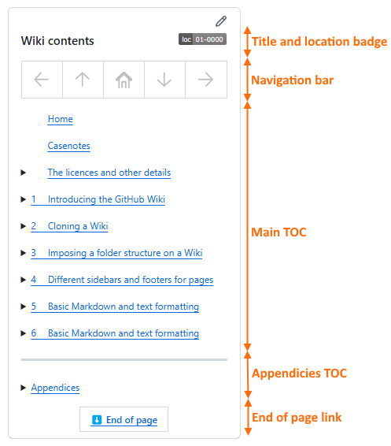
                    </a></td></tr>
<!-- CAPTION -->    <tr><th align="center"><sup>
<!-- CAPTION TEXT -->   Figure 16.17 &mdash; PracticalSeries sidebar format
                    </sup></th></tr>
</table>                             <!-- FIGURE END  🔼🔼(BLANK LINE BELOW) -->

It is made up of five parts:

<table name="l-16-17" align="center">   <!-- LIST START🔽🔽(BLANK LINE ABOVE) -->
<!-- LIST ROW 01  --><tr><td valign="top">&#x2776;<!-- 1  --></td>
    <td><!-- TEXT -->Title bar and storage location badge</td></tr>
<!-- LIST ROW 02  --><tr><td valign="top">&#x2777;<!-- 2  --></td>
    <td><!-- TEXT -->Navigation bar</td></tr>
<!-- LIST ROW 03  --><tr><td valign="top">&#x2778;<!-- 3  --></td>
    <td><!-- TEXT -->Main table of contents</td></tr>
<!-- LIST ROW 04  --><tr><td valign="top">&#x2779;<!-- 4  --></td>
    <td><!-- TEXT -->Table of contents for the appendices</td></tr>
<!-- LIST ROW 05  --><tr><td valign="top">&#x277A;<!-- 5  --></td>
    <td><!-- TEXT -->A link to the bottom of the page (end of page link)</td></tr>
<!-- CAPTION -->          <tr><th width="52"></th><!-- SPACER -->
<!-- LIST WIDTH -->         <th align="left" width="400"><sup>
<!-- CAPTION TEXT --><!-- TEXT -->List 16.17 &mdash; Sidebar components
                           </sup></th></tr>
</table>                              <!-- LIST END    🔼🔼(BLANK LINE BELOW) -->

Each of these is examined in turn in the following sections.

**[:arrow_up: Top](#idtop)**<!-- END OF SECTION - LINK TO TOP🔽🔽(BLANK LINE ABOVE) -->
<HR>                        <!-- END OF SECTION - SEPARATING LINE                    -->
<br>                        <!-- END OF SECTION - PADDING    🔼🔼(BLANK LINE BELOW) -->

### 16.6.1<!--  🟥H3🟥-->Names and locations of the sidebar files

The PracticalSeries Wiki pages all have a unique sidebar page (the exceptions being the CaseNotes and Licence pages which share a sidebar page).

Every sidebar has its own Markdown file called: `_sidebar.md`

The only thing that differentiates one sidebar from another is the location (folder) where it is stored. This was explained full in <a href="../04-0000/04%20Different%20sidebars%20and%20footers.md">section&nbsp;4</a>, but a brief recap is given below.

The PracticalSeries folder structure has a separate folder of each page in the Wiki, the folder and page name for this section being:

&emsp;&emsp;&emsp;`16-0000/16 PracticalSeries Wiki conventions.md`

It is in the folder `16-0000`; if a file called `_sidebar.md` is present in the same folder, then GitHub will display that `_sidebar.md` file as the sidebar for any Wiki page in that folder (in this case: `16 PracticalSeries Wiki conventions.md`).


If there is no `_sidebar.md` file in the folder, it will display the `_sidebar.md` file that is in the root folder (where the `Home.md` page is)

So that’s it, every page in the Wiki lives in its own folder (see <a href="../03-0000/03%20A%20Wiki%20folder%20structure.md">section&nbsp;3</a> and <a href="16-practicalseries-wiki-conventions#162the-practicalseries-folder-structure">section&nbsp;16.2</a> for full details) and each of these folders has an _sidebar.md file that is the sidebar for that particular page.

**[:arrow_up: Top](#idtop)**<!-- END OF SECTION - LINK TO TOP🔽🔽(BLANK LINE ABOVE) -->
<HR>                        <!-- END OF SECTION - SEPARATING LINE                    -->
<br>                        <!-- END OF SECTION - PADDING    🔼🔼(BLANK LINE BELOW) -->

### 16.6.2<!--  🟥H3🟥-->Sidebar title and location badge

This is the first entry for every `_sidebar.md` file. The title is always the same for every sidebar:

&emsp;&emsp;&nbsp;&nbsp; ${\large \color{#446FBD}\text{Wiki\ contents}}$ <!-- ⚪Indented⚪ -->

Also on this line is a badge that has the folder name that contains the `_sidebar.md` file:

<table name="f-16-18" align="center"><!-- FIGURE START🔽🔽(BLANK LINE ABOVE) -->
<!-- Figure row --> <tr><td>
<!-- LINK -->         <a href="../16-0600//02-images/figm-16-18.png" title="Use ctrl+click to open image in new tab">
<!-- FIGURE -->         
                    </a></td></tr>
<!-- CAPTION -->    <tr><th align="center"><sup>
<!-- CAPTION TEXT -->   Figure 16.18 &mdash; Sidebar title and badge
                    </sup></th></tr>
</table>                             <!-- FIGURE END  🔼🔼(BLANK LINE BELOW) -->

> [!NOTE]<!-- NOTE ALERT -->
> *The pencil icon is created by GitHub and allows me to edit the sidebar*


<table name="t-16-37" align="center"><!-- 🔴🟢🔵TABLE START🔽🔽(BLANK LINE ABOVE) -->
<!-- TOP & WIDTH --><tr><th width="850" align="right"><sup>Markdown
                    </sup></th></tr>
<!-- Header row --> <tr>
                        <th align="left">${\large \color{#0050C0}\text{M\ A\ R\ K\ D\ O\ W\ N}}$ 🔽</th>
                    </tr>
<!-- MD row -->     <tr><td align="left"><br><!-- 🔴MARKDOWN BELOW🔴 -->

```md
### Wiki contents<!-- LOCATION BADGE -->
```
<p> </p></td></tr><!-- 🔴MARKDOWN END OF ROW🔴 -->
<!-- CAPTION -->    <tr><th align="left"><sup>
<!-- CAPTION TEXT -->Table 16.37 &mdash; Sidebar title and location badge
</table>                             <!-- 🟥🟩🟦TABLE END  🔼🔼(BLANK LINE BELOW) -->

It is a standard Markdown level 3 title (3 hashes, see <a href="../06-1000/06.10%20Basic%20Markdown%20and%20text%20formatting.md#610headings">section&nbsp;6.10</a>) with the text: `Wiki contents`.

This is followed by spacing image (107 pixels wide by 1 pixel high), see <a href="../11-0000/11%20Images.md#114using-a-spacer-image">section&nbsp;11.4</a>. this creates the gap between the title text and pushes the badge to the right-hand side of the sidebar.

The badge is a <a href="https://shields.io/">Shields.IO</a> badge, it has the label `loc` followed by the folder name where the `sidebar.md` file is located, in this case it is the folder `06-0700`, this is written in the badge URL as `06--0700`, the double dash being an escape code to display a single dash, see <a href="15-navigation-bars,-badges-and-buttons#152badges">section&nbsp;15.2</a>. The number `808080` is the light grey background colour for the badge

**[:arrow_up: Top](#idtop)**<!-- END OF SECTION - LINK TO TOP🔽🔽(BLANK LINE ABOVE) -->
<HR>                        <!-- END OF SECTION - SEPARATING LINE                    -->
<br>                        <!-- END OF SECTION - PADDING    🔼🔼(BLANK LINE BELOW) -->

### 16.6.3<!--  🟥H3🟥-->Navigation bar

The navigation bar has the following appearance:

<table name="f-16-19" align="center"><!-- FIGURE START🔽🔽(BLANK LINE ABOVE) -->
<!-- Figure row --> <tr><td>
<!-- LINK -->         <a href="../16-0600//02-images/figm-16-19.png" title="Use ctrl+click to open image in new tab">
<!-- FIGURE -->         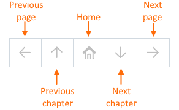
                    </a></td></tr>
<!-- CAPTION -->    <tr><th align="center"><sup>
<!-- CAPTION TEXT -->   Figure 16.19 &mdash; Navigation bar icons and meaning
                    </sup></th></tr>
</table>                             <!-- FIGURE END  🔼🔼(BLANK LINE BELOW) -->

This navigation bar is exactly the same as that discussed in <a href="15-navigation-bars,-badges-and-buttons#151navigation-bars">section&nbsp;15.1</a> and I refer you there for the details of its construction.

**[:arrow_up: Top](#idtop)**<!-- END OF SECTION - LINK TO TOP🔽🔽(BLANK LINE ABOVE) -->
<HR>                        <!-- END OF SECTION - SEPARATING LINE                    -->
<br>                        <!-- END OF SECTION - PADDING    🔼🔼(BLANK LINE BELOW) -->

### 16.6.4<!--  🟥H3🟥-->Table of contents

The table of contents is the same for every sidebar (they all have a full table of contents for every page in the Wiki). The only difference being that the TOC associated with the chapter of the current page is shown opened, this is the sidebar TOC for chapter 1:

<table name="f-16-20" align="center"><!-- FIGURE START🔽🔽(BLANK LINE ABOVE) -->
<!-- Figure row --> <tr><td>
<!-- LINK -->         <a href="../16-0600//02-images/figm-16-20.png" title="Use ctrl+click to open image in new tab">
<!-- FIGURE -->         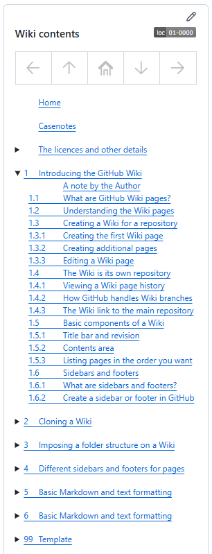
                    </a></td></tr>
<!-- CAPTION -->    <tr><th align="center"><sup>
<!-- CAPTION TEXT -->   Figure 16.20 &mdash; Sidebar TOC
                    </sup></th></tr>
</table>                             <!-- FIGURE END  🔼🔼(BLANK LINE BELOW) -->

The chapter 1 TOC is open *(collapsible arrow pointing down)*, all other chapter TOCs are closed (collapsible arrow pointing right).

Obviously, the TOCs are different for different Wikis, however, the general appearance of the TOC is consistent, the heading text all lines up for example.

Each line of the TOC has indentation to separate the chapter/section/division numbers from the text, it can be seen here:

<table name="f-16-21" align="center"><!-- FIGURE START🔽🔽(BLANK LINE ABOVE) -->
<!-- Figure row --> <tr><td>
<!-- LINK -->         <a href="../16-0600//02-images/figm-16-21.png" title="Use ctrl+click to open image in new tab">
<!-- FIGURE -->         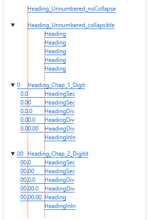
                    </a></td></tr>
<!-- CAPTION -->    <tr><th align="center"><sup>
<!-- CAPTION TEXT -->   Figure 16.21 &mdash; TOC indentation
                    </sup></th></tr>
</table>                             <!-- FIGURE END  🔼🔼(BLANK LINE BELOW) -->

The indentations are designed to allow the widest number: `cc.ss.dd`, all with double digits to fit in the gap before the section and division headings. Chapter headings are less indented. The whole thing has a symmetrical and pleasing appearance.

The following Markdown examples cover all the various types of TOC:

<table name="l-16-18" align="center">   <!-- LIST START🔽🔽(BLANK LINE ABOVE) -->
<!-- LIST ROW 01  --><tr><td valign="top">&#x2776;<!-- 1  --></td>
    <td><!-- TEXT -->Unnumbered heading without collapsible content (like <code>Home</code> and <code>CaseNotes</code> in the above image)</td></tr>
<!-- LIST ROW 02  --><tr><td valign="top">&#x2777;<!-- 2  --></td>
    <td><!-- TEXT -->Unnumbered, collapsible TOC (like <code>Licence</code> in the above image)</td></tr>
<!-- LIST ROW 03  --><tr><td valign="top">&#x2778;<!-- 3  --></td>
    <td><!-- TEXT -->Single digit chapter, collapsible (like chapter 1 in the above image)</td></tr>
<!-- LIST ROW 04  --><tr><td valign="top">&#x2779;<!-- 4  --></td>
    <td><!-- TEXT -->Double digit chapter, collapsible (as above but with at two-digit chapter number)</td></tr>
<!-- CAPTION -->          <tr><th width="52"></th><!-- SPACER -->
<!-- LIST WIDTH -->         <th align="left" width="798"><sup>
<!-- CAPTION TEXT --><!-- TEXT -->List 16.18 &mdash; Types of TOC
                           </sup></th></tr>
</table>                              <!-- LIST END    🔼🔼(BLANK LINE BELOW) -->

Taking each in turn:

In all these examples the following definitions are applied

<table name="t-16-38" align="center"><!-- TABLE START🔽🔽(BLANK LINE ABOVE) -->
<!-- HEADER ROW --> <tr>
                        <th width="200" align="center">Item</th>
                        <th width="500" align="center">Definition</th>
                    </tr>
<!-- DATA ROW -->   <tr>
                        <td align="left">
${\large \color{#B00000}\text{page}}$
                        <td align="left">The Wiki page name in link format (<a href="../09-0000/09%20Links.md#921rules-for-linking-to-a-wiki-page">section&9.2.1</a>)</td>
                    </tr>
<!-- DATA ROW -->   <tr>
                        <td align="left">
${\large \color{#4B0082}\text{Heading}}$
                        <td align="left">The Wiki heading name in link format (<a href="../09-0000/09%20Links.md#931rules-for-converting-a-heading-to-a-link">section&nbsp;9.3.1</a>)</td>
                    </tr>
<!-- DATA ROW -->   <tr>
                        <td align="left">
${\large \color{#1F883D}\text{0…}}$
                        <td align="left">The heading number (displayed text)</td>
                    </tr>
<!-- DATA ROW -->   <tr>
                        <td align="left">
${\large \color{#1F883D}\text{Heading…}}$
                        <td align="left">The heading text in plain English (displayed text)</td>
                    </tr>
<!-- DATA ROW -->   <tr>
                        <td align="left">
${\large \color{#404030}\text{SECTION NAME}}$
                        <td align="left">Comment field, should contain the section name or number</td>
                    </tr>
<!-- CAPTION -->    <tr><th colspan="2" align="left"><sup>
<!-- CAPTION TEXT -->Table 16.38 &mdash; TOC common elements
                     </sup></th></tr>
</table>                             <!-- TABLE END  🔼🔼(BLANK LINE BELOW) -->

**[:arrow_up: Top](#idtop)**<!-- END OF SECTION - LINK TO TOP🔽🔽(BLANK LINE ABOVE) -->
<HR>                        <!-- END OF SECTION - SEPARATING LINE                    -->
<br>                        <!-- END OF SECTION - PADDING    🔼🔼(BLANK LINE BELOW) -->

<br><br>
#### <!--       🟥H4🟥--><u>Unnumbered, non-collapsible TOC<!-- Extended line -->&emsp;&emsp;&emsp;&emsp;&emsp;</u> 

<table name="f-16-22" align="center"><!-- FIGURE START🔽🔽(BLANK LINE ABOVE) -->
<!-- Figure row --> <tr><td>
<!-- LINK -->         <a href="../16-0600//02-images/figm-16-22.png" title="Use ctrl+click to open image in new tab">
<!-- FIGURE -->         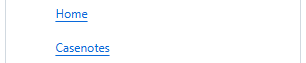
                    </a></td></tr>
<!-- CAPTION -->    <tr><th align="center"><sup>
<!-- CAPTION TEXT -->   Figure 16.22 &mdash; Unnumbered, non-collapsible TOC
                    </sup></th></tr>
</table>                             <!-- FIGURE END  🔼🔼(BLANK LINE BELOW) -->

The Markdown is:

<table name="t-16-39" align="center"><!-- 🔴🟢🔵TABLE START🔽🔽(BLANK LINE ABOVE) -->
<!-- TOP & WIDTH --><tr><th width="850" align="right"><sup>Markdown
                    </sup></th></tr>
<!-- Header row --> <tr>
                        <th align="left">${\large \color{#0050C0}\text{M\ A\ R\ K\ D\ O\ W\ N}}$ 🔽</th>
                    </tr>
<!-- MD row -->     <tr><td align="left"><br><!-- 🔴MARKDOWN BELOW🔴 -->

```md
<!--          [SECTION_NAME] 🟢🟢🟢 UNNUMBERED, NO COLLAPSE -->
&emsp;&emsp;&ensp;&thinsp;&hairsp;<a href="../page"><!-- HEAD -->Heading_Unnumbered_noCollapse</a>
<!--                         🟩🟩🟩 -->
```
<p> </p></td></tr><!-- 🔴MARKDOWN END OF ROW🔴 -->
<!-- CAPTION -->    <tr><th align="left"><sup>
<!-- CAPTION TEXT -->Table 16.39 &mdash; TOC entry: unnumbered, non-collapsible
</table>                             <!-- 🟥🟩🟦TABLE END  🔼🔼(BLANK LINE BELOW) -->

The following is a worked example for the `home` page:


<table name="t-16-40" align="center"><!-- 🔴🟢🔵TABLE START🔽🔽(BLANK LINE ABOVE) -->
<!-- TOP & WIDTH --><tr><th width="850" align="right"><sup>Markdown
                    </sup></th></tr>
<!-- Header row --> <tr>
                        <th align="left">${\large \color{#0050C0}\text{M\ A\ R\ K\ D\ O\ W\ N}}$ 🔽</th>
                    </tr>
<!-- MD row -->     <tr><td align="left"><br><!-- 🔴MARKDOWN BELOW🔴 -->

```md
<!--          [CASENOTES]    🟢🟢🟢 UNNUMBERED, NO COLLAPSE -->
&emsp;&emsp;&ensp;&thinsp;&hairsp;<a href="casenotes"><!-- HEAD -->CaseNotes</a>
<!--                         🟩🟩🟩 -->
```
<p> </p></td></tr><!-- 🔴MARKDOWN END OF ROW🔴 -->
<!-- CAPTION -->    <tr><th align="left"><sup>
<!-- CAPTION TEXT -->Table 16.40 &mdash; TOC entry: unnumbered, non-collapsible example
</table>                             <!-- 🟥🟩🟦TABLE END  🔼🔼(BLANK LINE BELOW) -->

**[:arrow_up: Top](#idtop)**<!-- END OF SECTION - LINK TO TOP🔽🔽(BLANK LINE ABOVE) -->
<HR>                        <!-- END OF SECTION - SEPARATING LINE                    -->
<br>                        <!-- END OF SECTION - PADDING    🔼🔼(BLANK LINE BELOW) -->

<br><br>
#### <!--       🟥H4🟥--><u>Unnumbered, collapsible TOC<!-- Extended line -->&emsp;&emsp;&emsp;&emsp;&emsp;</u> 

<table name="f-16-23" align="center"><!-- FIGURE START🔽🔽(BLANK LINE ABOVE) -->
<!-- Figure row --> <tr><td>
<!-- LINK -->         <a href="../16-0600//02-images/figm-16-23.png" title="Use ctrl+click to open image in new tab">
<!-- FIGURE -->         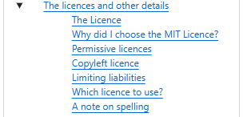
                    </a></td></tr>
<!-- CAPTION -->    <tr><th align="center"><sup>
<!-- CAPTION TEXT -->   Figure 16.23 &mdash; Unnumbered, collapsible TOC
                    </sup></th></tr>
</table>                             <!-- FIGURE END  🔼🔼(BLANK LINE BELOW) -->

The Markdown is:

<table name="t-16-41" align="center"><!-- 🔴🟢🔵TABLE START🔽🔽(BLANK LINE ABOVE) -->
<!-- TOP & WIDTH --><tr><th width="850" align="right"><sup>Markdown
                    </sup></th></tr>
<!-- Header row --> <tr>
                        <th align="left">${\large \color{#0050C0}\text{M\ A\ R\ K\ D\ O\ W\ N}}$ 🔽</th>
                    </tr>
<!-- MD row -->     <tr><td align="left"><br><!-- 🔴MARKDOWN BELOW🔴 -->

```md
<details><!-- [SECTION_NAME] 🟢🟢🟢 UNNUMBERED, COLLAPSIBLE -->
<summary>&emsp;&ensp;&nbsp;<a href="../page"><!-- HEAD -->Heading_Unnumbered_Collapsible</a>
</summary><!-- BLANK LINE BELOW -->

&emsp;&emsp;&emsp;&emsp;&emsp;&ensp;&nbsp;[Heading](page#heading)<br>
&emsp;&emsp;&emsp;&emsp;&emsp;&ensp;&nbsp;[Heading](page#heading)<br>
&emsp;&emsp;&emsp;&emsp;&emsp;&ensp;&nbsp;[Heading](page#heading)<br>
&emsp;&emsp;&emsp;&emsp;&emsp;&ensp;&nbsp;[Heading](page#heading)<br>
&emsp;&emsp;&emsp;&emsp;&emsp;&ensp;&nbsp;[Heading](page#heading)<br>
</details><!--               🟩🟩🟩 -->
```
<p> </p></td></tr><!-- 🔴MARKDOWN END OF ROW🔴 -->
<!-- CAPTION -->    <tr><th align="left"><sup>
<!-- CAPTION TEXT -->Table 16.41 &mdash; TOC entry: unnumbered, collapsible
</table>                             <!-- 🟥🟩🟦TABLE END  🔼🔼(BLANK LINE BELOW) -->

The following is a worked example for the `Licence` page:


<table name="t-16-42" align="center"><!-- 🔴🟢🔵TABLE START🔽🔽(BLANK LINE ABOVE) -->
<!-- TOP & WIDTH --><tr><th width="850" align="right"><sup>Markdown
                    </sup></th></tr>
<!-- Header row --> <tr>
                        <th align="left">${\large \color{#0050C0}\text{M\ A\ R\ K\ D\ O\ W\ N}}$ 🔽</th>
                    </tr>
<!-- MD row -->     <tr><td align="left"><br><!-- 🔴MARKDOWN BELOW🔴 -->

```md
<details ><!-- LICENCE       🟢🟢🟢 UNNUMBERED, COLLAPSIBLE -->
<summary>&emsp;&ensp;&nbsp;<a href="licence"><!-- HEAD -->Licence</a>
</summary><!-- BLANK LINE BELOW -->

&emsp;&emsp;&emsp;&emsp;&emsp;&ensp;&nbsp;[The licences and other details](licence#the-licences-and-other-details)<br>
&emsp;&emsp;&emsp;&emsp;&emsp;&ensp;&nbsp;[The Licence](licence#the-licence)<br>
&emsp;&emsp;&emsp;&emsp;&emsp;&ensp;&nbsp;[Why did I choose the MIT Licence?](licence#why-did-i-choose-the-mit-licence)<br>
&emsp;&emsp;&emsp;&emsp;&emsp;&ensp;&nbsp;[Permissive licences](licence#permissive-licences)<br>
&emsp;&emsp;&emsp;&emsp;&emsp;&ensp;&nbsp;[Copyleft licence](licence#copyleft-licence)<br>
&emsp;&emsp;&emsp;&emsp;&emsp;&ensp;&nbsp;[Limiting liabilities](licence#limiting-liabilities)<br>
&emsp;&emsp;&emsp;&emsp;&emsp;&ensp;&nbsp;[Which licence to use?](licence#which-licence-to-use)<br>
&emsp;&emsp;&emsp;&emsp;&emsp;&ensp;&nbsp;[A note on spelling: licence or license](licence#a-note-on-spelling-licence-or-license)<br>
</details><!--               🟩🟩🟩 -->
```
<p> </p></td></tr><!-- 🔴MARKDOWN END OF ROW🔴 -->
<!-- CAPTION -->    <tr><th align="left"><sup>
<!-- CAPTION TEXT -->Table 16.42 &mdash; TOC entry: unnumbered, collapsible example
</table>                             <!-- 🟥🟩🟦TABLE END  🔼🔼(BLANK LINE BELOW) -->

To make the list default to open replace `<details>` with `<details open>`.

**[:arrow_up: Top](#idtop)**<!-- END OF SECTION - LINK TO TOP🔽🔽(BLANK LINE ABOVE) -->
<HR>                        <!-- END OF SECTION - SEPARATING LINE                    -->
<br>                        <!-- END OF SECTION - PADDING    🔼🔼(BLANK LINE BELOW) -->

<br><br>
#### <!--       🟥H4🟥--><u>Single digit chapter, collapsible TOC<!-- Extended line -->&emsp;&emsp;&emsp;&emsp;&emsp;</u> 

<table name="f-16-24" align="center"><!-- FIGURE START🔽🔽(BLANK LINE ABOVE) -->
<!-- Figure row --> <tr><td>
<!-- LINK -->         <a href="../16-0600//02-images/figm-16-24.png" title="Use ctrl+click to open image in new tab">
<!-- FIGURE -->         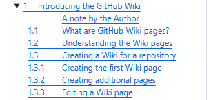
                    </a></td></tr>
<!-- CAPTION -->    <tr><th align="center"><sup>
<!-- CAPTION TEXT -->   Figure 16.24 &mdash; Single digit chapter, collapsible TOC
                    </sup></th></tr>
</table>                             <!-- FIGURE END  🔼🔼(BLANK LINE BELOW) -->

The Markdown is:

<table name="t-16-43" align="center"><!-- 🔴🟢🔵TABLE START🔽🔽(BLANK LINE ABOVE) -->
<!-- TOP & WIDTH --><tr><th width="850" align="right"><sup>Markdown
                    </sup></th></tr>
<!-- Header row --> <tr>
                        <th align="left">${\large \color{#0050C0}\text{M\ A\ R\ K\ D\ O\ W\ N}}$ 🔽</th>
                    </tr>
<!-- MD row -->     <tr><td align="left"><br><!-- 🔴MARKDOWN BELOW🔴 -->

```md
<details><!-- [SECTION_NAME] 🟢🟢🟢 SECTION GENERAL SINGLE DIGIT CHAPTER-->
<summary><a href="../page">0<!-- NUM -->&ensp;&nbsp;&nbsp;&thinsp;<!-- HEAD -->Heading_Chap_1_Digit</a>
</summary><!-- BLANK LINE BELOW -->

&emsp;&ensp;&hairsp;[0.0&emsp;&emsp;&nbsp;&nbsp;&thinsp;&hairsp;HeadingSec](page#heading)<br>
&emsp;&ensp;&hairsp;[0.00&emsp;&emsp;&thinsp;&hairsp;HeadingSec](page#heading)<br>
&emsp;&ensp;&hairsp;[0.0.0&emsp;&nbsp;&nbsp;&nbsp;&nbsp;HeadingDiv](page#heading)<br>
&emsp;&ensp;&hairsp;[0.00.0&emsp;&nbsp;&nbsp;HeadingDiv](page#heading)<br>
&emsp;&ensp;&hairsp;[0.00.00&ensp;&nbsp;&nbsp;HeadingDiv](page#heading)<br>
&emsp;&emsp;&emsp;&emsp;&emsp;&ensp;&nbsp;[HeadingInln](page#heading)<br>
</details><!--               🟩🟩🟩 -->

```
<p> </p></td></tr><!-- 🔴MARKDOWN END OF ROW🔴 -->
<!-- CAPTION -->    <tr><th align="left"><sup>
<!-- CAPTION TEXT -->Table 16.43 &mdash; TOC entry: single digit chapter, collapsible
</table>                             <!-- 🟥🟩🟦TABLE END  🔼🔼(BLANK LINE BELOW) -->

This has the following appearance:

<table name="f-16-25" align="center"><!-- FIGURE START🔽🔽(BLANK LINE ABOVE) -->
<!-- Figure row --> <tr><td>
<!-- LINK -->         <a href="../16-0600//02-images/figm-16-25.png" title="Use ctrl+click to open image in new tab">
<!-- FIGURE -->         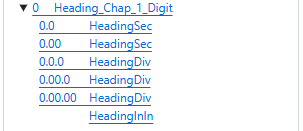
                    </a></td></tr>
<!-- CAPTION -->    <tr><th align="center"><sup>
<!-- CAPTION TEXT -->   Figure 16.25 &mdash; Single digit chapter, collapsible TOC pro-forma
                    </sup></th></tr>
</table>                             <!-- FIGURE END  🔼🔼(BLANK LINE BELOW) -->

The following is a worked example for the `02 Cloning a Wiki` page:


<table name="t-16-44" align="center"><!-- 🔴🟢🔵TABLE START🔽🔽(BLANK LINE ABOVE) -->
<!-- TOP & WIDTH --><tr><th width="850" align="right"><sup>Markdown
                    </sup></th></tr>
<!-- Header row --> <tr>
                        <th align="left">${\large \color{#0050C0}\text{M\ A\ R\ K\ D\ O\ W\ N}}$ 🔽</th>
                    </tr>
<!-- MD row -->     <tr><td align="left"><br><!-- 🔴MARKDOWN BELOW🔴 -->

```md
<details><!-- [SECTION 02]   🟢🟢🟢 SECTION GENERAL SINGLE DIGIT CHAPTER-->
<summary><a href="../../02-0000/02%20Cloning%20a%20Wiki.md">2<!-- NUM -->&ensp;&nbsp;&nbsp;&thinsp;<!-- HEAD -->Cloning a Wiki</a>
</summary><!-- BLANK LINE BELOW -->

&emsp;&ensp;&hairsp;[2.1&emsp;&emsp;&nbsp;&nbsp;&thinsp;&hairsp;Why clone a Wiki?](../02-0000/02%20Cloning%20a%20Wiki.md#21why-clone-a-wiki)<br>
&emsp;&ensp;&hairsp;[2.2&emsp;&emsp;&nbsp;&nbsp;&thinsp;&hairsp;How to clone a Wiki](../02-0000/02%20Cloning%20a%20Wiki.md#22how-to-clone-a-wiki)<br>
&emsp;&ensp;&hairsp;[2.3&emsp;&emsp;&nbsp;&nbsp;&thinsp;&hairsp;Pushing local changes to GitHub](../02-0000/02%20Cloning%20a%20Wiki.md#23pushing-local-changes-to-github)<br>
&emsp;&ensp;&hairsp;[2.3.1&emsp;&nbsp;&nbsp;&nbsp;&nbsp;Configuring username and email](../02-0000/02%20Cloning%20a%20Wiki.md#231configuring-a-git-username-and-email-address)<br>
&emsp;&ensp;&hairsp;[2.3.2&emsp;&nbsp;&nbsp;&nbsp;&nbsp;Modifying the local repository](../02-0000/02%20Cloning%20a%20Wiki.md#232modifying-the-local-repository)<br>
&emsp;&ensp;&hairsp;[2.3.3&emsp;&nbsp;&nbsp;&nbsp;&nbsp;Committing and synchronising](../02-0000/02%20Cloning%20a%20Wiki.md#233committing-and-synchronising-the-changes)<br>
</details><!--               🟩🟩🟩 -->

```
<p> </p></td></tr><!-- 🔴MARKDOWN END OF ROW🔴 -->
<!-- CAPTION -->    <tr><th align="left"><sup>
<!-- CAPTION TEXT -->Table 16.44 &mdash; TOC entry: single digit chapter, collapsible example
</table>                             <!-- 🟥🟩🟦TABLE END  🔼🔼(BLANK LINE BELOW) -->

To make the list default to open replace `<details>` with `<details open>`.

**[:arrow_up: Top](#idtop)**<!-- END OF SECTION - LINK TO TOP🔽🔽(BLANK LINE ABOVE) -->
<HR>                        <!-- END OF SECTION - SEPARATING LINE                    -->
<br>                        <!-- END OF SECTION - PADDING    🔼🔼(BLANK LINE BELOW) -->

<br><br>
#### <!--       🟥H4🟥--><u>Double digit chapter, collapsible TOC<!-- Extended line -->&emsp;&emsp;&emsp;&emsp;&emsp;</u> 

<table name="f-16-26" align="center"><!-- FIGURE START🔽🔽(BLANK LINE ABOVE) -->
<!-- Figure row --> <tr><td>
<!-- LINK -->         <a href="../16-0600//02-images/figm-16-26.png" title="Use ctrl+click to open image in new tab">
<!-- FIGURE -->         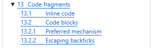
                    </a></td></tr>
<!-- CAPTION -->    <tr><th align="center"><sup>
<!-- CAPTION TEXT -->   Figure 16.26 &mdash; Double digit chapter, collapsible TOC
                    </sup></th></tr>
</table>                             <!-- FIGURE END  🔼🔼(BLANK LINE BELOW) -->

The Markdown is:

<table name="t-16-45" align="center"><!-- 🔴🟢🔵TABLE START🔽🔽(BLANK LINE ABOVE) -->
<!-- TOP & WIDTH --><tr><th width="850" align="right"><sup>Markdown
                    </sup></th></tr>
<!-- Header row --> <tr>
                        <th align="left">${\large \color{#0050C0}\text{M\ A\ R\ K\ D\ O\ W\ N}}$ 🔽</th>
                    </tr>
<!-- MD row -->     <tr><td align="left"><br><!-- 🔴MARKDOWN BELOW🔴 -->

```md
<details><!-- [SECTION_NAME] 🟢🟢🟢 SECTION GENERAL DOUBLE DIGIT CHAPTER-->
<summary><a href="../page">00<!-- NUM -->&ensp;&thinsp;<!-- HEAD -->Heading_Chap_2_Digit</a>
</summary><!-- BLANK LINE BELOW -->

&emsp;&ensp;&hairsp;[00.0&emsp;&emsp;&thinsp;&hairsp;HeadingSec](page#heading)<br>
&emsp;&ensp;&hairsp;[00.00&emsp;&ensp;&nbsp;HeadingSec](page#heading)<br>
&emsp;&ensp;&hairsp;[00.0.0&emsp;&ensp;&hairsp;HeadingSecHeadingDiv](page#heading)<br>
&emsp;&ensp;&hairsp;[00.00.0&ensp;&nbsp;&nbsp;HeadingDiv](page#heading)<br>
&emsp;&ensp;&hairsp;[00.00.00&ensp;Heading](page#heading)<br>
&emsp;&emsp;&emsp;&emsp;&emsp;&ensp;&nbsp;[HeadingInln](page#heading)<br>
</details><!--               🟩🟩🟩 -->
```
<p> </p></td></tr><!-- 🔴MARKDOWN END OF ROW🔴 -->
<!-- CAPTION -->    <tr><th align="left"><sup>
<!-- CAPTION TEXT -->Table 16.45 &mdash; TOC entry: double digit chapter, collapsible
</table>                             <!-- 🟥🟩🟦TABLE END  🔼🔼(BLANK LINE BELOW) -->

This has the following appearance:

<table name="f-16-27" align="center"><!-- FIGURE START🔽🔽(BLANK LINE ABOVE) -->
<!-- Figure row --> <tr><td>
<!-- LINK -->         <a href="../16-0600//02-images/figm-16-27.png" title="Use ctrl+click to open image in new tab">
<!-- FIGURE -->         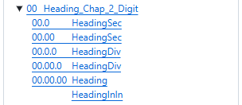
                    </a></td></tr>
<!-- CAPTION -->    <tr><th align="center"><sup>
<!-- CAPTION TEXT -->   Figure 16.27 &mdash; Double digit chapter, collapsible TOC pro-forma
                    </sup></th></tr>
</table>                             <!-- FIGURE END  🔼🔼(BLANK LINE BELOW) -->

The following is a worked example for the `15 Navigation bars, badges and buttons` page:


<table name="t-16-46" align="center"><!-- 🔴🟢🔵TABLE START🔽🔽(BLANK LINE ABOVE) -->
<!-- TOP & WIDTH --><tr><th width="850" align="right"><sup>Markdown
                    </sup></th></tr>
<!-- Header row --> <tr>
                        <th align="left">${\large \color{#0050C0}\text{M\ A\ R\ K\ D\ O\ W\ N}}$ 🔽</th>
                    </tr>
<!-- MD row -->     <tr><td align="left"><br><!-- 🔴MARKDOWN BELOW🔴 -->

```md
<details><!-- [SECTION 15]   🟢🟢🟢 SECTION GENERAL DOUBLE DIGIT CHAPTER-->
<summary><a href="../15-navigation-bars,-badges-and-buttons">15<!-- NUM -->&ensp;&thinsp;<!-- HEAD -->Navigation bars, badges and buttons</a>
</summary><!-- BLANK LINE BELOW -->

&emsp;&ensp;&hairsp;[15.1&emsp;&emsp;&thinsp;&hairsp;Navigation bars](15-navigation-bars,-badges-and-buttons#151navigation-bars)<br>
&emsp;&ensp;&hairsp;[15.1.1&emsp;&ensp;&nbsp;Navigation bar practicalities](15-navigation-bars,-badges-and-buttons#1511navigation-bar-practicalities)<br>
&emsp;&ensp;&hairsp;[15.2&emsp;&emsp;&thinsp;&hairsp;Badges](15-navigation-bars,-badges-and-buttons#152badges)<br>
&emsp;&ensp;&hairsp;[15.2.1&emsp;&ensp;&nbsp;Creating a badge](15-navigation-bars,-badges-and-buttons#1521creating-a-badge)<br>
&emsp;&ensp;&hairsp;[15.2.2&emsp;&ensp;&nbsp;Static badge options](15-navigation-bars,-badges-and-buttons#1522static-badge-options)<br>
&emsp;&ensp;&hairsp;[15.2.3&emsp;&ensp;&nbsp;Dynamic badges](15-navigation-bars,-badges-and-buttons#1523dynamic-badges)<br>
&emsp;&ensp;&hairsp;[15.3&emsp;&emsp;&thinsp;&hairsp;Buttons](15-navigation-bars,-badges-and-buttons#153buttons)<br>
</details><!--               🟩🟩🟩 -->


```
<p> </p></td></tr><!-- 🔴MARKDOWN END OF ROW🔴 -->
<!-- CAPTION -->    <tr><th align="left"><sup>
<!-- CAPTION TEXT -->Table 16.46 &mdash; TOC entry: double digit chapter, collapsible example
</table>                             <!-- 🟥🟩🟦TABLE END  🔼🔼(BLANK LINE BELOW) -->

To make the list default to open replace `<details>` with `<details open>`.

**[:arrow_up: Top](#idtop)**<!-- END OF SECTION - LINK TO TOP🔽🔽(BLANK LINE ABOVE) -->
<HR>                        <!-- END OF SECTION - SEPARATING LINE                    -->
<br>                        <!-- END OF SECTION - PADDING    🔼🔼(BLANK LINE BELOW) -->

<br><br>
#### <!--       🟥H4🟥--><u>TOCs for appendices<!-- Extended line -->&emsp;&emsp;&emsp;&emsp;&emsp;</u> 

TOCs for appendices are contained within an additional collapsible block:

<table name="f-16-28" align="center"><!-- FIGURE START🔽🔽(BLANK LINE ABOVE) -->
<!-- Figure row --> <tr><td>
<!-- LINK -->         <a href="../16-0600//02-images/figm-16-28.png" title="Use ctrl+click to open image in new tab">
<!-- FIGURE -->         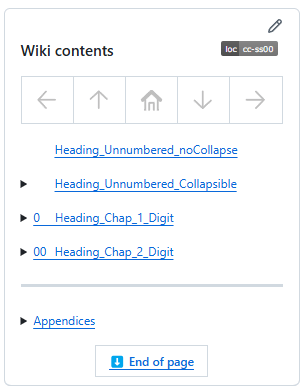
                    </a></td></tr>
<!-- CAPTION -->    <tr><th align="center"><sup>
<!-- CAPTION TEXT -->   Figure 16.28 &mdash; Collapsed appendices TOC
                    </sup></th></tr>
</table>                             <!-- FIGURE END  🔼🔼(BLANK LINE BELOW) -->

When expanded, the TOC looks like this:

<table name="f-16-29" align="center"><!-- FIGURE START🔽🔽(BLANK LINE ABOVE) -->
<!-- Figure row --> <tr><td>
<!-- LINK -->         <a href="../16-0600//02-images/figm-16-29.png" title="Use ctrl+click to open image in new tab">
<!-- FIGURE -->         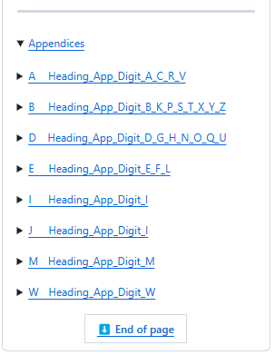
                    </a></td></tr>
<!-- CAPTION -->    <tr><th align="center"><sup>
<!-- CAPTION TEXT -->   Figure 16.29 &mdash; Expanded appendices TOC
                    </sup></th></tr>
</table>                             <!-- FIGURE END  🔼🔼(BLANK LINE BELOW) -->

The appendices TOC is separated from the main TOC with a horizontal bar, the code for this and the top-level collapsible block is:

The Markdown is:

<table name="t-16-46" align="center"><!-- 🔴🟢🔵TABLE START🔽🔽(BLANK LINE ABOVE) -->
<!-- TOP & WIDTH --><tr><th width="850" align="right"><sup>Markdown
                    </sup></th></tr>
<!-- Header row --> <tr>
                        <th align="left">${\large \color{#0050C0}\text{M\ A\ R\ K\ D\ O\ W\ N}}$ 🔽</th>
                    </tr>
<!-- MD row -->     <tr><td align="left"><br><!-- 🔴MARKDOWN BELOW🔴 -->

```md
<!-- APPENDICES -->
<hr><!-- SEPARATOR -->
<details><!-- APPENDICES TOP 🔴🔴🔴 LEVEL COLLAPSE -->
<summary><a href="../page"><!-- APP TOP LEVEL -->Appendices</a>
</summary>
<br><!-- BLANK LINE BELOW -->


<!--INDIVIDUAL TOCs FOR EACH APPENDIX GO HERE -->

</details><!-- APPENDICES TOP🟥🟥🟥 LEVEL COLLAPSE -->
```
<p> </p></td></tr><!-- 🔴MARKDOWN END OF ROW🔴 -->
<!-- CAPTION -->    <tr><th align="left"><sup>
<!-- CAPTION TEXT -->Table 16.46 &mdash; Top level Appendices TOC collapsible block
</table>                             <!-- 🟥🟩🟦TABLE END  🔼🔼(BLANK LINE BELOW) -->

Individual TOCs for each appendix go in the orange area, these are very similar to the Single digit chapter, collapsible TOCs.

The only differences are to do with the spacings. Appendices use a capital letter in place of a chapter number and whereas the numbers (at the reduced size of the sidebar text) are all approximately the same width, the capital letters vary considerably. 

There are some commonalities, the following letters are grouped in matching widths:

<table name="l-16-19" align="center">   <!-- LIST START🔽🔽(BLANK LINE ABOVE) -->
<!-- LIST ROW 01  --><tr><td valign="top">&#x25CF;</td>
    <td><!-- TEXT -->A, C, V, R</td></tr>
<!-- LIST ROW 02  --><tr><td valign="top">&#x25CF;</td>
    <td><!-- TEXT -->B, K, P, S, T, X, Y, Z</td></tr>
<!-- LIST ROW 03  --><tr><td valign="top">&#x25CF;</td>
    <td><!-- TEXT -->D, G, H, N, O, Q, U</td></tr>
<!-- LIST ROW 04  --><tr><td valign="top">&#x25CF;</td>
    <td><!-- TEXT -->E, F, L</td></tr>
<!-- LIST ROW 05  --><tr><td valign="top">&#x25CF;</td>
    <td><!-- TEXT -->I</td></tr>
<!-- LIST ROW 06  --><tr><td valign="top">&#x25CF;</td>
    <td><!-- TEXT -->J</td></tr>
<!-- LIST ROW 07  --><tr><td valign="top">&#x25CF;</td>
    <td><!-- TEXT -->M</td></tr>
<!-- LIST ROW 08  --><tr><td valign="top">&#x25CF;</td>
    <td><!-- TEXT -->W</td></tr>
<!-- CAPTION -->          <tr><th width="52"></th><!-- SPACER -->
<!-- LIST WIDTH -->         <th align="left" width="300"><sup>
<!-- CAPTION TEXT --><!-- TEXT -->List 16.19 &mdash; Letter groups
                           </sup></th></tr>
</table>                              <!-- LIST END    🔼🔼(BLANK LINE BELOW) -->

There are separate TOC groups for each of these.#

The code for each group is as follows:


<table name="t-16-46" align="center"><!-- 🔴🟢🔵TABLE START🔽🔽(BLANK LINE ABOVE) -->
<!-- TOP & WIDTH --><tr><th width="850" align="right"><sup>Markdown
                    </sup></th></tr>
<!-- Header row --> <tr>
                        <th align="left">${\large \color{#0050C0}\text{MARKDOWN\ FOR\ A,\ C,\ V,\ R}}$ 🔽</th>
                    </tr>
<!-- MD row -->     <tr><td align="left"><br><!-- 🔴MARKDOWN BELOW🔴 -->

```md
<details><!-- [APP_NAME]     🟡🟡🟡 SECTION GENERAL SINGLE DIGIT CHAPTER-->
<summary><a href="../page">A<!-- NUM -->&ensp;&nbsp;&nbsp;&#8202;<!-- HEAD -->Heading_App_Digit_A_C_R_V</a>
</summary><!-- BLANK LINE BELOW -->

&emsp;&ensp;&hairsp;[A.0&emsp;&emsp;&nbsp;&nbsp;&thinsp;HeadingSec](page#heading)<br>
&emsp;&ensp;&hairsp;[A.00&emsp;&emsp;&thinsp;HeadingSec](page#heading)<br>
&emsp;&ensp;&hairsp;[A.0.0&emsp;&nbsp;&nbsp;&nbsp;&thinsp;HeadingDiv](page#heading)<br>
&emsp;&ensp;&hairsp;[A.00.0&emsp;&nbsp;&thinsp;HeadingDiv](page#heading)<br>
&emsp;&ensp;&hairsp;[A.00.00&ensp;&nbsp;&thinsp;HeadingDiv](page#heading)<br>
&emsp;&emsp;&emsp;&emsp;&emsp;&ensp;&nbsp;[HeadingInln](page#heading)<br>
</details><!--               🟨🟨🟨 -->
```
<p> </p></td></tr><!-- 🔴MARKDOWN END OF ROW🔴 -->
<!-- Header row --> <tr>
                        <th align="left">${\large \color{#0050C0}\text{MARKDOWN\ FOR\ B,\ K,\ P,\ S,\ T,\ X,\ Y,\ Z}}$ 🔽</th>
                    </tr>
<!-- MD row -->     <tr><td align="left"><br><!-- 🔴MARKDOWN BELOW🔴 -->

```md
<details><!-- [APP_NAME]     🟡🟡🟡 SECTION GENERAL SINGLE DIGIT CHAPTER-->
<summary><a href="../page">B<!-- NUM -->&ensp;&nbsp;&nbsp;&thinsp;<!-- HEAD -->Heading_App_Digit_B_K_P_S_T_X_Y_Z</a>
</summary><!-- BLANK LINE BELOW -->

&emsp;&ensp;&hairsp;[B.0&emsp;&emsp;&nbsp;&nbsp;&thinsp;&hairsp;HeadingSec](page#heading)<br>
&emsp;&ensp;&hairsp;[B.00&emsp;&emsp;&thinsp;&hairsp;HeadingSec](page#heading)<br>
&emsp;&ensp;&hairsp;[B.0.0&emsp;&nbsp;&nbsp;&nbsp;&nbsp;HeadingDiv](page#heading)<br>
&emsp;&ensp;&hairsp;[B.00.0&emsp;&nbsp;&nbsp;HeadingDiv](page#heading)<br>
&emsp;&ensp;&hairsp;[B.00.00&ensp;&nbsp;&nbsp;HeadingDiv](page#heading)<br>
&emsp;&emsp;&emsp;&emsp;&emsp;&ensp;&nbsp;[HeadingInln](page#heading)<br>
</details><!--               🟨🟨🟨 -->
```
<p> </p></td></tr><!-- 🔴MARKDOWN END OF ROW🔴 -->
<!-- Header row --> <tr>
                        <th align="left">${\large \color{#0050C0}\text{MARKDOWN\ FOR\ D,\ G,\ H,\ N,\ O,\ Q,\ U}}$ 🔽</th>
                    </tr>
<!-- MD row -->     <tr><td align="left"><br><!-- 🔴MARKDOWN BELOW🔴 -->

```md
<details><!-- [APP_NAME]     🟡🟡🟡 SECTION GENERAL SINGLE DIGIT CHAPTER-->
<summary><a href="../page">D<!-- NUM -->&ensp;&nbsp;&nbsp;<!-- HEAD -->Heading_App_Digit_D_G_H_N_O_Q_U</a>
</summary><!-- BLANK LINE BELOW -->

&emsp;&ensp;&hairsp;[D.0&emsp;&emsp;&nbsp;&nbsp;&thinsp;HeadingSec](page#heading)<br>
&emsp;&ensp;&hairsp;[D.00&emsp;&emsp;&thinsp;HeadingSec](page#heading)<br>
&emsp;&ensp;&hairsp;[D.0.0&emsp;&nbsp;&nbsp;&nbsp;&hairsp;HeadingDiv](page#heading)<br>
&emsp;&ensp;&hairsp;[D.00.0&emsp;&nbsp;&hairsp;HeadingDiv](page#heading)<br>
&emsp;&ensp;&hairsp;[D.00.00&ensp;&nbsp;&hairsp;HeadingDiv](page#heading)<br>
&emsp;&emsp;&emsp;&emsp;&emsp;&ensp;&nbsp;[HeadingInln](page#heading)<br>
</details><!--               🟨🟨🟨 -->
```
<p> </p></td></tr><!-- 🔴MARKDOWN END OF ROW🔴 -->
<!-- Header row --> <tr>
                        <th align="left">${\large \color{#0050C0}\text{MARKDOWN\ FOR\ E,\ F,\ L}}$ 🔽</th>
                    </tr>
<!-- MD row -->     <tr><td align="left"><br><!-- 🔴MARKDOWN BELOW🔴 -->

```md
<details><!-- [APP_NAME]     🟡🟡🟡 SECTION GENERAL SINGLE DIGIT CHAPTER-->
<summary><a href="../page">E<!-- NUM -->&ensp;&nbsp;&nbsp;&nbsp;<!-- HEAD -->Heading_App_Digit_E_F_L</a>
</summary><!-- BLANK LINE BELOW -->

&emsp;&ensp;&hairsp;[E.0&emsp;&emsp;&nbsp;&nbsp;&thinsp;&thinsp;HeadingSec](page#heading)<br>
&emsp;&ensp;&hairsp;[E.00&emsp;&emsp;&thinsp;&thinsp;HeadingSec](page#heading)<br>
&emsp;&ensp;&hairsp;[E.0.0&emsp;&nbsp;&nbsp;&nbsp;&emsp13;HeadingDiv](page#heading)<br>
&emsp;&ensp;&hairsp;[E.00.0&emsp;&nbsp;&thinsp;&hairsp;HeadingDiv](page#heading)<br>
&emsp;&ensp;&hairsp;[E.00.00&ensp;&nbsp;&nbsp;HeadingDiv](page#heading)<br>
&emsp;&emsp;&emsp;&emsp;&emsp;&ensp;&nbsp;[HeadingInln](page#heading)<br>
</details><!--               🟨🟨🟨 -->
```
<p> </p></td></tr><!-- 🔴MARKDOWN END OF ROW🔴 -->
<!-- Header row --> <tr>
                        <th align="left">${\large \color{#0050C0}\text{MARKDOWN\ FOR\ I}}$ 🔽</th>
                    </tr>
<!-- MD row -->     <tr><td align="left"><br><!-- 🔴MARKDOWN BELOW🔴 -->

```md
<details><!-- [APP_NAME]     🟡🟡🟡 SECTION GENERAL SINGLE DIGIT CHAPTER-->
<summary><a href="../page">I<!-- NUM -->&ensp;&nbsp;&ensp;&nbsp;<!-- HEAD -->Heading_App_Digit_I</a>
</summary><!-- BLANK LINE BELOW -->

&emsp;&ensp;&hairsp;[I.0&emsp;&emsp;&emsp;&hairsp;HeadingSec](page#heading)<br>
&emsp;&ensp;&hairsp;[I.00&emsp;&emsp;&nbsp;&thinsp;&hairsp;HeadingSec](page#heading)<br>
&emsp;&ensp;&hairsp;[I.0.0&emsp;&nbsp;&nbsp;&nbsp;&nbsp;&thinsp;&hairsp;HeadingDiv](page#heading)<br>
&emsp;&ensp;&hairsp;[I.00.0&emsp;&nbsp;&nbsp;&thinsp;&hairsp;HeadingDiv](page#heading)<br>
&emsp;&ensp;&hairsp;[I.00.00&emsp;&thinsp;&hairsp;HeadingDiv](page#heading)<br>
&emsp;&emsp;&emsp;&emsp;&emsp;&ensp;&nbsp;[HeadingInln](page#heading)<br>
</details><!--               🟨🟨🟨 -->
```
<p> </p></td></tr><!-- 🔴MARKDOWN END OF ROW🔴 -->
<!-- Header row --> <tr>
                        <th align="left">${\large \color{#0050C0}\text{MARKDOWN\ FOR\ J}}$ 🔽</th>
                    </tr>
<!-- MD row -->     <tr><td align="left"><br><!-- 🔴MARKDOWN BELOW🔴 -->

```md
<details><!-- [APP_NAME]     🟡🟡🟡 SECTION GENERAL SINGLE DIGIT CHAPTER-->
<summary><a href="../page">J<!-- NUM -->&ensp;&nbsp;&ensp;&thinsp;<!-- HEAD -->Heading_App_Digit_I</a>
</summary><!-- BLANK LINE BELOW -->

&emsp;&ensp;&hairsp;[J.0&emsp;&emsp;&ensp;&emsp13;&thinsp;HeadingSec](page#heading)<br>
&emsp;&ensp;&hairsp;[J.00&emsp;&emsp;&nbsp;&hairsp;&hairsp;HeadingSec](page#heading)<br>
&emsp;&ensp;&hairsp;[J.0.0&emsp;&nbsp;&nbsp;&nbsp;&nbsp;&hairsp;&hairsp;HeadingDiv](page#heading)<br>
&emsp;&ensp;&hairsp;[J.00.0&emsp;&nbsp;&nbsp;&hairsp;&hairsp;HeadingDiv](page#heading)<br>
&emsp;&ensp;&hairsp;[J.00.00&emsp;&hairsp;&hairsp;HeadingDiv](page#heading)<br>
&emsp;&emsp;&emsp;&emsp;&emsp;&ensp;&nbsp;[HeadingInln](page#heading)<br>
</details><!--               🟨🟨🟨 -->
```
<p> </p></td></tr><!-- 🔴MARKDOWN END OF ROW🔴 -->
<!-- Header row --> <tr>
                        <th align="left">${\large \color{#0050C0}\text{MARKDOWN\ FOR\ M}}$ 🔽</th>
                    </tr>
<!-- MD row -->     <tr><td align="left"><br><!-- 🔴MARKDOWN BELOW🔴 -->

```md
<details><!-- [[APP_NAME]    🟡🟡🟡 SECTION GENERAL SINGLE DIGIT CHAPTER-->
<summary><a href="../page">M<!-- NUM -->&ensp;&nbsp;&#8202;<!-- HEAD -->Heading_App_Digit_M</a>
</summary><!-- BLANK LINE BELOW -->

&emsp;&ensp;&hairsp;[M.0&emsp;&emsp;&ensp;HeadingSec](page#heading)<br>
&emsp;&ensp;&hairsp;[M.00&emsp;&emsp;HeadingSec](page#heading)<br>
&emsp;&ensp;&hairsp;[M.0.0&emsp;&ensp;&emsp14;HeadingDiv](page#heading)<br>
&emsp;&ensp;&hairsp;[M.00.0&emsp;&emsp14;HeadingDiv](page#heading)<br>
&emsp;&ensp;&hairsp;[M.00.00&ensp;&thinsp;HeadingDiv](page#heading)<br>
&emsp;&emsp;&emsp;&emsp;&emsp;&ensp;&nbsp;[HeadingInln](page#heading)<br>
</details><!--               🟨🟨🟨 -->
```
<p> </p></td></tr><!-- 🔴MARKDOWN END OF ROW🔴 -->
<!-- Header row --> <tr>
                        <th align="left">${\large \color{#0050C0}\text{MARKDOWN\ FOR\ W}}$ 🔽</th>
                    </tr>
<!-- MD row -->     <tr><td align="left"><br><!-- 🔴MARKDOWN BELOW🔴 -->

```md
<details><!-- [APP_NAME]     🟡🟡🟡 SECTION GENERAL SINGLE DIGIT CHAPTER-->
<summary><a href="../page">W<!-- NUM -->&ensp;&nbsp;&#8202;<!-- HEAD -->Heading_App_Digit_W</a>
</summary><!-- BLANK LINE BELOW -->

&emsp;&ensp;&hairsp;[W.0&emsp;&emsp;&ensp;HeadingSec](page#heading)<br>
&emsp;&ensp;&hairsp;[W.00&emsp;&ensp;&puncsp;&thinsp;HeadingSec](page#heading)<br>
&emsp;&ensp;&hairsp;[W.0.0&emsp;&ensp;&emsp14;HeadingDiv](page#heading)<br>
&emsp;&ensp;&hairsp;[W.00.0&emsp;&thinsp;HeadingDiv](page#heading)<br>
&emsp;&ensp;&hairsp;[W.00.00&ensp;&hairsp;HeadingDiv](page#heading)<br>
&emsp;&emsp;&emsp;&emsp;&emsp;&ensp;&nbsp;[HeadingInln](page#heading)<br>
</details><!--               🟨🟨🟨 -->
```
<p> </p></td></tr><!-- 🔴MARKDOWN END OF ROW🔴 -->
<!-- CAPTION -->    <tr><th align="left"><sup>
<!-- CAPTION TEXT -->Table 16.47 &mdash; Individual TOC for all 26 Appendix letters
</table>                             <!-- 🟥🟩🟦TABLE END  🔼🔼(BLANK LINE BELOW) -->

**[:arrow_up: Top](#idtop)**<!-- END OF SECTION - LINK TO TOP🔽🔽(BLANK LINE ABOVE) -->
<HR>                        <!-- END OF SECTION - SEPARATING LINE                    -->
<br>                        <!-- END OF SECTION - PADDING    🔼🔼(BLANK LINE BELOW) -->

### 16.6.5<!--  🟥H3🟥-->End of page link

The end of page link is identical on every sidebar:

<table name="f-16-30" align="center"><!-- FIGURE START🔽🔽(BLANK LINE ABOVE) -->
<!-- Figure row --> <tr><td>
<!-- LINK -->         <a href="../16-0600//02-images/figm-16-30.png" title="Use ctrl+click to open image in new tab">
<!-- FIGURE -->         
                    </a></td></tr>
<!-- CAPTION -->    <tr><th align="center"><sup>
<!-- CAPTION TEXT -->   Figure 16.30 &mdash; End of page link
                    </sup></th></tr>
</table>                             <!-- FIGURE END  🔼🔼(BLANK LINE BELOW) -->

This is simply the end of page link discussed in <a href="../09-0500/09.05%20Links.md#a-note-by-the-author">section&nbsp;9.5</a>, wrapped in a table.

The code is:

<table name="t-16-48" align="center"><!-- 🔴🟢🔵TABLE START🔽🔽(BLANK LINE ABOVE) -->
<!-- TOP & WIDTH --><tr><th width="850" align="right"><sup>Markdown
                    </sup></th></tr>
<!-- Header row --> <tr>
                        <th align="left">${\large \color{#0050C0}\text{M\ A\ R\ K\ D\ O\ W\ N}}$ 🔽</th>
                    </tr>
<!-- MD row -->     <tr><td align="left"><br><!-- 🔴MARKDOWN BELOW🔴 -->

```md
<table align="center"><tr><!-- 🟣END OF PAG🟣E -->
        <td><a href="#idend"><strong>⬇️ End of page</strong></a></td>
</tr></table>
```
<p> </p></td></tr><!-- 🔴MARKDOWN END OF ROW🔴 -->
<!-- CAPTION -->    <tr><th align="left"><sup>
<!-- CAPTION TEXT -->Table 16.48 &mdash; End of page link
</table>                             <!-- 🟥🟩🟦TABLE END  🔼🔼(BLANK LINE BELOW) -->

It requires the end of page anchor point to be the last thing on the associated Wiki page, see <a href="https://github.com/practicalseries/GitHub-Wiki-Design-and-Implementation/wiki/../16-0500/16.05%20PracticalSeries%20Wiki%20conventions.md#1651common-page-elements">section&nbsp;16.5.1</a>.

**[:arrow_up: Top](#idtop)**<!-- END OF SECTION - LINK TO TOP🔽🔽(BLANK LINE ABOVE) -->
<HR>                        <!-- END OF SECTION - SEPARATING LINE                    -->
<br>                        <!-- END OF SECTION - PADDING    🔼🔼(BLANK LINE BELOW) -->

## 16.7<!--     🟥H2🟥-->Footer

The PracticalSeries footer is primarily a navigation bar *(identical to that isn the sidebar)*, a colophon and a list of contacts and web links. It looks like this:

<table name="f-16-31" align="center"><!-- FIGURE START🔽🔽(BLANK LINE ABOVE) -->
<!-- Figure row --> <tr><td>
<!-- LINK -->         <a href="../16-0600//02-images/figm-16-31.png" title="Use ctrl+click to open image in new tab">
<!-- FIGURE -->         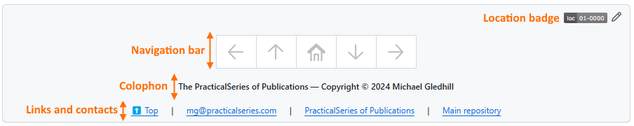
                    </a></td></tr>
<!-- CAPTION -->    <tr><th align="center"><sup>
<!-- CAPTION TEXT -->   Figure 16.31 &mdash; PracticalSeries footer format
                    </sup></th></tr>
</table>                             <!-- FIGURE END  🔼🔼(BLANK LINE BELOW) -->

It is made up of four parts:

<table name="l-16-20" align="center">   <!-- LIST START🔽🔽(BLANK LINE ABOVE) -->
<!-- LIST ROW 01  --><tr><td valign="top">&#x25CF;</td>
    <td><!-- TEXT -->Location badge</td></tr>
<!-- LIST ROW 02  --><tr><td valign="top">&#x25CF;</td>
    <td><!-- TEXT -->Navigation bar</td></tr>
<!-- LIST ROW 03  --><tr><td valign="top">&#x25CF;</td>
    <td><!-- TEXT -->Colophon</td></tr>
<!-- LIST ROW 04  --><tr><td valign="top">&#x25CF;</td>
    <td><!-- TEXT -->Links and contacts</td></tr>
<!-- CAPTION -->          <tr><th width="52"></th><!-- SPACER -->
<!-- LIST WIDTH -->         <th align="left" width="798"><sup>
<!-- CAPTION TEXT --><!-- TEXT -->List 16.20 &mdash; Footer components
                           </sup></th></tr>
</table>                              <!-- LIST END    🔼🔼(BLANK LINE BELOW) -->

Each of these is examined in turn in the following sections.

**[:arrow_up: Top](#idtop)**<!-- END OF SECTION - LINK TO TOP🔽🔽(BLANK LINE ABOVE) -->
<HR>                        <!-- END OF SECTION - SEPARATING LINE                    -->
<br>                        <!-- END OF SECTION - PADDING    🔼🔼(BLANK LINE BELOW) -->

### 16.7.1<!--  🟥H3🟥-->Names and locations of the footer files

Footer files for a particular page are called `_footer.md`. These work in exactly the same way as the `_sidebar.md` files discussed in <a href="#1661names-and-locations-of-the-sidebar-filesheading_level_3">section&nbsp;16.6.1</a> and are stored in exactly the same folder as the associated sidebar. See <a href="#1661names-and-locations-of-the-sidebar-filesheading_level_3">section&nbsp;16.6.1</a>

**[:arrow_up: Top](#idtop)**<!-- END OF SECTION - LINK TO TOP🔽🔽(BLANK LINE ABOVE) -->
<HR>                        <!-- END OF SECTION - SEPARATING LINE                    -->
<br>                        <!-- END OF SECTION - PADDING    🔼🔼(BLANK LINE BELOW) -->

### 16.7.2<!--  🟥H3🟥-->Location badge

The location badge (top-right of the footer) is identical to that of the associate sidebar. It has the following Markdown:


<table name="t-16-49" align="center"><!-- 🔴🟢🔵TABLE START🔽🔽(BLANK LINE ABOVE) -->
<!-- TOP & WIDTH --><tr><th width="850" align="right"><sup>Markdown
                    </sup></th></tr>
<!-- Header row --> <tr>
                        <th align="left">${\large \color{#0050C0}\text{M\ A\ R\ K\ D\ O\ W\ N}}$ 🔽</th>
                    </tr>
<!-- MD row -->     <tr><td align="left"><br><!-- 🔴MARKDOWN BELOW🔴 -->

```md
<p align="right"><!-- LOCATION BADGE -->
```
<p> </p></td></tr><!-- 🔴MARKDOWN END OF ROW🔴 -->
<!-- CAPTION -->    <tr><th align="left"><sup>
<!-- CAPTION TEXT -->Table 16.49 &mdash; Footer location badge
</table>                             <!-- 🟥🟩🟦TABLE END  🔼🔼(BLANK LINE BELOW) -->

It is simply a right aligned version of the <a href="https://shields.io/">Shields.IO</a> badge used in the sidebar (see <a href="#1662sidebar-title-and-location-badge">section&nbsp;16.6.2</a>). Everything within the ` tag can be copied from the associated sidebar and pasted into the footer.

**[:arrow_up: Top](#idtop)**<!-- END OF SECTION - LINK TO TOP🔽🔽(BLANK LINE ABOVE) -->
<HR>                        <!-- END OF SECTION - SEPARATING LINE                    -->
<br>                        <!-- END OF SECTION - PADDING    🔼🔼(BLANK LINE BELOW) -->

### 16.7.3<!--  🟥H3🟥-->Navigation bar

The footer navigation bar is identical to that of the sidebar associated with the same page, it can be copied and pasted directly from that sidebar. See <a href="#1663navigation-bar">section&nbsp;16.6.3</a> and <a href="15-navigation-bars,-badges-and-buttons#151navigation-bars">section&nbsp;15.1</a>

**[:arrow_up: Top](#idtop)**<!-- END OF SECTION - LINK TO TOP🔽🔽(BLANK LINE ABOVE) -->
<HR>                        <!-- END OF SECTION - SEPARATING LINE                    -->
<br>                        <!-- END OF SECTION - PADDING    🔼🔼(BLANK LINE BELOW) -->

### 16.7.4<!--  🟥H3🟥-->Colophon

The colophon contains the publisher and copyright information for the Wiki:

<table name="f-16-32" align="center"><!-- FIGURE START🔽🔽(BLANK LINE ABOVE) -->
<!-- Figure row --> <tr><td>
<!-- LINK -->         <a href="../16-0600//02-images/figm-16-32.png" title="Use ctrl+click to open image in new tab">
<!-- FIGURE -->         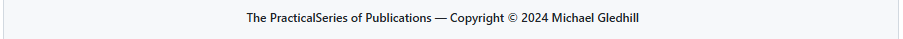
                    </a></td></tr>
<!-- CAPTION -->    <tr><th align="center"><sup>
<!-- CAPTION TEXT -->   Figure 16.32 &mdash; Footer colophon
                    </sup></th></tr>
</table>                             <!-- FIGURE END  🔼🔼(BLANK LINE BELOW) -->

This is the code:


<table name="t-16-50" align="center"><!-- 🔴🟢🔵TABLE START🔽🔽(BLANK LINE ABOVE) -->
<!-- TOP & WIDTH --><tr><th width="850" align="right"><sup>Markdown
                    </sup></th></tr>
<!-- Header row --> <tr>
                        <th align="left">${\large \color{#0050C0}\text{M\ A\ R\ K\ D\ O\ W\ N}}$ 🔽</th>
                    </tr>
<!-- MD row -->     <tr><td align="left"><br><!-- 🔴MARKDOWN BELOW🔴 -->

```md
<!--- COLOPHON -->
<p align="center"><strong><!-- NAME -->The PracticalSeries of Publications&nbsp;&mdash;&nbsp;<!-- COPYRGT -->Copyright &copy; 2024 Michael Gledhill</strong></p>
```
<p> </p></td></tr><!-- 🔴MARKDOWN END OF ROW🔴 -->
<!-- CAPTION -->    <tr><th align="left"><sup>
<!-- CAPTION TEXT -->Table 16.50 &mdash; Footer colophon
</table>                             <!-- 🟥🟩🟦TABLE END  🔼🔼(BLANK LINE BELOW) -->

It is simply a centred text string containing the publisher and the copyright owner.


**[:arrow_up: Top](#idtop)**<!-- END OF SECTION - LINK TO TOP🔽🔽(BLANK LINE ABOVE) -->
<HR>                        <!-- END OF SECTION - SEPARATING LINE                    -->
<br>                        <!-- END OF SECTION - PADDING    🔼🔼(BLANK LINE BELOW) -->

### 16.7.5<!--  🟥H3🟥-->Links and contacts

The markdown for this is:

<table name="t-16-51" align="center"><!-- 🔴🟢🔵TABLE START🔽🔽(BLANK LINE ABOVE) -->
<!-- TOP & WIDTH --><tr><th width="850" align="right"><sup>Markdown
                    </sup></th></tr>
<!-- Header row --> <tr>
                        <th align="left">${\large \color{#0050C0}\text{M\ A\ R\ K\ D\ O\ W\ N}}$ 🔽</th>
                    </tr>
<!-- MD row -->     <tr><td align="left"><br><!-- 🔴MARKDOWN BELOW🔴 -->

```md
<!--- LINKS AND LOCATION BADGE -->
<p align="center">
<!-- TOP   --><a href="#idtop">⬆️ Top</a>&nbsp;&emsp;&nbsp;|&nbsp;&emsp;
<!-- EMAIL --><a href="mailto:mg@practicalseries.com">mg@practicalseries.com</a>&nbsp;&emsp;&nbsp;|&nbsp;&emsp;
<!-- WEB   --><a href="https://practicalseries.com/">PracticalSeries of Publications</a>&nbsp;&emsp;&nbsp;|&nbsp;&emsp;
<!-- REPO  --><a href="https://github.com/practicalseries/GitHub-Wiki-Design-and-Implementation">Main repository</a></p>
```
<p> </p></td></tr><!-- 🔴MARKDOWN END OF ROW🔴 -->
<!-- CAPTION -->    <tr><th align="left"><sup>
<!-- CAPTION TEXT -->Table 16.51 &mdash; Footer colophon
</table>                             <!-- 🟥🟩🟦TABLE END  🔼🔼(BLANK LINE BELOW) -->

It is simply four links, the first, a standard link to the top of the page, the second is an email link, the third a link to the associated website and the fourth a link to the parent repository.

<br><br>            <!-- END OF PAGE - 🟥🟥🟥🟥🟥 PADDING🔽🔽(NO BLANK LINE ABOVE) -->
<hr>                <!-- END OF PAGE - 🟥🟥🟥🟥🟥 SEPARATING LINE                   -->
<a name="idend"></a><!-- END OF PAGE – 🟥🟥🟥🟥🟥 MARKER 🔼🔼                      -->